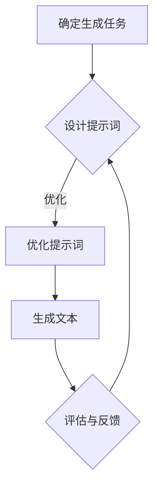
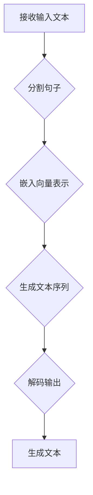

                 


## 提示词工程在自然语言生成中的应用

### 关键词：
- 提示词工程
- 自然语言生成
- 人工智能
- 语言模型
- 应用场景

### 摘要：
本文旨在探讨提示词工程在自然语言生成（NLG）中的应用。通过深入分析提示词工程的基本概念、技术原理、应用场景以及实战案例，本文将为读者提供对这一领域全面而深刻的理解。

### 引言

自然语言生成（NLG）作为人工智能领域的一个重要分支，近年来取得了显著的发展。NLG技术能够将计算机处理的信息以自然语言的形式输出，使得计算机与人类之间的交互更加流畅和自然。在诸多应用场景中，NLG技术已展现出其强大的能力，如自动摘要、问答系统、对话系统等。

随着NLG技术的不断发展，提示词工程（Prompt Engineering）逐渐成为研究者和开发者关注的焦点。提示词工程旨在通过设计高质量的提示词来优化自然语言生成过程，提高生成的文本质量和用户体验。本文将围绕提示词工程在自然语言生成中的应用展开讨论。

### 核心概念与联系

#### 1. 提示词工程的定义与原理

提示词工程是一种设计和优化提示词的方法论，旨在提高自然语言生成的效果。提示词是引导语言模型生成文本的关键因素，它通常是一个短语或句子，用于引导模型理解生成任务的目标和上下文。

提示词工程的基本原理包括以下几个方面：

1. **上下文构建**：通过设计具有丰富上下文的提示词，帮助模型更好地理解生成任务的目标和情境。
2. **词汇选择**：选择具有明确语义和丰富含义的词汇，以增强生成的文本质量。
3. **结构优化**：设计合理的提示词结构，使得生成的文本更加符合人类语言的表达习惯。
4. **反馈迭代**：通过用户反馈不断优化提示词，提高生成的文本质量和用户体验。

#### 1.2 提示词工程与相关技术的对比

| 技术名称 | 定义 | 关联应用 | 对比 |
| --- | --- | --- | --- |
| 语言模型 | 一种基于大规模语料库的模型，用于预测下一个词或句子 | 自动摘要、问答系统、对话系统等 | 提示词工程是语言模型的一个应用方向 |
| 提示词工程 | 设计和优化提示词的方法论，旨在提高自然语言生成的效果 | 自然语言生成任务的各种场景 | 强调提示词的设计和优化 |
| 对抗生成网络（GAN） | 一种生成对抗模型，通过对抗性训练生成与真实数据相似的数据 | 图像生成、语音合成等 | 提示词工程主要关注文本生成 |
| 强化学习 | 一种通过试错和反馈调整策略的机器学习方法 | 游戏AI、推荐系统等 | 提示词工程更多关注文本生成任务 |

#### 1.3 提示词工程的基本流程



### 技术原理讲解

#### 2.1 自然语言生成算法原理

自然语言生成算法通常基于大规模预训练语言模型，如GPT、BERT等。以下是一个简化的自然语言生成算法流程：



#### 2.2 算法流程详细讲解

1. **输入文本分割**：将输入的文本分割成句子或词组。
2. **嵌入向量表示**：使用预训练的语言模型将句子或词组转换为嵌入向量表示。
3. **生成文本序列**：通过模型预测下一个词或句子，生成文本序列。
4. **解码输出**：将生成的文本序列解码为自然语言输出。

#### 2.3 算法数学模型和公式

自然语言生成算法通常基于自回归语言模型，其基本数学模型可以表示为：

$$
P(x_{1:T} | x_{1<t-1}) = \prod_{t=1}^{T} P(x_t | x_{1<t-1})
$$

其中，$x_{1:T}$ 表示生成的文本序列，$P(x_{1:T} | x_{1<t-1})$ 表示在已知前 $t-1$ 个词的情况下，第 $t$ 个词的概率分布。

#### 2.4 Python代码示例

```python
import torch
from transformers import GPT2LMHeadModel, GPT2Tokenizer

# 初始化模型和tokenizer
model = GPT2LMHeadModel.from_pretrained('gpt2')
tokenizer = GPT2Tokenizer.from_pretrained('gpt2')

# 输入文本
input_text = "Hello, how are you?"

# 分割句子并转换为嵌入向量
inputs = tokenizer.encode(input_text, return_tensors='pt')

# 生成文本序列
outputs = model.generate(inputs, max_length=50, num_return_sequences=5)

# 解码输出
generated_texts = [tokenizer.decode(output, skip_special_tokens=True) for output in outputs]

# 打印生成的文本
for text in generated_texts:
    print(text)
```

### 应用场景

#### 3.1 在问答系统中的应用

问答系统是自然语言生成应用的一个重要场景。通过提示词工程，可以设计高质量的提问，从而提高问答系统的回答质量和用户体验。例如：

```python
prompt = "请问您有什么问题需要咨询吗？"
input_text = "我想了解关于人工智能的发展趋势。"
```

#### 3.2 在自动摘要中的应用

自动摘要是将长文本压缩成短小精悍的摘要。通过提示词工程，可以设计能够引导模型提取关键信息的提示词，从而提高摘要的准确性和可读性。例如：

```python
prompt = "请为一篇关于人工智能的新闻文章生成一个摘要。"
input_text = "近日，人工智能领域发生了一件重要事件..."
```

#### 3.3 在对话系统中的应用

对话系统是自然语言生成技术的重要应用之一。通过提示词工程，可以设计出引导对话的提示词，使得对话系统能够更自然地与用户交互。例如：

```python
prompt = "您好，有什么可以帮助您的吗？"
input_text = "我想要预订一张从北京到上海的机票。"
```

### 实战案例

#### 4.1 环境安装

为了进行自然语言生成任务的实战，首先需要安装相关的环境和库：

```bash
pip install torch transformers
```

#### 4.2 核心代码实现

以下是使用GPT-2模型进行自然语言生成任务的核心代码：

```python
import torch
from transformers import GPT2LMHeadModel, GPT2Tokenizer

# 初始化模型和tokenizer
model = GPT2LMHeadModel.from_pretrained('gpt2')
tokenizer = GPT2Tokenizer.from_pretrained('gpt2')

# 输入文本
input_text = "Hello, how are you?"

# 分割句子并转换为嵌入向量
inputs = tokenizer.encode(input_text, return_tensors='pt')

# 生成文本序列
outputs = model.generate(inputs, max_length=50, num_return_sequences=5)

# 解码输出
generated_texts = [tokenizer.decode(output, skip_special_tokens=True) for output in outputs]

# 打印生成的文本
for text in generated_texts:
    print(text)
```

#### 4.3 应用解读与分析

通过上述代码，我们可以看到自然语言生成的全过程。首先，输入文本被分割成嵌入向量；然后，模型基于这些嵌入向量生成多个可能的文本序列；最后，解码器将生成的序列解码为自然语言输出。通过提示词工程，我们可以设计出更高质量的输入文本，从而优化生成的文本质量。

### 最佳实践与总结

#### 5. 提示词工程最佳实践

1. **上下文构建**：确保提示词具有丰富的上下文信息，以帮助模型更好地理解生成任务的目标和情境。
2. **词汇选择**：选择具有明确语义和丰富含义的词汇，以提高生成的文本质量。
3. **结构优化**：设计合理的提示词结构，使得生成的文本更加符合人类语言的表达习惯。
4. **反馈迭代**：通过用户反馈不断优化提示词，提高生成的文本质量和用户体验。

#### 6. 全书总结与展望

本文围绕提示词工程在自然语言生成中的应用进行了深入探讨。通过介绍核心概念、技术原理、应用场景和实战案例，本文为读者提供了对这一领域全面而深刻的理解。未来，随着人工智能技术的不断发展，提示词工程将在自然语言生成领域发挥越来越重要的作用。

### 作者

作者：AI天才研究院/AI Genius Institute & 禅与计算机程序设计艺术 /Zen And The Art of Computer Programming

