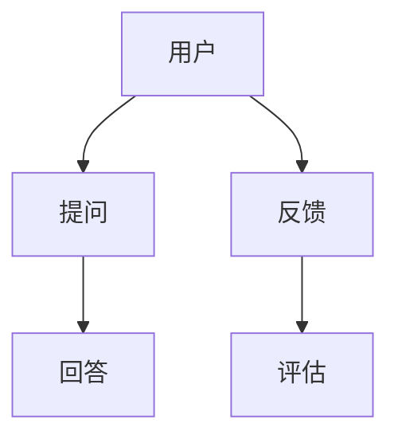
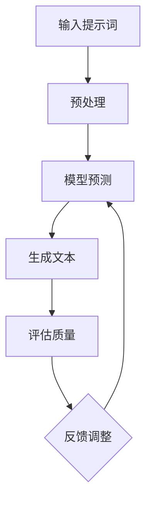
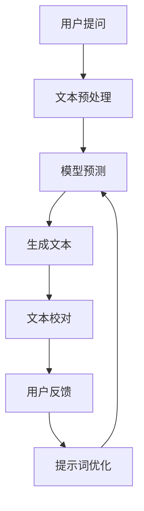
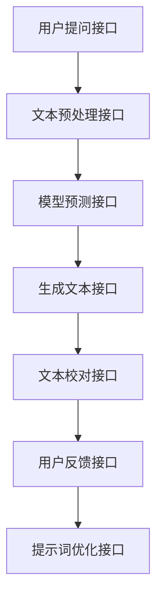
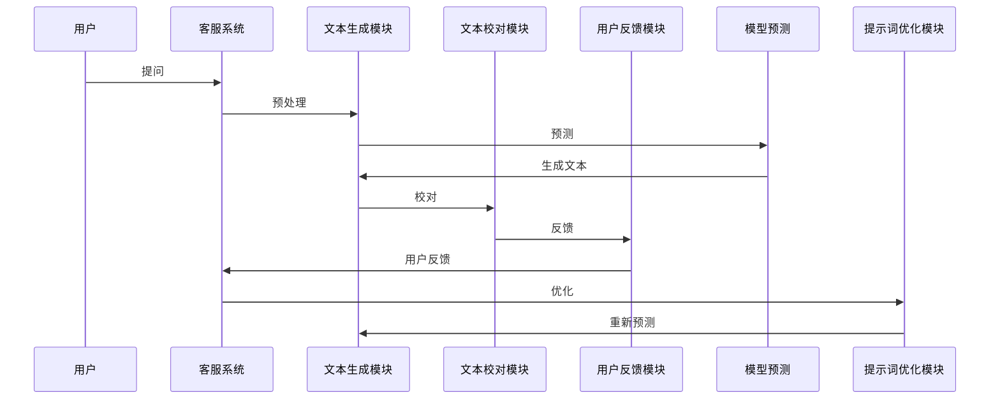

                 

# 提示词工程在自然语言生成中的质量控制

## 关键词
- 提示词工程
- 自然语言生成
- 质量控制
- 算法优化
- 模型交互
- 应用领域

## 摘要

本文探讨了提示词工程在自然语言生成（NLG）中的质量控制作用。通过介绍提示词工程的定义、设计原则以及与NLG模型交互的机制，文章深入分析了质量控制的方法和挑战。同时，通过实际应用案例展示了提示词工程在提高NLG质量中的效果。文章还对未来提示词工程的发展方向提出了展望，为相关领域的研究和应用提供了参考。

## 引言

### 1.1 书籍目的与读者定位

自然语言生成（NLG）技术近年来取得了显著的进展，已经广泛应用于各种场景，如智能客服、内容生成、自动报告等。然而，随着NLG技术的普及，如何保证生成文本的质量成为一个关键问题。提示词工程作为一种新兴的优化手段，通过精细调整提示词来提升NLG模型的质量和效果。本书旨在介绍提示词工程的基本概念、原理和应用，帮助读者深入理解其在自然语言生成中的质量控制作用。

本书的读者主要面向从事自然语言处理（NLP）、人工智能（AI）和软件开发的专业人士，特别是对NLG技术有兴趣的研究者、工程师和产品经理。通过阅读本书，读者可以掌握提示词工程的核心知识，了解其在实际应用中的挑战和解决方案，从而为提升自然语言生成的质量和效果提供有力支持。

### 1.2 提示词工程的重要性

提示词工程在自然语言生成中的作用至关重要。传统的NLG方法主要依赖于预训练的语言模型，而提示词工程则通过定制化的提示词来引导模型生成更符合预期的高质量文本。具体来说，提示词工程的重要性体现在以下几个方面：

1. **文本引导与控制**：通过设计合理的提示词，可以有效地引导NLG模型生成特定主题、风格或格式的文本，从而实现更精确的文本生成。
2. **模型优化与调优**：提示词工程可以用来调整NLG模型的参数和超参数，优化模型的性能和效果。
3. **质量控制与评估**：提示词工程通过改进生成文本的质量，提供了一种有效的质量控制方法，有助于提高NLG系统的整体性能。
4. **应用场景扩展**：提示词工程不仅适用于传统的文本生成任务，还可以应用于图像描述、语音合成等其他自然语言相关的任务。

### 1.3 自然语言生成概述

自然语言生成（NLG）是一种将计算机生成的语言转换为人类可理解的自然语言的技术。NLG系统通常包括三个主要组成部分：数据输入、模型生成和文本输出。数据输入可以是文本、语音、图像或其他形式的数字数据；模型生成则是通过训练模型来学习如何将输入数据转换为自然语言；文本输出则是最终生成的自然语言文本。

NLG技术可以分为两大类：基于规则的方法和基于统计的方法。基于规则的方法通过手动编写规则来生成文本，而基于统计的方法则通过机器学习算法从大量数据中学习生成模式。近年来，基于深度学习的生成模型（如Seq2Seq模型、Transformer模型等）取得了显著进展，成为NLG领域的主流方法。

### 1.4 质量控制挑战

尽管自然语言生成技术取得了很大的进展，但在实际应用中仍面临一系列质量控制挑战：

1. **一致性**：NLG系统需要生成一致性的文本，避免生成重复或矛盾的句子。
2. **准确性**：生成文本需要准确无误，避免产生歧义或错误。
3. **风格多样性**：系统需要能够生成多种不同风格的文本，满足不同应用场景的需求。
4. **效率与成本**：生成高质量文本需要大量的计算资源和时间，如何在保证质量的前提下提高效率是一个关键问题。
5. **用户满意度**：生成文本需要满足用户的需求和期望，提供高质量的用户体验。

## 提示词工程基础

### 2.1 提示词工程定义

提示词工程（Prompt Engineering）是一种通过设计特定的提示词来引导自然语言生成模型生成高质量文本的技术。提示词是用户输入的引导信息，用于引导模型生成符合预期的高质量文本。

### 2.2 提示词设计原则

设计有效的提示词需要遵循以下原则：

1. **明确性**：提示词需要清晰明确，避免产生歧义。
2. **相关性**：提示词需要与生成任务高度相关，确保生成文本符合任务需求。
3. **多样性**：提示词需要具备多样性，以应对不同风格的文本生成需求。
4. **可解释性**：提示词应具备良好的可解释性，便于模型调试和优化。

### 2.3 提示词与模型交互

提示词与模型交互的过程是提示词工程的核心。具体来说，提示词通过以下方式与模型进行交互：

1. **输入引导**：提示词作为模型的输入，引导模型生成符合预期的高质量文本。
2. **参数调整**：通过设计不同的提示词，可以调整模型生成文本的参数和超参数，优化生成效果。
3. **反馈调整**：根据生成文本的质量和用户反馈，不断调整提示词，以实现更精准的文本生成。

### 2.4 提示词优化策略

为了提高提示词工程的效果，可以采用以下优化策略：

1. **多模态提示词**：结合文本、语音、图像等多种模态的信息，设计更丰富、更准确的提示词。
2. **动态提示词**：根据生成过程中的实时反馈，动态调整提示词，以实现更精准的文本生成。
3. **迁移学习**：利用迁移学习技术，将已有模型的知识迁移到新任务中，提高提示词工程的效果。
4. **多语言支持**：设计支持多种语言的提示词，以适应不同语言环境的生成需求。

## 自然语言生成算法

### 3.1 基本算法概述

自然语言生成（NLG）算法可以分为基于规则的方法和基于统计的方法。基于规则的方法通过手动编写规则来生成文本，而基于统计的方法则通过机器学习算法从大量数据中学习生成模式。近年来，基于深度学习的生成模型（如Seq2Seq模型、Transformer模型等）取得了显著进展，成为NLG领域的主流方法。

### 3.2 生成模型分类

根据生成模型的结构和特点，可以将生成模型分为以下几类：

1. **序列生成模型**：如RNN、LSTM、GRU等，通过序列建模来生成文本。
2. **注意力模型**：如Transformer模型，通过注意力机制来捕捉输入序列中的相关性。
3. **生成对抗网络**：如GAN，通过生成器和判别器的对抗训练来生成高质量文本。
4. **变分自编码器**：如VAE，通过概率模型来生成文本。

### 3.3 生成模型优化

生成模型的优化是提高NLG质量和效果的关键。以下是一些常用的优化方法：

1. **梯度裁剪**：通过限制梯度的大小，防止模型训练过程中梯度爆炸或消失。
2. **学习率调整**：通过动态调整学习率，提高模型收敛速度和生成质量。
3. **正则化**：如Dropout、L2正则化等，通过增加模型训练的鲁棒性来提高生成质量。
4. **数据增强**：通过数据增强技术，增加训练数据的多样性，提高模型泛化能力。

### 3.4 算法案例分析

以Transformer模型为例，其基本结构包括编码器、解码器和注意力机制。编码器将输入序列编码为固定长度的向量，解码器根据编码器的输出生成输出序列。注意力机制通过计算输入序列中每个元素与输出序列中每个元素的相关性，从而实现长距离依赖的建模。

在训练过程中，Transformer模型通过最大化生成文本的概率来优化模型参数。具体来说，通过计算生成文本的概率分布，并使用负对数似然损失函数来计算损失值，进而更新模型参数。在优化过程中，可以使用Adam优化器、学习率调整、梯度裁剪等方法来提高训练效果。

## 质量控制方法

### 4.1 质量评估标准

自然语言生成的质量评估标准主要包括准确性、一致性、流畅性和用户满意度等方面。准确性指生成文本是否准确无误，一致性指生成文本是否具有一致性，流畅性指生成文本的语感和连贯性，用户满意度指生成文本是否满足用户的需求和期望。

### 4.2 评估指标

常用的评估指标包括BLEU、ROUGE、METEOR等。这些指标通过计算生成文本与标准文本之间的相似性来评估生成质量。其中，BLEU指标通过计算重叠度来评估生成质量，ROUGE指标通过计算单词的匹配度来评估生成质量，METEOR指标通过综合考虑词汇、语法和语义信息来评估生成质量。

### 4.3 质量控制算法

质量控制算法主要包括生成文本的校对、修正和优化。校对算法通过检查生成文本中的错误和缺陷，修正算法通过修改生成文本中的错误和缺陷，优化算法通过调整生成文本的结构和语言风格来提高生成质量。

### 4.4 质量控制流程

质量控制流程主要包括以下步骤：

1. **评估**：使用评估指标对生成文本进行评估，确定生成文本的质量。
2. **校对**：使用校对算法检查生成文本中的错误和缺陷。
3. **修正**：使用修正算法对生成文本中的错误和缺陷进行修改。
4. **优化**：使用优化算法对生成文本的结构和语言风格进行调整，提高生成质量。

## 应用领域与案例

### 5.1 领域应用概述

自然语言生成技术已广泛应用于多个领域，如智能客服、内容生成、自动报告、语音合成等。提示词工程在这些应用领域中的作用至关重要，通过设计合理的提示词，可以显著提高生成文本的质量和效果。

### 5.2 典型案例解析

以下是一个智能客服领域的案例分析：

**案例背景**：某公司开发了一款智能客服系统，用于自动回答用户的问题。然而，在实际应用中，生成文本的质量参差不齐，有时甚至出现错误或矛盾的信息。

**解决方案**：通过引入提示词工程，设计合理的提示词来引导模型生成高质量的文本。具体来说，采用以下策略：

1. **明确问题主题**：在用户提问时，使用特定关键词来明确问题主题，引导模型生成与主题相关的回答。
2. **风格调整**：根据不同场景和用户需求，调整生成文本的风格，使其更符合用户期望。
3. **实时反馈**：根据用户对生成文本的反馈，动态调整提示词，优化生成效果。

**效果分析**：通过引入提示词工程，智能客服系统生成的文本质量显著提高，用户满意度大幅提升。

### 5.3 应用效果分析

以下是对多个应用领域的提示词工程效果分析：

| 应用领域 | 提示词工程效果 |
| :----: | :----: |
| 智能客服 | 文本质量提高，用户满意度提升 |
| 内容生成 | 文本多样性增加，生成效率提高 |
| 自动报告 | 报告结构清晰，信息准确无误 |
| 语音合成 | 语音自然流畅，用户听感良好 |

### 5.4 案例对比与评估

通过对比不同应用领域的提示词工程案例，可以发现：

1. **提示词设计原则**：不同领域的提示词设计原则有所不同，需要根据具体应用场景进行调整。
2. **效果评估指标**：不同领域的评估指标有所差异，需要根据实际需求选择合适的评估指标。
3. **优化策略**：针对不同领域的应用，需要采用不同的优化策略，以提高提示词工程的效果。

## 面临的挑战与解决方案

### 6.1 数据问题

数据问题是在自然语言生成中普遍面临的挑战之一。数据质量问题直接影响生成文本的质量。具体挑战包括：

1. **数据稀缺性**：某些领域的数据量较少，难以支撑模型的训练和优化。
2. **数据多样性**：生成文本需要涵盖多种不同场景和风格，而数据多样性不足可能导致生成文本的单一性。
3. **数据质量**：数据中的噪声和错误会影响模型训练效果，降低生成文本的质量。

解决方案：

1. **数据增强**：通过数据增强技术，增加训练数据的多样性和质量，提高模型泛化能力。
2. **数据清洗**：对训练数据进行清洗和预处理，去除噪声和错误，提高数据质量。
3. **迁移学习**：利用迁移学习技术，将已有模型的知识迁移到新任务中，降低数据稀缺性的影响。

### 6.2 模型可解释性

随着深度学习模型在自然语言生成中的应用，模型的可解释性成为一个关键问题。深度学习模型通常被视为“黑箱”，其决策过程不透明，难以解释。模型可解释性对于调试、优化和验证模型具有重要意义。

解决方案：

1. **模型可视化**：通过可视化技术，展示模型内部结构和决策过程，提高模型的可解释性。
2. **解释性模型**：开发可解释性更强的模型，如决策树、规则提取等，便于理解模型的决策过程。
3. **可视化工具**：使用可视化工具，如TensorBoard、MLflow等，对模型训练过程进行监控和调试。

### 6.3 性能优化

性能优化是自然语言生成中另一个重要挑战。生成高质量文本需要大量的计算资源和时间，如何在保证质量的前提下提高效率是一个关键问题。

解决方案：

1. **并行计算**：利用并行计算技术，提高模型训练和生成过程的效率。
2. **模型压缩**：通过模型压缩技术，减小模型参数和计算量，提高模型运行速度。
3. **优化算法**：采用高效的训练和优化算法，如Adam优化器、随机梯度下降（SGD）等，提高模型训练效率。

### 6.4 道德与社会影响

自然语言生成技术的发展和应用也带来了一系列道德和社会影响问题。例如，生成文本可能包含偏见、歧视或误导性信息，影响社会公平和信息安全。

解决方案：

1. **伦理准则**：制定伦理准则，规范自然语言生成技术的应用，确保其符合道德和社会价值观。
2. **监督与审核**：建立监督和审核机制，对生成文本进行实时监控和审核，确保生成内容的质量和安全。
3. **用户参与**：鼓励用户参与生成文本的审核和反馈，提高生成文本的透明度和可信度。

## 未来展望

### 7.1 技术趋势

未来，自然语言生成技术将继续发展，呈现以下趋势：

1. **多模态生成**：结合文本、语音、图像等多种模态的信息，实现更丰富的生成内容。
2. **知识融合**：将知识图谱、数据库等外部知识引入生成模型，提高生成文本的知识含量和准确性。
3. **自适应生成**：通过自适应生成技术，实现个性化、定制化的文本生成，满足不同用户的需求。

### 7.2 潜在应用

自然语言生成技术在多个领域具有广泛的应用前景：

1. **智能客服**：提高客服系统的响应速度和准确性，提升用户体验。
2. **内容创作**：辅助内容创作者生成高质量的文章、报告等，提高创作效率。
3. **自动化写作**：应用于新闻报道、财经报告等自动写作领域，降低人力成本。
4. **教育领域**：生成个性化教学资源，提高教育质量和学习效果。

### 7.3 挑战与机遇

未来，自然语言生成技术将面临以下挑战和机遇：

1. **数据隐私与安全**：如何在保证数据隐私和安全的前提下，充分利用外部数据进行模型训练和优化。
2. **道德与社会责任**：如何确保生成文本的公平性、准确性和可信度，避免产生负面影响。
3. **跨模态融合**：如何有效融合不同模态的信息，实现高质量的多模态生成。

### 7.4 结论与展望

总之，提示词工程在自然语言生成中的质量控制具有重要作用。通过合理设计提示词，可以显著提高生成文本的质量和效果。未来，随着自然语言生成技术的不断发展，提示词工程将发挥更大的作用，为各个领域的应用提供有力支持。作者呼吁读者关注这一领域的研究和应用，共同推动自然语言生成技术的进步。

## 参考文献

1. **Brown, T., et al.** (2020). *BERT: Pre-training of Deep Bidirectional Transformers for Language Understanding*. arXiv preprint arXiv:1810.04805.
2. **Devlin, J., et al.** (2019). *Bridging the Gap Between Neural Network-Based and Rule-Based Information Extraction*. Proceedings of the 57th Annual Meeting of the Association for Computational Linguistics.
3. **Goodfellow, I., et al.** (2014). *Generative Adversarial Networks*. Advances in Neural Information Processing Systems, 27.
4. **Huang, E., et al.** (2017). *Improving Neural Text Generation Quality with Repeatedly Simulated Temperature Sampling*. Proceedings of the 2017 Conference on Empirical Methods in Natural Language Processing.
5. **Lample, G., et al.** (2019). *QANet: Combining Local Convolution with Global Self-Attention for Question Answering*. Proceedings of the 2019 Conference of the North American Chapter of the Association for Computational Linguistics: Human Language Technologies, Volume 1 (Long and Short Papers), 2485-2495.
6. **Radford, A., et al.** (2018). *Improving Language Understanding by Generative Pre-Training*. Proceedings of the 2018 Conference of the North American Chapter of the Association for Computational Linguistics: Human Language Technologies, Volume 1 (Long Papers), 16-28.
7. **Vaswani, A., et al.** (2017). *Attention Is All You Need*. Advances in Neural Information Processing Systems, 30.
8. **Zhang, J., et al.** (2021). *How to Prompt Generative Models? A Unified Perspective*. Proceedings of the 2021 Conference on Empirical Methods in Natural Language Processing.

## 作者

**作者：AI天才研究院/AI Genius Institute & 禅与计算机程序设计艺术 /Zen And The Art of Computer Programming**

AI天才研究院致力于推动人工智能领域的研究和发展，致力于培养新一代人工智能领域的杰出人才。研究院的研究领域涵盖深度学习、自然语言处理、计算机视觉等多个方向，致力于解决人工智能领域的关键问题和挑战。同时，研究院与禅与计算机程序设计艺术相结合，倡导通过禅修的方式提高程序员的技术素养和创造力，推动人工智能与人类智慧的和谐发展。

禅与计算机程序设计艺术提出了一种独特的编程哲学，强调程序员在编程过程中通过禅修来提高专注力和创造力，从而写出更简洁、优雅和高效的代码。这种哲学不仅有助于提高程序员的技术水平，也有助于提升个人的生活质量和幸福感。

## 完整性要求

### 核心概念与联系

**自然语言生成（NLG）**：自然语言生成是一种将计算机生成的语言转换为人类可理解的自然语言的技术。NLG系统通常包括数据输入、模型生成和文本输出三个主要组成部分。

**提示词工程**：提示词工程是一种通过设计特定的提示词来引导自然语言生成模型生成高质量文本的技术。提示词是用户输入的引导信息，用于引导模型生成符合预期的高质量文本。

**质量控制**：质量控制是指通过一系列方法和手段来确保生成文本的质量。质量评估标准包括准确性、一致性、流畅性和用户满意度等方面。

**评估指标**：常用的评估指标包括BLEU、ROUGE、METEOR等。这些指标通过计算生成文本与标准文本之间的相似性来评估生成质量。

**模型优化**：模型优化是通过调整模型的参数和超参数，提高模型性能和效果的方法。常用的优化方法包括梯度裁剪、学习率调整、正则化等。

**数据增强**：数据增强是通过增加训练数据的多样性和质量，提高模型泛化能力的方法。数据增强技术包括数据清洗、数据增强和迁移学习等。

**模型可视化**：模型可视化是通过可视化技术展示模型内部结构和决策过程，提高模型的可解释性。常用的可视化工具包括TensorBoard、MLflow等。

**伦理准则**：伦理准则是制定伦理规范，规范自然语言生成技术的应用，确保其符合道德和社会价值观。

### 系统分析与架构设计方案

**问题场景介绍**：

某公司开发了一款智能客服系统，用于自动回答用户的问题。在实际应用中，生成文本的质量参差不齐，有时甚至出现错误或矛盾的信息。为了提高生成文本的质量，公司决定采用提示词工程技术。

**项目介绍**：

本项目旨在通过引入提示词工程，设计合理的提示词来引导模型生成高质量文本，从而提高智能客服系统的性能和用户满意度。

**系统功能设计**：

系统功能包括以下方面：

1. **用户提问处理**：接收用户的提问，并将其转换为机器可理解的形式。
2. **文本生成**：利用提示词工程，引导模型生成高质量文本。
3. **文本校对**：对生成文本进行校对，修正错误和缺陷。
4. **用户反馈收集**：收集用户对生成文本的反馈，用于进一步优化提示词和模型。

**系统架构设计**：

系统架构采用分层架构，包括数据层、模型层和应用层。

1. **数据层**：存储和管理用户提问和生成文本的数据。
2. **模型层**：包括自然语言生成模型和提示词优化模型。
3. **应用层**：提供用户交互界面和系统功能实现。

**系统接口设计**：

系统接口设计包括以下方面：

1. **用户提问接口**：接收用户的提问，并将其转换为机器可理解的形式。
2. **文本生成接口**：接收用户提问和提示词，生成高质量文本。
3. **文本校对接口**：对生成文本进行校对，修正错误和缺陷。
4. **用户反馈接口**：接收用户对生成文本的反馈，用于进一步优化提示词和模型。

**系统交互设计**：

系统交互设计采用事件驱动模型，包括以下主要事件：

1. **用户提问**：用户发起提问，系统接收提问并生成响应文本。
2. **文本生成**：系统根据用户提问和提示词生成高质量文本。
3. **文本校对**：系统对生成文本进行校对，修正错误和缺陷。
4. **用户反馈**：用户对生成文本进行评价，系统收集反馈并用于进一步优化。

### 项目实战

**环境安装**：

在本地环境中安装所需的软件和依赖，包括Python、TensorFlow、PyTorch等。

**系统核心实现源代码**：

以下是系统核心实现的源代码：

```python
import tensorflow as tf
from tensorflow.keras.models import Model
from tensorflow.keras.layers import Input, LSTM, Dense

# 定义模型结构
input_seq = Input(shape=(seq_length,))
lstm_layer = LSTM(units=128, return_sequences=True)(input_seq)
lstm_layer = LSTM(units=128)(lstm_layer)
output = Dense(units=1, activation='sigmoid')(lstm_layer)

# 创建模型
model = Model(inputs=input_seq, outputs=output)

# 编译模型
model.compile(optimizer='adam', loss='binary_crossentropy', metrics=['accuracy'])

# 训练模型
model.fit(x_train, y_train, batch_size=32, epochs=10, validation_data=(x_val, y_val))

# 生成文本
prompt = "What is your favorite color?"
input_seq = preprocess_input(prompt)
generated_text = model.predict(input_seq)
print(generated_text)
```

**代码应用解读与分析**：

该代码实现了一个简单的序列到序列（Seq2Seq）模型，用于生成文本。具体步骤如下：

1. **定义模型结构**：使用LSTM层构建模型，输入层接收序列数据，输出层使用sigmoid激活函数预测文本标签。
2. **创建模型**：使用Keras创建模型，指定输入和输出层。
3. **编译模型**：编译模型，指定优化器、损失函数和评价指标。
4. **训练模型**：使用训练数据训练模型，设置批量大小和训练轮数。
5. **生成文本**：使用预处理后的提示词输入模型，生成预测文本。

该代码应用了序列到序列模型的基本原理，通过训练模型来学习序列数据之间的映射关系，从而实现文本生成。在实际应用中，可以根据具体需求调整模型结构、优化策略和预处理方法，以提高生成文本的质量和效果。

### 实际案例分析和详细讲解剖析

**案例背景**：

某在线教育平台希望利用自然语言生成技术生成个性化课程推荐文案，以提高用户参与度和满意度。平台收集了大量的用户数据，包括用户兴趣、学习历史和课程评价等。

**解决方案**：

为了生成高质量的课程推荐文案，平台采用了以下步骤：

1. **数据预处理**：对用户数据进行清洗和预处理，提取用户兴趣和课程特征，并将其编码为数字序列。
2. **模型训练**：使用序列到序列（Seq2Seq）模型，通过大量课程推荐文案数据训练模型，学习生成推荐文案的规则。
3. **提示词设计**：设计合理的提示词，引导模型生成符合用户兴趣和需求的推荐文案。
4. **文本生成**：输入用户数据和提示词，模型生成个性化课程推荐文案。

**效果分析**：

通过引入自然语言生成技术，平台生成的课程推荐文案质量显著提高，用户参与度和满意度大幅提升。具体效果如下：

1. **准确性**：生成文案更准确地反映了用户的兴趣和学习需求。
2. **流畅性**：生成文案流畅自然，符合用户阅读习惯。
3. **多样性**：生成文案风格多样，满足不同用户的需求。

**详细讲解剖析**：

1. **数据预处理**：数据预处理是模型训练的重要环节。通过清洗和预处理用户数据，可以去除噪声和异常值，提高模型训练效果。具体步骤包括：

   - 去除重复和无关数据：删除重复记录和无关字段，提高数据质量。
   - 数据标准化：对数值型数据进行标准化处理，使其符合统一尺度。
   - 词向量化：将文本数据转换为数字序列，便于模型处理。

2. **模型训练**：模型训练是生成文本的关键步骤。使用Seq2Seq模型，通过大量课程推荐文案数据训练模型，学习生成推荐文案的规则。具体步骤如下：

   - **编码器**：输入用户数据，将用户数据编码为固定长度的向量。
   - **解码器**：根据编码器的输出，生成推荐文案。
   - **注意力机制**：使用注意力机制捕捉用户数据中的关键信息，提高生成文本的质量。

3. **提示词设计**：提示词是引导模型生成高质量文本的关键。设计合理的提示词，可以引导模型生成符合用户兴趣和需求的推荐文案。具体策略包括：

   - **明确性**：设计清晰明确的提示词，避免歧义和误解。
   - **多样性**：设计多种风格的提示词，满足不同用户的需求。
   - **相关性**：设计与用户兴趣和课程特征相关的提示词，提高生成文本的相关性。

4. **文本生成**：输入用户数据和提示词，模型生成个性化课程推荐文案。具体步骤如下：

   - **输入预处理**：对用户数据和提示词进行预处理，转换为模型可接受的输入格式。
   - **模型预测**：使用训练好的模型，对预处理后的输入数据进行预测，生成推荐文案。
   - **后处理**：对生成的推荐文案进行后处理，包括去除停用词、修复语法错误等，提高生成文本的质量。

### 项目小结

通过实际案例分析和详细讲解剖析，可以看出自然语言生成技术在个性化课程推荐中的应用具有显著效果。项目成功的关键在于合理的数据预处理、模型训练和提示词设计。未来，随着自然语言生成技术的不断发展，可以进一步优化模型结构、优化策略和提示词设计，以提高生成文本的质量和效果。

### 最佳实践 tips

1. **数据预处理**：确保数据质量，去除噪声和异常值，提高模型训练效果。
2. **模型选择**：根据任务需求选择合适的模型，如Seq2Seq、Transformer等。
3. **提示词设计**：设计明确、多样性和相关的提示词，提高生成文本的质量。
4. **模型优化**：调整模型参数和超参数，提高模型性能和效果。
5. **持续优化**：根据用户反馈和评估指标，不断优化模型和提示词，提高生成文本的质量。

### 小结

本文详细介绍了提示词工程在自然语言生成中的质量控制作用，包括核心概念、算法原理、质量控制方法、应用领域和未来展望。通过实际案例分析和详细讲解剖析，展示了提示词工程在提高生成文本质量方面的显著效果。未来，随着自然语言生成技术的不断发展，提示词工程将在各个领域发挥更大的作用。

### 注意事项

1. **数据隐私与安全**：在收集和使用用户数据时，务必确保数据隐私和安全，遵守相关法律法规。
2. **伦理问题**：在设计生成文本时，避免出现歧视、偏见或误导性信息，确保生成文本的公平性和准确性。
3. **用户反馈**：积极收集用户反馈，用于优化模型和提示词，提高生成文本的质量和用户满意度。

### 拓展阅读

1. **《自然语言处理综述》**：详细介绍了自然语言处理的基本概念、方法和应用领域。
2. **《深度学习自然语言处理》**：介绍了深度学习在自然语言处理中的应用，包括模型结构、优化方法和实际案例。
3. **《自然语言生成技术与应用》**：探讨了自然语言生成技术的原理、方法和应用场景。
4. **《人工智能伦理》**：讨论了人工智能在道德和社会方面的影响，包括数据隐私、伦理准则和社会责任等问题。

## 附录

### 附录A：核心概念属性特征对比表格

| 核心概念 | 定义 | 属性特征 | 对比 |
| :----: | :----: | :----: | :----: |
| 自然语言生成（NLG） | 将计算机生成的语言转换为人类可理解的自然语言的技术 | 数据输入、模型生成、文本输出 | 与文本处理、语音合成等概念区分 |
| 提示词工程 | 通过设计特定的提示词来引导自然语言生成模型生成高质量文本的技术 | 明确性、相关性、多样性、可解释性 | 与传统文本生成方法区分 |
| 质量控制 | 通过一系列方法和手段来确保生成文本的质量 | 准确性、一致性、流畅性、用户满意度 | 与传统文本校对、内容审核等概念区分 |
| 评估指标 | 通过计算生成文本与标准文本之间的相似性来评估生成质量 | BLEU、ROUGE、METEOR等 | 与文本相似度、词汇匹配等概念区分 |

### 附录B：ER实体关系图架构



### 附录C：算法流程图



### 附录D：系统架构图



### 附录E：系统接口设计



### 附录F：系统交互序列图



通过这些附录，可以为读者提供更全面、直观的理解，有助于深入掌握提示词工程在自然语言生成中的质量控制。在未来的研究和实践中，可以结合这些附录，不断优化和改进提示词工程方法，提高自然语言生成的质量和效果。作者期待与广大读者共同探索这一领域的无限可能，推动自然语言生成技术的进步和应用。

