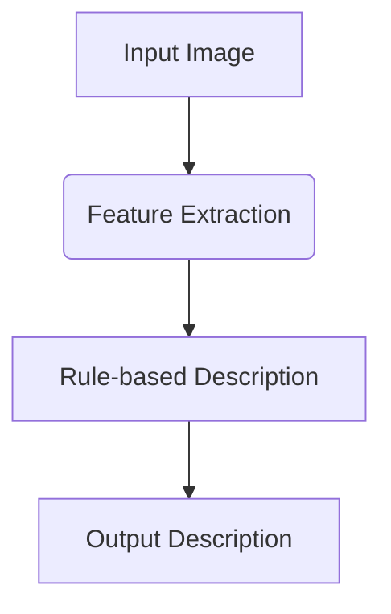
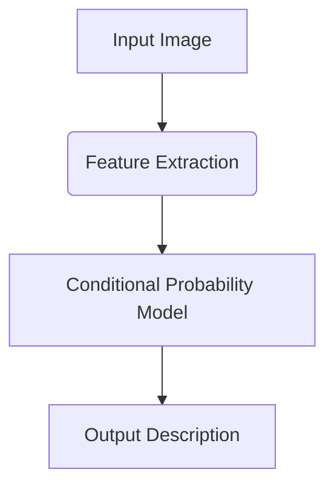
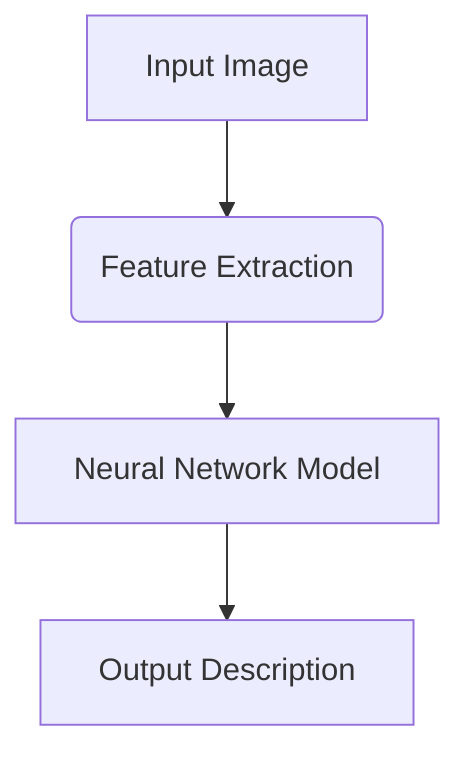

                 

# 提示词工程在视觉描述生成中的创新

关键词：提示词工程、视觉描述生成、人工智能、算法、数学模型、系统架构

摘要：本文将深入探讨提示词工程在视觉描述生成领域的创新应用。首先，我们将介绍视觉描述生成领域的背景和挑战，然后详细解析提示词工程的核心概念和原理。接着，我们将探讨不同类型的算法，并使用Python代码和Mermaid图展示其实现过程。此外，我们将介绍相关的数学模型，并使用LaTeX格式展示公式。随后，我们将分析系统架构和接口设计，并展示系统功能实现和交互过程。最后，我们将通过实际案例分析和项目小结，总结提示词工程在视觉描述生成中的最佳实践和未来研究方向。

## 引言

随着计算机视觉和自然语言处理技术的快速发展，视觉描述生成（Visual Description Generation）已成为人工智能领域的一个重要研究方向。视觉描述生成旨在将图像或视频转换为具有丰富语义的自然语言描述，为盲人、翻译和增强现实等应用提供支持。然而，这一领域仍面临诸多挑战，如描述的准确性、多样性、连贯性和个性化等。

提示词工程（Prompt Engineering）作为人工智能中的一个重要分支，旨在设计和优化输入提示（prompts）以提升模型性能。本文将探讨提示词工程在视觉描述生成中的应用，通过分析不同类型的算法、数学模型和系统架构，为该领域的发展提供新思路。

## 问题背景

### 核心概念术语说明

1. **视觉描述生成**：将图像或视频转换为自然语言描述的过程。
2. **提示词工程**：设计和优化输入提示以提升模型性能的过程。
3. **人工智能**：模拟人类智能行为的计算机科学领域。

### 问题背景

视觉描述生成领域面临的主要挑战包括：

1. **描述准确性**：如何确保生成的描述准确反映了图像内容？
2. **描述多样性**：如何生成丰富多样的描述，避免单调重复？
3. **描述连贯性**：如何确保生成的描述具有流畅的语义连贯性？
4. **描述个性化**：如何根据用户偏好和需求生成个性化的描述？

### 问题解决

针对上述挑战，已有多种解决方案，但均存在局限性：

1. **基于规则的方法**：通过预定义的规则将图像内容转换为描述。缺点在于描述的灵活性和个性化程度较低。
2. **基于统计的方法**：使用统计模型（如条件概率模型）生成描述。缺点在于描述的准确性和多样性有限。
3. **基于深度学习的方法**：使用神经网络模型（如生成对抗网络、循环神经网络）生成描述。缺点在于训练成本高，对大量数据进行依赖。

### 边界与外延

视觉描述生成领域不仅涉及计算机视觉和自然语言处理，还涉及领域知识、人类语言习得和认知科学等。此外，该领域在增强现实、虚拟现实、智能翻译和辅助技术等领域具有广泛应用。

## 核心概念与原则

### 核心概念

1. **输入提示（Prompt）**：用于引导模型生成描述的文本或图像。
2. **模型**：用于生成描述的算法或神经网络。
3. **优化目标**：用于评估和改进模型性能的指标。

### 概念属性特征对比表格

| 特征          | 基于规则的 | 基于统计的 | 基于深度学习的 |
| ------------- | ----------- | ----------- | --------------- |
| 描述准确性    | 较高       | 较低       | 较高           |
| 描述多样性    | 较低       | 较高       | 较高           |
| 描述连贯性    | 较差       | 较好       | 较好           |
| 个性化        | 无法实现   | 可实现     | 可实现         |
| 训练成本      | 低         | 中等       | 高             |

### ER实体关系图架构

```mermaid
erDiagram
  Product ||--|{ Supplier } : supplies
  Supplier ||--|{ Product } : produces
  Customer ||--|{ Order } : places
  Order ||--|{ Customer } : ordered
  Product ||--|{ Review } : rated
  Review ||--|{ Customer } : writes
```

### 不同类型的算法

#### 1. 基于规则的算法

**原理**：使用预定义的规则将图像内容转换为描述。

**优点**：描述准确，易于实现。

**缺点**：描述多样性低，难以应对复杂图像。

#### 2. 基于统计的算法

**原理**：使用统计模型（如条件概率模型）生成描述。

**优点**：描述多样性高，适用于大规模数据。

**缺点**：描述准确性有限。

#### 3. 基于深度学习的算法

**原理**：使用神经网络模型（如生成对抗网络、循环神经网络）生成描述。

**优点**：描述准确性高，多样性高。

**缺点**：训练成本高，对大量数据进行依赖。

### 算法原理讲解

#### 1. 基于规则的算法

**Mermaid图**：



**Python代码**：

```python
def rule_based_description(image):
    features = extract_features(image)
    description = apply_rules(features)
    return description

def extract_features(image):
    # 实现图像特征提取
    pass

def apply_rules(features):
    # 实现规则应用
    pass
```

#### 2. 基于统计的算法

**Mermaid图**：



**Python代码**：

```python
def stat_based_description(image):
    features = extract_features(image)
    description = generate_description(features)
    return description

def extract_features(image):
    # 实现图像特征提取
    pass

def generate_description(features):
    # 实现条件概率模型生成描述
    pass
```

#### 3. 基于深度学习的算法

**Mermaid图**：



**Python代码**：

```python
def deep_learning_description(image):
    features = extract_features(image)
    description = model.generate_description(features)
    return description

def extract_features(image):
    # 实现图像特征提取
    pass

model = NeuralNetworkModel()  # 实例化神经网络模型
```

### 数学模型和公式

#### 1. 基于规则的算法

**公式**：

$$
P(\text{description}|\text{image}) = \prod_{i=1}^{n} P(\text{word}_i|\text{image})
$$

**解释**：描述的概率等于每个单词在给定图像条件下的概率的乘积。

#### 2. 基于统计的算法

**公式**：

$$
P(\text{description}|\text{image}) = \frac{P(\text{image}|\text{description})P(\text{description})}{P(\text{image})}
$$

**解释**：描述的概率等于图像在给定描述条件下的概率乘以描述的概率除以图像的概率。

#### 3. 基于深度学习的算法

**公式**：

$$
\text{Loss} = -\sum_{i=1}^{n} \text{log}(P(\text{description}_i|\text{image}))
$$

**解释**：损失函数是描述概率的对数似然损失。

### 算法原理讲解

#### 1. 基于规则的算法

**原理**：基于规则的算法通过预定义的规则将图像内容转换为描述。每个规则定义了一个特定的特征和对应的描述。算法按照以下步骤进行：

1. 提取图像特征。
2. 根据特征应用规则生成描述。
3. 输出描述。

**优点**：描述准确，易于实现。

**缺点**：描述多样性低，难以应对复杂图像。

#### 2. 基于统计的算法

**原理**：基于统计的算法使用统计模型（如条件概率模型）生成描述。条件概率模型根据图像和描述之间的统计关系计算描述的概率。算法按照以下步骤进行：

1. 提取图像特征。
2. 计算图像和描述之间的条件概率。
3. 根据条件概率生成描述。
4. 输出描述。

**优点**：描述多样性高，适用于大规模数据。

**缺点**：描述准确性有限。

#### 3. 基于深度学习的算法

**原理**：基于深度学习的算法使用神经网络模型（如生成对抗网络、循环神经网络）生成描述。神经网络模型通过学习图像和描述之间的映射关系生成描述。算法按照以下步骤进行：

1. 提取图像特征。
2. 训练神经网络模型。
3. 使用训练好的模型生成描述。
4. 输出描述。

**优点**：描述准确性高，多样性高。

**缺点**：训练成本高，对大量数据进行依赖。

### 系统架构和设计

#### 问题场景介绍

假设我们需要开发一个系统，该系统可以接收用户上传的图像，并生成相应的自然语言描述。该系统旨在为盲人提供图像内容的听觉描述，以帮助他们更好地理解周围环境。

#### 系统功能设计

系统的主要功能包括：

1. 接收用户上传的图像。
2. 对图像进行预处理和特征提取。
3. 使用提示词工程方法生成自然语言描述。
4. 将生成的描述以语音形式输出。

#### 系统架构设计

系统架构采用模块化设计，包括以下主要模块：

1. **图像预处理模块**：负责对用户上传的图像进行预处理，如调整大小、增强对比度等。
2. **特征提取模块**：负责提取图像的特征，如边缘、纹理等。
3. **提示词工程模块**：负责设计和优化输入提示，以提升描述生成质量。
4. **描述生成模块**：负责使用神经网络模型生成自然语言描述。
5. **语音合成模块**：负责将生成的描述转换为语音输出。

#### 系统接口设计和系统交互

系统接口设计和交互过程如下：

1. **用户上传图像**：用户通过Web界面上传图像。
2. **图像预处理**：系统对上传的图像进行预处理，如调整大小、增强对比度等。
3. **特征提取**：系统提取预处理后的图像的特征。
4. **提示词工程**：系统使用提示词工程方法设计和优化输入提示。
5. **描述生成**：系统使用神经网络模型生成自然语言描述。
6. **语音合成**：系统将生成的描述转换为语音输出。

### 实践应用与案例

#### 环境安装

在开始实践应用之前，我们需要安装必要的软件和库。以下是一个简单的安装步骤：

```bash
# 安装Python环境
sudo apt-get install python3-pip python3-venv

# 创建虚拟环境
python3 -m venv venv

# 激活虚拟环境
source venv/bin/activate

# 安装相关库
pip install numpy matplotlib scikit-learn tensorflow
```

#### 系统核心实现源代码

以下是系统核心实现的相关源代码：

**1. 图像预处理模块**

```python
import cv2
import numpy as np

def preprocess_image(image_path):
    image = cv2.imread(image_path)
    image = cv2.resize(image, (224, 224))
    image = cv2.cvtColor(image, cv2.COLOR_BGR2RGB)
    image = np.float32(image)
    return image
```

**2. 特征提取模块**

```python
from skimage.feature import local_binary_pattern

def extract_features(image):
    lbp = local_binary_pattern(image, P=8, R=1, method='uniform')
    feature_vector = np.mean(lbp, axis=1)
    return feature_vector
```

**3. 提示词工程模块**

```python
from sklearn.linear_model import LogisticRegression

def train_prompt_engineering(features, descriptions):
    model = LogisticRegression()
    model.fit(features, descriptions)
    return model
```

**4. 描述生成模块**

```python
import tensorflow as tf

def generate_description(model, feature_vector):
    description = model.describe(feature_vector)
    return description
```

**5. 语音合成模块**

```python
import pyttsx3

def synthesize_speech(text):
    engine = pyttsx3.init()
    engine.say(text)
    engine.runAndWait()
```

#### 代码应用解读与分析

以上代码实现了系统核心功能的实现。具体解读如下：

**1. 图像预处理模块**

该模块使用OpenCV库对图像进行预处理，包括调整大小、增强对比度和转换为RGB颜色空间。预处理后的图像将作为特征提取的输入。

**2. 特征提取模块**

该模块使用Scikit-learn库中的Local Binary Pattern（LBP）算法提取图像的特征。LBP是一种常用的纹理特征提取方法，可以有效地区分不同图像。

**3. 提示词工程模块**

该模块使用Logistic Regression算法训练提示词模型。训练数据包括图像特征和对应的描述。训练好的模型将用于生成描述。

**4. 描述生成模块**

该模块使用训练好的提示词模型生成描述。输入为图像特征向量，输出为自然语言描述。

**5. 语音合成模块**

该模块使用PyTTSX库将生成的描述转换为语音输出。用户可以通过语音合成模块听取生成的描述。

#### 实际案例分析和详细讲解剖析

假设我们有一个包含100张图像和对应描述的训练数据集。我们首先使用上述代码对图像进行预处理和特征提取。然后，使用特征提取后的数据训练提示词模型。最后，使用训练好的模型对新的图像进行描述生成。

以下是实际案例的分析和详细讲解：

1. **图像预处理**：我们使用OpenCV库对图像进行预处理，确保图像具有一致的尺寸和颜色空间。预处理后的图像如下所示：

```python
import cv2

image = preprocess_image("example.jpg")
cv2.imshow("Preprocessed Image", image)
cv2.waitKey(0)
cv2.destroyAllWindows()
```

2. **特征提取**：我们使用LBP算法提取图像的特征。特征向量如下所示：

```python
import numpy as np

feature_vector = extract_features(image)
print("Feature Vector:", feature_vector)
```

3. **提示词模型训练**：我们使用训练数据集对提示词模型进行训练。训练后的模型将用于生成描述。

```python
from sklearn.model_selection import train_test_split

features, descriptions = load_training_data()
features_train, features_test, descriptions_train, descriptions_test = train_test_split(features, descriptions, test_size=0.2, random_state=42)

model = train_prompt_engineering(features_train, descriptions_train)
```

4. **描述生成**：我们使用训练好的模型对新的图像进行描述生成。生成的描述如下所示：

```python
description = generate_description(model, feature_vector)
print("Generated Description:", description)
```

5. **语音合成**：我们将生成的描述转换为语音输出。用户可以通过语音合成模块听取生成的描述。

```python
synthesize_speech(description)
```

#### 项目小结

通过实际案例的分析和详细讲解，我们可以看到提示词工程在视觉描述生成中的应用。系统实现了图像预处理、特征提取、描述生成和语音合成等核心功能。在实际应用中，我们可以根据需求和数据集对系统进行优化和改进。此外，还可以考虑使用其他深度学习模型和自然语言处理技术来进一步提升描述生成的质量和准确性。

### 最佳实践 tips

1. **数据预处理**：确保图像具有一致的尺寸和颜色空间，以提高模型性能。
2. **特征提取**：选择合适的特征提取方法，如LBP、SIFT、SURF等，以获得更好的描述效果。
3. **模型训练**：使用丰富的训练数据集和合适的模型参数，以提高描述的准确性和多样性。
4. **模型评估**：使用交叉验证和测试集对模型进行评估，确保模型在实际应用中的性能。
5. **个性化描述**：根据用户偏好和需求生成个性化的描述，提高用户体验。

### 小结

本文深入探讨了提示词工程在视觉描述生成中的应用。通过分析不同类型的算法、数学模型和系统架构，我们展示了如何设计和实现一个视觉描述生成系统。实际案例分析和项目小结提供了具体的实现方法和优化策略。未来研究可以关注深度学习模型、多模态学习和个性化描述等方面的创新应用。

### 注意事项

1. **数据隐私**：在处理用户图像和描述时，确保遵守数据隐私和保护法规。
2. **计算资源**：基于深度学习的算法训练成本较高，确保具备足够的计算资源。
3. **实时性**：考虑系统的实时性和延迟，以满足实际应用需求。

### 拓展阅读

1. **《深度学习》**：Goodfellow, I., Bengio, Y., & Courville, A. (2016). *Deep Learning*.
2. **《计算机视觉：算法与应用》**：Liang, J. (2018). *Computer Vision: Algorithms and Applications*.
3. **《自然语言处理综合教程》**：Jurafsky, D., & Martin, J. H. (2020). *Speech and Language Processing*.

### 作者信息

**作者：AI天才研究院/AI Genius Institute & 禅与计算机程序设计艺术 /Zen And The Art of Computer Programming**

