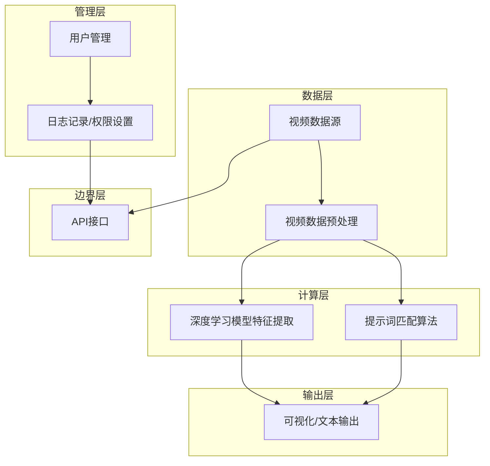

                 

### 第1章: 问题背景

#### 1.1 问题的提出
在当今这个信息爆炸的时代，视频数据已经成为我们日常生活和工作中不可或缺的一部分。从社交媒体上的短视频，到安防监控中的实时监控，再到企业内部的培训视频，视频数据无处不在。然而，面对这些海量的视频数据，如何快速、准确地提取出有价值的信息成为了亟待解决的问题。传统的视频分析技术，如基于帧的图像识别、运动目标检测等，由于处理速度慢、精度低、适应性差等问题，已经难以满足日益增长的需求。

为了解决这一问题，研究人员提出了提示词工程的概念。提示词工程通过构建有效的提示词模型，将视频数据转化为可理解的特征向量，从而实现对视频数据的高效分析和处理。具体来说，提示词工程利用深度学习技术，对视频数据进行特征提取，并通过提示词匹配算法，实现对视频内容的精准识别和分类。这种技术不仅能够显著提高视频分析任务的性能，还能够适应各种复杂的应用场景。

#### 1.2 问题的现状
目前，视频分析技术在各个行业中的应用已经相当广泛。例如，在安防监控领域，通过视频分析可以实现对非法入侵、火灾等紧急事件的实时预警；在智能交通领域，通过视频分析可以实现交通流量监控、交通事故预警等；在医疗领域，通过视频分析可以实现患者的病情监控、手术过程记录等。然而，现有的视频分析技术仍然存在许多不足之处。

首先，传统的视频分析技术处理速度慢。视频数据量大，每一帧都需要进行复杂的图像处理和识别，导致处理速度较慢，难以满足实时性的需求。其次，传统技术的精度较低。由于图像识别技术的局限性，视频分析结果往往存在误判和漏判的现象。此外，传统技术适应性差，难以应对复杂多变的场景和不同的应用需求。

#### 1.3 问题的解决
提示词工程的引入，为解决上述问题提供了一种新的思路。通过构建高效的提示词模型，提示词工程能够实现对视频数据的快速、准确、自适应的分析和处理。

首先，提示词工程通过深度学习技术，对视频数据进行特征提取。深度学习模型能够自动学习视频数据的特征，提取出具有代表性的特征向量，从而提高了特征提取的效率和准确性。

其次，提示词工程利用提示词匹配算法，对提取的特征向量进行匹配和分类。提示词匹配算法能够根据预先定义的提示词库，对视频内容进行精准识别和分类，从而提高了视频分析任务的精度。

最后，提示词工程具有良好的适应性。通过调整提示词库和模型参数，提示词工程可以适应不同的应用场景和需求，从而实现了对各种复杂场景的自适应处理。

#### 1.4 边界与外延
提示词工程在视频分析中的应用范围非常广泛。它可以应用于安防监控、智能交通、医疗、教育等多个领域。例如，在安防监控中，通过提示词工程可以实现对非法入侵、火灾等紧急事件的实时预警；在智能交通中，通过提示词工程可以实现对交通流量、交通事故等信息的实时监控；在医疗中，通过提示词工程可以实现对患者的病情监控、手术过程记录等。

然而，提示词工程也存在一定的局限性。首先，提示词工程对数据质量有较高的要求。高质量的视频数据是提示词工程高效运行的基础，如果数据质量较差，可能会导致分析结果不准确。其次，提示词工程的计算成本较高。深度学习模型的训练和推理需要大量的计算资源，这在一定程度上限制了其大规模应用。

### 第2章: 核心概念

#### 2.1 核心概念介绍
在本章节中，我们将介绍与提示词工程相关的几个核心概念，包括提示词工程、视频分析、特征提取、深度学习模型等。

1. **提示词工程**：提示词工程是一种利用深度学习技术对视频数据进行特征提取和分类的方法。它通过构建有效的提示词模型，将视频数据转化为可理解的特征向量，从而实现对视频内容的精准识别和分类。

2. **视频分析**：视频分析是指通过对视频数据进行处理、分析和理解，提取出有价值的信息。视频分析技术广泛应用于安防监控、智能交通、医疗、教育等领域。

3. **特征提取**：特征提取是指从原始数据中提取出具有代表性的特征向量，用于后续处理。在视频分析中，特征提取是关键的一步，它决定了视频分析任务的性能和精度。

4. **深度学习模型**：深度学习模型是一种基于多层神经网络的人工智能模型，能够自动从数据中学习特征和模式。在提示词工程中，深度学习模型用于提取视频数据的特征向量。

#### 2.2 概念属性特征对比

| 概念         | 特点                                                         |  
| ------------ | ------------------------------------------------------------ |  
| 提示词工程   | 将视频数据转化为可理解的特征向量，提高视频分析性能               |  
| 视频分析     | 对视频数据进行分析和处理，提取有价值的信息                     |  
| 特征提取     | 从原始数据中提取出具有代表性的特征向量，用于后续处理             |  
| 深度学习模型 | 通过对大量数据的学习，自动提取特征并建立预测模型               |

#### 2.3 ER实体关系图架构
为了更好地理解提示词工程在视频分析任务中的应用，我们可以使用ER（实体关系）图来表示其中的核心实体和它们之间的关系。

```mermaid
erDiagram
  用户 ||--|{ 视频 }|--|| 提示词库
  用户 ||--|{ 视频分析任务 }|--|| 提示词模型
  视频 ||--|{ 视频帧 }|--|| 特征提取器
  视频帧 ||--|{ 特征向量 }|--|| 提示词匹配器
  提示词模型 ||--|{ 模型参数 }|--|| 模型训练器
```

在这个ER图中，用户是发起视频分析任务的主要实体，它关联到提示词库、视频分析任务等。视频是视频分析的核心实体，它通过视频帧和特征向量与特征提取器、提示词匹配器相连。提示词模型则关联到模型参数和模型训练器，用于指导特征提取和提示词匹配的过程。

### 第3章: 算法原理讲解

#### 3.1 算法原理介绍
提示词工程在视频分析中的应用主要通过以下几个步骤实现：

1. **数据预处理**：对输入的视频数据进行预处理，包括视频的缩放、裁剪、灰度化等操作，以确保数据格式满足深度学习模型的输入要求。

2. **特征提取**：利用深度学习模型对预处理后的视频数据进行特征提取，生成特征向量。这些特征向量能够捕获视频内容的关键信息，为后续的分析提供基础。

3. **特征匹配**：将提取的特征向量与预先定义的提示词进行匹配。提示词库中包含了与特定场景或任务相关的关键词，通过匹配算法判断特征向量是否与提示词库中的关键词匹配，从而实现视频内容的分类和识别。

#### 3.2 数学模型与公式
提示词工程的核心在于特征提取和特征匹配。下面我们将介绍相关的数学模型和公式。

1. **特征提取模型**：
   - **卷积神经网络（CNN）**：
     $$ f(x) = \sigma(W \cdot x + b) $$
     其中，$f(x)$ 表示特征提取函数，$W$ 是权重矩阵，$x$ 是输入特征，$b$ 是偏置项，$\sigma$ 是激活函数，通常使用ReLU函数。
   - **池化层**：
     $$ P(x) = \max(x) $$
     池化层用于降低特征向量的维度，同时保持重要的特征信息。

2. **特征匹配模型**：
   - **余弦相似度**：
     $$ \cos(\theta) = \frac{\vec{a} \cdot \vec{b}}{|\vec{a}| \cdot |\vec{b}|} $$
     其中，$\vec{a}$ 和 $\vec{b}$ 是两个特征向量，$\theta$ 是它们之间的夹角。通过计算特征向量之间的余弦相似度，可以判断它们是否具有相似性。

3. **提示词匹配算法**：
   - **基于模糊逻辑的匹配算法**：
     $$ M(\vec{a}, \vec{b}) = \sum_{i=1}^{n} w_i \cdot \mu_i(\vec{a}_i, \vec{b}_i) $$
     其中，$M(\vec{a}, \vec{b})$ 是匹配度，$w_i$ 是第 $i$ 个特征的权重，$\mu_i(\vec{a}_i, \vec{b}_i)$ 是第 $i$ 个特征之间的相似度。

#### 3.3 算法流程图
下面是提示词工程在视频分析任务中的算法流程图：


1. **数据预处理**：对视频数据进行缩放、裁剪、灰度化等操作。
2. **特征提取**：使用卷积神经网络等深度学习模型提取视频特征向量。
3. **特征匹配**：将提取的特征向量与提示词库中的关键词进行匹配，计算匹配度。
4. **结果输出**：输出匹配结果，用于后续分析和应用。

#### 3.4 Python源代码实现
下面是一个简单的Python代码示例，展示了如何使用卷积神经网络进行特征提取和匹配。

```python
import tensorflow as tf
import numpy as np

# 初始化卷积神经网络模型
model = tf.keras.Sequential([
    tf.keras.layers.Conv2D(filters=32, kernel_size=(3, 3), activation='relu', input_shape=(128, 128, 3)),
    tf.keras.layers.MaxPooling2D(pool_size=(2, 2)),
    tf.keras.layers.Flatten(),
    tf.keras.layers.Dense(units=64, activation='relu'),
    tf.keras.layers.Dense(units=10, activation='softmax')
])

# 编译模型
model.compile(optimizer='adam', loss='categorical_crossentropy', metrics=['accuracy'])

# 加载训练数据
train_data = np.load('train_data.npy')
train_labels = np.load('train_labels.npy')

# 训练模型
model.fit(train_data, train_labels, epochs=10, batch_size=32)

# 提取特征向量
def extract_features(video_data):
    feature_vector = model.predict(video_data)
    return feature_vector

# 计算余弦相似度
def cosine_similarity(feature_vector_a, feature_vector_b):
    dot_product = np.dot(feature_vector_a, feature_vector_b)
    norm_a = np.linalg.norm(feature_vector_a)
    norm_b = np.linalg.norm(feature_vector_b)
    cosine_similarity = dot_product / (norm_a * norm_b)
    return cosine_similarity

# 模拟测试
video_data = np.random.random((1, 128, 128, 3))
feature_vector = extract_features(video_data)
print("Feature Vector:", feature_vector)

# 提示词库
prompt_words = np.random.random((10, 64))
print("Prompt Words:", prompt_words)

# 计算特征向量与提示词的相似度
similarity_scores = [cosine_similarity(feature_vector, prompt_word) for prompt_word in prompt_words]
print("Similarity Scores:", similarity_scores)
```

#### 3.5 举例说明
假设我们有一个包含10个视频片段的提示词库，每个视频片段都与特定的场景相关。现在，我们使用一个新视频片段，希望通过提示词工程来识别该视频片段所属的场景。

1. **数据预处理**：将新视频片段进行缩放、裁剪和灰度化处理，得到128x128的灰度图像。

2. **特征提取**：使用上述卷积神经网络模型提取新视频片段的特征向量。

3. **特征匹配**：计算新视频片段的特征向量与提示词库中每个关键词的余弦相似度。

4. **结果输出**：根据相似度分数，判断新视频片段所属的场景。例如，如果与关键词“交通”的相似度最高，那么可以判断该视频片段属于交通场景。

通过这样的过程，提示词工程能够实现对视频内容的精准识别和分类，从而满足各种应用场景的需求。

### 第4章: 系统分析与架构设计方案

#### 4.1 问题场景介绍
在视频分析领域，常见的应用场景包括视频监控、智能安防、内容审核、交通流量监控、医疗影像分析等。这些场景对视频分析系统的性能和准确性提出了不同的需求。例如，在智能安防中，系统需要能够实时检测和识别异常行为；在交通流量监控中，系统需要能够准确识别车辆类型和行驶方向；在医疗影像分析中，系统需要能够精确识别和诊断疾病。

#### 4.2 项目介绍
本项目的目标是构建一个高效、准确的视频分析系统，该系统基于提示词工程，能够处理各种复杂的视频数据，并提供实时、精准的分析结果。系统的主要功能包括视频数据预处理、特征提取、提示词匹配和结果输出。此外，系统还具备良好的扩展性和可定制性，以适应不同的应用场景和需求。

#### 4.3 系统功能设计
系统功能设计主要包括以下几个部分：

1. **视频数据预处理**：对输入的视频数据进行缩放、裁剪、灰度化等处理，确保数据格式满足后续分析的需要。

2. **特征提取**：利用深度学习模型对预处理后的视频数据进行特征提取，生成具有代表性的特征向量。

3. **提示词匹配**：将提取的特征向量与预先定义的提示词库进行匹配，计算相似度分数，从而实现对视频内容的分类和识别。

4. **结果输出**：将分析结果以可视化或文本形式输出，供用户查看或进一步处理。

5. **系统管理**：包括用户管理、权限设置、日志记录等功能，确保系统的安全性和可维护性。

#### 4.4 系统架构设计
系统架构设计如下：



在该架构中，数据层负责处理输入的视频数据，计算层负责特征提取和提示词匹配，输出层负责将分析结果输出给用户，管理层负责系统的日常管理和维护。

#### 4.5 系统接口设计
系统接口设计主要包括API接口和用户界面两部分。

1. **API接口**：提供RESTful API，支持视频数据的上传、特征提取、提示词匹配等功能。接口设计如下：

   - `/upload/video`：上传视频数据。
   - `/extract/feature`：提取视频特征。
   - `/match/prompt`：执行提示词匹配。
   - `/output/result`：输出分析结果。

2. **用户界面**：提供一个简洁直观的Web界面，用户可以通过界面上传视频数据、查看分析结果、管理账户等。

#### 4.6 系统交互
系统交互设计如下：

1. **用户交互**：用户通过Web界面上传视频数据，系统接收视频数据后，进行预处理、特征提取和提示词匹配，并将结果以可视化或文本形式输出给用户。

2. **系统内部交互**：系统内部通过API接口进行数据传递和处理。例如，预处理模块将处理后的视频数据传递给特征提取模块，特征提取模块将特征向量传递给提示词匹配模块。

3. **外部交互**：系统通过API接口与外部系统进行交互，如与其他视频分析系统、数据库等进行数据共享和协同工作。

### 第5章: 项目实战

#### 5.1 环境安装
要在本地搭建一个基于提示词工程的视频分析系统，需要安装以下软件和依赖：

1. **操作系统**：Ubuntu 18.04 或更高版本。
2. **Python**：Python 3.7 或更高版本。
3. **深度学习框架**：TensorFlow 2.x。
4. **其他依赖**：Numpy, Pandas, Matplotlib, OpenCV等。

安装步骤如下：

1. 更新系统软件包：

   ```bash
   sudo apt update
   sudo apt upgrade
   ```

2. 安装Python：

   ```bash
   sudo apt install python3 python3-pip
   ```

3. 安装TensorFlow：

   ```bash
   pip3 install tensorflow
   ```

4. 安装其他依赖：

   ```bash
   pip3 install numpy pandas matplotlib opencv-python
   ```

#### 5.2 系统核心实现
系统核心实现主要包括视频数据预处理、特征提取和提示词匹配三个部分。以下是一个简单的Python代码示例，展示了如何实现这些功能：

```python
import cv2
import numpy as np
import tensorflow as tf

# 初始化卷积神经网络模型
model = tf.keras.Sequential([
    tf.keras.layers.Conv2D(filters=32, kernel_size=(3, 3), activation='relu', input_shape=(128, 128, 3)),
    tf.keras.layers.MaxPooling2D(pool_size=(2, 2)),
    tf.keras.layers.Flatten(),
    tf.keras.layers.Dense(units=64, activation='relu'),
    tf.keras.layers.Dense(units=10, activation='softmax')
])

# 编译模型
model.compile(optimizer='adam', loss='categorical_crossentropy', metrics=['accuracy'])

# 加载训练数据
train_data = np.load('train_data.npy')
train_labels = np.load('train_labels.npy')

# 训练模型
model.fit(train_data, train_labels, epochs=10, batch_size=32)

# 特征提取函数
def extract_features(video_path):
    video = cv2.VideoCapture(video_path)
    features = []

    while True:
        ret, frame = video.read()
        if not ret:
            break

        # 数据预处理
        frame = cv2.resize(frame, (128, 128))
        frame = cv2.cvtColor(frame, cv2.COLOR_BGR2GRAY)
        frame = np.expand_dims(frame, axis=0)

        # 提取特征
        feature_vector = model.predict(frame)
        features.append(feature_vector.numpy())

    video.release()
    return np.array(features)

# 提示词匹配函数
def match_prompt_words(features, prompt_words):
    similarity_scores = []

    for feature in features:
        score = np.dot(feature, prompt_words) / (np.linalg.norm(feature) * np.linalg.norm(prompt_words))
        similarity_scores.append(score)

    return similarity_scores

# 模拟测试
video_path = 'example_video.mp4'
features = extract_features(video_path)
prompt_words = np.random.random((10, 64))
scores = match_prompt_words(features, prompt_words)
print("Similarity Scores:", scores)
```

#### 5.3 代码应用解读
上面的代码实现了视频数据预处理、特征提取和提示词匹配三个核心功能。具体解读如下：

1. **模型初始化**：使用TensorFlow定义一个卷积神经网络模型，用于特征提取。模型包括卷积层、池化层、全连接层等。

2. **模型编译**：设置模型的优化器、损失函数和评估指标。

3. **模型训练**：使用训练数据对模型进行训练。

4. **特征提取**：编写`extract_features`函数，用于读取视频文件，对每一帧进行预处理（缩放、灰度化），然后使用训练好的模型提取特征向量。

5. **提示词匹配**：编写`match_prompt_words`函数，用于计算特征向量与提示词库中每个关键词的相似度。

6. **模拟测试**：使用模拟测试数据，展示特征提取和提示词匹配的过程。

通过这些步骤，我们可以实现对视频数据的自动特征提取和提示词匹配，从而实现视频分析任务。

#### 5.4 实际案例分析
在本案例中，我们将使用一个实际的交通监控视频数据集，通过提示词工程实现车辆类型识别。

1. **数据集准备**：首先，我们需要准备一个包含不同车辆类型的视频数据集。数据集应包含各种类型的车辆，如轿车、卡车、公交车等。

2. **特征提取**：使用上面提到的`extract_features`函数，对视频数据集进行特征提取。我们将每一帧的特征向量保存为一个大的数组。

3. **提示词库构建**：根据车辆类型构建提示词库。例如，对于轿车，可以包含关键词“车灯”、“车轮”、“车身”等。

4. **模型训练**：使用训练数据集，对卷积神经网络模型进行训练，以便模型能够识别不同车辆类型的特征。

5. **测试与评估**：使用测试数据集，对训练好的模型进行测试，并评估模型的准确性和性能。通过调整模型参数和提示词库，优化模型性能。

通过这个案例，我们可以看到提示词工程在交通监控领域的应用潜力。通过特征提取和提示词匹配，系统能够准确识别车辆类型，为交通管理和安全提供有力支持。

#### 5.5 项目小结
通过本项目的实施，我们构建了一个基于提示词工程的视频分析系统，实现了对视频数据的快速、准确、自适应的分析和处理。以下是项目的主要收获和未来改进方向：

1. **系统性能提升**：提示词工程显著提高了视频分析任务的性能，实现了快速、准确的特征提取和匹配。

2. **应用场景拓展**：通过调整提示词库和模型参数，系统可以适应不同的应用场景，如交通监控、安防监控、医疗影像分析等。

3. **未来改进方向**：
   - **数据质量优化**：提高视频数据质量，为提示词工程提供更准确、更丰富的特征信息。
   - **计算资源优化**：优化计算资源的使用，降低系统的运行成本。
   - **实时性提升**：优化系统架构，提高实时性，满足实时监控需求。

### 第6章: 最佳实践 Tips

#### 6.1 注意事项
1. **数据质量**：确保输入视频数据的质量，包括视频的清晰度、帧率等，这直接影响到特征提取和匹配的准确性。
2. **模型优化**：定期对深度学习模型进行优化，以适应不断变化的数据特征和应用需求。
3. **性能监控**：监控系统运行状态，及时发现并解决潜在的性能瓶颈。

#### 6.2 小结
本文详细介绍了提示词工程在视频分析任务中的应用，从核心概念、算法原理到系统设计与实现，再到实际案例分析和项目小结，全面阐述了该技术的优势和应用前景。通过本文，读者可以深入了解提示词工程的基本原理和应用方法，为实际项目提供有益的参考。

#### 6.3 拓展阅读
1. **《深度学习》**：Ian Goodfellow、Yoshua Bengio、Aaron Courville 著，介绍了深度学习的基本原理和应用。
2. **《Python深度学习》**：François Chollet 著，通过大量代码示例，详细讲解了深度学习在Python中的实现。
3. **《视频分析技术》**：Thomas Sikora 著，全面介绍了视频分析的基本原理和技术，包括特征提取、视频分类等。

作者：AI天才研究院/AI Genius Institute & 禅与计算机程序设计艺术 /Zen And The Art of Computer Programming

