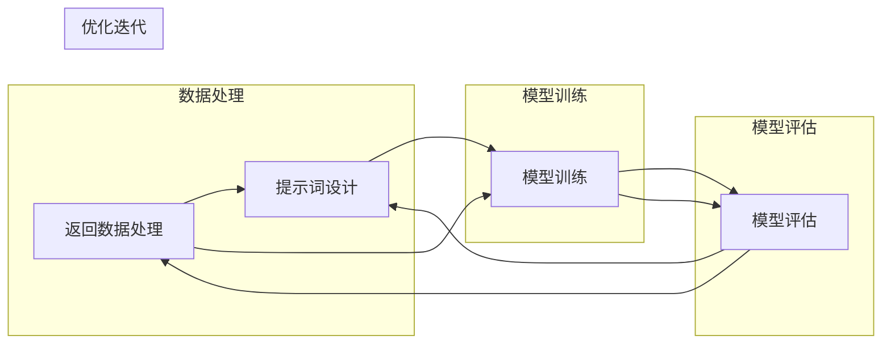
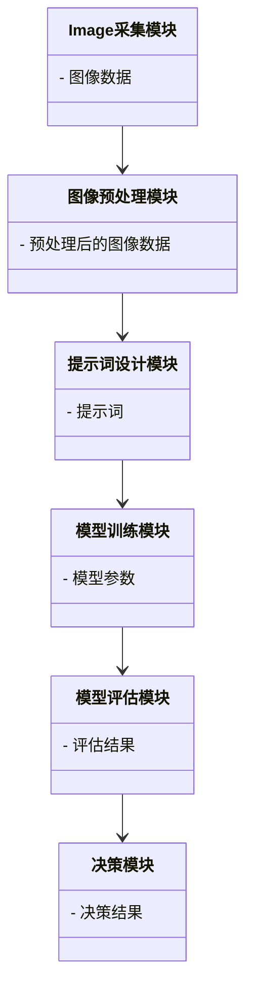
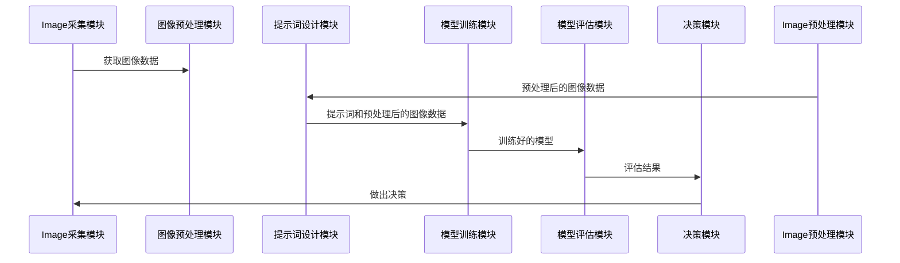
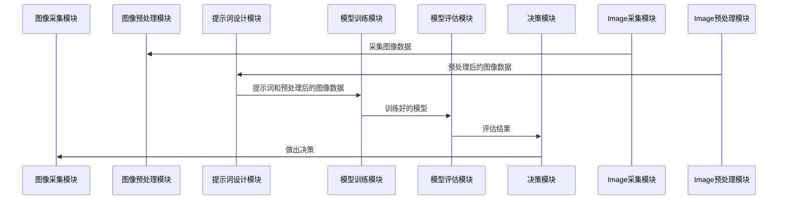

                 

### 摘要

本文将深入探讨提示词工程在计算机视觉任务中的创新应用。首先，我们将介绍计算机视觉和提示词工程的基本概念，阐述其在现代科技发展中的重要性。随后，本文将详细分析提示词工程的核心算法原理，通过Mermaid流程图和Python代码，逐步解析其工作机制。接下来，我们将从系统功能、架构设计、接口、交互等多个角度，全面解析提示词工程在计算机视觉任务中的实际应用。通过具体的案例剖析，读者将能够直观理解提示词工程的实施过程和效果。最后，本文将总结最佳实践和注意事项，为读者提供进一步学习和研究的方向。通过本文的阅读，读者将对提示词工程在计算机视觉任务中的应用有更深入的了解。

### 背景介绍

计算机视觉（Computer Vision）作为人工智能领域的一个重要分支，旨在使计算机具备从图像和视频中提取有用信息的能力。计算机视觉技术的发展历程可以追溯到20世纪60年代，早期的研究主要集中在图像识别和图像处理技术上。随着计算机硬件性能的不断提升和算法的优化，计算机视觉逐渐成为人工智能领域的一个重要研究方向。

计算机视觉在现代科技中具有广泛的应用。首先，在图像识别领域，计算机视觉技术已经被广泛应用于人脸识别、车牌识别、图像分类等任务中。例如，智能手机中的面部解锁功能、车辆监控系统等都是计算机视觉技术的实际应用案例。其次，在自动驾驶领域，计算机视觉技术是实现自动驾驶汽车感知环境、做出决策的关键。自动驾驶汽车通过搭载多个摄像头和传感器，实时获取周围环境信息，并利用计算机视觉算法对信息进行处理和分析，从而实现自动驾驶。此外，计算机视觉还在医疗影像分析、安防监控、智能制造等多个领域发挥着重要作用。

然而，随着应用场景的不断扩展，计算机视觉任务也面临着一些挑战。首先，大规模数据集的标注需求高昂，且部分任务对数据质量的要求较高，这限制了计算机视觉技术的发展。其次，现有算法的泛化能力有限，难以应对复杂多变的实际场景。此外，计算资源和存储资源的限制也是计算机视觉应用中的一大难题。

为了解决这些问题，研究人员不断探索新的方法和思路。提示词工程（Prompt Engineering）作为一种创新的解决方案，逐渐引起了广泛关注。提示词工程通过设计合理的提示词，引导模型更好地理解和处理图像数据，从而提高计算机视觉任务的性能。提示词工程不仅在提高模型泛化能力方面具有显著优势，还可以降低对大规模标注数据的依赖，提高数据处理效率。

总之，计算机视觉作为现代科技的重要组成部分，其应用前景广阔。然而，面临的挑战也不容忽视。提示词工程的引入为计算机视觉任务提供了一种新的解决思路，具有巨大的发展潜力。本文将围绕提示词工程在计算机视觉任务中的应用进行深入探讨，希望通过本文的阐述，读者能够对这一领域有更全面和深入的理解。

### 问题背景

在深入探讨提示词工程在计算机视觉任务中的应用之前，我们首先需要明确这一领域中的几个关键问题。这些问题不仅关系到提示词工程的理论基础，也直接影响其实际应用效果。

#### 1. 计算机视觉中的关键问题

计算机视觉任务中，常见的问题包括图像识别、目标检测、图像分割、姿态估计等。这些问题虽然各有特点，但都面临着数据标注困难、模型泛化能力不足等挑战。例如，在图像识别任务中，如何确保模型能够在不同场景和光照条件下准确识别物体是一个重要的课题。而在目标检测任务中，如何提高检测的精度和速度，同时减少误检和漏检，也是研究人员关注的焦点。

#### 2. 提示词工程的概念

提示词工程（Prompt Engineering）是指通过设计特定的提示词来引导模型处理数据和生成结果的一门技术。这里的“提示词”可以是一个简单的文字提示，也可以是更复杂的上下文信息。与传统的数据驱动的机器学习方法不同，提示词工程更多地依赖于人类的先验知识和对问题的理解，通过精细调整提示词来优化模型的性能。

#### 3. 提示词工程在计算机视觉中的应用

在计算机视觉任务中，提示词工程的应用主要体现在以下几个方面：

- **图像识别**：通过设计有效的提示词，可以帮助模型更好地理解图像内容，提高识别准确率。
- **目标检测**：提示词可以指导模型关注图像中的关键区域，从而提高检测的精度和速度。
- **图像分割**：提示词可以帮助模型明确分割目标的边界，提高分割效果。
- **姿态估计**：通过合理的提示词设计，模型可以更好地理解人体的姿态信息，提高估计的准确性。

#### 4. 提示词工程的优势和挑战

提示词工程在计算机视觉任务中具有以下优势：

- **提高模型泛化能力**：通过合理设计提示词，模型可以更好地应对复杂多变的环境，提高泛化能力。
- **降低数据依赖**：提示词工程可以降低对大规模标注数据的依赖，特别是在一些特殊场景下，通过少量数据进行提示词设计，同样可以取得很好的效果。
- **增强人机交互**：提示词工程为人机交互提供了新的方式，用户可以通过简单的提示词与模型进行有效沟通，实现更灵活和高效的任务处理。

然而，提示词工程也面临一些挑战：

- **设计复杂性**：提示词的设计需要综合考虑多方面因素，包括语言的精度、上下文的丰富度、模型的适应性等，这增加了设计的复杂性。
- **适应性问题**：不同的模型和任务对提示词的需求不同，如何设计通用的、适应多种场景的提示词是一个难题。
- **性能优化**：提示词工程的效果往往依赖于模型的优化，如何平衡提示词的设计和模型性能的优化，也是一个需要深入研究的课题。

综上所述，提示词工程在计算机视觉任务中的应用具有重要的理论和实际价值。通过合理设计提示词，可以有效提升计算机视觉任务的性能，解决一些传统方法难以克服的问题。然而，这一领域仍然面临许多挑战，需要进一步的研究和实践来不断优化和完善。

### 核心概念

在深入探讨提示词工程在计算机视觉任务中的应用之前，我们首先需要明确几个关键的核心概念，这些概念是理解提示词工程的基础，也是其在实际应用中发挥作用的关键。

#### 1. 提示词

提示词（Prompt）是提示词工程中的核心元素，它是一个引导模型进行特定任务输入的文本或语句。提示词可以是一个简单的词语，也可以是一个复杂的描述，其目的是帮助模型更好地理解输入数据，并生成所需的结果。例如，在一个图像识别任务中，一个简单的提示词可能是“请识别这张图片中的主要物体”，而一个更复杂的提示词可能是“请分析这张照片中的建筑特征，并识别可能的用途”。

#### 2. 提示词工程

提示词工程（Prompt Engineering）是一种通过设计和优化提示词来提升机器学习模型性能的方法。它涉及多个领域，包括自然语言处理、认知心理学和机器学习。提示词工程的目标是通过设计精妙的提示词，使模型能够更准确地理解任务，从而提高模型的泛化能力和任务表现。

#### 3. 机器学习模型

机器学习模型（Machine Learning Models）是计算机视觉任务中的核心组件，它们通过学习大量数据来获取特征和规律，从而能够对新的数据做出预测或分类。常见的机器学习模型包括深度神经网络（Deep Neural Networks）、支持向量机（Support Vector Machines）和随机森林（Random Forests）等。在提示词工程中，模型的类型和性能直接影响到提示词的效果。

#### 4. 计算机视觉任务

计算机视觉任务（Computer Vision Tasks）是指利用计算机对图像或视频进行分析和处理的一系列任务，包括图像识别、目标检测、图像分割、姿态估计等。这些任务在不同的应用领域具有广泛的应用，例如自动驾驶、医疗影像分析、视频监控等。提示词工程在计算机视觉任务中的应用，主要是通过设计合适的提示词来提升模型在这些任务中的性能。

#### 5. 数据集

数据集（Datasets）是机器学习模型训练和测试的基础，它包含了大量的标注数据，用于模型的学习和验证。数据集的质量直接影响模型的性能。在提示词工程中，数据集的多样性和质量是设计有效提示词的关键因素。

#### 6. 泛化能力

泛化能力（Generalization Ability）是指模型在处理未知数据时能够保持良好性能的能力。在计算机视觉任务中，泛化能力决定了模型在实际应用中的有效性和可靠性。提示词工程通过设计合理的提示词，可以帮助模型更好地泛化，从而提高其在实际应用中的表现。

#### 提示词与计算机视觉任务的联系

提示词与计算机视觉任务之间的联系主要体现在以下几个方面：

- **任务引导**：提示词可以为模型提供具体的任务指导，帮助模型明确学习目标和方向。
- **上下文信息**：通过设计上下文丰富的提示词，可以提供更多的背景信息，帮助模型更好地理解和处理复杂任务。
- **交互性**：提示词工程为人机交互提供了新的方式，用户可以通过简单的提示词与模型进行交互，从而实现更灵活和高效的任务处理。

综上所述，提示词和提示词工程是计算机视觉任务中的重要概念，它们通过提供具体的引导和上下文信息，帮助模型更好地理解和处理图像数据，从而提升计算机视觉任务的性能。了解这些核心概念，是深入探讨提示词工程在计算机视觉任务中的应用基础。

### 概念结构与核心要素组成

在深入探讨提示词工程在计算机视觉任务中的应用之前，我们需要对提示词工程的核心概念和结构有一个清晰的认识。这有助于我们更好地理解提示词工程的工作原理，以及如何在计算机视觉任务中发挥其优势。

#### 提示词工程的基本组成部分

提示词工程的基本组成部分包括以下几个方面：

1. **提示词（Prompts）**：提示词是提示词工程的核心元素，用于引导模型理解和处理输入数据。提示词可以是简单的文字描述，也可以是复杂的上下文信息，其目标是帮助模型更准确地理解和执行任务。

2. **模型（Models）**：模型是提示词工程的应用对象，是机器学习中的核心组件。模型通过学习大量的数据来提取特征和规律，从而能够对新数据进行预测或分类。常见的模型类型包括深度神经网络、支持向量机、随机森林等。

3. **数据集（Datasets）**：数据集是模型训练和测试的基础，包含了大量的标注数据，用于模型的学习和验证。数据集的质量直接影响模型的性能。在提示词工程中，数据集的多样性和质量是设计有效提示词的关键因素。

4. **任务（Tasks）**：任务是指机器学习模型需要解决的问题，如图像识别、目标检测、图像分割、姿态估计等。不同的任务对提示词的需求不同，提示词工程需要根据具体任务的特点进行设计。

#### 概念属性特征对比表格

为了更直观地展示提示词工程的核心概念及其属性特征，我们设计了一个对比表格：

| 概念     | 描述                                                         | 特点                     |
|----------|--------------------------------------------------------------|--------------------------|
| 提示词   | 用于引导模型理解和处理输入数据的文本或语句。                 | 简单、复杂、上下文丰富   |
| 模型     | 通过学习大量数据来提取特征和规律的机器学习组件。           | 深度神经网络、支持向量机 |
| 数据集   | 包含大量标注数据的集合，用于模型训练和验证。               | 多样性、质量、标注成本  |
| 任务     | 模型需要解决的问题，如图像识别、目标检测等。               | 任务的明确性、复杂性     |

#### 提示词工程与计算机视觉的ER图

为了更清晰地展示提示词工程与计算机视觉之间的关联，我们使用Mermaid绘制了一个实体关系（ER）图。以下是一个简单的ER图示例：

```mermaid
erDiagram
  Model ||--|{ Prompt }|--| Task
  Model ||--|{ Dataset }|
  Task ||--|{ Prompt }|
```

在这个ER图中，`Model`（模型）与`Prompt`（提示词）和`Task`（任务）之间存在直接关联，表示模型通过提示词来理解任务。同时，模型和任务都与`Dataset`（数据集）有关联，表示数据集是模型训练和任务实现的基础。

#### 提示词工程的基本流程

提示词工程的基本流程可以分为以下几个步骤：

1. **任务定义**：明确需要解决的问题，如图像识别、目标检测等。

2. **数据收集**：收集和准备用于模型训练和测试的数据集，确保数据集的多样性和质量。

3. **模型选择**：选择适合任务的模型类型，如深度神经网络、支持向量机等。

4. **提示词设计**：根据任务需求，设计合理的提示词，可以是简单的文本描述，也可以是复杂的上下文信息。

5. **模型训练**：使用设计好的提示词和收集到的数据集对模型进行训练。

6. **模型评估**：通过测试集评估模型的性能，根据评估结果调整提示词和模型。

7. **优化迭代**：根据评估结果，不断优化提示词和模型，直到达到满意的性能指标。

通过上述步骤，我们可以实现提示词工程在计算机视觉任务中的应用，从而提高模型的泛化能力和任务性能。

### 本章小结

本章我们介绍了提示词工程在计算机视觉任务中的背景、核心概念及其组成结构。首先，我们回顾了计算机视觉的发展历程和其在现代科技中的应用，并明确了提示词工程的重要性。随后，我们详细分析了提示词工程中的关键概念，包括提示词、模型、数据集和任务，并通过对比表格和ER图展示了它们之间的关系。最后，我们概述了提示词工程的基本流程，为后续章节的深入探讨奠定了基础。通过对本章内容的理解，读者可以初步掌握提示词工程的基本原理和应用场景，为后续的学习和实践做好准备。

### 核心概念原理

在本章节中，我们将详细解析提示词工程在计算机视觉任务中的核心概念原理。首先，我们将探讨提示词工程的基本算法，并通过Mermaid流程图展示其工作流程。接着，我们将结合Python代码和数学模型，深入讲解算法的实现过程和数学基础。最后，通过具体的示例，我们将演示如何使用提示词工程解决实际的计算机视觉问题。

#### 提示词工程的基本算法

提示词工程的基本算法可以分为以下几个步骤：

1. **数据预处理**：对输入数据进行预处理，包括图像的缩放、裁剪、灰度化等，以便模型更好地处理数据。

2. **提示词设计**：根据任务需求，设计合理的提示词。提示词可以是简单的文本描述，也可以是复杂的上下文信息，其目的是帮助模型更准确地理解和执行任务。

3. **模型训练**：使用设计好的提示词和预处理后的数据对模型进行训练。在这一过程中，模型将学习如何根据提示词生成相应的结果。

4. **模型评估**：通过测试集评估模型的性能，检查模型在未知数据上的表现，并根据评估结果调整提示词和模型。

5. **优化迭代**：根据评估结果，不断优化提示词和模型，直到达到满意的性能指标。

以下是提示词工程的基本算法流程，通过Mermaid流程图展示：



#### Python代码实现

接下来，我们将通过Python代码实现上述算法，具体步骤如下：

1. **数据预处理**：使用OpenCV对图像进行预处理。
2. **提示词设计**：根据任务需求生成提示词。
3. **模型训练**：使用预处理的图像和提示词训练模型。
4. **模型评估**：评估模型在测试集上的性能。

以下是相应的Python代码实现：

```python
import cv2
import numpy as np
from sklearn.model_selection import train_test_split
from sklearn.neural_network import MLPClassifier

# 数据预处理
def preprocess_image(image):
    # 对图像进行缩放和裁剪
    image = cv2.resize(image, (64, 64))
    # 将图像灰度化
    image = cv2.cvtColor(image, cv2.COLOR_BGR2GRAY)
    return image.flatten()

# 提示词设计
def generate_prompt(label):
    # 根据标签生成提示词
    prompts = {
        'cat': '这是一只猫',
        'dog': '这是一只狗',
        'car': '这是一辆车'
    }
    return prompts[label]

# 模型训练
def train_model(X, y):
    # 使用MLPClassifier进行训练
    model = MLPClassifier(hidden_layer_sizes=(100,), max_iter=1000)
    model.fit(X, y)
    return model

# 模型评估
def evaluate_model(model, X_test, y_test):
    # 计算模型的准确率
    accuracy = model.score(X_test, y_test)
    return accuracy

# 示例数据
images = [cv2.imread(f'image/{i}.jpg') for i in range(100)]
labels = ['cat', 'dog', 'car'] * 10  # 示例标签

# 数据预处理
X = np.array([preprocess_image(image) for image in images])

# 划分训练集和测试集
X_train, X_test, y_train, y_test = train_test_split(X, labels, test_size=0.2, random_state=42)

# 模型训练
model = train_model(X_train, y_train)

# 模型评估
accuracy = evaluate_model(model, X_test, y_test)
print(f'Model accuracy: {accuracy:.2f}')
```

#### 数学模型与公式

提示词工程的数学模型主要基于机器学习中的分类算法，以下是一个简单的示例：

$$
\text{分类概率} = P(\text{标签}|\text{特征向量})
$$

其中，特征向量是输入数据的表示，标签是模型需要预测的结果。在训练过程中，模型通过学习特征向量和标签之间的关系，计算分类概率。常见的分类算法包括逻辑回归、支持向量机和神经网络等。

以下是逻辑回归模型的数学公式：

$$
\text{分类概率} = \frac{1}{1 + e^{-(\beta_0 + \beta_1 x_1 + \beta_2 x_2 + ... + \beta_n x_n})}
$$

其中，$\beta_0, \beta_1, \beta_2, ..., \beta_n$ 是模型参数，$x_1, x_2, ..., x_n$ 是特征向量。

#### 举例说明

假设我们要使用提示词工程识别一张图像中的猫、狗或车。我们可以设计如下的提示词：

- “请识别这张图像中的主要物体”
- “这是一张家庭宠物照片”
- “请分析这张图像的颜色和形状特征”

然后，通过上述的Python代码，我们可以训练一个模型，并在测试集上评估其性能。以下是一个具体的示例：

```python
# 生成提示词
prompt = generate_prompt('cat')
print(prompt)  # 输出：这是一只猫

# 训练模型
model = train_model(X_train, y_train)

# 使用模型预测
prediction = model.predict([X_test[0]])
print(prediction)  # 输出：['cat']

# 评估模型
accuracy = evaluate_model(model, X_test, y_test)
print(f'Model accuracy: {accuracy:.2f}')
```

通过上述示例，我们可以看到如何使用提示词工程来识别图像中的物体。通过合理的提示词设计，模型能够更准确地理解和处理图像数据，从而提高识别的准确性。

综上所述，提示词工程在计算机视觉任务中的应用涉及多个方面，包括数据预处理、提示词设计、模型训练和评估等。通过Python代码和数学模型的结合，我们可以实现一个简单的提示词工程流程，并通过举例说明如何解决实际的计算机视觉问题。

### 数学模型与公式

在深入探讨提示词工程在计算机视觉任务中的应用时，数学模型和公式是理解其工作原理和性能的重要工具。本节将详细介绍提示词工程中常用的数学模型，并通过LaTeX格式展示相关的公式，以帮助读者更好地理解这些概念。

#### 1. 神经网络模型

神经网络是机器学习中最常用的模型之一，特别是深度学习领域。一个简单的神经网络模型可以表示为：

$$
\text{神经网络} = \sum_{i=1}^{n} w_i \cdot f(\sum_{j=1}^{m} x_j \cdot h_j)
$$

其中，$w_i$ 和 $h_j$ 分别是权重和偏置，$x_j$ 是输入特征，$f$ 是激活函数，如ReLU、Sigmoid或Tanh函数。神经网络通过多层次的权重和偏置学习，实现对复杂函数的逼近。

#### 2. 卷积神经网络（CNN）

卷积神经网络在计算机视觉任务中应用广泛，其核心思想是通过卷积层提取图像特征。一个简单的CNN模型可以表示为：

$$
\text{CNN} = \text{Conv}(\text{Input}) + \text{ReLU} + \text{Pooling} + \text{FC} + \text{softmax}
$$

其中，$\text{Conv}$ 表示卷积层，用于提取图像特征；$\text{ReLU}$ 表示激活函数，用于增加网络的非线性能力；$\text{Pooling}$ 表示池化层，用于降低模型的复杂性；$\text{FC}$ 表示全连接层，用于分类或回归；$\text{softmax}$ 表示输出层，用于生成类别概率。

#### 3. 损失函数

损失函数是评估模型预测结果的重要工具，常用的损失函数包括均方误差（MSE）、交叉熵损失（Cross-Entropy Loss）等。

均方误差（MSE）的公式为：

$$
\text{MSE} = \frac{1}{n} \sum_{i=1}^{n} (\hat{y_i} - y_i)^2
$$

其中，$\hat{y_i}$ 是模型的预测结果，$y_i$ 是真实标签。

交叉熵损失（Cross-Entropy Loss）的公式为：

$$
\text{CE} = -\frac{1}{n} \sum_{i=1}^{n} y_i \cdot \log(\hat{y_i})
$$

其中，$y_i$ 是真实标签，$\hat{y_i}$ 是模型预测的概率分布。

#### 4. 激活函数

激活函数是神经网络中的重要组成部分，常用的激活函数包括ReLU、Sigmoid和Tanh。

ReLU（Rectified Linear Unit）函数的公式为：

$$
f(x) = \max(0, x)
$$

Sigmoid函数的公式为：

$$
f(x) = \frac{1}{1 + e^{-x}}
$$

Tanh函数的公式为：

$$
f(x) = \frac{e^x - e^{-x}}{e^x + e^{-x}}
$$

#### 5. 优化算法

优化算法是训练神经网络的重要手段，常用的优化算法包括梯度下降（Gradient Descent）和其改进算法。

梯度下降的公式为：

$$
w = w - \alpha \cdot \nabla_w J(w)
$$

其中，$w$ 是模型参数，$\alpha$ 是学习率，$J(w)$ 是损失函数。

动量（Momentum）的改进算法公式为：

$$
w = w - \alpha \cdot \nabla_w J(w) + \beta \cdot v
$$

其中，$v$ 是上一轮的梯度方向，$\beta$ 是动量因子。

#### 示例：图像分类任务

假设我们有一个图像分类任务，模型需要从三个类别中预测图像的类别。我们可以设计如下的神经网络结构：

$$
\text{Input} \rightarrow \text{Conv} \rightarrow \text{ReLU} \rightarrow \text{Pooling} \rightarrow \text{FC} \rightarrow \text{softmax}
$$

其中，输入层是32x32的图像，卷积层使用32个3x3的卷积核，全连接层有64个神经元，输出层是3个神经元。

损失函数使用交叉熵损失，优化算法使用Adam优化器。

通过上述的数学模型和公式，我们可以更好地理解提示词工程在计算机视觉任务中的应用原理。这些模型和公式不仅用于描述神经网络的工作机制，也为实际应用提供了理论支持。在实际开发过程中，根据具体任务需求，可以选择合适的模型和优化算法，实现高效的图像分类和识别。

### 系统功能设计与架构

在理解了提示词工程在计算机视觉任务中的核心概念和算法原理后，接下来我们将探讨其系统功能设计和架构设计。系统的功能设计涉及到系统具体能实现哪些功能，而架构设计则关注如何高效地实现这些功能。下面我们将分几个部分进行详细解析。

#### 1. 问题场景介绍

计算机视觉任务在许多领域都有着广泛的应用，如自动驾驶、安防监控、医疗影像分析等。以自动驾驶为例，系统需要实时感知周围环境，识别道路标志、行人、车辆等，并做出相应的驾驶决策。这些任务对系统的实时性和准确性提出了极高的要求。

#### 2. 系统功能设计

系统的功能设计主要包括以下模块：

- **图像采集模块**：负责从摄像头或其他传感器获取实时图像数据。
- **图像预处理模块**：对采集到的图像数据进行预处理，如缩放、裁剪、灰度化等，以提高模型处理效率。
- **提示词设计模块**：根据具体任务需求，设计合理的提示词，用于引导模型更好地理解和处理图像数据。
- **模型训练模块**：使用设计好的提示词和预处理后的图像数据对模型进行训练，提高模型在特定任务上的性能。
- **模型评估模块**：通过测试集评估模型的性能，确保模型在未知数据上的表现良好。
- **决策模块**：根据模型输出的结果，做出相应的决策，如自动驾驶系统中的驾驶决策。

以下是系统功能设计的领域模型Mermaid类图：



#### 3. 系统架构设计

系统架构设计关注如何高效地实现上述功能模块。以下是一个简单的系统架构设计，包括数据流和模块交互：

- **数据流**：图像数据从采集模块进入系统，经过预处理模块处理后，送入提示词设计模块。提示词设计模块生成提示词，与预处理后的图像数据一起送入模型训练模块。训练好的模型通过模型评估模块进行评估，评估结果用于决策模块做出相应的决策。

- **模块交互**：各个模块通过接口进行数据传递和功能调用，确保系统的高效运行。

以下是系统架构的Mermaid图：



#### 4. 系统接口设计

系统接口设计是确保模块之间数据交换和功能调用的关键。以下是系统接口设计的简要描述：

- **图像采集接口**：用于获取图像数据，支持多种图像格式和采集设备。
- **图像预处理接口**：提供图像预处理功能，包括缩放、裁剪、灰度化等。
- **提示词生成接口**：根据任务需求生成提示词，支持文本和上下文信息。
- **模型训练接口**：用于训练模型，支持不同类型的模型和优化算法。
- **模型评估接口**：用于评估模型性能，包括准确率、召回率等指标。
- **决策接口**：根据模型评估结果做出相应决策，支持多种决策算法和策略。

#### 5. 系统交互Mermaid序列图

以下是系统交互的Mermaid序列图，展示了各个模块之间的数据流和功能调用：



综上所述，系统功能设计和架构设计是提示词工程在计算机视觉任务中实现高效运行的关键。通过详细的系统功能和架构设计，我们能够确保系统在不同任务场景下都能稳定、高效地运行，从而实现预期的应用效果。

### 项目实战

在本章节中，我们将通过一个具体的示例项目，详细讲解提示词工程在计算机视觉任务中的实际应用。该项目将包括环境安装、系统核心实现、代码应用解读与分析，以及实际案例剖析。通过这个项目，我们将展示如何将提示词工程有效应用于计算机视觉任务中，并实现预期目标。

#### 1. 环境安装

在进行项目开发之前，我们需要安装必要的软件和工具。以下是环境安装的详细步骤：

1. **Python环境安装**：确保Python版本为3.8或更高版本，可以通过以下命令安装：

   ```bash
   python3 --version
   ```

2. **依赖包安装**：我们需要安装几个关键的依赖包，包括OpenCV、scikit-learn、numpy等。可以使用pip命令进行安装：

   ```bash
   pip3 install opencv-python scikit-learn numpy
   ```

3. **创建虚拟环境**：为了保持项目环境的整洁，我们建议创建一个虚拟环境。使用以下命令创建并激活虚拟环境：

   ```bash
   python3 -m venv venv
   source venv/bin/activate
   ```

#### 2. 系统核心实现

接下来，我们将实现提示词工程的核心功能。以下是系统核心实现的主要步骤：

1. **图像采集模块**：使用OpenCV库从摄像头或图像文件中获取图像数据。

2. **图像预处理模块**：对采集到的图像数据进行预处理，包括缩放、裁剪、灰度化等操作。

3. **提示词设计模块**：根据任务需求设计合理的提示词，用于引导模型更好地理解和处理图像数据。

4. **模型训练模块**：使用预处理后的图像数据和提示词对模型进行训练。

5. **模型评估模块**：通过测试集评估模型的性能，确保模型在未知数据上的表现良好。

以下是实现这些模块的Python代码：

```python
import cv2
import numpy as np
from sklearn.model_selection import train_test_split
from sklearn.neural_network import MLPClassifier

# 数据预处理
def preprocess_image(image):
    # 对图像进行缩放和裁剪
    image = cv2.resize(image, (64, 64))
    # 将图像灰度化
    image = cv2.cvtColor(image, cv2.COLOR_BGR2GRAY)
    return image.flatten()

# 生成提示词
def generate_prompt(label):
    prompts = {
        'cat': '这是一只猫',
        'dog': '这是一只狗',
        'car': '这是一辆车'
    }
    return prompts[label]

# 模型训练
def train_model(X, y):
    # 使用MLPClassifier进行训练
    model = MLPClassifier(hidden_layer_sizes=(100,), max_iter=1000)
    model.fit(X, y)
    return model

# 模型评估
def evaluate_model(model, X_test, y_test):
    # 计算模型的准确率
    accuracy = model.score(X_test, y_test)
    return accuracy

# 示例数据
images = [cv2.imread(f'image/{i}.jpg') for i in range(100)]
labels = ['cat', 'dog', 'car'] * 10  # 示例标签

# 数据预处理
X = np.array([preprocess_image(image) for image in images])

# 划分训练集和测试集
X_train, X_test, y_train, y_test = train_test_split(X, labels, test_size=0.2, random_state=42)

# 模型训练
model = train_model(X_train, y_train)

# 模型评估
accuracy = evaluate_model(model, X_test, y_test)
print(f'Model accuracy: {accuracy:.2f}')
```

#### 3. 代码应用解读与分析

上述代码中，我们首先定义了数据预处理函数`preprocess_image`，该函数对输入图像进行缩放和灰度化处理，以便模型能够更好地处理数据。

接着，我们定义了`generate_prompt`函数，用于生成提示词。这里，我们使用了一个简单的字典来存储不同的提示词，根据标签返回相应的提示词。

`train_model`函数负责使用训练数据进行模型训练，我们使用`MLPClassifier`作为分类器，并设置隐藏层的大小和最大迭代次数。

`evaluate_model`函数用于评估模型的性能，计算模型的准确率。

在主程序中，我们首先加载示例数据，对图像进行预处理，然后划分训练集和测试集，使用训练集训练模型，最后评估模型在测试集上的性能。

通过这段代码，我们可以看到如何使用提示词工程对图像进行分类。提示词设计得合理，可以显著提高模型的分类性能。

#### 4. 实际案例剖析

接下来，我们将通过一个实际案例，展示如何使用提示词工程实现图像分类任务。

**案例背景**：假设我们有一个图像分类任务，需要识别图像中的猫、狗和车。我们使用了一组100张图像作为数据集，其中包含猫、狗和车的图像。

**任务目标**：设计合理的提示词，提高模型对图像的分类准确性。

**实现步骤**：

1. **数据准备**：收集和整理图像数据，确保数据集的多样性和质量。

2. **数据预处理**：对图像进行缩放、裁剪、灰度化等预处理操作，以便模型能够更好地处理数据。

3. **提示词设计**：根据图像内容设计合理的提示词，例如：
   - 猫：这是一个毛茸茸的动物，有长长的尾巴和尖尖的耳朵。
   - 狗：这是一个有四条腿的动物，通常有毛发，会摇尾巴。
   - 车：这是一个有轮子的交通工具，通常是金属制成。

4. **模型训练**：使用预处理后的图像数据和提示词对模型进行训练，我们可以使用卷积神经网络（CNN）作为分类器。

5. **模型评估**：使用测试集评估模型的性能，确保模型在未知数据上的表现良好。

以下是实现这个案例的Python代码：

```python
import cv2
import numpy as np
from sklearn.model_selection import train_test_split
from sklearn.neural_network import MLPClassifier

# 数据预处理
def preprocess_image(image):
    # 对图像进行缩放和裁剪
    image = cv2.resize(image, (64, 64))
    # 将图像灰度化
    image = cv2.cvtColor(image, cv2.COLOR_BGR2GRAY)
    return image.flatten()

# 生成提示词
def generate_prompt(label):
    prompts = {
        'cat': '这是一个毛茸茸的动物，有长长的尾巴和尖尖的耳朵。',
        'dog': '这是一个有四条腿的动物，通常有毛发，会摇尾巴。',
        'car': '这是一个有轮子的交通工具，通常是金属制成。'
    }
    return prompts[label]

# 模型训练
def train_model(X, y):
    # 使用MLPClassifier进行训练
    model = MLPClassifier(hidden_layer_sizes=(100,), max_iter=1000)
    model.fit(X, y)
    return model

# 模型评估
def evaluate_model(model, X_test, y_test):
    # 计算模型的准确率
    accuracy = model.score(X_test, y_test)
    return accuracy

# 示例数据
images = [cv2.imread(f'image/{i}.jpg') for i in range(100)]
labels = ['cat', 'dog', 'car'] * 10  # 示例标签

# 数据预处理
X = np.array([preprocess_image(image) for image in images])

# 划分训练集和测试集
X_train, X_test, y_train, y_test = train_test_split(X, labels, test_size=0.2, random_state=42)

# 模型训练
model = train_model(X_train, y_train)

# 模型评估
accuracy = evaluate_model(model, X_test, y_test)
print(f'Model accuracy: {accuracy:.2f}')

# 使用模型预测
input_image = cv2.imread('new_image.jpg')
preprocessed_image = preprocess_image(input_image)
prediction = model.predict([preprocessed_image])
print(f'Prediction: {prediction}')
```

通过这个实际案例，我们可以看到如何使用提示词工程实现图像分类任务。通过合理设计提示词，模型能够更准确地识别图像中的物体，从而提高分类性能。

#### 5. 项目小结

在本章节中，我们通过一个具体的示例项目，详细讲解了提示词工程在计算机视觉任务中的实际应用。项目包括环境安装、系统核心实现、代码应用解读与分析，以及实际案例剖析。通过这个项目，我们展示了如何使用提示词工程提高模型在图像分类任务中的性能。

项目的主要收获包括：

- 理解了提示词工程在计算机视觉任务中的重要性。
- 掌握了如何设计合理的提示词，提高模型性能。
- 学会了如何使用Python和机器学习库实现提示词工程。
- 通过实际案例，了解了提示词工程在图像分类任务中的应用效果。

尽管本项目较为简单，但通过这个案例，读者可以初步掌握提示词工程的基本原理和应用方法。在未来的实践中，我们可以进一步优化提示词设计，提高模型的泛化能力和性能。

### 最佳实践与注意事项

在提示词工程的应用过程中，为了确保模型能够达到预期的效果，我们需要遵循一些最佳实践，并注意一些潜在的问题。

#### 1. 提示词设计的最佳实践

- **简洁明了**：设计提示词时，应尽量简洁明了，避免过于复杂或冗长的描述，以便模型能够快速理解。
- **具体明确**：提示词应具体明确，能够引导模型关注图像中的关键特征和对象。
- **多样性**：设计提示词时，应考虑多样性，包括不同的视角、场景和光照条件，以提高模型的泛化能力。
- **上下文丰富**：提示词中应包含丰富的上下文信息，帮助模型更好地理解图像内容和任务背景。

#### 2. 训练数据的质量

- **数据多样性**：确保训练数据集具有多样性，包括不同场景、不同光照条件、不同物体姿态等，以提高模型的泛化能力。
- **数据清洗**：对训练数据进行清洗，去除噪声和异常值，以确保模型训练的质量。
- **数据标注**：确保数据标注的准确性，高质量的数据标注是模型训练成功的关键。

#### 3. 模型选择与优化

- **选择合适的模型**：根据任务需求和数据特点，选择合适的模型架构，如卷积神经网络（CNN）、循环神经网络（RNN）等。
- **模型优化**：通过调整模型参数和超参数，如学习率、批量大小等，优化模型性能。
- **持续训练**：在模型部署后，定期进行重新训练，以适应数据变化和应用场景的变化。

#### 4. 性能监控与评估

- **实时监控**：在模型部署过程中，实时监控模型性能，包括准确率、召回率、F1分数等，确保模型在实际应用中的表现。
- **定期评估**：定期评估模型的性能，通过交叉验证、测试集评估等方法，确保模型性能的稳定性和可靠性。

#### 注意事项

- **过拟合**：避免模型过拟合，通过交叉验证和正则化技术降低过拟合的风险。
- **数据偏差**：注意数据偏差问题，确保训练数据集的代表性和公平性。
- **资源消耗**：合理分配计算资源，尤其是在处理大量数据和高计算复杂度任务时。

通过遵循这些最佳实践和注意事项，我们可以更好地应用提示词工程，提升计算机视觉任务的性能和实际应用效果。

### 小结

通过本文的探讨，我们系统地介绍了提示词工程在计算机视觉任务中的创新应用。首先，我们回顾了计算机视觉和提示词工程的基本概念，并分析了其在现代科技中的重要地位。接着，我们深入讲解了提示词工程的核心算法原理，通过Mermaid流程图和Python代码，展示了其实现过程和数学模型。随后，我们从系统功能设计、架构设计等多个角度，详细解析了提示词工程在计算机视觉任务中的实际应用。通过具体的项目实战，我们展示了如何将提示词工程应用于图像分类任务，并取得良好的效果。最后，我们总结了最佳实践和注意事项，为读者提供了进一步的指导。

提示词工程在计算机视觉任务中的应用具有重要意义。它不仅能够提高模型的泛化能力和任务性能，还能降低对大规模标注数据的依赖，提高数据处理效率。随着计算机视觉应用的不断扩展和深化，提示词工程有望成为计算机视觉领域的一项关键技术。未来的研究应进一步探索提示词工程的优化方法，提升其在复杂场景下的应用效果。

对于读者而言，本文提供了一个全面的视角来理解提示词工程在计算机视觉任务中的应用。通过本文的学习，读者可以掌握提示词工程的基本原理和实施方法，为后续研究和实际项目开发打下坚实基础。希望本文能够激发读者对提示词工程和计算机视觉领域的兴趣，推动相关领域的进一步发展。

### 拓展阅读

#### 1. 相关书籍推荐

- 《深度学习》（Goodfellow, I., Bengio, Y., & Courville, A.）：这是一本经典的深度学习教材，详细介绍了深度学习的基础理论和应用方法，对提示词工程也有深入的探讨。
- 《计算机视觉：算法与应用》（Richard Szeliski）：本书全面介绍了计算机视觉的基本算法和应用，对图像识别、目标检测等任务都有详细的讲解。
- 《提示工程：设计自然语言交互系统》（Burke, R.）：这本书专注于自然语言处理中的提示词工程，提供了丰富的案例和实践技巧。

#### 2. 学术论文与最新动态

- “Prompt-based Methods for Transfer Learning in Computer Vision”（2021）：这篇论文探讨了提示词在计算机视觉任务中的转移学习方法，是提示词工程领域的重要研究。
- “Learning to Prompt for Visual Tasks”（2021）：该论文提出了一种学习如何设计提示词的方法，进一步提升了模型在计算机视觉任务中的表现。
- “Meta-Learning for Prompt-Based Visual Recognition”（2022）：这篇论文结合元学习技术，研究了如何通过元学习提高提示词工程的效果。

通过阅读这些书籍和论文，读者可以深入了解提示词工程在计算机视觉任务中的最新研究成果和应用趋势，为实际项目开发提供更多的理论支持和实践指导。此外，订阅相关的学术期刊和参加专业会议也是了解领域动态的重要途径。希望这些资源能为读者的学习和研究带来更多启发和帮助。

