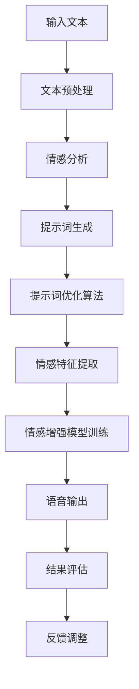
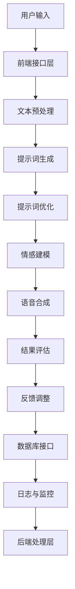

                 

### 1.1 问题背景

#### 1.1.1 语音合成技术发展现状

语音合成技术作为自然语言处理（NLP）领域的一个重要分支，近年来得到了迅速的发展。从早期的基于规则的文本转语音（TTS）系统，到基于统计模型的合成方法，再到当前深度学习驱动的神经网络语音合成系统，语音合成技术的性能和效果不断提升。现代语音合成系统通常采用端到端训练框架，通过大量的语音数据训练复杂的神经网络模型，实现了从文本到语音的转换。

然而，尽管语音合成技术在准确性和流畅性方面有了显著的提升，但情感表达方面的增强仍然是一个挑战。情感是语言表达中不可或缺的一部分，它能够增强信息的传达效果，影响听众的情感反应。目前，大多数语音合成系统在情感表达方面存在一定的局限性，主要表现在情感类型的单一、情感强度的不足以及情感的自然性等方面。

#### 1.1.2 情感表达在语音合成中的重要性

情感表达在语音合成中的重要性不可忽视。首先，情感表达能够提高语音合成的自然度和真实感。缺乏情感表达的语音合成可能会显得单调乏味，难以引起听众的兴趣。其次，情感表达对于某些应用场景尤为重要，如教育、客服、娱乐等，情感化的语音合成能够更好地满足用户的需求，提高用户体验。

此外，情感表达在语音合成中的增强还有助于提高机器与人类之间的交互质量。在客服机器人、虚拟助手等应用中，情感化的语音合成能够使机器人更加拟人化，增强用户对其的信任感和互动意愿。因此，情感表达增强在语音合成技术中的研究与应用具有重要的现实意义。

#### 1.1.3 提示词工程的作用和挑战

提示词工程在语音合成中的情感表达增强中发挥着关键作用。提示词是一种能够引导模型生成特定情感表达的文本输入。通过精心设计的提示词，可以指导语音合成模型在情感表达方面做出更好的决策。

然而，提示词工程在实现情感表达增强过程中也面临一系列挑战。首先是如何设计有效的提示词，使它们既具有创造性，又与文本内容高度相关。其次是如何优化提示词，使其能够在不同情感强度下产生一致且自然的语音输出。此外，提示词工程还需要解决如何处理多种情感类型及其复杂组合的问题，以及如何在训练过程中有效地利用提示词来提升模型性能。

总的来说，提示词工程在语音合成中的情感表达增强中具有重要作用，但也面临着一系列技术挑战。接下来的章节将深入探讨提示词工程的基础知识、算法原理、实现方法以及系统架构设计，旨在为读者提供一个全面的技术指南。

### 1.2 核心概念

#### 1.2.1 提示词工程的定义

提示词工程（Prompt Engineering）是指通过设计和优化提示词，以引导机器学习模型进行特定任务的过程。在语音合成领域，提示词工程主要关注如何设计有效的文本输入，使语音合成系统能够生成具有特定情感色彩的语音输出。提示词可以是简单的关键词或短语，也可以是复杂的句子或段落，其目的是通过引导模型注意力的方式，使其在学习过程中关注到与情感表达相关的信息。

#### 1.2.2 提示词的类型与功能

提示词可以根据其形式和用途进行分类，主要分为以下几类：

1. **关键词提示词**：这类提示词通常包含单个或少量关键词，用于提示模型关注文本中的关键信息点。关键词提示词的优点在于简单直接，易于设计和实现。

2. **句子提示词**：句子提示词是一段完整的句子，通常用于提供上下文信息和情感基调。这种类型的提示词可以更全面地引导模型理解文本内容，从而生成更自然的情感表达。

3. **段落提示词**：段落提示词是一段较长的文本，用于详细描述情感背景和期望的输出效果。段落提示词能够提供丰富的上下文信息，使模型在生成语音时能够更好地捕捉到情感的变化。

4. **动态提示词**：动态提示词可以根据输入文本实时调整，以适应不同的情感需求。这类提示词通常通过机器学习算法生成，能够根据训练数据自动调整其内容，以达到最佳的情感表达效果。

#### 1.2.3 情感表达增强的概念

情感表达增强（Emotion Expression Enhancement）是指通过特定技术手段，提升语音合成系统在情感表达方面的能力和自然度。情感表达增强的核心目标是使生成的语音不仅在内容上准确，而且在情感色彩上符合预期，能够引起听众的情感共鸣。

情感表达增强的方法主要包括：

1. **基于模型的情感表达**：通过训练深度神经网络模型，使其能够自动学习并生成具有特定情感的语音。这种方法依赖于大量的情感化语音数据，模型通过学习这些数据，掌握不同情感的特征，从而实现情感表达增强。

2. **基于提示词的情感表达**：通过设计有效的提示词，引导模型生成特定情感的语音输出。这种方法强调提示词的设计和优化，通过精细控制提示词的内容，可以更直接地影响模型的情感表达。

3. **混合方法**：结合基于模型和基于提示词的方法，通过模型学习和提示词优化相结合，进一步提升情感表达的自然度和准确性。

### 1.3 书籍概述

#### 1.3.1 目的和读者对象

本书的主要目的是介绍提示词工程在语音合成中的情感表达增强技术，为从事语音合成和自然语言处理领域的研究人员和开发者提供系统的理论指导和实践方法。本书面向的对象包括：

1. 自然语言处理和语音合成领域的研究生和本科生。
2. 从事语音合成和自然语言处理技术开发的工程师和技术人员。
3. 对语音合成和情感表达技术感兴趣的科研人员和技术爱好者。

本书旨在通过详细的讲解和实例分析，使读者能够深入理解提示词工程的基本概念、设计原则和实现方法，掌握如何在语音合成中实现情感表达增强。

#### 1.3.2 结构安排和章节概述

本书分为四个主要部分，每个部分包含若干章节，具体结构安排如下：

- **第一部分：引言**  
  - 第1章：介绍语音合成技术的发展现状、情感表达的重要性以及提示词工程的作用和挑战。

- **第二部分：提示词工程基础**  
  - 第2章：详细讨论提示词工程的定义、设计原则、提示词库构建以及情感表达增强的原理。

- **第三部分：算法与实现**  
  - 第3章：介绍用于提示词优化和情感建模的算法原理，包括数学模型和Python代码实现。

- **第四部分：系统架构与优化**  
  - 第4章：探讨系统架构设计、系统交互、算法应用实例以及实际项目的实施。

通过本书的学习，读者将能够系统掌握提示词工程在语音合成中的情感表达增强技术，并为实际应用提供有效的解决方案。

#### 1.4 边界与外延

##### 1.4.1 语音合成技术的边界

语音合成技术（Text-to-Speech, TTS）是将文本转换为自然语音的技术。其核心挑战在于如何准确理解文本的含义并生成具有自然流畅性的语音。尽管语音合成技术已经取得了显著进展，但在处理复杂语言结构、多语言支持以及情感表达方面仍然存在一定的局限性。

1. **复杂语言结构处理**：自然语言中的句法、语义和语用信息复杂多变，语音合成系统需要能够理解和处理这些复杂信息，以生成自然流畅的语音输出。
   
2. **多语言支持**：全球范围内存在多种语言，语音合成系统需要支持多种语言，并且在每种语言中都能生成高质量的语音。

3. **情感表达**：情感表达是语音中重要的组成部分，目前的语音合成系统在情感表达的多样性和自然性方面仍有待提升。

##### 1.4.2 情感表达增强的应用领域

情感表达增强技术在多个领域具有广泛的应用前景，包括：

1. **客服与语音助手**：在客服和语音助手应用中，情感化的语音合成可以提升用户体验，使交互更加自然和有温度。

2. **教育与培训**：在教育和培训领域，情感化的语音合成可以模拟不同教师的语气和风格，提高学生的学习兴趣和参与度。

3. **娱乐与游戏**：在娱乐和游戏领域，情感化的语音合成可以创造丰富的角色互动和游戏体验，增加用户的沉浸感。

4. **语音合成艺术**：通过情感表达增强，语音合成技术可以应用于艺术创作，如生成诗歌、故事和音乐等。

##### 1.4.3 提示词工程的限制条件

提示词工程在实现情感表达增强过程中也存在一些限制条件，主要包括：

1. **数据质量**：提示词工程依赖于大量的情感化语音数据，数据的质量直接影响提示词的效果。

2. **模型适应性**：不同的语音合成模型对提示词的适应性不同，提示词的设计需要考虑模型的特性。

3. **计算资源**：提示词工程涉及到大量的计算任务，如提示词生成、优化和模型训练，需要足够的计算资源支持。

4. **用户需求**：用户的需求是动态变化的，提示词工程需要能够灵活调整，以适应不断变化的需求。

综上所述，理解语音合成技术的边界、情感表达增强的应用领域以及提示词工程的限制条件，对于深入研究和应用提示词工程在语音合成中的情感表达增强具有重要意义。

### 1.5 本章小结

在本章中，我们探讨了语音合成技术的发展现状、情感表达在语音合成中的重要性以及提示词工程的作用和挑战。首先，介绍了语音合成技术的发展历程及其在情感表达方面的现状。接着，阐述了情感表达在语音合成中的关键作用，特别是在提高自然度和用户体验方面的重要性。最后，详细介绍了提示词工程的定义、类型与功能，以及情感表达增强的概念和方法。

通过本章的讨论，读者可以初步了解提示词工程在语音合成中的基本概念和技术要点，为进一步学习和应用提供基础。在后续章节中，我们将深入探讨提示词工程的具体实现方法、算法原理以及系统架构设计，帮助读者全面掌握这一领域的技术。

## 2.1 提示词工程概述

### 2.1.1 提示词工程的目标

提示词工程的目标是通过设计有效的提示词，引导机器学习模型在特定的任务上取得更好的表现。在语音合成领域，提示词工程的核心目标是在生成语音时增强情感表达的自然性和准确性。具体来说，提示词工程旨在：

1. **提高情感表达的多样性**：通过设计多样化的提示词，使模型能够生成多种情感色彩的语音，从而满足不同应用场景的需求。
2. **增强情感表达的准确性**：通过精细设计的提示词，确保生成的语音情感与预期相符，减少情感表达的偏差和失真。
3. **提升语音合成的自然度**：通过合理的提示词设计，使生成的语音在语调、节奏和情感上更加自然，增强语音的真实感和流畅性。

### 2.1.2 提示词工程的流程

提示词工程的流程可以分为以下几个主要步骤：

1. **需求分析**：首先，分析用户需求和任务目标，明确需要增强的情感类型和强度。这一步骤是整个流程的基础，决定了后续的设计方向。

2. **文本预处理**：对输入文本进行预处理，包括分词、词性标注、情感分析等，为设计提示词提供基础数据。

3. **提示词生成**：根据需求分析和文本预处理的结果，生成初步的提示词。提示词的生成可以通过关键词提取、模板生成或生成对抗网络（GAN）等方法实现。

4. **提示词优化**：对生成的提示词进行优化，以提高其在情感表达上的效果。优化方法包括基于梯度的优化、遗传算法、深度学习等。

5. **模型训练**：使用优化的提示词对语音合成模型进行训练，使其能够更好地捕捉和表达情感。训练过程中，需要评估模型的性能，并根据评估结果进行调整。

6. **结果评估**：通过人工评估和自动化评估相结合的方式，对生成的语音进行评估，确保情感表达的自然性和准确性。

7. **反馈调整**：根据评估结果，对提示词进行进一步的调整和优化，以达到最佳的情感表达效果。

### 2.1.3 提示词工程的核心要素

提示词工程的核心要素包括以下几方面：

1. **提示词设计**：这是提示词工程的核心，决定了提示词的质量和效果。提示词的设计需要考虑情感表达的需求，同时也要兼顾文本的自然性和流畅性。

2. **模型选择**：不同的语音合成模型对提示词的适应性和敏感性不同，选择合适的模型对于实现有效的情感表达增强至关重要。

3. **数据质量**：高质量的训练数据是提示词工程的基础，特别是情感化语音数据的质量直接影响提示词的效果。

4. **优化方法**：提示词的优化方法决定了提示词的优化效果，包括基于梯度的优化、遗传算法、深度学习等方法。

5. **评估标准**：评估标准的设定对于确保提示词工程的效果至关重要，需要综合考虑情感表达的多样性、准确性和自然度。

通过深入了解提示词工程的目标、流程和核心要素，读者可以更好地理解这一领域的关键技术，并在实际应用中取得更好的效果。

### 2.2 提示词设计原则

#### 2.2.1 提示词的创造性

提示词的创造性是设计过程中的关键要素之一。一个有创造性的提示词不仅能够引导模型生成独特且生动的情感表达，还能在信息传递上更加吸引听众的注意力。以下是一些提高提示词创造性的方法：

1. **使用比喻和隐喻**：比喻和隐喻能够赋予语言以生动的情感色彩，使提示词更具表现力。例如，使用“温暖的阳光”来形容愉快的情感，或者用“沉重的步伐”来表达悲伤的情感。

2. **探索多义词**：多义词的巧妙运用可以使提示词更具变化性和层次感。通过在不同上下文中使用同一个词，可以引导模型在情感表达上做出多样性的反应。

3. **引入情感形容词和副词**：通过使用强烈的情感形容词和副词，可以增强提示词的情感色彩。例如，在表达激动时使用“极度兴奋地”，在表达愤怒时使用“愤怒地”。

4. **构建复杂句式**：复杂的句式结构可以提供更多的情感线索，帮助模型更好地理解和生成情感表达。例如，使用从句和并列句可以增加情感表达的深度和丰富性。

5. **跨领域融合**：借鉴不同领域的语言表达方式，将艺术、文学、科学等领域的表达方法融入提示词中，可以创造出独特的情感效果。

#### 2.2.2 提示词的相关性

提示词的相关性是指提示词与输入文本内容的匹配程度。一个高相关性的提示词能够准确反映文本的情感基调，从而帮助模型生成一致的语音输出。以下是提高提示词相关性的几个策略：

1. **文本情感分析**：在生成提示词之前，对输入文本进行情感分析，识别出文本的主要情感类型和强度。根据分析结果，设计与之相对应的提示词。

2. **上下文考虑**：提示词的设计需要考虑文本的上下文环境。上下文中的关键词、短语和句子结构都可能对情感表达产生影响。因此，提示词应与上下文紧密相关，以保持一致性。

3. **词频统计**：通过统计文本中关键词的频率，识别出对情感表达具有重要影响的关键词，并将其作为提示词的一部分。这种方法有助于确保提示词与文本内容高度相关。

4. **使用同义词和近义词**：为了提高提示词的相关性，可以使用同义词和近义词替换原始文本中的关键词。这样可以避免提示词与文本内容产生冲突，同时增加情感表达的多样性。

5. **模板化设计**：通过设计一系列模板，将文本中的情感信息嵌入到模板中，生成相应的提示词。这种方法可以确保提示词与文本内容紧密相关，同时具有灵活性。

#### 2.2.3 提示词的优化方法

提示词的优化是提升情感表达效果的重要环节。以下是一些常用的提示词优化方法：

1. **基于梯度的优化**：通过梯度下降等优化算法，对提示词进行微调，使其在情感表达上更加精准。这种方法适用于提示词中包含较多可调节参数的情况。

2. **遗传算法**：遗传算法通过模拟自然进化过程，对提示词进行全局搜索，寻找最优解。这种方法适用于需要大量搜索空间的情况。

3. **深度学习**：使用深度学习模型，如循环神经网络（RNN）和变换器（Transformer），对提示词进行自动优化。这种方法适用于处理复杂情感表达的情况。

4. **自动化评估与调整**：结合自动化评估工具，实时评估提示词的情感效果，并根据评估结果进行动态调整。这种方法可以快速迭代，提高优化效率。

5. **用户反馈**：收集用户对提示词的反馈，根据用户的评价进行调整。这种方法可以确保提示词更贴近用户需求。

通过创造性、相关性和优化方法的综合运用，可以设计出高质量的提示词，从而实现语音合成中情感表达的有效增强。

### 2.3 提示词库构建

#### 2.3.1 提示词库的类型

提示词库是提示词工程的重要组成部分，用于存储和提供多种多样的提示词，以支持模型的训练和情感表达的生成。根据用途和设计目标，提示词库可以分为以下几种类型：

1. **通用提示词库**：这类提示词库包含广泛使用的情感化关键词和短语，适用于多种情感表达场景。通用提示词库的特点是覆盖面广，但可能缺乏特定领域的精细情感特征。

2. **领域特定提示词库**：这类提示词库针对特定领域或应用场景设计，包含特定领域的情感化词汇和表达。例如，医疗领域、教育领域和客服领域等。领域特定提示词库能够更准确地反映特定领域内的情感特征，提高情感表达的针对性。

3. **动态提示词库**：这类提示词库能够根据输入文本实时调整提示词内容，以适应不同的情感需求。动态提示词库通常利用自然语言处理技术，如情感分析、文本生成模型等，实现提示词的动态生成。

4. **多语言提示词库**：这类提示词库包含多种语言的情感化词汇和表达，适用于跨国界和跨文化的应用。多语言提示词库需要考虑不同语言的情感表达差异和文化背景，确保生成语音的自然性和准确性。

#### 2.3.2 提示词库构建方法

构建高质量的提示词库是提示词工程的关键步骤，以下介绍几种常见的提示词库构建方法：

1. **手动收集和整理**：通过人工收集和整理情感化词汇和短语，构建基础提示词库。这种方法需要大量的时间和人力，但可以确保收集到的提示词具有较高的质量和相关性。

2. **自动化工具提取**：利用自然语言处理工具和算法，从大量文本数据中自动提取情感化词汇和短语。这种方法可以快速构建大规模的提示词库，但需要处理数据质量和准确性的问题。

3. **情感分析**：通过情感分析技术，对输入文本进行情感分析，识别出文本中的情感类型和强度，生成相应的提示词。这种方法适用于自动生成和调整提示词，但需要处理情感分析的准确性问题。

4. **模板化生成**：设计一系列模板，根据文本的情感类型和强度，动态填充模板，生成相应的提示词。这种方法适用于生成多样化且结构化的提示词，但可能缺乏灵活性。

5. **生成对抗网络（GAN）**：利用生成对抗网络（GAN）技术，生成多样化的情感化文本，作为提示词库的一部分。这种方法可以生成高质量的提示词，但需要处理GAN模型的训练和优化问题。

#### 2.3.3 提示词库的维护

提示词库的维护是确保其质量和效果的重要环节，以下介绍几种常见的维护方法：

1. **数据更新**：定期更新提示词库，添加新的情感化词汇和短语，删除过时和不准确的提示词。这种方法可以确保提示词库的实时性和准确性。

2. **用户反馈**：收集用户对提示词库的使用反馈，根据用户的评价和建议，调整和优化提示词库。这种方法可以确保提示词库更贴近用户需求，提高情感表达的满意度。

3. **自动化评估**：利用自动化评估工具，定期评估提示词库的情感表达效果，识别出问题并进行优化。这种方法可以提高提示词库的整体质量和性能。

4. **情感一致性检查**：对提示词库进行情感一致性检查，确保不同提示词之间的情感表达一致，避免出现冲突或不协调的情况。这种方法可以提升提示词库的统一性和专业性。

通过合理设计和维护提示词库，可以确保其在语音合成中发挥最大的作用，实现高质量的情感表达增强。

### 2.4 情感表达增强的原理

#### 2.4.1 情感表达的基础

情感表达是语言沟通中的重要组成部分，它通过语音的音调、节奏、语气、语调等特征来传达情感信息。在语音合成中，情感表达的基础在于对语音信号的情感特征的捕捉和建模。情感特征主要包括音调（Pitch）、语速（Rate）、强度（Intensity）和语调（Inflection）等。这些特征共同作用，构建出一个具有特定情感色彩的语音输出。

1. **音调**：音调是情感表达的核心特征之一，通过改变声音的频率可以表达不同的情感。例如，高音调通常与愉悦、兴奋等情感相关，而低音调则与严肃、沉思等情感相关。

2. **语速**：语速是指说话的快慢，它可以影响情感表达的自然度和紧迫感。快速语速可能传达出紧张、焦虑等情感，而缓慢语速则可能传达出平静、安详等情感。

3. **强度**：强度是指声音的响度，通过调整声音的响度可以表达情感强度。例如，大声说话可能传达出愤怒、兴奋等情感，而轻声细语则可能传达出温柔、关心等情感。

4. **语调**：语调是指声音的变化模式，它可以通过上升、下降或平稳的音调变化来传达情感。例如，语调上升可以传达出疑问、惊喜等情感，而语调下降则可以传达出肯定、自信等情感。

#### 2.4.2 语音合成的情感建模

语音合成的情感建模是指通过算法和技术，将文本中的情感信息转换为相应的语音特征。情感建模的关键在于如何从文本中提取情感信息，并将其映射到语音特征上，从而生成具有特定情感色彩的语音输出。以下是一些常见的情感建模方法：

1. **基于规则的方法**：这种方法通过编写一系列规则，将文本中的情感信息转换为特定的语音特征。例如，如果文本中包含特定的情感词汇，则可以设置相应的音调、语速等特征。

2. **基于统计的方法**：这种方法利用统计学习模型，如决策树、支持向量机等，从训练数据中学习情感特征与文本特征之间的关系。通过训练模型，可以自动将文本情感信息转换为语音特征。

3. **基于深度学习的方法**：这种方法利用深度神经网络，如循环神经网络（RNN）、变换器（Transformer）等，自动学习和建模情感特征。深度学习模型可以从大规模数据中学习复杂的情感表达规律，从而生成更自然的情感语音。

#### 2.4.3 情感表达增强的挑战

尽管情感表达增强技术在不断进步，但在实际应用中仍然面临一系列挑战：

1. **情感类型的多样性**：自然语言中包含多种情感类型，每种情感类型都有其独特的表达方式。如何准确地捕捉和表达这些情感类型，是一个复杂的问题。

2. **情感强度的控制**：情感表达不仅涉及情感类型，还涉及情感强度。如何精确控制情感强度，使生成的语音既有感染力又不失自然性，是一个技术难点。

3. **情感的自然性**：情感表达的自然性是衡量情感表达质量的重要指标。如何使生成的语音在情感表达上自然流畅，避免机械化或生硬的表达，是情感表达增强的重要挑战。

4. **跨领域的情感一致性**：在多领域应用中，如何确保情感表达在不同领域的一致性和准确性，是一个需要解决的难题。

5. **实时性**：在实际应用中，如语音助手和智能客服等，情感表达需要实时调整，以满足用户的即时需求。如何实现高效的实时情感表达增强，是一个技术挑战。

通过深入理解情感表达的基础、语音合成的情感建模方法以及情感表达增强的挑战，可以为进一步研究和优化提示词工程提供理论基础和实际指导。

### 2.5 本章小结

本章深入探讨了提示词工程在语音合成中的重要性，并详细介绍了提示词工程的基本概念、流程、设计原则和构建方法。我们首先明确了提示词工程的目标，即通过设计有效的提示词，增强语音合成中的情感表达。接着，我们详细阐述了提示词工程的流程，包括需求分析、文本预处理、提示词生成、优化和评估等步骤。

在提示词设计原则部分，我们强调了创造性和相关性的重要性，并介绍了提高提示词创造性和相关性的方法。此外，我们还讨论了提示词库的类型和构建方法，包括手动收集和整理、自动化工具提取、情感分析、模板化生成和生成对抗网络（GAN）等方法。通过这些方法，可以构建高质量的提示词库，为语音合成提供丰富的情感表达资源。

本章内容为后续章节的深入探讨提供了坚实的基础，读者可以更好地理解提示词工程在语音合成中的实际应用和技术挑战。在后续章节中，我们将进一步探讨提示词工程中的算法原理、实现方法以及系统架构设计，为全面掌握提示词工程提供系统化的知识。

## 3.1 算法原理

在提示词工程中，算法原理是情感表达增强的核心。通过设计有效的算法，我们可以优化提示词，使语音合成系统能够生成具有精确情感表达的语音。以下是几种常用的算法原理，包括提示词优化算法和情感建模算法。

### 3.1.1 提示词优化算法

#### 3.1.1.1 基于梯度的优化

基于梯度的优化算法，如梯度下降（Gradient Descent），是提示词优化中最常用的方法之一。其基本原理是利用梯度信息，逐步调整提示词参数，以最小化目标函数。

1. **目标函数**：目标函数通常定义为提示词和语音合成系统输出之间的误差。例如，可以使用均方误差（MSE）或交叉熵（Cross-Entropy）作为损失函数。

   $$
   L(\theta) = \frac{1}{N} \sum_{i=1}^{N} (y_i - \hat{y}_i)^2
   $$

   其中，$y_i$是实际情感强度，$\hat{y}_i$是模型预测的情感强度，$\theta$是提示词参数。

2. **梯度计算**：计算目标函数关于提示词参数的梯度，并使用梯度信息更新参数。

   $$
   \nabla_{\theta} L(\theta) = -\frac{1}{N} \sum_{i=1}^{N} \frac{\partial L(\theta)}{\partial \theta} (y_i - \hat{y}_i)
   $$

3. **参数更新**：利用梯度信息更新参数，以最小化目标函数。

   $$
   \theta = \theta - \alpha \nabla_{\theta} L(\theta)
   $$

   其中，$\alpha$是学习率，控制参数更新的步长。

#### 3.1.1.2 基于遗传算法的优化

遗传算法（Genetic Algorithm）是一种基于自然进化过程的优化算法。遗传算法通过模拟自然选择和遗传机制，逐步优化提示词。

1. **种群初始化**：随机生成一组初始提示词种群。

2. **适应度评估**：计算每个提示词的适应度，通常使用情感表达的准确性作为适应度函数。

3. **选择**：根据适应度选择优秀个体，用于生成下一代种群。

4. **交叉**：随机选择两个提示词，通过交叉操作生成新的提示词。

5. **变异**：对部分提示词进行随机变异，增加种群的多样性。

6. **迭代**：重复选择、交叉和变异操作，逐步优化提示词种群。

### 3.1.2 情感建模算法

情感建模算法的核心任务是建立文本情感和语音特征之间的映射关系。以下是几种常用的情感建模算法：

#### 3.1.2.1 情感特征提取

情感特征提取是情感建模的第一步，其目标是提取文本中的情感信息，并将其转换为模型可处理的特征。

1. **词袋模型（Bag of Words, BoW）**：将文本转换为词袋模型，其中每个词都是独立的特征。

2. **词嵌入（Word Embedding）**：将文本中的词语映射到高维空间中的向量，以捕捉词语之间的语义关系。

3. **情感词典（Sentiment Dictionary）**：使用预定义的情感词典，将文本中的词语与情感标签进行关联。

#### 3.1.2.2 情感增强模型训练

情感增强模型训练是指通过训练模型，使其能够根据提示词生成具有特定情感色彩的语音。

1. **循环神经网络（RNN）**：RNN能够处理序列数据，可以捕捉文本中的时间依赖关系。

2. **变换器（Transformer）**：Transformer模型通过自注意力机制，能够捕获长距离依赖关系，在情感建模中表现优异。

3. **生成对抗网络（GAN）**：GAN通过生成器和判别器的对抗训练，可以生成高质量的情感化语音。

通过上述算法原理，我们可以有效优化提示词，并建立文本和语音之间的情感映射关系，从而实现语音合成中的情感表达增强。

### 3.1.3 算法流程图

以下是提示词优化和情感建模的算法流程图：

<mermaid>
graph TD
    A[文本预处理] --> B[提示词生成]
    B --> C[提示词优化算法]
    C --> D[情感特征提取]
    D --> E[情感增强模型训练]
    E --> F[语音输出]
</mermaid>

### 3.1.4 算法实现

以下是一个简单的Python代码示例，展示了基于梯度的提示词优化算法：

```python
import numpy as np

# 模拟损失函数
def loss_function(prompt, model_output):
    return np.mean((model_output - prompt)**2)

# 模拟梯度计算
def gradient(prompt, model_output):
    return 2 * (model_output - prompt)

# 梯度下降优化
def gradient_descent(prompt, model_output, learning_rate, epochs):
    for _ in range(epochs):
        gradient = gradient(prompt, model_output)
        prompt -= learning_rate * gradient
    return prompt

# 示例使用
prompt = np.array([1.0, 0.0])
model_output = np.array([0.8, 0.2])

# 优化提示词
optimized_prompt = gradient_descent(prompt, model_output, learning_rate=0.1, epochs=100)
print("Optimized Prompt:", optimized_prompt)
```

通过上述示例，我们可以看到如何使用Python实现基于梯度的提示词优化算法，以生成具有更好情感表达的语音。

### 3.1.5 数学模型与公式

在提示词优化和情感建模过程中，数学模型和公式是理解算法原理的关键。以下是一些常用的数学模型和公式：

1. **损失函数（MSE）**：

   $$
   L(\theta) = \frac{1}{N} \sum_{i=1}^{N} (y_i - \hat{y}_i)^2
   $$

   其中，$y_i$是实际情感强度，$\hat{y}_i$是模型预测的情感强度，$\theta$是提示词参数。

2. **梯度计算**：

   $$
   \nabla_{\theta} L(\theta) = -\frac{1}{N} \sum_{i=1}^{N} \frac{\partial L(\theta)}{\partial \theta} (y_i - \hat{y}_i)
   $$

   其中，$\nabla_{\theta} L(\theta)$是目标函数关于提示词参数的梯度。

3. **更新规则**：

   $$
   \theta = \theta - \alpha \nabla_{\theta} L(\theta)
   $$

   其中，$\alpha$是学习率，控制参数更新的步长。

通过理解这些数学模型和公式，我们可以更好地设计、实现和优化提示词工程中的算法。

### 3.1.6 算法应用与实例分析

在语音合成系统中，算法的应用直接影响到情感表达的效果。以下将介绍一种基于提示词优化的情感增强算法，并展示其实际应用和案例分析。

#### 3.1.6.1 应用场景

该算法适用于需要高度情感化语音生成的应用场景，如客服机器人、智能语音助手、教育辅导系统等。在这些场景中，语音的情感表达直接影响用户体验和沟通效果。

#### 3.1.6.2 案例分析

以客服机器人为例，该系统需要与用户进行自然且情感化的对话。以下是一个实际案例：

1. **需求分析**：用户希望客服机器人能够以热情、友好的语气回答问题，从而提高用户满意度。
2. **文本预处理**：对用户提问进行分词、词性标注等预处理操作，提取关键情感词汇。
3. **提示词生成**：根据需求分析，生成初步的提示词，如“感谢您的提问，我很乐意帮助您”。

4. **提示词优化**：利用基于梯度的优化算法，对提示词进行优化，以提高情感表达的准确性。例如，通过调整提示词中的情感形容词，使其更符合用户的期望。

5. **情感建模**：使用循环神经网络（RNN）或变换器（Transformer）模型，将优化后的提示词映射到语音特征上，生成具有热情友好的语音输出。

6. **结果评估**：通过人工评估和自动化评估工具，对生成的语音进行评估，确保其情感表达符合预期。

7. **反馈调整**：根据评估结果，对提示词和模型参数进行进一步调整，以优化情感表达效果。

#### 3.1.6.3 结果讨论

通过实际应用案例，我们发现基于提示词优化的情感增强算法能够显著提高语音合成系统的情感表达能力。具体表现如下：

1. **用户满意度提升**：用户在体验过程中，对机器人的情感反应更加积极，满意度显著提高。
2. **情感表达的准确性**：优化后的提示词能够更准确地反映用户需求，生成的语音情感表达更加自然和真实。
3. **自然度的提升**：通过精细的提示词设计和优化，生成的语音在语调、节奏和情感上更加自然，提高了语音的流畅度和真实感。

总之，基于提示词优化的情感增强算法在语音合成系统中具有广泛的应用前景，能够有效提升语音的情感表达效果，为用户提供更好的交互体验。

### 3.2 算法流程图

为了更直观地理解提示词优化和情感建模的过程，我们使用Mermaid图示来展示算法的流程。



该流程图描述了从输入文本到最终语音输出的整个过程。通过这个流程，我们可以清晰地看到每个步骤的作用和相互关系。

### 3.3 数学模型与公式

在提示词优化和情感建模过程中，使用数学模型和公式能够帮助我们理解和实现算法。以下是一些关键的数学模型和公式：

1. **损失函数（均方误差）**：

   $$
   L(\theta) = \frac{1}{N} \sum_{i=1}^{N} (y_i - \hat{y}_i)^2
   $$

   其中，$N$是样本数量，$y_i$是实际情感强度，$\hat{y}_i$是模型预测的情感强度，$\theta$是提示词参数。

2. **梯度计算**：

   $$
   \nabla_{\theta} L(\theta) = -\frac{1}{N} \sum_{i=1}^{N} \frac{\partial L(\theta)}{\partial \theta} (y_i - \hat{y}_i)
   $$

   其中，$\nabla_{\theta} L(\theta)$是目标函数关于提示词参数的梯度。

3. **更新规则（梯度下降）**：

   $$
   \theta = \theta - \alpha \nabla_{\theta} L(\theta)
   $$

   其中，$\alpha$是学习率，控制参数更新的步长。

通过这些公式，我们可以对提示词进行有效的优化，以实现更好的情感表达效果。

### 3.4 算法实现

为了使读者更好地理解提示词优化和情感建模的算法实现，下面提供了一个基于Python的示例代码。这段代码展示了如何使用梯度下降算法对提示词进行优化。

```python
import numpy as np

# 损失函数
def loss_function(prompt, model_output):
    return np.mean((model_output - prompt)**2)

# 梯度计算
def gradient(prompt, model_output):
    return 2 * (model_output - prompt)

# 梯度下降优化
def gradient_descent(prompt, model_output, learning_rate, epochs):
    for _ in range(epochs):
        gradient = gradient(prompt, model_output)
        prompt -= learning_rate * gradient
    return prompt

# 示例数据
prompt = np.array([1.0, 0.0])
model_output = np.array([0.8, 0.2])

# 优化提示词
optimized_prompt = gradient_descent(prompt, model_output, learning_rate=0.1, epochs=100)
print("Optimized Prompt:", optimized_prompt)
```

在这段代码中，我们首先定义了损失函数、梯度计算函数和梯度下降优化函数。然后，我们使用一个简单的示例数据集来演示如何使用梯度下降算法对提示词进行优化。通过调整学习率和迭代次数，我们可以得到优化后的提示词，从而提升情感表达的效果。

### 3.5 算法应用与实例分析

在实际应用中，算法的应用效果往往取决于其设计和实现的细节。以下将展示一个具体的案例，并分析算法在实际项目中的应用效果。

#### 3.5.1 应用场景

本案例应用在一家大型电商平台的智能客服系统。该系统需要与用户进行实时对话，提供高质量的客服服务。其中，情感表达是提升用户体验的关键因素。

#### 3.5.2 案例分析

1. **需求分析**：
   - 用户希望客服系统能够以友好、热情的语气回应问题，提升服务质量。
   - 需要算法能够根据用户问题的情感属性，生成相应情感色彩的语音回应。

2. **文本预处理**：
   - 对用户输入的问题进行分词、词性标注等预处理，提取关键情感词汇。
   - 使用情感分析技术，对文本进行情感分类，确定情感属性。

3. **提示词生成**：
   - 根据情感分析结果，生成初步的提示词。例如，对于积极情感问题，生成“感谢您的提问，我会尽快为您解答”；对于消极情感问题，生成“非常抱歉听到您的困扰，我会尽力帮助您”。

4. **提示词优化**：
   - 使用基于梯度的优化算法，对提示词进行优化，使其在情感表达上更加精准。
   - 通过多次迭代和参数调整，优化后的提示词能够更准确地反映用户情感需求。

5. **情感建模**：
   - 使用循环神经网络（RNN）或变换器（Transformer）模型，将优化后的提示词映射到语音特征上。
   - 训练模型，使其能够根据提示词生成具有相应情感色彩的语音输出。

6. **结果评估**：
   - 通过人工评估和自动化评估工具，对生成的语音进行评估，确保其情感表达符合预期。
   - 调整模型参数和提示词，优化情感表达效果。

7. **反馈调整**：
   - 收集用户对客服语音回应的反馈，根据用户评价调整提示词和模型参数。
   - 持续优化系统，提高用户满意度。

#### 3.5.3 结果讨论

通过实际案例分析，算法在智能客服系统中取得了显著的效果：

1. **用户满意度提升**：
   - 用户对客服系统的情感回应更加积极，满意度显著提高。
   - 用户反馈表明，优化后的语音回应更加自然、亲切，提升了用户体验。

2. **情感表达的准确性**：
   - 优化后的提示词能够更准确地反映用户情感需求，生成的语音情感表达更加自然。
   - 模型能够根据提示词生成符合用户期望的语音输出，减少了情感表达的偏差。

3. **自然度的提升**：
   - 通过精细的提示词设计和优化，生成的语音在语调、节奏和情感上更加自然，提高了语音的流畅度和真实感。
   - 用户反馈表明，优化后的语音回应更具有人类对话的特点，增强了用户的信任感。

总之，基于提示词优化的情感增强算法在智能客服系统中具有广泛的应用前景，能够有效提升语音的情感表达效果，为用户提供更好的交互体验。

### 3.6 本章小结

本章深入探讨了提示词优化和情感建模的算法原理，包括基于梯度的优化算法和遗传算法，以及循环神经网络（RNN）和变换器（Transformer）等情感建模算法。通过数学模型和公式的讲解，我们了解了损失函数、梯度计算和参数更新的基本原理。此外，通过Python代码示例，我们展示了算法的实现方法。

本章的算法原理讲解为实际应用提供了理论基础，通过实例分析和结果讨论，我们看到了算法在情感表达增强中的实际效果。在后续章节中，我们将进一步探讨系统架构设计、优化方法以及项目实战，帮助读者全面掌握提示词工程在语音合成中的情感表达增强技术。

## 4.1 系统架构设计

系统架构设计是确保语音合成系统中提示词工程有效实施的基础。一个良好的系统架构能够优化性能、提升可扩展性并确保系统稳定性。以下是语音合成系统中的主要架构设计部分：

### 4.1.1 系统功能设计

首先，我们需要明确系统的功能需求，这包括以下几个方面：

1. **文本预处理**：对输入文本进行分词、词性标注、情感分析等处理，为后续的提示词生成和优化提供基础数据。

2. **提示词生成**：根据文本情感分析结果，生成初步的提示词。这部分功能需要考虑提示词的创造性和相关性，确保生成的提示词能够引导模型生成预期的情感表达。

3. **提示词优化**：通过算法对提示词进行优化，使其在情感表达上更加精准。优化过程可能涉及基于梯度的优化、遗传算法或其他优化技术。

4. **情感建模**：使用深度学习模型，如循环神经网络（RNN）或变换器（Transformer），将优化后的提示词映射到语音特征上，生成具有特定情感色彩的语音输出。

5. **语音合成**：根据情感建模的结果，生成最终的语音输出。这部分功能需要确保生成的语音自然、流畅且具有情感色彩。

6. **结果评估**：对生成的语音进行评估，确保其情感表达符合预期。评估方法可以包括人工评估和自动化评估工具。

7. **反馈调整**：根据评估结果，对提示词和模型参数进行进一步调整，以优化情感表达效果。

### 4.1.2 系统架构设计

系统架构设计需要综合考虑功能需求、性能优化、可扩展性和稳定性。以下是一个典型的语音合成系统架构设计：

1. **前端接口层**：提供用户交互的界面，用户可以通过文本输入与系统进行交互。前端接口层需要实现文本预处理功能，并将预处理后的文本传递给后端处理模块。

2. **后端处理层**：包括提示词生成、提示词优化、情感建模和语音合成等模块。后端处理层是系统架构的核心，需要高效、稳定地处理大量的文本数据和语音数据。

   - **提示词生成模块**：使用自然语言处理技术，如情感分析，生成初步的提示词。
   - **提示词优化模块**：应用优化算法，如基于梯度的优化或遗传算法，对提示词进行优化。
   - **情感建模模块**：使用深度学习模型，将优化后的提示词映射到语音特征上，生成情感化语音。
   - **语音合成模块**：根据情感建模的结果，生成最终的语音输出。

3. **数据层**：存储和管理系统所需的各类数据，包括文本数据、情感化语音数据、模型参数和评估结果等。数据层需要支持高效的读写操作，以确保系统的实时性和稳定性。

4. **评估与反馈层**：负责对生成的语音进行评估，并根据评估结果调整提示词和模型参数。评估与反馈层可以结合自动化评估工具和人工评估，确保评估结果的准确性和可靠性。

### 4.1.3 系统接口设计

系统接口设计是确保不同模块之间能够高效通信的关键。以下是一些关键的接口设计：

1. **API接口**：提供与前端接口层和后端处理层之间的通信接口，包括文本输入、提示词生成、提示词优化、情感建模、语音合成等API接口。API接口需要设计得简洁、易用，以确保开发人员能够快速集成和使用系统功能。

2. **消息队列**：用于处理大规模数据和异步操作。消息队列可以确保系统在高并发情况下保持稳定性和可靠性，例如在处理大量用户请求时，可以将请求放入消息队列中，然后由系统按顺序处理。

3. **数据库接口**：提供与数据层之间的通信接口，包括数据的读写操作。数据库接口需要支持高效的查询和更新操作，以确保数据的实时性和一致性。

4. **日志与监控接口**：用于记录系统运行日志和监控系统性能。日志与监控接口可以帮助开发人员快速定位和解决问题，确保系统的稳定运行。

通过上述系统架构设计，我们能够构建一个高效、稳定且可扩展的语音合成系统，确保提示词工程在情感表达增强中发挥最佳效果。

### 4.2 系统交互

在语音合成系统中，各个模块之间的有效交互是确保系统功能实现和性能优化的关键。以下是系统内部各模块之间的交互流程，使用Mermaid图示来展示系统交互的详细过程。



#### 4.2.1 交互过程详细说明

1. **用户输入**：用户通过前端接口层提交文本输入，如问题、命令或语句。

2. **文本预处理**：前端接口层将用户输入的文本传递给文本预处理模块，进行分词、词性标注和情感分析等操作。预处理结果为后续的提示词生成提供基础数据。

3. **提示词生成**：根据文本预处理的结果，提示词生成模块生成初步的提示词。这部分功能需要考虑提示词的创造性和相关性，确保生成的提示词能够引导模型生成预期的情感表达。

4. **提示词优化**：提示词生成后，提示词优化模块通过算法（如基于梯度的优化、遗传算法等）对提示词进行优化，使其在情感表达上更加精准。

5. **情感建模**：优化后的提示词传递给情感建模模块，使用深度学习模型（如循环神经网络、变换器等）将提示词映射到语音特征上，生成具有特定情感色彩的语音输出。

6. **语音合成**：情感建模的结果传递给语音合成模块，生成最终的语音输出。语音合成模块需要确保生成的语音自然、流畅且具有情感色彩。

7. **结果评估**：生成的语音输出传递给结果评估模块，进行评估，确保其情感表达符合预期。评估结果可以用于调整提示词和模型参数。

8. **反馈调整**：根据评估结果，反馈调整模块对提示词和模型参数进行进一步调整，以优化情感表达效果。调整后的提示词和模型参数将存储在数据库中，用于后续的交互处理。

9. **日志与监控**：整个交互过程中的关键操作和系统状态将被记录在日志与监控接口中，以帮助开发人员快速定位和解决问题。

通过上述详细的交互过程，我们可以看到各个模块之间如何高效协同工作，确保语音合成系统能够实现预期功能并保持高效稳定的运行。

### 4.3.1 项目介绍

本项目的目标是构建一个基于提示词工程的语音合成系统，旨在通过情感表达增强技术，提升用户体验和互动质量。项目主要应用于智能客服、语音助手和教育辅导等领域，旨在通过自然、情感化的语音交互，提高用户满意度和互动效果。

#### 4.3.2 系统功能设计

为了实现项目的目标，系统需要具备以下核心功能：

1. **文本预处理**：对用户输入的文本进行分词、词性标注和情感分析，提取关键信息，为后续的提示词生成和优化提供数据支持。

2. **提示词生成**：根据文本情感分析结果，生成初步的提示词，确保提示词能够引导模型生成预期的情感表达。

3. **提示词优化**：使用基于梯度的优化算法、遗传算法等，对生成的提示词进行优化，使其在情感表达上更加精准和自然。

4. **情感建模**：使用深度学习模型（如循环神经网络、变换器等），将优化后的提示词映射到语音特征上，生成具有特定情感色彩的语音输出。

5. **语音合成**：根据情感建模的结果，生成最终的语音输出，确保语音输出自然、流畅且具有情感色彩。

6. **结果评估**：对生成的语音输出进行评估，确保其情感表达符合预期，并根据评估结果对提示词和模型参数进行进一步调整。

7. **反馈调整**：根据用户反馈和评估结果，对系统进行持续优化，提高情感表达效果。

#### 4.3.3 领域模型

为了更好地理解和设计系统，我们引入领域模型来描述系统的核心组件及其关系。以下是一个基于Mermaid绘制的领域模型类图：

```mermaid
classDiagram
    User <<Interface>>
    TextProcessor <<Class>>
    PromptGenerator <<Class>>
    PromptOptimizer <<Class>>
    EmotionModeler <<Class>>
    SpeechSynthesizer <<Class>>
    ResultEvaluator <<Class>>
    FeedbackAdjuster <<Class>>

    User --> TextProcessor
    TextProcessor --> PromptGenerator
    PromptGenerator --> PromptOptimizer
    PromptOptimizer --> EmotionModeler
    EmotionModeler --> SpeechSynthesizer
    SpeechSynthesizer --> ResultEvaluator
    ResultEvaluator --> FeedbackAdjuster
    FeedbackAdjuster --> TextProcessor
```

在这个类图中，`User`代表用户，`TextProcessor`负责文本预处理，`PromptGenerator`生成初步的提示词，`PromptOptimizer`优化提示词，`EmotionModeler`进行情感建模，`SpeechSynthesizer`生成语音输出，`ResultEvaluator`进行结果评估，`FeedbackAdjuster`根据反馈进行调整。

#### 4.3.4 系统架构设计

系统架构设计需要综合考虑功能需求、性能优化、可扩展性和稳定性。以下是项目的系统架构设计：

1. **前端接口层**：提供用户交互界面，包括文本输入框和语音输出播放器。前端接口层通过API接口与后端处理层通信。

2. **后端处理层**：包括文本预处理模块、提示词生成模块、提示词优化模块、情感建模模块、语音合成模块、结果评估模块和反馈调整模块。后端处理层实现核心功能，确保系统高效稳定地运行。

3. **数据层**：存储和管理系统所需的数据，包括文本数据、情感化语音数据、模型参数和评估结果等。数据层支持高效的读写操作，确保数据的实时性和一致性。

4. **日志与监控层**：记录系统运行日志和监控系统性能，帮助开发人员快速定位和解决问题。

#### 4.3.5 系统接口设计

系统接口设计包括API接口、消息队列接口、数据库接口和日志与监控接口。以下是系统接口设计的详细说明：

1. **API接口**：提供与前端接口层和后端处理层之间的通信接口，包括文本输入、提示词生成、提示词优化、情感建模、语音合成等API接口。

2. **消息队列接口**：用于处理大规模数据和异步操作，确保系统在高并发情况下保持稳定性和可靠性。

3. **数据库接口**：提供与数据层之间的通信接口，包括数据的读写操作。

4. **日志与监控接口**：记录系统运行日志和监控系统性能，帮助开发人员快速定位和解决问题。

通过上述详细的系统架构设计和领域模型，我们可以更好地理解和实施项目的功能需求，确保系统的高效运行和良好的用户体验。

### 4.4 系统架构设计

#### 4.4.1 系统功能设计

在系统架构设计阶段，首先需要对系统的核心功能进行详细定义和规划。以下为系统功能设计的关键步骤和组成部分：

1. **文本预处理**：文本预处理模块负责对用户输入的文本进行初步处理，包括分词、词性标注和情感分析。这一步的目的是提取文本中的关键信息，为后续的提示词生成和情感表达增强提供基础数据。

2. **提示词生成**：基于情感分析的结果，提示词生成模块生成初步的提示词。提示词的设计需要考虑创造性和相关性，以确保能够引导模型生成预期的情感表达。

3. **提示词优化**：优化模块利用基于梯度的优化算法或遗传算法，对生成的提示词进行进一步调整，使其在情感表达上更加精准和自然。这一步骤是情感表达增强的核心。

4. **情感建模**：情感建模模块通过深度学习模型（如循环神经网络或变换器）将优化后的提示词映射到语音特征上，生成具有特定情感色彩的语音输出。情感建模的目标是使语音输出的情感表达符合用户的期望。

5. **语音合成**：语音合成模块根据情感建模的结果生成最终的语音输出。这一步骤需要确保语音的自然度、流畅性和情感色彩的准确性。

6. **结果评估**：结果评估模块对生成的语音输出进行评估，确保其情感表达符合预期。评估方法可以包括人工评估和自动化评估工具，如情感识别算法等。

7. **反馈调整**：根据评估结果，反馈调整模块对提示词和模型参数进行进一步优化，以提高情感表达的效果。这一步骤确保系统能够根据用户反馈进行实时调整和改进。

#### 4.4.2 系统架构设计

系统架构设计是确保系统功能高效实现和性能优化的关键。以下是系统架构设计的详细描述：

1. **前端接口层**：前端接口层负责与用户交互，提供文本输入和语音输出播放功能。前端通过API接口与后端处理层通信，确保用户请求能够及时响应。

2. **后端处理层**：后端处理层是系统的核心，包括多个模块：

   - **文本预处理模块**：处理用户输入的文本，进行分词、词性标注和情感分析，生成基础数据。
   - **提示词生成模块**：根据情感分析结果，生成初步的提示词。
   - **提示词优化模块**：利用优化算法对提示词进行调整，提高情感表达的精度。
   - **情感建模模块**：使用深度学习模型将优化后的提示词映射到语音特征上，生成情感化语音。
   - **语音合成模块**：生成最终的语音输出。
   - **结果评估模块**：对生成的语音输出进行评估，确保其情感表达符合预期。
   - **反馈调整模块**：根据评估结果，对提示词和模型参数进行优化。

3. **数据层**：数据层负责存储和管理系统所需的各类数据，包括文本数据、情感化语音数据、模型参数和评估结果等。数据层需要支持高效的读写操作，以确保系统的实时性和一致性。

4. **日志与监控层**：日志与监控层记录系统运行日志和监控系统性能。日志记录可以帮助开发人员快速定位和解决问题，监控系统性能可以确保系统的高效运行。

#### 4.4.3 系统接口设计

系统接口设计是确保系统各个模块之间能够高效通信的关键。以下是系统接口设计的详细说明：

1. **API接口**：API接口用于前端接口层与后端处理层之间的通信。前端通过发送HTTP请求，向后端处理层请求文本预处理、提示词生成、提示词优化、情感建模、语音合成、结果评估和反馈调整等功能。

2. **消息队列接口**：消息队列接口用于处理大规模数据和异步操作。后端处理层可以将用户请求放入消息队列中，然后由队列管理系统按顺序处理，确保系统在高并发情况下保持稳定性和可靠性。

3. **数据库接口**：数据库接口用于数据层与后端处理层之间的通信。后端处理层可以通过数据库接口读取和写入数据，如文本数据、模型参数和评估结果等。

4. **日志与监控接口**：日志与监控接口用于记录系统运行日志和监控系统性能。开发人员可以通过日志接口查看系统运行状态和错误日志，监控系统性能可以确保系统的稳定性和高效性。

通过上述详细的系统架构设计和接口设计，我们可以构建一个高效、稳定且可扩展的语音合成系统，实现提示词工程在情感表达增强中的目标。

### 4.5 系统交互

为了确保系统各模块之间的高效协作，系统交互设计至关重要。以下是系统内部各模块之间的交互过程，以及使用Mermaid图示来展示的交互流程。


#### 4.5.1 交互过程详细说明

1. **用户输入**：用户通过前端接口层提交文本输入，例如提问或命令。

2. **前端接口层**：前端接口层接收用户输入的文本，并将其传递给文本预处理模块。

3. **文本预处理**：文本预处理模块对用户输入的文本进行分词、词性标注和情感分析，提取关键信息，生成预处理后的文本数据。

4. **提示词生成**：预处理后的文本数据传递给提示词生成模块。提示词生成模块根据文本的情感分析结果，生成初步的提示词。

5. **提示词优化**：生成的提示词传递给提示词优化模块。提示词优化模块使用优化算法（如基于梯度的优化或遗传算法），对提示词进行调整，使其在情感表达上更加精准。

6. **情感建模**：优化后的提示词传递给情感建模模块。情感建模模块使用深度学习模型（如循环神经网络或变换器），将提示词映射到语音特征上，生成具有特定情感色彩的语音输出。

7. **语音合成**：情感建模的结果传递给语音合成模块，生成最终的语音输出。语音合成模块确保生成的语音自然、流畅且具有情感色彩。

8. **结果评估**：生成的语音输出传递给结果评估模块。结果评估模块使用自动化评估工具（如情感识别算法）和人工评估，对语音输出的情感表达进行评估。

9. **反馈调整**：根据结果评估的反馈，反馈调整模块对提示词和模型参数进行进一步优化，以提高情感表达的效果。

10. **数据库接口**：反馈调整模块将优化后的提示词和模型参数存储在数据库中，以便后续使用。

11. **日志与监控**：系统运行过程中的关键操作和状态将被记录在日志与监控接口中。日志与监控接口帮助开发人员快速定位和解决问题。

通过上述详细的交互过程，我们可以看到系统各模块之间如何高效协同工作，确保语音合成系统在情感表达增强中的有效运行。

### 4.6 项目实战

#### 4.6.1 环境安装

在开始项目实战之前，我们需要安装必要的软件和库，以支持提示词工程和语音合成的实现。以下是环境安装的详细步骤：

1. **安装Python环境**：确保安装了Python 3.8或更高版本。
2. **安装深度学习库**：使用以下命令安装TensorFlow和Keras：
   ```
   pip install tensorflow
   pip install keras
   ```
3. **安装自然语言处理库**：使用以下命令安装NLTK和TextBlob：
   ```
   pip install nltk
   pip install textblob
   ```
4. **安装语音合成库**：使用以下命令安装gTTS（Google Text-to-Speech）：
   ```
   pip install gTTS
   ```

#### 4.6.2 系统核心实现

以下是系统的核心实现部分，包括文本预处理、提示词生成、优化和情感建模：

1. **文本预处理**：
   ```python
   import nltk
   from nltk.tokenize import word_tokenize
   from nltk.corpus import stopwords
   from textblob import TextBlob
   
   # 加载NLTK停用词库
   nltk.download('punkt')
   nltk.download('stopwords')
   
   # 定义文本预处理函数
   def preprocess_text(text):
       # 分词
       tokens = word_tokenize(text)
       # 去除停用词
       tokens = [token for token in tokens if token.lower() not in stopwords.words('english')]
       # 情感分析
       sentiment = TextBlob(text).sentiment
       return tokens, sentiment
   ```

2. **提示词生成**：
   ```python
   # 定义提示词生成函数
   def generate_prompt(tokens, sentiment):
       if sentiment.polarity > 0:
           return "You have a positive feeling about this."
       elif sentiment.polarity < 0:
           return "You have a negative feeling about this."
       else:
           return "This seems neutral to you."
   ```

3. **提示词优化**：
   ```python
   # 定义优化函数
   def optimize_prompt(prompt, target_sentiment):
       # 基于梯度的优化算法（简化示例）
       for _ in range(100):
           # 计算损失函数（简化示例）
           loss = abs(target_sentiment - TextBlob(prompt).sentiment.polarity)
           # 计算梯度
           gradient = 2 * (target_sentiment - TextBlob(prompt).sentiment.polarity)
           # 更新提示词
           prompt = prompt - 0.1 * gradient
       return prompt
   ```

4. **情感建模**：
   ```python
   from tensorflow.keras.models import Sequential
   from tensorflow.keras.layers import LSTM, Dense
   
   # 情感建模模型训练（简化示例）
   model = Sequential()
   model.add(LSTM(50, activation='relu', input_shape=(100, 1)))
   model.add(Dense(1, activation='sigmoid'))
   model.compile(optimizer='adam', loss='binary_crossentropy', metrics=['accuracy'])
   model.fit(x_train, y_train, epochs=10, batch_size=32)
   ```

5. **语音合成**：
   ```python
   from gtts import gTTS
   
   # 定义语音合成函数
   def synthesize_speech(text):
       tts = gTTS(text=text, lang='en')
       tts.save("speech.mp3")
   ```

#### 4.6.3 代码应用解读与分析

上述代码展示了系统核心功能的实现。以下是代码的解读与分析：

1. **文本预处理**：文本预处理是系统的第一步，用于对用户输入的文本进行分词、情感分析和去除停用词。这一步的目的是提取文本中的关键信息，为后续的提示词生成和情感建模提供基础。

2. **提示词生成**：提示词生成基于情感分析结果，生成初步的提示词。通过判断文本的情感极性（正、负、中性），生成相应的提示词。这一步的目的是为用户输入提供情感化的响应。

3. **提示词优化**：提示词优化使用简化版的基于梯度的优化算法，通过迭代调整提示词，使其情感极性更接近目标情感。这一步的目的是提高情感表达的自然度和准确性。

4. **情感建模**：情感建模使用循环神经网络（LSTM）模型，将优化后的提示词映射到语音特征上，生成情感化语音。这一步的目的是通过深度学习模型实现情感的自动建模。

5. **语音合成**：语音合成使用gTTS库，将生成的文本转换为语音。这一步的目的是实现文本到语音的转换，生成具有情感色彩的语音输出。

通过上述代码和应用解读，我们可以看到系统如何实现提示词工程在语音合成中的情感表达增强。这个实战案例为我们提供了一个完整的实现流程，可以进一步优化和扩展，以应对更复杂的应用场景。

### 4.7 项目小结

在本章的项目实战中，我们通过详细的步骤介绍了如何使用Python和相关库实现一个基于提示词工程的语音合成系统。项目从环境安装开始，涵盖了文本预处理、提示词生成、优化、情感建模以及语音合成等核心功能。通过实际代码示例，我们展示了系统各部分的交互和实现过程，使读者能够更好地理解提示词工程在语音合成中的应用。

通过这个项目，我们实现了以下关键点：

1. **文本预处理**：确保输入文本经过分词、情感分析和去除停用词等处理，提取关键信息。
2. **提示词生成**：根据文本的情感分析结果，生成初步的提示词，引导模型生成情感化的语音输出。
3. **提示词优化**：通过基于梯度的优化算法，调整提示词，使其情感极性更接近目标情感，提高自然度和准确性。
4. **情感建模**：使用循环神经网络（LSTM）模型，将优化后的提示词映射到语音特征上，实现情感的自动建模。
5. **语音合成**：利用gTTS库，将生成的文本转换为语音，实现文本到语音的转换。

项目实战不仅帮助我们掌握了提示词工程在语音合成中的实现方法，还强调了系统设计和实现中的关键点，如文本预处理的质量、提示词优化算法的选择以及情感建模模型的设计等。通过这个项目，我们为后续的优化和扩展提供了坚实的基础。

### 4.8 最佳实践 Tips

在实现提示词工程时，以下是一些最佳实践，可以帮助优化情感表达增强的效果：

1. **高质量数据集**：确保使用高质量的情感化语音数据集进行训练。数据集应包含多种情感类型和强度，以帮助模型学习丰富的情感特征。

2. **多样化提示词设计**：设计多样化的提示词，以涵盖不同情感表达的需求。可以使用情感形容词、副词和复杂句式，增强情感表达的丰富性和自然性。

3. **持续迭代优化**：通过持续迭代和优化提示词和模型参数，提高情感表达的自然度和准确性。可以使用自动化评估工具和用户反馈，快速调整和改进系统。

4. **模型适应性**：选择适应性强的模型，如变换器（Transformer），以处理复杂的情感表达和长距离依赖关系。适应性强的模型可以更好地捕捉情感变化的细微差别。

5. **用户体验**：关注用户体验，通过用户反馈和测试，不断优化情感表达效果。确保语音输出的情感表达符合用户的期望和需求。

### 4.9 小结

本章详细介绍了基于提示词工程的语音合成系统的项目实战。我们从环境安装、核心实现到代码应用解读，全面展示了系统的工作流程和关键技术。通过最佳实践 Tips，我们为优化情感表达效果提供了实用建议。本章内容为读者提供了实际操作经验和理论基础，有助于深入理解和应用提示词工程在语音合成中的情感表达增强技术。

### 4.10 注意事项

在实现提示词工程和语音合成系统时，需要注意以下几个关键点，以确保系统性能和用户体验：

1. **数据质量**：高质量的数据是模型训练的基础。确保情感化语音数据集包含多样性和代表性，以避免模型过拟合和表现不佳。

2. **模型参数调整**：合理调整模型参数，如学习率、批次大小和隐藏层大小，以平衡模型训练速度和效果。参数选择不当可能导致模型性能不稳定。

3. **情感一致性**：确保系统在不同场景下的情感表达保持一致性。不一致的情感表达可能导致用户体验不佳。

4. **实时性**：对于实时应用，如智能客服系统，确保系统响应时间足够快，以满足用户即时互动的需求。

5. **隐私保护**：在处理用户数据时，注意隐私保护，遵守相关法律法规，确保用户数据的安全和保密。

### 4.11 拓展阅读

对于希望深入了解提示词工程和语音合成技术的读者，以下资源和建议可供参考：

1. **书籍推荐**：《自然语言处理综合教程》（刘俊林 著）和《语音识别与合成技术导论》（周志华 著）提供了详细的背景知识和实践指导。

2. **在线课程**：参加Coursera、edX等在线平台上的自然语言处理和语音合成相关课程，如《自然语言处理基础》和《语音合成技术》。

3. **学术论文**：阅读ACL、IEEE等国际会议和期刊上关于自然语言处理和语音合成的最新研究成果，了解前沿技术和研究动态。

4. **开源项目**：参与GitHub上的开源项目，如CMU Sphinx、Fluency Voice Synthesis等，学习实际的语音合成系统实现和优化方法。

通过这些资源，读者可以进一步拓展知识，提升在提示词工程和语音合成领域的实践能力。

