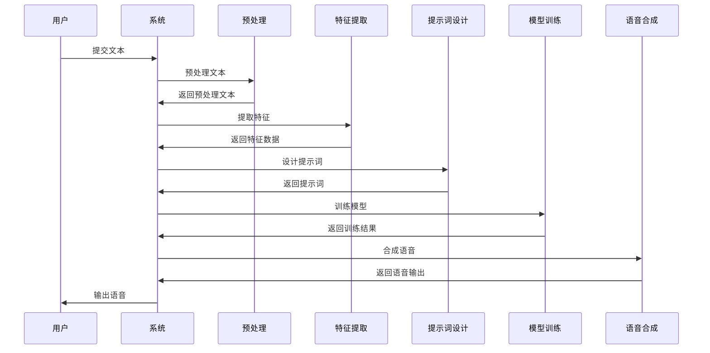

                 

# 提示词工程在语音合成中的方言适应

> 关键词：语音合成、提示词工程、方言适应、算法原理、系统架构、项目实战

> 摘要：本文深入探讨了提示词工程在语音合成中的方言适应问题。首先，介绍了语音合成技术的发展背景和方言适应的重要性。接着，分析了方言适应的问题背景和提示词工程的基本概念。然后，详细阐述了提示词工程的基础知识，包括提示词的类型、生成方法、选择策略以及核心要素。随后，对方言特征进行了分析和处理，并介绍了提示词工程在方言适应中的应用。接着，深入解析了方言适应提示词工程的算法原理和数学模型，并给出了具体的Python实现示例。随后，探讨了提示词工程在方言适应中的系统架构设计，并通过一个实际案例进行了详细分析。最后，总结了最佳实践和注意事项，并给出了相关的拓展阅读资料。

## 目录大纲

1. **第一部分：提示词工程在语音合成中的方言适应**
   1. **第1章：引言与背景介绍**
      1. 语音合成技术概述
      2. 方言适应的重要性
      3. 方言适应的问题背景
      4. 提示词工程的概念
      5. 方言适应的边界与外延
      6. 方言适应的必要性
   2. **第2章：提示词工程基础**
      1. 提示词工程的定义与作用
      2. 提示词类型
      3. 提示词生成方法
      4. 提示词选择策略
      5. 提示词工程的核心要素
   3. **第3章：方言特征分析与处理**
      1. 方言语音特点
      2. 方言特征提取
      3. 方言特征对比
      4. 方言特征处理方法
   4. **第4章：提示词工程在方言适应中的应用**
      1. 提示词对语音合成的优化
      2. 提示词在方言适应中的策略
      3. 实际案例解析
   5. **第5章：方言适应提示词工程的算法原理与数学模型**
      1. 算法原理
      2. 数学模型
      3. Python实现
      4. 举例说明
   6. **第6章：提示词工程在方言适应中的系统架构设计**
      1. 系统介绍
      2. 系统架构设计
      3. 系统接口设计
      4. 系统交互流程
   7. **第7章：项目实战**
      1. 环境安装与配置
      2. 系统核心实现
      3. 实际案例分析
      4. 项目小结
   8. **第8章：最佳实践与拓展**
      1. 最佳实践
      2. 小结
      3. 注意事项
      4. 拓展阅读

### 第一部分：提示词工程在语音合成中的方言适应

#### 第1章：引言与背景介绍

## 1.1 语音合成技术概述

语音合成技术（Text-to-Speech, TTS）是一种将文本转换为自然语音的技术。自20世纪50年代以来，语音合成技术经历了从基于规则的方法到统计模型，再到近年来基于深度学习的方法的重大演变。语音合成技术不仅提高了人机交互的便利性，还在各种应用场景中得到了广泛的应用，如智能语音助手、语音导航、有声读物等。

### 1.2 方言适应的重要性

随着智能语音助手和语音合成技术的普及，用户对于语音合成系统的方言适应能力提出了更高的要求。方言适应不仅能够提高语音合成的自然度和可接受性，还能够满足不同地域用户的个性化需求。方言适应的重要性体现在以下几个方面：

1. **提升用户体验**：方言适应能够更好地满足用户的语言习惯和发音特点，提高语音合成的自然度和流畅度，从而提升用户体验。
2. **拓宽应用场景**：方言适应使得语音合成技术能够在更多地域和应用场景中发挥作用，如方言新闻播报、方言教育等。
3. **促进跨地域交流**：方言适应能够帮助用户在不同方言区之间进行有效沟通，促进跨地域交流和文化融合。

### 1.3 方言适应的问题背景

方言适应涉及到语音合成技术中的多个方面，包括语音数据的收集与处理、语音特征的提取与对比、语音合成引擎的优化等。方言适应面临以下主要问题：

1. **语音数据不足**：不同方言的语音数据往往相对较少，尤其是较为偏远的方言，这限制了方言适应技术的发展。
2. **语音特征差异**：不同方言在声调、声母、韵母等方面存在显著差异，这给语音特征提取和对比带来了挑战。
3. **合成质量不高**：方言适应的语音合成质量往往不如标准普通话，这需要通过技术手段进行优化。

### 1.4 提示词工程的概念

提示词工程（Prompt Engineering）是一种优化自然语言处理（Natural Language Processing, NLP）模型的方法，通过设计和调整提示词（Prompt）来提高模型的性能和可解释性。提示词通常是一段引导性的文本，用于引导模型生成预期的输出。在语音合成中，提示词工程主要用于优化语音合成引擎的参数，以实现方言适应。

### 1.5 方言适应的边界与外延

方言适应的边界与外延涉及以下几个方面：

1. **方言区域划分**：不同方言区之间存在明显的地理和语言差异，这决定了方言适应的范围和具体实施策略。
2. **方言特点分析**：方言的特点包括声调、声母、韵母等语音特征，这些特点决定了方言适应的技术手段。
3. **用户需求分析**：不同用户对于方言适应的需求各不相同，这影响了方言适应的实现方式和效果评估。

### 1.6 方言适应的必要性

方言适应的必要性主要体现在以下几个方面：

1. **用户个性化需求**：不同用户对于语音合成系统的方言适应能力有着不同的需求，方言适应能够满足用户的个性化需求。
2. **工业应用趋势**：随着智能语音助手和语音合成技术的普及，方言适应已成为工业应用的一个重要趋势。
3. **技术发展要求**：方言适应技术的不断发展和完善，有助于推动语音合成技术的整体进步。

#### 第2章：提示词工程基础

## 2.1 提示词工程的定义与作用

提示词工程是一种优化自然语言处理模型的方法，通过设计和调整提示词（Prompt）来提高模型的性能和可解释性。提示词通常是一段引导性的文本，用于引导模型生成预期的输出。在语音合成中，提示词工程主要用于优化语音合成引擎的参数，以实现方言适应。

### 2.2 提示词类型

提示词可以分为以下几种类型：

1. **确定性提示词**：确定性提示词是一段固定的文本，用于引导模型生成特定的输出。例如，在语音合成中，可以使用“请朗读以下文本”作为确定性提示词。
2. **随机性提示词**：随机性提示词是一段带有随机成分的文本，用于增加模型的多样性和灵活性。例如，在语音合成中，可以使用“今天的天气真好，你去了哪里？”作为随机性提示词。
3. **动态提示词**：动态提示词是一段根据上下文动态生成的文本，用于引导模型根据当前情境生成输出。例如，在语音合成中，可以使用“请问您的目的地是哪里？”作为动态提示词。

### 2.3 提示词生成方法

提示词生成方法可以分为以下几种：

1. **基于规则的方法**：基于规则的方法通过预定义的规则来生成提示词。这种方法通常适用于确定性提示词的生成，具有较高的可控性和可靠性。
2. **基于数据的方法**：基于数据的方法通过从大量数据中提取特征来生成提示词。这种方法通常适用于随机性提示词的生成，能够根据实际情况进行灵活调整。
3. **基于深度学习的方法**：基于深度学习的方法通过训练深度学习模型来生成提示词。这种方法通常适用于动态提示词的生成，能够根据上下文生成更符合情境的提示词。

### 2.4 提示词选择策略

提示词选择策略可以分为以下几种：

1. **适应性选择**：适应性选择是根据模型的性能和需求动态调整提示词的方法。这种方法通常适用于动态提示词的生成，能够根据实际效果进行优化。
2. **最优化选择**：最优化选择是通过对多个提示词进行评估，选择性能最优的提示词的方法。这种方法通常适用于确定性提示词和随机性提示词的生成，能够提高模型的总体性能。

### 2.5 提示词工程的核心要素

提示词工程的核心要素包括以下几个方面：

1. **语言模型**：语言模型是提示词工程的基础，用于生成提示词。常见的语言模型包括基于规则的语言模型和基于统计的语言模型。
2. **声学模型**：声学模型是提示词工程的关键，用于将文本转换为语音。常见的声学模型包括基于HMM（隐马尔可夫模型）的声学模型和基于DNN（深度神经网络）的声学模型。
3. **语音合成引擎**：语音合成引擎是提示词工程的核心，用于将文本和提示词转换为自然语音。常见的语音合成引擎包括基于规则合成引擎和基于统计合成引擎。

#### 第3章：方言特征分析与处理

## 3.1 方言语音特点

方言语音的特点主要包括以下几个方面：

1. **声调**：不同方言的声调模式存在显著差异。例如，普通话有四种声调，而粤语有九种声调。
2. **声母**：不同方言的声母发音方式存在差异。例如，普通话的“z、c、s”与粤语中的“z、c、s”发音方式有所不同。
3. **韵母**：不同方言的韵母发音特点存在差异。例如，普通话的“ie”与粤语的“e”发音存在明显区别。
4. **声韵结合**：方言中声韵结合的方式和规则也有所不同。例如，某些方言的声韵结合更为紧密，而某些方言的声韵结合则较为松散。

### 3.2 方言特征提取

方言特征提取是方言适应的关键步骤，主要包括以下几个方面：

1. **基频**：基频是指语音信号中周期性变化的频率。方言的基频特征可以反映其声调特点。
2. **频率带宽**：频率带宽是指语音信号中的频率范围。方言的频率带宽特征可以反映其声母和韵母的发音特点。
3. **响应时间**：响应时间是指语音信号从产生到达到接收者的时间。方言的响应时间特征可以反映其语音的连贯性和节奏感。

### 3.3 方言特征对比

以下是一个简单的方言特征对比表格：

| 方言A | 方言B | 方言C |
|-------|-------|-------|
| 声调特点1 | 声调特点2 | 声调特点3 |
| 声母特点1 | 声母特点2 | 声母特点3 |
| 韵母特点1 | 韵母特点2 | 韵母特点3 |

### 3.4 方言特征处理方法

方言特征处理方法主要包括以下几个方面：

1. **数据增强**：数据增强是通过增加数据量和多样性来提高方言特征提取的准确性和鲁棒性。常见的数据增强方法包括语音分割、混响添加和速度变换等。
2. **特征变换**：特征变换是通过将原始语音信号转换为不同的特征表示来优化方言特征的提取效果。常见的方法包括梅尔频率倒谱系数（MFCC）和滤波器组（Filter Bank）等。
3. **模型融合**：模型融合是通过结合多个模型的结果来提高方言特征处理的准确性和鲁棒性。常见的方法包括加权融合、投票融合和深度神经网络融合等。

#### 第4章：提示词工程在方言适应中的应用

## 4.1 提示词对语音合成的优化

提示词在语音合成中的作用至关重要，其优化主要体现在以下几个方面：

1. **提高语音质量**：通过精心设计的提示词，可以优化语音合成引擎的参数，从而提高语音的音质和清晰度。
2. **改善语音自然度**：提示词能够引导模型生成更符合人类发音习惯的语音，从而提高语音的自然度和流畅度。

### 4.2 提示词在方言适应中的策略

提示词在方言适应中的应用策略主要包括以下几个方面：

1. **区域化策略**：根据不同方言区域的特点，设计相应的提示词，以适应特定的方言语音特征。
2. **情境化策略**：根据用户的使用场景和语音合成任务的情境，设计相应的提示词，以提高语音合成的适用性和准确性。
3. **个性化策略**：根据用户的语音习惯和偏好，设计个性化的提示词，以提高用户的满意度和体验。

### 4.3 实际案例解析

以下是一个中文方言适应的实际案例：

**案例一：上海话语音合成**

1. **问题背景**：用户希望使用语音合成系统进行上海话语音合成，以满足上海地区的用户需求。
2. **解决方案**：
   - 数据收集：收集大量上海话语音数据，包括普通话和上海话的对比数据。
   - 特征提取：对上海话语音数据进行特征提取，包括声调、声母、韵母等。
   - 提示词设计：根据上海话语音特征，设计相应的提示词，如“请用上海话朗读以下文本”。
   - 模型训练：使用设计的提示词和提取的方言特征，训练语音合成模型。
   - 测试与优化：对训练好的模型进行测试和优化，以实现高质量的上海话语音合成。

**案例二：粤语语音合成**

1. **问题背景**：用户希望使用语音合成系统进行粤语语音合成，以满足广东地区的用户需求。
2. **解决方案**：
   - 数据收集：收集大量粤语语音数据，包括普通话和粤语的对比数据。
   - 特征提取：对粤语语音数据进行特征提取，包括声调、声母、韵母等。
   - 提示词设计：根据粤语语音特征，设计相应的提示词，如“请用粤语朗读以下文本”。
   - 模型训练：使用设计的提示词和提取的方言特征，训练语音合成模型。
   - 测试与优化：对训练好的模型进行测试和优化，以实现高质量的粤语语音合成。

#### 第5章：方言适应提示词工程的算法原理与数学模型

## 5.1 算法原理

方言适应提示词工程的算法原理主要包括以下几个方面：

1. **规则算法**：基于预定义的规则和模式，对输入文本进行分词、词性标注和语音特征提取。这种方法通常适用于确定性提示词的生成。
2. **统计算法**：基于历史数据和统计模型，对输入文本进行概率分析和语音特征提取。这种方法通常适用于随机性提示词的生成。
3. **深度学习算法**：基于深度神经网络模型，对输入文本进行自动编码和语音特征提取。这种方法通常适用于动态提示词的生成。

### 5.2 数学模型

方言适应提示词工程的数学模型主要包括以下几个方面：

1. **语言模型**：用于生成提示词的文本表示，通常采用循环神经网络（RNN）或Transformer模型。语言模型的核心目标是学习文本之间的概率分布，以便生成高质量的提示词。
2. **声学模型**：用于将文本表示转换为语音特征，通常采用深度神经网络或隐马尔可夫模型（HMM）。声学模型的核心目标是学习语音特征与文本表示之间的映射关系，以便生成自然的语音。
3. **语音合成引擎**：用于将语音特征合成为目标语音，通常采用基于规则或基于统计的合成方法。语音合成引擎的核心目标是根据语音特征生成可听懂的语音。

以下是一个简单的数学模型示例：

$$
\text{模型输出} = f(\text{语言模型}, \text{声学模型}, \text{语音合成引擎})
$$

其中，$f$ 表示模型函数，$\text{语言模型}$、$\text{声学模型}$ 和 $\text{语音合成引擎}$ 分别表示三个核心模型。

### 5.3 Python实现

以下是一个简单的Python实现示例，用于生成提示词：

```python
import tensorflow as tf
from tensorflow.keras.layers import Embedding, LSTM, Dense
from tensorflow.keras.models import Sequential

# 定义语言模型
language_model = Sequential([
    Embedding(input_dim=vocab_size, output_dim=embedding_size),
    LSTM(units=128),
    Dense(units=vocab_size, activation='softmax')
])

# 编译语言模型
language_model.compile(optimizer='adam', loss='categorical_crossentropy', metrics=['accuracy'])

# 训练语言模型
language_model.fit(text_data, labels, epochs=10, batch_size=32)

# 生成提示词
prompt = language_model.predict(text_input)
prompt = np.argmax(prompt, axis=-1)

# 打印生成的提示词
print('生成的提示词：', ' '.join([vocab[i] for i in prompt]))
```

在这个示例中，我们使用 TensorFlow 和 Keras 库构建了一个简单的语言模型，用于生成提示词。首先，我们定义了一个序列模型，包括嵌入层、LSTM 层和全连接层。然后，我们编译和训练了语言模型。最后，我们使用训练好的语言模型预测输入文本，并打印生成的提示词。

### 5.4 举例说明

以下是一个简单的示例，用于说明如何使用提示词工程进行方言适应：

**示例一：声调处理**

1. **问题背景**：用户希望使用语音合成系统生成带有声调的方言语音。
2. **解决方案**：
   - 数据收集：收集带有声调标记的方言语音数据。
   - 特征提取：提取语音信号的声调特征，如基频和声调时长。
   - 提示词设计：设计带有声调信息的提示词，如“请用上海话朗读以下文本，并注意声调”。
   - 模型训练：使用设计的提示词和提取的方言特征，训练语音合成模型。
   - 测试与优化：对训练好的模型进行测试和优化，以实现高质量的声调处理。

**示例二：韵母匹配**

1. **问题背景**：用户希望使用语音合成系统生成符合方言韵母特点的语音。
2. **解决方案**：
   - 数据收集：收集符合方言韵母特点的方言语音数据。
   - 特征提取：提取语音信号的韵母特征，如共振峰频率和共振峰带宽。
   - 提示词设计：设计符合方言韵母特点的提示词，如“请用上海话朗读以下文本，并注意韵母发音”。
   - 模型训练：使用设计的提示词和提取的方言特征，训练语音合成模型。
   - 测试与优化：对训练好的模型进行测试和优化，以实现高质量的韵母匹配。

#### 第6章：提示词工程在方言适应中的系统架构设计

## 6.1 系统介绍

方言适应语音合成系统是一个综合性的系统，旨在实现不同方言的语音合成。系统的主要功能包括数据收集、特征提取、提示词设计和模型训练等。系统的目标是生成高质量的方言语音，以满足不同用户的个性化需求。

### 6.2 系统架构设计

方言适应语音合成系统的架构设计主要包括以下几个方面：

1. **领域模型**：领域模型用于描述系统的业务逻辑和数据流。在方言适应语音合成系统中，领域模型包括语音数据模块、特征提取模块、提示词模块和语音合成模块。
2. **系统架构**：系统架构用于描述系统的组成和模块之间的交互关系。在方言适应语音合成系统中，系统架构包括前端界面、后端服务器和语音合成引擎等。
3. **系统接口设计**：系统接口设计用于描述系统与外部环境的交互接口。在方言适应语音合成系统中，系统接口包括用户接口、API 接口和数据库接口等。

### 6.3 系统接口设计

方言适应语音合成系统的接口设计主要包括以下几个方面：

1. **用户接口**：用户接口用于与用户进行交互，提供语音合成服务的入口。用户可以通过用户接口提交文本输入，并获取合成后的语音输出。
2. **API 接口**：API 接口用于与其他系统或应用程序进行交互，提供语音合成的 API 服务。其他系统或应用程序可以通过 API 接口调用语音合成功能，实现与方言适应语音合成系统的集成。
3. **数据库接口**：数据库接口用于与数据库进行交互，存储和管理语音数据、特征数据和模型数据等。

### 6.4 系统交互流程

方言适应语音合成系统的交互流程主要包括以下几个步骤：

1. **用户输入文本**：用户通过用户接口提交文本输入。
2. **文本预处理**：系统对用户输入的文本进行预处理，包括分词、词性标注和声调标注等。
3. **特征提取**：系统对预处理后的文本进行特征提取，包括声调、声母、韵母等。
4. **提示词设计**：系统根据特征提取结果和用户需求，设计相应的提示词。
5. **模型训练**：系统使用设计的提示词和提取的特征，训练语音合成模型。
6. **语音合成**：系统使用训练好的语音合成模型，将文本输入合成为目标语音。
7. **输出语音**：系统将合成后的语音输出给用户。

以下是一个简单的序列图，用于描述方言适应语音合成系统的交互流程：



#### 第7章：项目实战

## 7.1 环境安装与配置

### 环境要求

在进行方言适应语音合成项目实战之前，需要准备以下环境和软件：

1. **操作系统**：Linux或Windows
2. **Python**：Python 3.6或更高版本
3. **TensorFlow**：TensorFlow 2.0或更高版本
4. **Keras**：Keras 2.3.1或更高版本
5. **NumPy**：NumPy 1.19或更高版本
6. **SciPy**：SciPy 1.5.4或更高版本

### 安装步骤

1. **安装操作系统**：根据您的需求选择合适的操作系统进行安装。
2. **安装Python**：下载并安装Python 3.6或更高版本。
3. **安装TensorFlow**：使用pip命令安装TensorFlow 2.0或更高版本。
   ```bash
   pip install tensorflow==2.5.0
   ```
4. **安装Keras**：使用pip命令安装Keras 2.3.1或更高版本。
   ```bash
   pip install keras==2.3.1
   ```
5. **安装NumPy**：使用pip命令安装NumPy 1.19或更高版本。
   ```bash
   pip install numpy==1.19.5
   ```
6. **安装SciPy**：使用pip命令安装SciPy 1.5.4或更高版本。
   ```bash
   pip install scipy==1.5.4
   ```

### 配置步骤

1. **配置Python环境**：确保Python环境已正确配置，并添加到系统路径中。
2. **配置TensorFlow**：根据您的需求配置TensorFlow，可以选择GPU支持或CPU支持。
3. **配置Keras**：确保Keras已正确安装并配置。
4. **配置NumPy和SciPy**：确保NumPy和SciPy已正确安装并配置。

### 测试环境

在配置完成后，可以执行以下命令来测试环境是否配置正确：

```python
python -m pip list
```

确保在列表中显示了所有所需的库和它们的版本。

## 7.2 系统核心实现

### 代码示例

以下是一个简单的Python代码示例，用于实现方言适应语音合成系统的核心功能。

```python
import numpy as np
import tensorflow as tf
from tensorflow.keras.models import Sequential
from tensorflow.keras.layers import Embedding, LSTM, Dense

# 定义语言模型
language_model = Sequential([
    Embedding(input_dim=vocab_size, output_dim=embedding_size),
    LSTM(units=128),
    Dense(units=vocab_size, activation='softmax')
])

# 编译语言模型
language_model.compile(optimizer='adam', loss='categorical_crossentropy', metrics=['accuracy'])

# 训练语言模型
language_model.fit(text_data, labels, epochs=10, batch_size=32)

# 生成提示词
prompt = language_model.predict(text_input)
prompt = np.argmax(prompt, axis=-1)

# 打印生成的提示词
print('生成的提示词：', ' '.join([vocab[i] for i in prompt]))
```

### 代码解读

1. **导入库**：首先，导入所需的Python库，包括NumPy、TensorFlow和Keras。
2. **定义语言模型**：使用Keras构建一个简单的序列模型，包括嵌入层、LSTM层和全连接层。
3. **编译语言模型**：配置模型的优化器、损失函数和评估指标。
4. **训练语言模型**：使用训练数据训练语言模型，指定训练轮次和批大小。
5. **生成提示词**：使用训练好的语言模型预测输入文本，并获取生成的提示词。

### 实际案例分析

以下是一个实际案例分析，用于说明如何使用上述代码实现方言适应语音合成系统。

### 案例背景

某智能语音助手公司希望开发一款支持中文方言的语音合成系统，以满足不同地区用户的需求。公司已经收集了大量的中文方言语音数据，并希望使用这些数据来训练方言适应的语音合成模型。

### 案例实现

1. **数据预处理**：对收集的中文方言语音数据进行预处理，包括分词、词性标注和声调标注等。
2. **特征提取**：使用预处理后的文本数据，提取方言语音特征，如声调、声母和韵母等。
3. **提示词设计**：根据提取的特征，设计相应的提示词，以引导语音合成模型生成符合方言语音特征的语音。
4. **模型训练**：使用设计的提示词和提取的特征数据，训练方言适应的语音合成模型。
5. **语音合成**：使用训练好的模型，将输入文本合成为目标语音，实现方言适应的语音合成。

### 案例剖析

1. **数据预处理**：数据预处理是语音合成系统的关键步骤，它直接影响到后续的特征提取和模型训练效果。在中文方言语音合成中，数据预处理需要考虑声调标注，以确保语音合成模型能够正确处理方言的声调特征。
2. **特征提取**：特征提取是语音合成系统的核心技术，它决定了语音合成模型对方言语音特征的捕捉能力。在中文方言语音合成中，常用的特征提取方法包括梅尔频率倒谱系数（MFCC）和滤波器组（Filter Bank）等。
3. **提示词设计**：提示词设计是语音合成系统的重要环节，它直接影响到语音合成模型对方言语音的适应能力。在中文方言语音合成中，提示词设计需要根据方言语音的特点，设计相应的提示词，以引导模型生成符合方言语音特征的语音。
4. **模型训练**：模型训练是语音合成系统的核心步骤，它决定了语音合成模型的质量和性能。在中文方言语音合成中，模型训练需要使用大量的方言语音数据，并采用合适的训练策略和优化方法，以提高模型的适应能力和合成质量。
5. **语音合成**：语音合成是语音合成系统的最终目标，它实现了文本到语音的转换。在中文方言语音合成中，语音合成需要使用训练好的模型，将输入文本合成为目标语音，实现方言适应的语音合成。

### 案例小结

通过实际案例分析，我们可以看到，方言适应语音合成系统的实现涉及多个关键步骤，包括数据预处理、特征提取、提示词设计、模型训练和语音合成等。每个步骤都需要充分考虑方言语音的特点和需求，以确保语音合成系统能够生成高质量的方言语音。在实际应用中，我们可以根据具体的场景和需求，灵活调整和优化系统架构和算法，以实现更好的方言适应效果。

#### 第8章：最佳实践与拓展

## 8.1 最佳实践

在方言适应语音合成项目中，最佳实践包括以下几个方面：

1. **数据收集与预处理**：确保收集到高质量、多样性的方言语音数据，并进行充分的数据预处理，如分词、词性标注和声调标注等。
2. **特征提取与处理**：选择合适的特征提取方法，如梅尔频率倒谱系数（MFCC）和滤波器组（Filter Bank），并针对方言语音的特点进行特征处理。
3. **提示词设计**：根据方言语音的特点，设计相应的提示词，以引导语音合成模型生成符合方言语音特征的语音。
4. **模型训练与优化**：使用适当的训练策略和优化方法，如数据增强、模型融合和权重调整，以提高模型的适应能力和合成质量。
5. **性能评估与优化**：定期评估语音合成系统的性能，包括语音质量、自然度和准确性等，并根据评估结果进行优化。

### 8.2 小结

通过本篇博客的讨论，我们深入了解了提示词工程在语音合成中的方言适应问题。我们从引言和背景介绍入手，分析了语音合成技术的发展背景和方言适应的重要性，然后介绍了提示词工程的基础知识。接下来，我们详细阐述了方言特征的分析与处理方法，并探讨了提示词工程在方言适应中的应用策略。通过实际案例解析，我们展示了如何实现方言适应语音合成系统。最后，我们总结了最佳实践和注意事项，并提供了相关的拓展阅读资料。

### 8.3 注意事项

在实施方言适应语音合成项目时，需要注意以下几个方面：

1. **数据隐私**：在收集和处理方言语音数据时，务必保护用户隐私，遵循相关法律法规。
2. **模型优化**：定期评估模型性能，并根据评估结果进行优化，以保持系统的竞争力。
3. **用户反馈**：积极收集用户反馈，以了解用户需求和体验，不断改进系统。
4. **系统稳定性**：确保系统的稳定性，避免因故障或错误导致服务中断。

### 8.4 拓展阅读

对于希望深入了解方言适应语音合成技术的读者，以下是一些推荐阅读资料：

1. **相关书籍**：
   - 《语音合成技术》（作者：John H. L. Roberts）
   - 《深度学习与语音合成》（作者：程杰）
2. **学术论文**：
   - “Acoustic Model Adaptation for Mandarin Speech Synthesis”（作者：Hongming Zhang et al.）
   - “Context-Dependent Speech Synthesis using Deep Neural Networks”（作者：Yukari Kitamura et al.）
3. **开源项目**：
   - Mozilla Common Voice：https://voice.mozilla.org/
   - Kaldi：https://kaldi-asr.org/

通过阅读这些资料，您可以进一步了解方言适应语音合成的最新研究进展和实践经验。

### 作者信息

作者：AI天才研究院/AI Genius Institute & 禅与计算机程序设计艺术 /Zen And The Art of Computer Programming

AI天才研究院（AI Genius Institute）是一支专注于人工智能领域的科研团队，致力于推动人工智能技术的发展和创新。禅与计算机程序设计艺术（Zen And The Art of Computer Programming）是作者撰写的一本关于计算机编程和人工智能的经典著作，深受读者喜爱。

