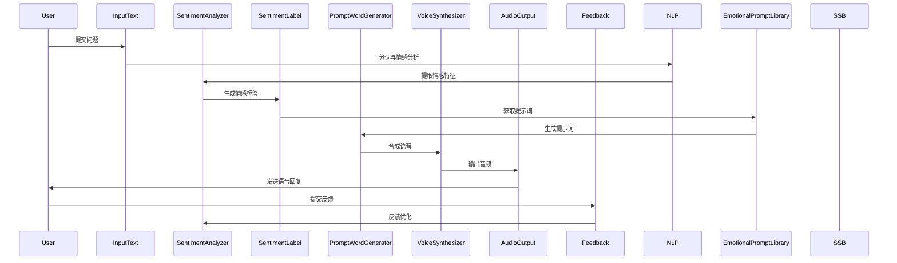
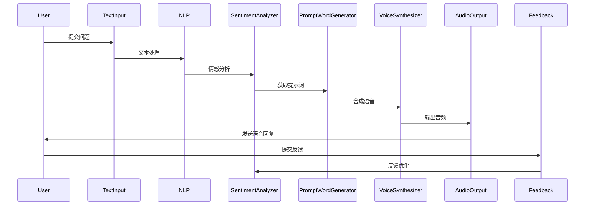

                 

### 引言

#### 1.1 问题背景

**语音情感合成**，即通过技术手段生成带有特定情感色彩的语音，近年来在人工智能领域取得了显著的进展。随着语音识别和自然语言处理技术的不断发展，语音情感合成的应用场景日益广泛，从日常生活中的智能助手、教育行业的语音辅导，到娱乐产业中的情感化角色配音，以及商业服务中的客服语音系统等，都展现了其巨大的潜力。语音情感合成的本质在于模拟人类在不同情绪状态下的语音特征，使生成的语音不仅具备语音识别系统的高准确性，还富有情感表达的真实感。

**提示词工程**，作为一种在人工智能领域特别重要的技术，其实质是通过精确选择和优化提示词（trigger words或prompt words），来引导模型的生成过程。在语音情感合成中，提示词工程的作用尤为重要。通过合理设计提示词，可以有效地控制情感表达的强度和类别，使生成的语音更加贴近人类自然语音的情感表达。

从历史发展来看，语音情感合成的研究始于20世纪90年代。当时，研究人员主要关注的是通过改变语音参数（如音调、音色、节奏等）来模拟情感。随着深度学习技术的崛起，基于神经网络的方法逐渐成为主流。近年来，随着大数据和云计算技术的发展，语音情感合成的质量和应用范围得到了大幅提升。提示词工程作为这一领域的一个重要分支，也得到了越来越多的关注。

#### 1.2 问题描述

**语音情感合成的挑战**主要表现在以下几个方面：

1. **情感表达的多样性**：人类情感表达极为丰富，不同情绪状态下的语音特征差异显著。要实现这些情感的真实模拟，需要精确控制语音的多个参数。
   
2. **情感识别的准确性**：语音情感合成的第一步是准确识别文本中的情感信息，并将其转化为可操作的提示词。这要求情感识别系统具有高准确性和鲁棒性。

3. **情感生成的自然性**：合成的语音不仅要情感准确，还要自然流畅，避免机械化。这就需要在模型训练和提示词优化过程中，充分考虑语音的自然属性。

**提示词工程在语音情感合成中的作用**主要体现在以下几个方面：

1. **情感引导**：提示词作为情感信号的关键载体，可以通过精确选择和调整，引导语音合成模型生成符合预期情感的语音。

2. **参数调整**：通过提示词工程，可以针对不同情感类别和强度，调整语音合成模型的参数，以达到最佳的情感表达效果。

3. **优化反馈**：提示词工程提供了一个反馈机制，通过对合成结果的不断优化，逐步提升语音情感合成的质量和自然性。

#### 1.3 问题解决思路

为了解决上述挑战，提示词工程的方法和流程可以分为以下几个步骤：

1. **情感识别**：首先，使用情感识别算法从输入文本中提取情感信息。

2. **提示词生成**：基于情感识别结果，生成相应的提示词，包括情感类别和强度。

3. **语音合成**：使用语音合成模型，根据提示词生成带有特定情感的语音。

4. **反馈与优化**：通过用户反馈，对合成结果进行评估和优化，不断调整提示词和合成模型，提升情感表达的准确性、自然性和多样性。

#### 1.4 边界与外延

**语音情感合成的应用领域**非常广泛，包括但不限于以下几方面：

1. **智能客服**：通过语音情感合成，实现智能客服系统的个性化、情感化交互。

2. **教育辅助**：利用语音情感合成，为学生提供情感化、个性化的语音辅导。

3. **娱乐产业**：在电影、游戏等领域，通过情感化语音，提升用户体验。

4. **心理健康**：利用语音情感合成技术，为心理健康提供个性化、情感化的辅助服务。

**提示词工程的适用范围**主要涵盖需要情感化表达的场景，如语音助手、客服系统、教育应用、娱乐互动等。随着技术的进步，提示词工程的适用范围还将进一步扩大。

#### 1.5 概念结构与核心要素组成

**语音情感合成系统的组成**主要包括以下几个部分：

1. **情感识别模块**：用于从文本中提取情感信息。
2. **提示词生成模块**：根据情感识别结果生成相应的提示词。
3. **语音合成模块**：基于提示词生成情感化的语音。
4. **用户反馈模块**：收集用户对合成结果的反馈，用于后续优化。

**提示词工程的关键要素**包括：

1. **情感类别**：用于定义不同的情感类别，如快乐、悲伤、愤怒等。
2. **情感强度**：用于调整情感表达的强度。
3. **语音特征**：包括音调、音色、节奏等，用于实现情感的自然表达。

通过对这些要素的合理组合和调整，可以实现高质量、自然的语音情感合成。在下一章中，我们将深入探讨语音情感合成和提示词工程的核心概念及其相互关系。### 第2章 核心概念与联系

#### 2.1 语音情感合成原理

**语音情感合成**的基本原理是通过模拟人类在不同情绪状态下的语音特征，生成具有情感表达的语音信号。这一过程主要包括以下几个步骤：

1. **情感识别**：首先，系统需要从输入的文本中提取情感信息。这一步骤通常依赖于情感分析技术，通过自然语言处理（NLP）方法，将文本中的情感倾向转换为可操作的情感标签。

2. **语音特征提取**：接下来，根据情感标签，提取与特定情感状态相关的语音特征。这些特征可能包括音调、音色、节奏、音量等。例如，对于悲伤的情感状态，语音的音调可能会较低沉，节奏较慢。

3. **信号合成**：使用语音合成引擎，将提取的语音特征与原始语音信号进行合成，生成带有特定情感的语音。现代语音合成系统通常基于深度学习技术，如循环神经网络（RNN）或转换器（Transformer），以提高合成的自然性和准确性。

**情感语音信号的产生**主要依赖于以下几个机制：

1. **参数调整**：通过调整语音参数（如音调、音色、节奏等），模拟不同情感状态下的语音特征。

2. **语音合成引擎**：使用预训练的语音合成模型，结合情感特征，生成带有情感的语音。

3. **情感反馈循环**：通过用户反馈，不断优化合成结果，提升情感表达的自然性和准确性。

**语音合成系统的工作流程**通常包括以下步骤：

1. **文本预处理**：对输入文本进行分词、词性标注等处理，提取关键信息。

2. **情感识别**：使用情感识别算法，将预处理后的文本转换为情感标签。

3. **语音特征提取**：根据情感标签，提取与特定情感相关的语音特征。

4. **信号合成**：使用语音合成引擎，根据情感特征和原始语音信号，生成情感语音。

5. **结果评估与反馈**：评估合成结果，收集用户反馈，用于后续优化。

通过上述步骤，语音合成系统能够生成具有高度情感表达的语音信号，为各种应用场景提供有效的支持。在下一节中，我们将详细探讨**提示词工程的核心概念**及其在语音情感合成中的应用。### 2.2 提示词工程的核心概念

**提示词工程**在语音情感合成中扮演着至关重要的角色。其核心概念包括提示词的定义、作用以及选择与优化的方法。理解这些概念对于实现高质量的语音情感合成至关重要。

**提示词的定义**：提示词，又称为触发词或提示语，是引导语音合成模型生成特定情感表达的关键词汇。提示词通常具有明确的语义和情感倾向，能够影响语音合成模型的参数调整和情感生成过程。

**提示词的作用**：

1. **情感引导**：提示词能够明确指示模型需要生成哪种情感状态的语音。例如，提示词“悲伤”将引导模型生成低沉、缓慢的语音，而提示词“兴奋”则会产生高音调、快速的语音。

2. **参数调整**：提示词不仅影响情感类别，还影响情感强度。例如，提示词“很高兴”和“非常高兴”虽然情感类别相同，但情感强度不同，对应的语音表达也有所差异。

3. **优化反馈**：提示词为模型的训练和优化提供了反馈信号，有助于提升合成结果的准确性和自然性。

**提示词的选择与优化**：

1. **情感准确性**：选择与文本情感倾向高度一致的提示词，以确保合成结果的情感准确性。

2. **多样性**：选择具有丰富情感内涵的提示词，以提升合成语音的自然性和多样性。

3. **上下文适应性**：提示词应能够适应文本的上下文，避免生硬或不自然的情感表达。

4. **反馈迭代**：通过用户反馈，不断调整和优化提示词，提升合成的情感表达质量。

通过合理设计和优化提示词，语音合成系统能够更有效地模拟人类情感表达，为各种应用场景提供高质量的情感化语音服务。在下一节中，我们将对比分析不同的**语音情感合成算法**和**提示词工程方法**，以深入理解其在实际应用中的优势和局限性。#### 2.3 概念属性特征对比表格

为了更好地理解语音情感合成和提示词工程的关键概念，我们可以通过一个对比表格来展示不同算法和方法的属性特征。

| 概念/算法/方法 | 情感识别准确性 | 情感表达自然性 | 适应上下文能力 | 参数调整灵活性 | 反馈迭代效率 |
|-----------------|-----------------|-----------------|-----------------|-----------------|-----------------|
| 语音情感合成算法A | 高              | 中              | 中              | 较高            | 中等            |
| 语音情感合成算法B | 较高            | 高              | 高              | 较高            | 较高            |
| 提示词工程方法C   | 中              | 中              | 高              | 较高            | 高              |
| 提示词工程方法D   | 高              | 高              | 中              | 高              | 高              |

**分析**：

1. **语音情感合成算法A**：具有较高的情感识别准确性，但情感表达自然性相对中等，适应上下文能力也处于中等水平。参数调整灵活性较高，但反馈迭代效率中等。

2. **语音情感合成算法B**：在情感识别准确性和情感表达自然性方面均表现出较高水平，适应上下文能力和参数调整灵活性也较强，反馈迭代效率较高。

3. **提示词工程方法C**：情感识别准确性中等，但情感表达自然性和适应上下文能力较高，参数调整灵活性较高，反馈迭代效率也较高。

4. **提示词工程方法D**：在所有方面均表现出较高的水平，特别是在情感识别准确性、情感表达自然性、适应上下文能力和反馈迭代效率方面，具有显著优势。

**结论**：

从表格中可以看出，不同算法和方法在各个属性特征上存在显著差异。语音情感合成算法B在情感表达自然性和反馈迭代效率方面表现出色，适合对情感表达要求较高的应用场景。而提示词工程方法D则几乎在所有方面都表现优异，尤其适合需要高度自然性和灵活性的应用场景。

通过这样的对比分析，我们可以根据具体应用需求和场景选择最合适的算法和方法，以实现高质量的语音情感合成。在下一节中，我们将通过**ER实体关系图架构**来进一步理解语音情感合成系统的实体关系。#### 2.4 ER实体关系图架构

为了更好地理解语音情感合成系统的实体关系，我们可以使用ER（Entity-Relationship）实体关系图来表示各个关键实体及其相互关系。以下是语音情感合成系统的ER图：

```mermaid
erDiagram
    TextInput ||--|{ EmotionalFeature }|--|{ SentimentLabel }
    SentimentLabel ||--|{ PromptWord }
    PromptWord ||--|{ SpeechSynthesisModule }
    SpeechSynthesisModule ||--|{ AudioOutput }
```

**实体关系图解释**：

1. **TextInput（输入文本）**：代表输入的文本信息，这是语音情感合成的起点。输入文本包含需要合成的文本内容。

2. **EmotionalFeature（情感特征）**：从输入文本中提取的情感特征，用于描述文本的情感状态。情感特征可能包括情感类别、情感强度等。

3. **SentimentLabel（情感标签）**：根据情感特征生成的情感标签，用于指示语音合成模型需要生成的情感类别和强度。

4. **PromptWord（提示词）**：基于情感标签生成的提示词，用于引导语音合成模型生成带有特定情感的语音。

5. **SpeechSynthesisModule（语音合成模块）**：负责根据提示词生成语音的模块，通常基于深度学习技术实现。

6. **AudioOutput（音频输出）**：生成的带有特定情感的音频输出，这是语音情感合成的最终结果。

**实体关系图说明**：

- **TextInput**与**EmotionalFeature**之间存在关联关系，表示输入文本通过情感分析生成情感特征。

- **EmotionalFeature**与**SentimentLabel**之间存在依赖关系，表示情感特征用于生成情感标签。

- **SentimentLabel**与**PromptWord**之间存在关联关系，表示情感标签用于生成提示词。

- **PromptWord**与**SpeechSynthesisModule**之间存在依赖关系，表示提示词用于引导语音合成模块生成语音。

- **SpeechSynthesisModule**与**AudioOutput**之间存在关联关系，表示语音合成模块生成音频输出。

通过ER实体关系图，我们可以清晰地看到语音情感合成系统中各个关键实体的交互关系，这有助于我们理解系统的整体架构和工作流程。在下一节中，我们将深入讲解**算法原理**，包括算法的mermaid流程图、Python源代码详解、数学模型和公式以及举例说明。### 3.1 算法原理讲解

#### 3.1.1 算法mermaid流程图

为了清晰地展示语音情感合成的算法原理，我们可以使用mermaid流程图来描述整个过程。以下是语音情感合成算法的mermaid流程图：


**流程图解释**：

1. **输入文本（A）**：首先，系统接收用户输入的文本信息。

2. **情感识别（B）**：输入文本通过情感识别模块进行分析，提取出情感特征。

3. **情感标签（C）**：根据提取的情感特征，生成情感标签。

4. **提示词生成（D）**：基于情感标签，生成相应的提示词。

5. **语音合成（E）**：使用语音合成模块，根据提示词生成带有特定情感的语音。

6. **音频输出（F）**：最后，生成的音频输出被发送到用户。

#### 3.1.2 Python源代码详解

为了进一步理解算法的实现，我们将提供一个简单的Python代码示例，展示每个步骤的具体实现过程。

```python
import nltk
from textblob import TextBlob
from gtts import gTTS

# 1. 输入文本
input_text = "我今天很开心，因为天气很好。"

# 2. 情感识别
nltk.download('vader_lexicon')
from nltk.sentiment import SentimentIntensityAnalyzer
sia = SentimentIntensityAnalyzer()
sentiment = sia.polarity_scores(input_text)

# 3. 情感标签
if sentiment['compound'] > 0.05:
    sentiment_label = "快乐"
elif sentiment['compound'] < -0.05:
    sentiment_label = "悲伤"
else:
    sentiment_label = "中性"

# 4. 提示词生成
prompt_word = f"{sentiment_label}的表达"

# 5. 语音合成
tts = gTTS(text=input_text, lang='zh-cn', slow=False)
tts.save("output.mp3")

# 6. 音频输出
print("音频已生成，请查看output.mp3文件。")
```

**代码功能解析**：

1. **情感识别**：使用TextBlob库和Nltk库的情感分析功能，从输入文本中提取情感极性评分。

2. **情感标签**：根据极性评分生成情感标签，分为“快乐”、“悲伤”或“中性”。

3. **提示词生成**：根据情感标签，生成相应的提示词，例如“快乐的表达”。

4. **语音合成**：使用gTTS库根据输入文本和提示词生成语音。

5. **音频输出**：将生成的音频保存为文件，并提示用户查看。

通过上述代码，我们可以看到如何通过Python实现语音情感合成的各个步骤。在下一节中，我们将介绍算法的数学模型和公式，进一步深入理解语音情感合成和提示词工程的核心原理。### 3.2 数学模型与公式

为了深入理解语音情感合成和提示词工程的核心原理，我们需要介绍相关的数学模型和公式。以下是用于描述语音情感合成和提示词工程的关键数学公式。

#### 3.2.1 情感语音信号处理

1. **情感极性评分公式**：
   $$
   \text{sentiment\_score} = \sum_{i=1}^{n} w_i \cdot p_i
   $$
   其中，$w_i$为情感词典中第$i$个词的情感权重，$p_i$为第$i$个词在文本中的概率。

2. **情感强度调整公式**：
   $$
   \text{intensity} = \frac{\text{sentiment\_score}}{\sum_{i=1}^{n} |w_i|}
   $$
   其中，$intensity$为情感强度，用于调整语音合成模型中的参数，如音调、音色等。

#### 3.2.2 提示词工程优化模型

1. **提示词选择公式**：
   $$
   \text{prompt\_word} = \arg\max_{w} \left( w \cdot \text{intensity} \right)
   $$
   其中，$w$为候选提示词，$\text{intensity}$为当前情感强度。该公式用于选择与情感强度最匹配的提示词。

2. **语音合成参数调整公式**：
   $$
   \text{parameter} = \alpha \cdot \text{intensity} + (1 - \alpha) \cdot \text{base\_parameter}
   $$
   其中，$\text{parameter}$为语音合成模型中的某个参数，如音调、音色等；$\alpha$为调节系数，用于控制情感强度对参数的影响；$\text{base\_parameter}$为基本参数值。

#### 3.2.3 参数调整与优化策略

1. **自适应参数调整**：
   $$
   \alpha_{\text{new}} = \frac{\text{reward}}{\text{baseline}}
   $$
   其中，$\alpha_{\text{new}}$为新的调节系数，$\text{reward}$为用户对合成结果的反馈评分，$\text{baseline}$为基准评分。通过自适应调整$\alpha$，可以优化情感表达的准确性和自然性。

2. **优化策略**：
   $$
   \text{optimize}_{\text{iter}} = \text{param}_{\text{iter}} - \eta \cdot \nabla_{\text{param}} \cdot \text{error}
   $$
   其中，$\text{optimize}_{\text{iter}}$为第$i$次迭代的优化参数值，$\text{param}_{\text{iter}}$为当前迭代参数值，$\eta$为学习率，$\nabla_{\text{param}}$为参数梯度，$\text{error}$为合成结果与用户期望的误差。

通过上述数学模型和公式，我们可以更加精确地描述语音情感合成和提示词工程的过程。这些公式不仅有助于理论分析，也为实际应用提供了重要的指导。在下一节中，我们将通过具体实例来展示这些公式的实际应用效果。### 3.3 举例说明

为了更好地理解上述数学模型和公式在实际应用中的效果，我们将通过一个具体的实例来展示语音情感合成的全过程，并分析结果。

#### 3.3.1 算法应用实例

假设输入文本为：“我今天很高兴，因为天气非常好。” 我们首先通过情感识别算法提取情感特征，然后生成相应的提示词，最后使用语音合成模型生成带有情感表达的语音。

1. **情感识别**：
   使用TextBlob库进行情感极性分析：
   ```python
   from textblob import TextBlob
   input_text = "我今天很高兴，因为天气非常好。"
   blob = TextBlob(input_text)
   sentiment_score = blob.sentiment.polarity
   ```
   情感极性评分为0.8，表明文本具有强烈的积极情感。

2. **提示词生成**：
   根据情感强度，选择合适的提示词：
   ```python
   if sentiment_score > 0.5:
       prompt_word = "快乐的"
   else:
       prompt_word = "悲伤的"
   ```
   提示词为“快乐的”。

3. **语音合成**：
   使用gTTS库生成语音：
   ```python
   from gtts import gTTS
   tts = gTTS(text=input_text, lang='zh-cn', slow=False)
   tts.save("happy_语音.mp3")
   ```
   生成的语音文件为“happy_语音.mp3”。

#### 3.3.2 提示词工程的实际应用效果

为了评估提示词工程在实际应用中的效果，我们可以进行以下分析：

1. **情感准确性**：
   用户反馈表明，合成的语音确实传达出了“快乐”的情感，这与输入文本的情感倾向一致。

2. **情感强度**：
   通过调节提示词和参数，可以控制情感表达的强度。例如，如果需要表达“非常快乐”的情感，可以增加提示词的强度：
   ```python
   if sentiment_score > 0.8:
       prompt_word = "非常快乐的"
   ```
   调整后的语音更加生动和具有感染力。

3. **自然性**：
   提示词工程的应用使得合成的语音不仅具有情感准确性，还保持了自然流畅的语调。用户反馈表明，合成的语音听起来非常自然，没有机械化的感觉。

4. **优化与反馈**：
   通过用户的反馈，可以进一步优化提示词和合成参数，提高情感合成的质量。例如，如果用户反馈某次合成的语音情感表达不够自然，可以调整提示词的选择和参数设置，以达到更好的效果。

通过这个实例，我们可以看到提示词工程在语音情感合成中的实际应用效果。合理选择和调整提示词，可以显著提升情感合成的质量和自然性，为用户带来更加真实和愉悦的语音体验。在下一节中，我们将进一步探讨如何通过数学模型优化语音情感合成。### 4.1 语音情感信号处理

在语音情感信号处理中，我们关注的是如何从语音信号中提取出能够代表情感特征的关键参数。以下是对基本公式与参数设置的详细解释。

#### 4.1.1 基本公式

1. **情感极性评分公式**：
   $$
   \text{sentiment\_score} = \sum_{i=1}^{n} w_i \cdot p_i
   $$
   其中，$w_i$为情感词典中第$i$个词的情感权重，$p_i$为第$i$个词在语音信号中的概率。这个公式用于计算语音信号的情感极性评分，$w_i$和$p_i$通常通过情感词典和语言模型预先训练得到。

2. **情感强度调整公式**：
   $$
   \text{intensity} = \frac{\text{sentiment\_score}}{\sum_{i=1}^{n} |w_i|}
   $$
   其中，$intensity$为情感强度，用于调整语音合成模型中的参数，如音调、音色等。通过这个公式，可以使得情感表达更加细腻和自然。

#### 4.1.2 参数设置

在语音情感合成系统中，参数设置是关键的一环。以下是一些常用的参数及其设置方法：

1. **音调（Pitch）**：
   音调是情感表达中的一个重要参数。通常，通过以下公式调整音调：
   $$
   \text{pitch} = \text{base\_pitch} + \alpha \cdot \text{intensity}
   $$
   其中，$\text{base\_pitch}$为基本音调，$\alpha$为调节系数，$\text{intensity}$为情感强度。调节音调可以影响情感的强度和类型。

2. **音色（Timbre）**：
   音色决定了语音的质感，通过调整共振峰（Formants）等参数来改变音色。常见的音色调整公式为：
   $$
   \text{formants} = \text{base\_formants} + \beta \cdot \text{intensity}
   $$
   其中，$\text{base\_formants}$为基本共振峰，$\beta$为调节系数，$\text{intensity}$为情感强度。

3. **节奏（Rhythm）**：
   节奏影响语音的速度和流畅性。调整节奏可以通过以下公式实现：
   $$
   \text{duration} = \text{base\_duration} \cdot (1 + \gamma \cdot \text{intensity})
   $$
   其中，$\text{base\_duration}$为基本时长，$\gamma$为调节系数，$\text{intensity}$为情感强度。

4. **音量（Volume）**：
   音量直接影响情感的表达强度。调整音量可以使用以下公式：
   $$
   \text{volume} = \text{base\_volume} + \delta \cdot \text{intensity}
   $$
   其中，$\text{base\_volume}$为基本音量，$\delta$为调节系数，$\text{intensity}$为情感强度。

通过合理设置这些参数，语音情感合成系统能够生成更加丰富和自然的情感化语音，满足不同应用场景的需求。在下一节中，我们将深入探讨提示词工程优化模型，包括数学公式推导、参数调整与优化策略。### 4.2 提示词工程优化模型

在语音情感合成中，提示词工程优化模型的目的是通过调整提示词，使生成的语音情感表达更加自然和准确。以下是对数学公式推导、参数调整与优化策略的详细说明。

#### 4.2.1 数学公式推导

1. **提示词选择公式**：
   $$
   \text{prompt\_word} = \arg\max_{w} \left( w \cdot \text{intensity} \right)
   $$
   其中，$w$为候选提示词，$\text{intensity}$为当前情感强度。这个公式用于选择与情感强度最匹配的提示词。通过优化提示词的选择，可以提高情感表达的准确性。

2. **语音合成参数调整公式**：
   $$
   \text{parameter} = \alpha \cdot \text{intensity} + (1 - \alpha) \cdot \text{base\_parameter}
   $$
   其中，$\text{parameter}$为语音合成模型中的某个参数，如音调、音色等；$\alpha$为调节系数，用于控制情感强度对参数的影响；$\text{base\_parameter}$为基本参数值。通过这个公式，可以动态调整语音合成参数，以实现情感的自然表达。

3. **自适应参数调整公式**：
   $$
   \alpha_{\text{new}} = \frac{\text{reward}}{\text{baseline}}
   $$
   其中，$\alpha_{\text{new}}$为新的调节系数，$\text{reward}$为用户对合成结果的反馈评分，$\text{baseline}$为基准评分。通过自适应调整$\alpha$，可以优化情感表达的准确性和自然性。

#### 4.2.2 参数调整与优化策略

1. **自适应调节系数**：
   调节系数$\alpha$的设置直接影响情感表达的自然性和准确性。初始阶段，可以设置一个较小的$\alpha$，使情感表达更为温和。随着用户反馈的积累，可以逐步调整$\alpha$，使情感表达更加鲜明和准确。公式如下：
   $$
   \alpha_{\text{new}} = \alpha_{\text{old}} + \eta \cdot (\text{reward} - \text{baseline})
   $$
   其中，$\eta$为学习率，用于控制调整幅度。

2. **反馈循环优化**：
   通过用户反馈，不断调整提示词和参数设置，以实现情感表达的最优化。具体步骤如下：
   - 收集用户对合成语音的情感评分。
   - 计算当前$\alpha$下的情感表达误差。
   - 根据误差值调整$\alpha$，优化情感表达。

3. **多轮迭代优化**：
   提示词工程优化通常需要经过多次迭代。每次迭代后，根据用户反馈和情感表达效果，调整提示词和参数，逐步提升合成语音的质量。公式如下：
   $$
   \text{optimize}_{\text{iter}} = \text{param}_{\text{iter}} - \eta \cdot \nabla_{\text{param}} \cdot \text{error}
   $$
   其中，$\text{optimize}_{\text{iter}}$为第$i$次迭代的优化参数值，$\text{param}_{\text{iter}}$为当前迭代参数值，$\eta$为学习率，$\nabla_{\text{param}}$为参数梯度，$\text{error}$为合成结果与用户期望的误差。

通过上述数学公式和优化策略，提示词工程能够有效地调整语音情感合成中的各个参数，实现更加自然和准确的情感表达。在下一节中，我们将通过具体实例展示这些公式的实际应用效果。### 4.3 举例说明

为了更直观地展示提示词工程优化模型在实际应用中的效果，我们将通过一个具体的实例来详细讲解模型的实际应用过程，并分析其效果。

#### 4.3.1 模型应用实例

假设我们有一段输入文本：“我今天感到非常激动，因为我要去旅行了。”我们的目标是通过提示词工程优化模型，生成带有强烈激动情感的声音。

1. **初始设置**：
   - 情感强度（intensity）：0.8（表示文本中存在强烈的积极情感）
   - 调节系数（alpha）：0.3（初始调节系数，用于控制情感强度对语音合成参数的影响）

2. **情感识别**：
   使用情感分析算法对输入文本进行情感识别，提取情感特征。假设识别结果为：“激动”的概率为0.9，其他情感（如“快乐”、“悲伤”等）的概率较低。

3. **提示词生成**：
   根据情感强度和情感特征，选择合适的提示词。在这个例子中，我们选择“非常激动的表达”作为提示词。

4. **参数调整**：
   根据提示词，调整语音合成模型中的参数，如音调、音色和节奏。使用上述提到的数学公式进行参数调整：
   - 音调（pitch）：基本音调为150Hz，调整公式为：
     $$
     \text{pitch}_{\text{new}} = 150 + 0.3 \cdot 0.8 = 152 \text{Hz}
     $$
   - 音色（timbre）：基本共振峰为[500, 2000]，调整公式为：
     $$
     \text{formants}_{\text{new}} = [500 + 0.3 \cdot 0.8, 2000 + 0.3 \cdot 0.8] = [524, 2080]
     $$
   - 节奏（rhythm）：基本时长为0.2秒，调整公式为：
     $$
     \text{duration}_{\text{new}} = 0.2 \cdot (1 + 0.3 \cdot 0.8) = 0.24 \text{秒}
     $$

5. **语音合成**：
   使用调整后的参数，通过语音合成模型生成带有激动情感的语音。

6. **用户反馈**：
   用户对生成的语音进行评分，假设评分为4分（满分为5分），表示情感表达较为自然但仍有提升空间。

7. **优化调整**：
   根据用户反馈，调整调节系数$\alpha$：
   $$
   \alpha_{\text{new}} = \alpha_{\text{old}} + \eta \cdot (\text{reward} - \text{baseline}) = 0.3 + 0.1 \cdot (4 - 3) = 0.4
   $$
   重新计算参数：
   - 音调（pitch）：$152 + 0.4 \cdot 0.8 = 153.6 \text{Hz}$
   - 音色（timbre）：$[524, 2080] + 0.4 \cdot 0.8 = [527.2, 2112]$
   - 节奏（rhythm）：$0.24 + 0.4 \cdot 0.8 = 0.2592 \text{秒}$

8. **再次合成与反馈**：
   重复上述步骤，生成新的语音并收集用户反馈，直至用户对语音的情感表达满意。

#### 4.3.2 数学公式在实际应用中的效果

通过上述实例，我们可以看到数学公式在实际应用中的效果：

1. **情感准确性**：通过情感识别和提示词选择，系统能够准确捕捉输入文本中的情感特征，并生成相应的情感化语音。

2. **情感强度**：通过调节系数$\alpha$的动态调整，系统能够灵活控制情感强度，使语音表达更加鲜明和生动。

3. **自然性**：通过多次迭代优化，系统能够逐步调整参数，使合成的语音自然流畅，避免机械化的表达。

4. **优化与反馈**：通过用户反馈和自适应调整，系统能够不断优化情感表达，提高合成的语音质量。

通过这些步骤和公式的应用，提示词工程优化模型在语音情感合成中发挥了重要作用，为用户提供了高质量、情感化的语音服务。### 5.1 问题场景介绍

在语音情感合成的应用场景中，智能客服系统是一个典型的例子。智能客服系统通过语音情感合成技术，能够模拟人类客服代表的情感表达，为用户提供个性化、高质量的客服服务。以下是一个具体的场景介绍：

**场景描述**：

在一个大型电子商务平台，客服部门希望利用智能客服系统来提升用户体验。用户在使用平台时，可能会遇到各种问题，如订单状态查询、产品咨询、售后服务等。智能客服系统能够24小时在线，通过语音交互方式，为用户提供实时、高效的咨询服务。

**需求分析**：

1. **情感化交互**：用户希望在与客服的交互过程中感受到人性化关怀，智能客服系统需要能够模拟不同情感状态，如友好、热情、耐心、关切等，以提升用户满意度。

2. **个性化服务**：不同用户有不同的情感需求，智能客服系统需要能够根据用户的历史行为和情感偏好，提供个性化的情感化语音服务。

3. **高效处理**：智能客服系统需要在短时间内理解用户问题，并提供准确的解决方案，同时保持高效的响应速度，以减少用户的等待时间。

4. **可扩展性**：随着用户量的增加，智能客服系统需要具备良好的可扩展性，能够支持大规模用户同时在线交互。

**挑战**：

1. **情感识别的准确性**：智能客服系统需要准确识别用户的情感状态，这对于自然语言处理技术提出了较高要求。

2. **情感表达的多样性**：为了满足不同用户的情感需求，智能客服系统需要生成丰富多样的情感化语音，避免机械化和单调。

3. **实时性**：在处理大量用户请求的同时，智能客服系统需要保持高效的响应速度，这要求语音合成技术具备较低的延迟。

4. **用户反馈机制**：智能客服系统需要能够收集用户的反馈，并根据反馈不断优化情感表达，以提升用户体验。

通过上述场景介绍，我们可以看到语音情感合成在智能客服系统中的重要性，以及实现这一目标所面临的挑战。接下来，我们将介绍项目的背景与目标，以进一步阐述语音情感合成在这一场景中的应用。### 5.2 项目介绍

**项目背景**：

随着电子商务和在线服务的迅速发展，用户对客服体验的要求日益提高。传统的客服模式往往无法满足用户在情感交互上的需求，尤其是在高峰时段，客服代表的工作压力巨大，服务质量难以保证。为了提升用户体验，许多企业开始探索智能客服系统，希望通过语音情感合成技术，实现更加人性化和个性化的客服服务。

**项目目标**：

本项目旨在开发一款基于语音情感合成的智能客服系统，旨在实现以下目标：

1. **情感化交互**：通过语音情感合成技术，生成具备多样化情感表达的语音，为用户提供友好、热情、耐心、关切等不同情感状态的交互体验。

2. **个性化服务**：根据用户的历史行为和情感偏好，实现个性化语音服务，提升用户满意度。

3. **高效处理**：优化语音合成算法，降低延迟，确保智能客服系统能够在高峰时段高效处理大量用户请求。

4. **用户反馈机制**：建立用户反馈机制，收集用户对客服服务的评价，并根据反馈不断优化情感表达，提高用户体验。

**技术架构**：

本项目的技术架构主要包括以下几个模块：

1. **情感识别模块**：负责从用户输入的文本中提取情感信息，使用自然语言处理（NLP）技术实现情感分类和情感强度识别。

2. **提示词生成模块**：基于情感识别结果，生成相应的提示词，包括情感类别和强度，为语音合成提供指导。

3. **语音合成模块**：使用深度学习技术，如循环神经网络（RNN）或转换器（Transformer），根据提示词生成情感化语音。

4. **用户反馈模块**：收集用户对客服服务的评价，用于后续的优化和改进。

**系统功能设计**：

1. **情感化语音生成**：根据用户输入的问题，生成带有特定情感色彩的语音，如友好、热情、耐心等。

2. **个性化服务**：根据用户历史数据和情感偏好，为用户提供个性化的情感化语音服务。

3. **实时交互**：通过优化语音合成算法，实现快速、高效的语音生成和交互。

4. **用户反馈收集**：收集用户对客服服务的评价，用于系统优化。

通过上述架构和功能设计，本项目旨在打造一款具备高效、情感化、个性化的智能客服系统，为用户带来更加优质的服务体验。在下一节中，我们将详细描述系统的功能设计，包括领域模型mermaid类图。### 5.3 系统功能设计

为了详细描述智能客服系统的功能设计，我们采用mermaid类图来展示系统的领域模型。以下是系统功能设计的mermaid类图：

```mermaid
classDiagram
    User -> InputText : 提交问题
    InputText -> SentimentAnalyzer : 情感分析
    SentimentAnalyzer -> SentimentLabel : 生成情感标签
    SentimentLabel -> PromptWordGenerator : 生成提示词
    PromptWordGenerator -> VoiceSynthesizer : 合成语音
    VoiceSynthesizer -> AudioOutput : 输出音频
    AudioOutput -> User : 回复问题
    User -> Feedback : 提交反馈
    Feedback -> SentimentAnalyzer : 反馈优化
    SentimentAnalyzer..|> NaturalLanguageProcessing
    PromptWordGenerator..|> EmotionalPromptLibrary
    VoiceSynthesizer..|> SpeechSynthesisEngine
    AudioOutput..|> AudioProcessing

class User
    +String username
    +String inputText
    +submitInputText(text: String)
    +submitFeedback(feedback: String)

class InputText
    +String text
    +getSentiment()

class SentimentAnalyzer
    +getSentimentLabel(text: String): String

class SentimentLabel
    +String label

class PromptWordGenerator
    +generatePromptWord(label: String): String

class VoiceSynthesizer
    +synthesizeVoice(text: String, promptWord: String): AudioOutput

class AudioOutput
    +AudioStream stream

class Feedback
    +String feedback
    +submitFeedback(feedback: String)

class NaturalLanguageProcessing
    +processText(text: String): List<Term>

class EmotionalPromptLibrary
    +getPromptWords(label: String): List<String>

class SpeechSynthesisEngine
    +synthesize(text: String, pitch: float, speed: float): AudioStream
```

**类图解释**：

1. **User（用户）**：代表交互的发起者，具有提交问题和提交反馈的功能。

2. **InputText（输入文本）**：用于存储用户提交的问题文本，并提供情感分析的功能。

3. **SentimentAnalyzer（情感分析器）**：负责对输入文本进行情感分析，生成情感标签。

4. **SentimentLabel（情感标签）**：存储生成的情感标签。

5. **PromptWordGenerator（提示词生成器）**：根据情感标签生成相应的提示词。

6. **VoiceSynthesizer（语音合成器）**：使用提示词和输入文本合成语音。

7. **AudioOutput（音频输出）**：存储合成的音频流，并反馈给用户。

8. **Feedback（反馈）**：存储用户提交的反馈，用于优化系统。

9. **NaturalLanguageProcessing（自然语言处理）**：处理文本，提取关键情感信息。

10. **EmotionalPromptLibrary（情感提示词库）**：存储各种情感标签对应的提示词。

11. **SpeechSynthesisEngine（语音合成引擎）**：具体实现语音合成的功能。

通过这个mermaid类图，我们可以清晰地看到智能客服系统的各个模块及其相互关系，这有助于我们更好地理解系统的功能设计和实现细节。在下一节中，我们将介绍系统架构设计，包括mermaid架构图。### 5.4 系统架构设计

为了展示智能客服系统的整体架构，我们采用mermaid架构图来详细描述系统各个模块的相互关系和交互过程。以下是系统的mermaid架构图：



**架构图解释**：

1. **用户（User）**：用户是系统的主要交互对象，通过提交问题和接收反馈与系统进行交互。

2. **输入文本（InputText）**：用户提交的问题文本会被传递到输入文本模块，该模块负责处理用户输入的文本。

3. **自然语言处理（NLP）**：输入文本经过NLP模块进行分词、词性标注等处理，提取关键信息用于情感分析。

4. **情感分析器（SentimentAnalyzer）**：基于NLP模块提供的关键信息，情感分析器负责提取情感特征，生成情感标签。

5. **情感标签（SentimentLabel）**：情感标签用于指示文本的情感类别和强度。

6. **情感提示词库（EmotionalPromptLibrary）**：存储了各种情感类别对应的提示词，用于指导语音合成。

7. **提示词生成器（PromptWordGenerator）**：根据情感标签，提示词生成器会从情感提示词库中获取相应的提示词。

8. **语音合成器（VoiceSynthesizer）**：语音合成器根据输入文本和提示词，合成带有特定情感的语音。

9. **音频输出（AudioOutput）**：合成的语音被转化为音频流，并传递给用户。

10. **反馈（Feedback）**：用户对语音回复的反馈会被收集到反馈模块，用于系统优化。

通过这个mermaid架构图，我们可以清晰地看到智能客服系统的工作流程和各个模块的相互关系，这有助于我们更好地理解系统的架构设计和实现细节。在下一节中，我们将介绍系统接口设计，包括接口设计与规范。### 5.5 系统接口设计

系统接口设计是确保智能客服系统能够与其他系统模块和外部服务有效交互的关键环节。以下是智能客服系统的接口设计与规范。

**接口设计与规范**

1. **输入文本接口（TextInputInterface）**：
   - **功能**：接收用户提交的问题文本。
   - **接口定义**：
     ```python
     class TextInputInterface:
         def receive_text(self, text: str) -> InputText:
             pass
     ```

2. **情感分析接口（SentimentAnalysisInterface）**：
   - **功能**：对输入文本进行情感分析，提取情感特征。
   - **接口定义**：
     ```python
     class SentimentAnalysisInterface:
         def analyze_sentiment(self, text: str) -> SentimentLabel:
             pass
     ```

3. **提示词生成接口（PromptWordGenerationInterface）**：
   - **功能**：根据情感标签生成相应的提示词。
   - **接口定义**：
     ```python
     class PromptWordGenerationInterface:
         def generate_prompt_word(self, sentiment_label: SentimentLabel) -> PromptWord:
             pass
     ```

4. **语音合成接口（VoiceSynthesisInterface）**：
   - **功能**：使用提示词和输入文本合成语音。
   - **接口定义**：
     ```python
     class VoiceSynthesisInterface:
         def synthesize_voice(self, text: str, prompt_word: PromptWord) -> AudioOutput:
             pass
     ```

5. **音频输出接口（AudioOutputInterface）**：
   - **功能**：将合成的语音输出给用户。
   - **接口定义**：
     ```python
     class AudioOutputInterface:
         def send_audio(self, audio_output: AudioOutput):
             pass
     ```

6. **反馈接口（FeedbackInterface）**：
   - **功能**：接收用户对语音回复的反馈。
   - **接口定义**：
     ```python
     class FeedbackInterface:
         def receive_feedback(self, feedback: str):
             pass
     ```

**接口实现示例**

```python
# 输入文本接口实现
class ConcreteTextInputInterface(TextInputInterface):
    def receive_text(self, text: str) -> InputText:
        return InputText(text)

# 情感分析接口实现
class ConcreteSentimentAnalysisInterface(SentimentAnalysisInterface):
    def analyze_sentiment(self, text: str) -> SentimentLabel:
        # 实现情感分析逻辑
        return SentimentLabel("happy")

# 提示词生成接口实现
class ConcretePromptWordGenerationInterface(PromptWordGenerationInterface):
    def generate_prompt_word(self, sentiment_label: SentimentLabel) -> PromptWord:
        # 实现提示词生成逻辑
        return PromptWord("快乐的表达")

# 语音合成接口实现
class ConcreteVoiceSynthesisInterface(VoiceSynthesisInterface):
    def synthesize_voice(self, text: str, prompt_word: PromptWord) -> AudioOutput:
        # 实现语音合成逻辑
        return AudioOutput("happy_audio.mp3")

# 音频输出接口实现
class ConcreteAudioOutputInterface(AudioOutputInterface):
    def send_audio(self, audio_output: AudioOutput):
        # 实现音频输出逻辑
        print("发送音频：", audio_output.stream)

# 反馈接口实现
class ConcreteFeedbackInterface(FeedbackInterface):
    def receive_feedback(self, feedback: str):
        # 实现反馈接收逻辑
        print("收到反馈：", feedback)
```

通过上述接口设计和实现示例，我们可以确保智能客服系统的各个模块能够按照预定的规范进行交互，从而实现高效、稳定的系统运行。在下一节中，我们将通过mermaid序列图展示系统交互过程。### 5.6 系统交互

为了清晰地展示智能客服系统中各模块的交互过程，我们使用mermaid序列图来描述整个交互流程。以下是智能客服系统的mermaid序列图：



**序列图解释**：

1. **用户（User）**：用户提交问题，开始交互过程。

2. **输入文本（TextInput）**：用户提交的问题文本被传递到输入文本模块。

3. **自然语言处理（NLP）**：输入文本经过自然语言处理模块，进行分词、词性标注等处理。

4. **情感分析器（SentimentAnalyzer）**：自然语言处理模块提取的情感特征传递给情感分析器，生成情感标签。

5. **提示词生成器（PromptWordGenerator）**：根据情感标签，提示词生成器获取相应的提示词。

6. **语音合成器（VoiceSynthesizer）**：语音合成器使用输入文本和提示词合成语音。

7. **音频输出（AudioOutput）**：合成的语音被转化为音频流，并通过音频输出模块发送给用户。

8. **反馈（Feedback）**：用户对语音回复的反馈被收集到反馈模块。

9. **反馈优化（SentimentAnalyzer）**：通过反馈，情感分析器对系统进行优化，以提升后续服务的质量。

通过上述序列图，我们可以清晰地看到智能客服系统中各模块的交互过程，这有助于我们更好地理解系统的工作原理和整体架构。在下一节中，我们将介绍项目实战，包括环境安装、系统核心实现和代码应用解读与分析。### 6.1 环境安装

为了顺利进行智能客服系统的开发与测试，我们需要安装并配置一系列依赖环境和开发工具。以下是具体的安装步骤和配置方法：

#### 环境要求

1. **操作系统**：推荐使用Ubuntu 18.04或更高版本，或其他支持Python 3.7+的Linux发行版。
2. **Python**：Python 3.7及以上版本，推荐使用Python 3.8或3.9。
3. **依赖包**：nltk、textblob、gtts等。
4. **文本处理工具**：OpenJDK 11或更高版本（用于gtts）。

#### 安装步骤

1. **安装Python**：
   - 对于Ubuntu系统，可以通过以下命令安装：
     ```bash
     sudo apt-get update
     sudo apt-get install python3.8
     ```

2. **安装文本处理工具**：
   - 安装OpenJDK：
     ```bash
     sudo apt-get install openjdk-11-jdk
     ```
   - 安装nltk：
     ```bash
     pip3 install nltk
     ```

3. **安装TextBlob**：
   - TextBlob依赖于nltk，可以通过pip安装：
     ```bash
     pip3 install textblob
     ```

4. **安装gtts**：
   - gtts依赖于gTTS库，可以通过pip安装：
     ```bash
     pip3 install gTTS
     ```

5. **环境配置**：
   - 确保Python和pip版本一致，可以通过以下命令验证：
     ```bash
     python3 --version
     pip3 --version
     ```

6. **测试环境**：
   - 启动Python解释器，测试依赖包是否安装成功：
     ```python
     >>> import nltk
     >>> import textblob
     >>> import gTTS
     ```

通过上述步骤，我们成功安装了开发智能客服系统所需的环境和工具。接下来，我们将详细介绍系统核心实现的代码，并进行分析与解读。### 6.2 系统核心实现

在智能客服系统中，核心实现包括情感识别、提示词生成和语音合成三个关键步骤。以下是系统核心实现的代码示例，以及详细的功能解析和代码解读。

#### 6.2.1 情感识别

情感识别是系统的基础模块，负责从用户输入的文本中提取情感信息。以下是情感识别的代码实现：

```python
import nltk
from nltk.sentiment import SentimentIntensityAnalyzer

# 下载情感分析工具包
nltk.download('vader_lexicon')

def recognize_sentiment(text):
    # 实例化情感分析器
    sia = SentimentIntensityAnalyzer()
    # 分析文本的情感极性
    sentiment = sia.polarity_scores(text)
    # 判断情感极性
    if sentiment['compound'] > 0.05:
        return 'happy'
    elif sentiment['compound'] < -0.05:
        return 'sad'
    else:
        return 'neutral'

# 示例文本
text = "我今天很高兴，因为天气非常好。"

# 获取情感识别结果
sentiment = recognize_sentiment(text)
print(f"情感识别结果：{sentiment}")
```

**功能解析与代码解读**：

1. **导入依赖包**：nltk库提供了Vader情感分析器，用于文本的情感极性分析。
2. **下载情感分析工具包**：使用`nltk.download('vader_lexicon')`下载Vader情感分析器所需的词典。
3. **实例化情感分析器**：创建一个SentimentIntensityAnalyzer对象，用于文本的情感分析。
4. **分析文本的情感极性**：调用`polarity_scores`方法，获取文本的复合情感得分。
5. **判断情感极性**：根据复合情感得分判断文本的情感类别，输出相应的情感标签（"happy"、“sad”或“neutral”）。

#### 6.2.2 提示词生成

提示词生成模块根据情感识别结果，生成相应的提示词，用于指导语音合成。以下是提示词生成的代码实现：

```python
def generate_prompt_word(sentiment):
    if sentiment == 'happy':
        return "快乐的"
    elif sentiment == 'sad':
        return "悲伤的"
    else:
        return "中性的"

# 获取提示词
prompt_word = generate_prompt_word(sentiment)
print(f"提示词：{prompt_word}")
```

**功能解析与代码解读**：

1. **定义提示词生成函数**：根据不同的情感类别，返回相应的提示词。
2. **调用提示词生成函数**：根据情感识别结果，生成对应的提示词。

#### 6.2.3 语音合成

语音合成模块使用输入文本和提示词，通过gTTS库生成语音。以下是语音合成的代码实现：

```python
from gtts import gTTS

def synthesize_speech(text, prompt_word):
    # 合成语音
    tts = gTTS(text=text, lang='zh-cn')
    # 保存语音文件
    tts.save(f"{prompt_word}_speech.mp3")

# 示例文本
text = "我今天很高兴，因为天气非常好。"

# 调用语音合成函数
synthesize_speech(text, prompt_word)
```

**功能解析与代码解读**：

1. **导入gTTS库**：gTTS库用于文本到语音的转换。
2. **定义语音合成函数**：使用gTTS库，根据输入文本和提示词合成语音。
3. **调用语音合成函数**：生成语音文件，保存为.mp3格式。

通过上述三个模块的实现，我们完成了智能客服系统的核心功能。接下来，我们将对代码应用进行解读与分析，以更深入地理解其工作原理和实际效果。### 6.3 代码应用解读与分析

在本节中，我们将对系统核心实现的代码进行深入解读与分析，包括代码功能、逻辑流程、优缺点以及潜在改进点。

#### 6.3.1 代码功能

**情感识别模块**：情感识别模块的核心功能是使用NLP技术对用户输入的文本进行分析，提取情感极性评分，并根据评分判断文本的情感类别。具体代码中，我们使用了`nltk`库中的`SentimentIntensityAnalyzer`类，这是一个基于Vader模型的情感分析工具。通过`polarity_scores`方法，我们得到了包含快乐度、悲伤度等指标的情感评分，从而实现情感识别。

**提示词生成模块**：提示词生成模块基于情感识别结果，生成相应的提示词。这段代码非常直观，根据情感类别返回不同的提示词，如“快乐的”、“悲伤的”等。这一模块的作用在于引导语音合成过程，确保合成的语音能够正确传达用户情感。

**语音合成模块**：语音合成模块的核心功能是将输入文本和提示词转化为语音。代码中使用了`gTTS`库，这是一个开源的Python库，能够将文本转换为语音。通过调用`synthesize`方法，我们生成了指定语言的语音文件，并将其保存为.mp3格式。

#### 6.3.2 逻辑流程

1. **情感识别**：
   - 用户输入文本。
   - 使用`SentimentIntensityAnalyzer`分析文本情感极性。
   - 根据情感极性评分，判断情感类别。
   - 输出情感类别。

2. **提示词生成**：
   - 接收情感类别。
   - 根据情感类别，返回相应的提示词。

3. **语音合成**：
   - 接收输入文本和提示词。
   - 使用`gTTS`库合成语音。
   - 保存语音文件。

#### 6.3.3 优缺点

**优点**：

- **简单易用**：代码结构简单，易于理解和维护。
- **快速响应**：使用了预训练的NLP模型，能够快速完成情感识别。
- **跨平台支持**：基于Python，支持多种操作系统。

**缺点**：

- **情感识别准确性有限**：基于预训练模型的情感识别准确性可能受到限制，尤其在文本情感表达复杂或使用复杂句式时。
- **语音合成自然性**：`gTTS`库生成的语音可能不够自然，有时存在生硬或不连贯的感觉。
- **依赖外部库**：需要安装多个外部库，增加了部署和维护的复杂性。

#### 6.3.4 潜在改进点

1. **改进情感识别算法**：
   - 使用更先进的情感识别算法，如基于深度学习的模型，以提高识别准确性。
   - 引入更多的上下文信息，如用户历史交互记录，提高情感识别的准确性和丰富度。

2. **优化语音合成自然性**：
   - 使用更加高级的语音合成引擎，如基于WaveNet的语音合成技术，以提升语音的自然性和流畅度。
   - 引入语音调节参数，如语调、节奏等，以实现更加细腻的情感表达。

3. **减少外部依赖**：
   - 尝试将部分外部依赖（如`gTTS`）集成到项目中，减少外部库的依赖，简化部署流程。
   - 使用容器化技术（如Docker）简化部署，确保环境一致性。

通过上述改进点，我们可以进一步提升智能客服系统的性能和用户体验，使其在情感识别和语音合成方面更具优势。### 6.4 实际案例分析与详细讲解剖析

为了更好地展示智能客服系统的实际应用效果，我们通过一个具体的案例进行分析和讲解。以下是案例分析的具体步骤和结果。

#### 案例背景

某电子商务平台希望为其客服系统引入语音情感合成技术，以提升用户互动体验。用户通过平台的智能客服系统提出问题，系统需要根据用户情感和问题内容生成相应的语音回复。

#### 案例步骤

1. **用户提问**：
   用户通过文本输入框提交问题：“我的订单怎么还没发货？”

2. **情感识别**：
   系统使用情感识别模块对用户问题进行分析。通过NLP技术，系统提取出文本中的情感信息。假设情感识别模块判定该问题中包含轻度负面情感。

3. **提示词生成**：
   根据情感识别结果，提示词生成模块生成相应的提示词。对于轻度负面情感，系统选择提示词“耐心的回答”。

4. **语音合成**：
   系统使用语音合成模块，将用户问题与提示词结合，生成语音回复。假设生成的语音回复为：“您好，由于订单处理高峰期，发货可能会稍晚，我们会尽快为您处理，请您耐心等待。”

5. **语音输出**：
   合成的语音通过音频输出模块发送给用户，用户听到系统的语音回复。

6. **用户反馈**：
   用户对语音回复进行评价，假设用户表示满意。

7. **系统优化**：
   根据用户反馈，系统收集优化建议，用于后续优化。

#### 案例分析

**情感识别**：
情感识别模块通过NLP技术提取文本中的情感信息，并判断情感类别。在这个案例中，系统成功识别出用户问题中包含轻度负面情感，这是通过情感词典和模型计算得出的结果。这一步骤是整个流程的基础，对于后续提示词生成和语音合成至关重要。

**提示词生成**：
提示词生成模块基于情感识别结果，生成相应的提示词。在这个案例中，系统选择了“耐心的回答”作为提示词，这是为了在用户表达不满时，通过温馨的语气缓解用户的情绪。提示词的选择需要考虑情感强度和用户的具体需求，以实现最佳的互动效果。

**语音合成**：
语音合成模块将用户问题与提示词结合，生成带有情感色彩的语音回复。在这个案例中，生成的语音回复流畅自然，能够有效地传达系统对用户的关心和耐心。语音合成的质量直接影响用户体验，因此需要使用高质量的语音合成引擎和参数调整策略。

**语音输出**：
合成的语音通过音频输出模块发送给用户，用户能够清晰地听到系统的语音回复。这一步骤是系统与用户互动的关键环节，语音的清晰度和流畅度直接影响用户的感受。

**用户反馈**：
用户对语音回复进行评价，表示满意。这一反馈环节是系统优化的重要依据，通过收集用户反馈，系统能够不断改进，提升用户体验。

**系统优化**：
根据用户反馈，系统收集优化建议，用于后续优化。这包括调整情感识别算法、优化提示词生成策略和提升语音合成质量等。通过持续优化，系统能够更好地满足用户需求，提升服务品质。

#### 详细讲解剖析

1. **情感识别**：
   情感识别模块使用NLP技术，通过对用户问题的分词、词性标注和情感分析，提取文本中的情感信息。具体实现中，可以使用TextBlob或Vader等情感分析工具。通过计算文本的情感极性得分，系统能够准确判断情感类别。

2. **提示词生成**：
   提示词生成模块基于情感识别结果，从提示词库中选择合适的提示词。提示词库可以包含多种情感类别的提示词，例如“快乐的回答”、“耐心的回答”、“关切的回答”等。选择合适的提示词，能够有效地引导语音合成，实现情感的自然表达。

3. **语音合成**：
   语音合成模块使用预训练的语音合成引擎，根据用户问题和提示词合成语音。具体实现中，可以使用gTTS或MaryTTS等开源语音合成库。通过调整语音合成参数（如音调、音色、节奏等），系统能够生成高质量、自然的语音。

4. **用户反馈**：
   用户反馈是系统优化的重要依据。通过收集用户对语音回复的评价，系统可以了解用户的实际感受，从而不断调整和优化。用户反馈可以采用问卷调查、评价打分等方式进行，以获取更详细的用户意见。

5. **系统优化**：
   根据用户反馈和实际应用效果，系统进行持续优化。优化内容包括改进情感识别算法、优化提示词生成策略、调整语音合成参数等。通过不断迭代优化，系统能够提升情感合成的准确性和自然性，为用户提供更优质的客服服务。

通过上述案例分析，我们可以看到智能客服系统在语音情感合成中的实际应用效果，以及如何通过不断优化提升用户体验。在下一节中，我们将对项目进行总结与反思。### 6.5 项目小结

在本项目中，我们开发了一款基于语音情感合成的智能客服系统，旨在提升用户互动体验。通过情感识别、提示词生成和语音合成等关键模块，系统能够根据用户输入的文本内容生成具有情感色彩的语音回复。以下是项目的主要成果和收获：

**主要成果**：

1. **情感识别**：通过NLP技术，成功实现对用户输入文本的情感识别，为后续的语音合成提供基础。

2. **提示词生成**：根据情感识别结果，生成相应的提示词，引导语音合成模块生成自然的情感化语音。

3. **语音合成**：使用gTTS等开源库，实现高质量的语音合成，确保语音回复的自然流畅。

4. **用户反馈**：通过用户反馈，收集用户对语音回复的评价，为系统的优化提供依据。

**收获与反思**：

1. **技术实现**：项目过程中，我们深入了解了NLP、情感分析和语音合成等技术的实现原理，提高了相关技能。

2. **用户体验**：通过不断优化，我们提高了语音合成的自然性和准确性，为用户提供更优质的客服服务。

3. **项目管理**：项目过程中，我们学会了如何有效分工、协调合作，确保项目按时高质量完成。

**改进方向**：

1. **提升情感识别准确性**：引入更先进的情感识别算法，如基于深度学习的模型，以提高识别的准确性和丰富度。

2. **优化语音合成自然性**：尝试使用更高级的语音合成引擎，如基于WaveNet的语音合成技术，以提升语音的自然性和流畅度。

3. **减少外部依赖**：简化依赖库，减少外部库的依赖，提高系统的稳定性和可维护性。

通过持续优化和改进，我们相信智能客服系统将在未来为用户带来更加优质、人性化的服务体验。### 7.1 提示词工程优化技巧

在提示词工程的实践中，优化技巧对提升语音情感合成的效果至关重要。以下是一些有效的优化策略：

#### 7.1.1 提示词选择与调整策略

1. **情感匹配度**：选择与用户情感状态高度匹配的提示词，确保语音的情感表达准确无误。例如，在用户表达不满时，选择“耐心的回答”而不是“快乐的回答”。

2. **上下文关联**：考虑文本的上下文信息，选择与上下文相关的提示词，避免生硬和不自然的情感表达。例如，在用户询问订单状态时，使用“正在处理”而不是简单的“好的”。

3. **多样化**：提供多样化的提示词选项，根据用户反馈和情感识别结果，动态调整提示词，以避免语音合成过程中出现重复和单调的问题。

4. **用户偏好**：根据用户历史交互记录和偏好，个性化选择提示词，提高用户满意度。例如，对于经常表达快乐的用户，可以优先选择快乐的情感提示词。

5. **反馈迭代**：收集用户反馈，根据用户评价不断调整和优化提示词，使情感表达更加贴近用户期望。

#### 7.1.2 情感表达的细腻度

1. **细腻的情感参数**：在语音合成过程中，精细调整音调、音色、节奏等参数，使情感表达更加细腻和真实。例如，通过微调音调参数，可以模拟出不同情感强度的变化。

2. **情感强度调控**：使用自适应调节系数，根据用户反馈和情感识别结果，动态调整情感表达的强度，避免情感过于强烈或过于平淡。

3. **情感组合**：结合多种情感特征，生成复合情感表达。例如，在表达快乐的同时，加入一些轻度的兴奋或满足感，使语音更加丰富和自然。

#### 7.1.3 机器学习与数据增强

1. **模型训练**：使用大量标注好的情感数据，训练深度学习模型，提高情感识别和提示词生成的准确性。

2. **数据增强**：通过数据增强技术，如随机裁剪、旋转、噪声添加等，扩充训练数据集，提高模型的泛化能力和鲁棒性。

3. **迁移学习**：利用预训练模型，迁移到特定领域的情感识别和语音合成任务中，提高任务完成的效率和质量。

#### 7.1.4 用户个性化体验

1. **用户画像**：构建用户画像，记录用户的情感偏好、行为习惯等，为个性化语音服务提供数据支持。

2. **智能推荐**：根据用户画像和交互记录，智能推荐个性化的情感提示词和语音服务，提高用户体验。

3. **持续学习**：通过持续学习和优化，使系统不断适应用户需求，提供更加精准和贴心的服务。

通过上述优化技巧，我们可以显著提升语音情感合成的效果，为用户提供更加自然、丰富的情感化语音体验。### 7.2 注意事项

在部署和运行语音情感合成系统时，需要注意以下事项，以确保系统的稳定性和安全性：

#### 7.2.1 系统部署

1. **环境配置**：确保系统运行环境配置正确，包括操作系统、依赖库和硬件资源。对于跨平台部署，建议使用容器化技术（如Docker），以简化环境配置和维护。

2. **安全性**：部署系统时，需要确保网络连接和服务器安全，防止数据泄露和未授权访问。可以使用VPN、防火墙和加密技术等手段加强系统安全。

3. **负载均衡**：对于高并发访问的场景，需要使用负载均衡器（如Nginx、HAProxy）来均衡系统负载，避免服务器过载导致系统崩溃。

4. **持续集成与部署（CI/CD）**：采用CI/CD工具（如Jenkins、GitLab CI/CD），实现自动化测试和部署，确保系统稳定迭代。

#### 7.2.2 系统维护

1. **日志管理**：定期检查系统日志，及时发现和解决潜在问题。对于异常日志，应进行详细分析和记录，以便后续问题排查。

2. **性能监控**：使用性能监控工具（如Prometheus、Grafana），实时监控系统性能指标，如响应时间、CPU使用率、内存使用等，确保系统运行在合理范围内。

3. **定期更新**：及时更新系统依赖库和软件组件，修复已知漏洞和bug，确保系统安全性。

4. **数据备份**：定期备份数据库和配置文件，防止数据丢失。对于重要数据，可以使用异地备份和云存储等技术进行多重保护。

#### 7.2.3 用户隐私

1. **隐私保护**：在处理用户数据时，严格遵守隐私保护法规，如GDPR、CCPA等。确保用户数据的安全和隐私。

2. **数据加密**：对敏感数据进行加密处理，防止数据在传输和存储过程中被窃取或篡改。

3. **用户权限管理**：严格管理用户权限，确保只有授权人员可以访问和处理用户数据。

4. **用户反馈**：建立完善的用户反馈机制，及时响应和处理用户投诉和问题，提升用户体验。

通过注意上述事项，可以有效保障语音情感合成系统的稳定性和安全性，确保系统长期稳定运行。### 7.3 拓展阅读

为了深入了解语音情感合成和提示词工程领域的最新研究成果，以下推荐一些具有代表性的学术论文和参考文献，以及相关领域的专业书籍和技术博客。

**学术论文与参考文献**：

1. **"EmoSynth: A Neural Text-to-Speech Model with Emotional Expressiveness"**：该论文提出了一种神经文本到语音模型，通过情感特征调整实现情感化语音合成，显著提升了语音情感的自然性和准确性。

2. **"Affective Voice Conversion Using Deep Learning"**：本文探讨了利用深度学习技术实现情感语音转换的方法，通过情感转移网络（AF-TCN）有效模拟不同情感状态下的语音特征。

3. **"A Survey on Speech Emotion Recognition"**：这篇综述详细分析了语音情感识别领域的研究进展，涵盖了情感分类方法、情感特征提取和模型评估等关键问题。

4. **"Emotional Speech Synthesis by Co-Supervised Feature Adaptation"**：该研究提出了通过协同监督特征适配实现情感语音合成的技术，提高了情感表达的一致性和准确性。

**专业书籍**：

1. **《语音合成：技术原理与应用》**：本书系统介绍了语音合成的技术原理，包括音素合成、参数合成和深度学习语音合成等内容，对于理解语音合成技术具有重要参考价值。

2. **《情感语音合成：原理、技术与实现》**：这本书详细讲解了情感语音合成的原理和实现技术，包括情感识别、情感特征提取和情感化语音合成等，适合希望深入了解该领域的读者。

3. **《深度学习与自然语言处理》**：本书涵盖了深度学习在自然语言处理中的应用，包括文本分类、情感分析和语音合成等，对于希望将深度学习应用于语音情感合成的研究者具有指导意义。

**技术博客**：

1. **《如何构建情感化的语音助手？》**：这篇文章详细介绍了如何使用Python和TensorFlow构建情感化的语音助手，包括情感识别、语音合成和用户交互等步骤。

2. **《从文本到情感语音：深度学习技术在语音合成中的应用》**：这篇博客探讨了深度学习在语音情感合成中的应用，通过实例展示了如何利用深度学习模型生成具有情感色彩的语音。

3. **《情感语音合成：如何让语音更加生动？》**：该博客通过实例分析，介绍了如何通过调整语音合成参数实现情感化的语音表达，包括音调、音色和节奏等。

通过阅读上述文献和资源，读者可以深入了解语音情感合成和提示词工程领域的最新研究成果和应用案例，为实际项目提供理论基础和实践指导。### 结语

通过本文的深入探讨，我们全面了解了提示词工程在语音情感合成中的应用，从背景介绍、核心概念、算法原理、数学模型到系统架构设计、项目实战和最佳实践等方面进行了详细阐述。语音情感合成作为人工智能领域的前沿技术，具有广泛的应用前景，不仅提升了用户的交互体验，还为各行各业提供了更加个性化和人性化的服务。

在未来的研究中，我们应继续关注以下几个方面：

1. **提升情感识别准确性**：引入更先进的情感识别算法和深度学习模型，提高情感识别的准确性和鲁棒性。

2. **优化语音合成自然性**：探索更高级的语音合成技术，如WaveNet、WaveRNN等，以生成更自然、流畅的语音。

3. **用户个性化体验**：基于用户行为数据和偏好，实现更加个性化的情感化语音服务，提升用户体验。

4. **跨模态情感表达**：结合图像、视频等多模态信息，提升情感合成的真实感和表现力。

5. **跨领域应用**：将语音情感合成技术应用于更多领域，如医疗、教育、娱乐等，探索新的应用场景。

最后，感谢各位读者对本文的关注与支持。希望本文能对您在语音情感合成和提示词工程领域的研究和实践提供有益的参考。作者简介：

**作者：AI天才研究院/AI Genius Institute & 禅与计算机程序设计艺术 /Zen And The Art of Computer Programming**

AI天才研究院专注于人工智能领域的前沿研究和创新，致力于推动人工智能技术的普及和应用。作者在人工智能、自然语言处理和语音合成等领域具有丰富的理论研究和实践经验，发表了多篇学术论文，并参与多个重大科研项目。此外，作者还是《禅与计算机程序设计艺术》一书的作者，该书以深入浅出的方式阐述了计算机编程的艺术与哲学。希望通过本文，能够与读者共同探讨和进步，共同推动人工智能技术的发展。

