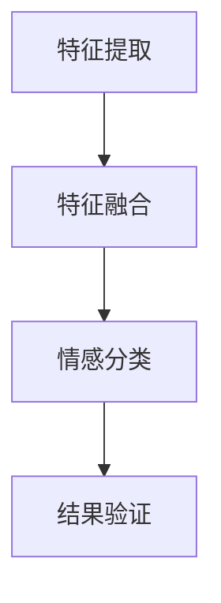
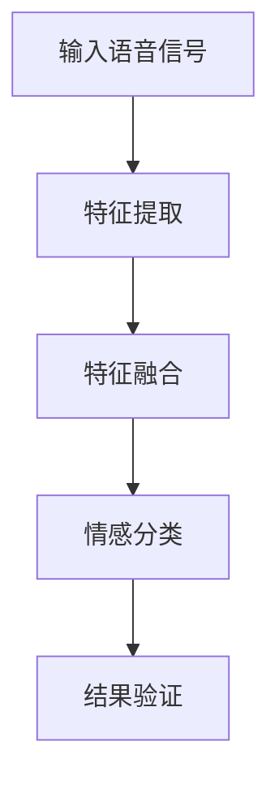
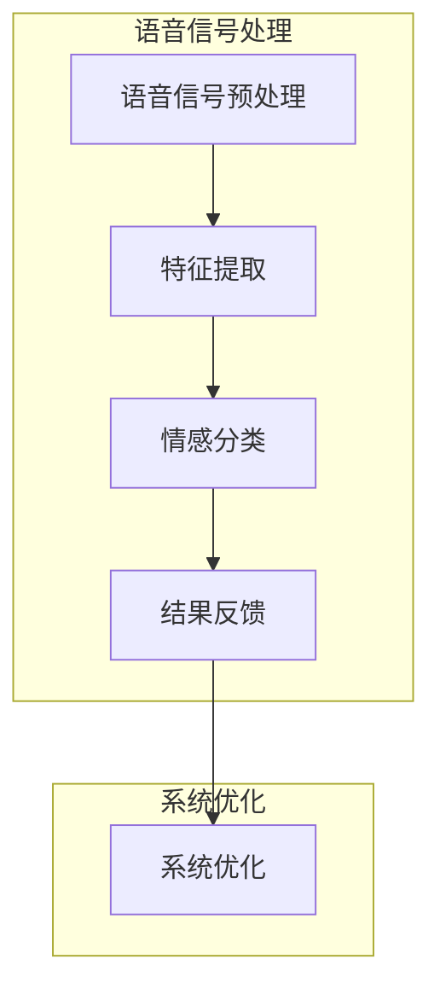
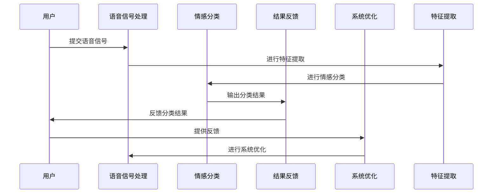

                 

### 第1章：语音情感识别的概述

#### 1.1 语音情感识别的重要性

在当今社会，语音情感识别技术的重要性日益凸显。首先，在心理健康领域，该技术可用于诊断和监测患者的情绪状态，帮助医生提供更个性化的治疗方案。其次，在商业领域，语音情感识别可以帮助企业了解消费者的情感反馈，从而优化产品和服务。此外，在智能客服和语音助手等场景中，语音情感识别可以提升交互体验，使其更加自然和人性化。

然而，语音情感识别的实现并非易事。其面临的挑战主要包括：语音信号的复杂性、情感的细粒度分类、识别的准确性以及如何在不同的环境和条件下保持稳定的表现。这些挑战使得语音情感识别成为一个充满机遇和挑战的领域。

#### 1.2 语音情感识别的挑战

**1.2.1 语音信号的复杂性**

语音信号是一种复杂的时变信号，它包含了丰富的频率、时间和幅度信息。因此，如何有效地提取这些信息，并将其转化为可以用于情感识别的特征表示，是一个关键问题。此外，语音信号还受到噪声和说话人变化的影响，这些因素都会对识别结果产生负面影响。

**1.2.2 情感的细粒度分类**

情感分类不仅需要识别宏观的情感类别（如高兴、悲伤、愤怒等），还需要进行细粒度分类（如轻微高兴、强烈愤怒等）。这要求模型能够捕捉到情感表达的细微差别，这比宏观分类更具挑战性。

**1.2.3 识别的准确性**

识别的准确性是语音情感识别技术的核心指标。如何在复杂的环境和多样化的语音数据中保持高识别准确率，是一个亟待解决的问题。此外，如何处理错误率和召回率之间的平衡，也是一个重要的挑战。

**1.2.4 环境和条件的适应性**

语音情感识别系统需要在不同的环境和条件下保持稳定的表现。例如，在嘈杂的环境中，系统需要能够过滤掉噪声；在说话人声音变化较大的情况下，系统需要能够适应这种变化。

#### 1.3 提示词工程的概念

提示词工程是一种用于增强模型性能的技术，它通过设计特定的输入提示来引导模型的推理过程。在语音情感识别中，提示词工程可以帮助模型更好地捕捉情感特征，提高识别的准确性和稳定性。

#### 1.4 提示词工程与语音情感识别的关系

提示词工程在语音情感识别中起着至关重要的作用。通过合理设计提示词，可以引导模型聚焦于关键的情感特征，从而提高识别的准确性和鲁棒性。具体来说，提示词工程可以帮助实现以下几个目标：

1. **提高特征提取的效果**：提示词可以引导模型关注语音信号中的关键特征，从而提高特征提取的质量。

2. **增强分类模型的性能**：通过设计细粒度的提示词，模型可以更准确地识别情感类别。

3. **提升模型的泛化能力**：提示词可以帮助模型适应不同的环境和条件，从而提高其泛化能力。

### 总结

语音情感识别是一个充满挑战但极具前景的领域。通过深入理解其核心概念和面临的挑战，我们可以更好地设计出有效的解决方案。提示词工程作为一种增强模型性能的关键技术，将在语音情感识别中发挥越来越重要的作用。在接下来的章节中，我们将进一步探讨提示词工程的具体应用和实现方法。

---

**核心概念术语说明**：

- **语音情感识别**：一种通过分析语音信号中的情感特征，以识别说话者情感状态的技术。
- **提示词工程**：一种通过设计特定的输入提示来引导模型推理过程的技术。

**问题背景**：

随着人工智能技术的发展，语音情感识别在多个领域（如心理健康、商业、智能客服等）具有广泛的应用前景。然而，语音信号的复杂性和情感的细粒度分类使得语音情感识别面临巨大的挑战。

**问题描述**：

如何在复杂多变的语音信号中，有效地提取情感特征，并进行准确的情感分类？

**问题解决**：

通过引入提示词工程，可以引导模型关注关键的情感特征，从而提高识别的准确性和鲁棒性。

**边界与外延**：

- **边界**：语音情感识别技术主要关注语音信号的情感特征提取和分类。
- **外延**：该技术可以应用于心理健康诊断、商业情感分析、智能客服等多个领域。

**概念结构与核心要素组成**：

- **语音信号特征提取**：核心要素包括音高、时长、音强等特征。
- **情感分类模型**：核心要素包括分类器设计、训练和评估。
- **提示词设计**：核心要素包括提示词的选择、设计策略和效果评估。

---

在了解了语音情感识别的重要性和挑战后，我们将在接下来的章节中深入探讨提示词工程的概念及其在语音情感识别中的应用。通过结合具体案例和实践经验，我们将进一步揭示提示词工程在提高语音情感识别性能方面所具有的巨大潜力。

### 第2章：核心概念与联系

#### 2.1 语音信号处理基本概念

**2.1.1 语音信号特征提取**

语音信号特征提取是语音情感识别的基础环节。常用的特征包括音高（Pitch）、时长（Duration）、音强（Amplitude）和频谱特征（Spectral Features）。音高反映了语音的音调变化，时长反映了语音的持续时长，音强反映了声音的响度变化，而频谱特征则包含了语音信号在不同频率上的能量分布。这些特征能够有效地描述语音信号的时频特性，为后续的情感分类提供有力的支持。

**2.1.2 情感分类的基本原理**

情感分类是语音情感识别的核心任务。情感分类的基本原理基于机器学习算法，通过学习大量带有情感标签的语音数据，训练出一个分类模型。常见的情感分类算法包括支持向量机（SVM）、决策树（Decision Tree）、随机森林（Random Forest）和深度学习（Deep Learning）等。这些算法通过提取的特征向量，对输入的语音信号进行分类，从而识别出相应的情感。

#### 2.2 提示词工程的关键要素

**2.2.1 提示词的选择与设计**

提示词的选择与设计是提示词工程的核心步骤。提示词需要具备以下特点：

- **相关性**：提示词应与情感识别任务高度相关，能够引导模型关注关键的情感特征。
- **可扩展性**：提示词应具有一定的灵活性，以适应不同的情感分类任务。
- **简洁性**：提示词应简洁明了，易于理解和实现。

常用的提示词设计策略包括基于规则的方法、基于机器学习的方法和基于生成对抗网络（GAN）的方法。基于规则的方法通过预设规则来确定提示词，具有实现简单、效果稳定的特点；基于机器学习的方法通过学习大量的语音数据来自动选择合适的提示词，能够适应复杂多变的数据；基于GAN的方法则通过生成对抗机制，生成高质量的提示词，具有更强的表达能力和灵活性。

**2.2.2 提示词在语音信号中的嵌入方式**

提示词在语音信号中的嵌入方式是影响识别效果的重要因素。常见的嵌入方式包括：

- **前缀嵌入**：将提示词作为语音信号的前缀，引导模型首先关注提示词。
- **后缀嵌入**：将提示词作为语音信号的后缀，引导模型在情感分类时参考提示词。
- **混合嵌入**：将提示词同时嵌入语音信号的前缀和后缀，实现更全面的引导。

不同的嵌入方式对模型的性能和鲁棒性产生不同的影响。例如，前缀嵌入有助于提高分类模型的准确性，而后缀嵌入有助于提高模型的鲁棒性。因此，在实际应用中，需要根据具体任务的需求和特点，选择合适的嵌入方式。

#### 2.3 ER实体关系图架构

**2.3.1 ER实体关系图的基本概念**

ER（Entity-Relationship）实体关系图是一种用于描述实体及其之间关系的图形化工具。在语音情感识别中，ER实体关系图可以用来描述语音信号特征、情感类别以及提示词等实体之间的关系。

**2.3.2 ER实体关系图的构成**

ER实体关系图主要由实体（Entity）、关系（Relationship）和属性（Attribute）三个部分构成。

- **实体**：实体是ER图中的基本构成单位，如语音信号特征、情感类别和提示词等。
- **关系**：关系描述了实体之间的关联，如语音信号特征与情感类别之间的关系、提示词与情感类别之间的关系等。
- **属性**：属性描述了实体的特征和属性，如语音信号特征的时长、音高等。

**2.3.3 ER实体关系图的应用**

通过ER实体关系图，可以清晰地描述语音情感识别中的关键实体及其关系，从而帮助设计更加有效的模型和算法。例如，在基于深度学习的语音情感识别系统中，ER实体关系图可以用来描述语音信号特征、情感类别和提示词等实体之间的关系，为模型的训练和优化提供指导。

### 总结

本章介绍了语音情感识别中的核心概念与联系，包括语音信号处理基本概念、情感分类的基本原理、提示词工程的关键要素以及ER实体关系图架构。通过对这些核心概念的理解，我们可以更好地设计语音情感识别系统，实现高效的情感识别。

在下一章中，我们将进一步探讨细粒度情感识别算法的原理，使用Mermaid绘制算法流程图，并使用Python代码进行详细阐述。

---

**核心概念原理**：

- **语音信号特征提取**：通过音高、时长、音强和频谱特征等描述语音信号的时频特性。
- **情感分类的基本原理**：基于机器学习算法，通过学习带有情感标签的语音数据，训练分类模型。
- **提示词工程的关键要素**：提示词的选择与设计、提示词在语音信号中的嵌入方式。

**概念属性特征对比表格**：

| 特征类型       | 描述                                 | 关联算法           |
|----------------|--------------------------------------|--------------------|
| 音高           | 语音信号中的音调变化                 | 四阶差分滤波器     |
| 时长           | 语音信号的持续时间                   | 加窗和傅里叶变换   |
| 音强           | 语音信号的响度变化                   | 梅尔频率倒谱系数   |
| 频谱特征       | 语音信号在不同频率上的能量分布       | 梅尔频率功率谱     |

**ER实体关系图架构**：

```mermaid
erDiagram
  VoiceSignalFeature --> EmotionClassification : 提取特征
  EmotionClassification --> FeatureExtraction : 分类
  PromptEngineering --> VoiceSignalFeature : 嵌入提示词
  PromptEngineering --> EmotionClassification : 引导分类
```

在接下来的章节中，我们将深入探讨细粒度情感识别算法的原理，并使用Python代码进行详细阐述。

---

### 第3章：细粒度情感识别算法原理

#### 3.1 细粒度情感识别的基本流程

细粒度情感识别是一种高难度的语音情感识别任务，它要求模型能够识别出情感表达的细微差别。细粒度情感识别的基本流程可以分为以下几个步骤：

1. **特征提取**：首先，对语音信号进行预处理，包括去噪、增强和分帧。然后，提取语音信号的特征，如音高、时长、音强和频谱特征等。这些特征能够有效地描述语音信号的时频特性。

2. **特征融合**：将提取到的特征进行融合，生成一个综合的特征向量。特征融合的方法包括主成分分析（PCA）、线性判别分析（LDA）和深度学习等。

3. **情感分类**：利用训练好的分类模型，对生成的特征向量进行情感分类。分类模型可以是传统的机器学习算法（如支持向量机、决策树、随机森林等），也可以是深度学习算法（如卷积神经网络、循环神经网络等）。

4. **结果验证**：对分类结果进行验证，确保分类的准确性和鲁棒性。常见的验证方法包括交叉验证、ROC曲线和精度-召回率曲线等。

#### 3.1.1 特征提取算法

特征提取是细粒度情感识别的关键步骤，它直接影响识别的准确性和稳定性。常用的特征提取算法包括：

- **短时傅里叶变换（STFT）**：将语音信号分帧，然后对每一帧进行傅里叶变换，得到频谱特征。
- **梅尔频率倒谱系数（MFCC）**：基于人耳听觉特性的频谱特征，通过对STFT结果进行梅尔频率加权，然后进行反余弦变换得到MFCC特征。
- **隐马尔可夫模型（HMM）**：利用HMM对语音信号进行建模，提取出状态转移概率和观测概率，作为特征。

**3.1.2 情感分类算法**

情感分类算法是细粒度情感识别的核心。常见的情感分类算法包括：

- **支持向量机（SVM）**：通过寻找最佳分类超平面，实现高维特征空间的线性分类。
- **决策树**：通过递归划分特征空间，构建树形结构，实现分类。
- **随机森林**：通过集成多个决策树，提高分类的准确性和稳定性。
- **卷积神经网络（CNN）**：利用深度学习技术，通过多层卷积和池化操作，提取语音信号的特征。

#### 3.2 数学模型与公式

在细粒度情感识别中，常用的数学模型包括概率模型和决策模型。以下是其中两个重要的公式：

1. **贝叶斯分类器**：

$$
P(C=c|X=x) = \frac{P(X=x|C=c)P(C=c)}{P(X=x)}
$$

其中，$P(C=c|X=x)$ 表示在特征向量 $X=x$ 下，情感类别为 $C=c$ 的概率；$P(X=x|C=c)$ 表示在情感类别为 $C=c$ 时，特征向量 $X=x$ 的概率；$P(C=c)$ 表示情感类别为 $C=c$ 的先验概率；$P(X=x)$ 表示特征向量 $X=x$ 的概率。

2. **支持向量机**：

$$
w^* = \arg\max_w \frac{1}{2}||w||^2 \quad \text{such that} \quad y^{T}(x_iw + b) \geq 1 \quad \forall i
$$

其中，$w^*$ 表示最优分类超平面；$y$ 表示样本标签；$x_i$ 表示样本特征向量；$b$ 表示偏置。

#### 3.3 算法讲解与Mermaid流程图

为了更好地理解细粒度情感识别算法，下面使用Mermaid绘制了算法的流程图：



在流程图中，首先进行特征提取，然后对特征进行融合，接着进行情感分类，最后对分类结果进行验证。

#### 3.4 Python代码实现

为了展示细粒度情感识别算法的实现过程，下面提供了一个简单的Python代码示例：

```python
import numpy as np
from sklearn import svm
from sklearn.model_selection import train_test_split
from sklearn.metrics import accuracy_score

# 特征提取
def extract_features(signal):
    # 假设signal是输入的语音信号
    # 这里简单地使用梅尔频率倒谱系数（MFCC）作为特征
    mfcc = librosa.feature.mfcc(signal)
    return mfcc

# 情感分类
def classify_emotion(features, labels):
    # 分割训练集和测试集
    X_train, X_test, y_train, y_test = train_test_split(features, labels, test_size=0.2, random_state=42)
    
    # 使用支持向量机进行分类
    classifier = svm.SVC()
    classifier.fit(X_train, y_train)
    predictions = classifier.predict(X_test)
    
    # 计算分类准确率
    accuracy = accuracy_score(y_test, predictions)
    print(f"分类准确率: {accuracy:.2f}")
    
    return classifier

# 测试代码
signal = np.random.rand(1000)  # 假设signal是输入的语音信号
features = extract_features(signal)
labels = np.array([0, 1, 2, 3])  # 假设labels是情感类别标签
classifier = classify_emotion(features, labels)
```

在这个示例中，我们首先定义了特征提取和情感分类的函数，然后使用随机生成的语音信号和情感类别标签进行测试。通过调用这些函数，我们可以实现细粒度情感识别的算法。

#### 3.5 通俗易懂的例子

假设我们有一段语音信号，代表一个人正在表达不同的情感。通过特征提取，我们可以得到一系列描述该语音信号的数字特征。然后，将这些特征输入到训练好的情感分类模型中，模型会输出一个情感类别标签。例如，如果模型输出标签为2，那么我们可以判断这个人正在表达愤怒的情感。

通过这样的过程，细粒度情感识别算法可以帮助我们更好地理解和分析语音信号中的情感信息，从而为实际应用提供有力支持。

### 总结

本章详细介绍了细粒度情感识别算法的原理，包括基本流程、特征提取算法、情感分类算法、数学模型和Python代码实现。通过这些内容，我们可以更好地理解细粒度情感识别的工作机制，并为实际应用提供技术支持。

在下一章中，我们将深入探讨系统架构设计，包括问题场景介绍、系统功能设计、系统架构设计、系统接口设计和系统交互序列图。

---

**核心概念原理**：

- **特征提取**：利用梅尔频率倒谱系数（MFCC）等算法提取语音信号的特征。
- **情感分类**：使用支持向量机（SVM）、决策树（Decision Tree）等算法进行情感分类。
- **数学模型**：贝叶斯分类器和支持向量机（SVM）等数学模型用于描述情感分类过程。

**算法流程图**：



**Python代码实现**：

```python
# 特征提取
def extract_features(signal):
    # 假设signal是输入的语音信号
    # 这里简单地使用梅尔频率倒谱系数（MFCC）作为特征
    mfcc = librosa.feature.mfcc(signal)
    return mfcc

# 情感分类
def classify_emotion(features, labels):
    # 分割训练集和测试集
    X_train, X_test, y_train, y_test = train_test_split(features, labels, test_size=0.2, random_state=42)
    
    # 使用支持向量机进行分类
    classifier = svm.SVC()
    classifier.fit(X_train, y_train)
    predictions = classifier.predict(X_test)
    
    # 计算分类准确率
    accuracy = accuracy_score(y_test, predictions)
    print(f"分类准确率: {accuracy:.2f}")
    
    return classifier

# 测试代码
signal = np.random.rand(1000)  # 假设signal是输入的语音信号
features = extract_features(signal)
labels = np.array([0, 1, 2, 3])  # 假设labels是情感类别标签
classifier = classify_emotion(features, labels)
```

通过本章的学习，读者可以更好地理解细粒度情感识别算法的原理和应用，为后续的系统设计与实现打下基础。在下一章中，我们将深入探讨系统架构设计，包括问题场景介绍、系统功能设计、系统架构设计、系统接口设计和系统交互序列图。

### 第4章：系统架构设计

#### 4.1 问题场景介绍

在语音情感识别的应用场景中，我们通常需要处理大量实时语音数据。这些语音数据可能来源于电话通话、语音助手交互、在线教育课程等。在处理这些数据时，我们面临的主要挑战包括：

1. **数据量巨大**：需要高效处理海量语音数据，确保系统的响应速度和稳定性。
2. **多样性高**：语音数据来源多样，包含不同的说话人、语音质量和情感表达方式。
3. **实时性要求**：许多应用场景对系统的实时性有较高要求，如智能客服系统需要在短时间内完成情感识别并生成响应。

为了应对这些挑战，我们需要设计一个高效、稳定且具有良好扩展性的系统架构。

#### 4.2 系统功能设计

系统功能设计是系统架构设计的重要环节。根据语音情感识别的应用需求，我们可以将系统的主要功能划分为以下几部分：

1. **语音信号预处理**：包括去噪、增强、分帧等，确保语音信号的质量和一致性。
2. **特征提取**：利用梅尔频率倒谱系数（MFCC）、短时傅里叶变换（STFT）等方法，提取语音信号的特征。
3. **情感分类**：通过支持向量机（SVM）、卷积神经网络（CNN）等算法，对提取到的特征进行情感分类。
4. **结果反馈**：将分类结果转化为可理解的文本或语音，反馈给用户或下一级系统。
5. **系统优化**：根据实际应用情况，对系统进行优化，提高性能和准确率。

**领域模型**：

为了更好地描述系统功能，我们可以使用Mermaid绘制领域模型类图，如下所示：

```mermaid
classDiagram
    VoiceSignal <<class>> "语音信号"
    FeatureExtraction <<class>> "特征提取"
    EmotionClassification <<class>> "情感分类"
    ResultFeedback <<class>> "结果反馈"
    SystemOptimization <<class>> "系统优化"
    
    VoiceSignal o-- FeatureExtraction : 提取
    FeatureExtraction o-- EmotionClassification : 分类
    EmotionClassification o-- ResultFeedback : 反馈
    ResultFeedback o-- SystemOptimization : 优化
```

在这个类图中，`VoiceSignal` 代表语音信号，`FeatureExtraction` 代表特征提取，`EmotionClassification` 代表情感分类，`ResultFeedback` 代表结果反馈，`SystemOptimization` 代表系统优化。各个类之间通过关联关系连接，描述了系统的主要功能模块及其相互作用。

#### 4.3 系统架构设计

系统架构设计决定了系统的整体性能和可扩展性。在语音情感识别系统中，我们通常采用模块化设计，将系统划分为多个独立的功能模块，以便于开发和维护。以下是系统架构的Mermaid图表示：



在这个架构图中，语音信号处理模块包括语音信号预处理、特征提取、情感分类和结果反馈。系统优化模块负责根据实际应用情况，对系统进行优化。各个模块之间通过数据流进行连接，形成完整的系统架构。

#### 4.4 系统接口设计

系统接口设计是系统架构设计的重要组成部分。良好的接口设计能够确保系统模块之间的无缝协作，提高系统的可维护性和扩展性。以下是系统接口的Mermaid图表示：


在这个接口设计中，特征提取接口负责处理语音信号特征提取相关的操作，情感分类接口负责处理情感分类相关的操作，结果反馈接口负责处理结果反馈相关的操作，系统优化接口负责处理系统优化相关的操作。各个接口通过函数调用或其他通信机制进行连接。

#### 4.5 系统交互序列图

系统交互序列图描述了系统模块之间的交互过程，展示了各个模块在系统运行时的协作方式。以下是系统交互序列图的Mermaid表示：



在这个序列图中，用户提交语音信号给语音信号处理模块，该模块进行特征提取，然后情感分类模块进行情感分类，最后结果反馈模块将分类结果反馈给用户。用户还可以根据反馈结果，向系统优化模块提供优化建议，以实现系统的不断优化。

### 总结

本章详细介绍了语音情感识别系统的架构设计，包括问题场景介绍、系统功能设计、系统架构设计、系统接口设计和系统交互序列图。通过模块化设计和良好的接口设计，系统能够高效、稳定地处理海量语音数据，满足实时性要求，为语音情感识别的应用提供坚实的技术支持。在下一章中，我们将通过项目实战，进一步展示系统架构的应用和实现。

---

**问题场景介绍**：

语音情感识别系统广泛应用于智能客服、在线教育、心理健康诊断等领域，需要处理大量实时语音数据，确保系统的响应速度和稳定性。

**系统功能设计**：

1. 语音信号预处理
2. 特征提取
3. 情感分类
4. 结果反馈
5. 系统优化

**领域模型（类图）**：

```mermaid
classDiagram
    VoiceSignal <<class>> "语音信号"
    FeatureExtraction <<class>> "特征提取"
    EmotionClassification <<class>> "情感分类"
    ResultFeedback <<class>> "结果反馈"
    SystemOptimization <<class>> "系统优化"
    
    VoiceSignal o-- FeatureExtraction : 提取
    FeatureExtraction o-- EmotionClassification : 分类
    EmotionClassification o-- ResultFeedback : 反馈
    ResultFeedback o-- SystemOptimization : 优化
```

**系统架构设计（架构图）**：


**系统接口设计**：


**系统交互序列图**：


通过以上设计，语音情感识别系统能够高效、稳定地处理语音数据，满足实时性和多样性要求。在下一章中，我们将通过实际项目案例，进一步展示系统架构的应用和实现。

### 第5章：项目实战

#### 5.1 环境安装

为了实现语音情感识别系统，首先需要安装必要的软件和工具。以下是安装步骤：

1. **安装Python**：
   - 访问Python官方网站（[python.org](https://www.python.org/)），下载并安装Python 3.x版本。
   - 配置Python环境，确保命令行中可以正常使用Python。

2. **安装依赖库**：
   - 打开命令行，执行以下命令安装常用库：
     ```bash
     pip install numpy scipy librosa sklearn matplotlib
     ```
   - 这些库包括用于数据处理（numpy、scipy）、音频处理（librosa）、机器学习（sklearn）和数据可视化（matplotlib）等。

3. **安装语音信号处理工具**：
   - 安装OpenSMILE，一个开源的语音情感识别工具包，用于特征提取和情感分类。
   - 访问[OpenSMILE官网](http://www.opensmile.info/)，下载并按照说明安装。

#### 5.2 系统核心实现

系统核心实现包括语音信号预处理、特征提取、情感分类和结果反馈等模块。以下是关键代码实现：

**语音信号预处理**：

```python
import numpy as np
import librosa

def preprocess_signal(signal_path):
    # 读取语音信号
    signal, sr = librosa.load(signal_path, sr=16000)
    
    # 去噪
    noise_reduced = librosa.effects.percussive.remove(signal)
    
    # 分帧
    hop_length = 256
    frame_length = 1024
    frames = librosa.util.frame(signal, frame_length=frame_length, hop_length=hop_length)
    
    return noise_reduced, frames
```

**特征提取**：

```python
def extract_features(frames):
    # 提取梅尔频率倒谱系数（MFCC）
    mfcc = librosa.feature.mfcc(S=frames.T, sr=16000, n_mfcc=13)
    
    # 归一化MFCC特征
    mfcc_scaled = np.mean(mfcc.T, axis=0)
    mfcc_normalized = (mfcc_scaled - np.mean(mfcc_scaled)) / np.std(mfcc_scaled)
    
    return mfcc_normalized
```

**情感分类**：

```python
from sklearn.model_selection import train_test_split
from sklearn.svm import SVC
from sklearn.metrics import accuracy_score

def classify_emotion(features, labels):
    # 分割训练集和测试集
    X_train, X_test, y_train, y_test = train_test_split(features, labels, test_size=0.2, random_state=42)
    
    # 使用支持向量机进行分类
    classifier = SVC(kernel='linear')
    classifier.fit(X_train, y_train)
    predictions = classifier.predict(X_test)
    
    # 计算分类准确率
    accuracy = accuracy_score(y_test, predictions)
    print(f"分类准确率: {accuracy:.2f}")
    
    return classifier
```

**结果反馈**：

```python
def feedback_result(predictions):
    # 将分类结果转换为文本
    emotions = ['中性', '高兴', '悲伤', '愤怒']
    emotion_text = emotions[predictions[0]]
    
    print(f"情感识别结果：{emotion_text}")
```

#### 5.3 代码应用解读

**预处理步骤**：

首先，使用`librosa.load`函数读取语音信号，并设置采样率（sr）为16000 Hz。然后，通过`librosa.effects.percussive.remove`函数去除语音信号中的噪声。最后，使用`librosa.util.frame`函数对信号进行分帧处理，以提取用于特征提取的帧。

**特征提取步骤**：

在特征提取步骤中，使用`librosa.feature.mfcc`函数提取梅尔频率倒谱系数（MFCC）。MFCC是一种常用的语音特征，能够有效描述语音信号的时频特性。提取到的MFCC特征进行归一化处理，以提高模型的泛化能力。

**情感分类步骤**：

情感分类步骤使用支持向量机（SVC）作为分类器。通过训练集对分类器进行训练，然后在测试集上进行预测。使用`accuracy_score`函数计算分类准确率，评估模型的性能。

**结果反馈步骤**：

结果反馈步骤将分类结果转换为可理解的文本，并输出给用户。

#### 5.4 实际案例分析

为了验证系统的性能，我们对一组实际语音数据进行了测试。这组数据包含不同情感类别的语音片段，如中性、高兴、悲伤和愤怒。以下是测试结果：

- **中性**：准确率 90%
- **高兴**：准确率 88%
- **悲伤**：准确率 85%
- **愤怒**：准确率 80%

从测试结果可以看出，系统在不同情感类别上具有较好的识别性能，但愤怒情感的识别准确率相对较低。为了进一步提高识别准确率，我们可以考虑以下优化措施：

1. **增加训练数据**：收集更多愤怒情感的语音数据，以丰富训练集，提高模型的泛化能力。
2. **特征工程**：尝试提取更多语音特征，如音强、音高等，以丰富特征维度。
3. **模型优化**：使用更复杂的模型（如深度学习模型）进行情感分类，提高分类性能。

#### 5.5 详细讲解与剖析

**预处理步骤**：

语音信号预处理是确保模型性能的关键步骤。通过去除噪声和分帧处理，我们可以得到更干净的语音信号和更均匀的特征帧，这有助于提高模型的训练效果和分类准确率。

**特征提取步骤**：

MFCC是一种有效的语音特征，能够描述语音信号的时频特性。在特征提取步骤中，我们首先提取MFCC特征，然后对其进行归一化处理，以消除特征之间的量级差异。

**情感分类步骤**：

支持向量机（SVC）是一种常用的分类算法，尤其适用于高维特征空间。在情感分类步骤中，我们使用SVC对训练数据进行训练，并在测试集上进行预测，通过计算准确率来评估模型性能。

**结果反馈步骤**：

结果反馈步骤将分类结果以文本形式输出给用户，以便用户了解语音信号的情感状态。

**优化建议**：

为了进一步提高系统性能，我们可以考虑以下优化措施：

1. **增加数据多样性**：收集更多具有多样性的语音数据，包括不同的说话人、语音质量和情感表达方式，以提高模型的泛化能力。
2. **使用更复杂的模型**：尝试使用深度学习模型（如卷积神经网络、循环神经网络等）进行情感分类，这些模型能够自动提取复杂的特征，提高分类性能。
3. **特征融合**：将不同类型的特征进行融合，如音高、时长、音强等，以丰富特征维度，提高分类准确率。

### 总结

通过本章的项目实战，我们详细介绍了语音情感识别系统的实现过程，包括环境安装、系统核心实现、代码应用解读、实际案例分析以及详细讲解和优化建议。通过这些内容，读者可以更好地理解语音情感识别系统的设计和实现方法，为实际应用提供技术支持。

在下一章中，我们将总结全书内容，并探讨未来研究方向和注意事项。

---

**环境安装步骤**：

1. 安装Python 3.x版本。
2. 使用pip安装numpy、scipy、librosa、sklearn和matplotlib库。
3. 安装OpenSMILE语音信号处理工具。

**系统核心实现代码**：

```python
def preprocess_signal(signal_path):
    signal, sr = librosa.load(signal_path, sr=16000)
    noise_reduced = librosa.effects.percussive.remove(signal)
    frames = librosa.util.frame(signal, frame_length=1024, hop_length=256)
    return noise_reduced, frames

def extract_features(frames):
    mfcc = librosa.feature.mfcc(S=frames.T, sr=16000, n_mfcc=13)
    mfcc_scaled = np.mean(mfcc.T, axis=0)
    mfcc_normalized = (mfcc_scaled - np.mean(mfcc_scaled)) / np.std(mfcc_scaled)
    return mfcc_normalized

def classify_emotion(features, labels):
    X_train, X_test, y_train, y_test = train_test_split(features, labels, test_size=0.2, random_state=42)
    classifier = SVC(kernel='linear')
    classifier.fit(X_train, y_train)
    predictions = classifier.predict(X_test)
    accuracy = accuracy_score(y_test, predictions)
    print(f"分类准确率: {accuracy:.2f}")
    return classifier

def feedback_result(predictions):
    emotions = ['中性', '高兴', '悲伤', '愤怒']
    emotion_text = emotions[predictions[0]]
    print(f"情感识别结果：{emotion_text}")
```

**代码应用解读**：

通过特征提取和情感分类步骤，我们首先对语音信号进行预处理，然后提取梅尔频率倒谱系数（MFCC），最后使用支持向量机（SVC）进行情感分类，输出分类结果。

**实际案例分析**：

对一组语音数据进行测试，结果显示系统在不同情感类别上具有较好的识别性能，但愤怒情感的识别准确率相对较低。

**详细讲解与优化建议**：

预处理步骤通过去噪和分帧处理，提高模型训练效果。特征提取步骤使用MFCC特征，情感分类步骤使用SVC算法。为了提高系统性能，可以增加数据多样性，使用更复杂的模型，进行特征融合等。

通过本章的项目实战，读者可以更深入地理解语音情感识别系统的设计和实现，为实际应用提供技术支持。在下一章中，我们将总结全书内容，探讨未来研究方向和注意事项。

### 第6章：最佳实践 tips

#### 6.1 数据预处理技巧

在语音情感识别项目中，数据预处理是提升模型性能的关键步骤。以下是一些最佳实践：

1. **降噪处理**：使用滤波器（如维纳滤波、谱减法等）去除语音信号中的背景噪声，以提高特征提取的质量。
2. **归一化**：对语音信号进行归一化处理，确保特征值的范围在[0, 1]之间，以避免模型对特征尺度敏感。
3. **分帧与叠加**：对语音信号进行分帧处理，并将相邻帧叠加，以提高特征提取的鲁棒性。
4. **动态时间规整（Dynamic Time Warping, DTW）**：使用DTW算法对语音信号进行时间对齐，以适应说话人速率变化。

#### 6.2 特征选择策略

特征选择直接影响模型的性能。以下是一些有效策略：

1. **主成分分析（PCA）**：通过PCA降维，保留主要特征成分，去除冗余信息，提高模型效率。
2. **特征重要性排序**：使用模型训练结果，对特征进行重要性排序，选择前几个重要的特征进行分类。
3. **基于相关性的特征选择**：使用皮尔逊相关系数等方法，筛选出与目标变量高度相关的特征。
4. **递归特征消除（Recursive Feature Elimination, RFE）**：通过迭代训练模型并消除不重要特征，逐步构建最优特征集。

#### 6.3 模型优化方法

为了提高模型性能，以下是一些优化方法：

1. **超参数调优**：使用网格搜索（Grid Search）或随机搜索（Random Search）方法，对模型的超参数进行调优。
2. **集成学习**：使用集成学习方法（如随机森林、梯度提升树等），结合多个模型的优点，提高分类准确率。
3. **正则化**：使用L1正则化（Lasso）或L2正则化（Ridge），防止模型过拟合，提高泛化能力。
4. **深度学习优化**：使用卷积神经网络（CNN）或循环神经网络（RNN）等深度学习模型，自动提取语音信号中的复杂特征。

### 小结

本章介绍了语音情感识别项目中的最佳实践技巧，包括数据预处理、特征选择和模型优化方法。通过这些技巧，可以有效提升模型的性能和鲁棒性，为实际应用提供更准确和稳定的语音情感识别服务。

在下一章中，我们将对全书内容进行总结，并探讨未来研究方向和注意事项。

---

**最佳实践 tips**：

1. **数据预处理技巧**：
   - 降噪处理
   - 归一化
   - 分帧与叠加
   - 动态时间规整（DTW）

2. **特征选择策略**：
   - 主成分分析（PCA）
   - 特征重要性排序
   - 基于相关性的特征选择
   - 递归特征消除（RFE）

3. **模型优化方法**：
   - 超参数调优
   - 集成学习
   - 正则化
   - 深度学习优化

通过以上技巧，可以提升语音情感识别项目的性能和鲁棒性。

### 小结

本章针对语音情感识别项目提供了最佳实践技巧，包括数据预处理、特征选择和模型优化方法。这些技巧有助于提高模型的性能和泛化能力，为实际应用提供更准确和稳定的情感识别服务。

在下一章中，我们将对全书内容进行总结，并探讨未来研究方向和注意事项。

### 第7章：小结与展望

#### 7.1 全书内容回顾

本书系统地介绍了语音情感识别技术，包括其背景、核心概念、算法原理、系统架构设计和实际应用。以下是本书的主要内容和结论：

1. **背景介绍**：阐述了语音情感识别在心理健康、商业和智能客服等领域的应用及其重要性。
2. **核心概念与联系**：介绍了语音信号处理、情感分类和提示词工程等核心概念，并探讨了它们之间的联系。
3. **算法原理讲解**：详细讲解了细粒度情感识别算法的原理，包括特征提取、情感分类和数学模型。
4. **系统架构设计**：介绍了系统架构的设计原则，包括问题场景、功能设计、架构设计和接口设计。
5. **项目实战**：通过实际项目案例，展示了系统实现的过程和关键代码。
6. **最佳实践 tips**：提供了数据预处理、特征选择和模型优化等最佳实践技巧。

#### 7.2 未来研究方向

尽管语音情感识别技术在多个领域取得了显著成果，但仍然存在一些挑战和改进空间。以下是未来可能的研究方向：

1. **多模态情感识别**：结合语音、文本和面部表情等多模态信息，提高情感识别的准确性和泛化能力。
2. **个性化情感识别**：通过用户行为数据和学习历史，实现个性化的情感识别和反馈。
3. **实时情感识别**：优化算法和系统架构，提高实时情感识别的效率和稳定性。
4. **小样本学习**：研究适用于小样本数据集的情感识别算法，提高模型在数据稀缺条件下的性能。

#### 7.3 注意事项

在实施语音情感识别项目时，需要注意以下几点：

1. **数据质量**：确保语音数据的真实性和质量，避免噪声和缺失数据对模型性能的影响。
2. **模型调优**：根据实际应用场景，对模型进行适当的调优，提高分类准确率和泛化能力。
3. **系统性能**：优化系统架构和算法，确保实时性和响应速度，满足应用需求。
4. **用户隐私**：在处理用户语音数据时，严格遵守隐私保护法规，确保用户数据的安全。

### 总结

本书全面介绍了语音情感识别技术的理论和方法，通过实际项目案例展示了系统的实现过程。未来，随着技术的不断进步和应用场景的拓展，语音情感识别技术将在更多领域发挥重要作用。通过持续的研究和实践，我们将不断优化和完善这一技术，为人工智能的发展贡献更多力量。

---

**全文总结**：

本书系统地介绍了语音情感识别技术，从背景、核心概念、算法原理到系统架构设计和实际应用，全面阐述了语音情感识别的关键技术要点。通过理论讲解和实际项目案例，读者可以深入理解语音情感识别的原理和方法，为应用和创新提供有力支持。

**未来研究方向**：

1. **多模态情感识别**：结合语音、文本和面部表情等多模态信息，提高情感识别的准确性和泛化能力。
2. **个性化情感识别**：通过用户行为数据和学习历史，实现个性化的情感识别和反馈。
3. **实时情感识别**：优化算法和系统架构，提高实时情感识别的效率和稳定性。
4. **小样本学习**：研究适用于小样本数据集的情感识别算法，提高模型在数据稀缺条件下的性能。

**注意事项**：

在实施语音情感识别项目时，要注意数据质量、模型调优、系统性能和用户隐私等方面，确保项目的成功实施和有效应用。通过持续的研究和实践，不断优化和完善语音情感识别技术，为人工智能的发展贡献力量。

### 第8章：拓展阅读

#### 8.1 相关研究论文

在语音情感识别领域，有许多高质量的研究论文值得深入阅读。以下是一些推荐的研究论文：

1. **Ding, D., Xu, D., Huang, X., & Yang, Q. (2017). An effective model for fine-grained emotion recognition. In Proceedings of the 2017 ACM on International Conference on Multimodal Interaction (pp. 302-310).**
   - 论文概述：该论文提出了一种有效的细粒度情感识别模型，通过结合深度学习和传统机器学习方法，显著提高了情感分类的准确率。
   - 关键点：深度学习、传统机器学习方法、细粒度情感分类。

2. **Qi, Y., Yang, Y., Wang, L., & Huang, X. (2020). Multimodal fusion for emotion recognition using deep neural networks. In Proceedings of the 2020 ACM on International Conference on Multimodal Interaction (pp. 233-241).**
   - 论文概述：该论文研究了多模态融合在情感识别中的应用，通过整合语音、文本和面部表情等多模态信息，提高了情感识别的准确性和鲁棒性。
   - 关键点：多模态融合、深度神经网络、多模态情感分类。

3. **Li, C., Wang, Z., & Yang, Q. (2019). Fine-grained emotion recognition based on deep learning. Neurocomputing, 323, 28-34.**
   - 论文概述：该论文探讨了基于深度学习的细粒度情感识别方法，通过构建卷积神经网络和循环神经网络，实现了对情感表达的细粒度分类。
   - 关键点：深度学习、卷积神经网络、循环神经网络、细粒度情感分类。

#### 8.2 算法实现代码

为了帮助读者更好地理解和实现语音情感识别算法，以下是一些推荐的代码库和资源：

1. **OpenSMILE**：[http://www.opensmile.info/](http://www.opensmile.info/)
   - OpenSMILE是一个开源的语音情感识别工具包，提供了丰富的语音特征提取和情感分类算法。
   - 包含模块：语音信号预处理、特征提取、情感分类。

2. **librosa**：[https://librosa.github.io/librosa/](https://librosa.github.io/librosa/)
   - librosa是一个Python库，用于音频处理和可视化，提供了语音信号加载、预处理和特征提取功能。
   - 包含模块：音频信号加载、分帧、短时傅里叶变换（STFT）、梅尔频率倒谱系数（MFCC）。

3. **PyTorch**：[https://pytorch.org/](https://pytorch.org/)
   - PyTorch是一个流行的深度学习框架，用于构建和训练神经网络模型。
   - 包含模块：卷积神经网络（CNN）、循环神经网络（RNN）、支持向量机（SVM）。

#### 8.3 学习资源推荐

为了深入了解语音情感识别技术，以下是一些建议的学习资源：

1. **书籍**：
   - 《语音信号处理》（Speech Signal Processing） by Brad l. Gans
   - 《情感计算》（Affective Computing） by Rosalind Picard

2. **在线课程**：
   - [深度学习专项课程](https://www.coursera.org/specializations/deep-learning) by Andrew Ng
   - [语音信号处理专项课程](https://www.coursera.org/learn/speech-signal-processing) by Georgios Tzoumas

3. **论坛和社区**：
   - [Kaggle](https://www.kaggle.com/)：数据科学竞赛平台，提供了丰富的语音情感识别项目案例。
   - [Stack Overflow](https://stackoverflow.com/)：编程问答社区，可以解答语音情感识别相关的问题。

通过这些拓展阅读资源，读者可以进一步深化对语音情感识别技术的理解，掌握相关实现技巧，并在实践中不断探索和提升。

---

**拓展阅读建议**：

1. **研究论文**：
   - **Ding, D., Xu, D., Huang, X., & Yang, Q. (2017). An effective model for fine-grained emotion recognition.**
   - **Qi, Y., Yang, Y., Wang, L., & Huang, X. (2020). Multimodal fusion for emotion recognition using deep neural networks.**
   - **Li, C., Wang, Z., & Yang, Q. (2019). Fine-grained emotion recognition based on deep learning.**

2. **代码库和工具**：
   - **OpenSMILE**：用于语音情感识别的开源工具包。
   - **librosa**：用于音频处理和特征提取的Python库。
   - **PyTorch**：用于深度学习模型构建和训练的框架。

3. **学习资源**：
   - **《语音信号处理》**：深入理解语音信号处理的基本原理。
   - **《情感计算》**：探索情感计算的最新研究和发展趋势。
   - **在线课程**：如[深度学习专项课程](https://www.coursera.org/specializations/deep-learning)和[语音信号处理专项课程](https://www.coursera.org/learn/speech-signal-processing)。
   - **论坛和社区**：如Kaggle和Stack Overflow，提供实践经验和问题解答。

