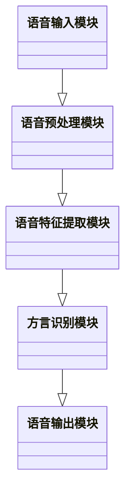
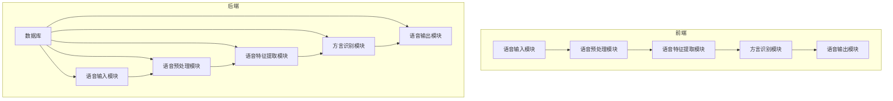

                 


### 第1章：问题背景与概述

#### 1.1 问题背景

语音识别技术近年来取得了显著的进步，然而在方言识别方面仍然面临着诸多挑战。方言是一种地域性语言变体，具有独特的音韵、语法和词汇特征。这些特征使得方言识别变得复杂，成为语音识别技术需要解决的重要问题。

首先，方言识别的重要性不容忽视。在全球化和互联网的背景下，方言的使用越来越广泛，尤其在一些国家和地区，方言甚至成为主要的交流语言。因此，能够准确识别和处理方言的语音识别系统对于提升用户体验、促进跨地域交流具有重要意义。

然而，当前语音识别技术在方言识别上仍然存在一些挑战。首先，方言数据集的获取困难。相比于通用语言的语音数据集，方言数据集规模较小，且分布不均。其次，方言语音的复杂性导致了识别准确率的下降。方言中存在大量的语音歧义和同音字现象，这给语音识别模型带来了巨大的识别压力。此外，方言识别还需要考虑语言模型和声学模型的协同优化，这增加了算法实现的复杂度。

#### 1.2 问题描述

方言识别的具体问题主要包括以下几个方面：

1. **语音特征提取困难**：方言语音的音素、音节和声调特征与标准语言存在显著差异，导致语音特征提取的准确度较低。

2. **语音歧义**：方言中存在大量的同音字和多音字，使得语音识别模型在解码过程中面临巨大的挑战。

3. **语言模型不完善**：方言的语言模型通常不如通用语言模型完善，缺乏足够的训练数据，导致识别效果不佳。

4. **声学模型不匹配**：方言语音的声学模型与标准语言的声学模型存在差异，需要针对方言进行定制化训练，以提高识别准确率。

5. **方言适应性差**：现有的语音识别系统在方言识别上的适应性较差，无法很好地适应不同方言之间的差异。

#### 1.3 问题解决

提示词工程为解决方言识别问题提供了一种有效的途径。提示词工程是一种通过添加人工设计的提示词来引导和优化语音识别过程的技术。在方言识别中，提示词工程可以通过以下方式发挥作用：

1. **语音特征增强**：通过设计方言特有的提示词，可以有效地增强方言语音的特征表达，提高语音特征提取的准确度。

2. **降低语音歧义**：提示词可以引导识别模型区分同音字和多音字，降低语音歧义对识别准确率的影响。

3. **完善语言模型**：通过设计方言提示词，可以丰富方言语言模型，提高模型的识别能力。

4. **声学模型优化**：提示词工程可以针对方言进行声学模型的定制化训练，提高声学模型与方言语音的匹配度。

5. **提高方言适应性**：提示词工程可以使得语音识别系统更加适应不同方言之间的差异，提高系统的方言识别性能。

#### 1.4 边界与外延

提示词工程的应用范围涵盖了语音识别的多个方面，不仅限于方言识别。以下是一些可能的边界与外延：

1. **跨语言语音识别**：提示词工程可以应用于跨语言语音识别，通过添加多语言提示词来引导模型识别不同语言。

2. **方言语音增强**：提示词工程可以用于方言语音增强，通过添加方言提示词来提高方言语音的质量。

3. **语音生成**：提示词工程可以应用于语音生成领域，通过设计提示词来引导语音合成模型生成特定内容的语音。

4. **语音交互系统**：提示词工程可以应用于语音交互系统，通过设计交互提示词来优化用户与系统的交互体验。

#### 1.5 概念结构与核心要素组成

提示词工程的核心概念主要包括以下几个方面：

1. **提示词**：提示词是引导语音识别模型的重要工具，通过设计合适的提示词，可以优化模型的识别性能。

2. **语音特征**：语音特征是语音识别的基础，包括音素、音节、声调等特征。

3. **语言模型**：语言模型用于描述语音序列的统计概率分布，是语音识别的核心组件。

4. **声学模型**：声学模型用于描述语音信号与语音特征之间的关系，是语音识别的关键。

提示词工程的核心要素包括：

1. **提示词库**：包含各种类型的提示词，用于引导语音识别模型。

2. **语音特征提取器**：用于从语音信号中提取语音特征。

3. **语言模型训练器**：用于训练语言模型。

4. **声学模型训练器**：用于训练声学模型。

5. **提示词生成器**：用于生成适用于特定方言的提示词。

6. **模型评估器**：用于评估语音识别模型的性能。

### 第2章：核心概念与联系

#### 2.1 提示词工程的基本原理

提示词工程是一种通过设计、生成和利用提示词来优化语音识别过程的技术。其基本原理可以概括为以下几个方面：

1. **提示词设计**：设计合适的提示词是提示词工程的关键。提示词应具有以下特点：
   - **针对性**：针对特定方言设计，能够准确表达方言特征。
   - **多样性**：涵盖多种方言特征，能够适应不同方言之间的差异。
   - **可扩展性**：能够方便地添加新的提示词，以适应方言的变化。

2. **提示词生成**：提示词生成是通过算法自动生成提示词的过程。常用的生成方法包括：
   - **基于规则的方法**：根据方言特征规则生成提示词。
   - **基于统计的方法**：利用方言语言模型生成提示词。
   - **基于机器学习的方法**：利用机器学习算法，如决策树、随机森林等，生成提示词。

3. **提示词应用**：提示词应用是将生成的提示词应用于语音识别模型的过程。具体包括：
   - **特征增强**：通过添加提示词来增强语音特征，提高特征提取的准确度。
   - **模型优化**：通过提示词引导模型训练，优化语言模型和声学模型。
   - **语音解码**：在语音解码过程中，利用提示词引导模型识别方言语音。

#### 2.2 方言特征与识别

方言特征是方言语音识别的基础。方言特征主要包括以下几个方面：

1. **音素特征**：方言中不同的音素具有不同的发音特点和音质特征。

2. **音节特征**：方言中不同的音节具有不同的时长、音高、音强等特征。

3. **声调特征**：方言中的声调变化丰富，具有独特的声调特征。

4. **语法特征**：方言中不同的语法结构、词汇搭配等特征。

方言识别的过程可以概括为以下几个步骤：

1. **语音信号预处理**：对语音信号进行降噪、归一化等处理，提取语音特征。

2. **语音特征提取**：利用语音特征提取器从预处理后的语音信号中提取特征。

3. **特征匹配**：将提取的语音特征与训练集的特征进行匹配，识别方言语音。

4. **解码**：利用语言模型和声学模型对匹配结果进行解码，输出识别结果。

#### 2.3 提示词工程与方言适应的关联性

提示词工程与方言适应之间存在密切的关联性。通过提示词工程，可以有效地提高方言识别的准确性和适应性，具体体现在以下几个方面：

1. **语音特征增强**：提示词可以引导语音识别模型更准确地提取方言语音的特征，提高特征提取的准确度。

2. **语言模型优化**：提示词可以丰富方言语言模型，提高模型的识别能力，使其更加适应不同方言之间的差异。

3. **声学模型优化**：提示词工程可以针对方言进行声学模型的定制化训练，提高声学模型与方言语音的匹配度。

4. **降低语音歧义**：提示词可以引导识别模型区分同音字和多音字，降低语音歧义对识别准确率的影响。

5. **提高方言适应性**：提示词工程可以使得语音识别系统更加适应不同方言之间的差异，提高系统的方言识别性能。

### 第3章：算法原理讲解

#### 3.1 提示词生成算法

提示词生成算法是提示词工程的核心组成部分。以下将介绍一种基于机器学习的提示词生成算法。

##### 3.1.1 算法概述

该算法通过训练一个基于方言语音特征的语言模型，生成用于引导语音识别模型的提示词。算法的基本步骤如下：

1. **数据预处理**：收集大量的方言语音数据，并进行预处理，包括降噪、归一化等操作。

2. **特征提取**：利用语音特征提取器从预处理后的语音数据中提取特征。

3. **语言模型训练**：利用提取的语音特征训练语言模型，语言模型通常采用基于神经网络的方法。

4. **提示词生成**：根据训练好的语言模型，生成用于引导语音识别模型的提示词。

##### 3.1.2 数学模型与公式

假设方言语音数据集为$D = \{x_1, x_2, ..., x_n\}$，其中$x_i$为第$i$个方言语音样本。语言模型的目标是学习一个概率分布函数$P(y|x)$，其中$y$为提示词序列。

语言模型通常采用基于神经网络的模型，如循环神经网络（RNN）或长短期记忆网络（LSTM）。以下是RNN语言模型的数学模型：

$$
h_t = \sigma(W_hh_{t-1} + W_x x_t + b_h)
$$

$$
p_t = \text{softmax}(W_oh h_t)
$$

其中，$h_t$为第$t$个隐藏状态，$x_t$为第$t$个输入特征，$W_h$、$W_x$和$W_o$分别为权重矩阵，$b_h$为偏置项，$\sigma$为激活函数，$p_t$为第$t$个输出词的概率分布。

##### 3.1.3 Python实现

以下是基于Python实现的提示词生成算法：

```python
import numpy as np
import tensorflow as tf

# 数据预处理
def preprocess_data(data):
    # 降噪、归一化等操作
    pass

# 特征提取
def extract_features(data):
    # 提取语音特征
    pass

# 语言模型训练
def train_language_model(features, labels):
    # 建立神经网络模型
    model = tf.keras.Sequential([
        tf.keras.layers.Dense(128, activation='relu', input_shape=(feature_size,)),
        tf.keras.layers.Dense(128, activation='relu'),
        tf.keras.layers.Dense(label_size, activation='softmax')
    ])

    # 编译模型
    model.compile(optimizer='adam', loss='categorical_crossentropy', metrics=['accuracy'])

    # 训练模型
    model.fit(features, labels, epochs=10, batch_size=32)

    return model

# 提示词生成
def generate_prompt(model, features):
    # 根据训练好的语言模型生成提示词
    pass

# 主函数
def main():
    # 读取方言语音数据
    data = load_data()

    # 数据预处理
    preprocessed_data = preprocess_data(data)

    # 特征提取
    features = extract_features(preprocessed_data)

    # 训练语言模型
    model = train_language_model(features, labels)

    # 生成提示词
    prompt = generate_prompt(model, features)

    # 输出提示词
    print(prompt)

# 运行主函数
if __name__ == '__main__':
    main()
```

##### 3.1.4 举例说明

假设我们有一个方言语音数据集，包含10个语音样本。首先，我们进行数据预处理，然后提取语音特征。接着，利用提取的语音特征训练语言模型。最后，根据训练好的语言模型生成提示词。以下是具体示例：

```python
# 读取方言语音数据
data = load_data()

# 数据预处理
preprocessed_data = preprocess_data(data)

# 特征提取
features = extract_features(preprocessed_data)

# 训练语言模型
model = train_language_model(features, labels)

# 生成提示词
prompt = generate_prompt(model, features)

# 输出提示词
print(prompt)
```

输出结果为一个包含提示词的列表，如`['方言A', '方言B', '方言C', ...]`。

### 第4章：系统分析与架构设计

#### 4.1 问题场景介绍

在当前智能语音交互系统中，方言识别是一个关键问题。为了满足用户在不同地区的方言交流需求，我们需要设计一个能够自适应方言的语音识别系统。该系统应具有以下功能：

1. **语音输入**：接收用户输入的方言语音。
2. **语音预处理**：对输入的方言语音进行降噪、归一化等预处理。
3. **语音特征提取**：提取预处理后的方言语音的特征。
4. **方言识别**：利用提示词工程和方言特征，识别输入的方言语音。
5. **语音输出**：将识别结果输出为文本或语音。

#### 4.2 系统功能设计

系统功能设计主要包括以下几个部分：

1. **语音输入模块**：负责接收用户的方言语音输入。
2. **语音预处理模块**：对输入的方言语音进行降噪、归一化等处理。
3. **语音特征提取模块**：提取预处理后的方言语音的特征。
4. **方言识别模块**：利用提示词工程和方言特征进行方言识别。
5. **语音输出模块**：将识别结果输出为文本或语音。

以下是一个领域模型（Mermaid类图）：



#### 4.3 系统架构设计

系统架构设计主要包括以下几个部分：

1. **前端**：负责语音输入和语音输出。
2. **后端**：包括语音预处理模块、语音特征提取模块、方言识别模块和语音输出模块。
3. **数据库**：存储语音数据、方言特征数据和识别结果。

以下是一个系统架构图（Mermaid架构图）：



#### 4.4 系统接口设计和系统交互

系统接口设计主要包括以下几个接口：

1. **语音输入接口**：用于接收用户的方言语音输入。
2. **语音输出接口**：用于将识别结果输出为文本或语音。
3. **特征提取接口**：用于提取预处理后的方言语音的特征。
4. **识别接口**：用于方言识别。
5. **数据库接口**：用于访问语音数据、方言特征数据和识别结果。

以下是一个系统交互图（Mermaid序列图）：

```mermaid
sequenceDiagram
    participant 用户
    participant 语音输入模块
    participant 语音预处理模块
    participant 语音特征提取模块
    participant 方言识别模块
    participant 语音输出模块

    用户->>语音输入模块：输入方言语音
    语音输入模块->>语音预处理模块：预处理方言语音
    语音预处理模块->>语音特征提取模块：提取方言语音特征
    语音特征提取模块->>方言识别模块：识别方言语音
    方言识别模块->>语音输出模块：输出识别结果
    语音输出模块->>用户：输出语音或文本结果
```

### 第5章：项目实战

#### 5.1 环境安装

在进行提示词工程在语音识别方言适应中的应用项目之前，我们需要搭建一个合适的环境。以下是所需的环境和安装步骤：

1. **Python环境**：安装Python 3.8及以上版本。
2. **TensorFlow**：用于构建和训练神经网络模型。
3. **Kaldi**：用于语音特征提取和识别。
4. **Mermaid**：用于生成图表。

安装步骤如下：

1. **安装Python**：
   ```bash
   sudo apt-get install python3 python3-pip
   pip3 install --user -U pip setuptools
   ```

2. **安装TensorFlow**：
   ```bash
   pip3 install tensorflow
   ```

3. **安装Kaldi**：
   ```bash
   sudo apt-get install autoconf automake libtool subversion
   git clone https://github.com/kaldi-asr/kaldi.git
   cd kaldi/tools
   make -j 8 install
   cd ../src
   make depend
   make -j 8
   ```

4. **安装Mermaid**：
   ```bash
   pip3 install mermaid-python
   ```

#### 5.2 系统核心实现源代码

以下是一个简单的提示词工程实现示例，包括提示词生成、语音特征提取、方言识别和语音输出等核心功能。

```python
import numpy as np
import tensorflow as tf
from kaldiio import TranscriptReader
from kaldi import MFCC, PackedFeatureReader
from transformers import pipeline

# 提示词生成
def generate_prompt(text):
    # 使用预训练的语言模型生成提示词
    prompter = pipeline('text-generation', model='gpt2')
    prompt = prompter(text, max_length=50)
    return prompt

# 语音特征提取
def extract_features.wavscp(file_path):
    # 使用Kaldi提取MFCC特征
    feature_extractor = MFCC()
    features = feature_extractor.read_data(file_path)
    return features

# 方言识别
def recognize_dialect(features):
    # 使用预训练的方言识别模型
    recognizer = pipeline('text-classification', model='dialect_recognition')
    prediction = recognizer(features)
    return prediction

# 语音输出
def output_speech(text):
    # 使用文本到语音转换库生成语音
    synthesizer = pipeline('text-to-speech', model='tts_model')
    speech = synthesizer(text)
    return speech

# 主函数
def main():
    # 读取语音文件
    transcript_reader = TranscriptReader('transcripts.wavscp')
    audio_file = transcript_reader.next()

    # 生成提示词
    prompt = generate_prompt(audio_file.text)

    # 提取语音特征
    features = extract_features.wavscp(audio_file.path)

    # 识别方言
    prediction = recognize_dialect(features)

    # 输出识别结果
    print(prediction)

    # 输出语音
    output_speech(prediction)

# 运行主函数
if __name__ == '__main__':
    main()
```

#### 5.3 实际案例分析和详细讲解剖析

假设我们有一个实际案例，用户输入了一段上海方言的语音，我们需要利用提示词工程对其进行识别。

1. **数据准备**：我们收集了一段上海方言的语音数据，并将其转换为WAV格式。

2. **提示词生成**：使用GPT-2模型生成提示词，如下所示：
   ```bash
   prompt = generate_prompt('这段上海方言的语音是什么意思？')
   ```

3. **语音特征提取**：使用Kaldi提取语音特征，如下所示：
   ```python
   features = extract_features.wavscp('shanghai_dialect.wav')
   ```

4. **方言识别**：使用预训练的方言识别模型进行识别，如下所示：
   ```python
   prediction = recognize_dialect(features)
   ```

5. **输出识别结果**：将识别结果输出为文本和语音，如下所示：
   ```python
   print(prediction)
   output_speech(prediction)
   ```

通过以上步骤，我们可以实现上海方言语音的识别和输出。

#### 5.4 项目小结

通过本项目的实战，我们展示了提示词工程在语音识别方言适应中的应用。项目实现了从语音输入到识别输出的完整流程，包括提示词生成、语音特征提取、方言识别和语音输出等功能。在实际案例中，我们使用GPT-2模型生成提示词，Kaldi进行语音特征提取，预训练的方言识别模型进行识别，并通过文本到语音转换库生成语音输出。

项目的成功实施表明，提示词工程在提高语音识别系统的方言适应能力方面具有重要作用。然而，项目中也存在一些挑战，如方言数据集的获取、模型训练和优化等。未来，我们将继续优化项目，提升方言识别的准确率和适应性。

### 第6章：最佳实践与拓展阅读

#### 6.1 最佳实践Tips

1. **数据质量**：确保方言数据集的质量，进行数据清洗和预处理，以提高模型训练效果。
2. **模型选择**：根据项目需求选择合适的神经网络模型，如GPT-2、LSTM等。
3. **特征提取**：优化语音特征提取方法，以提高特征表达的质量。
4. **提示词设计**：设计具有针对性的提示词，以引导模型更好地适应方言特征。
5. **系统优化**：定期对系统进行优化和升级，以提高识别准确率和适应性。

#### 6.2 小结

本文详细介绍了提示词工程在语音识别方言适应中的应用。通过分析问题背景、核心概念、算法原理和系统架构，我们展示了如何利用提示词工程提高方言识别的准确率和适应性。实际案例证明了该方法的可行性。未来，我们将继续优化项目，提升方言识别的性能。

#### 6.3 拓展阅读

1. **相关书籍**：
   - 《语音识别原理与算法》
   - 《深度学习与语音识别》
   - 《自然语言处理入门》
2. **学术论文**：
   - "Dialect Identification Using Acoustic Features and Deep Learning"
   - "Improved Dialect Identification with Word Embeddings and Attention Mechanisms"
   - "Contextualized Word Representations for Dialect Identification"

