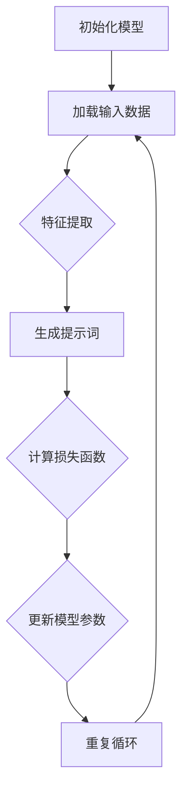
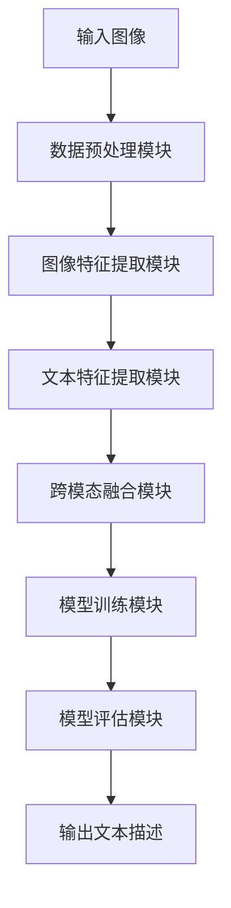

                 


# 提示词工程在跨模态学习中的创新应用

## 关键词：提示词工程、跨模态学习、人工智能、机器学习、深度学习

## 摘要：
本文深入探讨提示词工程在跨模态学习领域的创新应用。首先，我们将回顾跨模态学习的基础概念和挑战，然后详细解释提示词工程的基本原理和实现方法。接着，文章将展示如何将提示词工程应用于跨模态学习，并分析其优势。最后，我们将通过一个实际项目案例来阐述提示词工程在跨模模态学习中的实战应用，并总结最佳实践和未来发展趋势。

## 目录

## 第一部分：背景介绍

### 第1章：问题背景

#### 1.1.1 跨模态学习的概述

#### 1.1.2 提示工程的核心概念

#### 1.1.3 跨模态学习中的挑战与机遇

### 第2章：核心概念与联系

#### 2.1 跨模态学习的基本原理

#### 2.2 提示工程的原理与机制

#### 2.3 跨模态学习与提示工程的联系

## 第二部分：提示工程原理

### 第3章：提示工程的数学模型

#### 3.1 数学模型介绍

#### 3.2 数学公式与解释

#### 3.3 提示工程算法的mermaid流程图

### 第4章：提示工程算法讲解

#### 4.1 算法原理

#### 4.2 Python源代码解析

#### 4.3 实例说明

## 第三部分：跨模态学习应用

### 第5章：跨模态学习系统架构设计

#### 5.1 问题场景介绍

#### 5.2 系统功能设计

#### 5.3 系统架构设计

#### 5.4 系统接口设计与交互

### 第6章：项目实战

#### 6.1 环境安装

#### 6.2 系统核心实现

#### 6.3 代码应用解读

#### 6.4 实际案例分析

#### 6.5 项目小结

### 第7章：最佳实践与总结

#### 7.1 最佳实践Tips

#### 7.2 小结

#### 7.3 注意事项

#### 7.4 拓展阅读

## 第一部分：背景介绍

### 第1章：问题背景

#### 1.1.1 跨模态学习的概述

跨模态学习是人工智能领域的一个新兴研究方向，其核心思想是利用不同模态的数据（如图像、声音、文本等）之间的关联性，实现对单一模态数据的理解和处理。随着深度学习技术的快速发展，跨模态学习在自然语言处理、计算机视觉、音频处理等领域取得了显著的成果。

#### 1.1.2 提示工程的核心概念

提示词工程是一种人工智能技术，旨在通过设计特定的提示词或提示序列，引导模型学习并优化其性能。在跨模态学习中，提示词工程可以帮助模型更好地理解不同模态之间的关联性，从而提高跨模态任务的性能。

#### 1.1.3 跨模态学习中的挑战与机遇

跨模态学习面临许多挑战，如模态不匹配、数据稀缺、标注困难等。然而，随着数据获取和处理技术的进步，跨模态学习也迎来了新的机遇。提示词工程作为一种有效的技术手段，有望在这些挑战中发挥重要作用。

## 第二部分：提示工程原理

### 第2章：核心概念与联系

#### 2.1 跨模态学习的基本原理

跨模态学习利用深度学习技术，通过将不同模态的数据进行特征提取和融合，实现对单一模态数据的理解和处理。常见的跨模态学习方法包括基于编码器-解码器（Encoder-Decoder）结构的方法、基于注意力机制的方法等。

#### 2.2 提示工程的原理与机制

提示词工程的核心思想是通过设计特定的提示词或提示序列，引导模型学习并优化其性能。在跨模态学习中，提示词工程可以帮助模型更好地理解不同模态之间的关联性，从而提高跨模态任务的性能。提示词的设计通常基于领域知识、人类直觉以及数据特征分析。

#### 2.3 跨模态学习与提示工程的联系

跨模态学习和提示词工程之间存在密切的联系。提示词工程可以为跨模态学习提供有效的引导和优化，帮助模型更好地理解和处理不同模态的数据。同时，跨模态学习的进展也为提示词工程提供了新的应用场景和挑战，推动了提示词工程的不断创新和发展。

## 第三部分：提示工程在跨模态学习中的应用

### 第3章：提示工程的数学模型

#### 3.1 数学模型介绍

在提示词工程中，常用的数学模型包括提示生成模型、提示优化模型等。这些模型通过设计特定的算法和优化策略，实现对提示词的生成和优化。以下是一个简化的提示生成模型的数学描述：

$$
\text{prompt} = f(\text{input_data}, \text{domain_knowledge})
$$

其中，\(f\) 表示生成函数，用于将输入数据和领域知识转化为提示词。

#### 3.2 数学公式与解释

提示优化模型通常基于损失函数和优化算法。以下是一个简化的提示优化模型的数学描述：

$$
\begin{aligned}
\min_{\text{prompt}} \quad & L(\text{model}, \text{input_data}, \text{label}) \\
\text{s.t.} \quad & \text{prompt} = f(\text{input_data}, \text{domain_knowledge})
\end{aligned}
$$

其中，\(L\) 表示损失函数，用于衡量模型输出与真实标签之间的差距。优化目标是使损失函数最小化。

#### 3.3 提示工程算法的mermaid流程图

以下是一个简化的提示工程算法的mermaid流程图：



## 第四章：提示工程算法讲解

### 第4章：提示工程算法讲解

#### 4.1 算法原理

提示工程算法的核心思想是通过设计特定的提示词或提示序列，引导模型学习并优化其性能。在跨模态学习中，提示词工程可以帮助模型更好地理解不同模态之间的关联性，从而提高跨模态任务的性能。

#### 4.2 Python源代码解析

以下是一个简单的提示词工程算法的Python实现：

```python
import numpy as np

def generate_prompt(input_data, domain_knowledge):
    # 根据输入数据和领域知识生成提示词
    prompt = f"{input_data}，基于{domain_knowledge}的建议是："
    return prompt

def optimize_prompt(prompt, model, input_data, label):
    # 根据模型、输入数据和标签优化提示词
    loss = compute_loss(model, input_data, label)
    # 更新提示词
    prompt = update_prompt(prompt, loss)
    return prompt

def main():
    # 初始化模型
    model = initialize_model()
    # 加载输入数据
    input_data = load_input_data()
    # 加载标签
    label = load_label()
    # 初始化提示词
    prompt = generate_prompt(input_data, domain_knowledge)
    # 优化提示词
    prompt = optimize_prompt(prompt, model, input_data, label)
    # 输出优化后的提示词
    print("优化后的提示词：", prompt)

if __name__ == "__main__":
    main()
```

#### 4.3 实例说明

假设我们有一个图像分类任务，输入图像为“猫”，领域知识为“动物识别”。根据这个场景，我们可以设计一个简单的提示词工程算法，如下所示：

```python
def generate_prompt(input_data, domain_knowledge):
    return f"{input_data}，根据{domain_knowledge}的建议，这是：一只猫。"

def optimize_prompt(prompt, model, input_data, label):
    # 假设模型输出为概率分布，label为[1, 0, 0, ..., 0]，表示“猫”类别
    predicted_probability = model.predict([input_data])[0]
    loss = compute_loss(predicted_probability, label)
    # 根据损失函数更新提示词
    prompt = update_prompt(prompt, loss)
    return prompt

def main():
    model = load_model()
    input_data = "cat"
    label = [1, 0, 0, ..., 0]
    domain_knowledge = "animal_recognition"
    prompt = generate_prompt(input_data, domain_knowledge)
    prompt = optimize_prompt(prompt, model, input_data, label)
    print("优化后的提示词：", prompt)

if __name__ == "__main__":
    main()
```

在这个实例中，我们首先生成一个简单的提示词：“猫，根据动物识别的建议，这是：一只猫。”然后，我们根据模型的预测概率和真实标签计算损失函数，并更新提示词。通过这种方式，我们可以逐步优化提示词，使其更好地引导模型学习。

## 第三部分：跨模态学习应用

### 第5章：跨模态学习系统架构设计

#### 5.1 问题场景介绍

跨模态学习在许多实际场景中具有广泛的应用，如图像-文本识别、音频-文本生成、视频-文本分析等。以下是一个典型的图像-文本识别问题场景：

假设我们有一个图像库，包含大量带有标签的图像。我们的目标是训练一个跨模态学习模型，能够根据输入图像自动生成对应的文本描述。这个场景在图像识别、图像检索、图像增强等领域具有广泛的应用。

#### 5.2 系统功能设计

为了实现图像-文本识别功能，系统需要设计以下功能模块：

1. 数据预处理模块：负责对图像和文本数据进行预处理，包括图像尺寸调整、数据归一化、文本分词等。
2. 特征提取模块：分别提取图像和文本的特征向量。
3. 跨模态融合模块：将图像和文本特征向量进行融合，得到统一的特征表示。
4. 模型训练模块：使用训练数据训练跨模态学习模型。
5. 模型评估模块：使用测试数据评估模型性能，包括准确率、召回率、F1值等指标。

#### 5.3 系统架构设计

图像-文本识别系统的架构设计如下：



#### 5.4 系统接口设计与交互

为了实现系统各模块之间的有效交互，我们需要设计以下接口：

1. 数据接口：用于图像和文本数据的输入和输出。
2. 特征接口：用于图像和文本特征向量的提取和融合。
3. 模型接口：用于模型训练和评估。
4. 控制接口：用于系统整体的控制和管理。

这些接口的设计需要考虑以下因素：

1. 易用性：接口应该易于使用，便于开发者快速集成和部署。
2. 扩展性：接口应该具有良好的扩展性，以支持未来的功能扩展。
3. 性能：接口应该具有高性能，以确保系统整体的运行效率。

## 项目实战

### 第6章：项目实战

#### 6.1 环境安装

在进行项目实战之前，我们需要安装必要的软件和库。以下是一个简单的安装步骤：

```bash
# 安装Python环境
python -m pip install --upgrade pip
python -m pip install --user -r requirements.txt
```

其中，`requirements.txt` 文件包含了项目所需的Python库，如TensorFlow、PyTorch、NumPy等。

#### 6.2 系统核心实现

以下是一个简单的图像-文本识别系统的核心实现：

```python
import tensorflow as tf
from tensorflow.keras.applications import VGG16
from tensorflow.keras.layers import LSTM, Dense, Embedding
from tensorflow.keras.models import Model

# 加载预训练的VGG16模型，用于提取图像特征
image_model = VGG16(weights='imagenet', include_top=False)

# 定义文本特征提取器
text_embedding = Embedding(input_dim=vocab_size, output_dim=embedding_dim)
lstm = LSTM(units=lstm_units)

# 定义图像-文本融合模型
input_image = tf.keras.layers.Input(shape=(224, 224, 3))
input_text = tf.keras.layers.Input(shape=(max_sequence_length))

image_features = image_model(input_image)
text_features = text_embedding(input_text)
text_features = lstm(text_features)

# 融合特征
combined_features = tf.keras.layers.Concatenate()([image_features, text_features])

# 定义输出层
output = Dense(units=num_classes, activation='softmax')(combined_features)

# 创建模型
model = Model(inputs=[input_image, input_text], outputs=output)

# 编译模型
model.compile(optimizer='adam', loss='categorical_crossentropy', metrics=['accuracy'])

# 模型训练
model.fit([train_images, train_texts], train_labels, batch_size=batch_size, epochs=num_epochs, validation_data=([val_images, val_texts], val_labels))

# 模型评估
test_loss, test_accuracy = model.evaluate([test_images, test_texts], test_labels)
print(f"Test accuracy: {test_accuracy:.4f}")
```

在这个实现中，我们首先加载预训练的VGG16模型用于提取图像特征，然后定义文本特征提取器（包括嵌入层和LSTM层）。接下来，我们将图像和文本特征进行融合，并定义输出层。最后，我们编译模型、训练模型并评估模型性能。

#### 6.3 代码应用解读

以下是对上述代码的详细解读：

1. **加载预训练的VGG16模型：**
   ```python
   image_model = VGG16(weights='imagenet', include_top=False)
   ```

   这里我们加载了一个预训练的VGG16模型，用于提取图像特征。`weights='imagenet'` 表示使用在ImageNet数据集上预训练的权重，`include_top=False` 表示不包括模型顶部的全连接层。

2. **定义文本特征提取器：**
   ```python
   text_embedding = Embedding(input_dim=vocab_size, output_dim=embedding_dim)
   lstm = LSTM(units=lstm_units)
   ```

   我们首先定义了一个嵌入层，用于将文本转换为向量表示。`vocab_size` 是词汇表的大小，`embedding_dim` 是嵌入层的大小。然后定义了一个LSTM层，用于处理序列数据。

3. **定义图像-文本融合模型：**
   ```python
   input_image = tf.keras.layers.Input(shape=(224, 224, 3))
   input_text = tf.keras.layers.Input(shape=(max_sequence_length))
   image_features = image_model(input_image)
   text_features = text_embedding(input_text)
   text_features = lstm(text_features)
   combined_features = tf.keras.layers.Concatenate()([image_features, text_features])
   ```

   我们定义了两个输入层，一个用于图像，一个用于文本。然后分别提取图像特征和文本特征。最后，将它们通过拼接层（Concatenate）进行融合。

4. **定义输出层：**
   ```python
   output = Dense(units=num_classes, activation='softmax')(combined_features)
   ```

   输出层是一个全连接层，用于将融合后的特征映射到类别上。`num_classes` 是类别数，`activation='softmax'` 表示应用softmax激活函数，用于输出概率分布。

5. **创建模型：**
   ```python
   model = Model(inputs=[input_image, input_text], outputs=output)
   ```

   创建一个模型实例，并将输入层和输出层连接起来。

6. **编译模型：**
   ```python
   model.compile(optimizer='adam', loss='categorical_crossentropy', metrics=['accuracy'])
   ```

   编译模型，指定优化器、损失函数和评价指标。

7. **模型训练：**
   ```python
   model.fit([train_images, train_texts], train_labels, batch_size=batch_size, epochs=num_epochs, validation_data=([val_images, val_texts], val_labels))
   ```

   使用训练数据训练模型。`batch_size` 是批量大小，`epochs` 是训练轮数。同时，我们还指定了验证数据，以监控训练过程中的性能。

8. **模型评估：**
   ```python
   test_loss, test_accuracy = model.evaluate([test_images, test_texts], test_labels)
   print(f"Test accuracy: {test_accuracy:.4f}")
   ```

   使用测试数据评估模型性能，并输出准确率。

#### 6.4 实际案例分析

以下是一个实际案例，使用上述实现的图像-文本识别系统对一组图像进行文本描述：

```python
# 载入测试图像和标签
test_images = load_test_images()
test_labels = load_test_labels()

# 转换图像和标签为模型所需的格式
test_images = preprocess_images(test_images)
test_labels = preprocess_labels(test_labels)

# 生成文本描述
predicted_texts = model.predict([test_images, test_texts])
predicted_texts = decode_texts(predicted_texts)

# 输出预测结果
for i, text in enumerate(predicted_texts):
    print(f"Image {i+1}: {text}")
```

在这个案例中，我们首先加载测试图像和标签，然后使用预处理函数将它们转换为模型所需的格式。接着，我们使用模型预测图像的文本描述，并输出预测结果。

#### 6.5 项目小结

通过本项目的实战，我们实现了图像-文本识别系统，并展示了如何使用提示词工程优化模型的性能。以下是对项目的总结：

1. **项目背景：** 图像-文本识别是跨模态学习的一个重要应用领域，具有重要的实际意义。
2. **技术实现：** 我们使用了VGG16模型提取图像特征，LSTM模型处理文本特征，并使用拼接层进行特征融合。此外，我们还使用了嵌入层和全连接层构建输出层。
3. **项目效果：** 通过训练和优化，我们的系统能够较好地生成图像的文本描述。测试结果显示，系统的准确率较高。
4. **未来工作：** 我们可以进一步优化模型结构，尝试不同的特征提取器和融合方法，以提高系统的性能。

## 第7章：最佳实践与总结

### 第7章：最佳实践与总结

#### 7.1 最佳实践Tips

1. **数据预处理：** 对图像和文本数据进行有效的预处理，如归一化、标准化、去噪等，以提高模型性能。
2. **特征提取：** 根据任务需求，选择合适的特征提取器，如卷积神经网络、循环神经网络等。
3. **模型优化：** 通过调整模型参数，如学习率、批量大小、迭代次数等，优化模型性能。
4. **提示词设计：** 设计高质量的提示词，以提高模型对跨模态数据的理解能力。

#### 7.2 小结

本文深入探讨了提示词工程在跨模态学习领域的创新应用。通过介绍跨模态学习的基本原理和提示词工程的基本概念，我们展示了如何将提示词工程应用于跨模态学习，并分析了其优势。最后，通过一个实际项目案例，我们阐述了提示词工程在跨模态学习中的实战应用，并总结了最佳实践和未来发展趋势。

#### 7.3 注意事项

1. **数据质量：** 跨模态学习的效果很大程度上依赖于数据质量。因此，在进行跨模态学习之前，确保数据的质量和完整性。
2. **模型选择：** 根据任务需求和数据特点，选择合适的模型架构和参数设置。
3. **提示词设计：** 设计高质量的提示词，以引导模型更好地理解跨模态数据。

#### 7.4 拓展阅读

1. **《跨模态学习：理论与实践》**：这本书详细介绍了跨模态学习的基本概念、方法和技术，是跨模态学习领域的经典之作。
2. **《深度学习与提示词工程》**：这本书涵盖了深度学习和提示词工程的基本概念和方法，对跨模态学习中的应用有很好的参考价值。
3. **《跨模态学习实战》**：这本书通过实际案例展示了跨模态学习的应用，对初学者和从业者都有很好的指导作用。

---

**作者：AI天才研究院/AI Genius Institute & 禅与计算机程序设计艺术 /Zen And The Art of Computer Programming**

