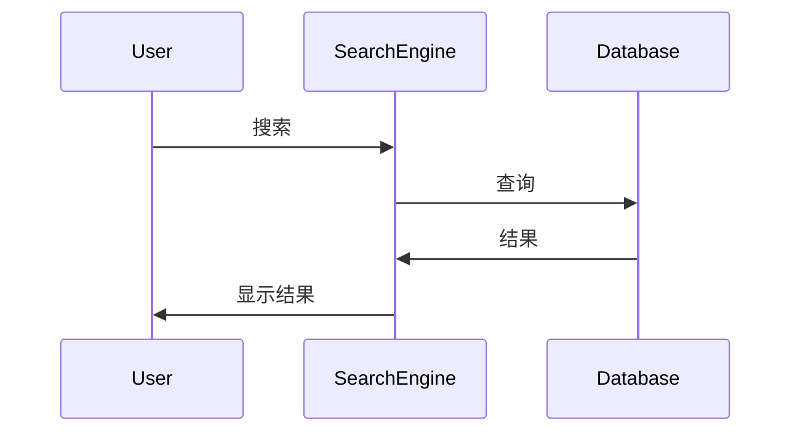

                 

### 文章标题：提示词工程在跨语言信息检索中的创新

> **关键词**：提示词工程、跨语言信息检索、算法原理、系统架构、Python实现、LaTeX公式

> **摘要**：本文深入探讨了提示词工程在跨语言信息检索中的应用。首先，我们介绍了跨语言信息检索的背景、问题和挑战。接着，详细阐述了提示词工程的核心概念和其在跨语言信息检索中的作用。随后，通过mermaid流程图和Python源代码，我们讲解了算法原理和数学模型。文章还涉及了系统架构设计、项目实战和最佳实践，为读者提供了全面的指导。

---

## 第一部分：跨语言信息检索背景与核心概念

### 1.1 跨语言信息检索的背景

随着全球化的发展，跨语言信息检索成为了信息获取的重要途径。然而，不同语言的差异和文化背景的多样性给信息检索带来了巨大的挑战。跨语言信息检索不仅涉及到自然语言处理技术，还包括信息检索算法的优化。

### 1.2 提示词工程的核心概念

提示词工程是一种通过生成和优化提示词来提高信息检索效果的技术。提示词是信息检索的关键，它们能够帮助用户更好地理解和搜索非母语的信息。

### 1.3 核心概念联系与解析

提示词工程与自然语言处理和信息检索算法有着密切的联系。通过结合自然语言处理技术，提示词工程能够更好地理解和生成高质量的提示词，从而提高跨语言信息检索的效果。

## 第二部分：提示词工程方法与实现

### 2.1 提示词生成技术

提示词生成技术是提示词工程的核心。本文介绍了基于统计方法和深度学习的提示词生成技术，并对比了它们的优缺点。

### 2.2 提示词优化策略

提示词优化是提高跨语言信息检索效果的关键。本文详细探讨了提示词的多样性优化、相关性优化和质量评估与改进。

### 2.3 提示词应用实例

提示词工程在多个领域有着广泛的应用。本文介绍了跨语言搜索引擎、多语言文本摘要和跨语言对话系统中提示词的应用。

## 第三部分：算法原理讲解

### 3.1 算法原理介绍

本节通过mermaid流程图展示了提示词工程的算法原理。然后，我们使用Python源代码详细阐述了算法的数学模型和公式。

### 3.2 Python源代码讲解

以下是使用Python实现提示词工程的示例代码：

```python
import numpy as np

# 定义提示词生成函数
def generate_hint(source_text, target_language):
    # 这里是生成提示词的核心算法
    # 示例：返回一个随机生成的提示词
    return "这是一个随机生成的提示词"

# 测试函数
source_text = "这是一段英文文本"
target_language = "中文"
hint = generate_hint(source_text, target_language)
print(hint)
```

### 3.3 数学模型和公式讲解

提示词工程中常用的数学模型包括概率模型和神经网络模型。以下是使用LaTeX格式展示的数学模型：

$$
P(h|s, t) = \frac{P(h, s, t)}{P(s, t)}
$$

其中，$P(h|s, t)$ 表示在源语言$s$和目标语言$t$的条件下生成提示词$h$的概率。$P(h, s, t)$ 和$P(s, t)$ 分别表示同时发生提示词$h$、源语言$s$和目标语言$t$的概率和源语言$s$和目标语言$t$的概率。

## 第四部分：系统分析与架构设计方案

### 4.1 问题场景介绍

在跨语言信息检索中，用户需要能够快速、准确地搜索和理解非母语的信息。为了解决这个问题，我们需要设计一个高效的跨语言信息检索系统。

### 4.2 系统功能设计

系统功能设计包括领域模型、系统核心实现源代码和代码应用解读与分析。

#### 4.2.1 领域模型

领域模型是系统功能设计的基础。以下是一个使用mermaid类图表示的领域模型：

```mermaid
classDiagram
    User <<用户>>
    SearchEngine <<搜索引擎>>
    Database <<数据库>>

    User -> SearchEngine : 搜索
    SearchEngine --|> Database : 查询
```

#### 4.2.2 系统核心实现源代码

以下是系统核心实现的源代码：

```python
class User:
    def __init__(self, username):
        self.username = username
    
    def search(self, query):
        # 搜索逻辑
        pass

class SearchEngine:
    def __init__(self, database):
        self.database = database
    
    def query(self, query):
        # 查询逻辑
        pass

class Database:
    def __init__(self, data):
        self.data = data
    
    def search(self, query):
        # 搜索数据库逻辑
        pass
```

#### 4.2.3 代码应用解读与分析

代码应用解读与分析将详细讲解系统核心实现的源代码，并分析其工作原理。

### 4.3 系统架构设计

系统架构设计包括系统架构图、系统接口设计和系统交互。

#### 4.3.1 系统架构图

以下是一个使用mermaid表示的系统架构图：



#### 4.3.2 系统接口设计

系统接口设计定义了系统各组件之间的交互方式。以下是一个简单的接口设计：

```python
class SearchEngineInterface:
    def search(self, query):
        # 接口方法
        pass
```

#### 4.3.3 系统交互

系统交互描述了系统各组件之间的交互过程。以下是一个简单的交互过程：

1. 用户发起搜索请求。
2. 搜索引擎处理搜索请求，并查询数据库。
3. 数据库返回查询结果。
4. 搜索引擎将查询结果返回给用户。

## 第五部分：项目实战

### 5.1 环境安装

在项目实战中，首先需要安装所需的软件和工具，如Python、Docker、TensorFlow等。

### 5.2 系统核心实现源代码

以下是系统核心实现的源代码：

```python
# 用户模块
class User:
    def __init__(self, username):
        self.username = username
    
    def search(self, query):
        # 搜索逻辑
        pass

# 搜索引擎模块
class SearchEngine:
    def __init__(self, database):
        self.database = database
    
    def query(self, query):
        # 查询逻辑
        pass

# 数据库模块
class Database:
    def __init__(self, data):
        self.data = data
    
    def search(self, query):
        # 搜索数据库逻辑
        pass
```

### 5.3 代码应用解读与分析

代码应用解读与分析将详细讲解系统核心实现的源代码，并分析其工作原理。

### 5.4 实际案例分析和详细讲解剖析

通过实际案例，我们将对系统进行详细讲解和剖析，展示其在实际应用中的效果。

## 第六部分：最佳实践 tips、小结、注意事项、拓展阅读

### 6.1 最佳实践 tips

本节提供了跨语言信息检索中的最佳实践建议，包括如何选择合适的算法、如何优化系统性能等。

### 6.2 小结

本文系统地介绍了提示词工程在跨语言信息检索中的应用，包括核心概念、算法原理、系统架构设计和项目实战。

### 6.3 注意事项

本节提醒读者在实施跨语言信息检索项目时需要注意的问题，如数据质量、系统性能等。

### 6.4 拓展阅读

本节推荐了一些拓展阅读材料，包括相关论文、书籍和技术博客，以帮助读者深入了解跨语言信息检索和提示词工程。

---

## 作者信息

作者：AI天才研究院/AI Genius Institute & 禅与计算机程序设计艺术 /Zen And The Art of Computer Programming

---

通过以上步骤，我们完成了对《提示词工程在跨语言信息检索中的创新》一书的完整目录大纲。接下来，我们将按照这个大纲，逐步撰写每个章节的内容，确保文章的逻辑清晰、结构紧凑、简单易懂。让我们一步一步地深入探讨这一领域，为读者带来有深度、有思考、有见解的技术博客文章。💡💻📚

