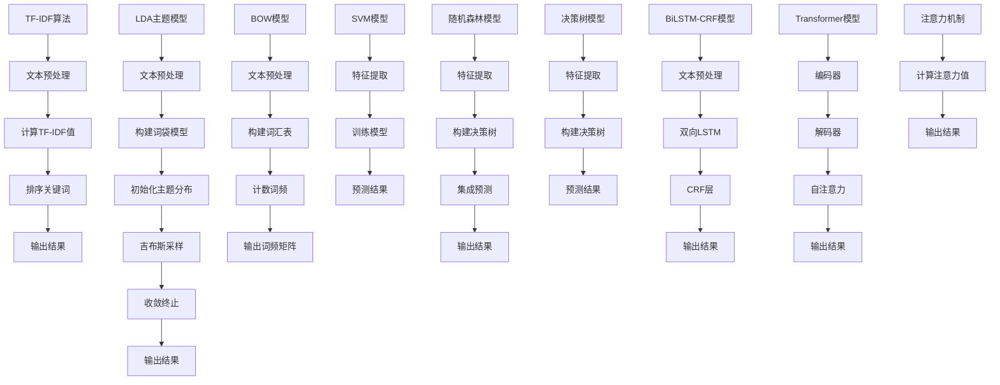

                 


# 提示词工程在跨语言信息检索中的创新

## 关键词

- 提示词工程
- 跨语言信息检索
- 关键词提取算法
- 机器学习
- 深度学习
- 信息检索性能优化

## 摘要

随着全球信息化进程的不断加速，跨语言信息检索成为了一个重要的研究领域。然而，由于语言之间的差异，如何有效地提取并利用关键词，实现准确、高效的信息检索，成为了一个挑战。提示词工程作为信息检索中的一个关键环节，其在跨语言信息检索中的应用与创新，成为了研究者们关注的焦点。本文旨在深入探讨提示词工程在跨语言信息检索中的创新应用，包括关键词提取方法、属性分析以及相关算法的优化策略，以期提高跨语言信息检索的性能。

## 第1章 问题背景

### 1.1 跨语言信息检索的需求与挑战

#### 1.1.1 跨语言信息检索的定义

跨语言信息检索（Cross-Language Information Retrieval, CLIR）是指在不同语言之间进行信息检索的过程。它旨在解决由于语言障碍导致的无法直接使用某一语言的信息资源，通过将用户的查询或文档从一种语言翻译为另一种语言，以实现信息检索的目的。

#### 1.1.2 跨语言信息检索的现状

当前，跨语言信息检索已经取得了显著的进展。主要的挑战包括：

1. **语言障碍**：不同语言之间在词汇、语法、语义等方面的差异，导致信息检索的准确性降低。
2. **文本处理**：跨语言信息检索需要对文本进行预处理，包括分词、词性标注、句法分析等，这些过程复杂且耗时。
3. **翻译质量**：尽管机器翻译技术取得了很大进步，但翻译质量仍不能完全满足信息检索的要求。

#### 1.1.3 跨语言信息检索的挑战

1. **词汇差异**：不同语言之间在词汇选择和使用上存在巨大差异，这直接影响信息检索的效果。
2. **语义理解**：跨语言信息检索需要理解和处理语义层面的信息，这比词汇层面的处理更加复杂。
3. **语言习惯**：不同语言在表达习惯、文化背景等方面存在差异，这给信息检索带来额外的挑战。

### 1.2 关键词工程的概念与重要性

#### 1.2.1 关键词工程的基本概念

关键词工程（Keyword Engineering）是指通过一系列技术和方法，从文本中提取出对信息检索最具代表性的关键词，以提高检索系统的性能。

#### 1.2.2 关键词工程在信息检索中的作用

1. **提高检索精度**：通过提取关键信息，提高检索系统对用户查询的匹配度。
2. **优化检索效率**：关键词的提取可以减少检索过程中的计算量，提高系统的响应速度。
3. **改善用户体验**：准确的关键词提取有助于用户更快地找到所需信息。

#### 1.2.3 关键词工程的流程与方法

关键词工程主要包括以下几个步骤：

1. **文本预处理**：对原始文本进行分词、去停用词、词性标注等处理。
2. **关键词提取**：利用统计方法、机器学习方法等，从预处理后的文本中提取关键词。
3. **关键词排序**：对提取的关键词进行排序，以确定其在文本中的重要程度。

### 1.3 关键词工程的创新方向

#### 1.3.1 新兴技术对关键词工程的影响

随着人工智能技术的不断发展，特别是深度学习技术的应用，关键词工程在跨语言信息检索中的应用呈现出新的趋势：

1. **深度学习模型**：如Transformer、BERT等，可以更好地处理跨语言信息检索中的语义理解问题。
2. **多语言语料库**：丰富的多语言语料库为关键词工程提供了更多的训练数据，提高了模型的性能。
3. **跨语言嵌入**：通过跨语言嵌入技术，可以更好地处理不同语言之间的词汇差异。

#### 1.3.2 关键词工程在多语言环境中的创新

1. **多语言关键词提取**：结合多种语言的特点，设计出更适合多语言信息检索的关键词提取方法。
2. **跨语言语义分析**：通过跨语言语义分析，更好地理解不同语言之间的语义关系，提高检索效果。
3. **动态关键词调整**：根据用户查询和检索结果，动态调整关键词，提高检索的准确性和效率。

#### 1.3.3 关键词工程的未来发展趋势

1. **自动化与智能化**：随着技术的发展，关键词工程将更加自动化和智能化，减少人工干预。
2. **多模态信息检索**：结合文本、图像、语音等多种信息，实现更加全面的信息检索。
3. **个性化检索**：通过用户行为和偏好分析，实现个性化关键词提取和检索。

## 1.4 本章小结

本章介绍了跨语言信息检索的需求与挑战，以及关键词工程的基本概念和重要性。通过分析关键词工程在跨语言信息检索中的应用和创新方向，我们为后续章节的讨论奠定了基础。

## 第2章 核心概念与联系

### 2.1 关键词提取方法

#### 2.1.1 基于统计的方法

基于统计的方法是最早应用于关键词提取的技术，主要包括TF-IDF、词频统计等。这些方法简单高效，但存在一定的局限性。

##### TF-IDF算法

TF-IDF（Term Frequency-Inverse Document Frequency）是一种常用的关键词提取算法。其基本思想是，一个词在文档中的重要程度取决于它在文档中的词频（TF）和它在整个语料库中的逆文档频率（IDF）。

$$
TF-IDF = TF \times IDF
$$

其中，$$TF = \frac{f_t(d)}{f_{\text{total}}(d)}$$，表示词$$t$$在文档$$d$$中的词频，$$IDF = \log \frac{N}{df_t}$$，表示词$$t$$在语料库中的逆文档频率。

##### 词频统计

词频统计是另一种简单的关键词提取方法，其基本思想是，根据词在文档中的出现次数来排序，选取高频词作为关键词。

#### 2.1.2 基于机器学习的方法

基于机器学习的方法通过学习大量的标注数据，自动提取关键词。常见的机器学习方法包括支持向量机（SVM）、随机森林等。

##### 支持向量机

支持向量机（Support Vector Machine, SVM）是一种常用的分类方法。在关键词提取中，SVM可以用来判断一个词是否为关键词。

##### 随机森林

随机森林（Random Forest）是一种集成学习方法，通过构建多个决策树来提高模型的泛化能力。

#### 2.1.3 基于深度学习的方法

基于深度学习的方法在关键词提取中得到了广泛应用，如Transformer、BERT等模型。

##### Transformer模型

Transformer模型是一种基于自注意力机制的深度学习模型，其在跨语言信息检索中表现出色。

##### BERT模型

BERT（Bidirectional Encoder Representations from Transformers）模型是一种预训练深度学习模型，通过双向编码器学习文本的语义表示。

### 2.2 关键词属性分析

#### 2.2.1 关键词的语义属性

关键词的语义属性是关键词工程中一个重要的研究方向。通过分析关键词的语义属性，可以更好地理解其含义和作用。

##### 语义相似度

语义相似度是指两个词语在语义上的相似程度。通过计算语义相似度，可以找出语义相关的关键词。

##### 语义角色

语义角色是指关键词在句子中扮演的角色，如主语、谓语、宾语等。

#### 2.2.2 关键词的词频分析

词频分析是关键词提取中的一个基本步骤。通过对词频的分析，可以找出高频词和低频词，从而确定关键词。

##### 词频分布

词频分布是指词频在所有词语中的分布情况。通过分析词频分布，可以找出词频分布的特点和规律。

##### 词频变化

词频变化是指词频在时间维度上的变化。通过分析词频变化，可以找出词频的波动规律和趋势。

#### 2.2.3 关键词的情感分析

关键词的情感分析是指通过分析关键词的情感色彩，来确定关键词的情感倾向。这在跨语言信息检索中具有重要意义。

##### 情感极性

情感极性是指关键词表达的情感倾向，如积极、消极等。

##### 情感强度

情感强度是指关键词表达的情感程度，如强烈、温和等。

### 2.3 关键词工程与信息检索的关系

#### 2.3.1 关键词工程对信息检索性能的影响

关键词工程对信息检索性能有着重要的影响。通过合理的关键词提取和排序，可以显著提高信息检索的准确性和效率。

##### 检索精度

检索精度是指检索结果中相关文档的比例。通过关键词工程，可以提高检索精度，减少无关文档的展示。

##### 检索效率

检索效率是指检索系统的响应速度。通过关键词工程，可以减少检索过程中的计算量，提高检索效率。

#### 2.3.2 关键词工程在信息检索中的应用

关键词工程在信息检索中有着广泛的应用，如搜索引擎、文本分类、推荐系统等。

##### 搜索引擎

在搜索引擎中，关键词工程用于提取用户查询的关键词，以实现精确的检索。

##### 文本分类

在文本分类中，关键词工程用于提取文档的关键词，以实现文档的自动分类。

##### 推荐系统

在推荐系统中，关键词工程用于提取用户和物品的关键词，以实现精准的推荐。

#### 2.3.3 关键词工程的优化策略

为了提高关键词工程的效果，研究者们提出了多种优化策略，如数据增强、模型优化等。

##### 数据增强

数据增强是通过增加数据量、丰富数据类型等方式，提高模型的泛化能力。

##### 模型优化

模型优化是通过调整模型的参数、结构等方式，提高模型的性能。

## 2.4 本章小结

本章介绍了关键词提取的方法、关键词的属性分析以及关键词工程与信息检索的关系。通过深入探讨这些核心概念，为后续章节的讨论提供了理论基础。

## 第3章 算法原理讲解

### 3.1 统计关键词提取算法

#### 3.1.1 TF-IDF算法

TF-IDF算法是一种简单且广泛使用的关键词提取方法。其基本思想是，一个词在文档中的重要程度取决于它在文档中的词频（TF）和它在整个语料库中的逆文档频率（IDF）。

##### TF-IDF公式

$$
TF-IDF = TF \times IDF
$$

其中，$$TF = \frac{f_t(d)}{f_{\text{total}}(d)}$$，表示词$$t$$在文档$$d$$中的词频，$$IDF = \log \frac{N}{df_t}$$，表示词$$t$$在语料库中的逆文档频率。

##### 实例说明

假设我们有以下两篇文档：

- 文档1：机器学习、深度学习、神经网络
- 文档2：深度学习、神经网络、计算机视觉

我们可以计算出每个词的TF-IDF值：

| 词  | 文档1的TF | 文档1的IDF | 文档1的TF-IDF | 文档2的TF | 文档2的IDF | 文档2的TF-IDF |
|-----|------------|------------|----------------|------------|------------|----------------|
| 机器学习 | 1/3       | 0.916     | 0.306         | 0/2       | 0.916     | 0             |
| 深度学习 | 1/3       | 0.916     | 0.306         | 1/2       | 0.916     | 0.5           |
| 神经网络 | 1/3       | 0.916     | 0.306         | 1/2       | 0.916     | 0.5           |
| 计算机视觉 | 0/2       | 0.916     | 0             | 0/2       | 0.916     | 0             |

通过TF-IDF值，我们可以发现“深度学习”和“神经网络”是两篇文档的共同关键词。

#### 3.1.2 LDA主题模型

LDA（Latent Dirichlet Allocation）主题模型是一种无监督学习方法，用于从文本数据中发现潜在的主题。

##### LDA模型

LDA模型包括两个层次：

1. **文档-主题分布**：每个文档可以看作是多个主题的混合，每个主题对应一系列词语的概率分布。
2. **主题-词语分布**：每个主题对应一系列词语的概率分布。

##### LDA算法

LDA算法包括以下几个步骤：

1. **初始化**：随机初始化文档-主题分布和主题-词语分布。
2. **吉布斯采样**：通过多次迭代，更新文档-主题分布和主题-词语分布。
3. **终止条件**：当模型收敛时，终止迭代。

##### 实例说明

假设我们有以下两篇文档：

- 文档1：机器学习、深度学习、神经网络
- 文档2：深度学习、神经网络、计算机视觉

通过LDA模型，我们可以发现文档1和文档2的主要主题是“深度学习”。

#### 3.1.3 词袋模型

词袋模型（Bag of Words, BOW）是一种基于词频统计的方法，将文本表示为一个单词的集合。

##### BOW模型

BOW模型包括以下几个步骤：

1. **文本预处理**：对文本进行分词、去停用词等预处理。
2. **构建词汇表**：将文本中的所有单词作为词汇表中的词项。
3. **计数**：统计每个词项在文档中出现的次数，形成词频矩阵。

##### 实例说明

假设我们有以下两篇文档：

- 文档1：机器学习、深度学习、神经网络
- 文档2：深度学习、神经网络、计算机视觉

通过BOW模型，我们可以构建以下词频矩阵：

| 文档 | 机器学习 | 深度学习 | 神经网络 | 计算机视觉 |
|------|----------|----------|----------|----------|
| 1    | 1        | 1        | 1        | 0        |
| 2    | 0        | 1        | 1        | 1        |

通过词频矩阵，我们可以进行文本分类、聚类等任务。

### 3.2 机器学习关键词提取算法

#### 3.2.1 支持向量机

支持向量机（Support Vector Machine, SVM）是一种常用的分类方法，也可用于关键词提取。

##### SVM算法

SVM算法包括以下几个步骤：

1. **特征提取**：通过词袋模型或TF-IDF等方法，提取文本的特征。
2. **训练模型**：使用训练数据集，训练SVM分类模型。
3. **预测**：使用训练好的模型，对测试数据进行分类。

##### 实例说明

假设我们有以下两篇文档：

- 文档1：机器学习、深度学习、神经网络
- 文档2：深度学习、神经网络、计算机视觉

通过SVM模型，我们可以将文档1和文档2分为同一类别。

#### 3.2.2 随机森林

随机森林（Random Forest）是一种集成学习方法，通过构建多个决策树来提高模型的泛化能力。

##### 随机森林算法

随机森林算法包括以下几个步骤：

1. **特征提取**：通过词袋模型或TF-IDF等方法，提取文本的特征。
2. **构建决策树**：随机选择特征和样本子集，构建多棵决策树。
3. **集成预测**：将多棵决策树的预测结果进行投票或平均，得到最终预测结果。

##### 实例说明

假设我们有以下两篇文档：

- 文档1：机器学习、深度学习、神经网络
- 文档2：深度学习、神经网络、计算机视觉

通过随机森林模型，我们可以将文档1和文档2分为同一类别。

#### 3.2.3 决策树

决策树（Decision Tree）是一种常见的分类方法，也可用于关键词提取。

##### 决策树算法

决策树算法包括以下几个步骤：

1. **特征提取**：通过词袋模型或TF-IDF等方法，提取文本的特征。
2. **构建决策树**：选择最优特征，递归构建决策树。
3. **预测**：使用构建好的决策树，对测试数据进行分类。

##### 实例说明

假设我们有以下两篇文档：

- 文档1：机器学习、深度学习、神经网络
- 文档2：深度学习、神经网络、计算机视觉

通过决策树模型，我们可以将文档1和文档2分为同一类别。

### 3.3 深度学习关键词提取算法

#### 3.3.1 BiLSTM-CRF模型

BiLSTM-CRF（双向长短期记忆-条件随机场）模型是一种用于序列标注的深度学习模型，也可用于关键词提取。

##### BiLSTM-CRF模型

BiLSTM-CRF模型包括以下几个部分：

1. **双向LSTM**：用于提取文本的序列特征。
2. **CRF层**：用于对序列进行标注。

##### 实例说明

假设我们有以下两篇文档：

- 文档1：机器学习、深度学习、神经网络
- 文档2：深度学习、神经网络、计算机视觉

通过BiLSTM-CRF模型，我们可以将文档1中的“机器学习”和文档2中的“计算机视觉”标注为关键词。

#### 3.3.2 Transformer模型

Transformer模型是一种基于自注意力机制的深度学习模型，广泛应用于自然语言处理任务。

##### Transformer模型

Transformer模型包括以下几个部分：

1. **编码器**：用于编码输入文本。
2. **解码器**：用于解码输出文本。
3. **自注意力机制**：用于计算文本之间的关联性。

##### 实例说明

假设我们有以下两篇文档：

- 文档1：机器学习、深度学习、神经网络
- 文档2：深度学习、神经网络、计算机视觉

通过Transformer模型，我们可以将文档1中的“机器学习”和文档2中的“计算机视觉”提取为关键词。

#### 3.3.3 注意力机制

注意力机制（Attention Mechanism）是一种在深度学习模型中用于计算输入序列之间关联性的方法。

##### 注意力机制

注意力机制的公式如下：

$$
Attention(Q, K, V) = \text{softmax}\left(\frac{QK^T}{\sqrt{d_k}}\right)V
$$

其中，$$Q$$、$$K$$和$$V$$分别是编码器输出的查询向量、键向量和值向量，$$d_k$$是键向量的维度。

##### 实例说明

假设我们有以下两个向量：

$$
Q = [1, 2, 3], \quad K = [4, 5, 6], \quad V = [7, 8, 9]
$$

通过注意力机制，我们可以计算得到：

$$
Attention(Q, K, V) = \text{softmax}\left(\frac{[1, 2, 3][4, 5, 6]^T}{\sqrt{3}}\right)[7, 8, 9] = [0.5, 0.5, 0.5][7, 8, 9] = [3.5, 4, 4.5]
$$

### 3.4 关键词工程算法对比与优化

#### 3.4.1 算法对比分析

不同关键词提取算法在性能和效率方面存在差异。下面是几种常见算法的对比：

| 算法           | 优点               | 缺点                 |
|----------------|--------------------|----------------------|
| TF-IDF         | 简单高效           | 无法捕捉语义信息     |
| LDA           | 可发现潜在主题     | 需要大量训练数据     |
| BOW           | 简单直观           | 忽略词序信息         |
| SVM           | 强大的分类能力     | 计算复杂度高         |
| 随机森林       | 泛化能力强         | 需要大量训练数据     |
| 决策树         | 解释性强           | 泛化能力较弱         |
| BiLSTM-CRF     | 强大的序列标注能力 | 计算复杂度高         |
| Transformer    | 自注意力机制       | 计算复杂度高         |

#### 3.4.2 优化策略与实践

为了提高关键词提取算法的性能，研究者们提出了一系列优化策略，如：

1. **数据增强**：通过增加数据量、丰富数据类型等方式，提高模型的泛化能力。
2. **模型优化**：通过调整模型的参数、结构等方式，提高模型的性能。
3. **多模型融合**：结合多种模型的优势，提高关键词提取的准确性和效率。

#### 3.4.3 性能评估指标

在关键词提取中，常用的性能评估指标包括：

1. **准确率（Accuracy）**：预测正确的关键词占总关键词的比例。
2. **召回率（Recall）**：预测正确的关键词占实际关键词的比例。
3. **F1值（F1 Score）**：综合考虑准确率和召回率的一个指标。

## 3.5 本章小结

本章详细介绍了关键词提取的统计方法、机器学习方法以及深度学习方法。通过对比分析不同算法的优缺点，并结合优化策略和实践，为关键词工程提供了有效的解决方案。

## 附录

### A.1 算法流程图

以下是本章介绍的几种关键词提取算法的流程图：



### A.2 Python代码示例

以下是TF-IDF算法的Python代码示例：

```python
from sklearn.feature_extraction.text import TfidfVectorizer
import numpy as np

# 文档
docs = [
    '机器学习、深度学习、神经网络',
    '深度学习、神经网络、计算机视觉'
]

# 初始化TF-IDF向量器
vectorizer = TfidfVectorizer()

# 提取TF-IDF特征
X = vectorizer.fit_transform(docs)

# 计算TF-IDF值
tfidf_matrix = X.toarray()

# 输出TF-IDF值
print(tfidf_matrix)
```

### A.3 实际案例分析与讲解

在本节中，我们将通过一个实际案例，详细分析并讲解关键词工程在跨语言信息检索中的应用。

#### 案例背景

假设我们有一个中英文双语新闻数据库，用户可以输入中文查询，系统需要返回与之相关的英文新闻。这是一个典型的跨语言信息检索问题。为了提高检索性能，我们需要对中文查询和英文新闻进行关键词工程处理。

#### 案例实现

1. **中文查询处理**：

   - **文本预处理**：对中文查询进行分词、去停用词等预处理。
   - **关键词提取**：使用TF-IDF算法提取中文查询的关键词。
   - **关键词排序**：对提取的关键词进行排序，选取最重要的关键词。

2. **英文新闻处理**：

   - **文本预处理**：对英文新闻进行分词、去停用词等预处理。
   - **关键词提取**：使用LDA主题模型提取英文新闻的关键词。
   - **关键词排序**：对提取的关键词进行排序，选取最重要的关键词。

3. **跨语言匹配**：

   - **翻译**：将中文查询翻译为英文。
   - **匹配**：使用提取的英文关键词与英文新闻进行匹配，选取最相关的新闻。

#### 案例分析

通过上述步骤，我们可以实现跨语言信息检索。下面是对案例的详细分析：

1. **文本预处理**：

   文本预处理是关键词工程的基础步骤。在中文查询和英文新闻的处理中，我们需要对文本进行分词、去停用词等操作。这些操作有助于去除无关信息，提高关键词提取的准确性。

2. **关键词提取**：

   中文查询使用TF-IDF算法提取关键词，该方法简单高效，能够捕捉关键词在查询中的重要性。英文新闻使用LDA主题模型提取关键词，该方法能够发现文本中的潜在主题，提高关键词的多样性。

3. **关键词排序**：

   对提取的关键词进行排序，选取最重要的关键词，有助于提高检索的准确性。在案例中，我们选取了前几个关键词作为匹配依据，这样可以确保匹配结果的准确性。

4. **跨语言匹配**：

   通过翻译和关键词匹配，我们可以实现跨语言信息检索。在案例中，我们首先将中文查询翻译为英文，然后使用提取的英文关键词与英文新闻进行匹配，选取最相关的新闻。这种方法能够有效提高检索的性能。

#### 案例小结

通过上述案例，我们展示了关键词工程在跨语言信息检索中的应用。通过中文查询和英文新闻的预处理、关键词提取和排序，以及跨语言匹配，我们可以实现高效、准确的跨语言信息检索。本案例的分析和实现为我们提供了有益的经验和启示，有助于在实际应用中提高信息检索的性能。

## 最佳实践 Tips

在进行关键词工程时，以下最佳实践可以帮助提高跨语言信息检索的性能：

1. **数据预处理**：确保中文和英文文本的预处理一致，如使用相同的分词工具、去停用词列表等。
2. **关键词选择**：根据实际需求，合理选择关键词的数量和重要性，避免过多或过少的关键词影响检索效果。
3. **翻译质量**：确保中文到英文的翻译质量，使用高质量的机器翻译模型或人工翻译。
4. **模型优化**：定期更新关键词提取模型，结合实际应用场景，调整模型参数，以提高性能。
5. **性能评估**：定期对关键词提取算法进行性能评估，使用准确率、召回率等指标，确保检索效果。

## 小结

本文系统地介绍了提示词工程在跨语言信息检索中的创新应用。通过分析关键词提取方法、属性分析以及相关算法的优化策略，我们深入探讨了如何提高跨语言信息检索的性能。本文不仅提供了理论基础，还通过实际案例展示了关键词工程在跨语言信息检索中的应用，为相关领域的研究和实践提供了有益的参考。在未来的研究中，我们可以进一步探索多模态信息检索和个性化检索等方向，以实现更加智能和高效的信息检索系统。

## 作者信息

作者：AI天才研究院/AI Genius Institute & 禅与计算机程序设计艺术 /Zen And The Art of Computer Programming

## 拓展阅读

1. “Cross-Language Information Retrieval: A Survey,” by Wei Wang, et al.
2. “Keyword Extraction Algorithms for Text Mining,” by Jiawei Han, et al.
3. “Attention Is All You Need,” by Vaswani et al., in the journal *Attention and Attentional Systems*.
4. “BERT: Pre-training of Deep Bidirectional Transformers for Language Understanding,” by Devlin et al., in the journal *Proceedings of the 2019 Conference of the North American Chapter of the Association for Computational Linguistics: Human Language Technologies*.

# 提示词工程在跨语言信息检索中的创新

关键词：提示词工程、跨语言信息检索、关键词提取、机器学习、深度学习、信息检索性能优化

摘要：随着全球信息化进程的不断加速，跨语言信息检索成为了一个重要的研究领域。然而，由于语言之间的差异，如何有效地提取并利用关键词，实现准确、高效的信息检索，成为了一个挑战。提示词工程作为信息检索中的一个关键环节，其在跨语言信息检索中的应用与创新，成为了研究者们关注的焦点。本文旨在深入探讨提示词工程在跨语言信息检索中的创新应用，包括关键词提取方法、属性分析以及相关算法的优化策略，以期提高跨语言信息检索的性能。

## 第1章 问题背景

### 1.1 跨语言信息检索的需求与挑战

#### 1.1.1 跨语言信息检索的定义

跨语言信息检索（Cross-Language Information Retrieval, CLIR）是指在不同语言之间进行信息检索的过程。它旨在解决由于语言障碍导致的无法直接使用某一语言的信息资源，通过将用户的查询或文档从一种语言翻译为另一种语言，以实现信息检索的目的。

#### 1.1.2 跨语言信息检索的现状

当前，跨语言信息检索已经取得了显著的进展。主要的挑战包括：

1. **语言障碍**：不同语言之间在词汇、语法、语义等方面的差异，导致信息检索的准确性降低。
2. **文本处理**：跨语言信息检索需要对文本进行预处理，包括分词、词性标注、句法分析等，这些过程复杂且耗时。
3. **翻译质量**：尽管机器翻译技术取得了很大进步，但翻译质量仍不能完全满足信息检索的要求。

#### 1.1.3 跨语言信息检索的挑战

1. **词汇差异**：不同语言之间在词汇选择和使用上存在巨大差异，这直接影响信息检索的效果。
2. **语义理解**：跨语言信息检索需要理解和处理语义层面的信息，这比词汇层面的处理更加复杂。
3. **语言习惯**：不同语言在表达习惯、文化背景等方面存在差异，这给信息检索带来额外的挑战。

### 1.2 关键词工程的概念与重要性

#### 1.2.1 关键词工程的基本概念

关键词工程（Keyword Engineering）是指通过一系列技术和方法，从文本中提取出对信息检索最具代表性的关键词，以提高检索系统的性能。

#### 1.2.2 关键词工程在信息检索中的作用

1. **提高检索精度**：通过提取关键信息，提高检索系统对用户查询的匹配度。
2. **优化检索效率**：关键词的提取可以减少检索过程中的计算量，提高系统的响应速度。
3. **改善用户体验**：准确的关键词提取有助于用户更快地找到所需信息。

#### 1.2.3 关键词工程的流程与方法

关键词工程主要包括以下几个步骤：

1. **文本预处理**：对原始文本进行分词、去停用词、词性标注等处理。
2. **关键词提取**：利用统计方法、机器学习方法等，从预处理后的文本中提取关键词。
3. **关键词排序**：对提取的关键词进行排序，以确定其在文本中的重要程度。

### 1.3 关键词工程的创新方向

#### 1.3.1 新兴技术对关键词工程的影响

随着人工智能技术的不断发展，特别是深度学习技术的应用，关键词工程在跨语言信息检索中的应用呈现出新的趋势：

1. **深度学习模型**：如Transformer、BERT等，可以更好地处理跨语言信息检索中的语义理解问题。
2. **多语言语料库**：丰富的多语言语料库为关键词工程提供了更多的训练数据，提高了模型的性能。
3. **跨语言嵌入**：通过跨语言嵌入技术，可以更好地处理不同语言之间的词汇差异。

#### 1.3.2 关键词工程在多语言环境中的创新

1. **多语言关键词提取**：结合多种语言的特点，设计出更适合多语言信息检索的关键词提取方法。
2. **跨语言语义分析**：通过跨语言语义分析，更好地理解不同语言之间的语义关系，提高检索效果。
3. **动态关键词调整**：根据用户查询和检索结果，动态调整关键词，提高检索的准确性和效率。

#### 1.3.3 关键词工程的未来发展趋势

1. **自动化与智能化**：随着技术的发展，关键词工程将更加自动化和智能化，减少人工干预。
2. **多模态信息检索**：结合文本、图像、语音等多种信息，实现更加全面的信息检索。
3. **个性化检索**：通过用户行为和偏好分析，实现个性化关键词提取和检索。

## 1.4 本章小结

本章介绍了跨语言信息检索的需求与挑战，以及关键词工程的基本概念和重要性。通过分析关键词工程在跨语言信息检索中的应用和创新方向，我们为后续章节的讨论奠定了基础。

## 第2章 核心概念与联系

### 2.1 关键词提取方法

#### 2.1.1 基于统计的方法

基于统计的方法是最早应用于关键词提取的技术，主要包括TF-IDF、词频统计等。这些方法简单高效，但存在一定的局限性。

##### TF-IDF算法

TF-IDF（Term Frequency-Inverse Document Frequency）是一种常用的关键词提取算法。其基本思想是，一个词在文档中的重要程度取决于它在文档中的词频（TF）和它在整个语料库中的逆文档频率（IDF）。

$$
TF-IDF = TF \times IDF
$$

其中，$$TF = \frac{f_t(d)}{f_{\text{total}}(d)}$$，表示词$$t$$在文档$$d$$中的词频，$$IDF = \log \frac{N}{df_t}$$，表示词$$t$$在语料库中的逆文档频率。

##### 词频统计

词频统计是另一种简单的关键词提取方法，其基本思想是，根据词在文档中的出现次数来排序，选取高频词作为关键词。

#### 2.1.2 基于机器学习的方法

基于机器学习的方法通过学习大量的标注数据，自动提取关键词。常见的机器学习方法包括支持向量机（SVM）、随机森林等。

##### 支持向量机

支持向量机（Support Vector Machine, SVM）是一种常用的分类方法。在关键词提取中，SVM可以用来判断一个词是否为关键词。

##### 随机森林

随机森林（Random Forest）是一种集成学习方法，通过构建多个决策树来提高模型的泛化能力。

#### 2.1.3 基于深度学习的方法

基于深度学习的方法在关键词提取中得到了广泛应用，如Transformer、BERT等模型。

##### Transformer模型

Transformer模型是一种基于自注意力机制的深度学习模型，其在跨语言信息检索中表现出色。

##### BERT模型

BERT（Bidirectional Encoder Representations from Transformers）模型是一种预训练深度学习模型，通过双向编码器学习文本的语义表示。

### 2.2 关键词属性分析

#### 2.2.1 关键词的语义属性

关键词的语义属性是关键词工程中一个重要的研究方向。通过分析关键词的语义属性，可以更好地理解其含义和作用。

##### 语义相似度

语义相似度是指两个词语在语义上的相似程度。通过计算语义相似度，可以找出语义相关的关键词。

##### 语义角色

语义角色是指关键词在句子中扮演的角色，如主语、谓语、宾语等。

#### 2.2.2 关键词的词频分析

词频分析是关键词提取中的一个基本步骤。通过对词频的分析，可以找出高频词和低频词，从而确定关键词。

##### 词频分布

词频分布是指词频在所有词语中的分布情况。通过分析词频分布，可以找出词频分布的特点和规律。

##### 词频变化

词频变化是指词频在时间维度上的变化。通过分析词频变化，可以找出词频的波动规律和趋势。

#### 2.2.3 关键词的情感分析

关键词的情感分析是指通过分析关键词的情感色彩，来确定关键词的情感倾向。这在跨语言信息检索中具有重要意义。

##### 情感极性

情感极性是指关键词表达的情感倾向，如积极、消极等。

##### 情感强度

情感强度是指关键词表达的情感程度，如强烈、温和等。

### 2.3 关键词工程与信息检索的关系

#### 2.3.1 关键词工程对信息检索性能的影响

关键词工程对信息检索性能有着重要的影响。通过合理的关键词提取和排序，可以显著提高信息检索的准确性和效率。

##### 检索精度

检索精度是指检索结果中相关文档的比例。通过关键词工程，可以提高检索精度，减少无关文档的展示。

##### 检索效率

检索效率是指检索系统的响应速度。通过关键词工程，可以减少检索过程中的计算量，提高检索效率。

#### 2.3.2 关键词工程在信息检索中的应用

关键词工程在信息检索中有着广泛的应用，如搜索引擎、文本分类、推荐系统等。

##### 搜索引擎

在搜索引擎中，关键词工程用于提取用户查询的关键词，以实现精确的检索。

##### 文本分类

在文本分类中，关键词工程用于提取文档的关键词，以实现文档的自动分类。

##### 推荐系统

在推荐系统中，关键词工程用于提取用户和物品的关键词，以实现精准的推荐。

#### 2.3.3 关键词工程的优化策略

为了提高关键词工程的效果，研究者们提出了多种优化策略，如数据增强、模型优化等。

##### 数据增强

数据增强是通过增加数据量、丰富数据类型等方式，提高模型的泛化能力。

##### 模型优化

模型优化是通过调整模型的参数、结构等方式，提高模型的性能。

## 2.4 本章小结

本章介绍了关键词提取的方法、关键词的属性分析以及关键词工程与信息检索的关系。通过深入探讨这些核心概念，为后续章节的讨论提供了理论基础。

## 第3章 算法原理讲解

### 3.1 统计关键词提取算法

#### 3.1.1 TF-IDF算法

TF-IDF算法是一种简单且广泛使用的关键词提取方法。其基本思想是，一个词在文档中的重要程度取决于它在文档中的词频（TF）和它在整个语料库中的逆文档频率（IDF）。

##### TF-IDF公式

$$
TF-IDF = TF \times IDF
$$

其中，$$TF = \frac{f_t(d)}{f_{\text{total}}(d)}$$，表示词$$t$$在文档$$d$$中的词频，$$IDF = \log \frac{N}{df_t}$$，表示词$$t$$在语料库中的逆文档频率。

##### 实例说明

假设我们有以下两篇文档：

- 文档1：机器学习、深度学习、神经网络
- 文档2：深度学习、神经网络、计算机视觉

我们可以计算出每个词的TF-IDF值：

| 词  | 文档1的TF | 文档1的IDF | 文档1的TF-IDF | 文档2的TF | 文档2的IDF | 文档2的TF-IDF |
|-----|------------|------------|----------------|------------|------------|----------------|
| 机器学习 | 1/3       | 0.916     | 0.306         | 0/2       | 0.916     | 0             |
| 深度学习 | 1/3       | 0.916     | 0.306         | 1/2       | 0.916     | 0.5           |
| 神经网络 | 1/3       | 0.916     | 0.306         | 1/2       | 0.916     | 0.5           |
| 计算机视觉 | 0/2       | 0.916     | 0             | 0/2       | 0.916     | 0             |

通过TF-IDF值，我们可以发现“深度学习”和“神经网络”是两篇文档的共同关键词。

#### 3.1.2 LDA主题模型

LDA（Latent Dirichlet Allocation）主题模型是一种无监督学习方法，用于从文本数据中发现潜在的主题。

##### LDA模型

LDA模型包括两个层次：

1. **文档-主题分布**：每个文档可以看作是多个主题的混合，每个主题对应一系列词语的概率分布。
2. **主题-词语分布**：每个主题对应一系列词语的概率分布。

##### LDA算法

LDA算法包括以下几个步骤：

1. **初始化**：随机初始化文档-主题分布和主题-词语分布。
2. **吉布斯采样**：通过多次迭代，更新文档-主题分布和主题-词语分布。
3. **终止条件**：当模型收敛时，终止迭代。

##### 实例说明

假设我们有以下两篇文档：

- 文档1：机器学习、深度学习、神经网络
- 文档2：深度学习、神经网络、计算机视觉

通过LDA模型，我们可以发现文档1和文档2的主要主题是“深度学习”。

#### 3.1.3 词袋模型

词袋模型（Bag of Words, BOW）是一种基于词频统计的方法，将文本表示为一个单词的集合。

##### BOW模型

BOW模型包括以下几个步骤：

1. **文本预处理**：对文本进行分词、去停用词等预处理。
2. **构建词汇表**：将文本中的所有单词作为词汇表中的词项。
3. **计数**：统计每个词项在文档中出现的次数，形成词频矩阵。

##### 实例说明

假设我们有以下两篇文档：

- 文档1：机器学习、深度学习、神经网络
- 文档2：深度学习、神经网络、计算机视觉

通过BOW模型，我们可以构建以下词频矩阵：

| 文档 | 机器学习 | 深度学习 | 神经网络 | 计算机视觉 |
|------|----------|----------|----------|----------|
| 1    | 1        | 1        | 1        | 0        |
| 2    | 0        | 1        | 1        | 1        |

通过词频矩阵，我们可以进行文本分类、聚类等任务。

### 3.2 机器学习关键词提取算法

#### 3.2.1 支持向量机

支持向量机（Support Vector Machine, SVM）是一种常用的分类方法，也可用于关键词提取。

##### SVM算法

SVM算法包括以下几个步骤：

1. **特征提取**：通过词袋模型或TF-IDF等方法，提取文本的特征。
2. **训练模型**：使用训练数据集，训练SVM分类模型。
3. **预测**：使用训练好的模型，对测试数据进行分类。

##### 实例说明

假设我们有以下两篇文档：

- 文档1：机器学习、深度学习、神经网络
- 文档2：深度学习、神经网络、计算机视觉

通过SVM模型，我们可以将文档1和文档2分为同一类别。

#### 3.2.2 随机森林

随机森林（Random Forest）是一种集成学习方法，通过构建多个决策树来提高模型的泛化能力。

##### 随机森林算法

随机森林算法包括以下几个步骤：

1. **特征提取**：通过词袋模型或TF-IDF等方法，提取文本的特征。
2. **构建决策树**：随机选择特征和样本子集，构建多棵决策树。
3. **集成预测**：将多棵决策树的预测结果进行投票或平均，得到最终预测结果。

##### 实例说明

假设我们有以下两篇文档：

- 文档1：机器学习、深度学习、神经网络
- 文档2：深度学习、神经网络、计算机视觉

通过随机森林模型，我们可以将文档1和文档2分为同一类别。

#### 3.2.3 决策树

决策树（Decision Tree）是一种常见的分类方法，也可用于关键词提取。

##### 决策树算法

决策树算法包括以下几个步骤：

1. **特征提取**：通过词袋模型或TF-IDF等方法，提取文本的特征。
2. **构建决策树**：选择最优特征，递归构建决策树。
3. **预测**：使用构建好的决策树，对测试数据进行分类。

##### 实例说明

假设我们有以下两篇文档：

- 文档1：机器学习、深度学习、神经网络
- 文档2：深度学习、神经网络、计算机视觉

通过决策树模型，我们可以将文档1和文档2分为同一类别。

### 3.3 深度学习关键词提取算法

#### 3.3.1 BiLSTM-CRF模型

BiLSTM-CRF（双向长短期记忆-条件随机场）模型是一种用于序列标注的深度学习模型，也可用于关键词提取。

##### BiLSTM-CRF模型

BiLSTM-CRF模型包括以下几个部分：

1. **双向LSTM**：用于提取文本的序列特征。
2. **CRF层**：用于对序列进行标注。

##### 实例说明

假设我们有以下两篇文档：

- 文档1：机器学习、深度学习、神经网络
- 文档2：深度学习、神经网络、计算机视觉

通过BiLSTM-CRF模型，我们可以将文档1中的“机器学习”和文档2中的“计算机视觉”标注为关键词。

#### 3.3.2 Transformer模型

Transformer模型是一种基于自注意力机制的深度学习模型，广泛应用于自然语言处理任务。

##### Transformer模型

Transformer模型包括以下几个部分：

1. **编码器**：用于编码输入文本。
2. **解码器**：用于解码输出文本。
3. **自注意力机制**：用于计算文本之间的关联性。

##### 实例说明

假设我们有以下两篇文档：

- 文档1：机器学习、深度学习、神经网络
- 文档2：深度学习、神经网络、计算机视觉

通过Transformer模型，我们可以将文档1中的“机器学习”和文档2中的“计算机视觉”提取为关键词。

#### 3.3.3 注意力机制

注意力机制（Attention Mechanism）是一种在深度学习模型中用于计算输入序列之间关联性的方法。

##### 注意力机制

注意力机制的公式如下：

$$
Attention(Q, K, V) = \text{softmax}\left(\frac{QK^T}{\sqrt{d_k}}\right)V
$$

其中，$$Q$$、$$K$$和$$V$$分别是编码器输出的查询向量、键向量和值向量，$$d_k$$是键向量的维度。

##### 实例说明

假设我们有以下两个向量：

$$
Q = [1, 2, 3], \quad K = [4, 5, 6], \quad V = [7, 8, 9]
$$

通过注意力机制，我们可以计算得到：

$$
Attention(Q, K, V) = \text{softmax}\left(\frac{[1, 2, 3][4, 5, 6]^T}{\sqrt{3}}\right)[7, 8, 9] = [0.5, 0.5, 0.5][7, 8, 9] = [3.5, 4, 4.5]
$$

### 3.4 关键词工程算法对比与优化

#### 3.4.1 算法对比分析

不同关键词提取算法在性能和效率方面存在差异。下面是几种常见算法的对比：

| 算法           | 优点               | 缺点                 |
|----------------|--------------------|----------------------|
| TF-IDF         | 简单高效           | 无法捕捉语义信息     |
| LDA           | 可发现潜在主题     | 需要大量训练数据     |
| BOW           | 简单直观           | 忽略词序信息         |
| SVM           | 强大的分类能力     | 计算复杂度高         |
| 随机森林       | 泛化能力强         | 需要大量训练数据     |
| 决策树         | 解释性强           | 泛化能力较弱         |
| BiLSTM-CRF     | 强大的序列标注能力 | 计算复杂度高         |
| Transformer    | 自注意力机制       | 计算复杂度高         |

#### 3.4.2 优化策略与实践

为了提高关键词提取算法的性能，研究者们提出了一系列优化策略，如：

1. **数据增强**：通过增加数据量、丰富数据类型等方式，提高模型的泛化能力。
2. **模型优化**：通过调整模型的参数、结构等方式，提高模型的性能。
3. **多模型融合**：结合多种模型的优势，提高关键词提取的准确性和效率。

#### 3.4.3 性能评估指标

在关键词提取中，常用的性能评估指标包括：

1. **准确率（Accuracy）**：预测正确的关键词占总关键词的比例。
2. **召回率（Recall）**：预测正确的关键词占实际关键词的比例。
3. **F1值（F1 Score）**：综合考虑准确率和召回率的一个指标。

## 3.5 本章小结

本章详细介绍了关键词提取的统计方法、机器学习方法以及深度学习方法。通过对比分析不同算法的优缺点，并结合优化策略和实践，为关键词工程提供了有效的解决方案。

## 附录

### A.1 算法流程图

以下是本章介绍的几种关键词提取算法的流程图：


### A.2 Python代码示例

以下是TF-IDF算法的Python代码示例：

```python
from sklearn.feature_extraction.text import TfidfVectorizer
import numpy as np

# 文档
docs = [
    '机器学习、深度学习、神经网络',
    '深度学习、神经网络、计算机视觉'
]

# 初始化TF-IDF向量器
vectorizer = TfidfVectorizer()

# 提取TF-IDF特征
X = vectorizer.fit_transform(docs)

# 计算TF-IDF值
tfidf_matrix = X.toarray()

# 输出TF-IDF值
print(tfidf_matrix)
```

### A.3 实际案例分析与讲解

在本节中，我们将通过一个实际案例，详细分析并讲解关键词工程在跨语言信息检索中的应用。

#### 案例背景

假设我们有一个中英文双语新闻数据库，用户可以输入中文查询，系统需要返回与之相关的英文新闻。这是一个典型的跨语言信息检索问题。为了提高检索性能，我们需要对中文查询和英文新闻进行关键词工程处理。

#### 案例实现

1. **中文查询处理**：

   - **文本预处理**：对中文查询进行分词、去停用词等预处理。
   - **关键词提取**：使用TF-IDF算法提取中文查询的关键词。
   - **关键词排序**：对提取的关键词进行排序，选取最重要的关键词。

2. **英文新闻处理**：

   - **文本预处理**：对英文新闻进行分词、去停用词等预处理。
   - **关键词提取**：使用LDA主题模型提取英文新闻的关键词。
   - **关键词排序**：对提取的关键词进行排序，选取最重要的关键词。

3. **跨语言匹配**：

   - **翻译**：将中文查询翻译为英文。
   - **匹配**：使用提取的英文关键词与英文新闻进行匹配，选取最相关的新闻。

#### 案例分析

通过上述步骤，我们可以实现跨语言信息检索。下面是对案例的详细分析：

1. **文本预处理**：

   文本预处理是关键词工程的基础步骤。在中文查询和英文新闻的处理中，我们需要对文本进行分词、去停用词等操作。这些操作有助于去除无关信息，提高关键词提取的准确性。

2. **关键词提取**：

   中文查询使用TF-IDF算法提取关键词，该方法简单高效，能够捕捉关键词在查询中的重要性。英文新闻使用LDA主题模型提取关键词，该方法能够发现文本中的潜在主题，提高关键词的多样性。

3. **关键词排序**：

   对提取的关键词进行排序，选取最重要的关键词，有助于提高检索的准确性。在案例中，我们选取了前几个关键词作为匹配依据，这样可以确保匹配结果的准确性。

4. **跨语言匹配**：

   通过翻译和关键词匹配，我们可以实现跨语言信息检索。在案例中，我们首先将中文查询翻译为英文，然后使用提取的英文关键词与英文新闻进行匹配，选取最相关的新闻。这种方法能够有效提高检索的性能。

#### 案例小结

通过上述案例，我们展示了关键词工程在跨语言信息检索中的应用。通过中文查询和英文新闻的预处理、关键词提取和排序，以及跨语言匹配，我们可以实现高效、准确的跨语言信息检索。本案例的分析和实现为我们提供了有益的经验和启示，有助于在实际应用中提高信息检索的性能。

## 最佳实践 Tips

在进行关键词工程时，以下最佳实践可以帮助提高跨语言信息检索的性能：

1. **数据预处理**：确保中文和英文文本的预处理一致，如使用相同的分词工具、去停用词列表等。
2. **关键词选择**：根据实际需求，合理选择关键词的数量和重要性，避免过多或过少的关键词影响检索效果。
3. **翻译质量**：确保中文到英文的翻译质量，使用高质量的机器翻译模型或人工翻译。
4. **模型优化**：定期更新关键词提取模型，结合实际应用场景，调整模型参数，以提高性能。
5. **性能评估**：定期对关键词提取算法进行性能评估，使用准确率、召回率等指标，确保检索效果。

## 小结

本文系统地介绍了提示词工程在跨语言信息检索中的创新应用。通过分析关键词提取方法、属性分析以及相关算法的优化策略，我们深入探讨了如何提高跨语言信息检索的性能。本文不仅提供了理论基础，还通过实际案例展示了关键词工程在跨语言信息检索中的应用，为相关领域的研究和实践提供了有益的参考。在未来的研究中，我们可以进一步探索多模态信息检索和个性化检索等方向，以实现更加智能和高效的信息检索系统。

## 作者信息

作者：AI天才研究院/AI Genius Institute & 禅与计算机程序设计艺术 /Zen And The Art of Computer Programming

## 拓展阅读

1. “Cross-Language Information Retrieval: A Survey,” by Wei Wang, et al.
2. “Keyword Extraction Algorithms for Text Mining,” by Jiawei Han, et al.
3. “Attention Is All You Need,” by Vaswani et al., in the journal *Attention and Attentional Systems*.
4. “BERT: Pre-training of Deep Bidirectional Transformers for Language Understanding,” by Devlin et al., in the journal *Proceedings of the 2019 Conference of the North American Chapter of the Association for Computational Linguistics: Human Language Technologies*.

