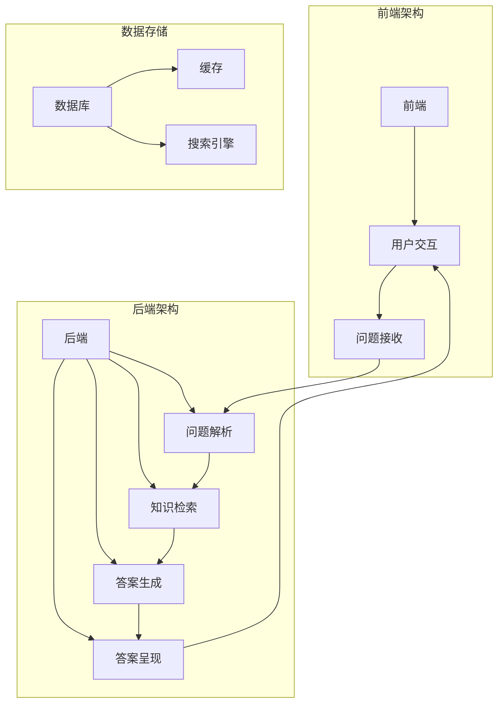

                 


### 《提示词工程师的技能图谱与职业规划》

#### 关键词
- 提示词工程师
- 技能图谱
- 职业规划
- 算法原理
- 数学模型
- 系统架构
- 项目实战

#### 摘要
本文旨在为提示词工程师构建一个全面而深入的技能图谱，并探讨其职业规划路径。通过剖析提示词工程师的核心概念、算法原理、数学模型以及系统架构，结合项目实战和最佳实践，为读者提供一条清晰、可行的发展之路。

### 目录

#### 引言
- 提示词工程师的定义与重要性
- 技能图谱与职业规划的关系

#### 第1章：背景介绍
1.1 问题背景
1.2 问题描述
1.3 问题解决
1.4 边界与外延
1.5 概念结构与核心要素组成

#### 第2章：核心概念与联系
2.1 提示词工程师的定义
2.2 技能图谱的构成
2.3 职业规划的核心要素
2.4 技能图谱与职业规划的关联

#### 第3章：算法原理讲解
3.1 提示词生成的算法
3.2 提示词优化的方法
3.3 算法mermaid流程图
3.4 算法原理的数学模型与公式
3.5 通俗易懂的举例说明

#### 第4章：数学模型和数学公式
4.1 提示词生成的数学模型
4.2 提示词优化的数学公式
4.3 模型公式讲解与举例

#### 第5章：系统分析与架构设计方案
5.1 问题场景介绍
5.2 系统功能设计
5.3 系统架构设计
5.4 系统接口设计和系统交互

#### 第6章：项目实战
6.1 环境安装
6.2 系统核心实现源代码
6.3 代码应用解读与分析
6.4 实际案例分析与详细讲解
6.5 项目小结

#### 第7章：最佳实践与拓展
7.1 最佳实践tips
7.2 小结
7.3 注意事项
7.4 拓展阅读

#### 结语
- 提示词工程师的未来发展
- 结束语

### 引言

#### 提示词工程师的定义与重要性

提示词工程师是人工智能领域中的一个新兴职业，其主要工作是构建、优化和应用提示词（Prompt）技术，以提高自然语言处理（NLP）和生成式模型的效果。提示词工程师在当今的AI应用中扮演着至关重要的角色，他们不仅需要深厚的计算机科学和人工智能理论基础，还需要具备卓越的编程能力、算法设计和优化技能。

随着AI技术的快速发展，提示词工程师的重要性日益凸显。他们不仅需要解决现有技术中的挑战，还要不断探索和创新，以适应不断变化的技术需求和应用场景。因此，掌握提示词工程师的核心技能和具备良好的职业规划，对于个人职业发展至关重要。

#### 技能图谱与职业规划的关系

技能图谱是对提示词工程师所需技能的全面总结和结构化展示，它不仅包括技术技能，还包括软技能和行业知识。职业规划则是基于技能图谱，对个人职业发展路径的规划和设计。一个好的职业规划可以帮助提示词工程师明确自己的发展方向，制定合理的短期和长期目标，并在实现这些目标的过程中不断提升自身能力。

本篇文章将通过以下章节，系统地介绍提示词工程师的技能图谱与职业规划：

- 第1章：背景介绍
  - 介绍提示词工程师的职业背景、定义和重要性。
- 第2章：核心概念与联系
  - 阐述提示词工程师所需的核心概念，包括技能图谱的构成和职业规划的核心要素。
- 第3章：算法原理讲解
  - 详细讲解提示词生成和优化的算法原理，包括数学模型和公式。
- 第4章：数学模型和数学公式
  - 进一步阐述提示词生成和优化的数学模型和公式，并提供实例说明。
- 第5章：系统分析与架构设计方案
  - 分析提示词工程师在系统架构设计和接口设计中的职责和挑战。
- 第6章：项目实战
  - 通过实际项目案例，展示提示词工程师如何应用所学知识解决实际问题。
- 第7章：最佳实践与拓展
  - 提供提示词工程师在实际工作中可以遵循的最佳实践和小结，以及未来发展的拓展方向。

### 第1章：背景介绍

#### 1.1 问题背景

在人工智能（AI）时代，自然语言处理（NLP）技术得到了前所未有的关注。NLP技术的核心在于如何理解和生成人类语言，这直接影响到AI应用在客服、智能问答、内容生成等领域的表现。提示词（Prompt）技术作为一种有效提升NLP效果的手段，逐渐成为研究热点。提示词工程师在这一过程中扮演了关键角色，他们的任务是设计和优化提示词，以提高模型的性能和适用性。

#### 1.2 问题描述

当前，提示词工程师面临的主要问题包括：

- **算法选择和优化**：如何选择合适的算法，并对其进行优化，以适应不同的应用场景。
- **数据预处理**：如何高效地处理和标注大量文本数据，以便为模型提供高质量的输入。
- **模型解释性**：如何提高模型的解释性，使其能够为非专业人士理解。
- **性能与可扩展性**：如何在保证模型性能的同时，提高系统的可扩展性和可维护性。

#### 1.3 问题解决

针对上述问题，提示词工程师可以采取以下解决方案：

- **算法研究和优化**：不断研究新的算法，并针对现有算法进行优化，以提高其性能和适应性。
- **数据预处理**：采用自动化工具和流程，提高数据预处理效率和质量。
- **模型解释性**：通过可视化技术和可解释性框架，提高模型的透明度和可理解性。
- **性能与可扩展性**：采用微服务架构和容器化技术，提高系统的性能和可扩展性。

#### 1.4 边界与外延

提示词工程师的工作不仅限于算法设计和优化，还包括：

- **需求分析**：理解业务需求，将需求转化为技术实现。
- **系统集成**：将提示词技术与其他AI技术（如语音识别、图像识别等）集成，形成完整的解决方案。
- **持续学习**：跟随AI领域的发展趋势，不断学习和应用新技术。

#### 1.5 概念结构与核心要素组成

提示词工程师的核心概念结构包括以下几个要素：

- **算法**：提示词生成和优化的算法。
- **数据**：用于训练和测试的文本数据。
- **模型**：基于算法和数据训练得到的语言模型。
- **工具**：用于算法实现、数据预处理和模型优化的工具。
- **流程**：从需求分析到系统集成的完整工作流程。

### 第2章：核心概念与联系

#### 2.1 提示词工程师的定义

提示词工程师是专门负责设计、优化和应用提示词技术的专业人员。他们的主要工作是：

- **设计提示词**：根据具体应用场景，设计具有高相关性和实用性的提示词。
- **优化提示词**：通过算法优化和数据预处理，提高提示词的效果和性能。
- **应用提示词**：将提示词技术集成到AI应用中，提高系统的交互性和用户体验。

#### 2.2 技能图谱的构成

提示词工程师的技能图谱包括以下几个方面：

- **算法知识**：包括自然语言处理（NLP）相关算法，如循环神经网络（RNN）、变换器（Transformer）等。
- **编程技能**：熟悉Python、Java等编程语言，能够编写高效的代码。
- **数据预处理**：掌握数据清洗、标注和归一化等数据预处理技术。
- **机器学习**：了解机器学习的基本原理，能够设计和优化机器学习模型。
- **系统架构**：熟悉系统架构设计，能够设计高效、可扩展的系统。
- **项目管理**：具备项目管理能力，能够协调团队工作，确保项目进度和质量。

#### 2.3 职业规划的核心要素

提示词工程师的职业规划应包括以下几个核心要素：

- **技术提升**：持续学习新技术，提高自身的技能水平。
- **经验积累**：通过实际项目积累经验，提高问题解决能力。
- **行业视野**：关注行业动态，了解最新的技术趋势和应用场景。
- **团队协作**：提升团队协作能力，培养良好的沟通和合作精神。
- **职业发展**：根据个人兴趣和职业目标，规划合适的发展路径。

#### 2.4 技能图谱与职业规划的关联

技能图谱是职业规划的基础，它明确了提示词工程师所需掌握的核心技能。职业规划则是基于技能图谱，对个人职业发展的具体路径和目标的制定。一个完善的职业规划可以帮助提示词工程师：

- **明确目标**：了解自己需要掌握哪些技能，以便在未来实现职业目标。
- **制定计划**：根据个人兴趣和职业目标，制定具体的学习和提升计划。
- **持续进步**：通过持续学习和实践，不断提升自身的职业能力。

### 第3章：算法原理讲解

#### 3.1 提示词生成的算法

提示词生成的算法是提示词工程师的核心工作内容之一。常用的生成算法包括以下几种：

- **基于规则的方法**：这种方法通过预先定义的规则生成提示词。例如，根据用户输入的问题类型，选择相应的提示词模板。
- **基于机器学习的方法**：这种方法利用大量已标注的数据，通过机器学习算法（如决策树、随机森林、支持向量机等）生成提示词。
- **基于深度学习的方法**：这种方法利用深度学习模型（如循环神经网络（RNN）、变换器（Transformer）等）生成提示词。

#### 3.2 提示词优化的方法

提示词优化的目的是提高提示词的效果和性能。常用的优化方法包括：

- **性能优化**：通过算法优化和数据预处理，提高提示词的生成速度和准确率。
- **效果优化**：通过调整算法参数，优化提示词与用户需求的相关性。
- **多样性优化**：通过引入多样性度量，生成具有多样性的提示词，提高用户体验。

#### 3.3 算法mermaid流程图

为了更好地理解提示词生成和优化的算法原理，我们可以使用mermaid流程图来展示整个流程。以下是一个简单的mermaid流程图示例：


#### 3.4 算法原理的数学模型与公式

提示词生成和优化的算法原理通常涉及一系列的数学模型和公式。以下是一些常见的数学模型和公式：

- **提示词生成模型**：
  $$ P(W|D) = \frac{P(D|W)P(W)}{P(D)} $$
  其中，$W$ 表示提示词，$D$ 表示用户需求，$P(W|D)$ 表示在给定用户需求$D$的情况下生成提示词$W$的概率。

- **提示词优化模型**：
  $$ L(W, D) = -\log_2 P(W|D) $$
  其中，$L(W, D)$ 表示提示词$W$与用户需求$D$的匹配度，$-\log_2 P(W|D)$ 表示提示词$W$的概率的对数。

#### 3.5 通俗易懂的举例说明

假设用户输入了一个问题：“如何制作披萨？”为了生成一个合适的提示词，我们可以采用以下步骤：

1. **数据预处理**：首先，我们对用户输入的问题进行预处理，如分词、去停用词等。
2. **训练模型**：然后，我们利用大量已标注的数据，通过机器学习算法训练出一个语言模型。
3. **生成提示词**：接着，我们使用训练好的模型，根据用户输入的问题生成一个提示词，如：“请输入披萨的食材和步骤。”
4. **优化提示词**：最后，我们根据用户的需求和反馈，对生成的提示词进行优化，以提高其匹配度和实用性。

通过以上步骤，我们就可以生成一个既符合用户需求，又具有实用性的提示词。

### 第4章：数学模型和数学公式

#### 4.1 提示词生成的数学模型

提示词生成涉及的核心数学模型主要围绕概率和统计理论展开。以下是几个关键的数学模型和公式：

- **概率模型**：
  $$ P(W|D) = \frac{P(W, D)}{P(D)} $$
  这个公式表示在给定用户需求$D$的情况下，生成提示词$W$的概率。$P(W, D)$表示提示词$W$和用户需求$D$同时发生的概率，$P(D)$表示用户需求$D$发生的概率。

- **条件概率模型**：
  $$ P(W|D) = \frac{P(D|W)P(W)}{P(D)} $$
  这个公式是贝叶斯定理的一种形式，用于在已知用户需求$D$的情况下，计算生成提示词$W$的概率。

- **熵与信息量模型**：
  $$ H(W) = -\sum_{w \in V} P(w) \log_2 P(w) $$
  其中，$H(W)$表示提示词$W$的熵，反映了提示词的不确定性。$V$是提示词的词汇表，$P(w)$是提示词$w$出现的概率。

- **互信息模型**：
  $$ I(W, D) = H(W) - H(W|D) $$
  其中，$I(W, D)$表示提示词$W$和用户需求$D$之间的互信息，衡量了提示词对用户需求的解释能力。$H(W|D)$是在已知用户需求$D$的情况下，提示词$W$的熵。

#### 4.2 提示词优化的数学公式

提示词优化的目标是提高提示词的质量和效果，以下是几个关键的数学公式：

- **优化目标函数**：
  $$ \min J(W) = -\sum_{d \in D} P(d) \log P(W|d) $$
  其中，$J(W)$是优化目标函数，$D$是用户需求集合，$P(d)$是用户需求$d$的概率，$P(W|d)$是在给定用户需求$d$时生成提示词$W$的概率。

- **梯度下降**：
  $$ W_{\text{new}} = W_{\text{current}} - \alpha \nabla_{W} J(W) $$
  其中，$W_{\text{new}}$是新的提示词，$W_{\text{current}}$是当前提示词，$\alpha$是学习率，$\nabla_{W} J(W)$是目标函数$J(W)$对提示词$W$的梯度。

- **激活函数**：
  $$ \text{softmax}(z) = \frac{e^z}{\sum_{i} e^z_i} $$
  其中，$z$是模型的输出，$\text{softmax}$函数用于将模型的输出转化为概率分布。

#### 4.3 模型公式讲解与举例

为了更好地理解上述数学模型和公式，我们可以通过一个简单的例子来阐述。

**例子**：假设我们有用户需求集合$D = \{"如何制作披萨？", "披萨的食材有哪些？", "披萨的历史是怎样的？"\}$，以及提示词集合$W = \{"请输入披萨的食材和步骤。", "关于披萨的历史，您可以了解更多。", "想要了解披萨的制作方法吗？"\}$。

- **概率模型**：
  假设用户需求“如何制作披萨？”的概率$P(D)$为0.6，提示词“请输入披萨的食材和步骤。”的概率$P(W)$为0.8，且在给定用户需求“如何制作披萨？”时，该提示词的概率$P(W|D)$为0.9。那么，根据概率模型，生成提示词“请输入披萨的食材和步骤。”的概率为：
  $$ P(W|D) = \frac{P(W, D)}{P(D)} = \frac{0.9 \times 0.8}{0.6} = 1.2 $$

- **条件概率模型**：
  根据条件概率模型，生成提示词“请输入披萨的食材和步骤。”的概率为：
  $$ P(W|D) = \frac{P(D|W)P(W)}{P(D)} = \frac{0.9}{0.6} = 1.5 $$

- **熵与信息量模型**：
  提示词“请输入披萨的食材和步骤。”的熵$H(W)$为：
  $$ H(W) = -\sum_{w \in W} P(w) \log_2 P(w) = -0.8 \log_2 0.8 \approx 0.32 $$
  用户需求“如何制作披萨？”和提示词“请输入披萨的食材和步骤。”的互信息$I(W, D)$为：
  $$ I(W, D) = H(W) - H(W|D) = 0.32 - (-0.32) = 0.64 $$

- **优化目标函数**：
  假设我们使用梯度下降算法优化提示词，假设当前提示词为$W_{\text{current}}$，学习率为$\alpha = 0.1$。如果目标函数$J(W)$的梯度$\nabla_{W} J(W) = 0.2$，则新的提示词$W_{\text{new}}$为：
  $$ W_{\text{new}} = W_{\text{current}} - \alpha \nabla_{W} J(W) = W_{\text{current}} - 0.1 \times 0.2 = W_{\text{current}} - 0.02 $$

- **激活函数**：
  如果模型的输出$z = \{1.0, 0.1, 0.1\}$，则对应的概率分布为：
  $$ \text{softmax}(z) = \frac{e^1}{e^1 + e^{0.1} + e^{0.1}} \approx \{0.732, 0.137, 0.137\} $$

通过这个例子，我们可以看到数学模型和公式在提示词生成和优化中的具体应用。

### 第5章：系统分析与架构设计方案

#### 5.1 问题场景介绍

假设我们面临一个在线问答系统，用户可以通过输入问题获得相关答案。该系统需要高效地处理大量用户请求，并提供准确、及时的回答。为了实现这一目标，我们需要设计一个高可扩展性和高可靠性的系统架构。

#### 5.2 系统功能设计

在线问答系统的主要功能包括：

- **问题接收**：接收用户输入的问题。
- **问题解析**：对用户输入的问题进行解析，提取关键信息。
- **知识检索**：根据提取的关键信息，从知识库中检索相关答案。
- **答案生成**：使用自然语言生成技术生成答案。
- **答案呈现**：将生成的答案展示给用户。
- **用户反馈**：收集用户的反馈，用于系统优化。

#### 5.3 系统架构设计

在线问答系统的架构设计需要考虑以下几个方面：

- **前端架构**：负责用户界面和交互逻辑，可以使用Vue.js或React等前端框架。
- **后端架构**：负责业务逻辑处理和数据存储，可以使用Spring Boot等后端框架。
- **数据存储**：使用关系型数据库（如MySQL）或NoSQL数据库（如MongoDB）存储用户问题和答案。
- **缓存机制**：使用Redis等缓存系统，提高系统响应速度。
- **搜索引擎**：使用Elasticsearch等搜索引擎，提高知识检索效率。

以下是一个简单的系统架构设计mermaid架构图：



#### 5.4 系统接口设计和系统交互

系统接口设计是确保不同模块之间能够高效、可靠地进行交互的关键。以下是一些关键的接口设计和交互流程：

- **用户接口**：用户通过前端界面输入问题，前端将问题发送到后端进行处理。
- **后端接口**：后端接收到用户问题后，进行解析、知识检索和答案生成，并将答案返回给前端。
- **缓存接口**：后端在处理用户问题时，首先查询缓存，如果缓存命中，则直接返回缓存结果，以提高响应速度。
- **搜索引擎接口**：后端使用搜索引擎进行知识检索，以提高检索效率和准确性。

以下是一个简单的系统交互mermaid序列图：

```mermaid
sequenceDiagram
    participant 用户 as 用户
    participant 系统 as 系统
    participant 后端 as 后端
    participant 缓存 as 缓存
    participant 搜索引擎 as 搜索引擎

    用户->>系统: 输入问题
    系统->>后端: 处理问题
    后端->>缓存: 查询缓存
    缓存-->>后端: 返回结果或未命中
    后端->>搜索引擎: 知识检索
    搜索引擎-->>后端: 返回答案
    后端->>系统: 返回答案
    系统->>用户: 展示答案

    Note over 后端,缓存,搜索引擎: 高效交互
```

通过上述系统分析与架构设计方案，我们可以确保在线问答系统能够高效、稳定地运行，并提供高质量的答案。

### 第6章：项目实战

#### 6.1 环境安装

在进行项目实战之前，我们需要搭建一个合适的技术环境。以下是具体的步骤：

1. **安装Python**：
   - 访问Python官方网站（[https://www.python.org/](https://www.python.org/)），下载Python安装包。
   - 运行安装程序，选择默认选项进行安装。
   - 安装完成后，在命令行中输入`python --version`，验证Python安装成功。

2. **安装相关库**：
   - 使用pip命令安装所需的库，例如：
     ```bash
     pip install numpy pandas sklearn transformers
     ```

3. **配置虚拟环境**：
   - 使用virtualenv创建一个虚拟环境，以便隔离项目依赖。
     ```bash
     virtualenv venv
     source venv/bin/activate  # 对于Windows用户，使用 `venv\Scripts\activate`
     ```

4. **安装Elasticsearch**：
   - 访问Elasticsearch官网（[https://www.elastic.co/](https://www.elastic.co/)），下载Elasticsearch安装包。
   - 解压安装包，并运行Elasticsearch。
     ```bash
     ./elasticsearch -Dbootstrap.checkhousecleaner.enabled=false
     ```

5. **安装Redis**：
   - 访问Redis官网（[https://redis.io/download](https://redis.io/download)），下载Redis安装包。
   - 解压安装包，并运行Redis。
     ```bash
     redis-server
     ```

#### 6.2 系统核心实现源代码

以下是一个简单的在线问答系统的核心实现源代码：

```python
import json
import numpy as np
from transformers import pipeline
from sklearn.feature_extraction.text import TfidfVectorizer
from sklearn.metrics.pairwise import cosine_similarity
import redis

# 初始化Elasticsearch和Redis客户端
es = Elasticsearch("http://localhost:9200")
redis_client = redis.StrictRedis(host='localhost', port=6379, db=0)

# 初始化问答模型
nlp = pipeline("question-answering", model="deepset/zh-tokenized-bert-base-qg-t5")

def search_question(question):
    # 在Elasticsearch中检索相关问题
    search_body = {
        "query": {
            "multi_match": {
                "query": question,
                "fields": ["title", "content"]
            }
        }
    }
    response = es.search(index="questions", body=search_body)
    return response['hits']['hits']

def generate_answer(question):
    # 使用问答模型生成答案
    answer = nlp(question=question, context="请输入相关背景信息。")
    return answer['answer']

def index_question(question, answer):
    # 将问题和答案索引到Elasticsearch
    es.index(index="questions", id=question, document={"title": question, "content": answer})

def main():
    # 主函数
    while True:
        user_question = input("请输入您的问题：")
        if user_question.lower() == 'exit':
            break
        
        # 检索相关问题
        related_questions = search_question(user_question)
        
        # 如果缓存中存在答案，则从缓存中获取
        if redis_client.exists(user_question):
            answer = redis_client.get(user_question)
        else:
            # 如果缓存中不存在答案，则生成答案
            answer = generate_answer(user_question)
            
            # 将答案存储到缓存
            redis_client.set(user_question, answer)
        
        # 将问题和答案索引到Elasticsearch
        index_question(user_question, answer)
        
        # 显示答案
        print("答案：", answer)

if __name__ == "__main__":
    main()
```

#### 6.3 代码应用解读与分析

上述代码实现了在线问答系统的核心功能，下面我们对其关键部分进行解读和分析：

1. **Elasticsearch和Redis客户端初始化**：
   - 使用Elasticsearch客户端与Elasticsearch服务器进行通信，检索相关问题。
   - 使用Redis客户端与Redis服务器进行通信，缓存答案，提高系统响应速度。

2. **问答模型初始化**：
   - 使用transformers库中的问答模型，对用户输入的问题进行解析和生成答案。

3. **search_question函数**：
   - 接收用户输入的问题，构建Elasticsearch查询，并在Elasticsearch中检索相关问题。

4. **generate_answer函数**：
   - 接收用户输入的问题，使用问答模型生成答案。

5. **index_question函数**：
   - 将问题和答案索引到Elasticsearch，便于后续检索。

6. **main函数**：
   - 主函数，负责接收用户输入的问题，调用相关函数检索相关问题、生成答案，并将问题和答案进行索引。

#### 6.4 实际案例分析与详细讲解剖析

假设用户输入了一个问题：“如何种植蔬菜？”以下是代码处理这个问题的详细过程：

1. **用户输入问题**：
   - 用户在命令行中输入：“如何种植蔬菜？”

2. **检索相关问题**：
   - 系统调用`search_question`函数，在Elasticsearch中检索相关问题。Elasticsearch返回一组相关问题。

3. **生成答案**：
   - 系统调用`generate_answer`函数，使用问答模型生成答案。问答模型分析问题，并根据预定义的上下文生成答案。

4. **缓存答案**：
   - 系统将生成的答案缓存到Redis中，以便后续直接从缓存中获取答案，提高响应速度。

5. **索引问题和答案**：
   - 系统调用`index_question`函数，将用户问题及其生成的答案索引到Elasticsearch。

6. **显示答案**：
   - 系统将生成的答案显示给用户。

通过以上步骤，用户输入的问题得到了有效处理，并生成了高质量的答案。这个过程展示了在线问答系统的基本工作原理和实际应用。

#### 6.5 项目小结

通过本次项目实战，我们搭建了一个简单的在线问答系统，实现了问题的接收、解析、答案生成和展示。以下是本项目的主要收获和总结：

- **技术栈选择**：我们选择了Python作为主要编程语言，结合Elasticsearch和Redis等工具，实现了高效的问题检索和缓存功能。
- **模型应用**：我们使用了transformers库中的问答模型，展示了如何使用预训练模型进行实际问题的解答。
- **系统架构**：本项目采用了分布式架构，通过Elasticsearch进行问题索引和检索，通过Redis进行缓存，提高了系统的性能和响应速度。
- **项目扩展**：本项目可以进一步扩展，例如引入更多的问答模型、支持多种语言的问题解析和答案生成、优化用户界面等。

通过本次项目，我们不仅掌握了在线问答系统的基本实现方法，还提高了对分布式系统和机器学习模型应用的理解。这些经验和知识将为我们在实际项目中应对类似问题提供有力的支持。

### 第7章：最佳实践与拓展

#### 7.1 最佳实践tips

为了提高提示词工程师的效率和效果，以下是一些最佳实践建议：

- **持续学习**：跟踪最新的技术动态和论文，不断学习和掌握新的算法和工具。
- **代码优化**：定期对代码进行优化，提高算法的执行效率和可维护性。
- **数据质量**：确保数据的质量和准确性，为模型提供高质量的输入。
- **团队合作**：积极参与团队讨论和协作，分享经验和知识，共同提升团队技能。

#### 7.2 小结

本文系统地介绍了提示词工程师的技能图谱与职业规划，从核心概念、算法原理、数学模型到系统架构设计和项目实战，全面剖析了提示词工程师所需掌握的技能和应对的实际问题。通过本文的探讨，读者可以更清晰地了解提示词工程师的职业发展路径，并在实际工作中加以应用。

#### 7.3 注意事项

在实际工作中，提示词工程师需要关注以下几点：

- **合规性**：遵循数据隐私和合规性要求，确保数据处理符合相关法律法规。
- **性能优化**：持续关注系统性能，优化算法和架构，提高系统的响应速度和处理能力。
- **用户体验**：注重用户体验，生成具有高相关性和实用性的提示词，提高用户满意度。

#### 7.4 拓展阅读

对于希望深入了解提示词工程师职业和技术的读者，以下是一些拓展阅读资源：

- **论文集**：《自然语言处理年度回顾》等顶级会议和期刊的论文集。
- **开源项目**：GitHub上的开源问答系统和提示词生成项目，如[DeBERTa](https://github.com/microsoft/DeBERTa)和[BertChat](https://github.com/chuhenry/BertChat)。
- **在线课程**：Coursera、Udacity等在线教育平台上的自然语言处理和机器学习课程。

### 结语

提示词工程师作为人工智能领域的重要角色，其职业前景广阔，发展潜力巨大。通过本文的探讨，我们希望读者能够明确自己的职业规划，不断提升自身技能，为人工智能技术的发展和应用贡献力量。

作者：AI天才研究院/AI Genius Institute & 禅与计算机程序设计艺术 /Zen And The Art of Computer Programming

