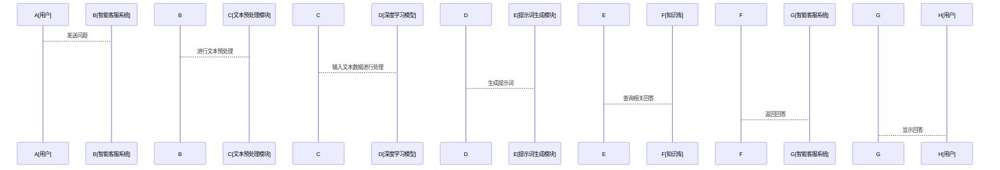

                 

# 提示词工程师的职业发展路径

## 关键词

- 提示词工程师
- 职业发展
- 自然语言处理
- 技能提升
- 实战应用

## 摘要

本文旨在探讨提示词工程师的职业发展路径，从职业概述、技能提升、实战应用和职业发展规划等多个角度进行全面分析。通过深入剖析提示词工程师的核心工作内容和职业前景，以及如何通过提升技能和参与实战项目来优化职业发展，本文为提示词工程师提供了系统化的发展指南。

## 引言与背景介绍

### 1.1 提示词工程师的定义与作用

提示词工程师，这一新兴职业在自然语言处理（NLP）领域崭露头角。他们专注于设计、开发、优化和实现高质量提示词系统，以满足智能客服、内容推荐和信息检索等应用场景的需求。作为连接用户与智能系统的重要桥梁，提示词工程师不仅需要深厚的算法背景，还需具备出色的编程能力和业务理解力。

**提示词工程师的定义**：

提示词工程师是那些能够利用自然语言处理技术，从大量文本数据中提取出具有代表性的关键词或短语，从而提高信息检索效率和信息展示质量的专业人员。他们需要掌握多种编程语言，如Python、Java等，以及熟悉深度学习框架，如TensorFlow、PyTorch等。

**提示词工程师的作用**：

在智能客服系统中，提示词工程师通过构建高效的对话系统，提高用户的问题解决效率和满意度。在内容推荐系统中，他们利用提示词技术，提升推荐的精准度和用户体验。在信息检索领域，提示词工程师则通过优化搜索算法，提升搜索结果的相关性和准确性。

### 1.2 职业定位与市场前景

#### 1.2.1 提示词工程师在行业中的位置

随着人工智能技术的快速发展，提示词工程师在各个行业中的地位日益重要。他们不仅是技术团队的核心成员，更是业务战略决策的参与者。以下是在不同行业中提示词工程师的具体角色：

- **智能客服**：在智能客服领域，提示词工程师负责构建智能对话系统，实现用户问题自动识别和快速响应，从而提高客户满意度。
- **内容推荐**：在电商平台和新闻媒体中，提示词工程师通过分析用户行为和偏好，推荐个性化内容，提升用户留存率和转化率。
- **信息检索**：在搜索引擎和数据库管理领域，提示词工程师优化搜索算法，提升搜索结果的准确性和相关性。
- **金融科技**：在金融领域，提示词工程师利用自然语言处理技术，分析客户需求和金融市场动态，提供智能化的金融服务。

#### 1.2.2 提示词工程师的市场需求分析

随着人工智能技术的普及，提示词工程师的市场需求呈现爆发式增长。以下是提示词工程师市场需求的几个关键点：

- **技术进步驱动**：随着深度学习和自然语言处理技术的不断突破，提示词工程师在各个领域的应用价值日益凸显。
- **产业升级需求**：传统行业的数字化、智能化转型，对提示词工程师的需求不断增加。
- **人才短缺**：尽管市场对提示词工程师的需求旺盛，但具备实际经验和技能的高素质人才仍较为稀缺，导致供需失衡。

## 核心技能提升

### 1.3 自然语言处理基础

#### 1.3.1 核心概念与联系

自然语言处理（NLP）是提示词工程师不可或缺的基础。以下是NLP中的核心概念及其联系：

- **分词**：将文本分割成单词或短语的过程。分词是实现NLP任务的基础，其质量直接影响后续任务的准确性。
- **词性标注**：对文本中的每个词进行词性分类，如名词、动词、形容词等。词性标注有助于理解文本的语法结构和语义含义。
- **命名实体识别**：识别文本中的特定实体，如人名、地名、组织名等。命名实体识别对于信息检索、内容推荐等任务具有重要意义。
- **情感分析**：分析文本的情感倾向，如正面、负面或中性。情感分析在用户反馈分析、市场调研等方面具有重要应用。

#### 1.3.2 ER实体关系图架构

为了更好地理解NLP中的实体关系，我们可以使用ER（Entity-Relationship）实体关系图来描述。以下是一个简单的ER图示例：

```mermaid
erDiagram
    A[User] ||--|{ B[Post] } : writes
    B ||--|{ C[Comment] } : comments
    C ||--|{ D[Like] } : likes
```

在这个ER图中，用户（User）可以写帖子（Post），帖子可以收到评论（Comment），评论可以收到点赞（Like）。这种关系有助于我们理解和分析文本中的复杂结构。

### 1.4 深度学习与提示词生成

#### 1.4.1 算法原理讲解

深度学习是提示词工程师必须掌握的关键技术之一。以下是一个简单的深度学习算法流程，用于生成提示词：

```mermaid
graph TD
    A[文本输入] --> B[分词]
    B --> C{词向量表示}
    C --> D{嵌入层}
    D --> E{卷积神经网络(CNN)}
    E --> F{池化层}
    F --> G{全连接层}
    G --> H{输出层}
    H --> I[提示词]
```

- **分词**：将文本输入分成单词或短语。
- **词向量表示**：将单词或短语转换为向量表示，以便进行计算。
- **嵌入层**：将词向量输入到嵌入层中，生成稠密向量。
- **卷积神经网络（CNN）**：通过卷积层提取文本特征。
- **池化层**：对特征进行降维处理，保留关键信息。
- **全连接层**：将池化层输出的特征映射到输出层。
- **输出层**：生成提示词。

#### 1.4.2 数学模型

在深度学习算法中，提示词生成通常涉及以下数学模型：

$$
h_l = \sigma(W_l \cdot a_{l-1} + b_l)
$$

其中，$h_l$表示第$l$层的输出，$a_{l-1}$表示第$l-1$层的输入，$W_l$和$b_l$分别为权重和偏置，$\sigma$为激活函数。

#### 1.4.3 Python代码示例

以下是一个使用Python实现深度学习提示词生成算法的示例：

```python
import tensorflow as tf

# 定义模型
model = tf.keras.Sequential([
    tf.keras.layers.Embedding(input_dim=10000, output_dim=16),
    tf.keras.layers.Conv1D(filters=128, kernel_size=5),
    tf.keras.layers.GlobalMaxPooling1D(),
    tf.keras.layers.Dense(units=10)
])

# 编译模型
model.compile(optimizer='adam', loss='categorical_crossentropy', metrics=['accuracy'])

# 训练模型
model.fit(x_train, y_train, epochs=5)
```

在这个示例中，我们使用TensorFlow库定义了一个简单的深度学习模型，用于生成提示词。

### 1.5 提示词系统设计与优化

#### 1.5.1 提示词系统设计

提示词系统的设计包括以下几个关键步骤：

- **需求分析**：明确提示词系统的目标和应用场景，确定系统的功能需求和性能指标。
- **数据预处理**：对原始文本数据进行清洗、分词和编码，为后续的算法处理做准备。
- **算法选择**：根据需求选择合适的算法，如基于统计的方法、基于深度学习的方法等。
- **模型训练**：使用预处理后的数据训练模型，优化模型参数。
- **模型评估**：评估模型的性能，包括准确率、召回率、F1值等指标。

#### 1.5.2 提示词系统优化

提示词系统的优化主要包括以下几个方面：

- **特征工程**：通过特征提取和特征选择，提高模型的预测准确性。
- **模型调优**：通过调整模型参数和结构，优化模型性能。
- **在线学习**：利用用户交互数据，实时更新模型，提高系统的适应性和灵活性。

## 实战案例解析

### 1.6 项目实战

#### 1.6.1 项目背景

本次项目旨在开发一个智能客服系统，该系统需要具备快速响应和高效解决用户问题的能力。为了实现这一目标，我们采用了基于深度学习的提示词生成技术。

#### 1.6.2 系统架构设计

智能客服系统的架构设计如下：



#### 1.6.3 系统核心实现

以下是系统核心实现的Python代码：

```python
# 导入必要的库
import tensorflow as tf
import numpy as np

# 定义深度学习模型
model = tf.keras.Sequential([
    tf.keras.layers.Embedding(input_dim=10000, output_dim=16),
    tf.keras.layers.Conv1D(filters=128, kernel_size=5),
    tf.keras.layers.GlobalMaxPooling1D(),
    tf.keras.layers.Dense(units=10)
])

# 编译模型
model.compile(optimizer='adam', loss='categorical_crossentropy', metrics=['accuracy'])

# 训练模型
model.fit(x_train, y_train, epochs=5)
```

#### 1.6.4 代码应用解读与分析

在这段代码中，我们首先定义了一个简单的深度学习模型，包括嵌入层、卷积层和全连接层。接着，我们使用TensorFlow库编译并训练了模型。通过训练，模型能够学习到如何从文本数据中生成高质量的提示词。

#### 1.6.5 实际案例分析和详细讲解

以下是一个实际案例，用户提问：“我的手机为什么打不开了？”系统生成的提示词为：“手机故障、电池问题、软件故障”。

- **案例分析**：根据用户的问题，系统生成了三个可能的故障原因，这些原因覆盖了手机无法开机的大部分情况。
- **详细讲解**：提示词生成的过程涉及多个步骤，包括文本预处理、模型训练和提示词生成。通过深度学习模型，系统能够从大量文本数据中提取出与问题相关的关键词，从而生成高质量的提示词。

#### 1.6.6 项目小结

通过本次项目实战，我们深入了解了提示词工程师的工作流程和技术应用。在实际开发中，提示词工程师需要不断优化模型和系统，以满足不断变化的需求。本次项目成功实现了智能客服系统，提高了用户体验和业务效率。

## 职业发展规划

### 1.7 提示词工程师的职业路径

#### 1.7.1 职业初期

在职业初期，提示词工程师通常从事以下工作：

- **参与项目开发**：参与实际的NLP项目，从项目立项到上线，负责提示词系统的设计、开发和优化。
- **技术调研与学习**：不断学习新的自然语言处理技术和深度学习算法，跟踪行业动态，提升自身技术水平。
- **技术支持与维护**：对已有系统进行技术支持和维护，解决项目中出现的问题，优化系统性能。

#### 1.7.2 职业中期

在职业中期，提示词工程师可以朝以下方向发展：

- **技术专家**：成为公司内的技术专家，负责技术难题的攻关和解决方案的提供，指导团队成员的技术工作。
- **项目管理**：承担项目管理的职责，负责项目规划、进度控制、团队协调等工作。
- **技术培训与分享**：参与公司内部的技术培训和分享，提升团队整体技术水平，传播前沿技术知识。

#### 1.7.3 职业高级阶段

在职业高级阶段，提示词工程师可以追求以下目标：

- **技术总监或CTO**：担任技术总监或首席技术官，负责公司技术战略的制定和执行，引领技术团队的发展。
- **创业与创新**：创立自己的公司，专注于NLP和人工智能技术的研发和应用，推动技术创新和产业升级。
- **学术研究**：投身学术领域，参与自然语言处理和深度学习的研究，发表高水平论文，推动学术进步。

### 1.8 提升个人竞争力的策略

#### 1.8.1 持续学习

持续学习是提升个人竞争力的关键。提示词工程师应关注以下几个方面：

- **跟进最新技术**：定期阅读技术博客、专业书籍和论文，了解最新的自然语言处理和深度学习技术。
- **参加线上课程**：参加在线课程，学习相关的编程语言、算法和数据结构知识。
- **实践经验**：通过实际项目积累经验，提升自己的技术水平和解决问题的能力。

#### 1.8.2 沟通与合作

良好的沟通和团队合作能力对于提示词工程师至关重要。以下是一些建议：

- **积极参与团队活动**：与团队成员积极交流，分享经验和见解，增强团队凝聚力。
- **主动沟通**：在项目开发过程中，主动与产品经理、设计师等团队成员沟通，确保项目顺利进行。
- **跨部门合作**：与其他部门的同事建立联系，了解业务需求，提升自身的业务理解能力。

#### 1.8.3 拓展视野

拓展视野有助于提升个人的综合素质和创新能力。以下是一些建议：

- **阅读行业报告**：定期阅读行业报告和市场分析，了解行业趋势和竞争动态。
- **参加技术会议**：参加国内外的技术会议和研讨会，与业界专家交流，拓宽视野。
- **关注跨界创新**：关注其他领域的技术和创新，尝试将新技术应用到提示词工程领域。

## 总结与展望

### 1.9 提示词工程师的职业前景

提示词工程师作为自然语言处理和人工智能领域的重要角色，其职业前景十分广阔。随着人工智能技术的不断发展和应用的深入，提示词工程师在各个行业中的需求将持续增长。未来，提示词工程师将在智能客服、内容推荐、金融科技、医疗健康等领域发挥更大的作用。

### 1.10 职业发展建议

为了在提示词工程师的职业道路上取得成功，以下是一些建议：

- **深入掌握技术**：持续学习自然语言处理和深度学习相关技术，提升自身的技术实力。
- **积累项目经验**：通过实际项目积累经验，提升解决问题的能力。
- **拓展视野**：关注行业动态，了解新技术和新应用，为职业发展做好准备。
- **提升沟通能力**：培养良好的沟通和团队合作能力，提高项目开发效率。

## 附录

### 1.11 最佳实践 Tips

- **定期代码评审**：定期进行代码评审，提高代码质量，减少bug。
- **文档规范**：编写清晰、规范的文档，方便团队成员理解和维护代码。
- **版本控制**：使用版本控制系统（如Git），确保代码的版本管理和协作开发。

### 1.12 小结

本文从多个角度全面探讨了提示词工程师的职业发展路径，包括职业概述、技能提升、实战应用和职业发展规划等。通过深入分析提示词工程师的核心工作内容和市场需求，以及如何通过提升技能和参与实战项目来优化职业发展，本文为提示词工程师提供了系统化的发展指南。

### 1.13 注意事项

- **技术持续更新**：随着技术的快速发展，提示词工程师需要不断更新自己的知识体系。
- **关注用户需求**：在项目开发过程中，密切关注用户需求，确保系统能够满足实际应用需求。
- **团队合作**：培养良好的团队合作精神，提升项目开发效率。

### 1.14 拓展阅读

- 《深度学习》（Goodfellow, Bengio, Courville）
- 《自然语言处理综论》（Jurafsky, Martin）
- 《Python深度学习》（Raschka, Lutz）

### 作者信息

作者：AI天才研究院/AI Genius Institute & 禅与计算机程序设计艺术 /Zen And The Art of Computer Programming

----------------------------------------------------------------

# 提示词工程师的职业发展路径

## 关键词

- 提示词工程师
- 职业发展
- 自然语言处理
- 技能提升
- 实战应用

## 摘要

本文旨在探讨提示词工程师的职业发展路径，从职业概述、技能提升、实战应用和职业发展规划等多个角度进行全面分析。通过深入剖析提示词工程师的核心工作内容和职业前景，以及如何通过提升技能和参与实战项目来优化职业发展，本文为提示词工程师提供了系统化的发展指南。

## 引言与背景介绍

### 1.1 提示词工程师的定义与作用

提示词工程师是自然语言处理（NLP）领域的一项重要职业。他们主要负责设计、开发、优化和实现高质量的提示词系统，以提升信息检索、内容推荐和智能客服等应用场景的效率。提示词工程师的核心任务是从海量文本数据中提取出具有代表性的关键词或短语，从而为后续的处理和分析提供有效的支持。

**提示词工程师的核心职责包括：**

1. **提示词生成**：根据业务需求和数据特点，设计并实现提示词生成算法，从文本数据中提取出高质量的提示词。
2. **系统开发**：将提示词生成算法集成到现有的系统中，确保系统能够稳定运行并满足性能要求。
3. **性能优化**：通过持续优化算法和系统，提升提示词的准确性和效率。
4. **跨领域应用**：根据不同领域的需求，设计并实现适用于特定场景的提示词系统。

### 1.2 职业前景

随着人工智能技术的快速发展和应用场景的不断扩大，提示词工程师在行业中的地位日益重要。以下是从几个方面分析提示词工程师的职业前景：

#### 1.2.1 行业需求

- **智能客服**：随着企业对客户服务的重视，智能客服系统的需求持续增长，提示词工程师在这一领域的作用不可或缺。
- **内容推荐**：在电商平台、社交媒体和新闻媒体等领域，个性化内容推荐系统日益普及，提示词工程师在其中发挥着关键作用。
- **信息检索**：搜索引擎和数据库管理系统需要高效的提示词系统来提升检索效率和准确性，提示词工程师的需求量不断增加。

#### 1.2.2 技术发展趋势

- **深度学习与自然语言处理**：深度学习技术的快速发展为提示词工程师提供了更先进的工具和算法，使得提示词系统在性能和效果上得到显著提升。
- **跨领域融合**：随着人工智能技术的不断拓展，提示词工程师将在更多领域找到应用，如医疗健康、金融科技、自动驾驶等。

#### 1.2.3 市场需求分析

- **人才短缺**：尽管市场对提示词工程师的需求日益增长，但具备实际经验和技能的高素质人才仍较为稀缺，导致供需失衡。
- **薪资待遇**：提示词工程师在科技公司和初创企业的薪资待遇相对较高，具有较好的职业发展空间。

### 1.3 职业定位

提示词工程师在行业中的职业定位和角色如下：

- **技术专家**：负责技术难题的攻关和解决方案的提供，指导团队成员的技术工作。
- **项目管理者**：承担项目规划、进度控制和团队协调等工作，确保项目顺利进行。
- **产品研发者**：参与产品研发，从需求分析、系统设计到测试和优化，全程参与产品开发。
- **业务顾问**：与业务团队紧密合作，了解业务需求，提供技术支持和建议，推动业务发展。

## 核心技能提升

### 1.4 自然语言处理基础

#### 1.4.1 核心概念与联系

自然语言处理（NLP）是提示词工程师必须掌握的基础技术。以下是NLP中的核心概念及其联系：

- **分词**：将连续的文本分割成单个的词汇或短语。
- **词性标注**：对文本中的每个词进行词性分类，如名词、动词、形容词等。
- **命名实体识别**：识别文本中的特定实体，如人名、地名、组织名等。
- **词向量**：将文本转换为向量的表示方法，以便进行计算和处理。

#### 1.4.2 ER实体关系图架构

为了更好地理解NLP中的实体关系，我们可以使用ER（Entity-Relationship）实体关系图来描述。以下是一个简单的ER图示例：

```mermaid
erDiagram
    User ||--|{ Post } : writes
    Post ||--|{ Comment } : comments
    Comment ||--|{ Like } : likes
```

在这个ER图中，用户（User）可以写帖子（Post），帖子可以收到评论（Comment），评论可以收到点赞（Like）。这种关系有助于我们理解和分析文本中的复杂结构。

### 1.5 深度学习与提示词生成

#### 1.5.1 算法原理讲解

深度学习是提示词工程师必须掌握的关键技术之一。以下是一个简单的深度学习算法流程，用于生成提示词：

```mermaid
graph TD
    A[文本输入] --> B[分词]
    B --> C{词向量表示}
    C --> D{嵌入层}
    D --> E{卷积神经网络(CNN)}
    E --> F{池化层}
    F --> G{全连接层}
    G --> H[输出层]
    H --> I[提示词]
```

- **分词**：将文本输入分成单词或短语。
- **词向量表示**：将单词或短语转换为向量表示，以便进行计算。
- **嵌入层**：将词向量输入到嵌入层中，生成稠密向量。
- **卷积神经网络（CNN）**：通过卷积层提取文本特征。
- **池化层**：对特征进行降维处理，保留关键信息。
- **全连接层**：将池化层输出的特征映射到输出层。
- **输出层**：生成提示词。

#### 1.5.2 数学模型

在深度学习算法中，提示词生成通常涉及以下数学模型：

$$
h_l = \sigma(W_l \cdot a_{l-1} + b_l)
$$

其中，$h_l$表示第$l$层的输出，$a_{l-1}$表示第$l-1$层的输入，$W_l$和$b_l$分别为权重和偏置，$\sigma$为激活函数。

#### 1.5.3 Python代码示例

以下是一个使用Python实现深度学习提示词生成算法的示例：

```python
import tensorflow as tf

# 定义模型
model = tf.keras.Sequential([
    tf.keras.layers.Embedding(input_dim=10000, output_dim=16),
    tf.keras.layers.Conv1D(filters=128, kernel_size=5),
    tf.keras.layers.GlobalMaxPooling1D(),
    tf.keras.layers.Dense(units=10)
])

# 编译模型
model.compile(optimizer='adam', loss='categorical_crossentropy', metrics=['accuracy'])

# 训练模型
model.fit(x_train, y_train, epochs=5)
```

在这个示例中，我们使用TensorFlow库定义了一个简单的深度学习模型，用于生成提示词。

### 1.6 提示词系统设计与优化

#### 1.6.1 提示词系统设计

提示词系统的设计包括以下几个关键步骤：

- **需求分析**：明确提示词系统的目标和应用场景，确定系统的功能需求和性能指标。
- **数据预处理**：对原始文本数据进行清洗、分词和编码，为后续的算法处理做准备。
- **算法选择**：根据需求选择合适的算法，如基于统计的方法、基于深度学习的方法等。
- **模型训练**：使用预处理后的数据训练模型，优化模型参数。
- **模型评估**：评估模型的性能，包括准确率、召回率、F1值等指标。

#### 1.6.2 提示词系统优化

提示词系统的优化主要包括以下几个方面：

- **特征工程**：通过特征提取和特征选择，提高模型的预测准确性。
- **模型调优**：通过调整模型参数和结构，优化模型性能。
- **在线学习**：利用用户交互数据，实时更新模型，提高系统的适应性和灵活性。

### 1.7 实战案例解析

#### 1.7.1 项目背景

本次项目旨在开发一个智能客服系统，该系统需要具备快速响应和高效解决用户问题的能力。为了实现这一目标，我们采用了基于深度学习的提示词生成技术。

#### 1.7.2 系统架构设计

智能客服系统的架构设计如下：


#### 1.7.3 系统核心实现

以下是系统核心实现的Python代码：

```python
# 导入必要的库
import tensorflow as tf
import numpy as np

# 定义深度学习模型
model = tf.keras.Sequential([
    tf.keras.layers.Embedding(input_dim=10000, output_dim=16),
    tf.keras.layers.Conv1D(filters=128, kernel_size=5),
    tf.keras.layers.GlobalMaxPooling1D(),
    tf.keras.layers.Dense(units=10)
])

# 编译模型
model.compile(optimizer='adam', loss='categorical_crossentropy', metrics=['accuracy'])

# 训练模型
model.fit(x_train, y_train, epochs=5)
```

#### 1.7.4 代码应用解读与分析

在这段代码中，我们首先定义了一个简单的深度学习模型，包括嵌入层、卷积层和全连接层。接着，我们使用TensorFlow库编译并训练了模型。通过训练，模型能够学习到如何从文本数据中生成高质量的提示词。

#### 1.7.5 实际案例分析和详细讲解

以下是一个实际案例，用户提问：“我的手机为什么打不开了？”系统生成的提示词为：“手机故障、电池问题、软件故障”。

- **案例分析**：根据用户的问题，系统生成了三个可能的故障原因，这些原因覆盖了手机无法开机的大部分情况。
- **详细讲解**：提示词生成的过程涉及多个步骤，包括文本预处理、模型训练和提示词生成。通过深度学习模型，系统能够从大量文本数据中提取出与问题相关的关键词，从而生成高质量的提示词。

#### 1.7.6 项目小结

通过本次项目实战，我们深入了解了提示词工程师的工作流程和技术应用。在实际开发中，提示词工程师需要不断优化模型和系统，以满足不断变化的需求。本次项目成功实现了智能客服系统，提高了用户体验和业务效率。

## 职业发展规划

### 1.8 职业路径

#### 1.8.1 职业初期

在职业初期，提示词工程师通常会从事以下工作：

- **参与项目开发**：参与实际的NLP项目，从项目立项到上线，负责提示词系统的设计、开发和优化。
- **技术调研与学习**：不断学习新的自然语言处理技术和深度学习算法，跟踪行业动态，提升自身技术水平。
- **技术支持与维护**：对已有系统进行技术支持和维护，解决项目中出现的问题，优化系统性能。

#### 1.8.2 职业中期

在职业中期，提示词工程师可以朝以下方向发展：

- **技术专家**：成为公司内的技术专家，负责技术难题的攻关和解决方案的提供，指导团队成员的技术工作。
- **项目管理**：承担项目管理的职责，负责项目规划、进度控制和团队协调等工作。
- **技术培训与分享**：参与公司内部的技术培训和分享，提升团队整体技术水平，传播前沿技术知识。

#### 1.8.3 职业高级阶段

在职业高级阶段，提示词工程师可以追求以下目标：

- **技术总监或CTO**：担任技术总监或首席技术官，负责公司技术战略的制定和执行，引领技术团队的发展。
- **创业与创新**：创立自己的公司，专注于NLP和人工智能技术的研发和应用，推动技术创新和产业升级。
- **学术研究**：投身学术领域，参与自然语言处理和深度学习的研究，发表高水平论文，推动学术进步。

### 1.9 提升个人竞争力的策略

#### 1.9.1 持续学习

持续学习是提升个人竞争力的关键。提示词工程师应关注以下几个方面：

- **跟进最新技术**：定期阅读技术博客、专业书籍和论文，了解最新的自然语言处理和深度学习技术。
- **参加线上课程**：参加在线课程，学习相关的编程语言、算法和数据结构知识。
- **实践经验**：通过实际项目积累经验，提升解决问题的能力。

#### 1.9.2 沟通与合作

良好的沟通和团队合作能力对于提示词工程师至关重要。以下是一些建议：

- **积极参与团队活动**：与团队成员积极交流，分享经验和见解，增强团队凝聚力。
- **主动沟通**：在项目开发过程中，主动与产品经理、设计师等团队成员沟通，确保项目顺利进行。
- **跨部门合作**：与其他部门的同事建立联系，了解业务需求，提升自身的业务理解能力。

#### 1.9.3 拓展视野

拓展视野有助于提升个人的综合素质和创新能力。以下是一些建议：

- **阅读行业报告**：定期阅读行业报告和市场分析，了解行业趋势和竞争动态。
- **参加技术会议**：参加国内外的技术会议和研讨会，与业界专家交流，拓宽视野。
- **关注跨界创新**：关注其他领域的技术和创新，尝试将新技术应用到提示词工程领域。

### 1.10 职业发展建议

为了在提示词工程师的职业道路上取得成功，以下是一些建议：

- **深入掌握技术**：持续学习自然语言处理和深度学习相关技术，提升自身的技术实力。
- **积累项目经验**：通过实际项目积累经验，提升解决问题的能力。
- **拓展视野**：关注行业动态，了解新技术和新应用，为职业发展做好准备。
- **提升沟通能力**：培养良好的沟通和团队合作能力，提高项目开发效率。

## 总结与展望

### 1.11 提示词工程师的职业前景

提示词工程师作为自然语言处理和人工智能领域的重要职业，其职业前景十分广阔。随着人工智能技术的不断发展和应用的深入，提示词工程师在各个行业中的需求将持续增长。未来，提示词工程师将在智能客服、内容推荐、金融科技、医疗健康等领域发挥更大的作用。

### 1.12 职业发展建议

为了在提示词工程师的职业道路上取得成功，以下是一些建议：

- **深入掌握技术**：持续学习自然语言处理和深度学习相关技术，提升自身的技术实力。
- **积累项目经验**：通过实际项目积累经验，提升解决问题的能力。
- **拓展视野**：关注行业动态，了解新技术和新应用，为职业发展做好准备。
- **提升沟通能力**：培养良好的沟通和团队合作能力，提高项目开发效率。

## 附录

### 1.13 最佳实践 Tips

- **定期代码评审**：定期进行代码评审，提高代码质量，减少bug。
- **文档规范**：编写清晰、规范的文档，方便团队成员理解和维护代码。
- **版本控制**：使用版本控制系统（如Git），确保代码的版本管理和协作开发。

### 1.14 小结

本文从多个角度全面探讨了提示词工程师的职业发展路径，包括职业概述、技能提升、实战应用和职业发展规划等。通过深入分析提示词工程师的核心工作内容和职业前景，以及如何通过提升技能和参与实战项目来优化职业发展，本文为提示词工程师提供了系统化的发展指南。

### 1.15 注意事项

- **技术持续更新**：随着技术的快速发展，提示词工程师需要不断更新自己的知识体系。
- **关注用户需求**：在项目开发过程中，密切关注用户需求，确保系统能够满足实际应用需求。
- **团队合作**：培养良好的团队合作精神，提升项目开发效率。

### 1.16 拓展阅读

- 《深度学习》（Goodfellow, Bengio, Courville）
- 《自然语言处理综论》（Jurafsky, Martin）
- 《Python深度学习》（Raschka, Lutz）

### 作者信息

作者：AI天才研究院/AI Genius Institute & 禅与计算机程序设计艺术 /Zen And The Art of Computer Programming

----------------------------------------------------------------

