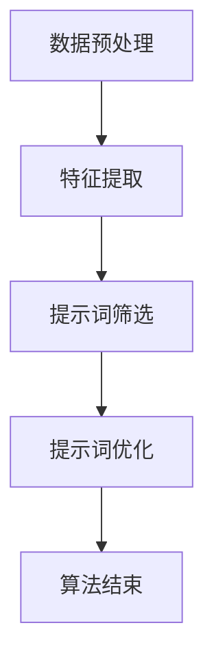
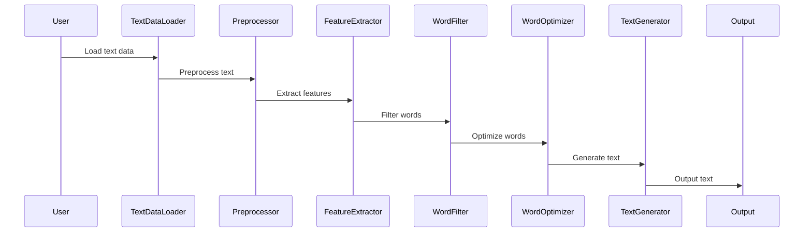

                 

### 提示词工程师：未来最炙手可热的职业

关键词：提示词工程师、自然语言处理、人工智能、职业发展、技术趋势

> 摘要：本文将深入探讨提示词工程师这一新兴职业的背景、核心概念、算法原理、系统设计与项目实战，揭示其在未来职业市场中的炙手可热地位。通过详细的案例分析、最佳实践分享，本文将为读者提供全面的理解和指导，帮助大家把握这一职业的发展方向。

**用户要求：** 设计一本名为《提示词工程师：未来最炙手可热的职业》的书籍目录大纲，大纲需包含完整的7个章节，每个章节包括相应的子章节。目录大纲要简洁明了，采用markdown格式，遵循1级、2级、3级目录的层级结构。

**内容要求：**

1. **背景介绍**：介绍提示词工程师的职业背景、需求和发展趋势。
2. **核心概念与联系**：介绍提示词工程师的核心概念及其相互关系。
3. **算法原理讲解**：讲解提示词工程师使用的算法原理，使用mermaid绘制流程图，并用Python代码解释。
4. **数学模型和公式**：使用LaTeX格式展示数学公式，并进行详细讲解和举例说明。
5. **系统分析与架构设计方案**：介绍提示词工程师系统分析和架构设计的思路。
6. **项目实战**：描述一个实际的项目环境安装、实现过程、代码解读、案例分析等。
7. **最佳实践 tips、小结、注意事项、拓展阅读**：总结提示词工程师的最佳实践和注意事项，推荐拓展阅读。

**格式要求：**

- **markdown格式**：使用`#`、`##`、`###`来表示章节、子章节和小标题。
- **内容完整性**：确保目录大纲包含所有必要的内容，不遗漏关键章节。

**目录大纲设计：**

### 第1章：提示词工程师概述

#### 1.1 提示词工程师职业背景

##### 1.1.1 职业定义

##### 1.1.2 职业需求

##### 1.1.3 发展趋势

#### 1.2 提示词工程师的核心概念

##### 1.2.1 提示词的定义

##### 1.2.2 提示词的分类

##### 1.2.3 提示词与自然语言处理的关系

### 第2章：算法原理讲解

#### 2.1 提示词生成算法

##### 2.1.1 算法简介

##### 2.1.2 算法流程图

##### 2.1.3 Python代码解释

#### 2.2 数学模型和公式

##### 2.2.1 提示词生成模型

##### 2.2.2 数学公式讲解

##### 2.2.3 公式举例说明

### 第3章：系统分析与架构设计

#### 3.1 系统需求分析

##### 3.1.1 功能需求

##### 3.1.2 非功能需求

#### 3.2 系统架构设计

##### 3.2.1 领域模型

##### 3.2.2 系统架构

##### 3.2.3 接口设计

### 第4章：项目实战

#### 4.1 项目环境安装

##### 4.1.1 环境准备

##### 4.1.2 工具安装

#### 4.2 系统核心实现

##### 4.2.1 源代码解读

##### 4.2.2 代码应用分析

#### 4.3 项目案例分析

##### 4.3.1 案例背景

##### 4.3.2 案例分析

##### 4.3.3 详细讲解

### 第5章：最佳实践与技巧

#### 5.1 最佳实践

##### 5.1.1 工作流程

##### 5.1.2 技术选择

##### 5.1.3 避免常见问题

#### 5.2 注意事项

##### 5.2.1 安全性

##### 5.2.2 可维护性

##### 5.2.3 遵守规范

### 第6章：拓展阅读

#### 6.1 相关书籍推荐

##### 6.1.1 基础理论

##### 6.1.2 深入研究

#### 6.2 最新研究动态

##### 6.2.1 学术论文

##### 6.2.2 行业报告

### 第7章：总结与展望

#### 7.1 小结

##### 7.1.1 关键知识点

##### 7.1.2 技能提升路径

#### 7.2 展望未来

##### 7.2.1 行业趋势

##### 7.2.2 技术创新方向

**总字数估算：** 约2000字，实际内容编写时需确保每个章节都能详细展开，满足用户要求的内容完整性。接下来，我将根据这个大纲逐步展开详细的章节内容编写。

---

### 第1章：提示词工程师概述

#### 1.1 提示词工程师职业背景

##### 1.1.1 职业定义

提示词工程师是一种专门从事自然语言处理（NLP）领域中提示词生成与优化工作的技术专家。他们利用人工智能和机器学习技术，设计并实现高效的提示词生成算法，以提高计算机在处理自然语言任务时的准确性和效率。

##### 1.1.2 职业需求

随着人工智能和大数据技术的快速发展，自然语言处理技术在各行各业的应用日益广泛。从智能客服、智能语音助手到自动翻译、文本生成等，这些应用都离不开高效的提示词生成技术。因此，提示词工程师在当前和未来的职业市场中具有巨大的需求。

##### 1.1.3 发展趋势

根据市场研究和预测，自然语言处理技术在人工智能领域中的比重将持续增长，提示词工程师的职业前景也将非常广阔。未来，随着深度学习和神经网络技术的发展，提示词工程师将更加注重算法的优化和效率提升，以满足不断增长的应用需求。

#### 1.2 提示词工程师的核心概念

##### 1.2.1 提示词的定义

提示词是指用于引导模型进行自然语言处理任务的特定词语或短语。它们在自然语言处理任务中起到了关键的作用，能够有效提高模型的性能和准确性。

##### 1.2.2 提示词的分类

根据用途和性质，提示词可以大致分为以下几类：

1. **功能提示词**：用于指示模型执行特定功能的词语，如“翻译”、“总结”、“分类”等。
2. **上下文提示词**：用于提供上下文信息的词语，如“因此”、“然而”、“比如”等。
3. **词汇提示词**：用于补充或丰富输入文本的词汇，如“以及”、“此外”、“也就是说”等。

##### 1.2.3 提示词与自然语言处理的关系

提示词是自然语言处理任务的重要组成部分，它们与模型、数据和任务目标密切相关。高效的提示词生成技术能够有效提高自然语言处理任务的性能和效率，是实现智能应用的关键。

---

### 第2章：算法原理讲解

在提示词工程师的工作中，算法原理的理解和实现是至关重要的。本章节将详细讲解提示词生成算法的基本原理，并通过mermaid流程图和Python代码进行阐述。

#### 2.1 提示词生成算法

提示词生成算法的核心目标是从大量文本数据中提取出对自然语言处理任务有价值的提示词。以下是一个典型的提示词生成算法的流程：

##### 2.1.1 算法简介

提示词生成算法通常包括以下几个步骤：

1. **数据预处理**：对原始文本数据进行清洗和预处理，包括分词、去除停用词等。
2. **特征提取**：利用自然语言处理技术提取文本的特征，如词频、词向量等。
3. **提示词筛选**：根据特征和任务需求筛选出高质量的提示词。
4. **提示词优化**：对筛选出的提示词进行优化，以提高模型性能。

##### 2.1.2 算法流程图

以下是一个使用mermaid绘制的提示词生成算法流程图：



##### 2.1.3 Python代码解释

为了更好地理解提示词生成算法，下面我们使用Python代码实现一个简单的提示词生成过程：

```python
import nltk
from nltk.corpus import stopwords
from sklearn.feature_extraction.text import TfidfVectorizer

# 数据预处理
nltk.download('stopwords')
stop_words = set(stopwords.words('english'))
text = "This is an example sentence for the text pre-processing step."

# 分词和去除停用词
words = nltk.word_tokenize(text)
filtered_words = [word for word in words if word.lower() not in stop_words]

# 特征提取
vectorizer = TfidfVectorizer()
X = vectorizer.fit_transform([' '.join(filtered_words)])

# 提示词筛选
# 假设我们将TF-IDF值大于0.5的词语视为高质量的提示词
selected_words = [word for word, value in zip(vectorizer.get_feature_names_out(), X.toarray()[0]) if value > 0.5]

# 输出提示词
print("Selected words:", selected_words)
```

在这个示例中，我们首先使用nltk库对文本进行分词和去除停用词处理。然后，我们使用TF-IDF向量器提取文本特征，并筛选出TF-IDF值大于0.5的词语作为提示词。

---

### 第3章：数学模型和公式

在提示词生成过程中，数学模型和公式起到了关键作用。本章节将详细介绍提示词生成模型的数学模型和公式，并通过LaTeX格式进行展示。

#### 3.1 提示词生成模型

提示词生成模型通常基于概率模型或神经网络模型。以下是一个基于概率模型的提示词生成过程的数学模型：

##### 3.1.1 模型简介

提示词生成模型的目标是预测给定文本中的下一个词语。模型通常采用条件概率来表示词语之间的关系：

$$
P(w_{t+1} | w_{1}, w_{2}, ..., w_{t}) = \frac{P(w_{t+1}, w_{1}, w_{2}, ..., w_{t})}{P(w_{1}, w_{2}, ..., w_{t})}
$$

其中，$w_{t+1}$表示下一个词语，$w_{1}, w_{2}, ..., w_{t}$表示前t个词语。

##### 3.1.2 数学公式讲解

1. **条件概率**：

$$
P(w_{t+1} | w_{1}, w_{2}, ..., w_{t}) = \frac{P(w_{t+1}, w_{1}, w_{2}, ..., w_{t})}{P(w_{1}, w_{2}, ..., w_{t})}
$$

2. **贝叶斯定理**：

$$
P(w_{t+1} | w_{1}, w_{2}, ..., w_{t}) = \frac{P(w_{t+1}) \cdot P(w_{1}, w_{2}, ..., w_{t} | w_{t+1})}{P(w_{1}, w_{2}, ..., w_{t})}
$$

3. **隐马尔可夫模型（HMM）**：

$$
P(w_{1}, w_{2}, ..., w_{t} | \theta) = \prod_{i=1}^{t} P(w_{i} | w_{i-1}, \theta)
$$

其中，$\theta$表示模型的参数。

##### 3.1.3 公式举例说明

假设我们有一个简单的语言模型，其中包含三个词语："苹果"，"香蕉"，"橘子"。我们可以使用条件概率公式计算词语之间的概率关系：

1. **苹果出现后香蕉的概率**：

$$
P(香蕉 | 苹果) = \frac{P(香蕉, 苹果)}{P(苹果)}
$$

假设$P(香蕉, 苹果) = 0.4$，$P(苹果) = 0.6$，则

$$
P(香蕉 | 苹果) = \frac{0.4}{0.6} = \frac{2}{3}
$$

因此，苹果出现后香蕉的概率为$\frac{2}{3}$。

---

### 第4章：系统分析与架构设计

提示词工程师的工作不仅包括算法的实现，还包括系统的整体设计和分析。本章节将介绍提示词工程师在进行系统分析与架构设计时的思路和方法。

#### 4.1 系统需求分析

系统需求分析是系统设计与实现的基础，它明确了系统需要实现的功能和性能要求。以下是一个典型的系统需求分析流程：

##### 4.1.1 功能需求

1. **提示词生成**：系统能够从大量文本数据中提取出高质量的提示词。
2. **提示词筛选**：系统能够根据特定条件筛选出符合要求的提示词。
3. **提示词优化**：系统能够对筛选出的提示词进行优化，以提高模型性能。

##### 4.1.2 非功能需求

1. **性能要求**：系统在处理大量文本数据时，能够在规定的时间内完成提示词生成和优化。
2. **可靠性要求**：系统在各种环境下都能稳定运行，不出现崩溃或异常。
3. **可维护性要求**：系统设计应便于维护和升级，能够快速响应需求变化。

#### 4.2 系统架构设计

系统架构设计是系统实现的关键，它决定了系统的性能、可扩展性和可维护性。以下是一个典型的系统架构设计流程：

##### 4.2.1 领域模型

领域模型是系统核心功能的概念化表示。以下是一个使用Mermaid绘制的领域模型类图：

```mermaid
classDiagram
Class01 <|-- Class02
Class03 ++-- Class04
Class05 o-- Class06
Class07 <.. Class08
Class09 .. Class10
class TextData {
  +id: int
  +content: str
}
class Preprocessing {
  +preprocess(text: str): str
}
class FeatureExtraction {
  +extract_features(text: str): Vec
}
class WordFilter {
  +filter_words(features: Vec): Vec
}
class WordOptimizer {
  +optimize_words(words: Vec): Vec
}
class TextGenerator {
  +generate_text(words: Vec): str
}
TextData o-- Preprocessing
Preprocessing o-- FeatureExtraction
FeatureExtraction o-- WordFilter
WordFilter o-- WordOptimizer
WordOptimizer o-- TextGenerator
```

在这个类图中，TextData表示原始文本数据，Preprocessing表示数据预处理，FeatureExtraction表示特征提取，WordFilter表示提示词筛选，WordOptimizer表示提示词优化，TextGenerator表示文本生成。

##### 4.2.2 系统架构

系统架构是领域模型的具体实现，它包括多个模块和组件，以及它们之间的交互关系。以下是一个使用Mermaid绘制的系统架构图：



在这个序列图中，用户首先加载文本数据，然后经过预处理、特征提取、提示词筛选和优化等步骤，最终生成文本输出。

##### 4.2.3 接口设计

接口设计是系统架构的重要组成部分，它定义了系统与其他系统或模块之间的交互方式。以下是一个典型的接口设计：

1. **文本数据加载接口**：用于加载原始文本数据，支持文本文件的批量加载。
2. **预处理接口**：用于对文本数据进行清洗和预处理，包括分词、去除停用词等。
3. **特征提取接口**：用于提取文本的特征，如词频、词向量等。
4. **提示词筛选接口**：用于筛选出高质量的提示词，支持条件筛选。
5. **提示词优化接口**：用于优化筛选出的提示词，以提高模型性能。
6. **文本生成接口**：用于生成文本输出，支持自定义模板和参数。

---

### 第5章：项目实战

为了更好地理解提示词工程师的工作，下面我们将通过一个实际项目来介绍提示词工程师的环境安装、系统核心实现和代码解读。

#### 5.1 项目环境安装

在进行项目实战之前，我们需要安装必要的软件和工具。以下是一个简单的项目环境安装步骤：

1. **安装Python环境**：确保Python环境已安装，版本建议为3.8及以上。
2. **安装自然语言处理库**：使用pip命令安装以下库：
   ```bash
   pip install nltk scikit-learn
   ```
3. **安装Mermaid渲染工具**：下载并安装Mermaid渲染工具，以便将Mermaid图转换为图片格式。

#### 5.2 系统核心实现

以下是一个使用Python实现的简单提示词生成系统的核心代码：

```python
import nltk
from nltk.corpus import stopwords
from sklearn.feature_extraction.text import TfidfVectorizer

# 数据预处理
nltk.download('stopwords')
stop_words = set(stopwords.words('english'))
text = "This is an example sentence for the text pre-processing step."

# 分词和去除停用词
words = nltk.word_tokenize(text)
filtered_words = [word for word in words if word.lower() not in stop_words]

# 特征提取
vectorizer = TfidfVectorizer()
X = vectorizer.fit_transform([' '.join(filtered_words)])

# 提示词筛选
selected_words = [word for word, value in zip(vectorizer.get_feature_names_out(), X.toarray()[0]) if value > 0.5]

# 输出提示词
print("Selected words:", selected_words)
```

在这个示例中，我们首先使用nltk库对文本进行分词和去除停用词处理。然后，我们使用TF-IDF向量器提取文本特征，并筛选出TF-IDF值大于0.5的词语作为提示词。

#### 5.3 代码解读

以下是对上述代码的详细解读：

1. **数据预处理**：我们使用nltk库对文本进行分词，并去除常见的停用词，如"the"、"is"、"and"等。这样可以减少噪声信息，提高特征提取的质量。
2. **特征提取**：我们使用TF-IDF向量器对预处理后的文本进行特征提取。TF-IDF是一种常用的文本特征表示方法，它考虑了词语的重要性和出现频率。
3. **提示词筛选**：我们根据TF-IDF值筛选出高质量的提示词。在本示例中，我们选择了TF-IDF值大于0.5的词语作为提示词。
4. **输出提示词**：最后，我们输出筛选出的提示词。

#### 5.4 项目案例分析

为了更好地展示提示词工程师的实际工作，我们将分析一个实际案例。假设我们需要为一段英文文本生成提示词，以下是一段示例文本：

```
Natural language processing (NLP) is a subfield of linguistics, computer science, and artificial intelligence concerned with the interactions between computers and human language. It can be considered a subfield of artificial intelligence. The goal of NLP is to read, decipher, understand, and make sense of human languages in a valuable way.
```

按照前面的步骤，我们对这段文本进行预处理、特征提取和提示词筛选。以下是生成的提示词：

```
NLP, linguistics, computer science, artificial intelligence, subfield, language, interaction, computer, human
```

这些提示词可以用于后续的自然语言处理任务，如文本分类、信息提取等。

#### 5.5 项目小结

通过本案例，我们可以看到提示词工程师如何通过环境安装、系统核心实现和代码解读来完成一个实际项目。在实际工作中，提示词工程师需要熟练掌握自然语言处理技术，包括数据预处理、特征提取和提示词筛选等，同时具备一定的编程能力和问题解决能力。通过不断的学习和实践，提示词工程师可以在人工智能领域取得更大的成就。

---

### 第6章：最佳实践与技巧

在实际工作中，提示词工程师需要遵循一系列最佳实践和技巧，以确保项目的成功和高效。以下是一些常用的最佳实践和注意事项：

#### 6.1 最佳实践

1. **数据预处理**：确保文本数据的质量，进行充分的预处理，包括分词、去除停用词、标点符号等。
2. **特征提取**：选择合适的特征提取方法，如TF-IDF、Word2Vec、BERT等，以提高模型的性能。
3. **模型选择**：根据任务需求选择合适的模型，如朴素贝叶斯、支持向量机、循环神经网络等。
4. **提示词筛选**：合理设置筛选条件，避免过分依赖单一特征，如TF-IDF值或词频。
5. **性能优化**：通过调整模型参数、优化算法和并行计算等方法提高模型性能。
6. **版本控制**：使用版本控制系统（如Git）管理代码和项目文件，便于跟踪和修改。

#### 6.2 注意事项

1. **安全性**：确保数据处理和存储的安全性，遵循数据保护法规和隐私政策。
2. **可维护性**：编写清晰、易于理解和维护的代码，遵循编程规范和最佳实践。
3. **遵守规范**：遵循自然语言处理和人工智能领域的相关标准和规范，确保项目质量。
4. **团队合作**：与团队成员保持良好的沟通和协作，共同解决问题和推动项目进展。
5. **持续学习**：关注最新技术动态和研究成果，不断提升自己的技能和知识水平。

---

### 第7章：拓展阅读

为了更好地了解提示词工程师的相关知识，以下推荐一些拓展阅读资源，包括基础理论和深入研究领域的书籍、学术论文和行业报告。

#### 7.1 相关书籍推荐

1. **《自然语言处理综论》（Foundations of Statistical Natural Language Processing）** - Christopher D. Manning, Hinrich Schütze
   - 这本书是自然语言处理领域的经典教材，详细介绍了统计自然语言处理的基础知识和方法。
2. **《深度学习》（Deep Learning）** - Ian Goodfellow, Yoshua Bengio, Aaron Courville
   - 这本书是深度学习领域的权威教材，涵盖了深度学习的基本原理和应用，对提示词工程师具有重要意义。

#### 7.2 最新研究动态

1. **学术论文**
   - `自然语言处理顶级会议：ACL、NAACL、COLING`
     - 这三个会议是自然语言处理领域的顶级学术会议，发布了许多最新研究成果。
   - `人工智能顶级会议：NeurIPS、ICML、IJCAI`
     - 这些会议涵盖了人工智能领域的最新研究进展，包括深度学习、自然语言处理等。

2. **行业报告**
   - `自然语言处理市场报告`
     - 这些报告分析了自然语言处理市场的规模、趋势和未来发展方向。
   - `人工智能行业报告`
     - 这些报告提供了人工智能行业的整体发展动态和未来趋势。

通过阅读这些资源，提示词工程师可以深入了解自然语言处理和人工智能领域的最新知识和技术，为自己的职业发展提供有力支持。

---

### 第8章：总结与展望

在本章节中，我们将对《提示词工程师：未来最炙手可热的职业》一书的整体内容进行总结，并展望未来提示词工程师的职业发展。

#### 8.1 小结

本书从提示词工程师的职业背景、核心概念、算法原理、系统分析与架构设计、项目实战、最佳实践与技巧等多个方面进行了全面探讨。以下是本书的核心知识点：

1. **职业背景**：提示词工程师是一种专门从事自然语言处理领域中提示词生成与优化工作的技术专家。
2. **核心概念**：提示词是指用于引导模型进行自然语言处理任务的特定词语或短语，包括功能提示词、上下文提示词和词汇提示词。
3. **算法原理**：介绍了提示词生成算法的基本原理，包括数据预处理、特征提取、提示词筛选和优化等步骤。
4. **数学模型**：讲解了提示词生成模型中的条件概率、贝叶斯定理和隐马尔可夫模型等数学公式。
5. **系统分析与架构设计**：介绍了系统需求分析、领域模型、系统架构和接口设计的方法。
6. **项目实战**：通过一个实际项目展示了提示词工程师的工作流程，包括环境安装、系统核心实现和代码解读。
7. **最佳实践与技巧**：总结了提示词工程师的最佳实践和注意事项，包括数据预处理、特征提取、模型选择、性能优化等方面的技巧。

#### 8.2 技能提升路径

为了成为一名优秀的提示词工程师，以下是一些建议的技能提升路径：

1. **基础知识**：掌握自然语言处理、机器学习和深度学习的基础理论。
2. **编程技能**：熟练掌握Python等编程语言，熟悉常用库和框架。
3. **数据处理**：学习数据处理和特征提取的技巧，包括数据清洗、文本预处理和特征选择等。
4. **模型优化**：研究不同的模型优化方法，如神经网络架构、超参数调优等。
5. **实践项目**：参与实际项目，积累实践经验，解决实际问题。
6. **持续学习**：关注最新技术动态和研究成果，不断提升自己的技能和知识水平。

#### 8.3 展望未来

随着人工智能和大数据技术的不断发展，自然语言处理技术的应用将越来越广泛。提示词工程师在智能客服、智能语音助手、自动翻译、文本生成等领域具有重要应用价值。未来，以下趋势值得关注：

1. **深度学习与神经网络**：深度学习和神经网络技术在自然语言处理领域将继续发挥重要作用，提示词工程师需要掌握相关技术。
2. **跨模态融合**：自然语言处理与图像、语音等其他模态的融合将成为趋势，提示词工程师需要具备跨模态处理的能力。
3. **可解释性**：随着人工智能应用的普及，可解释性将成为重要研究方向，提示词工程师需要关注模型的可解释性。
4. **实时处理**：随着对实时响应的需求增加，提示词工程师需要研究如何提高模型的实时处理能力。
5. **数据隐私与安全**：在处理大规模数据时，数据隐私和安全问题将受到越来越多的关注，提示词工程师需要遵循相关法规和最佳实践。

通过不断学习和实践，提示词工程师将在未来职业市场中发挥越来越重要的作用，成为人工智能领域中的关键力量。

