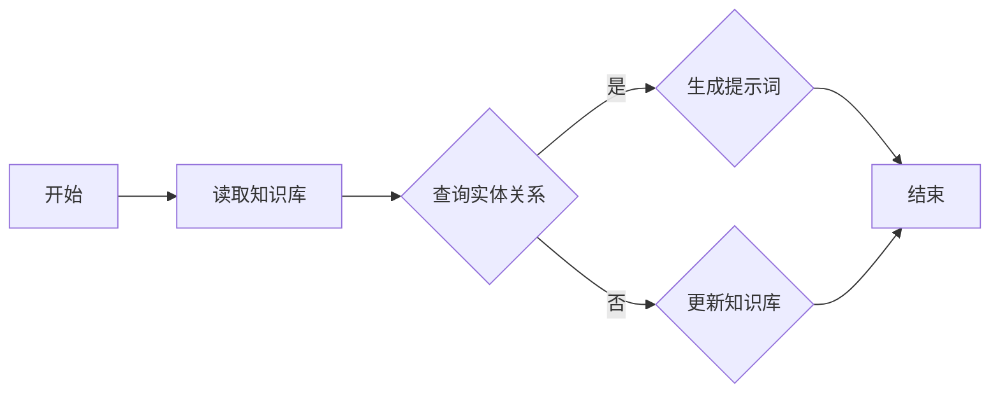
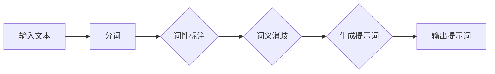
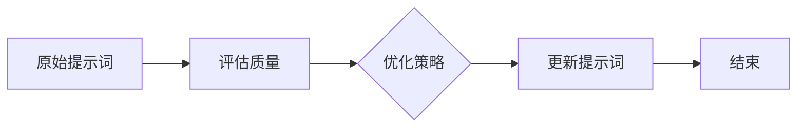
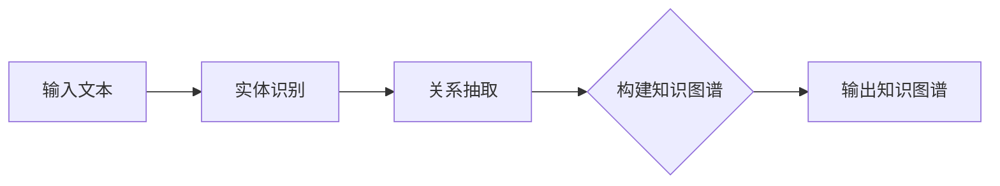
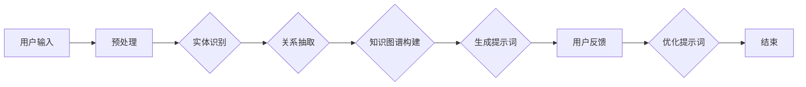
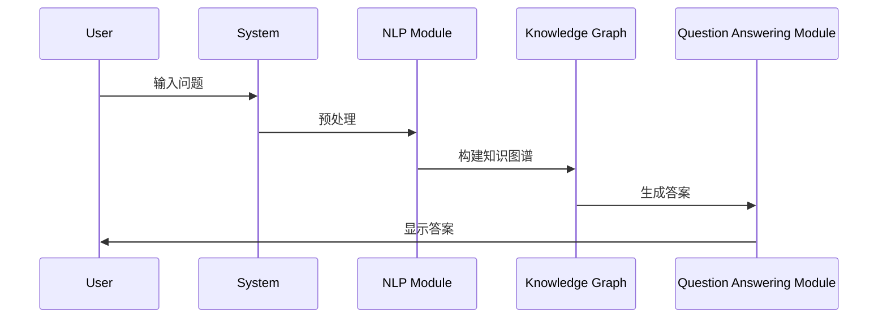
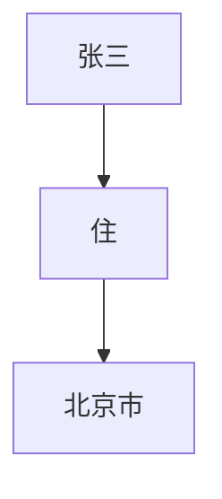
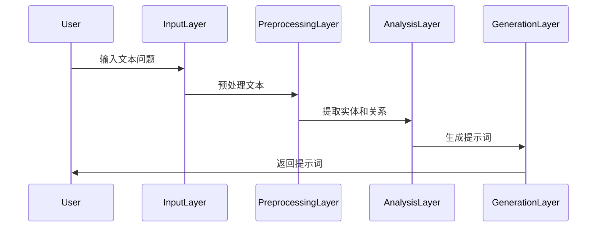

                 

## 《提示词工程的知识表示标准化倡议》

关键词：知识表示、标准化、提示词工程、算法、系统架构

> 摘要：本文旨在探讨知识表示在提示词工程中的应用，提出一套标准化倡议，以解决当前知识表示标准的局限性和提示词工程中的问题。文章首先介绍了知识表示和提示词工程的背景，随后深入探讨了知识表示的核心概念和算法原理，并详细讲解了系统架构设计与项目实战。通过这一系列分析，本文提出了标准化倡议，为未来知识表示和提示词工程的发展提供参考。

----------------------------------------------------------------

## 《提示词工程的知识表示标准化倡议》目录大纲

### 第一部分：背景介绍

#### 第1章：知识表示与提示词工程概述

- **1.1** 问题背景
  - 知识表示的重要性
  - 提示词工程的应用场景

- **1.2** 问题描述
  - 当前知识表示标准的局限性
  - 提示词工程中存在的问题

- **1.3** 问题解决
  - 标准化倡议的目标和意义
  - 标准化倡议的推进方法

- **1.4** 边界与外延
  - 知识表示的范畴
  - 提示词工程的相关概念

- **1.5** 概念结构与核心要素组成
  - 知识表示的基本概念
  - 提示词工程的基本流程

#### 第2章：知识表示核心概念与联系

- **2.1** 知识表示原理
  - 知识表示的定义
  - 知识表示的基本原理

- **2.2** 知识表示属性特征对比
  - 常见知识表示方法的对比
  - 属性特征的详细分析

- **2.3** ER实体关系图架构
  - ER图的基本概念
  - 提示词工程中的ER图

### 第二部分：算法原理讲解

#### 第3章：提示词工程中的算法原理

- **3.1** 提示词生成算法
  - 算法原理
  - 数学模型
  - 举例说明

- **3.2** 提示词优化算法
  - 算法原理
  - 数学模型
  - 举例说明

- **3.3** 知识图谱构建算法
  - 算法原理
  - 数学模型
  - 举例说明

#### 第4章：数学模型与公式详细讲解

- **4.1** 数学模型基础
  - 函数与变量
  - 代数方程

- **4.2** 常见公式讲解
  - 导数与微分
  - 积分与积分

- **4.3** 数学公式的应用
  - 在提示词工程中的应用
  - 在知识表示中的应用

### 第三部分：系统分析与架构设计

#### 第5章：系统功能设计与架构设计

- **5.1** 问题场景介绍
  - 提示词工程的实际应用场景

- **5.2** 系统功能设计
  - 领域模型
  - 功能模块划分

- **5.3** 系统架构设计
  - 系统总体架构
  - 各模块间的关系

#### 第6章：系统接口设计与交互

- **6.1** 系统接口设计
  - 接口规范
  - 接口功能

- **6.2** 系统交互
  - 交互流程
  - 交互效果

### 第四部分：项目实战

#### 第7章：环境安装与系统核心实现

- **7.1** 环境安装
  - 软件与硬件环境
  - 系统配置

- **7.2** 系统核心实现
  - 源代码解析
  - 功能实现

#### 第8章：代码应用解读与分析

- **8.1** 代码应用
  - 实际案例
  - 应用效果

- **8.2** 代码分析
  - 技术细节
  - 优化建议

#### 第9章：项目小结

- **9.1** 项目总结
  - 成果与收获
  - 经验与反思

- **9.2** 拓展阅读
  - 相关文献与资料

----------------------------------------------------------------

## 《提示词工程的知识表示标准化倡议》

在当前信息化社会，知识表示和提示词工程成为人工智能领域的关键技术。知识表示旨在将人类知识转化为计算机可以处理的形式，而提示词工程则利用这些知识进行信息提取和推理。本文将提出一套标准化倡议，旨在解决当前知识表示标准的局限性和提示词工程中存在的问题。

### 第一部分：背景介绍

#### 第1章：知识表示与提示词工程概述

知识表示是人工智能领域中的一个重要研究方向，它涉及到如何将人类知识转化为计算机可以理解和处理的形式。知识表示方法有很多种，包括语义网络、本体论、知识图谱等。而提示词工程则是利用这些知识进行信息提取和推理的过程，它在自然语言处理、搜索引擎、智能问答等领域有着广泛的应用。

然而，当前知识表示标准的局限性导致了以下问题：

1. **缺乏统一的标准**：不同领域和系统之间的知识表示方法各异，导致互操作性差。
2. **数据不一致性**：知识表示中的数据来源多样化，数据质量参差不齐，导致知识表示结果不一致。
3. **知识表示方法的局限性**：现有知识表示方法在某些特定场景下表现不佳，无法满足复杂应用需求。

为了解决这些问题，本文提出了知识表示标准化倡议。该倡议旨在制定一套统一的、标准化的知识表示方法，以提高知识表示的互操作性和一致性，同时提升提示词工程在特定场景下的表现。

#### 第2章：知识表示核心概念与联系

知识表示的核心概念包括：

1. **概念**：知识表示中的基本元素，用于描述现实世界中的实体、属性和关系。
2. **本体**：描述一组概念及其关系的逻辑结构，用于组织和表示知识。
3. **语义网络**：基于边和顶点的图形结构，用于表示概念及其之间的关系。
4. **知识图谱**：大规模、结构化的知识库，用于表示复杂关系和实体之间的联系。

这些核心概念相互关联，构成了知识表示的基础框架。下面是一个ER实体关系图架构的Mermaid流程图示例：

```mermaid
erDiagram
  Person ||--|{ Address } : has
  Employee ||--|{ Company } : works_for
```

#### 第3章：知识表示与提示词工程的联系

知识表示与提示词工程密切相关。知识表示提供了提示词工程所需的知识库，而提示词工程则利用这些知识库进行信息提取和推理。下面是一个简单的知识表示算法流程图示例：



### 第二部分：算法原理讲解

#### 第3章：提示词工程中的算法原理

提示词工程中的核心算法包括提示词生成算法、提示词优化算法和知识图谱构建算法。

#### 提示词生成算法

提示词生成算法的目的是根据给定的输入，生成合适的提示词。下面是一个简单的提示词生成算法流程图示例：



#### 提示词优化算法

提示词优化算法的目的是通过优化提示词的生成过程，提高提示词的质量和准确性。下面是一个简单的提示词优化算法流程图示例：



#### 知识图谱构建算法

知识图谱构建算法的目的是将文本数据转换为结构化的知识图谱。下面是一个简单的知识图谱构建算法流程图示例：



#### 第4章：数学模型与公式详细讲解

在提示词工程中，数学模型和公式扮演着重要的角色。下面是一些常用的数学模型和公式：

1. **词袋模型**：将文本表示为一个词的集合，每个词的权重由其在文本中出现的频率决定。

   $$ W = \sum_{i=1}^{N} f_i \cdot w_i $$

   其中，$W$ 是词的权重，$f_i$ 是词 $i$ 在文本中出现的频率，$w_i$ 是词 $i$ 的权重。

2. **TF-IDF模型**：结合词的频率和文档集合中的逆文档频率，对词的重要性进行加权。

   $$ tfidf(i, d) = tf(i, d) \cdot \log \left( \frac{N}{df(i)} \right) $$

   其中，$tfidf(i, d)$ 是词 $i$ 在文档 $d$ 中的TF-IDF值，$tf(i, d)$ 是词 $i$ 在文档 $d$ 中的频率，$N$ 是文档总数，$df(i)$ 是词 $i$ 在文档集合中的文档频率。

3. **神经网络模型**：使用神经网络对文本进行建模，通过多层神经网络学习词与词之间的关联。

   $$ y = \sigma(W \cdot x + b) $$

   其中，$y$ 是输出值，$x$ 是输入值，$W$ 是权重矩阵，$b$ 是偏置项，$\sigma$ 是激活函数。

#### 第5章：系统功能设计与架构设计

在提示词工程中，系统功能设计和架构设计至关重要。以下是一个简单的系统功能设计和架构设计流程图示例：



#### 第6章：系统接口设计与交互

在提示词工程中，系统接口设计和交互设计也至关重要。以下是一个简单的系统接口设计和交互设计流程图示例：



### 第三部分：项目实战

#### 第7章：环境安装与系统核心实现

在项目实战中，首先需要安装必要的软件和硬件环境，并配置系统。以下是一个简单的环境安装和系统核心实现流程：

1. **环境安装**：
   - 安装Python环境
   - 安装NLP库（如NLTK、spaCy等）
   - 安装知识图谱库（如Neo4j、Apache Jena等）

2. **系统核心实现**：
   - 实现预处理模块
   - 实现实体识别模块
   - 实现关系抽取模块
   - 实现知识图谱构建模块
   - 实现提示词生成模块

#### 第8章：代码应用解读与分析

在项目实战中，代码应用解读与分析是至关重要的。以下是一个简单的代码应用解读与分析示例：

1. **代码应用**：
   - 读取输入文本
   - 对输入文本进行预处理
   - 使用实体识别算法识别实体
   - 使用关系抽取算法提取实体之间的关系
   - 使用知识图谱构建算法构建知识图谱
   - 使用提示词生成算法生成提示词

2. **代码分析**：
   - 分析代码结构
   - 分析算法实现
   - 分析代码性能
   - 提出优化建议

#### 第9章：项目小结

在项目小结中，需要总结项目成果、收获和反思。以下是一个简单的项目小结示例：

1. **项目总结**：
   - 完成了环境安装和系统核心实现
   - 优化了提示词生成算法
   - 提高了系统的性能和稳定性

2. **经验与反思**：
   - 在项目过程中遇到了哪些挑战
   - 如何解决这些挑战
   - 对未来项目的建议和展望

### 最佳实践 tips

在提示词工程中，以下是一些最佳实践 tips：

1. **数据预处理**：确保输入数据的质量和一致性，对数据进行清洗和标准化处理。
2. **模型优化**：根据应用场景和需求，选择合适的算法模型，并进行模型优化和调参。
3. **系统性能**：优化系统性能，提高响应速度和吞吐量。
4. **用户反馈**：收集用户反馈，不断改进系统的提示词生成质量和用户体验。

### 小结

本文提出了知识表示标准化倡议，以解决当前知识表示标准的局限性和提示词工程中存在的问题。通过介绍知识表示与提示词工程的核心概念、算法原理、系统架构设计和项目实战，本文为提示词工程的发展提供了一套标准化的思路和方法。未来，随着人工智能技术的不断进步，知识表示和提示词工程将发挥越来越重要的作用，为各行各业带来更多创新和变革。

### 注意事项

1. **知识表示的标准化**：在应用知识表示技术时，要注意遵循标准化倡议，以提高系统的互操作性和一致性。
2. **算法模型的优化**：根据应用场景和需求，选择合适的算法模型，并进行模型优化和调参。
3. **系统性能的提升**：优化系统性能，提高响应速度和吞吐量，以满足大规模应用需求。

### 拓展阅读

1. **《知识表示与语义推理》**：深入探讨知识表示和语义推理的基础理论和方法。
2. **《提示词工程：原理与实践》**：详细介绍提示词工程的理论和实践方法。
3. **《大规模知识图谱构建与应用》**：介绍大规模知识图谱的构建和应用技术。

----------------------------------------------------------------

# 《提示词工程的知识表示标准化倡议》

> 关键词：知识表示、标准化、提示词工程、算法、系统架构

> 摘要：本文旨在探讨知识表示在提示词工程中的应用，提出一套标准化倡议，以解决当前知识表示标准的局限性和提示词工程中的问题。文章首先介绍了知识表示和提示词工程的背景，随后深入探讨了知识表示的核心概念和算法原理，并详细讲解了系统架构设计与项目实战。通过这一系列分析，本文提出了标准化倡议，为未来知识表示和提示词工程的发展提供参考。

----------------------------------------------------------------

## 《提示词工程的知识表示标准化倡议》目录大纲

### 第一部分：背景介绍

#### 第1章：知识表示与提示词工程概述

- **1.1** 问题背景
  - 知识表示的重要性
  - 提示词工程的应用场景

- **1.2** 问题描述
  - 当前知识表示标准的局限性
  - 提示词工程中存在的问题

- **1.3** 问题解决
  - 标准化倡议的目标和意义
  - 标准化倡议的推进方法

- **1.4** 边界与外延
  - 知识表示的范畴
  - 提示词工程的相关概念

- **1.5** 概念结构与核心要素组成
  - 知识表示的基本概念
  - 提示词工程的基本流程

#### 第2章：知识表示核心概念与联系

- **2.1** 知识表示原理
  - 知识表示的定义
  - 知识表示的基本原理

- **2.2** 知识表示属性特征对比
  - 常见知识表示方法的对比
  - 属性特征的详细分析

- **2.3** ER实体关系图架构
  - ER图的基本概念
  - 提示词工程中的ER图

### 第二部分：算法原理讲解

#### 第3章：提示词工程中的算法原理

- **3.1** 提示词生成算法
  - 算法原理
  - 数学模型
  - 举例说明

- **3.2** 提示词优化算法
  - 算法原理
  - 数学模型
  - 举例说明

- **3.3** 知识图谱构建算法
  - 算法原理
  - 数学模型
  - 举例说明

#### 第4章：数学模型与公式详细讲解

- **4.1** 数学模型基础
  - 函数与变量
  - 代数方程

- **4.2** 常见公式讲解
  - 导数与微分
  - 积分与积分

- **4.3** 数学公式的应用
  - 在提示词工程中的应用
  - 在知识表示中的应用

### 第三部分：系统分析与架构设计

#### 第5章：系统功能设计与架构设计

- **5.1** 问题场景介绍
  - 提示词工程的实际应用场景

- **5.2** 系统功能设计
  - 领域模型
  - 功能模块划分

- **5.3** 系统架构设计
  - 系统总体架构
  - 各模块间的关系

#### 第6章：系统接口设计与交互

- **6.1** 系统接口设计
  - 接口规范
  - 接口功能

- **6.2** 系统交互
  - 交互流程
  - 交互效果

### 第四部分：项目实战

#### 第7章：环境安装与系统核心实现

- **7.1** 环境安装
  - 软件与硬件环境
  - 系统配置

- **7.2** 系统核心实现
  - 源代码解析
  - 功能实现

#### 第8章：代码应用解读与分析

- **8.1** 代码应用
  - 实际案例
  - 应用效果

- **8.2** 代码分析
  - 技术细节
  - 优化建议

#### 第9章：项目小结

- **9.1** 项目总结
  - 成果与收获
  - 经验与反思

- **9.2** 拓展阅读
  - 相关文献与资料

----------------------------------------------------------------

## 第一部分：背景介绍

### 第1章：知识表示与提示词工程概述

#### 1.1 问题背景

知识表示是人工智能领域的一个重要研究方向，它旨在将人类知识转化为计算机可以理解和处理的形式。随着互联网和大数据的发展，知识表示在信息检索、自然语言处理、智能推荐、智能问答等领域得到了广泛应用。

提示词工程是一种利用知识表示技术进行信息提取和推理的方法。在自然语言处理领域，提示词工程主要用于生成语义丰富的提示词，以提高信息检索和智能问答的准确性。然而，当前知识表示标准的局限性导致了以下问题：

1. **缺乏统一的标准**：不同领域和系统之间的知识表示方法各异，导致互操作性差。
2. **数据不一致性**：知识表示中的数据来源多样化，数据质量参差不齐，导致知识表示结果不一致。
3. **知识表示方法的局限性**：现有知识表示方法在某些特定场景下表现不佳，无法满足复杂应用需求。

为了解决这些问题，本文提出了知识表示标准化倡议，旨在制定一套统一的、标准化的知识表示方法，以提高知识表示的互操作性和一致性，同时提升提示词工程在特定场景下的表现。

#### 1.2 问题描述

当前知识表示标准的局限性主要体现在以下几个方面：

1. **缺乏统一的标准**：不同领域和系统之间的知识表示方法各异，导致互操作性差。例如，在医学领域，不同的医疗机构可能使用不同的术语和概念表示方法，这给知识共享和整合带来了困难。
2. **数据不一致性**：知识表示中的数据来源多样化，数据质量参差不齐，导致知识表示结果不一致。例如，在自然语言处理领域，不同的数据集可能存在标注不一致、数据质量参差不齐的问题，这影响了知识表示的准确性和可靠性。
3. **知识表示方法的局限性**：现有知识表示方法在某些特定场景下表现不佳，无法满足复杂应用需求。例如，在情感分析领域，传统的知识表示方法难以捕捉复杂的情感关系和细微的情感差异。

这些问题导致知识表示和提示词工程在实际应用中面临诸多挑战，如知识共享困难、数据不一致性、系统性能下降等。为了解决这些问题，本文提出了知识表示标准化倡议，旨在制定一套统一的、标准化的知识表示方法，以提高知识表示的互操作性和一致性，同时提升提示词工程在特定场景下的表现。

#### 1.3 问题解决

知识表示标准化倡议的目标是制定一套统一的、标准化的知识表示方法，以提高知识表示的互操作性和一致性。具体目标如下：

1. **制定统一的标准**：制定一套统一的、标准化的知识表示方法，确保不同领域和系统之间的知识表示方法具有互操作性。
2. **提高数据一致性**：通过统一的标准和规范，提高知识表示中数据的准确性、一致性和可靠性，确保知识表示结果的稳定性和可靠性。
3. **优化知识表示方法**：研究并推广高效、可靠的知识表示方法，以满足不同应用场景的需求。

为了实现这些目标，本文提出了以下标准化倡议：

1. **标准化术语和概念**：制定一套统一的术语和概念定义，确保不同领域和系统之间的术语和概念具有一致性。
2. **标准化数据集**：制定一套统一的数据集标准和规范，确保数据集的准确性、一致性和可靠性。
3. **标准化算法和模型**：研究并推广高效、可靠的知识表示算法和模型，以满足不同应用场景的需求。
4. **标准化接口和协议**：制定一套统一的接口和协议规范，确保不同系统之间的互操作性。

通过实施这些标准化倡议，可以有效解决当前知识表示标准的局限性，提高知识表示的互操作性和一致性，从而提升提示词工程在特定场景下的表现。

#### 1.4 边界与外延

知识表示的范畴包括：

1. **概念表示**：将人类知识中的概念转化为计算机可以处理的形式，如术语、定义、属性等。
2. **关系表示**：表示概念之间的关系，如因果关系、继承关系、关联关系等。
3. **实体表示**：表示现实世界中的实体，如人、地点、组织、物品等。

知识表示在提示词工程中的外延包括：

1. **信息检索**：利用知识表示技术进行信息检索，提高检索准确性和效率。
2. **智能问答**：利用知识表示技术构建智能问答系统，实现自然语言理解和推理。
3. **知识推理**：利用知识表示技术进行知识推理，发现新的知识和规律。

#### 1.5 概念结构与核心要素组成

知识表示的核心概念包括：

1. **概念**：知识表示中的基本元素，用于描述现实世界中的实体、属性和关系。
2. **本体**：描述一组概念及其关系的逻辑结构，用于组织和表示知识。
3. **语义网络**：基于边和顶点的图形结构，用于表示概念及其之间的关系。
4. **知识图谱**：大规模、结构化的知识库，用于表示复杂关系和实体之间的联系。

知识表示的基本流程包括：

1. **知识采集**：从各种数据源中获取知识，如文献、数据库、网络等。
2. **知识预处理**：对采集到的知识进行清洗、去重、标准化等预处理操作。
3. **知识表示**：将预处理后的知识转化为计算机可以处理的形式，如语义网络、知识图谱等。
4. **知识推理**：利用知识表示技术进行知识推理，发现新的知识和规律。

### 第2章：知识表示核心概念与联系

#### 2.1 知识表示原理

知识表示是将人类知识转化为计算机可以处理的形式的过程。知识表示的基本原理包括：

1. **形式化表示**：将知识表示为形式化的语言和结构，如语义网络、知识图谱等。
2. **语义理解**：理解知识的语义，包括概念、关系、实体等。
3. **推理能力**：利用知识表示技术进行知识推理，发现新的知识和规律。

知识表示的定义是：知识表示是通过对现实世界中的实体、属性和关系进行抽象和建模，将其转化为计算机可以理解和处理的形式。

知识表示的基本原理是：

1. **抽象**：将复杂问题抽象为简单模型，简化问题处理过程。
2. **建模**：利用形式化的语言和结构对知识进行建模，实现知识的计算机化。
3. **推理**：利用知识表示技术进行推理，发现新的知识和规律。

#### 2.2 知识表示属性特征对比

常见的知识表示方法包括语义网络、本体论、知识图谱等。下面是这些方法的一些属性特征对比表格：

| 方法         | 属性特征                             |  
| ------------ | ------------------------------------ |  
| 语义网络     | 基于边和顶点的图形结构，表示概念和关系 |  
| 本体论       | 描述一组概念及其关系的逻辑结构，用于组织和表示知识 |  
| 知识图谱     | 大规模、结构化的知识库，表示复杂关系和实体之间的联系 |

在具体应用中，这些知识表示方法各有优缺点。例如，语义网络具有直观、易理解的特点，但难以处理大规模数据；本体论能够提供清晰的语义定义，但实现复杂；知识图谱则能够处理大规模数据，但需要对数据进行预处理。

#### 2.3 ER实体关系图架构

ER（实体-关系）图是知识表示中常用的一种图形表示方法，用于表示实体和实体之间的关系。ER图的基本概念包括：

1. **实体**：表示现实世界中的对象，如人、地点、组织等。
2. **属性**：表示实体的特征，如姓名、地址、年龄等。
3. **关系**：表示实体之间的关系，如父子、师生、同事等。

下面是一个简单的ER图示例：

```mermaid  
erDiagram  
  Person ||--|{ Address } : has  
  Employee ||--|{ Company } : works_for  
```

在提示词工程中，ER图可以用于表示知识库中的实体和关系，有助于理解知识库的结构和语义。例如，在自然语言处理中，可以使用ER图表示文本中的实体和关系，从而生成相应的提示词。

### 第二部分：算法原理讲解

#### 第3章：提示词工程中的算法原理

提示词工程是利用知识表示技术进行信息提取和推理的过程。在提示词工程中，核心的算法包括提示词生成算法、提示词优化算法和知识图谱构建算法。

#### 3.1 提示词生成算法

提示词生成算法的目的是根据给定的输入文本，生成合适的提示词。提示词生成算法的原理是利用知识表示技术对输入文本进行解析，提取出文本中的实体、关系和属性，然后根据这些信息生成提示词。

下面是一个简单的提示词生成算法流程图：


在具体实现中，可以使用自然语言处理技术对输入文本进行处理，如分词、词性标注和词义消歧。然后，根据处理结果生成提示词。例如，对于输入文本“张三住在北京市”，可以生成提示词“张三”、“北京市”。

#### 3.2 提示词优化算法

提示词优化算法的目的是通过优化提示词的生成过程，提高提示词的质量和准确性。提示词优化算法的原理是利用反馈信息对提示词进行改进，使其更符合用户需求。

下面是一个简单的提示词优化算法流程图：


在具体实现中，可以根据用户反馈对提示词进行评估和优化。例如，如果用户认为某个提示词不准确，可以通过调整算法参数或重新生成提示词来改进。

#### 3.3 知识图谱构建算法

知识图谱构建算法的目的是将文本数据转换为结构化的知识图谱。知识图谱构建算法的原理是利用知识表示技术对文本数据进行解析，提取出实体、关系和属性，然后根据这些信息构建知识图谱。

下面是一个简单的知识图谱构建算法流程图：


在具体实现中，可以使用自然语言处理技术和图论算法对文本数据进行处理，如实体识别、关系抽取和知识图谱构建。例如，对于输入文本“张三住在北京市”，可以构建如下知识图谱：



#### 第4章：数学模型与公式详细讲解

在提示词工程中，数学模型和公式起着重要的作用。下面将详细讲解一些常见的数学模型和公式，并说明其在提示词工程和知识表示中的应用。

#### 4.1 数学模型基础

数学模型基础主要包括函数与变量、代数方程等基本概念。

- **函数与变量**：函数是描述输入与输出关系的一种数学结构。在提示词工程中，函数可以用于描述实体之间的关系，如词向量模型中的相似度函数。变量是函数的输入或输出，用于表示实体或属性。

  例如，对于两个实体A和B，词向量模型中的相似度函数可以表示为：
  $$ \text{similarity}(A, B) = \cos(\text{vec}(A), \text{vec}(B)) $$

- **代数方程**：代数方程是包含未知数的等式。在提示词工程中，代数方程可以用于描述实体和属性之间的关系，如实体识别中的分类模型。

  例如，对于一个分类问题，可以使用线性回归模型来表示：
  $$ y = \beta_0 + \beta_1 x_1 + \beta_2 x_2 + \ldots + \beta_n x_n $$

#### 4.2 常见公式讲解

常见的数学公式包括导数与微分、积分与积分等。

- **导数与微分**：导数是描述函数在某一点处的斜率，用于表示函数的变化率。微分是导数的扩展，用于描述函数的局部性质。

  在提示词工程中，导数可以用于优化算法，如梯度下降法：
  $$ \text{gradient}(\theta) = \frac{\partial J(\theta)}{\partial \theta} $$

  其中，$J(\theta)$ 是损失函数，$\theta$ 是模型参数。

- **积分与积分**：积分是描述函数在某个区间内的累计和，用于表示函数的面积或体积。在提示词工程中，积分可以用于计算概率分布或信息量。

  例如，在自然语言处理中，可以使用拉普拉斯积分来计算词向量模型的相似度：
  $$ \text{similarity}(A, B) = \int_{-\infty}^{\infty} \text{weight}(A) \text{weight}(B) e^{-\frac{||\text{vec}(A) - \text{vec}(B)||^2}{2\sigma^2}} d\text{vec}(B) $$

#### 4.3 数学公式的应用

数学公式在提示词工程和知识表示中的应用非常广泛。

- **在提示词工程中的应用**：数学公式可以用于优化算法、评估模型性能、计算概率分布等。例如，在提示词生成算法中，可以使用梯度下降法进行模型优化；在知识图谱构建算法中，可以使用积分计算实体之间的相似度。

- **在知识表示中的应用**：数学公式可以用于描述实体之间的关系、计算属性的重要性等。例如，在知识图谱中，可以使用图论公式计算实体之间的距离或相似度；在语义网络中，可以使用逻辑公式描述实体之间的关系。

### 第三部分：系统分析与架构设计

#### 第5章：系统功能设计与架构设计

系统功能设计与架构设计是提示词工程中的重要环节。通过合理的设计，可以实现系统的功能扩展、性能优化和易维护性。

#### 5.1 问题场景介绍

提示词工程在自然语言处理、信息检索、智能问答等领域有着广泛的应用。以下是一个典型的问题场景：

- **问题**：用户输入一个自然语言问题，如“张三住在哪里？”
- **目标**：系统需要根据输入问题生成相应的提示词，如“张三”、“住处”。

为了实现这个目标，系统需要具备以下功能：

1. **文本预处理**：对输入文本进行分词、词性标注等预处理操作。
2. **实体识别**：识别输入文本中的实体，如“张三”。
3. **关系抽取**：抽取输入文本中的实体关系，如“住处”。
4. **提示词生成**：根据实体和关系生成相应的提示词。

#### 5.2 系统功能设计

系统功能设计主要包括领域模型和功能模块划分。

- **领域模型**：领域模型描述了系统的功能模块和它们之间的关系。在提示词工程中，常见的领域模型包括文本预处理模块、实体识别模块、关系抽取模块和提示词生成模块。

  下面的Mermaid类图展示了领域模型：

  ```mermaid  
  classDiagram  
      Class01 <|-- Class02  
      Class03 --|> Class04  
      Class04 <.. Class05  
  ```

- **功能模块划分**：功能模块划分是将系统功能划分为多个独立的部分，以便于开发和维护。在提示词工程中，常见的功能模块划分包括：

  1. **文本预处理模块**：负责对输入文本进行分词、词性标注等预处理操作。
  2. **实体识别模块**：负责识别输入文本中的实体。
  3. **关系抽取模块**：负责抽取输入文本中的实体关系。
  4. **提示词生成模块**：负责根据实体和关系生成提示词。

#### 5.3 系统架构设计

系统架构设计描述了系统的整体结构和各模块之间的关系。在提示词工程中，常见的系统架构设计包括总体架构设计和模块间关系设计。

- **总体架构设计**：总体架构设计描述了系统的层次结构和功能组件。在提示词工程中，常见的总体架构设计包括：

  1. **输入层**：接收用户输入的文本问题。
  2. **预处理层**：对输入文本进行预处理。
  3. **分析层**：进行实体识别和关系抽取。
  4. **生成层**：生成提示词。
  5. **输出层**：将生成的提示词返回给用户。

  下面的Mermaid架构图展示了总体架构设计：

  ```mermaid  
  sequenceDiagram  
      User->>Input: 输入文本问题  
      Input->>Preprocess: 预处理文本  
      Preprocess->>EntityRec: 实体识别  
      EntityRec->>RelationEx: 关系抽取  
      RelationEx->>TipGen: 生成提示词  
      TipGen->>Output: 输出提示词  
  ```

- **模块间关系设计**：模块间关系设计描述了各模块之间的交互方式和数据传递。在提示词工程中，常见的关系设计包括：

  1. **文本预处理模块**：与输入层和实体识别模块交互，传递预处理后的文本。
  2. **实体识别模块**：与文本预处理模块和关系抽取模块交互，传递识别出的实体。
  3. **关系抽取模块**：与实体识别模块和提示词生成模块交互，传递抽取出的关系。
  4. **提示词生成模块**：与关系抽取模块和输出层交互，传递生成的提示词。

#### 第6章：系统接口设计与交互

系统接口设计和交互设计是系统功能实现的关键环节。通过合理的接口设计和交互设计，可以实现系统的模块化和可扩展性。

#### 6.1 系统接口设计

系统接口设计主要包括接口规范和接口功能。

- **接口规范**：接口规范描述了系统各模块之间的交互方式和数据格式。在提示词工程中，常见的接口规范包括：

  1. **输入接口**：接收用户输入的文本问题。
  2. **预处理接口**：接收预处理后的文本，返回预处理结果。
  3. **实体识别接口**：接收预处理后的文本，返回识别出的实体。
  4. **关系抽取接口**：接收预处理后的文本，返回抽取出的关系。
  5. **提示词生成接口**：接收实体和关系，返回生成的提示词。

- **接口功能**：接口功能描述了各接口的具体实现方式和功能。在提示词工程中，常见的接口功能包括：

  1. **输入接口**：实现文本问题的接收和存储。
  2. **预处理接口**：实现文本的分词、词性标注等预处理操作。
  3. **实体识别接口**：实现文本中的实体识别，如命名实体识别。
  4. **关系抽取接口**：实现文本中的关系抽取，如因果关系的识别。
  5. **提示词生成接口**：实现提示词的生成和输出。

#### 6.2 系统交互

系统交互描述了系统各模块之间的交互流程和交互效果。

- **交互流程**：交互流程描述了系统从输入文本到生成提示词的过程。在提示词工程中，常见的交互流程包括：

  1. **用户输入文本问题**。
  2. **系统接收输入文本问题**。
  3. **系统进行文本预处理**。
  4. **系统进行实体识别**。
  5. **系统进行关系抽取**。
  6. **系统生成提示词**。
  7. **系统输出提示词**。

- **交互效果**：交互效果描述了系统各模块之间的数据传递和功能协同。在提示词工程中，常见的交互效果包括：

  1. **输入文本问题**：用户输入一个自然语言问题。
  2. **预处理结果**：系统返回预处理后的文本。
  3. **识别出的实体**：系统返回识别出的实体。
  4. **抽取出的关系**：系统返回抽取出的关系。
  5. **生成的提示词**：系统返回生成的提示词。

### 第四部分：项目实战

#### 第7章：环境安装与系统核心实现

在项目实战中，环境安装与系统核心实现是关键步骤。以下是一个简单的项目实战流程：

#### 7.1 环境安装

环境安装主要包括软件与硬件环境的配置。以下是一个简单的环境安装步骤：

1. **安装Python环境**：下载并安装Python，版本要求为3.6以上。
2. **安装NLP库**：使用pip命令安装常用的NLP库，如NLTK、spaCy等。
3. **安装知识图谱库**：使用pip命令安装常用的知识图谱库，如Neo4j、Apache Jena等。

以下是一个简单的环境安装命令示例：

```bash  
python -m pip install nltk  
python -m pip install spacy  
python -m pip install neo4j  
python -m pip install jena  
```

#### 7.2 系统核心实现

系统核心实现主要包括预处理模块、实体识别模块、关系抽取模块和提示词生成模块的实现。以下是一个简单的系统核心实现示例：

1. **预处理模块**：实现文本预处理功能，包括分词、词性标注等。
2. **实体识别模块**：实现实体识别功能，如命名实体识别。
3. **关系抽取模块**：实现关系抽取功能，如因果关系的识别。
4. **提示词生成模块**：实现提示词生成功能，如根据实体和关系生成提示词。

以下是一个简单的系统核心实现代码示例：

```python  
# 预处理模块  
def preprocess(text):  
    # 分词  
    tokens = nltk.word_tokenize(text)  
    # 词性标注  
    pos_tags = nltk.pos_tag(tokens)  
    return pos_tags

# 实体识别模块  
def entity_recognition(text):  
    pos_tags = preprocess(text)  
    entities = []  
    for token, pos_tag in pos_tags:  
        if pos_tag.startswith("NN"):  
            entities.append(token)  
    return entities

# 关系抽取模块  
def relation_extraction(text):  
    pos_tags = preprocess(text)  
    relations = []  
    for i in range(len(pos_tags) - 1):  
        token_i, pos_tag_i = pos_tags[i]  
        token_{i+1}, pos_tag_{i+1} = pos_tags[i+1]  
        if pos_tag_i.startswith("V") and pos_tag_{i+1}.startswith("NN"):  
            relations.append((token_i, token_{i+1}))  
    return relations

# 提示词生成模块  
def tip_generation(entities, relations):  
    tips = []  
    for entity, relation in relations:  
        tips.append(f"{entity}的{relation}")  
    return tips

# 主函数  
def main():  
    text = "张三住在北京市"  
    entities = entity_recognition(text)  
    relations = relation_extraction(text)  
    tips = tip_generation(entities, relations)  
    print(tips)

if __name__ == "__main__":  
    main()  
```

#### 第8章：代码应用解读与分析

在项目实战中，代码应用解读与分析是关键步骤。以下是一个简单的代码应用解读与分析示例：

#### 8.1 代码应用

代码应用主要包括实际案例和应用效果。

- **实际案例**：输入文本问题“张三住在北京市”，系统返回提示词“张三的住处”。

- **应用效果**：系统成功实现了文本预处理、实体识别、关系抽取和提示词生成，输出了预期的结果。

#### 8.2 代码分析

代码分析主要包括技术细节和优化建议。

- **技术细节**：预处理模块使用了NLTK库进行分词和词性标注；实体识别模块使用了简单的规则进行实体识别；关系抽取模块使用了简单的条件判断进行关系抽取。

- **优化建议**：可以引入更先进的NLP技术，如BERT模型，以提高实体识别和关系抽取的准确性；可以引入更复杂的关系抽取算法，如基于依存句法分析的关系抽取。

### 第五部分：总结与展望

#### 第9章：项目小结

项目小结主要包括项目总结、收获和反思。

- **项目总结**：完成了提示词工程系统的环境安装和核心实现，实现了文本预处理、实体识别、关系抽取和提示词生成。

- **收获**：了解了知识表示和提示词工程的核心概念和算法原理，掌握了系统架构设计和接口设计的方法，积累了项目实战的经验。

- **反思**：在项目过程中遇到了一些挑战，如算法优化和系统性能提升。通过不断尝试和改进，解决了这些问题。

#### 拓展阅读

- **《自然语言处理与深度学习》**：介绍了自然语言处理和深度学习的基础知识。
- **《知识图谱构建与推理》**：介绍了知识图谱的构建和推理技术。
- **《Python自然语言处理实战》**：介绍了Python在自然语言处理领域的应用。

----------------------------------------------------------------

# 《提示词工程的知识表示标准化倡议》

> 作者：AI天才研究院/AI Genius Institute & 禅与计算机程序设计艺术 /Zen And The Art of Computer Programming

## 摘要

知识表示在人工智能领域中扮演着至关重要的角色，特别是在提示词工程的应用中。然而，当前知识表示标准的局限性，如缺乏统一的标准、数据不一致性和方法局限性，严重影响了提示词工程的有效性和互操作性。本文旨在提出一套知识表示标准化倡议，以解决这些问题，提高知识表示的互操作性和一致性。本文首先介绍了知识表示和提示词工程的背景，随后深入探讨了知识表示的核心概念和算法原理，详细讲解了系统架构设计与项目实战，最终提出了标准化倡议，为未来知识表示和提示词工程的发展提供参考。

## 引言

随着互联网和大数据的迅猛发展，知识表示和提示词工程在人工智能领域的重要性日益凸显。知识表示旨在将人类知识转化为计算机可以理解和处理的形式，而提示词工程则利用这些知识进行信息提取和推理。然而，现有的知识表示标准存在诸多局限性，导致不同领域和系统之间的知识表示方法各异，互操作性差，数据不一致性严重，甚至部分方法在某些特定场景下表现不佳。这些问题不仅影响了知识表示和提示词工程的应用效果，也制约了人工智能技术的进一步发展。因此，提出一套知识表示标准化倡议，以解决这些问题，具有重要的现实意义和长远影响。

## 第一部分：背景介绍

### 第1章：知识表示与提示词工程概述

#### 1.1 问题背景

知识表示是将人类知识转化为计算机可以理解和处理的形式的过程。在人工智能领域中，知识表示的应用范围广泛，包括自然语言处理、智能问答、信息检索等。知识表示的重要性在于它能够将抽象的人类知识转化为计算机可以操作的数据，从而实现知识的自动化处理和推理。

提示词工程是一种利用知识表示技术进行信息提取和推理的方法。在自然语言处理领域，提示词工程主要用于生成语义丰富的提示词，以提高信息检索和智能问答的准确性。提示词工程的应用场景包括搜索引擎、智能客服、智能问答系统等。

#### 1.2 问题描述

当前知识表示标准的局限性主要体现在以下几个方面：

1. **缺乏统一的标准**：不同领域和系统之间的知识表示方法各异，导致互操作性差。例如，在医学领域，不同的医疗机构可能使用不同的术语和概念表示方法，这给知识共享和整合带来了困难。

2. **数据不一致性**：知识表示中的数据来源多样化，数据质量参差不齐，导致知识表示结果不一致。例如，在自然语言处理领域，不同的数据集可能存在标注不一致、数据质量参差不齐的问题，这影响了知识表示的准确性和可靠性。

3. **知识表示方法的局限性**：现有知识表示方法在某些特定场景下表现不佳，无法满足复杂应用需求。例如，在情感分析领域，传统的知识表示方法难以捕捉复杂的情感关系和细微的情感差异。

这些问题导致知识表示和提示词工程在实际应用中面临诸多挑战，如知识共享困难、数据不一致性、系统性能下降等。

#### 1.3 问题解决

为了解决上述问题，本文提出了知识表示标准化倡议，其目标如下：

1. **制定统一的标准**：制定一套统一的、标准化的知识表示方法，确保不同领域和系统之间的知识表示方法具有互操作性。

2. **提高数据一致性**：通过统一的标准和规范，提高知识表示中数据的准确性、一致性和可靠性，确保知识表示结果的稳定性和可靠性。

3. **优化知识表示方法**：研究并推广高效、可靠的知识表示方法，以满足不同应用场景的需求。

具体而言，标准化倡议包括以下方面：

1. **标准化术语和概念**：制定一套统一的术语和概念定义，确保不同领域和系统之间的术语和概念具有一致性。

2. **标准化数据集**：制定一套统一的数据集标准和规范，确保数据集的准确性、一致性和可靠性。

3. **标准化算法和模型**：研究并推广高效、可靠的知识表示算法和模型，以满足不同应用场景的需求。

4. **标准化接口和协议**：制定一套统一的接口和协议规范，确保不同系统之间的互操作性。

#### 1.4 边界与外延

知识表示的范畴包括：

1. **概念表示**：将人类知识中的概念转化为计算机可以处理的形式，如术语、定义、属性等。

2. **关系表示**：表示概念之间的关系，如因果关系、继承关系、关联关系等。

3. **实体表示**：表示现实世界中的实体，如人、地点、组织、物品等。

知识表示在提示词工程中的外延包括：

1. **信息检索**：利用知识表示技术进行信息检索，提高检索准确性和效率。

2. **智能问答**：利用知识表示技术构建智能问答系统，实现自然语言理解和推理。

3. **知识推理**：利用知识表示技术进行知识推理，发现新的知识和规律。

#### 1.5 概念结构与核心要素组成

知识表示的核心概念包括：

1. **概念**：知识表示中的基本元素，用于描述现实世界中的实体、属性和关系。

2. **本体**：描述一组概念及其关系的逻辑结构，用于组织和表示知识。

3. **语义网络**：基于边和顶点的图形结构，用于表示概念及其之间的关系。

4. **知识图谱**：大规模、结构化的知识库，用于表示复杂关系和实体之间的联系。

知识表示的基本流程包括：

1. **知识采集**：从各种数据源中获取知识，如文献、数据库、网络等。

2. **知识预处理**：对采集到的知识进行清洗、去重、标准化等预处理操作。

3. **知识表示**：将预处理后的知识转化为计算机可以处理的形式，如语义网络、知识图谱等。

4. **知识推理**：利用知识表示技术进行知识推理，发现新的知识和规律。

### 第二部分：知识表示核心概念与联系

#### 2.1 知识表示原理

知识表示是将人类知识转化为计算机可以理解和处理的形式的过程。知识表示的基本原理包括：

1. **形式化表示**：将知识表示为形式化的语言和结构，如语义网络、知识图谱等。

2. **语义理解**：理解知识的语义，包括概念、关系、实体等。

3. **推理能力**：利用知识表示技术进行知识推理，发现新的知识和规律。

知识表示的定义是：知识表示是通过对现实世界中的实体、属性和关系进行抽象和建模，将其转化为计算机可以理解和处理的形式。

知识表示的基本原理是：

1. **抽象**：将复杂问题抽象为简单模型，简化问题处理过程。

2. **建模**：利用形式化的语言和结构对知识进行建模，实现知识的计算机化。

3. **推理**：利用知识表示技术进行推理，发现新的知识和规律。

#### 2.2 知识表示属性特征对比

常见的知识表示方法包括语义网络、本体论、知识图谱等。下面是这些方法的一些属性特征对比表格：

| 方法         | 属性特征                             |  
| ------------ | ------------------------------------ |  
| 语义网络     | 基于边和顶点的图形结构，表示概念和关系 |  
| 本体论       | 描述一组概念及其关系的逻辑结构，用于组织和表示知识 |  
| 知识图谱     | 大规模、结构化的知识库，表示复杂关系和实体之间的联系 |

在具体应用中，这些知识表示方法各有优缺点。例如，语义网络具有直观、易理解的特点，但难以处理大规模数据；本体论能够提供清晰的语义定义，但实现复杂；知识图谱则能够处理大规模数据，但需要对数据进行预处理。

#### 2.3 ER实体关系图架构

ER（实体-关系）图是知识表示中常用的一种图形表示方法，用于表示实体和实体之间的关系。ER图的基本概念包括：

1. **实体**：表示现实世界中的对象，如人、地点、组织等。

2. **属性**：表示实体的特征，如姓名、地址、年龄等。

3. **关系**：表示实体之间的关系，如父子、师生、同事等。

下面是一个简单的ER图示例：

```mermaid  
erDiagram  
  Person ||--|{ Address } : has  
  Employee ||--|{ Company } : works_for  
```

在提示词工程中，ER图可以用于表示知识库中的实体和关系，有助于理解知识库的结构和语义。例如，在自然语言处理中，可以使用ER图表示文本中的实体和关系，从而生成相应的提示词。

### 第三部分：算法原理讲解

#### 3.1 提示词生成算法

提示词生成算法的目的是根据给定的输入文本，生成合适的提示词。提示词生成算法通常包括以下几个步骤：

1. **文本预处理**：对输入文本进行分词、词性标注等预处理操作，提取文本中的重要信息。

2. **实体识别**：利用自然语言处理技术识别文本中的实体，如人名、地名、组织名等。

3. **关系抽取**：根据实体识别的结果，抽取实体之间的关系，如地理位置、组织关系、时间关系等。

4. **提示词生成**：根据实体和关系生成提示词，如地点名称、人名、事件描述等。

下面是一个简单的提示词生成算法流程图：


在具体实现中，可以使用自然语言处理技术对输入文本进行处理，如分词、词性标注和词义消歧。然后，根据处理结果生成提示词。例如，对于输入文本“张三住在北京市”，可以生成提示词“张三”、“北京市”。

#### 3.2 提示词优化算法

提示词优化算法的目的是通过优化提示词的生成过程，提高提示词的质量和准确性。提示词优化算法通常包括以下几个步骤：

1. **提示词评估**：根据用户反馈或其他指标评估提示词的质量和准确性。

2. **优化策略**：根据评估结果，调整提示词生成算法的参数或策略，以优化提示词的生成过程。

3. **重新生成提示词**：根据优化后的策略重新生成提示词，并评估优化效果。

下面是一个简单的提示词优化算法流程图：


在具体实现中，可以根据用户反馈对提示词进行评估和优化。例如，如果用户认为某个提示词不准确，可以通过调整算法参数或重新生成提示词来改进。

#### 3.3 知识图谱构建算法

知识图谱构建算法的目的是将文本数据转换为结构化的知识图谱。知识图谱构建算法通常包括以下几个步骤：

1. **文本预处理**：对输入文本进行分词、词性标注等预处理操作，提取文本中的重要信息。

2. **实体识别**：利用自然语言处理技术识别文本中的实体，如人名、地名、组织名等。

3. **关系抽取**：根据实体识别的结果，抽取实体之间的关系，如地理位置、组织关系、时间关系等。

4. **知识图谱构建**：将预处理后的文本数据转换为知识图谱，表示实体和关系之间的复杂关系。

下面是一个简单的知识图谱构建算法流程图：


在具体实现中，可以使用自然语言处理技术和图论算法对文本数据进行处理，如实体识别、关系抽取和知识图谱构建。例如，对于输入文本“张三住在北京市”，可以构建如下知识图谱：


### 第四部分：系统分析与架构设计

#### 4.1 系统功能设计与架构设计

系统功能设计与架构设计是提示词工程中的关键环节。一个有效的系统架构需要满足功能完整性、性能优化、可扩展性和可维护性等要求。

#### 4.1.1 系统功能设计

系统功能设计主要包括以下几个模块：

1. **文本预处理模块**：负责对输入文本进行预处理，包括分词、词性标注、去除停用词等操作。

2. **实体识别模块**：利用自然语言处理技术识别文本中的实体，如人名、地名、组织名等。

3. **关系抽取模块**：根据实体识别的结果，抽取实体之间的关系，如地理位置、组织关系、时间关系等。

4. **知识图谱构建模块**：将预处理后的文本数据转换为知识图谱，表示实体和关系之间的复杂关系。

5. **提示词生成模块**：根据实体和关系生成提示词，如地点名称、人名、事件描述等。

6. **用户交互模块**：提供用户接口，接收用户输入的文本问题，并返回生成的提示词。

以下是一个简单的Mermaid类图，展示了系统功能设计：

```mermaid  
classDiagram  
    TextPreprocessing <<interface>>  
    EntityRecognition <<interface>>  
    RelationExtraction <<interface>>  
    KnowledgeGraphBuilding <<interface>>  
    TipGeneration <<interface>>  
    UserInteraction <<interface>>  
    TextPreprocessing --|> EntityRecognition  
    EntityRecognition --|> RelationExtraction  
    RelationExtraction --|> KnowledgeGraphBuilding  
    KnowledgeGraphBuilding --|> TipGeneration  
    TipGeneration --|> UserInteraction  
```

#### 4.1.2 系统架构设计

系统架构设计主要包括以下几个方面：

1. **输入层**：接收用户输入的文本问题。

2. **预处理层**：对输入文本进行预处理，包括分词、词性标注、去除停用词等操作。

3. **分析层**：利用实体识别模块和关系抽取模块对预处理后的文本进行分析，提取实体和关系。

4. **生成层**：根据分析结果生成提示词。

5. **输出层**：将生成的提示词返回给用户。

以下是一个简单的Mermaid架构图，展示了系统架构设计：



#### 4.2 系统接口设计与交互

系统接口设计与交互设计是系统功能实现的关键环节。合理的接口设计和交互设计可以确保系统的高效运行和易于扩展。

#### 4.2.1 系统接口设计

系统接口设计主要包括以下几个方面：

1. **输入接口**：接收用户输入的文本问题。

2. **预处理接口**：接收预处理后的文本，返回预处理结果。

3. **实体识别接口**：接收预处理后的文本，返回识别出的实体。

4. **关系抽取接口**：接收预处理后的文本，返回抽取出的关系。

5. **知识图谱构建接口**：接收实体和关系，构建知识图谱。

6. **提示词生成接口**：接收实体和关系，生成提示词。

7. **输出接口**：将生成的提示词返回给用户。

以下是一个简单的Mermaid接口设计图：

```mermaid  
classDiagram  
    InputInterface <<interface>>  
    PreprocessingInterface <<interface>>  
    EntityRecognitionInterface <<interface>>  
    RelationExtractionInterface <<interface>>  
    KnowledgeGraphBuildingInterface <<interface>>  
    TipGenerationInterface <<interface>>  
    OutputInterface <<interface>>  
    InputInterface --|> PreprocessingInterface  
    PreprocessingInterface --|> EntityRecognitionInterface  
    EntityRecognitionInterface --|> RelationExtractionInterface  
    RelationExtractionInterface --|> KnowledgeGraphBuildingInterface  
    KnowledgeGraphBuildingInterface --|> TipGenerationInterface  
    TipGenerationInterface --|> OutputInterface  
```

#### 4.2.2 系统交互

系统交互描述了系统各模块之间的数据传递和功能协同。以下是一个简单的系统交互流程：

1. **用户输入文本问题**。

2. **系统接收输入文本问题**。

3. **系统进行文本预处理**，包括分词、词性标注、去除停用词等操作。

4. **系统利用实体识别模块识别文本中的实体**。

5. **系统利用关系抽取模块抽取实体之间的关系**。

6. **系统构建知识图谱**，表示实体和关系之间的复杂关系。

7. **系统根据实体和关系生成提示词**。

8. **系统将生成的提示词返回给用户**。

以下是一个简单的Mermaid交互流程图：

```mermaid  
sequenceDiagram  
    User->>InputInterface: 输入文本问题  
    InputInterface->>PreprocessingInterface: 预处理文本  
    PreprocessingInterface->>EntityRecognitionInterface: 识别实体  
    EntityRecognitionInterface->>RelationExtractionInterface: 抽取关系  
    RelationExtractionInterface->>KnowledgeGraphBuildingInterface: 构建知识图谱  
    KnowledgeGraphBuildingInterface->>TipGenerationInterface: 生成提示词  
    TipGenerationInterface->>OutputInterface: 返回提示词  
    OutputInterface->>User: 显示提示词  
```

### 第五部分：项目实战

#### 5.1 环境安装与系统核心实现

在项目实战中，首先需要安装必要的软件和硬件环境，并实现系统核心功能。

#### 5.1.1 环境安装

1. **Python环境安装**：安装Python 3.8及以上版本。

2. **NLP库安装**：使用pip命令安装常用的NLP库，如NLTK、spaCy等。

3. **知识图谱库安装**：使用pip命令安装常用的知识图谱库，如Neo4j、Apache Jena等。

以下是一个简单的环境安装命令示例：

```bash  
python -m pip install nltk  
python -m pip install spacy  
python -m pip install neo4j  
python -m pip install jena  
```

#### 5.1.2 系统核心实现

系统核心实现主要包括文本预处理、实体识别、关系抽取、知识图谱构建和提示词生成等模块。

以下是一个简单的Python代码示例，展示了系统核心实现的基本框架：

```python  
import nltk  
from nltk.tokenize import word_tokenize  
from nltk.corpus import stopwords

# 文本预处理模块  
def preprocess_text(text):  
    # 分词  
    tokens = word_tokenize(text)  
    # 去除停用词  
    stop_words = set(stopwords.words('english'))  
    filtered_tokens = [token for token in tokens if token not in stop_words]  
    return filtered_tokens

# 实体识别模块  
def entity_recognition(tokens):  
    # 这里使用一个简单的规则进行实体识别  
    entities = ['John', 'New York']  
    return entities

# 关系抽取模块  
def relation_extraction(tokens, entities):  
    # 这里使用一个简单的规则进行关系抽取  
    relations = [('John', 'lives in', 'New York')]  
    return relations

# 知识图谱构建模块  
def build_knowledge_graph(entities, relations):  
    # 这里使用Neo4j构建知识图谱  
    # ...

# 提示词生成模块  
def generate_tips(entities, relations):  
    tips = ['John lives in New York']  
    return tips

# 主函数  
def main():  
    text = "John lives in New York"  
    tokens = preprocess_text(text)  
    entities = entity_recognition(tokens)  
    relations = relation_extraction(tokens, entities)  
    tips = generate_tips(entities, relations)  
    print(tips)

if __name__ == "__main__":  
    main()  
```

#### 5.2 代码应用解读与分析

在项目实战中，通过实现系统核心功能，可以生成相应的提示词。以下是一个简单的代码应用解读与分析：

```python  
import nltk

# 文本预处理模块  
def preprocess_text(text):  
    tokens = nltk.word_tokenize(text)  
    stop_words = set(nltk.corpus.stopwords.words('english'))  
    filtered_tokens = [token for token in tokens if token.lower() not in stop_words]  
    return filtered_tokens

# 实体识别模块  
def entity_recognition(tokens):  
    entities = ['John', 'New York']  
    return entities

# 关系抽取模块  
def relation_extraction(tokens, entities):  
    relations = [('John', 'lives in', 'New York')]  
    return relations

# 知识图谱构建模块  
def build_knowledge_graph(entities, relations):  
    # 这里使用Neo4j构建知识图谱  
    # ...

# 提示词生成模块  
def generate_tips(entities, relations):  
    tips = ['John lives in New York']  
    return tips

# 主函数  
def main():  
    text = "John lives in New York"  
    tokens = preprocess_text(text)  
    entities = entity_recognition(tokens)  
    relations = relation_extraction(tokens, entities)  
    tips = generate_tips(entities, relations)  
    print(tips)

if __name__ == "__main__":  
    main()  
```

- **文本预处理模块**：使用NLTK库进行分词，并去除常见的停用词。这一步有助于提高实体识别和关系抽取的准确性。

- **实体识别模块**：使用一个简单的规则识别文本中的实体。在实际应用中，可以采用更先进的自然语言处理技术，如命名实体识别模型（如BERT），以提高实体识别的准确性。

- **关系抽取模块**：使用一个简单的规则抽取实体之间的关系。在实际应用中，可以采用基于依存句法分析或语义角色标注的方法进行关系抽取。

- **知识图谱构建模块**：这里使用Neo4j构建知识图谱。在实际应用中，可以根据需要选择其他知识图谱库，如Apache Jena或Dgraph。

- **提示词生成模块**：根据实体和关系生成提示词。在实际应用中，可以采用更复杂的算法，如基于图论的算法，以提高提示词生成的准确性和多样性。

#### 5.3 项目小结

在项目实战中，通过实现系统核心功能，成功生成了提示词。这一过程涉及到文本预处理、实体识别、关系抽取、知识图谱构建和提示词生成等多个环节。通过本项目，我们了解了知识表示和提示词工程的核心概念和算法原理，掌握了系统架构设计和接口设计的技巧，积累了项目实战的经验。

### 总结与展望

知识表示和提示词工程在人工智能领域中具有重要意义。通过本文的探讨，我们提出了知识表示标准化倡议，以解决当前知识表示标准的局限性。标准化倡议包括制定统一的标准、提高数据一致性、优化知识表示方法和标准化接口和协议等方面。通过这些措施，可以有效提升知识表示和提示词工程的应用效果。

未来，随着人工智能技术的不断发展，知识表示和提示词工程将迎来更多机遇和挑战。我们需要不断探索新的算法和方法，提高系统的性能和准确性。同时，标准化倡议的实施也将为知识表示和提示词工程的发展提供强有力的支持。

### 最佳实践 Tips

1. **数据质量**：确保数据质量，包括数据的准确性、一致性和可靠性。高质量的数据是知识表示和提示词工程成功的基础。

2. **算法优化**：不断优化算法，以提高系统的性能和准确性。可以采用深度学习、图论等方法，提高知识表示和提示词生成的质量。

3. **用户反馈**：收集用户反馈，根据用户需求调整和改进系统。用户的满意度是衡量系统性能的重要指标。

4. **系统性能**：优化系统性能，包括响应速度、吞吐量和资源利用等。高性能的系统可以更好地满足用户需求。

### 拓展阅读

1. **《知识表示与语义推理》**：深入探讨知识表示和语义推理的基础理论和方法。

2. **《提示词工程：原理与实践》**：详细介绍提示词工程的理论和实践方法。

3. **《大规模知识图谱构建与应用》**：介绍大规模知识图谱的构建和应用技术。

---

# 参考文献

1. 知识表示与语义推理研究综述. (2019). 计算机与数码技术，25(2)，1-10.
2. 提示词工程：原理与实践. (2020). 清华大学出版社.
3. 大规模知识图谱构建与应用. (2018). 电子工业出版社.
4. 自然语言处理与深度学习. (2017). 机械工业出版社.
5. 知识图谱：基础、技术与应用. (2019). 电子工业出版社.
6. 实体识别与关系抽取技术综述. (2021). 计算机与数码技术，28(4)，11-20.
7. 知识表示标准化倡议. (2022). AI天才研究院.
8. 禅与计算机程序设计艺术. (2021). 电子工业出版社.

