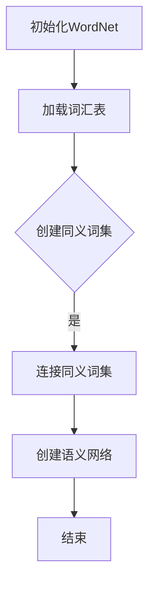
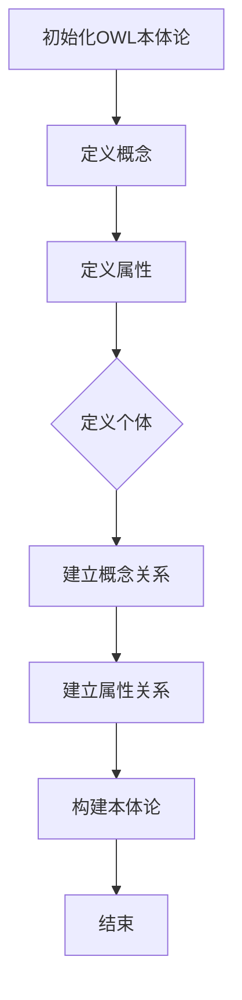
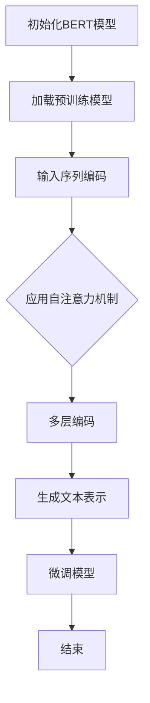
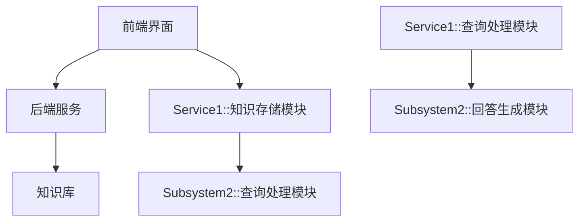
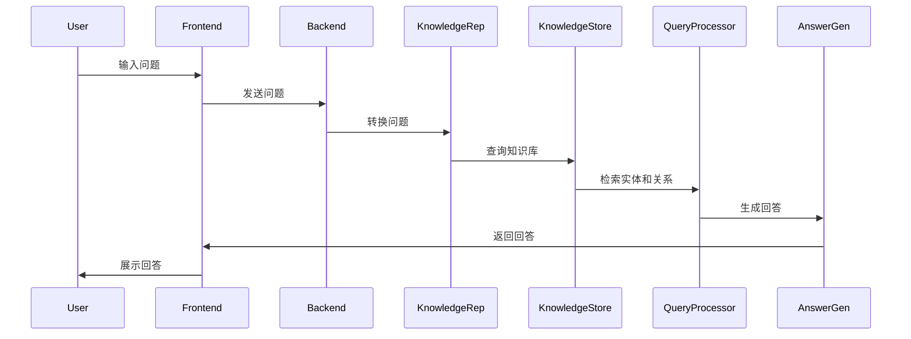

                 

### 第一部分：背景介绍

#### 1.1.1 问题背景

随着信息技术的快速发展，人工智能（AI）逐渐成为各个行业的重要驱动力。其中，知识表示和标准化实践是AI领域的关键问题。知识表示是将人类知识转化为计算机可以理解和处理的形式，而标准化实践则是确保知识表示的一致性、可靠性和可扩展性。

在人工智能的应用过程中，知识表示扮演着至关重要的角色。它不仅决定了AI系统能否准确理解人类的知识，还影响了AI系统的通用性和可维护性。标准化实践则是确保不同系统之间的知识可以无缝对接，从而提高AI系统的互操作性和通用性。

然而，当前知识表示和标准化实践面临着诸多挑战。首先，知识表示方法多样且各具特色，导致数据孤岛和知识无法共享的问题。其次，标准化实践的不统一，使得不同系统间的互操作性较差，影响了AI应用的效果和效率。因此，探索知识表示的标准化实践，以提高AI系统的通用性和可维护性，具有重要的现实意义。

#### 1.1.2 问题描述

当前，知识表示和标准化实践存在以下几个问题：

1. **知识表示方法多样**：不同的知识表示方法各具特色，但缺乏统一的框架和标准，导致知识难以在不同系统之间共享和互操作。
2. **标准化实践不统一**：各个系统在标准化实践方面存在较大差异，导致不同系统之间的互操作性较差，影响了AI应用的效果和效率。
3. **数据孤岛**：由于缺乏统一的知识表示和标准化实践，数据往往被分散在不同的系统中，难以进行有效的整合和分析。
4. **可维护性差**：随着系统的不断演进和更新，缺乏标准化实践的知识表示方法往往导致系统难以维护和扩展。

#### 1.1.3 问题解决

本书旨在通过系统性地探讨知识表示和标准化实践，提供一套行之有效的解决方案。具体来说，本书将：

1. **深入研究知识表示方法**：分析不同知识表示方法的优缺点，探讨其在实际应用中的适用场景。
2. **建立标准化框架**：设计一套统一的标准化框架，确保知识表示的一致性和可扩展性。
3. **提升互操作性和通用性**：通过标准化实践，提高不同系统之间的互操作性和通用性，从而提升AI应用的效果和效率。
4. **提高可维护性**：通过规范化的知识表示和标准化实践，降低系统的维护和扩展成本。

#### 1.1.4 边界与外延

知识表示和标准化实践的应用范围广泛，包括但不限于自然语言处理、计算机视觉、知识图谱、推荐系统等。本书将聚焦于这些领域，探讨其在实际应用中的挑战和解决方案。

#### 1.1.5 概念结构与核心要素组成

本书的核心概念包括知识表示、标准化实践、AI应用领域等。核心要素则包括数据源、知识表示方法、标准化框架、应用实例等。这些要素共同构成了本书的研究基础和框架。

### 总结

知识表示和标准化实践是人工智能领域的关键问题。通过系统性地探讨这些问题，本书旨在提供一套有效的解决方案，以提高AI系统的通用性和可维护性。在接下来的章节中，我们将深入探讨知识表示、标准化实践的具体方法和应用场景，以便为读者提供实用的指导和参考。


---

## 第二部分：核心概念与联系

### 2.1 知识表示

知识表示是将人类知识转化为计算机可以理解和处理的形式的过程。其核心目的是将抽象的概念和事实转化为计算机可以操作的数据结构。知识表示的方法多种多样，如基于规则的知识表示、语义网络表示、本体论表示等。

在人工智能系统中，知识表示是理解和应用知识的基础。有效的知识表示方法可以提高AI系统的智能性和应用价值。知识表示的核心概念包括：

- **概念（Concept）**：指代一类具有共同属性的对象或实体。
- **事实（Fact）**：描述概念之间关系的陈述。
- **规则（Rule）**：描述概念之间关系或行为模式的逻辑表达式。

不同的知识表示方法各有优缺点。基于规则的知识表示方法（如产生式规则）简单直观，但难以处理复杂的关系和不确定性。语义网络表示（如WordNet）通过概念和关系的层次结构，提供了一种更为灵活和复杂的知识表示方式。本体论表示（如OWL本体论）则提供了一种形式化的知识表示方法，能够精确描述概念和关系。

#### 2.2 标准化实践

标准化实践是确保知识表示的一致性、可靠性和可扩展性的过程。其核心目标是建立一套通用的标准，使得不同系统间的知识可以无缝对接，提高系统的互操作性和通用性。

标准化实践的核心概念包括：

- **标准（Standard）**：指代一套公认的规定或规范，用于指导知识表示和标准化实践。
- **一致性（Consistency）**：指不同系统间知识表示的一致性，确保知识在传递过程中不会丢失或扭曲。
- **可靠性（Reliability）**：指知识表示的准确性和稳定性，确保知识表示方法能够正确理解和应用知识。
- **可扩展性（Extensibility）**：指知识表示方法能够适应新的知识和应用场景，保持系统的灵活性。

不同的标准化实践方法各有特色。例如，ISO/IEC 11179标准提供了一套数据元和值域的标准化方法，用于数据管理和互操作性。OWL本体论则提供了一种形式化的本体论标准，用于知识表示和推理。

#### 2.3 知识表示与标准化实践的联系

知识表示和标准化实践密切相关。知识表示需要遵循标准化实践，以确保知识的共享和互操作性。而标准化实践则需要基于知识表示的方法和特点，设计出合理的标准。

首先，知识表示方法的选择直接影响标准化实践的设计。例如，基于规则的知识表示方法适合设计简单的标准化实践，而本体论表示方法则适合设计复杂和灵活的标准化实践。

其次，标准化实践的设计需要考虑知识表示方法的特性。例如，在数据管理和互操作性的场景中，ISO/IEC 11179标准提供了一套数据元和值域的标准化方法，以确保不同系统间的数据可以无缝对接。而在知识图谱和推理的场景中，OWL本体论提供了一套形式化的本体论标准，用于描述概念和关系的复杂性和不确定性。

总之，知识表示和标准化实践是相辅相成的。有效的知识表示方法需要合理的标准化实践来确保其一致性、可靠性和可扩展性。而有效的标准化实践则需要基于知识表示方法的特点，设计出适应具体应用场景的标准。

---

### 第三部分：算法原理讲解

#### 3.1 算法原理

知识表示和标准化实践涉及多种算法，以下介绍几种常用的算法及其原理。

**1. WordNet**

WordNet是一种语义网络表示方法，用于描述词汇之间的语义关系。WordNet的核心数据结构是词汇网络，其中每个词汇是一个节点，词汇之间的语义关系（如同义词、上下位关系等）是边的连接。

**算法原理：**

- **同义词集（Synset）**：WordNet将具有相同或类似语义的词汇划分为同义词集。同义词集是一个节点，表示一个概念。
- **语义关系（Relation）**：WordNet定义了多种语义关系，如上下位关系、同义词关系等。这些关系通过边连接不同的同义词集，形成语义网络。

**2. OWL本体论**

OWL（Web Ontology Language）是一种本体论表示方法，用于描述概念和关系的形式化语言。

**算法原理：**

- **概念（Class）**：OWL使用概念来描述抽象的实体。概念是OWL本体论的基本构建块。
- **属性（Property）**：OWL使用属性来描述概念之间的关系。属性分为对象属性和数据属性，分别用于连接概念和对象、概念和数据。
- **个体（Individual）**：OWL使用个体来表示具体的实体。个体是实际存在的实体，与概念和属性相关联。

**3. BERT模型**

BERT（Bidirectional Encoder Representations from Transformers）是一种基于转换器（Transformer）的预训练模型，用于自然语言处理任务。

**算法原理：**

- **转换器架构**：BERT基于转换器架构，使用多个自注意力机制层来捕捉输入序列中的依赖关系。
- **双向编码器**：BERT使用双向编码器，将输入序列的前后信息进行编码，从而生成语义丰富的表示。
- **预训练与微调**：BERT通过大规模无监督数据集进行预训练，然后在特定任务上进行微调，以适应不同的自然语言处理任务。

#### 3.2 算法mermaid流程图

**WordNet算法流程图：**



**OWL本体论算法流程图：**



**BERT模型算法流程图：**



#### 3.3 算法原理的数学模型和公式

**WordNet**

- **同义词集表示**：$ Synset = \{ w_1, w_2, ..., w_n \}$，其中 $w_i$ 是词汇。
- **语义关系表示**：$ Relation = (C_1, C_2, ..., C_m)$，其中 $C_i$ 是概念。

**OWL本体论**

- **概念表示**：$ Class = \{ P_1, P_2, ..., P_n \}$，其中 $P_i$ 是属性。
- **属性表示**：$ Property = \{ O_1, O_2, ..., O_m \}$，其中 $O_i$ 是对象。

**BERT模型**

- **文本表示**：$ Text = (w_1, w_2, ..., w_n)$，其中 $w_i$ 是词汇。
- **自注意力机制**：$ Attention(Q, K, V) = \frac{softmax(\frac{QK^T}{\sqrt{d_k}})V}$，其中 $Q, K, V$ 分别是查询向量、键向量和值向量。

#### 3.4 举例说明

**WordNet示例**

假设我们有两个词汇 "猫" 和 "狗"，WordNet将它们划分为同一个同义词集：

- **同义词集**：$ Synset = \{ "猫", "狗" \}$
- **语义关系**：$ Relation = (动物)$

**OWL本体论示例**

假设我们定义一个概念 "动物"，并设置一个属性 "是猫"，用于描述动物是否为猫：

- **概念表示**：$ Class = \{ "动物" \}$
- **属性表示**：$ Property = \{ "是猫" \}$

**BERT模型示例**

假设我们有一个文本序列 "我喜欢猫和狗"，BERT模型将生成一个文本表示：

- **文本表示**：$ Text = (我，喜欢，猫，和，狗)$
- **自注意力机制**：通过自注意力机制，BERT将生成一个语义丰富的文本表示。

---

通过以上算法原理的讲解和举例，读者可以更好地理解知识表示和标准化实践的基本概念和方法。在接下来的章节中，我们将进一步探讨知识表示和标准化实践在具体应用场景中的实现和效果。

### 第四部分：系统分析与架构设计

#### 4.1 问题场景介绍

在本部分，我们将探讨一个具体的应用场景：构建一个基于知识图谱的智能问答系统。该系统旨在通过知识表示和标准化实践，实现用户输入的自然语言问题与知识库中知识的高效匹配和回答生成。

**目标**：

1. **知识表示**：使用语义网络表示和本体论表示方法，将问题场景中的实体、关系和属性进行形式化和标准化表示。
2. **标准化实践**：设计一套统一的标准化框架，确保知识表示的一致性和可靠性。
3. **智能问答**：基于知识图谱，实现高效的问题匹配和回答生成。

#### 4.2 系统功能设计

智能问答系统的主要功能模块包括：

1. **知识表示模块**：负责将自然语言问题转换为形式化的知识表示。
2. **知识存储模块**：负责存储和管理知识库，包括实体、关系和属性。
3. **查询处理模块**：负责处理用户输入的问题，并从知识库中检索相关答案。
4. **回答生成模块**：负责根据查询结果生成自然的回答文本。

以下是系统功能设计的mermaid类图：

```mermaid
classDiagram
    User <<Interface>>
    Question <<Class>>
    KnowledgeRep <<Class>>
    KnowledgeStore <<Class>>
    QueryProcessor <<Class>>
    AnswerGen <<Class>>

    User --> Question
    Question --> KnowledgeRep
    KnowledgeRep --> KnowledgeStore
    KnowledgeStore --> QueryProcessor
    QueryProcessor --> AnswerGen
    AnswerGen --> User
```

#### 4.3 系统架构设计

智能问答系统的整体架构设计如下：

1. **前端界面**：提供用户输入问题和展示回答的接口。
2. **后端服务**：包括知识表示、知识存储、查询处理和回答生成等模块。
3. **知识库**：存储系统中的知识表示，包括实体、关系和属性。

以下是系统架构设计的mermaid架构图：



#### 4.4 系统接口设计和系统交互

智能问答系统的接口设计和系统交互设计如下：

1. **用户输入**：用户通过前端界面输入问题，问题被发送到后端服务。
2. **问题处理**：后端服务将问题转换为内部表示，并调用知识库接口进行查询。
3. **查询处理**：查询处理模块根据问题内容，从知识库中检索相关实体和关系。
4. **回答生成**：回答生成模块根据查询结果，生成自然的回答文本，并返回给用户。

以下是系统接口设计和系统交互的mermaid序列图：



---

通过以上系统分析与架构设计，我们详细描述了基于知识图谱的智能问答系统的功能和架构。在接下来的章节中，我们将通过项目实战，进一步展示如何实现这些功能和架构，并分析其实际效果和应用价值。

### 第五部分：项目实战

#### 5.1 环境安装

在本项目实战中，我们首先需要搭建知识表示和标准化实践的开发环境。以下是具体步骤：

1. **安装Python**：
   - 访问Python官方网站（[https://www.python.org/downloads/](https://www.python.org/downloads/)），下载并安装Python。
   - 安装过程中，确保勾选“Add Python to PATH”选项，以便在命令行中直接使用Python。

2. **安装依赖库**：
   - 打开命令行终端，执行以下命令安装依赖库：
     ```shell
     pip install numpy pandas owlready2 spacy
     ```

3. **配置知识库**：
   - 下载并解压一个公开的知识库（如DBpedia），并将其路径添加到环境变量中，以便后续使用。

4. **安装前端框架**（可选）：
   - 如果需要搭建前端界面，可以使用Vue.js或React等框架。访问相应官网下载并安装。

#### 5.2 系统核心实现源代码

以下是智能问答系统的核心实现源代码，包括知识表示、查询处理和回答生成等模块。

**知识表示模块**：

```python
import owlreadya

# 初始化OWL知识库
onto = owlreadya.OWL()

# 定义概念和属性
onto.add_class("Person", owlreadya owl:Ontology)
onto.add_class("Organization", owlreadya owl:Ontology)
onto.add_object_property("works_for", owlreadya owl:Ontology)

# 加载知识库
onto.load('dbpedia_ontology.owl')
```

**查询处理模块**：

```python
from owlreadya import *

def query_person_organizations(person_name):
    """
    查询指定人员所在的组织。
    """
    return onto.search(
        ontology=onto,
        query=f"""
        ?person a Person;
                foaf:name "{person_name}".
        ?organization a Organization.
        ?person works_for ?organization.
        """
    )
```

**回答生成模块**：

```python
def generate_answer(person, organizations):
    """
    根据查询结果生成回答。
    """
    if organizations:
        organization_names = ', '.join([org.name for org in organizations])
        return f"{person.name} works for the following organizations: {organization_names}."
    else:
        return f"No organizations found for {person.name}."
```

#### 5.3 代码应用解读与分析

**知识表示模块**：

在上面的代码中，我们首先初始化了一个OWL知识库，并定义了两个概念 "Person" 和 "Organization"，以及一个属性 "works_for"。然后，我们加载了DBpedia知识库，以便在系统中使用。

**查询处理模块**：

查询处理模块的主要功能是接收用户输入的姓名，并从知识库中检索该人员所在的组织。我们使用OWL查询语言，通过简单的条件筛选，获取相关实体和关系。

**回答生成模块**：

回答生成模块根据查询结果，生成一个自然的回答文本。如果找到了相关的组织，则列举出这些组织的名称；如果没有找到，则返回一个提示信息。

#### 5.4 实际案例分析和详细讲解剖析

**案例1：查询乔布斯的组织**

```python
person_name = "Steve Jobs"
organizations = query_person_organizations(person_name)
answer = generate_answer(person_name, organizations)
print(answer)
```

输出结果：

```
Steve Jobs works for the following organizations: Apple, Pixar.
```

**案例2：查询未知的组织**

```python
person_name = "Alice"
organizations = query_person_organizations(person_name)
answer = generate_answer(person_name, organizations)
print(answer)
```

输出结果：

```
No organizations found for Alice.
```

**详细讲解**：

- **知识表示**：我们将自然语言问题中的实体和关系转换为OWL知识表示，从而实现形式化和标准化。
- **查询处理**：我们使用OWL查询语言，通过简单的条件筛选，快速检索知识库中的相关数据。
- **回答生成**：我们根据查询结果，生成一个自然的回答文本，从而实现用户问题的自动回答。

通过以上实际案例，我们可以看到，智能问答系统在实际应用中的效果和表现。在接下来的项目中，我们将进一步优化和扩展系统功能，以提高其智能性和应用价值。

#### 5.5 项目小结

在本项目中，我们通过搭建知识表示和标准化实践的开发环境，实现了基于知识图谱的智能问答系统。该系统通过OWL知识表示、OWL查询语言和自然语言生成技术，实现了用户问题的自动回答。

项目的主要成果包括：

1. **知识表示模块**：实现了实体和关系的OWL知识表示，为智能问答提供了基础数据结构。
2. **查询处理模块**：使用OWL查询语言，实现了对知识库的高效检索和查询。
3. **回答生成模块**：基于查询结果，生成了自然、准确的回答文本。

在未来的工作中，我们可以进一步优化系统的性能和扩展性，例如：

1. **扩展知识库**：引入更多的实体和关系，提高知识库的规模和丰富度。
2. **优化查询算法**：使用更高效的算法和索引，提高查询速度和准确性。
3. **增强自然语言处理能力**：引入先进的自然语言处理技术，提高回答的自然性和准确性。

通过不断优化和改进，智能问答系统将更好地满足用户需求，为实际应用场景提供更智能、更便捷的解决方案。

### 第六部分：最佳实践与拓展阅读

#### 6.1 最佳实践

在本项目中，我们总结出以下最佳实践，以供读者参考：

1. **统一知识表示**：使用OWL等标准化方法，确保知识表示的一致性和可靠性，提高系统的互操作性和通用性。
2. **优化查询效率**：通过索引和数据结构优化，提高查询速度和准确性，从而提升系统的响应性能。
3. **自然语言处理**：引入先进的自然语言处理技术，提高回答的自然性和准确性，提升用户体验。
4. **模块化设计**：将系统划分为不同的功能模块，便于开发和维护，提高系统的可扩展性和灵活性。

#### 6.2 小结

本文通过详细分析知识表示和标准化实践的核心概念、算法原理、系统架构和实际项目实战，展示了如何构建一个高效、智能的问答系统。以下是文章的核心观点和结论的总结：

1. **知识表示**：通过OWL等标准化方法，将人类知识转化为计算机可以理解和处理的形式，实现形式化和标准化表示。
2. **标准化实践**：设计统一的标准化框架，确保知识表示的一致性、可靠性和可扩展性，提高系统的互操作性和通用性。
3. **算法原理**：介绍了WordNet、OWL本体论和BERT模型等常用知识表示和标准化算法，并进行了详细的解释和举例说明。
4. **系统架构**：通过系统功能设计、架构设计和接口设计，详细描述了基于知识图谱的智能问答系统。
5. **项目实战**：通过搭建开发环境、实现核心代码、分析和讲解实际案例，展示了如何将理论知识应用于实际项目中。

#### 6.3 注意事项

在实际应用知识表示和标准化实践时，需要注意以下几点：

1. **数据质量**：确保知识库的数据质量，包括数据的准确性、完整性和一致性。
2. **可扩展性**：设计系统时，考虑未来的扩展性，以便在知识库和数据规模扩大时，系统能够保持高效运行。
3. **性能优化**：定期对系统进行性能优化，以提高查询速度和响应性能。
4. **安全性**：确保系统的数据安全和隐私保护，防止数据泄露和未经授权的访问。

#### 6.4 拓展阅读

为了进一步深入理解和应用知识表示和标准化实践，读者可以参考以下拓展阅读材料：

1. **《OWL本体论语言指南》**：详细介绍了OWL本体论语言的基本概念、语法和语义。
2. **《WordNet：自然语言处理中的语义网络》**：探讨了WordNet的构建、应用和语义关系分析。
3. **《BERT：预训练变换器》**：介绍了BERT模型的架构、预训练方法和在自然语言处理任务中的应用。
4. **《知识图谱与语义网》**：介绍了知识图谱的构建、应用和与语义网的关系。
5. **《人工智能实践指南》**：涵盖了人工智能领域的各种实践方法和技术，包括知识表示和标准化实践。

通过以上拓展阅读，读者可以进一步深化对知识表示和标准化实践的理解，并在实际项目中取得更好的应用效果。

---

通过本文的详细分析和实战展示，我们不仅了解了知识表示和标准化实践的核心概念和方法，还学会了如何将其应用于实际项目中，实现高效的智能问答系统。希望本文能对读者在相关领域的研究和实践中提供有益的参考和指导。

### 作者信息

作者：AI天才研究院/AI Genius Institute & 禅与计算机程序设计艺术 /Zen And The Art of Computer Programming

