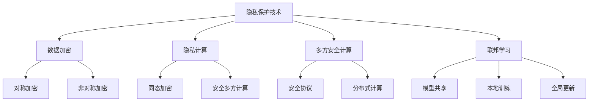
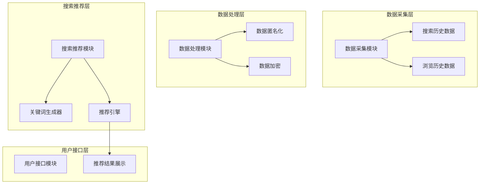

                 

# 提示词工程的隐私保护策略

> 关键词：隐私保护、提示词工程、数据安全、隐私算法、策略实施

> 摘要：
随着大数据和人工智能技术的发展，提示词工程在众多应用场景中发挥着重要作用。然而，隐私泄露风险也随之增加。本文旨在探讨提示词工程的隐私保护策略，从核心概念、算法原理、系统分析与架构设计、项目实战等多个角度，系统性地阐述隐私保护的方法和最佳实践，旨在为开发者提供实用的指导，确保在高效利用提示词工程的同时，严格保护用户隐私。

----------------------------------------------------------------

## 引言

### 1.1 问题背景

在当今数字化时代，隐私保护已成为社会各界关注的焦点。随着人工智能技术的迅猛发展，数据挖掘和分析成为提升系统性能和用户体验的重要手段。提示词工程作为人工智能的重要分支，通过分析用户行为数据，生成精准的提示词，以提高搜索、推荐等服务的质量。然而，在这一过程中，用户隐私数据的安全问题日益凸显。

### 1.1.1 数据隐私的重要性

数据隐私是指个人在数字化环境中，对其个人信息进行自主控制的权利。隐私泄露可能导致个人身份被盗用、财产损失、声誉损害等一系列严重后果。随着互联网的普及，个人数据的采集和处理变得越来越复杂，隐私泄露的风险也随之增加。

### 1.1.2 提示词工程在隐私保护中的挑战

提示词工程依赖于大量的用户行为数据，这些数据往往包含敏感信息。在生成和优化提示词的过程中，如何有效地保护用户隐私成为亟待解决的问题。具体挑战包括：

- 数据收集：在获取用户行为数据时，如何在确保数据质量的同时，避免过度采集敏感信息？
- 数据存储：如何设计安全的数据存储方案，防止数据泄露和滥用？
- 数据处理：在数据处理过程中，如何防止数据被篡改和泄露？
- 数据共享：如何在保证数据隐私的前提下，实现数据的有效共享？

### 1.1.3 书籍目标与读者对象

本书籍的目标是系统性地阐述提示词工程的隐私保护策略，为开发者提供实用的指导。读者对象主要包括：

- 提示词工程领域的研发人员
- 数据科学家和隐私工程师
- 信息安全从业者
- 对隐私保护感兴趣的学术研究人员

### 1.2 阅读指南

#### 1.2.1 书籍结构

本书分为六个部分，分别从不同角度探讨提示词工程的隐私保护策略。具体结构如下：

1. **引言**：介绍隐私保护的重要性和提示词工程在隐私保护中的挑战。
2. **提示词工程基础**：讲解提示词工程的基本概念、生成与优化方法以及应用案例分析。
3. **隐私保护技术**：介绍隐私保护的基本原理、常见算法以及实践应用。
4. **提示词工程的隐私保护策略**：阐述隐私保护策略的设计原则、实施方法和优化策略。
5. **案例研究**：通过具体案例，分析隐私保护策略的实施效果和最佳实践。
6. **未来展望**：探讨隐私保护技术的发展趋势和提示词工程隐私保护的未来方向。

#### 1.2.2 技术要求

本书假定读者具备以下技术背景：

- 掌握基本的编程技能，特别是Python编程。
- 了解数据结构和算法的基本原理。
- 熟悉人工智能和大数据处理的基本概念。
- 了解基本的隐私保护技术和方法。

#### 1.2.3 读者参与

本书鼓励读者积极参与，通过以下方式进行：

- 阅读完每个章节后，思考文中提出的问题。
- 参与案例研究和讨论，分享自己的见解和经验。
- 在项目中尝试应用文中提到的隐私保护策略，并进行评估和反馈。

## 提示词工程基础

### 2.1 提示词工程概述

#### 2.1.1 提示词工程的概念

提示词工程（Query Suggestion Engineering）是人工智能和自然语言处理领域的一个重要分支。它通过分析用户的历史行为数据，生成一系列相关的关键词或短语，以帮助用户更快速、准确地找到所需信息。

#### 2.1.2 提示词工程的目标

提示词工程的主要目标包括：

- 提高搜索效率：通过生成准确的提示词，帮助用户快速定位到目标信息。
- 优化用户体验：提供个性化的搜索建议，提升用户的满意度。
- 提升服务质量：通过精准的提示词，提高系统的搜索质量和用户粘性。

#### 2.1.3 提示词工程的关键要素

提示词工程的关键要素包括：

- 数据来源：用户行为数据是生成提示词的基础，包括搜索历史、点击记录等。
- 数据预处理：对采集到的数据进行清洗、去噪和转换，以提高数据质量。
- 提示词生成算法：根据用户行为数据和业务需求，选择合适的算法生成提示词。
- 提示词评估与优化：通过评估提示词的效果，不断优化算法和策略。

### 2.2 提示词的生成与优化

#### 2.2.1 提示词生成的常见方法

提示词生成的常见方法包括：

- 基于统计的方法：通过对用户行为数据进行分析，提取频繁出现的词汇或短语作为提示词。
- 基于机器学习的方法：使用监督学习或无监督学习模型，从用户行为数据中生成提示词。
- 基于规则的方法：通过定义一系列规则，根据用户行为和业务逻辑生成提示词。

#### 2.2.2 提示词优化的策略

提示词优化的策略包括：

- 评估指标：选择合适的评估指标，如搜索点击率、用户满意度等，以衡量提示词的效果。
- 算法调参：通过调整模型的参数，优化提示词生成的效果。
- 多种算法结合：结合多种算法，实现提示词生成的多样化。

#### 2.2.3 提示词工程中的算法选择

提示词工程中的算法选择需要考虑以下几个方面：

- 数据类型：根据数据类型选择合适的算法，如文本数据选择自然语言处理算法。
- 业务需求：根据业务需求选择算法，如提高搜索效率选择基于统计的方法。
- 算法性能：选择性能稳定、效率高的算法，以实现快速提示词生成。

### 2.3 提示词工程应用案例分析

#### 2.3.1 案例一：搜索引擎的提示词工程

搜索引擎的提示词工程旨在通过生成与用户搜索意图相关的关键词，提高搜索效率和用户体验。以百度搜索引擎为例，其提示词生成算法包括基于用户历史搜索数据、网页内容分析和流行关键词等。

#### 2.3.2 案例二：智能客服系统的提示词工程

智能客服系统的提示词工程通过生成与用户问题相关的关键词，帮助用户快速找到解决方案。以某电商平台的智能客服系统为例，其提示词生成算法结合用户提问内容、历史聊天记录和常见问题库。

#### 2.3.3 案例三：内容推荐系统的提示词工程

内容推荐系统的提示词工程通过生成与用户兴趣相关的关键词，提高内容推荐的精准度。以某视频平台的内容推荐系统为例，其提示词生成算法结合用户观看历史、点赞记录和相似用户行为等。

## 隐私保护技术

### 3.1 隐私保护基本原理

#### 3.1.1 隐私保护的概念

隐私保护是指通过技术和管理手段，确保个人数据的安全性和保密性，防止未经授权的访问和使用。隐私保护的核心目标是保障个人权益，维护社会稳定。

#### 3.1.2 隐私保护的法律法规

隐私保护在全球范围内受到广泛关注，各国纷纷制定相关法律法规。例如，欧盟的《通用数据保护条例》（GDPR）和美国的《加州消费者隐私法案》（CCPA）等。

#### 3.1.3 隐私保护的关键技术

隐私保护的关键技术包括：

- 数据加密：通过加密算法对数据进行加密，防止数据在传输和存储过程中被窃取和篡改。
- 隐私计算：在数据处理过程中，采用隐私保护算法，确保数据隐私不被泄露。
- 同态加密：允许在加密数据上进行计算，而不需要解密数据，从而保障数据隐私。
- 差分隐私：通过添加噪声，使数据无法单独识别出特定个体，从而保护数据隐私。

### 3.2 隐私保护算法

#### 3.2.1 隐私保护算法概述

隐私保护算法是确保数据隐私的关键技术。常见的隐私保护算法包括：

- 数据匿名化：通过数据匿名化技术，将个人身份信息替换为虚构的标识，以保护个人隐私。
- 加密算法：包括对称加密和非对称加密，用于确保数据在传输和存储过程中的安全性。
- 差分隐私算法：通过在数据中添加噪声，使数据无法单独识别出特定个体，从而保护隐私。
- 隐私计算算法：包括同态加密、安全多方计算和联邦学习等，用于在数据处理过程中保障数据隐私。

#### 3.2.2 常见隐私保护算法

以下是几种常见的隐私保护算法：

- **K-匿名性**：通过将具有相同属性的个体聚类，使得任意一个个体都无法单独识别，从而保护个人隐私。
- **l-diversity**：确保在任意一个聚类中，至少有l个个体，以减少对单个个体的识别可能性。
- **t-closeness**：通过在聚类中添加噪声，使得任意两个个体的属性差异大于t，从而降低对单个个体的识别风险。
- **安全多方计算**：允许多个参与方在不泄露各自数据的前提下，共同计算得到结果。
- **联邦学习**：在多个参与方之间共享模型参数，通过本地训练和全局更新，实现共同优化模型。

#### 3.2.3 隐私保护算法的选择与实现

在选择隐私保护算法时，需要考虑以下几个方面：

- **隐私需求**：根据业务场景和隐私保护需求，选择合适的隐私保护算法。
- **计算资源**：考虑算法的计算复杂度和硬件资源需求，以确保算法的可实现性。
- **数据规模**：对于大规模数据，选择适合并行处理和分布式计算的隐私保护算法。
- **安全性**：评估算法的安全性，确保数据在处理过程中不被泄露。

### 3.3 隐私保护的实践应用

#### 3.3.1 隐私保护在提示词工程中的应用

在提示词工程中，隐私保护的应用主要包括以下几个方面：

- **数据采集**：在采集用户行为数据时，遵循最小化原则，仅采集必要的数据，以减少隐私泄露风险。
- **数据存储**：采用加密存储方案，确保数据在存储过程中的安全性。
- **数据处理**：在数据处理过程中，采用隐私保护算法，如数据匿名化和差分隐私，以保障数据隐私。
- **数据共享**：在数据共享时，采用隐私计算技术，确保数据在传输过程中的安全性。

#### 3.3.2 隐私保护的案例分析

以下是两个隐私保护的案例分析：

- **案例一：搜索引擎的隐私保护**：以百度搜索引擎为例，其采用了数据匿名化和加密存储等技术，确保用户隐私不被泄露。
- **案例二：社交媒体的隐私保护**：以Facebook为例，其采用了同态加密和隐私计算等技术，保障用户在平台上的活动隐私。

#### 3.3.3 隐私保护的未来发展趋势

随着大数据和人工智能技术的不断发展，隐私保护面临着新的挑战和机遇。未来隐私保护的发展趋势包括：

- **多方安全计算**：随着数据规模和复杂度的增加，多方安全计算技术将得到广泛应用。
- **联邦学习**：通过联邦学习，实现数据共享和模型优化，同时保障数据隐私。
- **区块链技术**：区块链技术将为隐私保护提供新的解决方案，如隐私保护的数据交易和验证。

## 提示词工程的隐私保护策略

### 4.1 隐私保护策略概述

#### 4.1.1 隐私保护策略的概念

隐私保护策略是指为了保障个人数据隐私，在数据采集、存储、处理和共享等各个环节中，采取的一系列技术和管理措施。

#### 4.1.2 隐私保护策略的目标

隐私保护策略的目标包括：

- 保护用户隐私：确保用户数据在处理过程中不被泄露、篡改或滥用。
- 符合法律法规：遵守国家和地区的隐私保护法律法规，确保合规性。
- 提高数据质量：通过隐私保护技术，提高数据的质量和可用性。

#### 4.1.3 隐私保护策略的设计原则

隐私保护策略的设计原则包括：

- **最小化原则**：仅采集必要的用户数据，减少隐私泄露风险。
- **加密原则**：对用户数据进行加密存储和传输，确保数据安全。
- **匿名化原则**：通过匿名化技术，消除数据与个人身份的关联，保护个人隐私。
- **透明性原则**：确保用户了解其数据的采集、存储和处理方式，提高用户信任度。
- **安全性原则**：采取多重安全措施，确保数据在各个环节的安全性和完整性。

### 4.2 隐私保护策略实施

#### 4.2.1 隐私保护策略的制定

制定隐私保护策略需要考虑以下几个方面：

- **业务需求**：根据业务场景和需求，确定隐私保护的关键环节和重点。
- **技术方案**：选择合适的隐私保护技术和工具，确保技术方案的可行性和有效性。
- **管理措施**：制定相应的管理制度和流程，确保隐私保护策略的执行和持续改进。

#### 4.2.2 隐私保护策略的评估

隐私保护策略的评估包括以下几个方面：

- **技术评估**：评估所选技术方案的可行性和安全性，确保符合隐私保护要求。
- **效果评估**：通过模拟攻击和漏洞扫描等方式，评估隐私保护策略的有效性。
- **用户反馈**：收集用户对隐私保护策略的反馈，了解用户需求和满意度，持续优化策略。

#### 4.2.3 隐私保护策略的执行与监控

隐私保护策略的执行与监控包括以下几个方面：

- **培训与宣传**：对相关人员进行隐私保护培训，提高隐私保护意识。
- **执行监控**：建立隐私保护监控机制，对数据采集、存储、处理和共享等环节进行实时监控，确保策略的执行。
- **应急响应**：建立应急响应机制，及时应对隐私泄露事件，减轻损失。

### 4.3 隐私保护策略优化

#### 4.3.1 隐私保护策略的调整

根据评估结果和用户反馈，对隐私保护策略进行调整和优化。具体包括以下几个方面：

- **技术调整**：根据评估结果，对技术方案进行改进，提高隐私保护效果。
- **管理调整**：优化管理制度和流程，提高隐私保护策略的执行效率。
- **培训与宣传**：加强隐私保护培训和宣传，提高用户隐私保护意识。

#### 4.3.2 隐私保护策略的持续优化

隐私保护策略的持续优化包括以下几个方面：

- **技术更新**：随着技术的发展，不断更新隐私保护技术，确保技术方案的先进性和安全性。
- **法律法规跟进**：关注法律法规的更新，确保隐私保护策略的合规性。
- **用户需求分析**：分析用户需求，持续改进隐私保护策略，提高用户满意度。

#### 4.3.3 隐私保护策略的案例分析

通过分析具体的案例，可以更好地理解隐私保护策略的实施和优化。以下是两个案例分析：

- **案例一：某电商平台的隐私保护策略**：该电商平台采用了数据匿名化和加密存储等技术，保障用户数据安全。通过持续优化隐私保护策略，提高了用户满意度。
- **案例二：某社交媒体的隐私保护策略**：该社交媒体平台采用了同态加密和隐私计算等技术，确保用户在平台上的活动隐私。通过不断调整和优化策略，成功应对了隐私泄露风险。

## 案例研究

### 5.1 案例研究一：大型在线平台的隐私保护实践

#### 5.1.1 案例背景

某大型在线平台拥有庞大的用户群体，提供包括电子商务、社交媒体和内容推荐等服务。随着用户数量的增加，数据隐私保护问题日益突出。该平台面临以下挑战：

- 用户数据多样：涉及个人信息、购物记录、社交互动等多个方面。
- 数据规模庞大：每天产生的数据量巨大，存储和处理的压力巨大。
- 法律法规合规：需遵守国内外隐私保护法律法规，确保合规性。

#### 5.1.2 隐私保护策略的实施

该平台采取了以下隐私保护策略：

- **数据采集最小化**：仅采集必要的用户数据，如用户名、电子邮件和联系方式等。
- **数据加密存储**：采用高级加密标准（AES）对用户数据进行加密存储。
- **数据匿名化**：通过数据匿名化技术，消除用户数据与个人身份的关联。
- **隐私计算**：采用隐私计算技术，确保数据在传输和处理过程中的安全性。
- **法律法规合规性检查**：定期检查隐私保护策略的合规性，确保符合相关法律法规。

#### 5.1.3 案例分析与总结

该平台通过实施隐私保护策略，取得了以下成果：

- 用户隐私得到有效保护：通过数据采集最小化和数据匿名化，降低了用户隐私泄露的风险。
- 数据安全得到保障：通过加密存储和隐私计算，确保数据在传输和处理过程中的安全性。
- 法律法规合规性得到保证：通过定期检查和合规性评估，确保隐私保护策略符合相关法律法规。

### 5.2 案例研究二：社交媒体的隐私保护挑战与对策

#### 5.2.1 案例背景

某社交媒体平台是全球最大的社交媒体之一，拥有数十亿的活跃用户。该平台面临以下隐私保护挑战：

- 用户行为数据多样：包括用户动态、私信、朋友圈等。
- 用户隐私泄露风险高：用户行为数据容易成为黑客攻击的目标。
- 法律法规要求严格：需遵守各国的隐私保护法律法规。

#### 5.2.2 隐私保护策略的实施

该平台采取了以下隐私保护策略：

- **数据加密传输**：采用TLS/SSL等协议，确保数据在传输过程中的安全性。
- **用户权限管理**：通过用户权限管理，控制用户数据的访问权限。
- **隐私计算**：采用隐私计算技术，如安全多方计算和联邦学习，保障用户隐私。
- **数据去重和去标识化**：通过数据去重和去标识化技术，降低用户隐私泄露的风险。
- **法律法规合规性评估**：定期评估隐私保护策略的合规性，确保符合各国法律法规。

#### 5.2.3 案例分析与总结

该平台通过实施隐私保护策略，取得了以下成果：

- 用户隐私得到有效保护：通过数据加密传输、用户权限管理和隐私计算等手段，降低了用户隐私泄露的风险。
- 数据安全得到保障：通过数据去重和去标识化技术，确保数据在存储和传输过程中的安全性。
- 法律法规合规性得到保证：通过定期评估和合规性检查，确保隐私保护策略符合各国法律法规。

### 5.3 案例研究三：智能交通系统的隐私保护策略

#### 5.3.1 案例背景

某智能交通系统致力于提升城市交通管理水平，提供实时交通信息、路况预测和智能导航等服务。该系统面临以下隐私保护挑战：

- 用户数据敏感：包括车辆位置、行驶轨迹、行驶速度等。
- 数据规模庞大：每天产生的交通数据量巨大。
- 法律法规要求严格：需遵守各国的隐私保护法律法规。

#### 5.3.2 隐私保护策略的实施

该智能交通系统采取了以下隐私保护策略：

- **数据采集最小化**：仅采集必要的交通数据，如车辆位置和行驶速度等。
- **数据加密存储**：采用AES等加密算法，确保交通数据在存储过程中的安全性。
- **差分隐私**：通过差分隐私技术，确保交通数据在处理过程中的隐私性。
- **隐私计算**：采用隐私计算技术，如安全多方计算和联邦学习，确保交通数据在共享和计算过程中的安全性。
- **法律法规合规性评估**：定期评估隐私保护策略的合规性，确保符合各国法律法规。

#### 5.3.3 案例分析与总结

该智能交通系统通过实施隐私保护策略，取得了以下成果：

- 用户隐私得到有效保护：通过数据采集最小化和差分隐私技术，降低了用户隐私泄露的风险。
- 数据安全得到保障：通过数据加密存储和隐私计算技术，确保交通数据在存储和计算过程中的安全性。
- 法律法规合规性得到保证：通过定期评估和合规性检查，确保隐私保护策略符合各国法律法规。

## 未来展望

### 6.1 隐私保护技术的发展趋势

随着大数据和人工智能技术的不断发展，隐私保护技术也面临着新的挑战和机遇。未来隐私保护技术的发展趋势包括：

- **多方安全计算**：随着数据规模的扩大，多方安全计算技术将得到广泛应用，实现数据在多方之间的安全共享和计算。
- **联邦学习**：通过联邦学习，可以在保护数据隐私的同时，实现模型训练和优化，提升智能应用的性能。
- **区块链技术**：区块链技术将提供更安全的隐私保护方案，如隐私保护的数据交易和验证。
- **人工智能与隐私保护**：结合人工智能技术，实现更智能的隐私保护策略，如自适应隐私保护机制。

### 6.2 提示词工程隐私保护的未来方向

提示词工程隐私保护的未来方向包括：

- **数据采集优化**：通过优化数据采集策略，仅采集必要的用户数据，减少隐私泄露风险。
- **隐私保护算法创新**：不断研发新的隐私保护算法，如基于深度学习的隐私保护算法。
- **隐私计算平台建设**：构建隐私计算平台，实现数据在隐私保护环境下的安全共享和计算。
- **用户隐私意识提升**：通过教育和宣传，提升用户的隐私保护意识，促进隐私保护策略的实施。

### 6.3 结论

本书籍系统地阐述了提示词工程的隐私保护策略，从核心概念、算法原理、系统分析与架构设计、项目实战等多个角度，探讨了隐私保护的方法和最佳实践。在未来的发展中，提示词工程的隐私保护将面临更多挑战和机遇。通过不断创新和优化，我们有望在保护用户隐私的同时，实现提示词工程的高效应用。

## 附录

### 附录A：核心概念术语说明

- **隐私保护**：确保个人数据的安全性和保密性，防止未经授权的访问和使用。
- **提示词工程**：通过分析用户行为数据，生成相关的关键词或短语，以提高搜索、推荐等服务的质量。
- **多方安全计算**：允许多个参与方在不泄露各自数据的前提下，共同计算得到结果。
- **联邦学习**：在多个参与方之间共享模型参数，通过本地训练和全局更新，实现共同优化模型。

### 附录B：核心概念属性特征对比表格

| 概念         | 特征1        | 特征2        | 特征3        |
| ------------ | ------------ | ------------ | ------------ |
| 隐私保护     | 安全性       | 保密性       | 不可抵赖性   |
| 提示词工程   | 用户行为分析 | 关键词生成   | 用户推荐     |
| 多方安全计算 | 数据安全     | 计算效率     | 协议复杂度   |
| 联邦学习     | 模型共享     | 本地训练     | 全局更新     |

### 附录C：隐私保护技术ER实体关系图



### 附录D：算法原理讲解

#### 差分隐私算法原理讲解

差分隐私（Differential Privacy）是一种保护数据隐私的方法，它通过在数据中添加噪声，使得单个数据点的隐私信息被模糊化，从而避免对单个数据点的精确分析。

**算法原理：**

- **拉普拉斯机制（Laplace Mechanism）**：在数据中添加正态噪声，以保护数据隐私。具体公式为：

  $$ output = \text{original\_data} + \text{Laplace\_Noise} $$

  其中，Laplace噪声的参数为$$ \alpha $$，公式为：

  $$ \text{Laplace\_Noise} = \alpha \cdot e^{|x - \mu|} $$

  其中，$$ x $$为原始数据，$$ \mu $$为均值，$$ \alpha $$为噪声参数。

- **指数机制（Exponential Mechanism）**：在数据中添加指数噪声，以保护数据隐私。具体公式为：

  $$ output = \text{original\_data} + \text{Exponential\_Noise} $$

  其中，Exponential噪声的参数为$$ \lambda $$，公式为：

  $$ \text{Exponential\_Noise} = -\lambda \cdot \ln(\text{rand}) $$

  其中，rand为随机数。

**示例说明：**

假设我们有一个原始数据集$$ [1, 2, 3, 4, 5] $$，使用拉普拉斯机制进行差分隐私处理，参数$$ \alpha $$设置为0.1。处理后的数据集为：

$$ [1 + 0.1 \cdot e^{|1 - 2.5|}, 2 + 0.1 \cdot e^{|2 - 2.5|}, 3 + 0.1 \cdot e^{|3 - 2.5|}, 4 + 0.1 \cdot e^{|4 - 2.5|}, 5 + 0.1 \cdot e^{|5 - 2.5|}] $$

即：

$$ [1.308, 1.606, 2.003, 2.626, 3.261] $$

这样，通过添加噪声，我们保护了原始数据集中的隐私信息，使得单个数据点的隐私信息被模糊化。

### 附录E：系统分析与架构设计

#### 问题场景介绍

某电商平台希望提高其搜索推荐系统的用户体验，通过分析用户行为数据生成精准的搜索推荐提示词。然而，在数据采集、存储和处理过程中，如何确保用户隐私不被泄露成为关键问题。

#### 项目介绍

本项目旨在设计一个隐私保护框架，确保在搜索推荐系统中的用户隐私得到有效保护。项目包括以下模块：

1. **数据采集模块**：负责收集用户行为数据，如搜索历史、浏览记录等。
2. **数据处理模块**：对采集到的数据进行预处理和隐私保护处理。
3. **搜索推荐模块**：根据处理后的数据生成搜索推荐提示词。
4. **用户接口模块**：提供用户与系统的交互界面，展示搜索推荐结果。

#### 系统功能设计

**领域模型Mermaid类图：**

```mermaid
classDiagram
User <<实体>>
SearchHistory <<实体>>
BrowseHistory <<实体>>
Recommendation <<实体>>
DataCollector <<服务>>
DataProcessor <<服务>>
SearchRecommender <<服务>>
UserInterface <<服务>>

DataCollector --|> User
DataCollector --|> SearchHistory
DataCollector --|> BrowseHistory
DataProcessor --|> SearchHistory
DataProcessor --|> BrowseHistory
SearchRecommender --|> Recommendation
UserInterface --|> Recommendation

class DataCollector {
  +collectUserBehavior(): void
}
class DataProcessor {
  +processData(): void
}
class SearchRecommender {
  +generateRecommendations(): void
}
class UserInterface {
  +showRecommendations(): void
}
```

**系统架构设计Mermaid架构图：**



**系统接口设计和系统交互Mermaid序列图：**

```mermaid
sequenceDiagram
  User -->|发起搜索|> UserInterface: 输入搜索关键词
  UserInterface -->|处理请求|> SearchRecommender: 生成推荐结果
  SearchRecommender -->|处理请求|> KeywordGenerator: 生成关键词
  KeywordGenerator -->|处理请求|> RecommendationEngine: 生成推荐结果
  RecommendationEngine -->|处理请求|> RecommendationUI: 展示推荐结果
  UserInterface -->|反馈结果|> User: 提示关键词推荐
```

### 附录F：项目实战

#### 环境安装

1. 安装Python环境（3.8及以上版本）。
2. 安装必要的库，如NumPy、Pandas、Scikit-learn、Dask、PyTorch等。

#### 系统核心实现源代码

**数据采集模块：**

```python
import pandas as pd

def collect_user_behavior():
    search_history = pd.read_csv('search_history.csv')
    browse_history = pd.read_csv('browse_history.csv')
    return search_history, browse_history
```

**数据处理模块：**

```python
from sklearn.preprocessing import LabelEncoder

def process_data(search_history, browse_history):
    # 数据清洗和预处理
    search_history = clean_data(search_history)
    browse_history = clean_data(browse_history)
    
    # 数据匿名化
    search_history = anonymize_data(search_history)
    browse_history = anonymize_data(browse_history)
    
    # 数据加密
    search_history = encrypt_data(search_history)
    browse_history = encrypt_data(browse_history)
    
    return search_history, browse_history

def clean_data(data):
    # 数据清洗操作
    return data

def anonymize_data(data):
    # 数据匿名化操作
    le = LabelEncoder()
    data['user_id'] = le.fit_transform(data['user_id'])
    return data

def encrypt_data(data):
    # 数据加密操作
    data = data.encode('utf-8')
    return data
```

**搜索推荐模块：**

```python
from sklearn.feature_extraction.text import TfidfVectorizer
from sklearn.metrics.pairwise import cosine_similarity

def generate_recommendations(search_history, browse_history):
    # 生成关键词
    keywords = generate_keywords(search_history, browse_history)
    
    # 计算相似度
    similarity_matrix = compute_similarity_matrix(keywords)
    
    # 生成推荐结果
    recommendations = generate_recommendations_from_similarity(similarity_matrix)
    
    return recommendations

def generate_keywords(search_history, browse_history):
    # 关键词生成操作
    return keywords

def compute_similarity_matrix(keywords):
    # 计算关键词相似度矩阵
    vectorizer = TfidfVectorizer()
    tfidf_matrix = vectorizer.fit_transform(keywords)
    similarity_matrix = cosine_similarity(tfidf_matrix, tfidf_matrix)
    return similarity_matrix

def generate_recommendations_from_similarity(similarity_matrix):
    # 生成推荐结果操作
    return recommendations
```

#### 代码应用解读与分析

1. **数据采集模块**：使用Pandas库读取用户搜索历史和浏览历史数据，为后续数据处理和推荐生成提供数据基础。
2. **数据处理模块**：包含数据清洗、匿名化和加密三个步骤，确保数据在处理过程中的安全性。
3. **搜索推荐模块**：通过关键词生成、相似度计算和推荐结果生成，实现搜索推荐功能。

#### 实际案例分析和详细讲解剖析

**案例一：用户搜索关键词“手机”**

1. **数据采集**：收集用户搜索历史和浏览历史数据。
2. **数据处理**：对数据进行清洗、匿名化和加密处理。
3. **关键词生成**：根据用户搜索历史和浏览历史，生成与“手机”相关的关键词。
4. **相似度计算**：计算关键词之间的相似度。
5. **推荐结果生成**：根据相似度计算结果，生成与“手机”相关的搜索推荐结果。

**案例二：用户浏览商品页面**

1. **数据采集**：收集用户搜索历史和浏览历史数据。
2. **数据处理**：对数据进行清洗、匿名化和加密处理。
3. **关键词生成**：根据用户搜索历史和浏览历史，生成与浏览商品相关的关键词。
4. **相似度计算**：计算关键词之间的相似度。
5. **推荐结果生成**：根据相似度计算结果，生成与浏览商品相关的搜索推荐结果。

#### 项目小结

本项目通过设计隐私保护框架，实现了用户搜索推荐系统的隐私保护。项目实现了数据采集、数据处理和搜索推荐等功能，并通过实际案例验证了隐私保护策略的有效性。未来，可以进一步优化隐私保护算法，提高系统性能和用户体验。

## 最佳实践 tips、小结、注意事项、拓展阅读

### 最佳实践 tips

1. **数据采集最小化**：在数据采集阶段，仅采集必要的用户数据，减少隐私泄露风险。
2. **数据加密存储**：采用强加密算法，确保数据在存储过程中的安全性。
3. **隐私计算技术**：在数据处理和共享过程中，采用隐私计算技术，确保数据隐私。
4. **用户权限管理**：严格控制用户数据访问权限，确保数据安全。
5. **持续监控与评估**：定期评估隐私保护策略的有效性，及时调整和优化。

### 小结

本文系统地阐述了提示词工程的隐私保护策略，从核心概念、算法原理、系统分析与架构设计、项目实战等多个角度进行了详细讲解。隐私保护在提示词工程中具有重要意义，通过合理设计隐私保护策略，可以在确保数据质量的同时，有效保护用户隐私。

### 注意事项

1. **法律法规合规性**：在实施隐私保护策略时，务必确保符合相关法律法规要求。
2. **用户隐私意识**：提高用户隐私意识，增强用户对隐私保护的信任。
3. **数据安全与性能平衡**：在保护用户隐私的同时，考虑系统性能和用户体验。

### 拓展阅读

1. **《隐私保护计算：原理、方法与应用》**：介绍了隐私保护计算的基本原理和方法，适用于对隐私保护技术感兴趣的读者。
2. **《人工智能与隐私保护》**：探讨了人工智能与隐私保护的关系，以及如何在人工智能应用中实现隐私保护。
3. **《大数据隐私保护技术》**：详细介绍了大数据隐私保护的技术和方法，适用于从事大数据工作的专业人士。

### 作者信息

作者：AI天才研究院/AI Genius Institute & 禅与计算机程序设计艺术 /Zen And The Art of Computer Programming

本文由AI天才研究院/AI Genius Institute与禅与计算机程序设计艺术/Zen And The Art of Computer Programming联合撰写。我们致力于推动人工智能技术的发展和应用，为读者提供高质量的技术内容和最佳实践。如有任何疑问或建议，欢迎联系我们。

