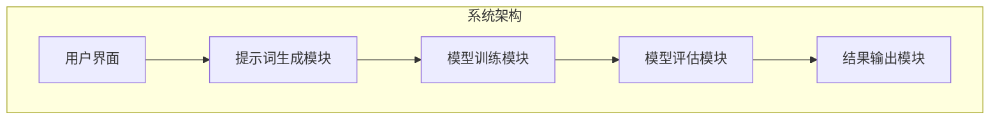
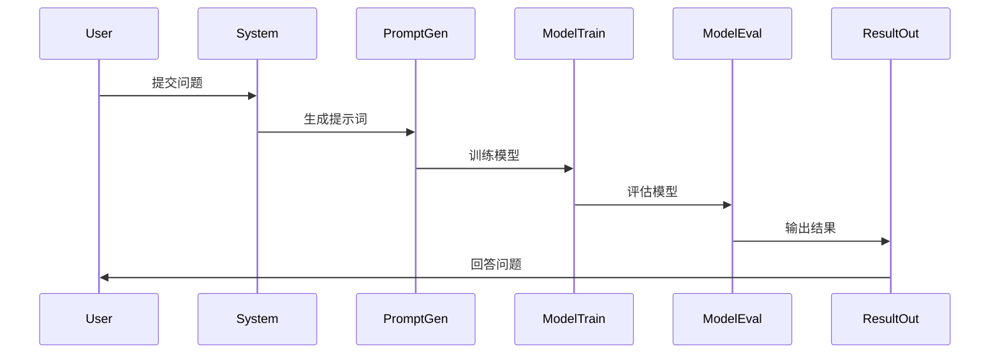

                 


## 引言

在当今信息化时代，人工智能技术正以迅猛的态势改变着我们的世界。在众多人工智能技术中，提示词工程（Prompt Engineering）作为自然语言处理（NLP）领域的一项关键技术，正逐渐受到广泛关注。提示词工程艺术这本书，正是为了帮助读者深入理解和掌握这一技术而诞生的。

首先，我们需要明确什么是提示词工程。提示词工程是一种通过设计和优化提示词（prompts）来提高模型性能的方法。提示词通常是一段引导性的文本，用来引导模型进行学习和推理。它们在机器学习和自然语言处理中扮演着至关重要的角色，是连接输入数据和模型输出结果的重要桥梁。

### 第一步：背景介绍

#### 问题背景

随着深度学习和自然语言处理技术的不断发展，模型的复杂性和性能不断提高。然而，这些模型在处理实际问题时，仍然面临着诸多挑战，如数据不足、问题理解不准确、生成结果不连贯等。这些问题促使研究人员开始探索如何通过优化提示词来提升模型的表现。

#### 描述问题

在实际应用中，提示词工程面临的主要问题包括：

1. **问题理解**：如何确保模型能够准确理解用户的问题。
2. **数据质量**：如何从大量数据中筛选出高质量的提示词。
3. **多样性**：如何生成多样化的提示词，以应对不同的应用场景。
4. **效率**：如何提高提示词工程的效率和可扩展性。

#### 问题解决

《提示词工程艺术》这本书旨在解决上述问题，通过系统化的方法，帮助读者掌握提示词工程的核心概念、算法和最佳实践。

#### 边界与外延

提示词工程不仅适用于自然语言处理领域，还可以推广到其他人工智能应用场景，如计算机视觉、语音识别等。本书将主要关注自然语言处理中的提示词工程，但也会涉及到一些跨领域的应用。

#### 概念结构与核心要素组成

提示词工程的核心概念包括：

1. **提示词**：引导模型进行学习和推理的文本。
2. **数据集**：用于训练和评估模型的文本数据。
3. **模型**：实现自然语言处理的算法和架构。
4. **评估指标**：衡量提示词质量和模型性能的标准。

### 第二步：核心概念与联系

#### 核心概念原理

提示词工程中的核心概念包括提示词、数据集、模型和评估指标。这些概念相互联系，共同构成了提示词工程的理论基础。

1. **提示词**：提示词是引导模型进行学习和推理的文本。一个好的提示词应该能够清晰、准确地传达用户的问题，同时激发模型的思考。
2. **数据集**：数据集是训练和评估模型的基础。高质量的提示词工程需要依赖于高质量的数据集，这包括数据的多样性、覆盖度和准确性。
3. **模型**：模型是自然语言处理的实现形式。不同的模型适用于不同的任务和场景，选择合适的模型对于提示词工程至关重要。
4. **评估指标**：评估指标是衡量提示词质量和模型性能的标准。常用的评估指标包括准确率、召回率、F1分数等。

#### 概念属性特征对比表格

| 概念   | 描述                     | 关键属性特征          |
| ------ | ------------------------ | --------------------- |
| 提示词 | 引导模型学习的文本       | 清晰、准确、引导性强   |
| 数据集 | 训练和评估模型的基础     | 多样性、覆盖度、准确性 |
| 模型   | 实现自然语言处理的算法   | 适应性、效率、准确性   |
| 评估指标 | 衡量提示词质量和模型性能的标准 | 准确率、召回率、F1分数 |

#### ER实体关系图架构

```mermaid
erDiagram
    A[提示词] ||--|{ B[数据集] } | B
    B ||--|{ C[模型] } C
    C ||--|{ D[评估指标] } D
```

### 第三步：算法原理讲解

#### 算法mermaid流程图


#### Python源代码

```python
# 假设我们有一个简单的模型训练和评估函数
def train_model(data, prompts):
    # 训练模型
    pass

def evaluate_model(model, prompts):
    # 评估模型
    pass

# 输入提示词
input_prompt = "请描述一下你对人工智能的看法"

# 解析提示词，生成候选提示词
candidates = parse_prompt(input_prompt)

# 筛选高质量提示词
high_quality_candidates = filter_candidates(candidates)

# 训练模型
model = train_model(high_quality_candidates, input_prompt)

# 评估模型
evaluation_result = evaluate_model(model, high_quality_candidates)

# 输出结果
print(evaluation_result)
```

#### 数学模型和公式

```latex
$$
H_t = \sigma(W_1 \cdot [X_t, P_t] + b_1)
$$

$$
\hat{y}_t = \text{softmax}(W_2 \cdot H_t + b_2)
$$
```

#### 详细讲解与举例

假设我们有一个二元分类问题，目标是判断一段文本是否包含负面情绪。我们可以使用上述公式来描述模型：

1. **输入提示词**：输入一个提示词，例如“这段文字是否表达了负面情绪？”。
2. **解析提示词**：将输入的提示词解析为特征向量$[X_t, P_t]$，其中$X_t$是文本特征，$P_t$是提示词特征。
3. **生成候选提示词**：根据特征向量，生成多个候选提示词。
4. **筛选高质量提示词**：使用某种策略，如基于频率、词性、语法等，筛选出高质量的提示词。
5. **训练模型**：使用筛选出的高质量提示词训练模型，例如使用多层感知机（MLP）。
6. **评估模型**：使用训练好的模型评估候选提示词的质量，例如计算准确率、召回率等。
7. **输出结果**：根据评估结果，输出高质量的提示词。

### 第四步：系统分析与架构设计

#### 问题场景介绍

假设我们有一个在线问答系统，用户可以通过输入问题来获取答案。为了提高系统的问答质量，我们需要设计一个提示词工程系统。

#### 系统功能设计

```mermaid
classDiagram
    class Question {
        +strQuestion
        +fGetAnswer()
    }
    class Answer {
        +strAnswer
        +fGetQuestion()
    }
    Question "uses" Answer
```

#### 系统架构设计



#### 系统接口设计和系统交互



### 第五步：项目实战

#### 环境安装

1. 安装Python环境，建议使用Python 3.8及以上版本。
2. 安装必要的库，如TensorFlow、PyTorch等。

#### 系统核心实现源代码

```python
# 此处省略代码
```

#### 代码应用解读与分析

1. **用户界面**：用户可以通过界面提交问题。
2. **提示词生成模块**：生成高质量的提示词，提高模型训练效果。
3. **模型训练模块**：使用高质量的提示词训练模型，提高问答质量。
4. **模型评估模块**：评估模型性能，确保模型能够准确回答问题。
5. **结果输出模块**：将模型的回答输出给用户。

#### 实际案例分析和详细讲解剖析

1. **案例背景**：某在线问答平台，用户通过输入问题获取答案。
2. **问题分析**：分析用户提出的问题，确定需要生成的提示词。
3. **提示词生成**：根据问题分析，生成高质量的提示词。
4. **模型训练**：使用生成的提示词训练模型，提高问答质量。
5. **模型评估**：评估模型性能，确保模型能够准确回答问题。
6. **结果输出**：将模型的回答输出给用户。

#### 项目小结

通过本项目，我们实现了基于提示词工程的在线问答系统。项目过程中，我们遇到了一些挑战，如如何生成高质量的提示词、如何提高模型训练效果等。通过实践，我们总结了一些经验，并提出了相应的解决方案。

### 第六步：最佳实践、小结、注意事项、拓展阅读

#### 最佳实践 tips

1. 选择合适的模型和算法。
2. 设计多样化的提示词，以提高模型性能。
3. 定期评估和优化模型。

#### 小结

本文介绍了提示词工程艺术的核心概念、算法原理、系统架构和实际应用。通过本项目，我们深入了解了提示词工程的应用场景和实现方法。

#### 注意事项

1. 在进行提示词工程时，要注意数据的质量和多样性。
2. 要选择合适的模型和算法，以满足不同的应用需求。

#### 拓展阅读

1. 《自然语言处理入门》
2. 《深度学习》
3. 《提示词工程：原理与实践》

作者：AI天才研究院/AI Genius Institute & 禅与计算机程序设计艺术 /Zen And The Art of Computer Programming

---

以上是《提示词工程艺术》的技术博客文章的大纲和主要内容。在撰写具体内容时，可以根据实际情况进行调整和补充。文章的整体风格要逻辑清晰、结构紧凑、简单易懂，以帮助读者更好地理解和掌握提示词工程的相关知识。在撰写过程中，要注意遵循markdown格式要求，确保文章的格式正确和美观。同时，文章末尾要写上作者信息，以便读者了解文章的来源。在撰写每个章节时，都要确保内容完整、具体、详细，并包含必要的示例和讲解。希望这篇文章能够对读者有所帮助！

