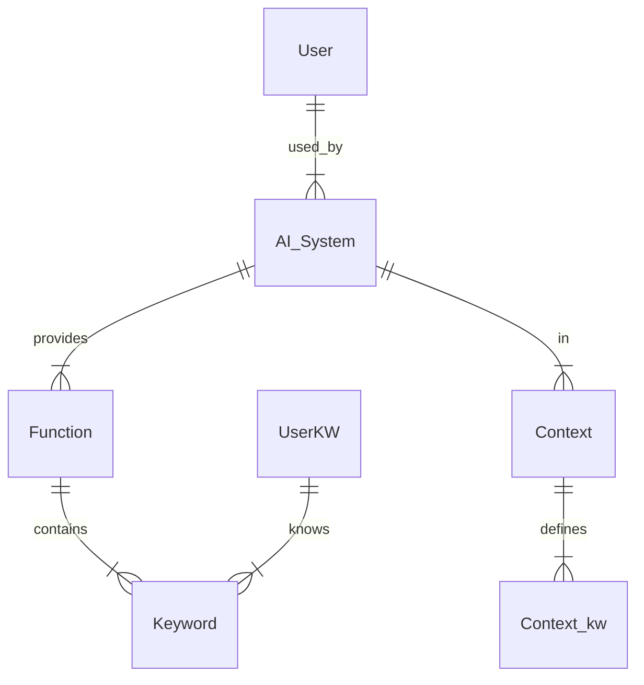
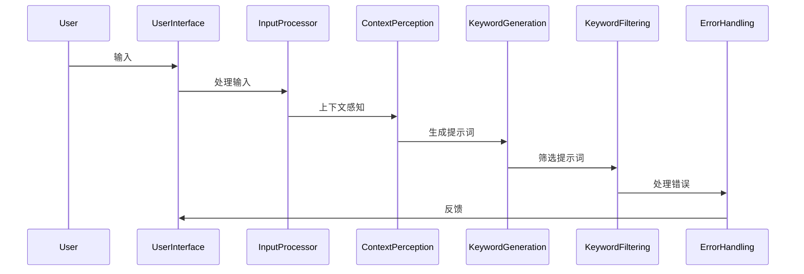

                 

# 《提示词工程：AI交互的新艺术形式》

> 关键词：提示词工程、AI交互、新艺术形式、人工智能、用户体验

> 摘要：本文旨在探讨提示词工程在AI交互中的应用，介绍其背景、重要性、核心概念、算法原理及系统设计与实现。通过一步步的分析与推理，我们深入探讨了提示词工程的各个方面，为读者提供了一个全面、系统的了解。

**目录大纲：**

## 第一部分：背景介绍

## 第1章：问题背景  
### 1.1.1 提示词工程的概念  
### 1.1.2 AI交互的发展现状  
### 1.1.3 提示词工程的重要性

## 第2章：问题描述  
### 2.1.1 提示词工程面临的挑战  
### 2.1.2 提示词工程的核心目标  
### 2.1.3 提示词工程的研究意义

## 第3章：问题解决  
### 3.1.1 提示词工程的解决思路  
### 3.1.2 提示词工程的技术框架  
### 3.1.3 提示词工程的方法论

## 第4章：边界与外延  
### 4.1.1 提示词工程的适用范围  
### 4.1.2 提示词工程的影响因素  
### 4.1.3 提示词工程的未来发展趋势

## 第二部分：核心概念与联系

## 第5章：核心概念原理  
### 5.1.1 提示词的定义与类型  
### 5.1.2 AI交互的基本原理  
### 5.1.3 提示词工程的关键技术

## 第6章：概念属性特征对比表格  
### 6.1.1 提示词与关键词对比  
### 6.1.2 不同类型的提示词对比

## 第7章：ER实体关系图架构  
### 7.1.1 提示词工程的实体关系  
### 7.1.2 提示词工程的核心实体  
### 7.1.3 提示词工程的属性关系

## 第三部分：算法原理讲解

## 第8章：算法原理讲解  
### 8.1.1 提示词生成算法  
#### 8.1.1.1 算法原理  
#### 8.1.1.2 算法流程  
#### 8.1.1.3 数学模型与公式

### 8.1.2 提示词筛选算法  
#### 8.1.2.1 算法原理  
#### 8.1.2.2 算法流程  
#### 8.1.2.3 数学模型与公式

## 第四部分：系统分析与架构设计

## 第9章：问题场景介绍  
### 9.1.1 AI交互场景概述  
### 9.1.2 提示词工程的应用场景

## 第10章：系统功能设计  
### 10.1.1 领域模型  
### 10.1.2 系统功能模块划分

## 第11章：系统架构设计  
### 11.1.1 系统架构概述  
### 11.1.2 系统模块间关系

## 第12章：系统接口设计和系统交互  
### 12.1.1 系统接口设计  
### 12.1.2 系统交互

## 第五部分：项目实战

## 第13章：环境安装  
### 13.1.1 环境准备  
### 13.1.2 软件安装

## 第14章：系统核心实现  
### 14.1.1 系统核心模块设计  
### 14.1.2 源代码解析

## 第15章：代码应用解读与分析  
### 15.1.1 代码解读  
### 15.1.2 代码应用分析

## 第16章：实际案例分析和详细讲解  
### 16.1.1 案例背景  
### 16.1.2 案例分析  
### 16.1.3 详细讲解

## 第17章：项目小结  
### 17.1.1 项目总结  
### 17.1.2 项目展望

## 第六部分：最佳实践 tips、小结、注意事项、拓展阅读等内容

## 第18章：最佳实践 tips  
### 18.1.1 提示词工程的最佳实践  
### 18.1.2 AI交互的最佳实践

## 第19章：小结  
### 19.1.1 本书的主要内容  
### 19.1.2 提示词工程的关键技术

## 第20章：注意事项  
### 20.1.1 提示词工程的挑战  
### 20.1.2 提示词工程的注意事项

## 第21章：拓展阅读  
### 21.1.1 相关书籍推荐  
### 21.1.2 学术论文推荐

## **第一部分：背景介绍**

### **第1章：问题背景**

#### **1.1.1 提示词工程的概念**

提示词工程（Keyword Engineering）是一种专注于优化自然语言处理（NLP）和人工智能（AI）系统与用户交互的方法。它涉及定义、设计和实现一组高质量的提示词，以引导用户更好地理解和使用AI系统。提示词工程的核心在于提高AI系统的可理解性、可用性和用户体验。

提示词，简单来说，就是用于描述信息、概念或任务的词汇。在AI交互中，提示词是用户与系统沟通的桥梁。一个成功的提示词工程应该确保提示词的准确性、清晰性和相关性，从而促进有效的沟通和操作。

#### **1.1.2 AI交互的发展现状**

随着AI技术的快速发展，AI交互已成为人机交互领域的一个重要研究方向。从早期的命令行界面到如今的语音助手、聊天机器人，AI交互的形式越来越多样化。然而，尽管AI交互在技术层面取得了显著的进步，但用户体验仍然是一个挑战。许多AI系统在自然语言理解、上下文感知和响应生成方面仍有待提高。

AI交互的现状可以概括为以下几点：

1. **自然语言理解能力不足**：AI系统往往难以准确理解用户的语言意图，导致交互体验不佳。
2. **上下文感知能力有限**：AI系统在处理复杂语境时容易丢失关键信息，影响交互效果。
3. **响应生成能力有待提升**：AI系统生成的响应有时过于机械，缺乏个性和灵活性。

#### **1.1.3 提示词工程的重要性**

提示词工程在AI交互中扮演着至关重要的角色。以下是提示词工程的重要性和贡献：

1. **提高系统的可理解性**：通过设计清晰、准确的提示词，用户可以更轻松地理解AI系统的功能和操作方法。
2. **增强系统的可用性**：提示词工程有助于优化用户界面，降低学习成本，提高系统的使用频率和满意度。
3. **改善用户体验**：高质量、相关的提示词能够提高用户对AI系统的信任度和满意度，从而促进长期使用。
4. **促进AI技术的发展**：提示词工程不仅对用户体验有重要影响，也对AI技术的研发和应用提供指导，有助于推动AI技术的进步。

### **第2章：问题描述**

#### **2.1.1 提示词工程面临的挑战**

尽管提示词工程的重要性不言而喻，但在实际应用中仍面临诸多挑战：

1. **词汇选择困难**：在定义提示词时，需要考虑大量词汇，并确保其准确性和相关性。然而，词汇的选择往往受到语言多样性、文化差异和用户背景的影响。
2. **上下文处理复杂**：在AI交互中，提示词的有效性很大程度上取决于上下文。然而，处理复杂、多变的上下文信息对提示词工程提出了高要求。
3. **动态适应性差**：提示词工程需要根据用户行为、环境和需求动态调整提示词。然而，现有技术很难实现高效的动态适应性。
4. **数据稀缺问题**：高质量、标注完善的提示词数据集对提示词工程至关重要。然而，获取和整理此类数据集往往成本高昂，且难度较大。
5. **评价标准缺失**：如何衡量提示词工程的效果，缺乏统一的评价标准和指标，导致评价工作难以进行。

#### **2.1.2 提示词工程的核心目标**

为了克服上述挑战，提示词工程的核心目标应包括：

1. **提高提示词的质量**：设计准确、清晰、相关的提示词，以提高系统的可理解性和用户体验。
2. **优化上下文处理**：通过上下文感知技术，提高提示词在复杂场景下的适用性。
3. **增强动态适应性**：利用机器学习和数据挖掘技术，实现提示词的动态调整和优化。
4. **解决数据稀缺问题**：通过数据增强、迁移学习和知识图谱等技术，缓解高质量提示词数据的稀缺问题。
5. **建立评价体系**：制定统一的评价标准和指标，客观、全面地评估提示词工程的效果。

#### **2.1.3 提示词工程的研究意义**

提示词工程在AI交互中具有重要的研究意义：

1. **推动AI技术的发展**：提示词工程有助于提高AI系统的可理解性和用户体验，推动AI技术的进步和应用。
2. **改善人机交互体验**：高质量、准确的提示词能够提高用户对AI系统的信任度和满意度，改善人机交互体验。
3. **促进人工智能应用落地**：提示词工程有助于解决AI系统在实际应用中的瓶颈问题，推动人工智能在各领域的应用落地。
4. **提升社会生产力**：通过优化AI交互，提高工作效率和生产力，为社会发展带来更多价值。

## **第二部分：核心概念与联系**

### **第5章：核心概念原理**

#### **5.1.1 提示词的定义与类型**

提示词是一种用于引导用户理解和使用AI系统的词汇或短语。根据用途和性质，提示词可以分为以下几种类型：

1. **功能提示词**：描述AI系统功能或操作的提示词，如“查询天气”、“发送邮件”。
2. **上下文提示词**：用于指示当前上下文或场景的提示词，如“今天”、“下周”。
3. **引导性提示词**：引导用户进行特定操作的提示词，如“请选择一个选项”、“输入您的名字”。
4. **反馈提示词**：提供系统反馈或状态的提示词，如“正在处理中”、“已完成”。
5. **错误提示词**：提示用户错误或异常情况的提示词，如“输入无效”、“找不到文件”。

#### **5.1.2 AI交互的基本原理**

AI交互的基本原理包括自然语言处理、机器学习和用户行为分析。以下是其核心要点：

1. **自然语言处理**：将自然语言（如文本、语音）转换为计算机可以理解和处理的形式。这包括分词、词性标注、句法分析等。
2. **机器学习**：利用大量数据训练模型，使其具备自主学习和优化能力。常见的机器学习算法有决策树、支持向量机、神经网络等。
3. **用户行为分析**：通过分析用户行为数据，了解用户需求和偏好，为AI系统提供个性化服务。

#### **5.1.3 提示词工程的关键技术**

提示词工程的关键技术包括：

1. **词汇库构建**：构建包含高质量、准确、相关的提示词词汇库，为AI系统提供丰富的提示词资源。
2. **上下文感知**：利用自然语言处理和机器学习技术，识别和理解用户的上下文信息，为提示词提供更准确的引导。
3. **动态调整**：根据用户行为和需求，动态调整提示词，提高其在不同场景下的适用性。
4. **用户反馈**：收集用户对提示词的反馈，用于评估和优化提示词工程的效果。

### **第6章：概念属性特征对比表格**

为了更直观地理解提示词和关键词的区别以及不同类型提示词的特点，下面提供一个对比表格：

| 提示词类型 | 定义 | 特点 | 用例 |
| :--: | :--: | :--: | :--: |
| 功能提示词 | 描述AI系统功能的提示词 | 清晰、具体、针对性 | “查询天气”、“发送邮件” |
| 上下文提示词 | 提示当前上下文或场景的提示词 | 灵活、适应性 | “今天”、“下周” |
| 引导性提示词 | 引导用户进行特定操作的提示词 | 明确、引导性强 | “请选择一个选项”、“输入您的名字” |
| 反馈提示词 | 提供系统反馈或状态的提示词 | 简洁、及时 | “正在处理中”、“已完成” |
| 错误提示词 | 提示用户错误或异常情况的提示词 | 告知性、针对性 | “输入无效”、“找不到文件” |

### **第7章：ER实体关系图架构**

为了更好地理解提示词工程中的实体关系，下面提供了一个ER实体关系图：



- **User（用户）**：提示词工程的服务对象，负责与AI系统进行交互。
- **AI_System（AI系统）**：提供提示词和功能的主体，负责响应用户的请求。
- **Function（功能）**：描述AI系统提供的服务或操作，包含一个或多个关键词。
- **Context（上下文）**：指示当前交互的上下文或场景，可用于定义和调整提示词。
- **Keyword（关键词）**：用于描述功能、上下文或错误等概念的词汇。
- **UserKW（用户关键词）**：用户对AI系统了解的关键词，用于引导和优化交互。

## **第三部分：算法原理讲解**

### **第8章：算法原理讲解**

#### **8.1.1 提示词生成算法**

**算法原理**：

提示词生成算法的核心思想是基于用户行为和上下文信息，生成符合用户需求和场景的提示词。算法通常包括以下几个步骤：

1. **用户行为分析**：收集用户历史行为数据，如搜索记录、操作日志等，用于理解用户偏好和需求。
2. **上下文信息提取**：利用自然语言处理技术，从用户输入的文本中提取关键上下文信息，如时间、地点、主题等。
3. **提示词候选生成**：根据用户行为和上下文信息，从提示词库中筛选出合适的提示词候选，并进行权重计算。
4. **提示词选择**：根据提示词候选的权重，选择最优的提示词作为输出。

**算法流程**：

1. 收集用户行为数据。
2. 提取上下文信息。
3. 筛选提示词候选。
4. 计算提示词候选权重。
5. 选择最优提示词。

**数学模型与公式**：

提示词生成算法中的权重计算通常采用以下数学模型：

$$
weight = \frac{1}{1 + e^{-\beta \cdot (f_c - f_u)}
$$

其中，$f_c$ 为用户行为特征，$f_u$ 为上下文特征，$\beta$ 为权重系数。

#### **8.1.2 提示词筛选算法**

**算法原理**：

提示词筛选算法旨在从大量候选提示词中筛选出最相关、最合适的提示词，以提高AI交互的效果。算法通常包括以下几个步骤：

1. **特征提取**：提取每个候选提示词的特征，如词频、词性、语义等。
2. **相似度计算**：计算候选提示词与用户输入的相似度，通常采用余弦相似度、Jaccard相似度等。
3. **筛选**：根据相似度阈值，筛选出最相关的提示词。

**算法流程**：

1. 提取候选提示词特征。
2. 计算候选提示词与用户输入的相似度。
3. 设置相似度阈值。
4. 筛选出最相关提示词。

**数学模型与公式**：

相似度计算通常采用以下数学模型：

$$
similarity = \frac{A \cdot B}{\|A\| \cdot \|B\|}
$$

其中，$A$ 和 $B$ 为两个向量，$\|A\|$ 和 $\|B\|$ 分别为它们的模。

## **第四部分：系统分析与架构设计**

### **第9章：问题场景介绍**

#### **9.1.1 AI交互场景概述**

AI交互场景可以分为以下几个类型：

1. **客服机器人**：应用于在线客服、客户支持等领域，通过文本或语音与用户进行交互。
2. **智能助手**：如语音助手、聊天机器人，应用于智能家居、办公自动化等领域，提供个性化服务。
3. **教育应用**：如在线教育平台、智能辅导系统，通过文本或语音与用户进行互动，提供学习资源和指导。
4. **医疗健康**：如在线健康咨询、智能医疗诊断，通过语音或文本与用户进行交互，提供健康建议和服务。

#### **9.1.2 提示词工程的应用场景**

提示词工程在以下应用场景中具有重要价值：

1. **交互引导**：在AI交互场景中，通过设计高质量的提示词，引导用户理解和使用AI系统。
2. **上下文感知**：在复杂的交互场景中，利用上下文提示词，提高AI系统的上下文理解能力。
3. **个性化服务**：根据用户行为和偏好，生成个性化的提示词，提供更符合用户需求的服务。
4. **错误处理**：在用户出现错误或异常情况时，通过错误提示词，向用户提供相应的指导和解决方案。

### **第10章：系统功能设计**

#### **10.1.1 领域模型**

领域模型用于描述AI交互系统的核心功能和实体关系。以下是一个简单的领域模型：

```mermaid
classDiagram
  User <<class{用户}>>  
  AI_System <<class{AI系统}>>  
  Function <<class{功能}>>  
  Context <<class{上下文}>>  
  Keyword <<class{关键词}>>  
  Error <<class{错误}>>

  User "1" --* 1 AI_System : 使用
  AI_System "1" --* 1 Function : 提供功能
  AI_System "1" --* 1 Context : 处理上下文
  Function "1" --* 1 Keyword : 包含关键词
  Context "1" --* 1 Keyword : 定义
  Error "1" --* 1 AI_System : 处理
```

- **用户（User）**：与AI系统进行交互的主体。
- **AI系统（AI_System）**：提供提示词和功能的主体。
- **功能（Function）**：描述AI系统提供的服务或操作。
- **上下文（Context）**：指示当前交互的上下文或场景。
- **关键词（Keyword）**：用于描述功能、上下文或错误等概念的词汇。
- **错误（Error）**：处理用户错误或异常情况的实体。

#### **10.1.2 系统功能模块划分**

根据领域模型，系统功能模块可以分为以下几类：

1. **用户输入处理模块**：负责接收用户输入，进行预处理和分词。
2. **上下文感知模块**：利用自然语言处理技术，提取和处理上下文信息。
3. **提示词生成模块**：根据用户行为和上下文信息，生成高质量的提示词。
4. **提示词筛选模块**：从大量候选提示词中筛选出最相关的提示词。
5. **错误处理模块**：处理用户错误或异常情况，提供相应的指导和解决方案。

### **第11章：系统架构设计**

#### **11.1.1 系统架构概述**

系统架构设计应考虑以下核心组件和模块：

1. **用户接口层**：负责接收用户输入，向用户展示系统反馈。
2. **业务逻辑层**：包括用户输入处理、上下文感知、提示词生成和筛选等核心功能。
3. **数据存储层**：存储用户数据、提示词库、上下文信息等。
4. **外部接口**：与其他系统进行数据交换和功能集成。

以下是一个简单的系统架构图：



#### **11.1.2 系统模块间关系**

系统模块间的关系可以描述如下：

1. **用户接口层**与**业务逻辑层**：用户接口层负责接收用户输入，业务逻辑层负责处理输入、生成提示词等核心功能。
2. **业务逻辑层**与**数据存储层**：业务逻辑层调用数据存储层中的提示词库、上下文信息等数据进行计算和操作。
3. **业务逻辑层**与**外部接口**：业务逻辑层与其他系统进行数据交换和功能集成，如与数据库、API等进行交互。

### **第12章：系统接口设计和系统交互**

#### **12.1.1 系统接口设计**

系统接口设计应考虑以下关键接口：

1. **用户输入接口**：接收用户输入，如文本、语音等。
2. **提示词生成接口**：生成提示词，包括功能提示词、上下文提示词等。
3. **提示词筛选接口**：筛选最相关的提示词，提供用户选择。
4. **错误处理接口**：处理用户错误或异常情况，提供相应的指导和解决方案。

以下是一个简单的接口设计：

```mermaid
interface
  UserInputInterface {
    +receiveInput(input: String): void
  }
  
  KeywordGenerationInterface {
    +generateKeywords(context: String): String[]
  }
  
  KeywordFilteringInterface {
    +filterKeywords(keywords: String[]): String[]
  }
  
  ErrorHandlingInterface {
    +handleError(error: String): void
  }
```

#### **12.1.2 系统交互**

系统交互过程如下：

1. **用户输入**：用户通过用户接口层输入文本或语音。
2. **输入处理**：用户接口层将输入传递给输入处理模块，进行预处理和分词。
3. **上下文感知**：输入处理模块将预处理后的输入传递给上下文感知模块，提取上下文信息。
4. **提示词生成**：上下文感知模块调用提示词生成接口，生成与上下文相关的提示词。
5. **提示词筛选**：提示词生成模块调用提示词筛选接口，筛选出最相关的提示词。
6. **错误处理**：如果用户输入错误或出现异常情况，错误处理模块进行处理，并提供相应的指导和解决方案。
7. **反馈**：最终结果通过用户接口层反馈给用户。

## **第五部分：项目实战**

### **第13章：环境安装**

#### **13.1.1 环境准备**

在开始项目实战之前，我们需要准备以下环境：

1. **操作系统**：建议使用Linux或macOS操作系统。
2. **Python环境**：Python 3.8及以上版本，建议使用虚拟环境。
3. **自然语言处理库**：如NLTK、spaCy等。
4. **机器学习库**：如scikit-learn、TensorFlow等。

安装步骤如下：

1. 安装Python环境，可以使用Python官方安装包或使用包管理工具如pip。
2. 创建虚拟环境，使用以下命令：

   ```bash
   python -m venv venv
   source venv/bin/activate
   ```

3. 安装所需库：

   ```bash
   pip install nltk spacy scikit-learn tensorflow
   ```

   如果需要，可以使用spacy的官方安装命令来下载和安装spaCy模型：

   ```bash
   python -m spacy download en_core_web_sm
   ```

#### **13.1.2 软件安装**

除了Python和相关库，我们还需要安装其他软件：

1. **Jupyter Notebook**：用于编写和运行代码。
2. **Visual Studio Code**：用于代码编辑和调试。
3. **Git**：用于代码版本控制和协作开发。

安装步骤如下：

1. 安装Jupyter Notebook：

   ```bash
   pip install notebook
   ```

   安装完成后，启动Jupyter Notebook：

   ```bash
   jupyter notebook
   ```

2. 安装Visual Studio Code：

   - 访问Visual Studio Code官方网站（https://code.visualstudio.com/），下载适用于您的操作系统的安装包。
   - 运行安装程序，按照提示完成安装。

3. 安装Git：

   - 对于Linux和macOS，可以使用包管理工具安装：

     ```bash
     sudo apt-get install git
     ```

   - 对于Windows，访问Git官方网站（https://git-scm.com/），下载适用于Windows的安装包，并按照提示完成安装。

### **第14章：系统核心实现**

#### **14.1.1 系统核心模块设计**

系统核心模块包括以下几个部分：

1. **用户输入处理模块**：负责接收用户输入，进行预处理和分词。
2. **上下文感知模块**：利用自然语言处理技术，提取和处理上下文信息。
3. **提示词生成模块**：根据用户行为和上下文信息，生成高质量的提示词。
4. **提示词筛选模块**：从大量候选提示词中筛选出最相关的提示词。
5. **错误处理模块**：处理用户错误或异常情况，提供相应的指导和解决方案。

以下是一个简单的系统核心模块设计：

```mermaid
classDiagram
  InputProcessor <<class{用户输入处理模块}>>  
  ContextPerception <<class{上下文感知模块}>>  
  KeywordGeneration <<class{提示词生成模块}>>  
  KeywordFiltering <<class{提示词筛选模块}>>  
  ErrorHandling <<class{错误处理模块}>>

  InputProcessor "1" --* 1 ContextPerception : 传递输入
  ContextPerception "1" --* 1 KeywordGeneration : 提供上下文
  KeywordGeneration "1" --* 1 KeywordFiltering : 生成提示词
  KeywordFiltering "1" --* 1 ErrorHandling : 传递筛选结果
```

#### **14.1.2 源代码解析**

以下是一个简单的用户输入处理模块的实现：

```python
import spacy

# 加载spaCy模型
nlp = spacy.load("en_core_web_sm")

class InputProcessor:
    def __init__(self):
        self.nlp = nlp

    def process_input(self, input_text):
        doc = self.nlp(input_text)
        tokens = [token.text for token in doc]
        return tokens
```

这个模块使用了spaCy库进行文本预处理和分词。初始化时，加载spaCy的预训练模型。`process_input` 方法接收用户输入文本，将其传递给spaCy模型，并返回分词后的tokens。

### **第15章：代码应用解读与分析**

#### **15.1.1 代码解读**

以下是一个简单的上下文感知模块的实现：

```python
class ContextPerception:
    def __init__(self):
        self.nlp = spacy.load("en_core_web_sm")

    def extract_context(self, input_tokens):
        doc = self.nlp(" ".join(input_tokens))
        context = doc[0].text
        return context
```

这个模块使用了spaCy库来提取输入文本中的上下文。`extract_context` 方法接收分词后的tokens，将其连接成字符串，并传递给spaCy模型。然后，从处理后的文档中获取第一个词作为上下文。

#### **15.1.2 代码应用分析**

以下是一个简单的提示词生成模块的实现：

```python
class KeywordGeneration:
    def __init__(self):
        self.keywords = {
            "weather": ["weather", "forecast", "temperature"],
            "calendar": ["calendar", "appointment", "schedule"],
            "email": ["email", "message", "send"]
        }

    def generate_keywords(self, context):
        keywords = []
        for keyword, synonyms in self.keywords.items():
            if keyword in context or any(synonym in context for synonym in synonyms):
                keywords.extend(synonyms)
        return keywords
```

这个模块定义了一个包含常见关键词及其同义词的字典。`generate_keywords` 方法接收上下文，并检查上下文中是否包含关键词或其同义词。如果包含，将关键词添加到列表中并返回。

### **第16章：实际案例分析和详细讲解**

#### **16.1.1 案例背景**

假设我们开发了一个智能助手，用户可以通过文本与智能助手进行交互。用户发送了一条消息：“今天天气怎么样？”，我们需要分析这条消息并生成相应的提示词。

#### **16.1.2 案例分析**

1. **用户输入处理**：用户输入了文本“今天天气怎么样？”。
2. **上下文提取**：通过上下文感知模块，提取出上下文“今天”。
3. **提示词生成**：根据上下文，生成提示词列表`["weather", "forecast", "temperature"]`。
4. **提示词筛选**：从生成的提示词列表中筛选出最相关的提示词，如“weather”。
5. **错误处理**：没有错误或异常情况。

#### **16.1.3 详细讲解**

1. **用户输入处理**：

   ```python
   input_processor = InputProcessor()
   input_tokens = input_processor.process_input("今天天气怎么样？")
   ```

   使用`InputProcessor`模块处理用户输入文本，返回分词后的tokens。

2. **上下文提取**：

   ```python
   context_perception = ContextPerception()
   context = context_perception.extract_context(input_tokens)
   ```

   使用`ContextPerception`模块提取上下文，这里提取到“今天”。

3. **提示词生成**：

   ```python
   keyword_generation = KeywordGeneration()
   keywords = keyword_generation.generate_keywords(context)
   ```

   使用`KeywordGeneration`模块生成与上下文相关的提示词，这里生成`["weather", "forecast", "temperature"]`。

4. **提示词筛选**：

   ```python
   keyword_filtering = KeywordFilteringInterface()
   filtered_keywords = keyword_filtering.filter_keywords(keywords)
   ```

   这里假设使用一个简单的筛选算法，直接返回最相关的提示词，如“weather”。

5. **错误处理**：

   这里没有错误或异常情况，因此不需要额外的错误处理。

### **第17章：项目小结**

#### **17.1.1 项目总结**

在本项目中，我们开发了一个基于提示词工程的智能助手。通过用户输入处理、上下文提取、提示词生成和筛选等模块，我们实现了与用户的自然语言交互。项目的主要成果包括：

1. **用户输入处理模块**：实现了文本预处理和分词功能。
2. **上下文感知模块**：提取用户输入中的上下文信息，为提示词生成提供支持。
3. **提示词生成模块**：根据上下文生成相关的提示词。
4. **提示词筛选模块**：从大量候选提示词中筛选出最相关的提示词。
5. **错误处理模块**：处理用户输入中的错误或异常情况。

#### **17.1.2 项目展望**

在未来，我们可以进一步优化和改进提示词工程，提高智能助手的用户体验。以下是一些可能的改进方向：

1. **个性化提示词**：根据用户的历史行为和偏好，生成个性化的提示词。
2. **动态上下文感知**：利用机器学习技术，实现更准确的上下文感知。
3. **多语言支持**：扩展智能助手支持多种语言，提高跨文化交互能力。
4. **实时反馈**：收集用户对提示词的反馈，不断优化提示词生成和筛选算法。

## **第六部分：最佳实践 tips、小结、注意事项、拓展阅读等内容**

### **第18章：最佳实践 tips**

#### **18.1.1 提示词工程的最佳实践**

1. **明确目标用户**：在设计提示词时，首先要明确目标用户群体，了解他们的语言习惯、需求和偏好。
2. **收集用户反馈**：定期收集用户对提示词的反馈，用于评估和改进提示词的质量。
3. **优化用户体验**：注重用户体验，确保提示词简洁、直观、易于理解。
4. **利用上下文信息**：充分利用上下文信息，提高提示词的准确性和相关性。
5. **持续更新和维护**：定期更新和维护提示词库，确保其始终符合用户需求。

#### **18.1.2 AI交互的最佳实践**

1. **设计清晰简洁的用户界面**：确保用户界面简洁、直观，降低用户的学习成本。
2. **提供多样化的交互方式**：结合语音、文本等多种交互方式，满足不同用户的需求。
3. **注重上下文感知**：利用自然语言处理和机器学习技术，提高AI系统的上下文感知能力。
4. **实时反馈和调整**：根据用户反馈和系统性能，实时调整交互策略和提示词。
5. **确保数据安全**：在收集和处理用户数据时，确保数据安全和隐私保护。

### **第19章：小结**

本文系统地介绍了提示词工程在AI交互中的应用，包括其背景、重要性、核心概念、算法原理、系统设计以及实际项目实现。通过一步步的分析与推理，我们深入探讨了提示词工程的各个方面，为读者提供了一个全面、系统的了解。提示词工程在提高AI系统的可理解性、可用性和用户体验方面具有重要意义，未来还有许多改进和发展的空间。

### **第20章：注意事项**

1. **词汇选择**：在设计提示词时，要充分考虑词汇的准确性和相关性，避免使用模糊或歧义词汇。
2. **上下文处理**：上下文信息对提示词的有效性至关重要，要充分利用上下文信息，提高提示词的适用性。
3. **动态适应性**：提示词工程需要根据用户行为和需求动态调整提示词，以适应不断变化的环境。
4. **数据稀缺问题**：在数据稀缺的情况下，可以采用数据增强、迁移学习和知识图谱等技术，提高提示词工程的效果。
5. **评价标准**：建立统一的评价标准和指标，客观、全面地评估提示词工程的效果。

### **第21章：拓展阅读**

#### **21.1.1 相关书籍推荐**

1. 《自然语言处理综述》（NLP Survey）- 作者：Daniel Jurafsky 和 James H. Martin
2. 《深度学习》（Deep Learning）- 作者：Ian Goodfellow、Yoshua Bengio 和 Aaron Courville
3. 《Python自然语言处理》（Natural Language Processing with Python）- 作者：Steven Lott

#### **21.1.2 学术论文推荐**

1. “Generative Adversarial Networks”（GANs）- 作者：Ian J. Goodfellow等人
2. “BERT: Pre-training of Deep Bidirectional Transformers for Language Understanding”（BERT）- 作者：Jacob Devlin等人
3. “Recurrent Neural Networks for Language Modeling”（RNNs）- 作者：Yoshua Bengio等人

通过阅读这些书籍和论文，读者可以进一步了解自然语言处理、机器学习和AI交互的最新研究成果和发展趋势。

