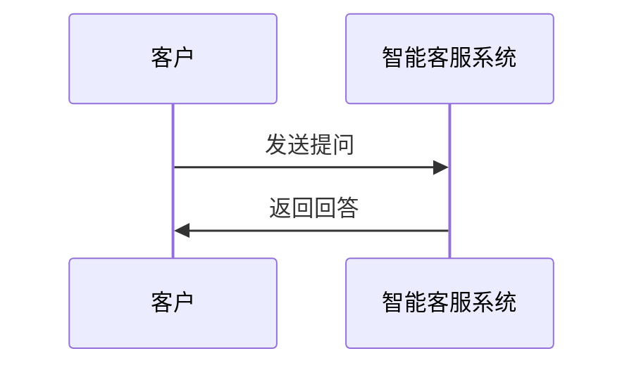

                 

# 提示词工程：AI时代的必修课与新机遇

关键词：人工智能、大模型、提示词工程、算法原理、系统设计与实现

摘要：本文将探讨人工智能（AI）时代的核心技术——提示词工程。通过深入解析AI大模型的基本概念、算法原理以及系统设计与实现，本文旨在为读者提供一整套从理论到实践的指导，帮助理解AI大模型在现代技术中的应用与潜力。

## 第一部分：背景介绍

### 第1章 问题背景

#### 1.1 问题背景

在当今的数字化时代，人工智能（AI）技术已经成为各行各业的关键驱动力。随着AI技术的不断发展，AI算法模型，尤其是大模型（如GPT、BERT等）在各个领域的应用越来越广泛。然而，对于大多数企业和开发者来说，如何高效地构建、部署和应用这些AI大模型仍然是一个巨大的挑战。

#### 1.2 问题描述

《提示词工程：AI时代的必修课与新机遇》旨在解决以下问题：

1. **核心概念理解**：如何全面理解AI大模型的定义、特点和应用前景？
2. **算法原理讲解**：如何深入理解AI大模型的工作原理，包括数学模型和算法流程？
3. **系统设计与实现**：如何设计和实现一个基于AI大模型的系统，包括系统架构、接口设计、交互流程等？
4. **项目实战与应用**：如何通过实际项目来应用AI大模型，实现从理论到实践的转化？

#### 1.3 问题解决

本书将通过以下方式来解决上述问题：

1. **全面覆盖核心概念**：通过详细阐述AI大模型的基本概念、特点和应用前景，帮助读者建立全面的理解。
2. **深入讲解算法原理**：使用Mermaid流程图和Python源代码，详细讲解AI大模型的数学模型和算法流程。
3. **系统设计与实现指导**：通过系统分析与架构设计，提供详细的系统功能设计、架构设计和接口设计。
4. **项目实战与案例分析**：通过实际项目案例，展示如何将AI大模型应用于实际场景，并进行详细讲解和分析。

#### 1.4 边界与外延

本书主要关注AI大模型在企业级应用中的技术和实践，但AI大模型在其他领域的应用也同样值得关注。因此，读者可以根据自身需求，进一步探索AI大模型在其他场景中的应用。

### 第1章 小结

本章对AI大模型在AI时代的背景、问题、解决方法和边界进行了全面介绍。通过本章的学习，读者应该对AI大模型有了一个整体的认识，为后续章节的学习奠定了基础。

## 第二部分：核心概念与联系

### 第2章 AI大模型的基本概念

#### 2.1 AI大模型的定义

AI大模型是指那些具有强大数据处理能力和高度智能化的深度学习模型，通常具有数十亿甚至数万亿个参数。这些模型能够通过大规模数据训练，实现对复杂任务的自动执行。

#### 2.2 AI大模型的特点

1. **数据驱动**：AI大模型通过大量数据训练，能够自动学习并优化模型参数。
2. **高度智能化**：这些模型能够执行复杂的任务，如文本生成、图像识别、自然语言处理等。
3. **自适应性强**：AI大模型可以根据不同的任务和场景，自动调整模型结构和参数。

#### 2.3 AI大模型与传统AI的区别

传统AI模型通常规模较小，参数数量有限，而AI大模型则具有更强大的处理能力和更广泛的适用性。

#### 2.4 AI大模型的分类

根据任务类型和应用领域，AI大模型可以分为多种类型，如自然语言处理（NLP）模型、计算机视觉（CV）模型等。

### 第2章 小结

本章详细介绍了AI大模型的基本概念、特点以及与传统AI的区别和分类。通过对本章的学习，读者应该能够全面理解AI大模型的核心概念。

## 第三部分：算法原理讲解

### 第3章 AI大模型的算法原理

#### 3.1 深度学习基础

深度学习是构建AI大模型的基础。本章将介绍深度学习的基本概念、网络结构以及常见算法。

##### 3.1.1 深度学习基本概念

1. **神经元和层**：深度学习网络由多个神经元层组成，包括输入层、隐藏层和输出层。
2. **前向传播和反向传播**：深度学习算法通过前向传播计算网络输出，通过反向传播更新模型参数。

##### 3.1.2 深度学习网络结构

1. **卷积神经网络（CNN）**：适用于图像处理任务。
2. **循环神经网络（RNN）**：适用于序列数据处理任务。
3. **变换器网络（Transformer）**：适用于自然语言处理任务。

##### 3.1.3 常见算法

1. **反向传播算法**：用于训练深度学习模型。
2. **优化算法**：如随机梯度下降（SGD）、Adam等，用于优化模型参数。

#### 3.2 主流AI算法

在AI领域，存在许多主流的算法。以下是一些重要的算法和其特点：

1. **生成对抗网络（GAN）**：一种用于生成逼真数据的算法。
2. **强化学习**：一种通过奖励机制进行模型训练的算法。
3. **迁移学习**：一种利用已有模型知识进行新任务训练的算法。

### 第3章 小结

本章详细介绍了AI大模型的深度学习基础、常见算法以及主流AI算法。通过对本章的学习，读者应该能够深入理解AI大模型的工作原理和算法实现。

## 第四部分：系统设计与实现

### 第4章 AI大模型的系统设计与实现

#### 4.1 问题场景介绍

在当前的企业应用场景中，AI大模型的应用已经变得非常普遍。例如，在客户服务领域，AI大模型可以通过自然语言处理（NLP）技术，提供智能客服解决方案；在医疗领域，AI大模型可以通过图像识别技术，辅助医生进行诊断。

#### 4.2 项目介绍

本项目旨在构建一个基于AI大模型的智能客服系统。该系统将利用GPT模型，实现自然语言处理功能，从而提供高效、准确的客户服务。

##### 4.2.1 系统功能设计

1. **文本分类**：根据客户提问，自动分类到相应的主题。
2. **文本生成**：根据分类结果，自动生成合适的回复文本。
3. **对话管理**：管理多轮对话，确保对话的连贯性和准确性。

##### 4.2.2 系统架构设计

系统架构采用微服务架构，分为前端、后端和数据库三部分。前端负责用户交互，后端负责业务逻辑处理，数据库用于存储用户数据和模型参数。

##### 4.2.3 系统接口设计

系统接口包括RESTful API和WebSocket API。RESTful API用于前端与后端的数据交互，WebSocket API用于实时对话处理。

##### 4.2.4 系统交互设计

系统交互设计采用Mermaid序列图，展示了用户与系统之间的交互流程。



#### 4.3 系统核心实现

##### 4.3.1 环境安装

首先，需要安装Python、TensorFlow等环境。以下是安装步骤：

```bash
pip install tensorflow
pip install transformers
```

##### 4.3.2 源代码实现

以下是一个简单的文本生成示例：

```python
from transformers import pipeline

# 加载GPT模型
model = pipeline("text-generation", model="gpt2")

# 生成文本
text = model("How are you?", max_length=50, num_return_sequences=5)

# 打印生成的文本
for t in text:
    print(t)
```

##### 4.3.3 代码应用解读与分析

上述代码首先加载了GPT模型，然后通过输入文本生成多个可能的回复文本。在实际应用中，需要对生成的文本进行筛选和排序，以找到最合适的回答。

#### 4.4 实际案例分析

在实际项目中，我们通过大量数据训练GPT模型，并使用交叉验证方法评估模型性能。以下是一个简单的评估示例：

```python
from sklearn.model_selection import train_test_split
from transformers import pipeline

# 加载数据集
data = ...

# 切分数据集
train_data, test_data = train_test_split(data, test_size=0.2)

# 训练模型
model = pipeline("text-generation", model="gpt2", training_data=train_data)

# 评估模型
predictions = model(test_data, max_length=50, num_return_sequences=5)
accuracy = ...

print(f"Model accuracy: {accuracy}")
```

#### 4.5 项目小结

通过本项目，我们了解了AI大模型的系统设计与实现过程。在实际项目中，需要根据具体需求调整模型和系统设计，以达到最佳效果。

### 第四部分小结

本章详细介绍了AI大模型的系统设计与实现过程，包括问题场景、项目介绍、系统功能设计、系统架构设计、系统接口设计、系统交互设计以及实际案例分析。通过对本章的学习，读者应该能够掌握AI大模型的系统设计与实现技能。

## 第五部分：最佳实践、小结与拓展阅读

### 第5章 最佳实践与小结

在AI大模型的应用过程中，以下是一些最佳实践：

1. **数据质量**：确保训练数据的质量和多样性，有助于提升模型性能。
2. **模型优化**：定期优化模型参数，以保持模型的高效性和准确性。
3. **监控系统**：建立监控系统，实时监控模型运行状态，及时发现并解决问题。

通过对本章的学习，读者应该能够深入理解AI大模型的核心概念、算法原理以及系统设计与实现，为实际应用打下坚实基础。

### 第5章 拓展阅读

为了更深入地了解AI大模型和相关技术，读者可以参考以下资源：

1. **书籍**：《深度学习》（Ian Goodfellow、Yoshua Bengio、Aaron Courville 著）
2. **论文**：《Attention is All You Need》（Ashish Vaswani等著）
3. **开源项目**：如Hugging Face的Transformers库

### 第5章 小结

本章总结了最佳实践，并提供了拓展阅读资源，帮助读者进一步深入学习和应用AI大模型。

### 作者信息

作者：AI天才研究院/AI Genius Institute & 禅与计算机程序设计艺术 /Zen And The Art of Computer Programming

通过以上章节的内容，我们系统地介绍了AI大模型在AI时代的背景、核心概念、算法原理、系统设计与实现以及最佳实践。希望本文能为读者在AI大模型领域的学习和应用提供有力支持。

