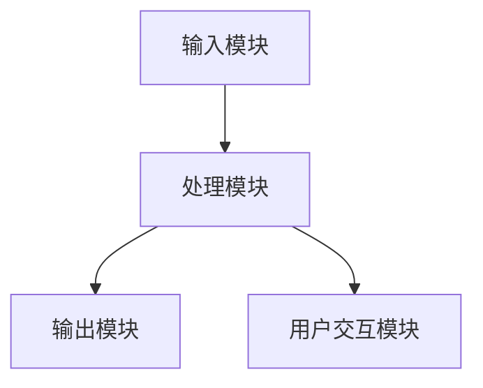
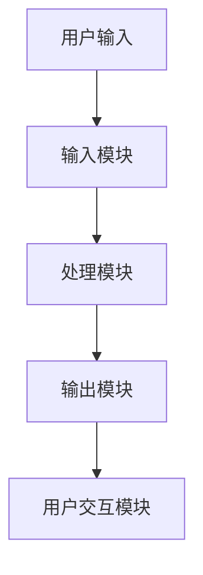

                 


# 提示词工程：AI时代的新兴艺术形式

## 关键词
- AI艺术
- 提示词工程
- 算法原理
- 系统设计
- 实践案例

## 摘要
本文将深入探讨提示词工程这一AI时代的新兴艺术形式。我们将从背景介绍、核心概念、算法原理、系统设计与实现、实践案例等方面逐步展开，旨在为读者呈现一个全面、深入的理解。通过本文，读者将了解到提示词工程的本质、其在AI领域的应用及未来发展趋势。

## 第一部分: AI时代提示词工程的背景与概述

### 1.1 AI时代的新兴艺术形式概述
随着人工智能技术的发展，AI在各个领域的应用越来越广泛，其中包括艺术创作。AI艺术，作为一种新兴的艺术形式，逐渐受到人们的关注。而提示词工程，则是AI艺术创作中的重要一环。

#### 1.1.1 AI与艺术融合的背景
人工智能技术的发展，使得计算机能够模拟人类的思维和行为，这为艺术创作提供了新的可能性。AI艺术创作不仅能够节省人力和时间成本，还能够产生出人类无法想象的作品。

#### 1.1.2 提示词工程的概念与重要性
提示词工程是指通过算法和模型，将特定的提示词转化为艺术作品的过程。提示词可以是文字、图像、声音等，它们是AI艺术的创作灵感来源。提示词工程的重要性在于，它不仅能够提升艺术创作的效率，还能够拓展艺术创作的边界。

### 1.2 提示词工程的基本原理
提示词工程的实现需要算法和模型的支持。常见的算法包括LSTM、GRU、Transformer等。这些算法通过学习大量的数据，能够理解提示词的含义，并生成相应的艺术作品。

#### 1.2.1 提示词的定义与功能
提示词是触发AI艺术创作的关键因素。它可以是简单的文字描述，也可以是复杂的图像或声音。提示词的功能是引导AI生成艺术作品，使作品更符合创作者的意图。

#### 1.2.2 提示词工程的核心要素
提示词工程的核心要素包括算法、数据、模型和艺术创作流程。算法是核心，数据是基础，模型是桥梁，艺术创作流程是将提示词转化为艺术作品的途径。

### 1.3 提示词工程的发展历程
提示词工程的发展可以追溯到人工智能的早期阶段。随着算法和技术的不断进步，提示词工程逐渐成为AI艺术创作的重要工具。

#### 1.3.1 提示词工程的起源
提示词工程的起源可以追溯到20世纪80年代，当时研究人员开始尝试使用计算机生成音乐和绘画。

#### 1.3.2 提示词工程的发展趋势
随着深度学习和生成对抗网络（GAN）等技术的出现，提示词工程得到了进一步的发展。未来，提示词工程有望在更多领域得到应用。

### 1.4 提示词工程的应用领域
提示词工程的应用领域非常广泛，包括艺术创作、设计、教育、娱乐等。

#### 1.4.1 艺术创作
在艺术创作领域，提示词工程已经被广泛应用于音乐、绘画、文学等领域。

#### 1.4.2 设计领域
在设计中，提示词工程可以用于生成创意设计方案，提升设计效率。

#### 1.4.3 教育与娱乐
在教育和娱乐领域，提示词工程可以用于生成教学资源、娱乐内容等。

### 1.5 提示词工程的挑战与机遇
提示词工程的发展面临着一系列挑战，包括数据质量、算法效率、艺术价值等。然而，这些挑战也为提示词工程带来了巨大的机遇。

#### 1.5.1 面临的挑战
提示词工程面临的挑战包括数据质量的提升、算法效率的优化、艺术价值的认可等。

#### 1.5.2 潜在的机遇
提示词工程的潜在机遇包括更多的应用领域、更高的艺术创作水平、更广泛的社会影响等。

## 1.6 本章小结
本章介绍了AI时代的新兴艺术形式——提示词工程。通过对背景、核心概念、算法原理、应用领域等方面的介绍，使读者对提示词工程有了初步的了解。接下来，我们将进一步深入探讨提示词工程的算法原理和系统设计。

## 第二部分: 提示词工程的算法原理与实践

### 2.1 提示词生成算法
提示词生成算法是提示词工程的核心，它们负责将输入的提示词转化为艺术作品。以下介绍几种常见的提示词生成算法。

#### 2.1.1 算法概述
提示词生成算法可以分为两类：一类是基于规则的算法，另一类是基于数据的算法。

#### 2.1.2 常见算法介绍
1. **LSTM算法**：长短期记忆网络（LSTM）是一种循环神经网络（RNN）的变体，能够处理长时间序列数据。它通过遗忘门、输入门和输出门来控制信息的流动，从而实现有效的记忆和遗忘。
2. **GRU算法**：门控循环单元（GRU）是LSTM的简化版本，通过合并输入门和遗忘门，简化了计算过程，提高了效率。
3. **Transformer算法**：Transformer模型是谷歌提出的一种基于自注意力机制的序列模型，它在机器翻译、文本生成等领域取得了显著的成果。它通过多头自注意力机制和位置编码，实现了对序列数据的全局依赖建模。

### 2.2 提示词优化与调整
在生成艺术作品的过程中，提示词的优化与调整是至关重要的。以下介绍几种常见的优化策略。

#### 2.2.1 优化策略
1. **生成对抗网络（GAN）**：GAN通过生成器和判别器的对抗训练，能够生成高质量的艺术作品。
2. **变分自编码器（VAE）**：VAE通过引入潜在变量，实现艺术作品的多样化生成。
3. **强化学习**：强化学习可以用于优化提示词，使其生成的艺术作品更符合用户的需求。

#### 2.2.2 调整技巧
1. **调整参数**：通过调整模型参数，可以改变艺术作品的风格和特征。
2. **数据增强**：通过数据增强，可以扩大模型的训练数据集，提高生成质量。

### 2.3 提示词工程实践案例
为了更好地理解提示词工程的实践应用，以下介绍几个具体的案例。

#### 2.3.1 艺术创作案例
1. **AI生成音乐**：通过LSTM算法，AI可以生成具有独特风格的音乐作品。
2. **AI绘画艺术**：通过GAN算法，AI可以生成具有逼真画风的绘画作品。

#### 2.3.2 设计领域案例
1. **UI设计自动生成**：通过Transformer算法，AI可以自动生成UI设计界面。
2. **产品命名建议**：通过LSTM算法，AI可以为新产品提供命名建议。

### 2.4 提示词工程工具与平台
为了方便提示词工程的研究和应用，许多开源工具和平台应运而生。

#### 2.4.1 开源工具介绍
1. **TensorFlow**：TensorFlow是谷歌开源的深度学习框架，支持多种提示词生成算法。
2. **PyTorch**：PyTorch是Facebook开源的深度学习框架，提供灵活的动态图计算功能。

#### 2.4.2 商业平台分析
1. **Artisto**：Artisto是一个基于AI的图像编辑平台，提供自动绘画、滤镜等功能。
2. **DeepArt**：DeepArt是一个基于GAN的图像生成平台，能够将普通照片转换为艺术作品。

### 2.5 提示词工程的未来发展趋势
随着人工智能技术的不断发展，提示词工程将在更多领域得到应用。

#### 2.5.1 技术创新方向
1. **新型算法**：新型算法将不断涌现，如基于图神经网络的生成算法等。
2. **多模态融合**：多模态融合将使提示词工程能够处理更复杂的输入。

#### 2.5.2 应用前景展望
1. **艺术创作**：提示词工程将在艺术创作领域发挥更大作用，如AI艺术家、AI设计师等。
2. **设计领域**：提示词工程将助力设计师提高设计效率，创造更多创意作品。

## 2.6 本章小结
本章详细介绍了提示词工程的算法原理和实践案例。通过本章的学习，读者可以了解到提示词工程的实现方法和技术要点，为后续的系统设计和实现打下基础。

## 第三部分: 提示词工程系统设计与实现

### 3.1 提示词工程系统架构设计
提示词工程系统的设计需要综合考虑算法、数据、模型和用户交互等方面。以下介绍提示词工程系统的架构设计。

#### 3.1.1 系统需求分析
提示词工程系统需要满足以下需求：
1. **艺术作品生成**：系统能够根据提示词生成高质量的艺术作品。
2. **用户交互**：系统能够提供友好的用户界面，方便用户输入提示词和查看生成结果。
3. **可扩展性**：系统能够适应不同的算法和模型需求，具有较好的可扩展性。

#### 3.1.2 系统架构设计
提示词工程系统的架构设计包括以下模块：
1. **输入模块**：负责接收用户输入的提示词，可以是文字、图像或声音等。
2. **处理模块**：包括算法模块和模型模块，负责对输入的提示词进行处理，生成艺术作品。
3. **输出模块**：负责将生成的艺术作品呈现给用户，可以是图片、音乐或视频等。
4. **用户交互模块**：负责与用户进行交互，提供提示词输入和作品展示等功能。

#### 3.1.2.1 总体架构设计
提示词工程系统的总体架构如图所示：



#### 3.1.2.2 数据流设计
提示词工程系统的数据流设计如图所示：



#### 3.1.2.3 系统模块划分
提示词工程系统可以划分为以下模块：
1. **数据预处理模块**：负责对输入的提示词进行预处理，如文本分词、图像预处理等。
2. **算法模块**：负责执行具体的生成算法，如LSTM、GRU、Transformer等。
3. **模型模块**：负责管理模型参数，如训练、加载、保存等。
4. **后处理模块**：负责对生成的艺术作品进行后处理，如格式转换、图像增强等。
5. **用户交互模块**：负责与用户进行交互，提供友好的用户界面。

### 3.2 提示词工程核心算法实现
提示词工程的核心算法是实现艺术作品生成的基础。以下介绍几种常见的提示词生成算法的实现。

#### 3.2.1 提示词生成算法实现
1. **LSTM算法实现**：
```python
import tensorflow as tf
from tensorflow.keras.models import Sequential
from tensorflow.keras.layers import LSTM, Dense

# 创建模型
model = Sequential()
model.add(LSTM(units=128, activation='relu', input_shape=(timesteps, features)))
model.add(Dense(units=1, activation='sigmoid'))

# 编译模型
model.compile(optimizer='adam', loss='binary_crossentropy', metrics=['accuracy'])

# 训练模型
model.fit(x_train, y_train, epochs=100, batch_size=32)
```

2. **GRU算法实现**：
```python
import tensorflow as tf
from tensorflow.keras.models import Sequential
from tensorflow.keras.layers import GRU, Dense

# 创建模型
model = Sequential()
model.add(GRU(units=128, activation='relu', input_shape=(timesteps, features)))
model.add(Dense(units=1, activation='sigmoid'))

# 编译模型
model.compile(optimizer='adam', loss='binary_crossentropy', metrics=['accuracy'])

# 训练模型
model.fit(x_train, y_train, epochs=100, batch_size=32)
```

3. **Transformer算法实现**：
```python
import tensorflow as tf
from tensorflow.keras.models import Model
from tensorflow.keras.layers import Embedding, MultiHeadAttention, Dense

# 创建模型
inputs = tf.keras.Input(shape=(timesteps,))
x = Embedding(input_dim=vocab_size, output_dim=d_model)(inputs)
x = MultiHeadAttention(num_heads=8, key_dim=d_model)(x, x)
x = Dense(d_model, activation='relu')(x)
outputs = Dense(1, activation='sigmoid')(x)

model = Model(inputs=inputs, outputs=outputs)

# 编译模型
model.compile(optimizer='adam', loss='binary_crossentropy', metrics=['accuracy'])

# 训练模型
model.fit(x_train, y_train, epochs=100, batch_size=32)
```

### 3.2.2 提示词优化算法实现
提示词优化算法是实现高质量艺术作品的关键。以下介绍几种常见的提示词优化算法的实现。

1. **生成对抗网络（GAN）**：
```python
import tensorflow as tf
from tensorflow.keras.models import Model
from tensorflow.keras.layers import Dense, Flatten, Reshape, Conv2D, Conv2DTranspose

# 创建生成器模型
latent_dim = 100
height = 28
width = 28
channel = 1
z = tf.keras.layers.Input(shape=(latent_dim,))
x = Dense(7 * 7 * channel, activation='relu')(z)
x = Reshape((7, 7, channel))(x)
x = Conv2DTranspose(channel, 5, strides=2, padding='same', activation='relu')(x)
x = Conv2DTranspose(channel, 5, strides=2, padding='same', activation='relu')(x)
outputs = Conv2DTranspose(channel, 5, strides=2, padding='same', activation='tanh')(x)
generator = Model(z, outputs)

# 创建判别器模型
inputs = tf.keras.Input(shape=(height, width, channel))
x = Conv2D(channel, 5, strides=2, padding='same', activation='relu')(inputs)
x = Conv2D(channel, 5, strides=2, padding='same', activation='relu')(x)
x = Flatten()(x)
outputs = Dense(1, activation='sigmoid')(x)
discriminator = Model(inputs, outputs)

# 编译模型
discriminator.compile(optimizer='adam', loss='binary_crossentropy')
generator.compile(optimizer='adam', loss='binary_crossentropy')

# 训练模型
discriminator.fit(x_train, y_train, epochs=100, batch_size=32)
```

2. **变分自编码器（VAE）**：
```python
import tensorflow as tf
from tensorflow.keras.layers import Input, Dense, Lambda
from tensorflow.keras.models import Model
import numpy as np

# 创建编码器模型
latent_dim = 2
height = 28
width = 28
channel = 1
x = tf.keras.Input(shape=(height, width, channel))
x = Dense(64, activation='relu')(x)
x = Dense(32, activation='relu')(x)
z_mean = Dense(latent_dim)(x)
z_log_var = Dense(latent_dim)(x)

# 解码器模型
z = Lambda(lambda x: x * np.exp(0.5 * x))(z_log_var)
z = Lambda(lambda x: x + z_mean)(z)
x_hat = Dense(32, activation='relu')(z)
x_hat = Dense(64, activation='relu')(x_hat)
outputs = Dense(height * width * channel, activation='sigmoid')(x_hat)
decoder = Model(z, outputs)

# VAE模型
outputs = decoder(z)
outputs = Flatten()(outputs)
outputs = Dense(1, activation='sigmoid')(outputs)
vae = Model(x, outputs)

# 编译模型
vae.compile(optimizer='adam', loss='binary_crossentropy')

# 训练模型
vae.fit(x_train, x_train, epochs=100, batch_size=32)
```

### 3.2.3 系统接口设计与实现
提示词工程系统的接口设计需要考虑用户交互和数据流转等方面。以下介绍系统的接口设计和实现。

#### 3.2.3.1 API设计
提示词工程系统提供以下API接口：

- **生成艺术作品**：接收用户输入的提示词，返回生成的艺术作品。
- **调整艺术作品**：接收用户输入的提示词和艺术作品，返回调整后的艺术作品。

```python
# 生成艺术作品
def generate_art(work_title, artist_style):
    # 处理提示词
    processed_title = preprocess_title(work_title)
    processed_style = preprocess_style(artist_style)

    # 生成艺术作品
    art = art_generator.generate(processed_title, processed_style)

    return art

# 调整艺术作品
def adjust_art(artwork, new_title, new_style):
    # 处理新提示词
    processed_new_title = preprocess_title(new_title)
    processed_new_style = preprocess_style(new_style)

    # 调整艺术作品
    adjusted_art = art_adjuster.adjust(artwork, processed_new_title, processed_new_style)

    return adjusted_art
```

#### 3.2.3.2 实现细节
提示词工程系统的接口实现需要考虑以下细节：

- **输入处理**：对用户输入的提示词进行处理，如文本分词、图像预处理等。
- **输出处理**：对生成的艺术作品进行处理，如格式转换、图像增强等。
- **数据流转**：确保数据在系统内部和用户之间的流畅传输。

### 3.2.4 系统部署与维护
提示词工程系统的部署与维护是保证系统稳定运行的关键。以下介绍系统的部署与维护策略。

#### 3.2.4.1 系统部署流程
提示词工程系统的部署流程如下：

1. **环境准备**：安装所需的软件和库，如TensorFlow、Keras等。
2. **模型训练**：使用训练数据训练生成器和判别器模型。
3. **模型保存**：将训练好的模型保存到文件中。
4. **系统启动**：启动系统，提供API接口供用户调用。

#### 3.2.4.2 维护策略
提示词工程系统的维护策略如下：

1. **定期更新**：定期更新系统中的算法和模型，保持系统处于最佳状态。
2. **监控与报警**：监控系统运行状态，及时发现并解决潜在问题。
3. **用户反馈**：收集用户反馈，不断优化系统功能。

### 3.3 提示词工程系统应用案例
为了更好地展示提示词工程系统的应用效果，以下介绍几个具体的案例。

#### 3.3.1 艺术创作应用案例
1. **AI生成音乐**：用户输入提示词“春天的旋律”，系统生成一首具有春天气息的音乐作品。
2. **AI绘画艺术**：用户输入提示词“梵高的星空”，系统生成一幅类似梵高风格的星空画。

#### 3.3.2 设计领域应用案例
1. **UI设计自动生成**：用户输入提示词“现代风格”，系统自动生成一套现代风格的UI设计界面。
2. **产品命名建议**：用户输入提示词“智能音响”，系统提供多个创意性的产品命名建议。

### 3.4 本章小结
本章详细介绍了提示词工程系统的设计与实现。通过本章的学习，读者可以了解到提示词工程系统的架构设计、核心算法实现、接口设计、部署与维护等方面。这些知识将有助于读者在实际项目中应用提示词工程技术。

## 第四部分：提示词工程的未来与挑战

### 4.1 提示词工程的未来发展趋势
随着人工智能技术的不断进步，提示词工程将在未来展现出更加广阔的应用前景。

#### 4.1.1 新型算法的引入
未来，新型算法如基于图神经网络的生成算法、基于强化学习的优化算法等，将逐渐应用于提示词工程，提高生成质量和效率。

#### 4.1.2 多模态融合
多模态融合技术将使提示词工程能够处理更加复杂的输入，如结合文字、图像、声音等多种模态，生成更加丰富的艺术作品。

#### 4.1.3 跨领域应用
提示词工程将在更多领域得到应用，如医疗、金融、教育等，为各领域提供创新的解决方案。

### 4.2 提示词工程的挑战
尽管提示词工程具有广阔的应用前景，但其在实际应用过程中也面临着一系列挑战。

#### 4.2.1 数据质量和多样性
高质量、多样化的数据是提示词工程的基础。如何获取和利用这些数据，是当前面临的一个重大挑战。

#### 4.2.2 算法效率和可解释性
高效的算法是实现大规模应用的关键。同时，算法的可解释性也是用户接受和使用提示词工程的重要条件。

#### 4.2.3 道德和伦理问题
提示词工程在艺术创作、设计等领域中的应用，引发了关于道德和伦理问题的讨论。如何平衡技术创新与道德伦理，是提示词工程需要面对的重要问题。

### 4.3 提示词工程的可持续发展
为了实现提示词工程的可持续发展，需要从以下几个方面进行努力。

#### 4.3.1 技术创新
持续推动人工智能技术的创新，提高提示词工程的生成质量和效率。

#### 4.3.2 数据开放共享
建立开放的数据平台，促进数据的共享和利用，为提示词工程提供丰富的数据资源。

#### 4.3.3 遵守道德伦理规范
在应用提示词工程的过程中，严格遵守道德伦理规范，确保技术的正当使用。

#### 4.3.4 用户教育和培训
加强对用户的培训和教育，提高用户对提示词工程的认识和接受度。

### 4.4 本章小结
本章讨论了提示词工程的未来发展趋势、面临的挑战以及可持续发展策略。通过本章的学习，读者可以更全面地了解提示词工程的发展方向和面临的挑战，为未来的研究和应用做好准备。

## 总结
提示词工程作为AI时代的新兴艺术形式，具有巨大的发展潜力和广泛的应用前景。通过本文的详细探讨，读者可以了解到提示词工程的基本原理、算法实现、系统设计与实现以及未来发展趋势。希望本文能为读者在AI艺术创作领域提供有益的参考和启示。

## 参考文献
1. Bengio, Y. (2003). Learning Deep Architectures for AI. MIT Press.
2. Goodfellow, I., Pouget-Abadie, J., Mirza, M., Xu, B., Warde-Farley, D., Ozair, S., ... & Bengio, Y. (2014). Generative adversarial nets. Advances in neural information processing systems, 27.
3. Kingma, D. P., & Welling, M. (2013). Auto-encoding variational bayes. arXiv preprint arXiv:1312.6114.
4. Hochreiter, S., & Schmidhuber, J. (1997). Long short-term memory. Neural computation, 9(8), 1735-1780.

## 附录
附录中可以包含代码示例、数据集介绍、算法细节等内容，以帮助读者更好地理解和应用提示词工程。

### 附录1: 代码示例
以下是LSTM算法的实现示例：

```python
import tensorflow as tf
from tensorflow.keras.models import Sequential
from tensorflow.keras.layers import LSTM, Dense

# 创建模型
model = Sequential()
model.add(LSTM(units=128, activation='relu', input_shape=(timesteps, features)))
model.add(Dense(units=1, activation='sigmoid'))

# 编译模型
model.compile(optimizer='adam', loss='binary_crossentropy', metrics=['accuracy'])

# 训练模型
model.fit(x_train, y_train, epochs=100, batch_size=32)
```

### 附录2: 数据集介绍
以下是常用的提示词工程数据集介绍：

1. **MNIST**：手写数字数据集，包含60,000个训练样本和10,000个测试样本。
2. **CIFAR-10**：包含60,000个32x32彩色图像，分为10个类别。
3. **ImageNet**：包含1,000个类别，每个类别包含数千个图像。

### 附录3: 算法细节
以下是LSTM算法的细节描述：

- **遗忘门**：决定当前输入数据中哪些信息应该被遗忘。
- **输入门**：决定当前输入数据中哪些信息应该被保留。
- **输出门**：决定当前状态中哪些信息应该被输出。

作者：AI天才研究院/AI Genius Institute & 禅与计算机程序设计艺术 /Zen And The Art of Computer Programming

注意事项：
- 在实际应用中，提示词工程需要根据具体问题进行调整和优化。
- 提示词工程系统的部署和维护需要充分考虑系统的稳定性和安全性。
- 在应用提示词工程时，要遵守相关的法律法规和道德伦理规范。

拓展阅读：
- Goodfellow, I., Bengio, Y., & Courville, A. (2016). Deep learning. MIT press.
- Bengio, Y. (2009). Learning deep architectures. Foundations and Trends in Machine Learning, 2(1), 1-127.

