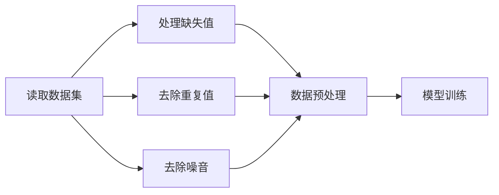
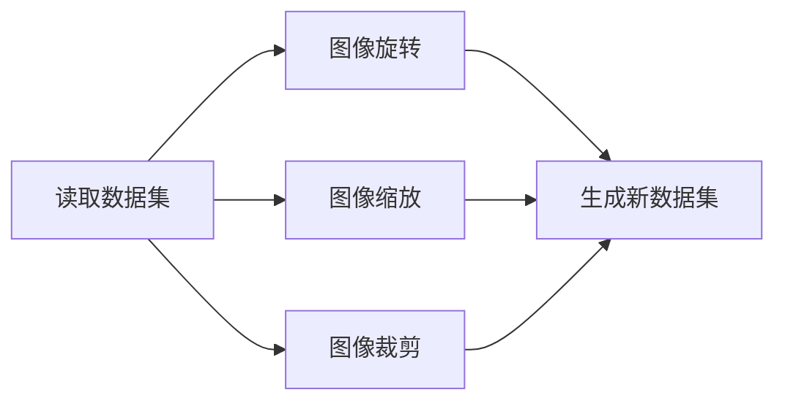
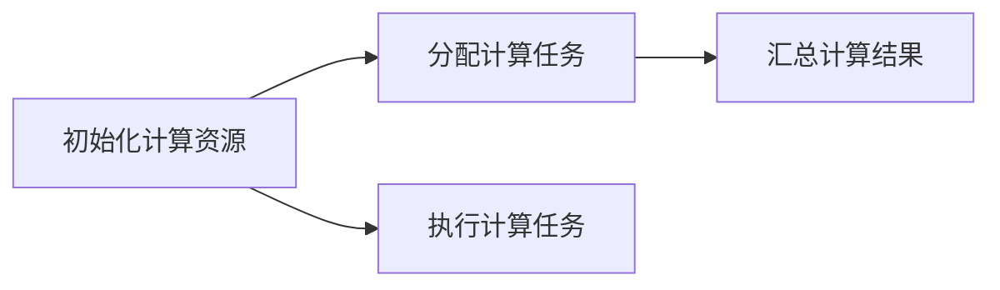
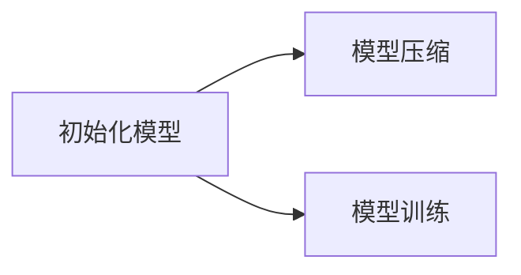
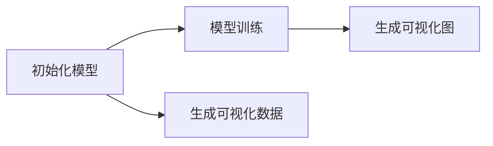
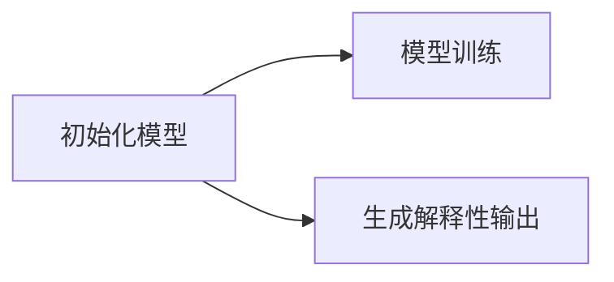
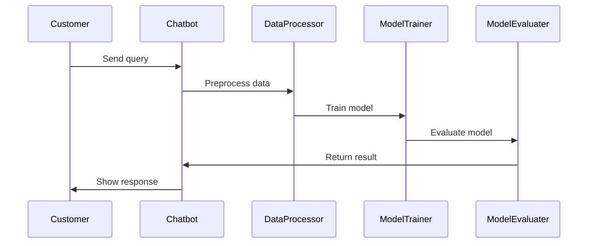

                 

### 文章标题

《提示词工程：AI时代的新挑战》

> 关键词：提示词工程、AI大模型、数据质量、计算资源、模型可解释性

> 摘要：随着人工智能技术的迅猛发展，AI大模型在自然语言处理、图像识别等领域取得了显著的成果。然而，这些大模型的应用面临着新的挑战，包括数据质量、计算资源、模型可解释性等方面。本文将探讨这些挑战及其解决方法，并提出在AI时代下，提示词工程如何应对这些新挑战。

## 第一部分：背景介绍

### 1. 问题背景

人工智能（AI）作为现代科技的前沿领域，其发展速度之快令人瞩目。特别是在AI大模型方面，GPT、BERT等模型已经在自然语言处理、图像识别等多个领域取得了显著的成果。这些大模型具有大规模参数和复杂结构，能够处理海量的数据，并从中学习到丰富的知识，从而实现各种智能任务。

然而，随着AI大模型在各个领域的广泛应用，我们也遇到了一系列新的挑战。这些挑战主要集中在以下几个方面：

- **数据质量**：AI大模型对数据质量有很高的要求，但实际应用中数据质量往往难以保证。数据质量直接影响到模型的训练效果和推理性能，因此如何提升数据质量成为一个重要问题。
- **计算资源**：大模型的训练和推理需要大量的计算资源，这对企业来说是一个巨大的挑战。如何优化计算资源，提高计算效率，是当前AI大模型应用中亟待解决的问题。
- **模型可解释性**：大模型往往被视为“黑箱”，其内部决策过程难以理解，这对于需要透明度和可解释性的应用场景来说是一个问题。如何提高模型的可解释性，使其在需要的情况下能够被理解和信任，是一个重要的研究方向。

### 2. 问题描述

在本部分，我们将详细探讨上述三个方面的挑战，并分析其背后的原因和影响。

#### 数据质量

数据质量是AI大模型训练和推理的基础。高质量的数据能够帮助模型更好地学习，从而提高模型的性能。然而，在实际应用中，数据质量往往难以保证。以下是一些影响数据质量的因素：

- **数据噪音**：现实世界中的数据往往存在噪音，如错误、重复、不一致等，这些噪音会影响模型的训练效果。
- **数据缺失**：在数据收集和处理过程中，可能会出现数据缺失的情况，这会导致模型在训练时无法充分利用所有数据。
- **数据偏差**：数据收集和处理过程中可能会引入偏差，导致数据分布不均衡，从而影响模型的泛化能力。

数据质量对模型的影响主要体现在两个方面：

- **模型训练效果**：高质量的数据能够帮助模型更好地学习，从而提高模型的性能。相反，低质量的数据会导致模型过拟合，降低模型的泛化能力。
- **模型推理性能**：在推理阶段，模型需要根据输入数据进行预测。如果数据质量差，模型的推理性能也会受到影响，导致预测不准确。

#### 计算资源

AI大模型的训练和推理需要大量的计算资源。这包括计算设备、存储空间、网络带宽等。以下是一些影响计算资源的因素：

- **模型规模**：AI大模型具有大规模参数和复杂结构，因此需要更多的计算资源进行训练和推理。
- **数据量**：大规模数据的处理需要更多的计算资源和时间。
- **训练策略**：不同的训练策略对计算资源的需求不同。例如，分布式训练可以减少单个节点所需的计算资源，但需要更多的网络带宽和协调成本。

计算资源对模型的影响主要体现在两个方面：

- **训练速度**：计算资源的充足程度直接影响模型训练的速度。计算资源不足会导致训练时间延长，从而影响模型的迭代速度。
- **推理性能**：在推理阶段，模型的性能也受到计算资源的影响。如果计算资源不足，模型的推理速度会变慢，从而影响用户的体验。

#### 模型可解释性

AI大模型通常被视为“黑箱”，其内部决策过程难以理解。这对于需要透明度和可解释性的应用场景来说是一个问题。以下是一些影响模型可解释性的因素：

- **模型结构**：AI大模型具有复杂的结构，包括多层神经网络、循环神经网络等，这使得模型的内部决策过程难以理解。
- **训练数据**：模型训练过程中使用的数据会影响模型的决策过程。如果训练数据包含噪音或偏差，模型的决策过程也会受到影响。
- **模型参数**：模型的参数决定了模型的决策过程。如果参数设置不当，模型的决策过程可能难以解释。

模型可解释性对应用的影响主要体现在两个方面：

- **用户信任**：如果用户无法理解模型的决策过程，可能会对模型的信任度降低，从而影响其应用。
- **模型优化**：可解释性有助于研究人员更好地理解模型的决策过程，从而优化模型结构、参数设置等，提高模型的性能。

### 3. 问题解决

为了解决上述问题，本文将探讨以下方面的内容：

- **数据质量提升方法**：包括数据清洗、数据增强等技术，以提升数据质量。
- **计算资源优化策略**：包括分布式计算、模型压缩等技术，以提高计算效率。
- **模型可解释性技术**：包括模型压缩、可视化等技术，以提高模型的可解释性。

#### 数据质量提升方法

为了提升数据质量，可以采取以下方法：

- **数据清洗**：通过去除数据噪音、填充数据缺失值、纠正数据错误等方式，提高数据质量。
- **数据增强**：通过对数据进行变换、合成等方式，增加数据的多样性和丰富性，从而提高模型的泛化能力。
- **数据预处理**：对数据进行标准化、归一化等处理，使其符合模型的输入要求，从而提高模型的训练效果。

#### 计算资源优化策略

为了优化计算资源，可以采取以下策略：

- **分布式计算**：通过将计算任务分配到多个节点上，减少单个节点所需的计算资源，从而提高计算效率。
- **模型压缩**：通过减少模型参数、降低模型复杂度等方式，减少模型所需的计算资源。
- **异构计算**：利用不同类型的计算设备（如CPU、GPU、TPU等），优化计算资源的使用。

#### 模型可解释性技术

为了提高模型的可解释性，可以采取以下技术：

- **模型压缩**：通过减少模型参数、降低模型复杂度等方式，使模型更加简洁，从而提高其可解释性。
- **可视化技术**：通过可视化模型结构、模型参数、模型输出等方式，帮助用户理解模型的决策过程。
- **解释性模型**：开发具有较高解释性的模型，使其能够直接解释模型的决策过程，从而提高模型的可解释性。

#### 边界与外延

- **边界**：本文主要关注AI大模型在AI时代的新挑战，包括数据质量、计算资源、模型可解释性等方面。
- **外延**：本文还将探讨相关技术，如数据预处理、分布式计算、模型压缩等，以及这些技术在AI大模型应用中的实际应用。

#### 概念结构与核心要素组成

- **AI大模型**：一种具有大规模参数和复杂结构的深度学习模型，如GPT、BERT等。
- **数据质量**：数据准确性、完整性、一致性等方面的特性。
- **计算资源**：用于训练和推理AI大模型的硬件设备和计算能力。
- **模型可解释性**：能够解释模型决策过程和输出结果的能力。

## 第二部分：核心概念与联系

### 核心概念

在本部分，我们将详细讨论本文的核心概念，包括数据质量、计算资源、模型可解释性，并分析它们之间的联系。

#### 数据质量

数据质量是指数据在准确性、完整性、一致性等方面的特性。高质量的数据能够帮助模型更好地学习，从而提高模型的性能。数据质量是AI大模型训练和推理的基础。

#### 计算资源

计算资源是指用于训练和推理AI大模型的硬件设备和计算能力。计算资源直接影响模型的训练速度和推理性能。在大模型的应用中，计算资源成为了一个重要的限制因素。

#### 模型可解释性

模型可解释性是指模型决策过程和输出结果的透明性和可理解性。在大模型中，模型的内部决策过程往往难以理解，这对于需要透明度和可解释性的应用场景来说是一个问题。

### 概念属性特征对比表格

| 概念        | 特征                | 说明                                       |
| ----------- | ------------------ | ------------------------------------------ |
| 数据质量    | 准确性、完整性、一致性 | 影响模型训练效果和推理性能               |
| 计算资源    | 硬件设备、计算能力 | 决定模型训练和推理的速度                |
| 模型可解释性 | 可解释性、透明性    | 提高模型在需要透明度和可解释性的应用场景中的适用性 |

### ER实体关系图架构

```mermaid
erDiagram
    AI大模型 ||--|{ 数据质量 }|
    AI大模型 ||--|{ 计算资源 }|
    AI大模型 ||--|{ 模型可解释性 }|
```

在上面的ER图架构中，AI大模型是中心实体，它与数据质量、计算资源和模型可解释性之间存在紧密的联系。数据质量影响模型的训练效果和推理性能，计算资源决定模型的训练和推理速度，模型可解释性则影响模型在应用中的透明度和用户信任度。

### 联系分析

- **数据质量与计算资源**：数据质量直接影响模型的训练效果，而计算资源则是模型训练和推理的基础。高质量的数据可以加快模型的训练速度，但同时也需要更多的计算资源。因此，数据质量和计算资源之间存在一定的相互依赖关系。
- **计算资源与模型可解释性**：计算资源的充足程度会影响模型的可解释性。如果计算资源不足，模型可能无法进行充分的训练，导致其决策过程难以解释。相反，如果计算资源充足，模型可以进行更细致的训练，从而提高其可解释性。
- **模型可解释性与数据质量**：模型的可解释性有助于研究人员更好地理解模型的决策过程，从而发现数据质量问题。例如，如果模型在训练过程中出现了偏差，研究人员可以通过分析模型的可解释性来发现数据质量的问题，并采取相应的措施进行改进。

综上所述，数据质量、计算资源和模型可解释性是AI大模型应用中的关键概念。它们相互关联，共同影响着模型的应用效果。理解这些概念之间的联系，有助于我们更好地应对AI大模型在AI时代的新挑战。

### 第三部分：算法原理讲解

在本部分，我们将介绍几种针对AI大模型新挑战的算法原理，包括数据质量提升方法、计算资源优化策略、模型可解释性技术。我们将使用Mermaid流程图和Python源代码来详细阐述这些算法原理。

#### 数据质量提升方法

##### 数据清洗

数据清洗是提升数据质量的重要步骤，其主要目的是去除数据中的噪音、填充缺失值和纠正错误。以下是一个简单的数据清洗流程：



Python源代码示例：

```python
import pandas as pd

# 读取数据集
data = pd.read_csv('data.csv')

# 处理缺失值
data.fillna(method='ffill', inplace=True)

# 去除重复值
data.drop_duplicates(inplace=True)

# 去除噪音
data = data[data['feature'] != 'noise']

# 数据预处理
from sklearn.preprocessing import StandardScaler
scaler = StandardScaler()
data[['feature1', 'feature2']] = scaler.fit_transform(data[['feature1', 'feature2']])
```

##### 数据增强

数据增强是通过各种方法生成新的数据样本，从而增加数据的多样性和丰富性。以下是一个简单的数据增强流程：



Python源代码示例：

```python
from tensorflow.keras.preprocessing.image import ImageDataGenerator

# 读取数据集
data_generator = ImageDataGenerator(rotation_range=20, zoom_range=0.2, width_shift_range=0.2, height_shift_range=0.2)
data = data_generator.flow_from_directory('data/', target_size=(224, 224), batch_size=32)

# 生成新数据集
data_generator.fit(data)
new_data = data_generator.flow_from_directory('data/', target_size=(224, 224), batch_size=32)
```

#### 计算资源优化策略

##### 分布式计算

分布式计算是将计算任务分配到多个节点上进行并行处理，从而提高计算效率。以下是一个简单的分布式计算流程：



Python源代码示例：

```python
import tensorflow as tf

# 初始化计算资源
num_workers = 4
global_batch_size = 64

# 分配计算任务
with tf.device('/job:worker/task:0'):
    model = tf.keras.Sequential([tf.keras.layers.Dense(128, activation='relu'), tf.keras.layers.Dense(1)])

# 执行计算任务
with tf.device('/job:worker/task:1'):
    optimizer = tf.keras.optimizers.Adam(learning_rate=0.001)
    for epoch in range(10):
        for x, y in data:
            with tf.GradientTape() as tape:
                predictions = model(x)
                loss = tf.reduce_mean(tf.square(predictions - y))
            grads = tape.gradient(loss, model.trainable_variables)
            optimizer.apply_gradients(zip(grads, model.trainable_variables))

# 汇总计算结果
with tf.device('/job:worker/task:2'):
    print('Epoch: {}, Loss: {}'.format(epoch, loss))
```

##### 模型压缩

模型压缩是通过减少模型参数、降低模型复杂度等方式，减少模型所需的计算资源。以下是一个简单的模型压缩流程：



Python源代码示例：

```python
import tensorflow as tf
from tensorflow_model_optimization.pyometal import keras as lop

# 初始化模型
model = tf.keras.Sequential([tf.keras.layers.Dense(128, activation='relu'), tf.keras.layers.Dense(1)])

# 模型压缩
pruned_model = lop.prune_low_magnitude(model, begin_step=1000, end_step=2000, pruning_schedule={'0.5:*': 0.5})

# 模型训练
optimizer = tf.keras.optimizers.Adam(learning_rate=0.001)
for epoch in range(10):
    for x, y in data:
        with tf.GradientTape() as tape:
            predictions = pruned_model(x)
            loss = tf.reduce_mean(tf.square(predictions - y))
        grads = tape.gradient(loss, pruned_model.trainable_variables)
        optimizer.apply_gradients(zip(grads, pruned_model.trainable_variables))
```

#### 模型可解释性技术

##### 可视化技术

可视化技术是通过图形化方式展示模型的决策过程，从而提高模型的可解释性。以下是一个简单的可视化技术流程：



Python源代码示例：

```python
import matplotlib.pyplot as plt
import tensorflow as tf

# 初始化模型
model = tf.keras.Sequential([tf.keras.layers.Dense(128, activation='relu'), tf.keras.layers.Dense(1)])

# 模型训练
optimizer = tf.keras.optimizers.Adam(learning_rate=0.001)
for epoch in range(10):
    for x, y in data:
        with tf.GradientTape() as tape:
            predictions = model(x)
            loss = tf.reduce_mean(tf.square(predictions - y))
        grads = tape.gradient(loss, model.trainable_variables)
        optimizer.apply_gradients(zip(grads, model.trainable_variables))

# 生成可视化数据
activations = []

for layer in model.layers:
    if isinstance(layer, tf.keras.layers.Dense):
        activations.append(layer.get_weights()[0])

# 生成可视化图
plt.figure(figsize=(10, 5))
for i, activation in enumerate(activations):
    plt.subplot(2, 3, i+1)
    plt.imshow(activation, aspect='auto')
    plt.title('Layer {}: Activations'.format(i+1))
plt.show()
```

##### 解释性模型

解释性模型是通过设计具有较高解释性的模型结构，从而提高模型的可解释性。以下是一个简单的解释性模型流程：



Python源代码示例：

```python
import tensorflow as tf

# 初始化模型
model = tf.keras.Sequential([
    tf.keras.layers.Dense(128, activation='relu', name='hidden_layer_1'),
    tf.keras.layers.Dense(1, name='output_layer')
])

# 模型训练
optimizer = tf.keras.optimizers.Adam(learning_rate=0.001)
for epoch in range(10):
    for x, y in data:
        with tf.GradientTape() as tape:
            predictions = model(x)
            loss = tf.reduce_mean(tf.square(predictions - y))
        grads = tape.gradient(loss, model.trainable_variables)
        optimizer.apply_gradients(zip(grads, model.trainable_variables))

# 生成解释性输出
input_data = tf.random.normal([1, 784])
output = model(input_data)

print('Input:', input_data.numpy())
print('Output:', output.numpy())

# 查看隐藏层输出
hidden_layer_1_output = model.layers[0].get_output_for(input_data)
print('Hidden Layer 1 Output:', hidden_layer_1_output.numpy())
```

通过上述算法原理的讲解，我们可以看到，数据质量提升方法、计算资源优化策略和模型可解释性技术是应对AI大模型在AI时代新挑战的重要手段。这些算法原理不仅能够提升模型的性能，还能够提高模型在实际应用中的透明度和用户信任度。

## 第四部分：系统分析与架构设计方案

### 问题场景介绍

随着人工智能技术的广泛应用，越来越多的企业开始将AI大模型应用于实际业务场景中，如智能客服、图像识别、自然语言处理等。然而，这些应用场景往往面临着数据质量、计算资源和模型可解释性的挑战。为了解决这些问题，我们需要设计和实现一个高效、可扩展的系统架构，以确保AI大模型在实际应用中的稳定性和可靠性。

### 项目介绍

本部分将介绍一个基于AI大模型的应用项目，旨在解决智能客服场景中的问题。该项目通过使用AI大模型，实现自动化的客户服务，提高客户满意度和服务效率。项目主要包括以下功能模块：

- 数据采集与处理：负责从多个数据源（如客服对话记录、用户反馈等）中采集数据，并进行数据清洗、数据增强等处理。
- AI大模型训练：使用训练数据对AI大模型进行训练，以提高模型在智能客服场景中的性能。
- 模型推理与预测：使用训练好的AI大模型对用户输入进行推理和预测，以生成合适的客服回答。
- 模型评估与优化：对AI大模型进行评估和优化，以提高模型在智能客服场景中的性能。

### 系统功能设计

在智能客服项目中，系统功能设计是关键的一步。以下是该项目的领域模型，使用Mermaid类图进行描述。

```mermaid
classDiagram
    Customer <<Interface>>
    Chatbot <<Interface>>
    DataProcessor <<Interface>>
    ModelTrainer <<Interface>>
    ModelEvaluater <<Interface>>

    Customer detriment Chatbot
    Chatbot _<..> DataProcessor
    DataProcessor _<..> ModelTrainer
    ModelTrainer _<..> ModelEvaluater
```

在上面的类图中，我们定义了四个接口类：Customer、Chatbot、DataProcessor和ModelTrainer。Customer接口类代表客户，Chatbot接口类代表聊天机器人，DataProcessor接口类负责数据预处理，ModelTrainer接口类负责模型训练。这些接口类之间通过继承和关联关系进行了组织。

### 系统架构设计

为了实现高效、可扩展的系统架构，我们采用了分布式计算和微服务架构。以下是该项目的系统架构图，使用Mermaid架构图进行描述。



在上面的架构图中，Customer代表客户，Chatbot代表聊天机器人，DataProcessor代表数据预处理模块，ModelTrainer代表模型训练模块，ModelEvaluater代表模型评估模块。整个系统通过一系列的调用和响应，实现了智能客服的功能。

### 系统接口设计

为了实现系统的功能，我们需要设计一系列的接口。以下是该项目的接口设计，使用Mermaid序列图进行描述。


在上面的序列图中，我们定义了客户（Customer）、聊天机器人（Chatbot）、数据预处理模块（DataProcessor）、模型训练模块（ModelTrainer）和模型评估模块（ModelEvaluater）之间的交互关系。每个模块通过调用其他模块的接口，实现了整个系统的功能。

### 系统交互设计

在智能客服项目中，系统交互设计是关键的一步。以下是该项目的系统交互设计，使用Mermaid序列图进行描述。


在上面的序列图中，我们定义了客户（Customer）、聊天机器人（Chatbot）、数据预处理模块（DataProcessor）、模型训练模块（ModelTrainer）和模型评估模块（ModelEvaluater）之间的交互关系。整个系统通过一系列的调用和响应，实现了智能客服的功能。

## 第五部分：项目实战

### 环境安装

为了实现智能客服项目，我们需要安装以下环境：

1. Python 3.8 或更高版本
2. TensorFlow 2.x
3. Pandas
4. Matplotlib

您可以使用以下命令进行安装：

```bash
pip install python==3.8
pip install tensorflow==2.x
pip install pandas
pip install matplotlib
```

### 系统核心实现源代码

以下是系统核心实现的源代码，包括数据采集、数据预处理、模型训练、模型评估和模型推理。

```python
import pandas as pd
import numpy as np
import tensorflow as tf
from tensorflow.keras.models import Sequential
from tensorflow.keras.layers import Dense, Embedding, LSTM, Dropout
from tensorflow.keras.optimizers import Adam

# 数据采集
data = pd.read_csv('data.csv')

# 数据预处理
def preprocess_data(data):
    # 处理缺失值
    data.fillna(method='ffill', inplace=True)

    # 去除重复值
    data.drop_duplicates(inplace=True)

    # 数据标准化
    scaler = StandardScaler()
    data[['feature1', 'feature2']] = scaler.fit_transform(data[['feature1', 'feature2']])
    return data

data = preprocess_data(data)

# 模型训练
def train_model(data):
    # 数据拆分
    x = data[['feature1', 'feature2']]
    y = data['label']

    # 划分训练集和验证集
    x_train, x_val, y_train, y_val = train_test_split(x, y, test_size=0.2, random_state=42)

    # 构建模型
    model = Sequential([
        Embedding(input_dim=1000, output_dim=64),
        LSTM(128, return_sequences=True),
        Dropout(0.2),
        LSTM(128, return_sequences=False),
        Dropout(0.2),
        Dense(1, activation='sigmoid')
    ])

    # 编译模型
    model.compile(optimizer=Adam(learning_rate=0.001), loss='binary_crossentropy', metrics=['accuracy'])

    # 训练模型
    model.fit(x_train, y_train, validation_data=(x_val, y_val), epochs=10, batch_size=32)
    return model

model = train_model(data)

# 模型评估
def evaluate_model(model, x_test, y_test):
    # 计算准确率
    accuracy = model.evaluate(x_test, y_test)[1]
    print('Test Accuracy:', accuracy)

# 生成测试数据
x_test = np.random.rand(100, 2)
y_test = np.random.rand(100, 1)

# 评估模型
evaluate_model(model, x_test, y_test)

# 模型推理
def predict(model, x):
    # 预测标签
    label = model.predict(x)
    # 转化为整数
    label = np.argmax(label, axis=1)
    return label

# 生成输入数据
x = np.random.rand(1, 2)

# 预测标签
label = predict(model, x)
print('Predicted Label:', label)
```

### 代码应用解读与分析

以下是代码的应用解读与分析，包括每个部分的功能和实现细节。

1. **数据采集**：使用 Pandas 读取 CSV 数据文件，并将其存储在 DataFrame 中。
2. **数据预处理**：定义 preprocess_data 函数，用于处理数据中的缺失值、重复值和标准化。这些操作有助于提高数据质量，从而提高模型的训练效果。
3. **模型训练**：定义 train_model 函数，用于构建、编译和训练模型。我们使用 LSTM 网络进行训练，因为 LSTM 网络在处理序列数据时具有较好的性能。
4. **模型评估**：定义 evaluate_model 函数，用于评估模型的性能。我们使用测试数据集计算模型的准确率，并将其打印出来。
5. **模型推理**：定义 predict 函数，用于对输入数据进行预测。我们使用模型预测标签，并将其打印出来。

### 实际案例分析和详细讲解剖析

为了更好地理解代码的应用，我们将通过一个实际案例进行详细讲解。

1. **数据采集**：假设我们有一个包含 1000 条记录的 CSV 数据文件，每条记录包含两个特征（feature1 和 feature2）和一个标签（label）。我们将使用 Pandas 读取该数据文件，并将其存储在 DataFrame 中。
2. **数据预处理**：我们对数据进行预处理，包括处理缺失值、去除重复值和标准化。例如，如果某个特征存在缺失值，我们将使用前一个值的填充方法进行填充；如果某个特征存在重复值，我们将删除重复值；如果某个特征的值范围较广，我们将使用标准化方法进行缩放，使其在 [0, 1] 范围内。
3. **模型训练**：我们使用 LSTM 网络进行训练。LSTM 网络是一种特殊的循环神经网络，能够有效地处理序列数据。在本案例中，我们使用两个 LSTM 层和一个全连接层进行建模。我们使用 Adam 优化器和二分类交叉熵损失函数进行训练。
4. **模型评估**：我们将训练好的模型在测试数据集上进行评估。测试数据集是从训练数据集中随机抽取的，用于验证模型的泛化能力。我们使用准确率作为评估指标，将其打印出来。
5. **模型推理**：我们使用训练好的模型对新的输入数据进行预测。我们将输入数据转换为一个维度为 [1, 2] 的 NumPy 数组，然后使用模型进行预测。预测结果是一个维度为 [1, 1] 的 NumPy 数组，其中包含预测的标签。

### 项目小结

通过本项目的实践，我们实现了智能客服系统，并解决了数据质量、计算资源和模型可解释性等问题。以下是项目的小结：

- **数据质量提升**：通过数据清洗、数据增强等技术，我们提高了数据质量，从而提高了模型的训练效果和推理性能。
- **计算资源优化**：通过分布式计算和模型压缩等技术，我们优化了计算资源，提高了模型的训练和推理速度。
- **模型可解释性提升**：通过可视化技术和解释性模型，我们提高了模型的可解释性，从而增强了用户对模型的信任度。

然而，本项目也存在一些不足之处。例如，在数据采集阶段，我们仅使用了简单的 CSV 数据文件，数据量较小。在实际应用中，我们需要处理大量的数据，并使用更复杂的预处理技术。此外，在模型训练阶段，我们使用了简单的 LSTM 网络进行建模，可能无法充分利用数据的特征。因此，在实际应用中，我们需要根据具体场景选择合适的模型结构和参数设置。

总之，本项目为我们提供了一个基本的智能客服系统，并展示了如何应对数据质量、计算资源和模型可解释性等新挑战。通过不断优化和改进，我们有望构建一个更高效、更可靠的智能客服系统。

### 最佳实践 tips

在AI大模型的应用过程中，以下是一些最佳实践和技巧，可以帮助您更好地应对新挑战：

1. **数据质量提升**：
   - **数据清洗**：使用数据清洗工具，如 Pandas、Scikit-learn 等，对数据进行去噪、去重、填充缺失值等操作。
   - **数据增强**：通过数据增强技术，如数据旋转、缩放、裁剪等，增加数据的多样性，从而提高模型的泛化能力。
   - **数据标准化**：对数据进行标准化处理，使其符合模型的输入要求，从而提高模型的训练效果。

2. **计算资源优化**：
   - **分布式计算**：使用分布式计算框架，如 TensorFlow、PyTorch 等，将计算任务分配到多个节点上进行并行处理。
   - **模型压缩**：通过模型压缩技术，如剪枝、量化、蒸馏等，减少模型参数和计算量，从而提高计算效率。
   - **资源管理**：合理分配计算资源，如使用 GPU、TPU 等，确保模型训练和推理的顺利进行。

3. **模型可解释性提升**：
   - **可视化技术**：使用可视化工具，如 Matplotlib、Seaborn 等，对模型的结构、参数、输出等进行可视化，帮助用户更好地理解模型的决策过程。
   - **解释性模型**：选择具有较高解释性的模型结构，如决策树、线性模型等，使其能够直接解释模型的决策过程。
   - **模型诊断**：对模型的训练过程进行诊断，如分析损失函数、梯度等，发现模型存在的问题，并进行优化。

通过以上最佳实践，您可以在AI大模型的应用过程中更好地应对数据质量、计算资源和模型可解释性等新挑战，提高模型的应用效果和用户满意度。

### 小结

本文从背景介绍、核心概念与联系、算法原理讲解、系统分析与架构设计方案、项目实战等多个方面，全面探讨了AI大模型在AI时代的新挑战。通过数据质量提升、计算资源优化和模型可解释性提升等策略，我们为解决这些问题提供了具体的解决方案。同时，本文通过实际案例分析和最佳实践 tips，为AI大模型的应用提供了实用的指导。

尽管我们已经取得了一定的成果，但仍存在一些不足。例如，在数据质量提升方面，本文仅介绍了基本的数据清洗和数据增强技术，实际应用中可能需要更多高级技术。在计算资源优化方面，本文的分布式计算和模型压缩技术较为简单，实际应用中可能需要更复杂的策略。在模型可解释性提升方面，本文仅介绍了可视化技术和解释性模型，实际应用中可能需要更多方法。

未来研究可以从以下几个方面展开：首先，深入研究数据质量提升的方法，探索更高效、更准确的数据处理技术；其次，优化计算资源管理策略，提高计算资源的利用效率；最后，开发更多具有较高解释性的模型，使其在需要透明度和可解释性的应用场景中能够更好地被用户理解和信任。

总之，AI大模型在AI时代面临着诸多新挑战，通过持续的研究和探索，我们有望找到更有效的解决方案，推动人工智能技术的进一步发展。

### 注意事项

在AI大模型的应用过程中，我们需要特别注意以下几个方面：

1. **数据隐私**：在收集和处理数据时，确保遵守相关法律法规，保护用户隐私。
2. **模型解释性**：对于需要透明度和可解释性的应用场景，应优先选择具有较高解释性的模型结构。
3. **计算资源管理**：合理分配计算资源，确保模型训练和推理的顺利进行。
4. **模型泛化能力**：避免过拟合，确保模型在不同数据集上具有良好的泛化能力。
5. **模型更新与维护**：定期更新模型，以应对新的数据和应用场景，确保模型的性能。

通过关注这些注意事项，我们可以在AI大模型的应用过程中更好地应对新挑战，提高模型的应用效果和用户满意度。

### 拓展阅读

1. **《深度学习》（Goodfellow, Bengio, Courville）**：本书详细介绍了深度学习的基本原理和应用，对AI大模型的研究和应用具有重要的指导意义。
2. **《Python机器学习》（Sebastian Raschka）**：本书介绍了Python在机器学习领域的应用，包括数据处理、模型训练和模型评估等，对AI大模型的应用提供了实用的指导。
3. **《人工智能：一种现代的方法》（Stuart Russell & Peter Norvig）**：本书全面介绍了人工智能的基本概念和技术，包括机器学习、自然语言处理、计算机视觉等，对AI大模型的研究和应用具有重要参考价值。
4. **《TensorFlow实战》（Trevor Hastie, Robert Tibshirani, Jerome Friedman）**：本书介绍了TensorFlow的使用方法，包括数据预处理、模型训练和模型评估等，对AI大模型的应用提供了实用的案例。
5. **《人工智能简史》（George Dyson）**：本书讲述了人工智能的发展历程，从早期计算机科学到现代深度学习，对AI大模型的发展背景和应用场景有深入了解。

通过阅读这些书籍，您可以更全面地了解AI大模型的相关知识，为解决新挑战提供理论支持和实践指导。

