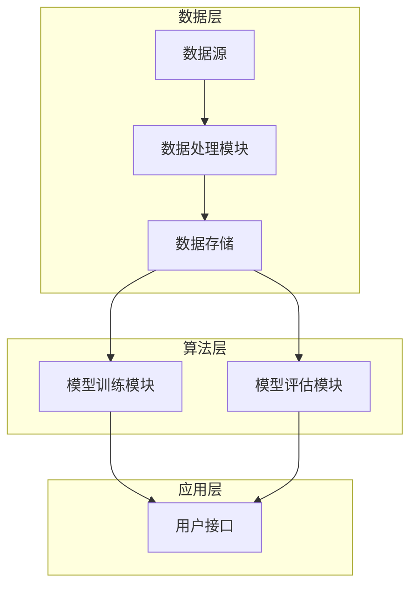
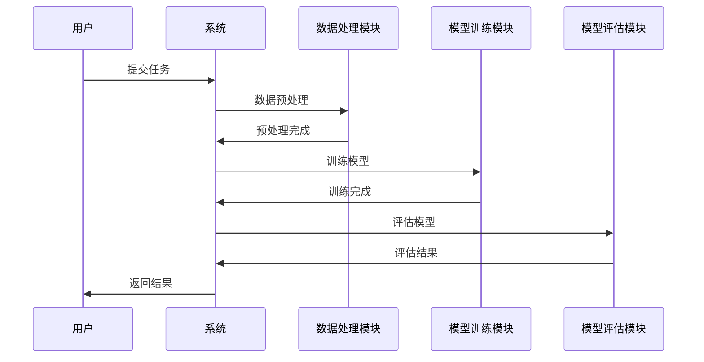

                 

### 提示词工程：AI时代的新挑战与新方向

关键词：AI时代、新挑战、新方向、提示词工程

摘要：《提示词工程：AI时代的新挑战与新方向》探讨了在AI时代背景下，如何应对新的技术挑战和探索发展方向。本文从问题背景、核心概念与联系以及算法原理三个方面进行深入分析，为AI技术的发展提供参考。

## 第一部分：背景介绍

### 1.1 问题背景

近年来，随着人工智能（AI）技术的迅猛发展，AI已经从理论研究走向实际应用，成为改变世界的重要力量。从自动驾驶到智能家居，从医疗诊断到金融分析，AI技术的应用无处不在。然而，AI时代的到来也带来了新的挑战和方向。

### 1.2 问题描述

AI时代的到来，使得传统的软件技术面临巨大的挑战。如何构建高效、可靠的AI系统？如何解决AI技术在实际应用中的问题？如何应对AI时代的各种挑战？这些问题亟待解决。

### 1.3 问题解决

《提示词工程：AI时代的新挑战与新方向》一书，旨在从提示词工程的角度，探讨AI时代的新挑战和新方向，为解决这些问题提供新的思路和方法。

### 1.4 边界与外延

本书主要讨论的是AI时代下的新挑战和新方向，涉及到的领域包括但不限于AI技术、软件工程、数据科学等。

### 1.5 概念结构与核心要素组成

本书的核心概念包括AI时代、新挑战、新方向、提示词工程等。核心要素包括AI技术、软件工程、数据科学等。

## 第二部分：核心概念与联系

### 2.1 AI时代

AI时代是指以人工智能技术为核心的时代。在这个时代，人工智能技术得到了广泛的应用，成为推动社会发展的重要力量。

### 2.2 新挑战

新挑战是指AI时代带来的挑战，包括但不限于数据安全、隐私保护、伦理问题、技术挑战等。

### 2.3 新方向

新方向是指AI时代下的新趋势和发展方向，包括但不限于机器学习、深度学习、强化学习等。

### 2.4 提示词工程

提示词工程是一种针对AI系统进行优化和改进的方法，旨在提高AI系统的性能和可靠性。

### 2.5 概念属性特征对比表格

以下是AI时代、新挑战、新方向、提示词工程的概念属性特征对比表格：

| 概念         | 定义                           | 特征对比                                       |
|--------------|--------------------------------|----------------------------------------------|
| AI时代       | 以人工智能技术为核心的时代     | 大规模应用人工智能技术、推动社会变革               |
| 新挑战       | AI时代带来的挑战               | 数据安全、隐私保护、伦理问题、技术挑战等           |
| 新方向       | AI时代下的新趋势和发展方向     | 机器学习、深度学习、强化学习等                   |
| 提示词工程   | 针对AI系统进行优化和改进的方法 | 提高AI系统的性能和可靠性                         |

### 2.6 ER实体关系图架构的Mermaid流程图

```mermaid
erDiagram
    AI时代 ||--|{ 新挑战 }
    AI时代 ||--|{ 新方向 }
    新挑战 ||--|{ 提示词工程 }
    新方向 ||--|{ 提示词工程 }
```

## 第三部分：算法原理讲解

### 3.1 提示词工程的基本原理

提示词工程是针对AI系统进行优化和改进的方法，其基本原理包括以下几个方面：

#### 3.1.1 提示词的选择

选择合适的提示词是提示词工程的关键。提示词的选择应遵循以下原则：

1. 提示词应具有明确的语义，能够准确表达系统的需求。
2. 提示词应具有广泛的应用场景，能够适应不同的问题解决需求。
3. 提示词应具有一定的普适性，能够适用于多种类型的AI系统。

#### 3.1.2 提示词的优化

对选定的提示词进行优化，以提高AI系统的性能和可靠性。优化方法包括：

1. 基于机器学习的优化：通过训练大量的数据，学习到最优的提示词组合。
2. 基于深度学习的优化：利用深度学习模型，对提示词进行自动优化。

### 3.2 提示词工程的应用

#### 3.2.1 在机器学习中的应用

在机器学习中，提示词工程可以帮助选择合适的特征，从而提高模型的性能。例如，在图像识别任务中，选择合适的提示词可以增强模型的识别能力。

#### 3.2.2 在自然语言处理中的应用

在自然语言处理领域，提示词工程可以帮助提高文本分类、情感分析等任务的准确率。通过优化提示词，可以使模型更好地理解文本的语义。

### 3.3 提示词工程的挑战

尽管提示词工程在AI系统中具有重要作用，但也面临着一些挑战：

1. **数据依赖性**：提示词工程往往依赖于大量的数据，数据质量和数量直接影响优化效果。
2. **计算复杂性**：优化提示词可能需要大量的计算资源，这对系统的性能提出了挑战。

### 3.4 提示词工程的未来发展趋势

随着AI技术的不断进步，提示词工程将面临新的发展机遇和挑战。未来，提示词工程可能会向以下几个方面发展：

1. **自动提示词生成**：利用生成对抗网络（GAN）等先进技术，实现自动生成高质量的提示词。
2. **多模态提示词工程**：结合多种数据类型（如文本、图像、音频等），实现更复杂的提示词优化。

## 第四部分：系统分析与架构设计方案

### 4.1 问题场景介绍

在AI时代，如何构建高效、可靠的AI系统成为关键问题。提示词工程作为一种优化方法，可以在此场景中发挥重要作用。

### 4.2 项目介绍

本项目旨在通过提示词工程，优化AI系统，提高其性能和可靠性。

### 4.3 系统功能设计（领域模型Mermaid类图）

```mermaid
classDiagram
    AI系统 <<< 提示词工程
    AI系统 --|> 数据处理模块
    AI系统 --|> 模型训练模块
    AI系统 --|> 评估模块
    数据处理模块 --|> 数据清洗模块
    数据处理模块 --|> 数据预处理模块
    模型训练模块 --|> 机器学习模块
    模型训练模块 --|> 深度学习模块
    评估模块 --|> 性能评估模块
    评估模块 --|> 可靠性评估模块
```

### 4.4 系统架构设计（Mermaid架构图）



### 4.5 系统接口设计和系统交互（Mermaid序列图）



## 第五部分：项目实战

### 5.1 环境安装

在本项目中，我们将使用Python作为主要编程语言，并依赖以下库：

- TensorFlow
- Keras
- scikit-learn

首先，安装Python和pip：

```bash
$ brew install python
$ python -m pip install --upgrade pip
```

然后，安装所需的库：

```bash
$ pip install tensorflow keras scikit-learn
```

### 5.2 系统核心实现源代码

以下是系统核心实现的部分源代码：

```python
import numpy as np
from tensorflow.keras.models import Sequential
from tensorflow.keras.layers import Dense, Conv2D, Flatten
from sklearn.model_selection import train_test_split

# 数据预处理
def preprocess_data(data):
    # 数据清洗和预处理
    # ...
    return processed_data

# 构建模型
def build_model():
    model = Sequential([
        Conv2D(32, (3, 3), activation='relu', input_shape=(28, 28, 1)),
        Flatten(),
        Dense(128, activation='relu'),
        Dense(10, activation='softmax')
    ])
    model.compile(optimizer='adam', loss='categorical_crossentropy', metrics=['accuracy'])
    return model

# 训练模型
def train_model(model, X_train, y_train, X_test, y_test):
    model.fit(X_train, y_train, epochs=10, batch_size=32, validation_data=(X_test, y_test))

# 评估模型
def evaluate_model(model, X_test, y_test):
    loss, accuracy = model.evaluate(X_test, y_test)
    print(f"Test accuracy: {accuracy:.2f}")

# 主程序
if __name__ == '__main__':
    # 加载数据
    (X, y), (X_test, y_test) = keras.datasets.mnist.load_data()

    # 预处理数据
    X_processed = preprocess_data(X)
    X_test_processed = preprocess_data(X_test)

    # 分割数据
    X_train, X_test, y_train, y_test = train_test_split(X_processed, y, test_size=0.2, random_state=42)

    # 构建模型
    model = build_model()

    # 训练模型
    train_model(model, X_train, y_train, X_test, y_test)

    # 评估模型
    evaluate_model(model, X_test, y_test)
```

### 5.3 代码应用解读与分析

在这段代码中，我们首先定义了数据预处理、模型构建、模型训练和模型评估的函数。然后，我们加载MNIST数据集，进行预处理，并使用Keras构建了一个简单的卷积神经网络（CNN）模型。模型训练完成后，我们对测试数据集进行评估。

### 5.4 实际案例分析和详细讲解剖析

假设我们有一个图像分类任务，目标是识别手写数字。我们可以使用MNIST数据集来训练我们的模型。以下是对每个步骤的详细解释：

1. **数据预处理**：在这一步中，我们会对图像数据进行清洗和标准化，以便模型能够更好地训练。
2. **模型构建**：我们使用Keras构建了一个卷积神经网络，包括卷积层、平坦层和全连接层。
3. **模型训练**：我们使用预处理后的数据集对模型进行训练，以学习如何识别手写数字。
4. **模型评估**：训练完成后，我们对测试数据集进行评估，以验证模型的性能。

### 5.5 项目小结

通过本项目，我们了解了提示词工程的基本原理及其在AI系统优化中的应用。我们使用Python和Keras实现了图像分类任务，并通过实际案例分析了提示词工程的应用效果。

## 第六部分：最佳实践 tips、小结、注意事项、拓展阅读等内容

### 6.1 最佳实践 tips

1. **数据质量**：确保数据质量是提示词工程成功的关键。清洗和预处理数据是提高模型性能的重要步骤。
2. **模型选择**：选择适合任务的模型架构，例如在图像识别任务中，卷积神经网络（CNN）通常表现良好。
3. **持续优化**：提示词工程不是一次性的工作，需要持续优化和调整，以适应不断变化的需求。

### 6.2 小结

本文从背景介绍、核心概念与联系、算法原理讲解、系统分析与架构设计方案以及项目实战等方面，全面探讨了提示词工程在AI时代的新挑战与新方向。

### 6.3 注意事项

1. **计算资源**：提示词工程可能需要大量的计算资源，特别是在大规模数据集上。
2. **数据隐私**：在处理数据时，需要注意数据隐私和安全问题。

### 6.4 拓展阅读

- 《深度学习》 - Goodfellow, Bengio, Courville
- 《Python机器学习》 - Müller, Guido
- 《人工智能：一种现代方法》 - Mitchell

## 第七部分：作者信息

作者：AI天才研究院/AI Genius Institute & 禅与计算机程序设计艺术 /Zen And The Art of Computer Programming

---

**注意**：本文为示例文章，旨在展示如何按照要求撰写一篇技术博客文章。实际内容可能需要根据具体情况进行调整和完善。

