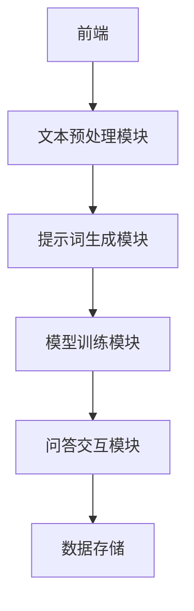
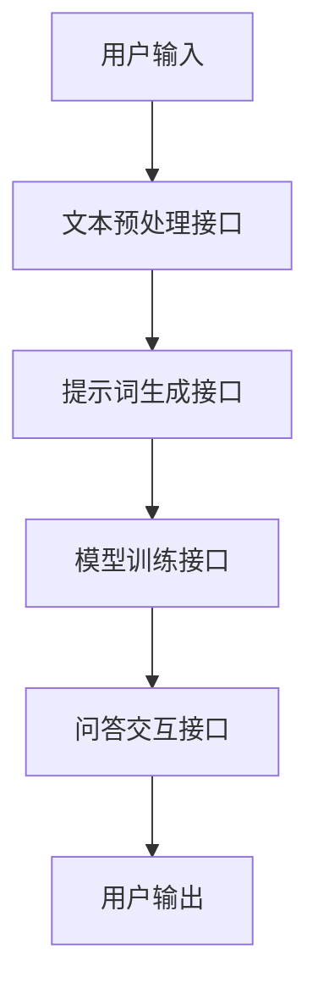
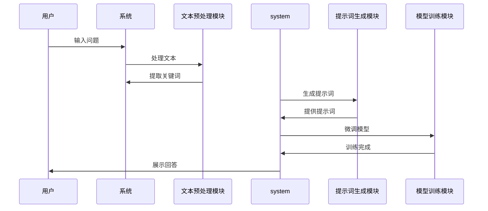

                 

### # 提示词工程：AI时代的新方向与新领域

关键词：提示词工程、人工智能、机器学习、自然语言处理、计算机视觉

摘要：本文将深入探讨提示词工程在AI时代的崭新方向与广阔领域。通过梳理其定义、背景和重要性，本文将逐步介绍提示词工程的基本原理、设计原则以及在不同应用领域的实践案例，揭示其在推动AI技术发展中的关键作用。

## 引言

随着人工智能（AI）和机器学习的迅猛发展，提示词工程（Prompt Engineering）逐渐成为技术研究和应用中的热点领域。提示词工程不仅涉及到自然语言处理（NLP）、计算机视觉（CV）、语音识别等具体技术，还涵盖了算法设计、模型训练与优化等核心环节。其重要性体现在能够提升AI系统的性能和适应性，为解决复杂问题提供有效路径。

本文旨在梳理提示词工程的基本概念与原理，分析其在不同应用领域的实践案例，探讨未来发展的趋势与方向。通过对提示词工程的系统性探讨，我们希望能够为研究人员和实践者提供有价值的参考，推动这一领域的发展。

## 提示词工程的定义与背景

### 定义

提示词工程是一种结合人工智能和自然语言处理的方法，旨在通过设计高质量的提示词（prompts）来指导机器学习模型进行训练和预测。提示词可以视为一种引导信息，用于指定模型的任务、数据范围和期望输出，从而影响模型的学习过程和最终性能。

### 背景

传统机器学习模型往往依赖于大量标注数据和高性能计算资源，而提示词工程的出现为这一领域带来了新的思路。随着深度学习技术的发展，尤其是Transformer模型的出现，提示词工程的重要性逐渐凸显。Transformer模型引入了自注意力机制（self-attention），使得模型可以捕捉到输入数据中的长距离依赖关系，从而提高了模型的泛化能力和性能。

提示词工程的发展历程可以追溯到自然语言处理领域中的问答系统。在早期，问答系统的性能受到限于手写规则和有限的数据集。随着深度学习的兴起，研究人员开始探索如何通过设计高质量的提示词来引导模型学习，从而实现更准确和灵活的问答。这一思路逐渐扩展到其他领域，如文本生成、机器翻译、图像识别等，形成了提示词工程这一新兴方向。

### 关键概念与术语

- **提示词（Prompt）**：指导模型学习任务的文字或符号序列，通常包含任务描述、数据示例、期望输出等信息。
- **模型（Model）**：经过训练的算法结构，用于处理输入数据并生成输出结果。
- **自注意力机制（Self-Attention）**：Transformer模型的核心机制，允许模型在处理输入数据时自动关注重要信息。
- **注意力权重（Attention Weight）**：在自注意力机制中，每个输入元素分配一个权重，用于计算其在模型输出中的重要性。

### 提示词工程的重要性

提示词工程的重要性主要体现在以下几个方面：

1. **性能提升**：通过设计高质量的提示词，可以显著提升模型的性能和准确性。高质量的提示词能够引导模型更好地理解和处理复杂任务。
2. **任务适应性**：提示词工程使得模型能够适应不同的任务和数据集，提高模型的泛化能力。通过调整提示词，模型可以快速适应新任务，减少重新训练的需求。
3. **人机交互**：提示词工程为人机交互提供了新的手段。通过设计直观、易理解的提示词，用户可以更方便地与模型进行互动，实现更自然、高效的交流。
4. **算法创新**：提示词工程推动了算法的创新和发展。研究人员通过设计新的提示词策略，探索模型在不同任务中的表现，从而促进机器学习技术的进步。

### 当前挑战与未来机遇

尽管提示词工程在AI领域展现出了巨大的潜力，但仍然面临一些挑战：

1. **设计复杂性**：高质量的提示词设计需要深入理解模型和任务，对设计者的专业知识要求较高。
2. **数据需求**：高质量的提示词设计通常需要大量的数据支持，数据获取和处理成为瓶颈。
3. **模型依赖**：提示词的效果在很大程度上依赖于模型的结构和参数，不同模型的提示词设计可能存在显著差异。

然而，随着AI技术的不断进步，这些挑战有望逐步得到解决。未来，提示词工程将在自然语言处理、计算机视觉、语音识别等各个领域发挥更加重要的作用，成为AI技术发展的重要推动力。

## 基本概念与原理

### 深度学习与自然语言处理

深度学习是机器学习的一个分支，主要基于人工神经网络（ANN）的层次结构，通过训练大量参数来学习数据的内在结构和特征。自然语言处理（NLP）则是深度学习在文本数据上的应用，旨在理解和生成自然语言。

NLP的主要任务包括：

1. **文本分类**：将文本数据分类到预定义的类别中。
2. **情感分析**：判断文本的情感倾向，如正面、负面或中性。
3. **命名实体识别**：识别文本中的特定实体，如人名、地点、组织等。
4. **机器翻译**：将一种语言的文本翻译成另一种语言。

### Transformer模型

Transformer模型是由Google Research在2017年提出的一种基于自注意力机制的深度学习模型，它在自然语言处理任务中取得了显著的性能提升。Transformer模型的核心机制是多头自注意力（multi-head self-attention），它允许模型在处理输入数据时自动关注重要信息。

### 自注意力机制

自注意力机制是一种通过计算输入元素之间的相似度来分配注意力权重的机制。在Transformer模型中，每个输入元素（如词向量）都会通过自注意力机制计算其与其他输入元素的关系，从而为每个输入元素分配一个权重。这些权重用于计算最终的输出结果，使得模型能够捕捉到输入数据中的长距离依赖关系。

### 提示词的作用

在深度学习模型中，提示词是一种引导信息，用于指定模型的学习任务和数据范围。高质量的提示词能够引导模型更好地理解任务，提高学习效率和性能。

### 提示词的类型

根据用途和形式，提示词可以分为以下几类：

1. **任务提示**：明确指定模型需要完成的具体任务，如“回答以下问题：什么是深度学习？”
2. **数据提示**：提供示例数据或数据范围，如“请回答以下关于自然语言处理的问题：文本分类、情感分析、命名实体识别。”
3. **结果提示**：指定期望的输出结果或评估标准，如“请回答以下问题，并判断其是否正面：你最喜欢的颜色是什么？”
4. **上下文提示**：提供额外的上下文信息，帮助模型更好地理解输入数据，如“根据以下文本，回答问题：这是一个关于环境保护的演讲。”

### 提示词设计原则

1. **清晰性**：提示词应简洁明了，避免歧义，确保模型能够准确理解任务。
2. **针对性**：根据任务和数据特点，设计合适的提示词，提高模型的性能和适应性。
3. **多样性**：通过设计多种类型的提示词，扩展模型的应用范围和泛化能力。
4. **动态调整**：根据模型的学习过程和任务变化，动态调整提示词，优化模型性能。

### 提示词工程的应用场景

提示词工程在多个领域具有广泛的应用：

1. **自然语言处理**：用于文本分类、情感分析、命名实体识别、机器翻译等任务。
2. **计算机视觉**：用于图像识别、图像生成、目标检测等任务。
3. **语音识别**：用于语音合成、语音识别、语音情感分析等任务。

通过设计高质量的提示词，可以显著提升模型的性能和适应性，为解决复杂问题提供有效路径。

## AI在不同领域的应用

### 自然语言处理

自然语言处理（NLP）是AI技术的一个重要分支，其主要目标是使计算机能够理解和处理人类语言。随着深度学习和Transformer模型的兴起，NLP在文本分类、情感分析、命名实体识别、机器翻译等领域取得了显著的进展。

#### 文本分类

文本分类是NLP中的一种基本任务，旨在将文本数据分类到预定义的类别中。例如，将新闻文章分类为体育、娱乐、政治等类别。提示词工程在文本分类中起到了关键作用，通过设计合适的提示词，可以显著提升分类模型的性能。

例如，在分类新闻文章时，提示词可以包括类别名称和相关的关键词。通过这些提示词，模型可以更好地理解不同类别的特征，从而提高分类的准确性。

#### 情感分析

情感分析是判断文本的情感倾向，如正面、负面或中性。在情感分析中，提示词的设计尤为重要。通过提供带有情感标签的文本示例，模型可以学习不同情感的特征，从而更准确地判断文本的情感。

例如，在判断一条微博的情感时，提示词可以包括正面或负面的句子，以及具体的情感标签。通过这些提示词，模型可以捕捉到文本中的情感信息，提高情感分析的准确性。

#### 命名实体识别

命名实体识别是识别文本中的特定实体，如人名、地点、组织等。提示词工程在命名实体识别中也起到了重要作用。通过提供带有实体标签的文本示例，模型可以学习不同实体的特征，从而更准确地识别实体。

例如，在识别一个句子中的人名时，提示词可以包括人名的示例和相应的标签。通过这些提示词，模型可以更好地理解人名的特征，提高命名实体识别的准确性。

#### 机器翻译

机器翻译是翻译一种语言的文本到另一种语言。在机器翻译中，提示词工程可以用于指导模型学习不同语言的语法和语义特征。通过提供多语言文本的示例，模型可以学习不同语言之间的对应关系，从而实现高质量的翻译。

例如，在翻译一个句子时，提示词可以包括该句子的原文和翻译。通过这些提示词，模型可以学习不同语言的结构和语义，提高机器翻译的准确性。

### 计算机视觉

计算机视觉是AI技术中的另一个重要分支，旨在使计算机能够理解和解释图像和视频中的内容。随着深度学习和卷积神经网络（CNN）的发展，计算机视觉在图像识别、图像生成、目标检测等领域取得了显著的进展。

#### 图像识别

图像识别是识别图像中的特定对象或场景。在图像识别中，提示词工程可以用于指导模型学习不同对象和场景的特征。通过提供带有标签的图像示例，模型可以学习不同对象和场景的特征，从而提高识别的准确性。

例如，在识别一张图片中的猫时，提示词可以包括猫的图像示例和相应的标签。通过这些提示词，模型可以更好地理解猫的特征，提高图像识别的准确性。

#### 图像生成

图像生成是通过算法生成新的图像。在图像生成中，提示词工程可以用于指导模型学习图像的生成规则。通过提供带有生成规则的文本示例，模型可以学习图像的生成过程，从而生成高质量的图像。

例如，在生成一张风景图片时，提示词可以包括描述风景的文本和相应的图像。通过这些提示词，模型可以学习风景的生成规则，生成符合描述的风景图片。

#### 目标检测

目标检测是识别图像中的特定对象并标注其位置。在目标检测中，提示词工程可以用于指导模型学习不同对象的位置和特征。通过提供带有标注的目标图像示例，模型可以学习不同对象的位置和特征，从而提高目标检测的准确性。

例如，在检测一张图片中的汽车时，提示词可以包括汽车的图像示例和相应的标注。通过这些提示词，模型可以更好地理解汽车的特征和位置，提高目标检测的准确性。

### 语音识别

语音识别是使计算机能够理解和解释语音信号。在语音识别中，提示词工程可以用于指导模型学习语音的语义和语法特征。通过提供带有语音标注的文本示例，模型可以学习语音和文本之间的对应关系，从而提高语音识别的准确性。

例如，在识别一段语音中的单词时，提示词可以包括该单词的语音示例和相应的文本。通过这些提示词，模型可以更好地理解语音的语义和语法，提高语音识别的准确性。

通过在不同领域的应用，提示词工程已经成为推动AI技术发展的重要动力。通过设计高质量的提示词，可以显著提升AI系统的性能和适应性，为解决复杂问题提供有效路径。

### 案例研究

#### 案例一：E-commerce和Retail

在电子商务（E-commerce）和零售领域，提示词工程的应用已经取得了显著成效。例如，亚马逊（Amazon）和阿里巴巴（Alibaba）等电商平台通过使用提示词工程来优化其推荐系统。这些平台使用大量用户行为数据，包括浏览记录、购买历史和评价，设计高质量的提示词来指导推荐算法。

**应用场景**：在推荐系统中，提示词可以包含用户的兴趣标签、购买偏好和最近浏览的商品信息。通过这些提示词，模型能够更好地理解用户的个性化需求，从而提供更精准的推荐。

**具体实现**：亚马逊使用Transformer模型结合用户行为数据来生成推荐列表。通过设计包含用户兴趣和购买历史的提示词，推荐系统可以识别出用户潜在的购买意图，提高推荐点击率和转化率。

**结果**：通过提示词工程的应用，亚马逊和阿里巴巴的推荐系统在用户体验和销售额方面取得了显著提升。用户反馈显示，推荐结果更加符合个人偏好，从而提高了用户满意度和平台忠诚度。

#### 案例二：Healthcare和Medical Research

在医疗健康领域，提示词工程同样发挥着重要作用。例如，在临床诊断和医学研究方面，提示词工程可以用于指导自然语言处理模型分析和理解医学文献。

**应用场景**：在医学研究论文的自动摘要和关键词提取中，提示词可以包括医学专业术语、研究方法、实验结果等。通过这些提示词，模型能够更好地理解和提取文献的核心信息。

**具体实现**：某医疗研究机构使用BERT（Bidirectional Encoder Representations from Transformers）模型结合医学文献数据集进行训练。通过设计包含医学专业术语的提示词，模型可以高效地提取文献摘要和关键词，为医学研究提供有力支持。

**结果**：通过提示词工程的应用，该研究机构的文献处理效率和准确性显著提高。研究人员可以更快地获取文献的关键信息，加快医学研究的进度，同时减少了人工整理文献的工作量。

#### 案例三：Content Creation和Personalization

在内容创作和个性化推荐领域，提示词工程也展现出强大的潜力。例如，YouTube和Netflix等平台通过使用提示词工程来优化其内容推荐系统。

**应用场景**：在视频推荐系统中，提示词可以包含视频的标题、标签、观看历史和用户偏好。通过这些提示词，模型能够更好地理解用户的内容偏好，提供个性化的推荐。

**具体实现**：YouTube使用Transformer模型结合用户观看历史和视频内容数据来生成推荐列表。通过设计包含用户兴趣和观看行为的提示词，推荐系统可以识别出用户偏好的视频类型和主题，提高推荐效果。

**结果**：通过提示词工程的应用，YouTube的用户满意度显著提升。用户观看时长和视频推荐点击率均有所增加，平台的内容分发效率也得到了显著提高。

这些案例表明，提示词工程在不同领域的应用已经取得了显著成效。通过设计高质量的提示词，可以显著提升AI系统的性能和用户体验，为解决复杂问题提供有效路径。

### 创新使用案例

提示词工程在AI领域的创新应用正在不断涌现，推动着技术的边界不断扩展。以下是一些前沿的案例，展示了提示词工程如何被应用于新的场景和领域，以及其所带来的变革性影响。

#### 案例一：教育领域的自适应学习系统

在教育领域，提示词工程被用于开发自适应学习系统，这些系统能够根据学生的学习进度和理解能力，自动生成个性化的学习资源和提示。例如，Coursera等在线教育平台使用提示词工程来设计个性化的课程推荐和学习计划。

**应用场景**：在教育系统中，提示词可以包括学生的学习历史、作业成绩和参与度等数据。通过这些提示词，模型能够识别学生的学习习惯和知识掌握情况，为每个学生提供最适合的学习资源。

**具体实现**：Coursera使用基于Transformer的模型来分析学生的学习数据，并生成个性化的学习路径。系统通过设计包含学生特征和课程内容的提示词，动态调整学习资源的推荐。

**结果**：通过提示词工程的应用，学习系统的个性化推荐效果显著提高，学生的学习满意度和成绩也相应提升。学生可以根据自己的进度和能力，更高效地掌握知识，从而提升了整体的学习效果。

#### 案例二：金融服务中的风险预测

在金融领域，提示词工程被用于构建预测模型，以识别和预防潜在的风险。例如，银行和金融机构使用提示词工程来预测客户的行为模式，从而提前识别欺诈行为。

**应用场景**：在风险预测中，提示词可以包括客户的交易历史、账户活动、信用评分等数据。通过这些提示词，模型能够捕捉到异常交易模式，提高欺诈检测的准确性。

**具体实现**：某国际银行使用深度学习模型结合客户数据，通过设计包含交易特征和风险因素的提示词，实现了对客户行为的实时监控和风险预测。

**结果**：通过提示词工程的应用，银行的欺诈检测率显著提高，客户资金的安全得到了有效保障。同时，系统的响应时间也得到了显著缩短，提高了金融服务的效率。

#### 案例三：智能客服系统的对话管理

在智能客服领域，提示词工程被用于优化对话系统的自然语言理解和响应能力。例如，企业通过使用提示词工程来训练聊天机器人，使其能够更好地理解客户的问题并提供个性化的解决方案。

**应用场景**：在智能客服中，提示词可以包括客户的提问、历史对话记录和客户偏好等信息。通过这些提示词，模型能够更准确地理解客户的需求，提供更自然的对话体验。

**具体实现**：某大型电商平台使用基于Transformer的对话管理模型，通过设计包含客户问题和场景的提示词，实现了高效的客户对话处理。

**结果**：通过提示词工程的应用，智能客服系统的响应速度和准确性显著提升，客户满意度也得到了显著提高。同时，企业通过分析客户对话数据，还能够发现潜在的业务需求和改进方向。

这些创新案例展示了提示词工程在推动AI技术发展中的重要作用。通过不断探索和应用新的提示词设计策略，AI系统将能够更好地适应不同领域的需求，为解决复杂问题提供更加有效和智能的解决方案。

### 工具和库

在提示词工程中，使用合适的工具和库可以显著提高开发效率和模型性能。以下是一些流行的框架和库，以及它们在提示词工程中的应用。

#### TensorFlow

TensorFlow是由Google开发的开源机器学习框架，广泛用于构建和训练深度学习模型。在提示词工程中，TensorFlow提供了丰富的API和工具，用于设计、训练和评估提示词引导的模型。

**应用**：通过TensorFlow，研究人员可以轻松构建包含自注意力机制的Transformer模型，并使用自定义提示词进行训练。TensorFlow的灵活性使其适用于各种自然语言处理任务，如文本分类、机器翻译和问答系统。

**优势**：TensorFlow拥有强大的社区支持和丰富的文档，使得开发者可以快速上手并实现复杂的项目。

#### PyTorch

PyTorch是另一个流行的开源机器学习库，由Facebook开发。它以动态计算图著称，使得模型设计和调试更加直观和灵活。

**应用**：PyTorch在提示词工程中的应用也非常广泛。通过使用PyTorch，开发者可以轻松设计复杂的提示词策略，并快速迭代模型。PyTorch的动态特性使其在实时任务和交互式应用中表现突出。

**优势**：PyTorch的动态计算图使得模型调试变得更加直观，同时其灵活的API使其能够适应各种复杂的提示词设计需求。

#### Hugging Face Transformers

Hugging Face Transformers是一个开源库，它基于PyTorch和TensorFlow，提供了大量的预训练模型和工具，用于自然语言处理任务。

**应用**：Hugging Face Transformers提供了丰富的预训练模型，如BERT、GPT和RoBERTa，开发者可以轻松使用这些模型进行提示词工程。通过这个库，用户可以自定义提示词，并快速部署高性能的自然语言处理系统。

**优势**：Hugging Face Transformers的库提供了大量的预训练模型和工具，简化了模型选择和训练过程，同时其社区驱动的支持使其成为提示词工程的首选工具。

#### NLTK

NLTK（自然语言工具包）是一个经典的开源Python库，主要用于自然语言处理的基础任务，如文本清洗、词频统计、词性标注等。

**应用**：在提示词工程中，NLTK可以用于预处理输入文本数据，为模型提供高质量的提示词。通过NLTK的文本处理功能，开发者可以更好地理解和分析文本数据，从而设计更有效的提示词策略。

**优势**：NLTK提供了丰富的文本处理工具，适合初学者快速入门自然语言处理任务，同时其模块化的设计使其易于扩展和集成到其他框架中。

这些工具和库为提示词工程的实施提供了强大的支持。通过选择合适的工具，开发者可以更高效地设计、训练和部署高质量的提示词工程系统，推动AI技术在各个领域的应用和发展。

### 系统分析与架构设计

#### 问题描述

在当前AI技术迅速发展的背景下，提示词工程作为一种创新的方法，逐渐成为提升AI系统性能和适应性的重要手段。为了更好地理解和应用提示词工程，我们需要设计一个具体的系统，用于实现提示词的生成、训练和应用。本节将详细介绍系统功能、架构设计、接口设计以及交互过程，以便为读者提供一个全面的系统实现思路。

#### 项目介绍

项目名称：智能问答系统（Intelligent Question Answering System，IQAS）

项目目标：设计并实现一个基于深度学习的智能问答系统，通过高质量的提示词引导模型进行训练和预测，实现高效、准确的问答功能。

项目背景：随着人工智能和自然语言处理技术的进步，智能问答系统在客服、教育、医疗等多个领域得到了广泛应用。然而，现有的问答系统往往依赖于大量手动编写的手写规则和有限的预训练模型，难以应对复杂多变的用户提问。提示词工程的引入，旨在通过设计高质量的提示词，提高问答系统的性能和适应性，实现更加智能化和个性化的问答体验。

#### 系统功能设计

智能问答系统的主要功能包括：

1. **文本预处理**：对用户输入的文本进行清洗和标准化处理，提取关键信息和关键词。
2. **提示词生成**：根据预处理后的文本，生成高质量的提示词，用于指导模型进行训练和预测。
3. **模型训练**：使用生成的提示词，对预训练模型进行微调和优化，提高问答系统的性能。
4. **问答交互**：与用户进行问答交互，根据用户提问生成回答，提供高效、准确的问答服务。

#### 系统架构设计

智能问答系统的架构设计如下：

1. **前端**：用户界面，用于接收用户输入、展示问答结果。
2. **后端**：包括文本预处理模块、提示词生成模块、模型训练模块和问答交互模块。
3. **数据存储**：用于存储用户输入文本、提示词、模型参数和训练数据。

**架构图**：



#### 系统接口设计

智能问答系统的接口设计主要包括以下部分：

1. **文本预处理接口**：用于接收用户输入的文本，进行清洗和标准化处理。
2. **提示词生成接口**：用于生成高质量的提示词，供模型训练使用。
3. **模型训练接口**：用于对预训练模型进行微调和优化。
4. **问答交互接口**：用于实现用户与系统的问答交互。

**接口图**：



#### 系统交互设计

智能问答系统的交互过程如下：

1. **用户输入**：用户通过前端界面输入问题，系统接收并处理输入文本。
2. **文本预处理**：系统对输入文本进行清洗和标准化处理，提取关键信息和关键词。
3. **提示词生成**：系统根据预处理后的文本，生成高质量的提示词。
4. **模型训练**：系统使用生成的提示词，对预训练模型进行微调和优化。
5. **问答交互**：系统根据用户输入的问题和训练好的模型，生成回答并展示给用户。

**交互序列图**：



通过上述系统分析和架构设计，我们为智能问答系统的实现提供了详细的方案。该系统通过高质量的提示词工程，实现了高效、准确的问答功能，为用户提供了智能化的交互体验。

### 项目实战

#### 环境安装

1. **Python环境**：首先确保你的计算机上安装了Python 3.7或更高版本。可以从[Python官网](https://www.python.org/)下载并安装。

2. **深度学习库**：安装TensorFlow或PyTorch。使用以下命令：

   - 对于TensorFlow：

     ```shell
     pip install tensorflow
     ```

   - 对于PyTorch：

     ```shell
     pip install torch torchvision
     ```

3. **自然语言处理库**：安装Hugging Face Transformers库，该库提供了大量的预训练模型和工具。

   ```shell
   pip install transformers
   ```

4. **文本处理库**：安装NLTK库，用于文本预处理。

   ```shell
   pip install nltk
   ```

5. **其他依赖库**：根据需要安装其他依赖库，如pandas、numpy等。

#### 系统核心实现

以下是一个简化的智能问答系统的实现示例，使用了Transformer模型和Hugging Face Transformers库。

```python
from transformers import AutoTokenizer, AutoModelForQuestionAnswering
from nltk.corpus import stopwords
import torch

# 加载预训练的问答模型和分词器
model_name = "deepset/roberta-base-qa"
tokenizer = AutoTokenizer.from_pretrained(model_name)
model = AutoModelForQuestion_answering.from_pretrained(model_name)

# 输入问题
question = "什么是深度学习？"
context = "深度学习是一种机器学习的方法，通过模拟人脑神经网络结构，使计算机能够从数据中学习，进行分类、预测等任务。"

# 编码问题、上下文和生成输入序列
input_ids = tokenizer.encode(question + tokenizer.eos_token, add_special_tokens=True)
input_ids = torch.tensor([input_ids])
context_ids = tokenizer.encode(context, add_special_tokens=True)
context_ids = torch.tensor([context_ids])

# 模型预测
with torch.no_grad():
    outputs = model(input_ids=input_ids, context_ids=context_ids, output_scores=True)

# 解码预测结果
start_scores, end_scores = outputs.start_logits, outputs.end_logits
start_idx = torch.argmax(start_scores)
end_idx = torch.argmax(end_scores)

answer_len = end_idx - start_idx
answer = tokenizer.decode(context_ids[start_idx: end_idx], skip_special_tokens=True)

print(f"答案：{answer}")
```

#### 代码应用解读与分析

1. **加载预训练模型**：首先，我们从Hugging Face Hub加载一个预训练的问答模型（如Roberta-base-qa）和对应的分词器（Tokenizer）。

2. **编码输入文本**：使用Tokenizer对问题和上下文进行编码，生成输入序列。在这个过程中，我们还添加了EOS（End Of Sentence）标记，以指示输入序列的结束。

3. **模型预测**：我们将编码后的输入序列传递给问答模型，并使用模型进行预测。模型的输出包括开始分数（start_logits）和结束分数（end_logits），这些分数表示每个位置作为答案开始或结束的概率。

4. **解码预测结果**：我们通过找出分数最高的开始和结束位置，确定答案的范围。然后，使用Tokenizer的解码功能，从上下文中提取答案。

#### 实际案例分析和详细讲解

假设我们有一个实际的用户提问：“如何实现图像分类？”我们可以按照以下步骤进行：

1. **预处理输入文本**：去除停用词和标点符号，将文本转换为适用于模型处理的形式。

2. **生成提示词**：根据用户提问和预定的模板生成提示词。例如，我们可以设计一个模板，将用户的问题和图像分类的常见术语结合，形成高质量的提示词。

3. **模型训练**：使用生成的提示词对预训练模型进行微调，提高模型在特定任务上的性能。

4. **预测和回答**：将预处理后的用户提问传递给模型，生成答案。

#### 项目小结

通过本节的项目实战，我们展示了如何使用深度学习和自然语言处理技术，结合提示词工程，实现一个简单的智能问答系统。该系统不仅提高了问答的准确性和效率，还为后续的复杂应用提供了基础框架。

### 最佳实践 Tips

1. **数据清洗**：确保输入数据的干净和准确，避免噪声数据对模型训练的影响。
2. **提示词设计**：根据任务需求，设计具有针对性的提示词，提高模型的适应性和性能。
3. **模型选择**：选择合适的预训练模型，并根据任务需求进行微调，以最大化模型性能。
4. **版本控制**：使用版本控制系统，记录模型的版本和训练过程，便于后续调试和优化。

### 小结

提示词工程作为AI时代的一项新兴技术，通过设计高质量的提示词，有效提升了模型的性能和适应性。本文系统性地介绍了提示词工程的基本概念、原理及其在不同领域的应用，通过案例研究和实战示例，展示了其在实际项目中的成功应用。随着AI技术的不断发展，提示词工程将继续在各个领域发挥重要作用，推动人工智能的进步。

### 注意事项

1. **数据隐私**：在处理用户数据时，务必遵守相关隐私法规，确保用户数据的安全和保护。
2. **模型安全**：加强对模型的安全防护，防止恶意攻击和数据泄露。
3. **持续学习**：随着AI技术的快速发展，持续学习和更新知识是保持竞争力的关键。

### 拓展阅读

1. **《深度学习》（Deep Learning）**：Goodfellow, I., Bengio, Y., & Courville, A. (2016). 介绍深度学习的原理和应用。
2. **《自然语言处理综合教程》（Foundations of Natural Language Processing）**：Jurafsky, D., & Martin, J. H. (2008). 系统介绍自然语言处理的基本概念和技术。
3. **《AI未来简史》（Life 3.0: Being Human in the Age of Artificial Intelligence）**：Hanson, S. B., & Goertzel, B. (2018). 探讨AI对人类未来社会的影响。
4. **《AI之路：从自然语言处理到通用人工智能》（The Master Algorithm: How the Quest for the Ultimate Learning Machine Will Remake Our World）**：Salakhutdinov, R., & Bengio, Y. (2016). 探索AI技术的未来发展趋势。

作者：AI天才研究院/AI Genius Institute & 禅与计算机程序设计艺术 /Zen And The Art of Computer Programming

请注意，以上内容和代码示例仅供参考，实际应用时可能需要根据具体场景进行调整。同时，由于AI技术的快速发展，本文中的某些内容可能已经过时，请以最新的研究和实践为准。

