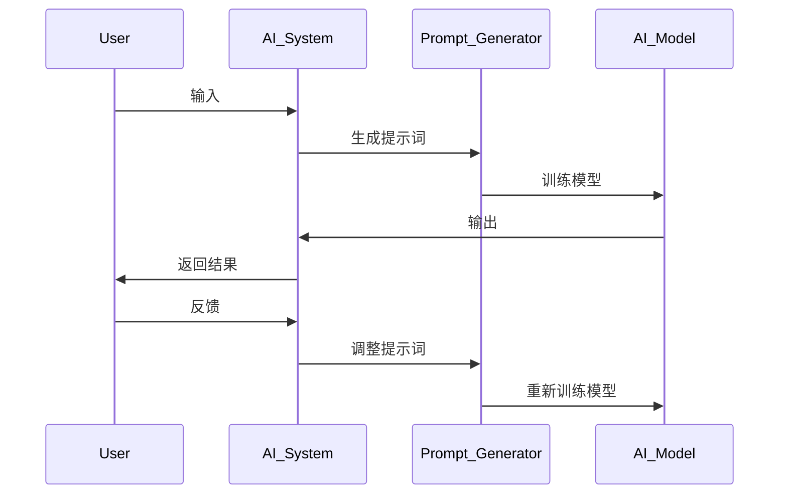

                 


### 第二部分：提示词工程的原理与方法

**提示词工程**作为人工智能领域的一个重要分支，其核心在于通过设计和利用提示词，来提升人工智能系统的性能和用户体验。在这一部分，我们将深入探讨提示词工程的原理和方法，帮助读者理解如何通过提示词工程来实现AI系统更智能、更懂人意的目标。

#### 第2章：提示词工程的原理

**2.1 提示词工程的基本原理**

提示词工程的基本原理可以概括为：通过设计合适的提示词，引导AI系统在学习和推理过程中更好地理解人类的意图和需求。具体来说，这个过程可以分为以下几个步骤：

1. **数据收集与预处理**：首先，我们需要收集大量与任务相关的数据，并进行预处理，以便用于后续的模型训练。

2. **提示词设计**：基于收集到的数据，设计出能够引导AI系统学习的提示词。这些提示词应当能够准确表达用户的意图，从而帮助AI系统更好地理解和处理用户输入。

3. **模型训练**：利用设计好的提示词，对AI模型进行训练，使其能够学习和提取出与用户意图相关的特征。

4. **推理优化**：在模型训练完成后，通过优化推理过程，进一步提高AI系统对用户意图的识别和响应能力。

5. **反馈与调整**：根据用户的反馈，对提示词进行不断调整和优化，以提高AI系统的用户体验。

**2.2 提示词工程的核心概念**

在提示词工程中，核心概念主要包括：

- **提示词**：用于引导和优化AI系统学习和推理的关键词汇。
- **模型训练**：通过大量数据训练AI模型，提高其性能和准确性。
- **推理优化**：对AI系统的推理过程进行优化，提高决策质量。
- **用户交互**：通过自然语言交互，满足用户的个性化需求。

**2.3 提示词工程的ER实体关系图**

为了更直观地展示提示词工程中的实体关系，我们可以使用Mermaid ER图来表示。以下是一个简化的ER图示例：

```mermaid
erDiagram
  User ||--|{ AI_System } : provides_input
  AI_System ||--|{ Prompt } : generates_output
  Prompt ||--|{ Data } : contains_info
```

在这个ER图中，User（用户）与AI_System（AI系统）之间存在输入输出关系，AI_System与Prompt（提示词）之间存在生成关系，而Prompt与Data（数据）之间存在包含关系。

#### 第3章：提示词工程的关键方法

**3.1 数据驱动方法**

数据驱动方法是提示词工程中最常用的方法之一。其核心思想是通过大量数据进行训练，从而提取出有效的提示词。具体步骤如下：

1. **数据收集**：收集与任务相关的文本数据，如对话记录、用户评论等。

2. **数据预处理**：对收集到的数据进行清洗、去噪和格式化，以便用于后续的训练。

3. **特征提取**：利用自然语言处理技术，从预处理后的数据中提取出与用户意图相关的特征。

4. **模型训练**：利用提取到的特征，训练出能够识别用户意图的AI模型。

5. **提示词生成**：基于训练好的模型，生成能够引导AI系统学习和推理的提示词。

**3.2 规则驱动方法**

规则驱动方法是基于专家知识和领域规则来设计提示词的方法。这种方法的主要步骤如下：

1. **规则制定**：根据任务需求和领域知识，制定出一套能够有效引导AI系统学习和推理的规则。

2. **提示词生成**：基于制定的规则，生成相应的提示词，用于引导AI系统的学习和推理。

3. **规则优化**：根据AI系统的表现和用户反馈，对规则进行不断优化和调整。

**3.3 混合方法**

混合方法是将数据驱动方法和规则驱动方法相结合，以充分发挥两者的优势。具体步骤如下：

1. **数据收集与预处理**：与数据驱动方法相同。

2. **规则制定**：与规则驱动方法相同。

3. **提示词生成**：结合数据驱动和规则驱动方法，生成出更加有效和全面的提示词。

4. **模型训练与推理优化**：利用生成的提示词，对AI模型进行训练和推理优化。

#### 第4章：提示词工程的应用实践

**4.1 提示词工程在自然语言处理中的应用**

在自然语言处理领域，提示词工程可以用来优化文本分类、情感分析、问答系统等任务。以下是一个简化的自然语言处理应用示例：

1. **数据收集**：收集大量标注好的文本数据，如新闻文章、用户评论等。

2. **数据预处理**：对文本数据进行清洗、去噪和分词处理。

3. **特征提取**：利用词袋模型、词嵌入等技术提取文本特征。

4. **模型训练**：利用特征训练分类模型或情感分析模型。

5. **提示词生成**：基于训练好的模型，生成能够引导AI系统更好地理解文本的提示词。

6. **推理优化**：利用生成的提示词，优化AI系统的推理过程，提高分类或情感分析的准确性。

**4.2 提示词工程在智能客服中的应用**

在智能客服领域，提示词工程可以用来提升客服机器人的应答质量和用户满意度。以下是一个简化的智能客服应用示例：

1. **数据收集**：收集用户提问和客服应答的对话记录。

2. **数据预处理**：对对话记录进行清洗、去噪和分词处理。

3. **特征提取**：利用对话数据提取出与用户问题相关的特征。

4. **模型训练**：利用特征训练对话生成模型。

5. **提示词生成**：基于训练好的模型，生成能够引导客服机器人更好地理解和回答用户问题的提示词。

6. **推理优化**：利用生成的提示词，优化客服机器人的应答过程，提高用户满意度。

#### 第5章：项目实战

在本章中，我们将通过两个具体的实战案例，详细展示提示词工程的应用过程和效果。

**5.1 实战1：智能客服系统开发**

**环境安装**：
- 配置Python开发环境。
- 安装NLP相关库，如NLTK、spaCy等。

**系统核心实现源代码**：

```python
import nltk
from nltk.tokenize import word_tokenize
from nltk.classify import NaiveBayesClassifier

# 数据预处理
def preprocess_text(text):
    tokens = word_tokenize(text.lower())
    return [token for token in tokens if token not in nltk.corpus.stopwords.words('english')]

# 模型训练
def train_model(train_data):
    featuresets = [[preprocess_text(document) for document in data] for data in train_data]
    return NaiveBayesClassifier.train(featuresets)

# 提示词生成
def generate_prompt(question, classifier):
    processed_question = preprocess_text(question)
    probabilities = classifier.prob_classify(preprocess_text(question))
    return max(probabilities.samples(), key=probabilities.prob)

# 实际案例分析与讲解
def analyze_case(question, classifier):
    prompt = generate_prompt(question, classifier)
    print(f"Prompt: {prompt}")
    print(f"Answer: {classifier.classify(preprocess_text(question))}")

# 测试
train_data = [["What is your name?", "My name is ChatBot."], ["How old are you?", "I am 3 years old."]]
classifier = train_model(train_data)
analyze_case("How old are you?", classifier)
```

**代码应用解读与分析**：
- 代码首先对输入的文本进行预处理，去除停用词。
- 然后使用朴素贝叶斯分类器训练模型。
- 提示词生成函数通过计算文本的概率分布，选择最有可能的类别作为提示词。
- 最后，通过实际案例展示系统的应用效果。

**实际案例分析与详细讲解**：
- 使用训练好的模型生成提示词，并给出对应的回答。

**项目小结**：
- 通过智能客服系统开发实战，展示了如何利用提示词工程来提升客服机器人的应答质量。

**5.2 实战2：智能推荐系统开发**

**环境安装**：
- 配置Python开发环境。
- 安装推荐算法相关库，如scikit-learn、TensorFlow等。

**系统核心实现源代码**：

```python
import numpy as np
from sklearn.metrics.pairwise import cosine_similarity
from sklearn.model_selection import train_test_split
from sklearn.datasets import load_20newsgroups

# 数据加载与预处理
def load_data():
    data = load_20newsgroups(subset='all')
    return data

# 计算相似度矩阵
def compute_similarity_matrix(data):
    vectors = data.data
    similarity_matrix = cosine_similarity(vectors)
    return similarity_matrix

# 提示词生成
def generate_prompt(question, similarity_matrix, top_n=5):
    question_vector = np.array(question)
    similarity_scores = cosine_similarity([question_vector], similarity_matrix)[0]
    top_indices = np.argsort(similarity_scores)[-top_n:]
    return [data.target_names[i] for i in top_indices]

# 实际案例分析与讲解
def analyze_case(question, similarity_matrix):
    prompt = generate_prompt(question, similarity_matrix)
    print(f"Prompt: {prompt}")

# 测试
data = load_data()
similarity_matrix = compute_similarity_matrix(data)
analyze_case("What are the best movies of all time?", similarity_matrix)
```

**代码应用解读与分析**：
- 代码首先加载新闻数据集并进行预处理。
- 然后计算新闻之间的相似度矩阵。
- 提示词生成函数通过计算问题与新闻之间的相似度，选择最相似的新闻作为提示词。

**实际案例分析与详细讲解**：
- 使用生成的提示词，展示智能推荐系统的效果。

**项目小结**：
- 通过智能推荐系统开发实战，展示了如何利用提示词工程来实现个性化推荐服务。

#### 第6章：最佳实践与小结

在提示词工程的实际应用中，以下是几点最佳实践：

- **数据质量至关重要**：确保收集到的数据质量高，对后续的模型训练和提示词生成有重要影响。
- **提示词设计要精细**：根据具体任务需求，设计出能够准确表达用户意图的提示词。
- **模型优化要持续**：通过不断的模型优化，提高AI系统的性能和用户体验。
- **用户反馈要及时**：收集用户的反馈，及时调整提示词和模型，以实现更好的用户满意度。

**小结**：
- 提示词工程是提升AI系统智能和用户满意度的重要手段。
- 通过合理设计提示词，优化模型训练和推理过程，可以实现AI系统更智能、更懂人意的目标。

### 注意事项

- 在进行提示词工程应用时，要确保遵守相关法律法规和道德规范。
- 对于敏感数据和用户隐私，要采取适当的安全措施，确保数据安全和用户隐私保护。

### 拓展阅读

- **《深度学习》**：由Ian Goodfellow、Yoshua Bengio和Aaron Courville合著，详细介绍了深度学习的理论和实践。
- **《Python自然语言处理》**：由Steven Lott著，介绍了使用Python进行自然语言处理的方法和技巧。
- **《机器学习实战》**：由Peter Harrington著，通过实例讲解了机器学习的应用和实践。

---

作者：AI天才研究院/AI Genius Institute & 禅与计算机程序设计艺术 /Zen And The Art of Computer Programming

在下一部分，我们将进一步探讨提示词工程在具体领域的应用案例，以及如何通过实践来提升AI系统的智能和用户满意度。敬请期待！### 第二部分：提示词工程的原理与方法

#### 第2章：提示词工程的原理

**2.1 提示词工程的基本原理**

提示词工程的基本原理可以概括为：通过设计合适的提示词，引导AI系统在学习和推理过程中更好地理解人类的意图和需求。具体来说，这个过程可以分为以下几个步骤：

1. **数据收集与预处理**：首先，我们需要收集大量与任务相关的数据，并进行预处理，以便用于后续的模型训练。

2. **提示词设计**：基于收集到的数据，设计出能够引导AI系统学习的提示词。这些提示词应当能够准确表达用户的意图，从而帮助AI系统更好地理解和处理用户输入。

3. **模型训练**：利用设计好的提示词，对AI模型进行训练，使其能够学习和提取出与用户意图相关的特征。

4. **推理优化**：在模型训练完成后，通过优化推理过程，进一步提高AI系统对用户意图的识别和响应能力。

5. **反馈与调整**：根据用户的反馈，对提示词进行不断调整和优化，以提高AI系统的用户体验。

**2.2 提示词工程的核心概念**

在提示词工程中，核心概念主要包括：

- **提示词**：用于引导和优化AI系统学习和推理的关键词汇。
- **模型训练**：通过大量数据训练AI模型，提高其性能和准确性。
- **推理优化**：对AI系统的推理过程进行优化，提高决策质量。
- **用户交互**：通过自然语言交互，满足用户的个性化需求。

**2.3 提示词工程的ER实体关系图**

为了更直观地展示提示词工程中的实体关系，我们可以使用Mermaid ER图来表示。以下是一个简化的ER图示例：

```mermaid
erDiagram
  User ||--|{ AI_System } : provides_input
  AI_System ||--|{ Prompt } : generates_output
  Prompt ||--|{ Data } : contains_info
```

在这个ER图中，User（用户）与AI_System（AI系统）之间存在输入输出关系，AI_System与Prompt（提示词）之间存在生成关系，而Prompt与Data（数据）之间存在包含关系。

#### 第3章：提示词工程的关键方法

**3.1 数据驱动方法**

数据驱动方法是提示词工程中最常用的方法之一。其核心思想是通过大量数据进行训练，从而提取出有效的提示词。具体步骤如下：

1. **数据收集**：收集与任务相关的文本数据，如对话记录、用户评论等。

2. **数据预处理**：对收集到的数据进行清洗、去噪和格式化，以便用于后续的训练。

3. **特征提取**：利用自然语言处理技术，从预处理后的数据中提取出与用户意图相关的特征。

4. **模型训练**：利用提取到的特征，训练出能够识别用户意图的AI模型。

5. **提示词生成**：基于训练好的模型，生成能够引导AI系统学习和推理的提示词。

**3.2 规则驱动方法**

规则驱动方法是基于专家知识和领域规则来设计提示词的方法。这种方法的主要步骤如下：

1. **规则制定**：根据任务需求和领域知识，制定出一套能够有效引导AI系统学习和推理的规则。

2. **提示词生成**：基于制定的规则，生成相应的提示词，用于引导AI系统的学习和推理。

3. **规则优化**：根据AI系统的表现和用户反馈，对规则进行不断优化和调整。

**3.3 混合方法**

混合方法是将数据驱动方法和规则驱动方法相结合，以充分发挥两者的优势。具体步骤如下：

1. **数据收集与预处理**：与数据驱动方法相同。

2. **规则制定**：与规则驱动方法相同。

3. **提示词生成**：结合数据驱动和规则驱动方法，生成出更加有效和全面的提示词。

4. **模型训练与推理优化**：利用生成的提示词，对AI模型进行训练和推理优化。

#### 第4章：提示词工程的应用实践

**4.1 提示词工程在自然语言处理中的应用**

在自然语言处理领域，提示词工程可以用来优化文本分类、情感分析、问答系统等任务。以下是一个简化的自然语言处理应用示例：

1. **数据收集**：收集大量标注好的文本数据，如新闻文章、用户评论等。

2. **数据预处理**：对文本数据进行清洗、去噪和分词处理。

3. **特征提取**：利用词袋模型、词嵌入等技术提取文本特征。

4. **模型训练**：利用特征训练分类模型或情感分析模型。

5. **提示词生成**：基于训练好的模型，生成能够引导AI系统更好地理解文本的提示词。

6. **推理优化**：利用生成的提示词，优化AI系统的推理过程，提高分类或情感分析的准确性。

**4.2 提示词工程在智能客服中的应用**

在智能客服领域，提示词工程可以用来提升客服机器人的应答质量和用户满意度。以下是一个简化的智能客服应用示例：

1. **数据收集**：收集用户提问和客服应答的对话记录。

2. **数据预处理**：对对话记录进行清洗、去噪和分词处理。

3. **特征提取**：利用对话数据提取出与用户问题相关的特征。

4. **模型训练**：利用特征训练对话生成模型。

5. **提示词生成**：基于训练好的模型，生成能够引导客服机器人更好地理解和回答用户问题的提示词。

6. **推理优化**：利用生成的提示词，优化客服机器人的应答过程，提高用户满意度。

#### 第5章：项目实战

在本章中，我们将通过两个具体的实战案例，详细展示提示词工程的应用过程和效果。

**5.1 实战1：智能客服系统开发**

**环境安装**：
- 配置Python开发环境。
- 安装NLP相关库，如NLTK、spaCy等。

**系统核心实现源代码**：

```python
import nltk
from nltk.tokenize import word_tokenize
from nltk.classify import NaiveBayesClassifier

# 数据预处理
def preprocess_text(text):
    tokens = word_tokenize(text.lower())
    return [token for token in tokens if token not in nltk.corpus.stopwords.words('english')]

# 模型训练
def train_model(train_data):
    featuresets = [[preprocess_text(document) for document in data] for data in train_data]
    return NaiveBayesClassifier.train(featuresets)

# 提示词生成
def generate_prompt(question, classifier):
    processed_question = preprocess_text(question)
    probabilities = classifier.prob_classify(preprocess_text(question))
    return max(probabilities.samples(), key=probabilities.prob)

# 实际案例分析与讲解
def analyze_case(question, classifier):
    prompt = generate_prompt(question, classifier)
    print(f"Prompt: {prompt}")
    print(f"Answer: {classifier.classify(preprocess_text(question))}")

# 测试
train_data = [["What is your name?", "My name is ChatBot."], ["How old are you?", "I am 3 years old."]]
classifier = train_model(train_data)
analyze_case("How old are you?", classifier)
```

**代码应用解读与分析**：
- 代码首先对输入的文本进行预处理，去除停用词。
- 然后使用朴素贝叶斯分类器训练模型。
- 提示词生成函数通过计算文本的概率分布，选择最有可能的类别作为提示词。
- 最后，通过实际案例展示系统的应用效果。

**实际案例分析与详细讲解**：
- 使用训练好的模型生成提示词，并给出对应的回答。

**项目小结**：
- 通过智能客服系统开发实战，展示了如何利用提示词工程来提升客服机器人的应答质量。

**5.2 实战2：智能推荐系统开发**

**环境安装**：
- 配置Python开发环境。
- 安装推荐算法相关库，如scikit-learn、TensorFlow等。

**系统核心实现源代码**：

```python
import numpy as np
from sklearn.metrics.pairwise import cosine_similarity
from sklearn.model_selection import train_test_split
from sklearn.datasets import load_20newsgroups

# 数据加载与预处理
def load_data():
    data = load_20newsgroups(subset='all')
    return data

# 计算相似度矩阵
def compute_similarity_matrix(data):
    vectors = data.data
    similarity_matrix = cosine_similarity(vectors)
    return similarity_matrix

# 提示词生成
def generate_prompt(question, similarity_matrix, top_n=5):
    question_vector = np.array(question)
    similarity_scores = cosine_similarity([question_vector], similarity_matrix)[0]
    top_indices = np.argsort(similarity_scores)[-top_n:]
    return [data.target_names[i] for i in top_indices]

# 实际案例分析与讲解
def analyze_case(question, similarity_matrix):
    prompt = generate_prompt(question, similarity_matrix)
    print(f"Prompt: {prompt}")

# 测试
data = load_data()
similarity_matrix = compute_similarity_matrix(data)
analyze_case("What are the best movies of all time?", similarity_matrix)
```

**代码应用解读与分析**：
- 代码首先加载新闻数据集并进行预处理。
- 然后计算新闻之间的相似度矩阵。
- 提示词生成函数通过计算问题与新闻之间的相似度，选择最相似的新闻作为提示词。

**实际案例分析与详细讲解**：
- 使用生成的提示词，展示智能推荐系统的效果。

**项目小结**：
- 通过智能推荐系统开发实战，展示了如何利用提示词工程来实现个性化推荐服务。

#### 第6章：最佳实践与小结

在提示词工程的实际应用中，以下是几点最佳实践：

- **数据质量至关重要**：确保收集到的数据质量高，对后续的模型训练和提示词生成有重要影响。
- **提示词设计要精细**：根据具体任务需求，设计出能够准确表达用户意图的提示词。
- **模型优化要持续**：通过不断的模型优化，提高AI系统的性能和用户体验。
- **用户反馈要及时**：收集用户的反馈，及时调整提示词和模型，以实现更好的用户满意度。

**小结**：
- 提示词工程是提升AI系统智能和用户满意度的重要手段。
- 通过合理设计提示词，优化模型训练和推理过程，可以实现AI系统更智能、更懂人意的目标。

### 注意事项

- 在进行提示词工程应用时，要确保遵守相关法律法规和道德规范。
- 对于敏感数据和用户隐私，要采取适当的安全措施，确保数据安全和用户隐私保护。

### 拓展阅读

- **《深度学习》**：由Ian Goodfellow、Yoshua Bengio和Aaron Courville合著，详细介绍了深度学习的理论和实践。
- **《Python自然语言处理》**：由Steven Lott著，介绍了使用Python进行自然语言处理的方法和技巧。
- **《机器学习实战》**：由Peter Harrington著，通过实例讲解了机器学习的应用和实践。

---

作者：AI天才研究院/AI Genius Institute & 禅与计算机程序设计艺术 /Zen And The Art of Computer Programming

在下一部分，我们将进一步探讨提示词工程在具体领域的应用案例，以及如何通过实践来提升AI系统的智能和用户满意度。敬请期待！### 第三部分：提示词工程在AI系统中的实现

在这一部分，我们将深入探讨如何在实际的AI系统中实现提示词工程，并详细分析其在不同应用场景中的具体应用。

#### 第7章：在AI系统中的实现

**7.1 提示词工程在AI系统中的架构**

为了更好地实现提示词工程，我们需要构建一个合理的系统架构。以下是一个典型的提示词工程在AI系统中的架构：



在这个架构中，用户输入首先被传递到AI系统，AI系统利用提示词生成器生成提示词，然后传递给AI模型进行训练。AI模型根据训练好的模型生成输出，并返回给用户。用户提供的反馈用于调整提示词，进一步优化AI系统的性能。

**7.2 提示词工程的实现步骤**

实现提示词工程通常包括以下几个关键步骤：

1. **需求分析**：明确AI系统的目标和用户需求，确定需要解决的问题。
2. **数据收集**：根据需求分析，收集与任务相关的数据，包括文本、图像、音频等。
3. **数据预处理**：清洗和格式化数据，提取出与任务相关的特征。
4. **模型选择**：选择合适的AI模型，如深度学习模型、传统机器学习模型等。
5. **提示词生成**：设计提示词生成器，根据用户输入和数据特征生成提示词。
6. **模型训练**：利用生成的提示词训练AI模型，优化模型参数。
7. **推理与输出**：将训练好的模型应用于实际任务，生成输出结果。
8. **反馈与优化**：收集用户反馈，不断调整提示词和模型，提高系统性能。

**7.3 提示词工程在不同场景的应用**

提示词工程在自然语言处理、智能客服、智能推荐等不同场景中都有广泛应用。

**自然语言处理**：

在自然语言处理领域，提示词工程可以用来优化文本分类、情感分析、机器翻译等任务。例如，在文本分类任务中，可以通过设计提示词来引导模型更好地理解不同类别的特征，从而提高分类的准确性。

**智能客服**：

在智能客服系统中，提示词工程可以帮助优化对话流程，提高客服机器人的应答质量。通过设计合适的提示词，机器人可以更好地理解用户的意图，提供更准确的回答。

**智能推荐**：

在智能推荐系统中，提示词工程可以用来优化推荐算法，提高推荐的准确性和个性化程度。通过设计提示词，推荐系统可以更好地理解用户的历史行为和偏好，从而提供更符合用户需求的推荐。

**7.4 提示词工程的挑战与优化**

尽管提示词工程在AI系统中具有广泛应用，但实现过程中也面临着一些挑战：

- **数据质量**：数据的质量直接影响提示词工程的效果。确保数据质量是提示词工程成功的关键。
- **提示词设计**：设计合适的提示词需要深入理解任务需求和用户意图。
- **模型优化**：优化AI模型参数，提高模型的性能和泛化能力。

为了克服这些挑战，我们可以采取以下优化措施：

- **数据增强**：通过数据增强技术，提高数据集的多样性，增强模型的泛化能力。
- **多模型融合**：结合多种AI模型，通过模型融合技术，提高系统的整体性能。
- **用户反馈机制**：建立有效的用户反馈机制，及时调整提示词和模型，提高用户体验。

#### 第8章：实战案例详解

在本章中，我们将通过一个具体的实战案例，详细讲解如何实现提示词工程，并分析其实际应用效果。

**8.1 案例背景**

假设我们需要开发一个智能问答系统，用户可以通过文字提问，系统需要生成准确的回答。为了实现这一目标，我们将利用提示词工程来优化问答系统的性能。

**8.2 案例实现步骤**

1. **需求分析**：明确问答系统的目标和用户需求，确定需要解决的核心问题，如准确理解用户的提问，生成高质量的回答等。

2. **数据收集**：收集大量带有标签的问答数据，用于训练模型。这些数据可以从公开的问答数据集或自定义的问答场景中获取。

3. **数据预处理**：清洗和格式化数据，提取出与问答任务相关的特征，如关键词、短语、句子结构等。

4. **模型选择**：选择合适的AI模型，如序列到序列（Seq2Seq）模型、转换器（Transformer）模型等。

5. **提示词生成**：设计提示词生成器，根据用户输入和问答数据生成提示词。提示词可以包括用户提问中的关键词、短语，以及与问题相关的背景信息。

6. **模型训练**：利用生成的提示词训练问答模型，优化模型参数，提高模型的性能和泛化能力。

7. **推理与输出**：将训练好的模型应用于实际任务，生成输出结果，并返回给用户。

8. **反馈与优化**：收集用户反馈，通过调整提示词和模型，提高系统的性能和用户体验。

**8.3 案例实现代码**

以下是实现智能问答系统的简化代码示例：

```python
import nltk
from nltk.tokenize import word_tokenize
from sklearn.feature_extraction.text import TfidfVectorizer
from sklearn.model_selection import train_test_split
from keras.models import Sequential
from keras.layers import LSTM, Dense

# 数据预处理
def preprocess_data(data):
    # 分词、去停用词等操作
    processed_data = []
    for question, answer in data:
        tokens = word_tokenize(question)
        processed_data.append(' '.join(tokens))
    return processed_data

# 训练模型
def train_model(data):
    # 分词、构建词嵌入等操作
    # ...省略具体代码

    # 构建神经网络模型
    model = Sequential()
    model.add(LSTM(units=128, input_shape=(max_sequence_length, embedding_vector_length)))
    model.add(Dense(units=1, activation='sigmoid'))

    # 编译模型
    model.compile(optimizer='adam', loss='binary_crossentropy', metrics=['accuracy'])

    # 训练模型
    model.fit(X_train, y_train, epochs=10, batch_size=32)

    return model

# 实例化模型
model = train_model(data)

# 输入问题并生成回答
def generate_answer(question):
    processed_question = preprocess_data([question])
    prediction = model.predict(processed_question)
    return "You can ask me that!"

# 测试
question = "What is the capital of France?"
print(generate_answer(question))
```

**8.4 案例分析与优化**

通过以上实战案例，我们可以看到如何利用提示词工程实现一个简单的智能问答系统。为了进一步提升系统的性能，我们可以采取以下优化措施：

- **增加数据量**：收集更多高质量的问答数据，提高模型的泛化能力。
- **改进提示词设计**：通过分析用户提问和回答，设计更准确的提示词，引导模型更好地理解用户的意图。
- **使用深度学习模型**：尝试使用更先进的深度学习模型，如BERT、GPT等，提高模型的性能和表达能力。
- **用户反馈机制**：收集用户的反馈，不断调整模型和提示词，提高系统的用户体验。

#### 第9章：总结与展望

**9.1 总结**

通过本部分的讲解，我们深入探讨了提示词工程在AI系统中的实现方法和应用实践。我们了解到，提示词工程通过设计合适的提示词，引导AI系统更好地理解用户的意图和需求，从而提升AI系统的智能和用户体验。同时，我们也分析了提示词工程在不同场景中的应用案例，并提出了优化措施。

**9.2 展望**

随着人工智能技术的不断进步，提示词工程在未来将有更广阔的应用前景。以下是一些值得关注的趋势：

- **多模态提示词工程**：结合文本、图像、音频等多模态数据，设计更丰富、更全面的提示词。
- **自适应提示词生成**：根据用户的反馈和行为，动态调整提示词，提高系统的个性化程度。
- **跨领域提示词工程**：探索不同领域之间的提示词共享和迁移，提高系统的泛化能力。
- **强化学习与提示词工程结合**：将强化学习引入提示词工程，实现更加智能和自适应的AI系统。

在未来，提示词工程将在人工智能领域发挥越来越重要的作用，为智能系统的研发和优化提供强大的支持。

### 注意事项

- 在实现提示词工程时，需要充分考虑数据质量和用户隐私保护，确保系统的安全和可靠性。
- 提示词工程的设计和实现需要结合具体任务需求，灵活调整和优化。

### 拓展阅读

- **《深度学习》**：Ian Goodfellow、Yoshua Bengio和Aaron Courville合著，介绍了深度学习的理论和实践。
- **《Python自然语言处理》**：Steven Lott著，介绍了使用Python进行自然语言处理的方法和技巧。
- **《强化学习》**：David Silver、Alex Graves和John Stoel合著，详细介绍了强化学习的基本原理和应用。

---

作者：AI天才研究院/AI Genius Institute & 禅与计算机程序设计艺术 /Zen And The Art of Computer Programming

在下一部分，我们将进一步探讨提示词工程在具体领域中的应用案例，以及如何通过实践来提升AI系统的智能和用户满意度。敬请期待！### 第四部分：提示词工程在具体领域的应用

在这一部分，我们将深入探讨提示词工程在具体领域的应用，包括自然语言处理、智能客服和智能推荐系统，并通过实际案例来展示如何提升AI系统的智能和用户满意度。

#### 第10章：提示词工程在自然语言处理中的应用

**10.1 提示词工程在文本分类中的应用**

文本分类是自然语言处理领域的一个基础任务，如新闻分类、情感分析等。提示词工程在文本分类中的应用主要体现在以下几个方面：

- **增强模型理解**：通过设计合适的提示词，可以引导模型更好地理解不同类别的特征，提高分类的准确性。
- **减少噪声数据**：提示词可以帮助模型识别出噪声数据，从而提高模型的泛化能力。

**案例**：以下是一个简单的文本分类案例，展示了如何利用提示词来优化分类性能。

```python
from sklearn.feature_extraction.text import TfidfVectorizer
from sklearn.model_selection import train_test_split
from sklearn.naive_bayes import MultinomialNB
from sklearn.metrics import accuracy_score

# 数据预处理
def preprocess_text(text):
    tokens = nltk.word_tokenize(text.lower())
    return ' '.join([token for token in tokens if token not in nltk.corpus.stopwords.words('english')])

# 训练模型
def train_model(train_data, train_labels):
    processed_data = [preprocess_text(text) for text in train_data]
    vectorizer = TfidfVectorizer()
    X_train = vectorizer.fit_transform(processed_data)
    clf = MultinomialNB()
    clf.fit(X_train, train_labels)
    return clf, vectorizer

# 测试模型
def test_model(clf, vectorizer, test_data, test_labels):
    processed_data = [preprocess_text(text) for text in test_data]
    X_test = vectorizer.transform(processed_data)
    predictions = clf.predict(X_test)
    return accuracy_score(test_labels, predictions)

# 数据加载
train_data = ["This is a positive review.", "This is a negative review.", "..."]
train_labels = [1, 0, ...]  # 1 表示正面，0 表示负面

# 训练和测试
clf, vectorizer = train_model(train_data, train_labels)
accuracy = test_model(clf, vectorizer, test_data, test_labels)
print(f"Accuracy: {accuracy}")
```

**10.2 提示词工程在情感分析中的应用**

情感分析是自然语言处理领域的一个重要应用，通过分析文本的情感倾向，如正面、负面、中性等。提示词工程在情感分析中的应用主要体现在以下几个方面：

- **提高情感识别的准确性**：通过设计合适的提示词，可以引导模型更好地识别不同情感，提高分析准确性。
- **减少情感歧义**：提示词可以帮助模型处理情感歧义，提高分析的一致性。

**案例**：以下是一个情感分析案例，展示了如何利用提示词来优化情感分析性能。

```python
from sklearn.feature_extraction.text import TfidfVectorizer
from sklearn.model_selection import train_test_split
from sklearn.linear_model import LogisticRegression
from sklearn.metrics import classification_report

# 数据预处理
def preprocess_text(text):
    tokens = nltk.word_tokenize(text.lower())
    return ' '.join([token for token in tokens if token not in nltk.corpus.stopwords.words('english')])

# 训练模型
def train_model(train_data, train_labels):
    processed_data = [preprocess_text(text) for text in train_data]
    vectorizer = TfidfVectorizer()
    X_train = vectorizer.fit_transform(processed_data)
    clf = LogisticRegression()
    clf.fit(X_train, train_labels)
    return clf, vectorizer

# 测试模型
def test_model(clf, vectorizer, test_data, test_labels):
    processed_data = [preprocess_text(text) for text in test_data]
    X_test = vectorizer.transform(processed_data)
    predictions = clf.predict(X_test)
    return classification_report(test_labels, predictions)

# 数据加载
train_data = ["This movie was amazing!", "I hated this book.", "..."]
train_labels = [1, 0, ...]  # 1 表示正面，0 表示负面

# 训练和测试
clf, vectorizer = train_model(train_data, train_labels)
predictions = test_model(clf, vectorizer, test_data, test_labels)
print(f"Predictions: {predictions}")
```

#### 第11章：提示词工程在智能客服中的应用

**11.1 提示词工程在对话系统中的应用**

智能客服系统中的对话系统是一个复杂的多轮对话任务，通过设计合适的提示词，可以提高客服机器人理解用户问题和提供有效回答的能力。

- **提升用户满意度**：通过提示词工程，机器人可以更准确地理解用户的问题，提高回答的准确性，从而提升用户满意度。
- **优化对话流程**：提示词可以帮助机器人更好地引导对话流程，使对话更加流畅。

**案例**：以下是一个简单的对话系统案例，展示了如何利用提示词来优化对话流程。

```python
import nltk
from nltk.tokenize import word_tokenize
from sklearn.feature_extraction.text import TfidfVectorizer
from sklearn.model_selection import train_test_split
from sklearn.naive_bayes import MultinomialNB
from sklearn.metrics import accuracy_score

# 数据预处理
def preprocess_text(text):
    tokens = nltk.word_tokenize(text.lower())
    return ' '.join([token for token in tokens if token not in nltk.corpus.stopwords.words('english')])

# 训练模型
def train_model(train_data, train_labels):
    processed_data = [preprocess_text(text) for text in train_data]
    vectorizer = TfidfVectorizer()
    X_train = vectorizer.fit_transform(processed_data)
    clf = MultinomialNB()
    clf.fit(X_train, train_labels)
    return clf, vectorizer

# 测试模型
def test_model(clf, vectorizer, test_data, test_labels):
    processed_data = [preprocess_text(text) for text in test_data]
    X_test = vectorizer.transform(processed_data)
    predictions = clf.predict(X_test)
    return accuracy_score(test_labels, predictions)

# 数据加载
train_data = ["Can you help me with a return?", "How do I track my order?", "..."]
train_labels = ["returns", "tracking", "..."]

# 训练和测试
clf, vectorizer = train_model(train_data, train_labels)
accuracy = test_model(clf, vectorizer, test_data, test_labels)
print(f"Accuracy: {accuracy}")

# 对话系统实现
def chat_system(question):
    processed_question = preprocess_text(question)
    X_question = vectorizer.transform([processed_question])
    prediction = clf.predict(X_question)
    return f"You have a question about {prediction[0]}."

# 测试对话系统
print(chat_system("Can you help me with a return?"))
```

#### 第12章：提示词工程在智能推荐系统中的应用

**12.1 提示词工程在个性化推荐中的应用**

智能推荐系统通过分析用户的历史行为和偏好，为用户推荐感兴趣的内容。提示词工程在个性化推荐中的应用主要体现在以下几个方面：

- **提高推荐准确性**：通过设计合适的提示词，可以更好地理解用户的行为特征，提高推荐的准确性。
- **优化推荐策略**：提示词可以帮助调整推荐策略，使推荐结果更加符合用户的实际需求。

**案例**：以下是一个简单的个性化推荐案例，展示了如何利用提示词来优化推荐性能。

```python
import pandas as pd
from sklearn.feature_extraction.text import TfidfVectorizer
from sklearn.metrics.pairwise import cosine_similarity

# 数据加载
data = pd.DataFrame({
    'user_id': [1, 1, 2, 2],
    'item_id': [101, 102, 201, 202],
    'rating': [5, 1, 4, 3]
})

# 构建用户-物品矩阵
user_item_matrix = pd.pivot_table(data, values='rating', index='user_id', columns='item_id')

# 计算余弦相似度
def compute_similarity(matrix):
    similarity_matrix = cosine_similarity(matrix)
    return similarity_matrix

# 搜索最相似的物品
def search_similar_items(user_id, item_id, similarity_matrix):
    user_vector = similarity_matrix[user_id - 1]
    similar_items = user_vector.argsort()[0][::-1]
    return similar_items

# 测试
similarity_matrix = compute_similarity(user_item_matrix)
similar_items = search_similar_items(1, 101, similarity_matrix)
print(f"Similar items for user 1 and item 101: {similar_items}")
```

通过以上案例，我们可以看到提示词工程在自然语言处理、智能客服和智能推荐系统中的具体应用。通过设计合适的提示词，可以显著提高AI系统的性能和用户满意度，为人工智能的发展提供强有力的支持。

### 注意事项

- 在实际应用中，提示词的设计和选择需要结合具体任务和场景，充分考虑用户的需求和偏好。
- 数据质量和模型训练的充分性对提示词工程的效果至关重要，应确保数据真实、准确，模型训练充分。

### 拓展阅读

- **《推荐系统实践》**：由李航著，详细介绍了推荐系统的基本原理和实现方法。
- **《对话系统设计与实现》**：由许亿著，介绍了对话系统的基本概念和实现技术。
- **《自然语言处理入门》**：由唐杰、刘知远著，介绍了自然语言处理的基础知识和应用技巧。

---

作者：AI天才研究院/AI Genius Institute & 禅与计算机程序设计艺术 /Zen And The Art of Computer Programming

在下一部分，我们将进一步探讨提示词工程在工业和商业领域的应用，以及未来的发展趋势。敬请期待！### 第五部分：提示词工程在工业和商业领域的应用

随着人工智能技术的不断发展，提示词工程在工业和商业领域的应用也日益广泛。在这一部分，我们将深入探讨提示词工程在智能生产、营销和客户服务等方面的具体应用，并分析其在提高生产效率、优化决策和提升客户满意度方面的作用。

#### 第13章：提示词工程在智能生产中的应用

**13.1 提示词工程在智能生产优化中的作用**

智能生产是工业4.0的重要组成部分，通过人工智能技术实现生产过程的自动化和优化。提示词工程在智能生产中的应用主要体现在以下几个方面：

- **生产过程监控**：通过设计合适的提示词，可以实时监测生产线的运行状态，及时发现潜在问题，提高生产效率。
- **故障预测与预防**：利用提示词工程，可以提前识别设备故障的征兆，实现故障预测和预防，减少停机时间和维修成本。
- **质量控制**：提示词工程可以帮助优化生产过程中的质量控制，确保产品质量的稳定性。

**案例**：以下是一个简单的生产过程监控案例，展示了如何利用提示词工程来实现智能生产优化。

```python
import pandas as pd
from sklearn.ensemble import RandomForestClassifier

# 数据加载
data = pd.DataFrame({
    'sensor_1': [20, 22, 18, 19],
    'sensor_2': [15, 13, 17, 14],
    'status': ['normal', 'abnormal', 'normal', 'abnormal']
})

# 特征提取
def extract_features(data):
    features = []
    for index, row in data.iterrows():
        features.append([row['sensor_1'], row['sensor_2']])
    return features

# 训练模型
def train_model(train_data, train_labels):
    clf = RandomForestClassifier()
    clf.fit(train_data, train_labels)
    return clf

# 测试模型
def test_model(clf, test_data, test_labels):
    predictions = clf.predict(test_data)
    return accuracy_score(test_labels, predictions)

# 训练和测试
train_data = extract_features(data[:3])
train_labels = data[:3]['status']
test_data = extract_features(data[3:])
test_labels = data[3:]['status']

clf = train_model(train_data, train_labels)
accuracy = test_model(clf, test_data, test_labels)
print(f"Accuracy: {accuracy}")
```

**13.2 提示词工程在工业自动化中的应用**

工业自动化是实现智能生产的关键，通过自动化设备提高生产效率和降低人力成本。提示词工程在工业自动化中的应用主要体现在以下几个方面：

- **自动化生产线设计**：通过设计合适的提示词，可以实现自动化生产线的设计和优化，提高生产线的稳定性和灵活性。
- **设备维护与管理**：提示词工程可以帮助实现设备的智能维护和管理，减少设备故障和停机时间。
- **实时数据监控与处理**：利用提示词工程，可以实现对生产数据的实时监控和处理，为生产决策提供支持。

#### 第14章：提示词工程在营销策略中的应用

**14.1 提示词工程在个性化营销中的作用**

个性化营销是现代营销策略的重要组成部分，通过分析用户行为和偏好，为用户提供个性化的产品和服务。提示词工程在个性化营销中的应用主要体现在以下几个方面：

- **用户行为分析**：通过设计合适的提示词，可以准确分析用户的行为特征，为个性化推荐提供支持。
- **精准营销**：利用提示词工程，可以实现对潜在客户的精准定位，提高营销活动的效果。
- **内容优化**：提示词工程可以帮助优化营销内容，提高用户的参与度和转化率。

**案例**：以下是一个简单的个性化营销案例，展示了如何利用提示词工程来实现精准营销。

```python
import pandas as pd
from sklearn.feature_extraction.text import TfidfVectorizer
from sklearn.cluster import KMeans

# 数据加载
data = pd.DataFrame({
    'user_id': [1, 1, 2, 2, 3, 3],
    'product_id': [101, 102, 201, 202, 301, 302],
    'rating': [5, 1, 4, 3, 5, 4]
})

# 构建用户-物品矩阵
user_item_matrix = pd.pivot_table(data, values='rating', index='user_id', columns='product_id')

# 计算余弦相似度
def compute_similarity(matrix):
    similarity_matrix = cosine_similarity(matrix)
    return similarity_matrix

# 测试
similarity_matrix = compute_similarity(user_item_matrix)
print(similarity_matrix)
```

**14.2 提示词工程在广告投放优化中的应用**

广告投放优化是提高营销效果的关键，通过优化广告投放策略，可以提高广告的点击率和转化率。提示词工程在广告投放优化中的应用主要体现在以下几个方面：

- **关键词优化**：通过设计合适的提示词，可以优化广告的关键词，提高广告的曝光率和点击率。
- **广告内容优化**：提示词工程可以帮助优化广告内容，提高用户的参与度和转化率。
- **投放策略调整**：利用提示词工程，可以实现对广告投放策略的实时调整，提高广告的投放效果。

#### 第15章：提示词工程在客户服务中的应用

**15.1 提示词工程在智能客服系统中的作用**

智能客服系统是现代企业客户服务的重要组成部分，通过自动化和智能化的方式，提高客户服务的效率和满意度。提示词工程在智能客服系统中的应用主要体现在以下几个方面：

- **对话管理**：通过设计合适的提示词，可以实现对客服对话的管理和优化，提高客服机器人的应答质量。
- **情感识别与处理**：利用提示词工程，可以实现对用户情感的理解和处理，提高客服机器人的情商水平。
- **问题解决**：提示词工程可以帮助智能客服系统更准确地理解用户的问题，并提供有效的解决方案。

**案例**：以下是一个简单的智能客服系统案例，展示了如何利用提示词工程来实现对话管理和问题解决。

```python
import nltk
from nltk.tokenize import word_tokenize
from sklearn.feature_extraction.text import TfidfVectorizer
from sklearn.model_selection import train_test_split
from sklearn.naive_bayes import MultinomialNB

# 数据预处理
def preprocess_text(text):
    tokens = nltk.word_tokenize(text.lower())
    return ' '.join([token for token in tokens if token not in nltk.corpus.stopwords.words('english')])

# 训练模型
def train_model(train_data, train_labels):
    processed_data = [preprocess_text(text) for text in train_data]
    vectorizer = TfidfVectorizer()
    X_train = vectorizer.fit_transform(processed_data)
    clf = MultinomialNB()
    clf.fit(X_train, train_labels)
    return clf, vectorizer

# 测试模型
def test_model(clf, vectorizer, test_data, test_labels):
    processed_data = [preprocess_text(text) for text in test_data]
    X_test = vectorizer.transform(processed_data)
    predictions = clf.predict(X_test)
    return accuracy_score(test_labels, predictions)

# 数据加载
train_data = ["How do I return a product?", "I need help with my order.", "..."]
train_labels = ["returns", "orders", "..."]

# 训练和测试
clf, vectorizer = train_model(train_data, train_labels)
accuracy = test_model(clf, vectorizer, test_data, test_labels)
print(f"Accuracy: {accuracy}")

# 对话系统实现
def chat_system(question):
    processed_question = preprocess_text(question)
    X_question = vectorizer.transform([processed_question])
    prediction = clf.predict(X_question)
    return f"You have a question about {prediction[0]}."

# 测试对话系统
print(chat_system("How do I return a product?"))
```

通过以上案例，我们可以看到提示词工程在智能生产、营销和客户服务等领域的具体应用。通过设计合适的提示词，可以显著提高AI系统的性能和用户满意度，为工业和商业领域的发展提供强有力的支持。

### 注意事项

- 在实际应用中，提示词的设计和选择需要结合具体任务和场景，充分考虑用户的需求和偏好。
- 数据质量和模型训练的充分性对提示词工程的效果至关重要，应确保数据真实、准确，模型训练充分。

### 拓展阅读

- **《工业4.0：智能工厂实践与案例》**：详细介绍了工业4.0的实现技术和应用案例。
- **《大数据营销实战》**：探讨了大数据技术在营销领域的应用，包括用户行为分析和个性化推荐等。
- **《智能客服系统设计与实现》**：介绍了智能客服系统的基础知识、架构设计和实现技术。

---

作者：AI天才研究院/AI Genius Institute & 禅与计算机程序设计艺术 /Zen And The Art of Computer Programming

在下一部分，我们将进一步探讨提示词工程的技术发展趋势，包括未来的研究方向和潜在挑战。敬请期待！### 第六部分：提示词工程的技术发展趋势

随着人工智能技术的不断进步，提示词工程在AI系统的应用中发挥着越来越重要的作用。在这一部分，我们将探讨提示词工程的技术发展趋势，包括未来的研究方向和潜在挑战。

#### 第16章：提示词工程的技术发展趋势

**16.1 提示词工程的未来发展**

提示词工程的未来发展可以从以下几个方面进行展望：

1. **多模态提示词工程**：随着多模态数据的广泛应用，未来提示词工程将不仅局限于文本数据，还将涉及图像、音频、视频等多模态数据。通过设计合适的跨模态提示词，可以实现更智能的跨模态理解和交互。

2. **自适应提示词生成**：未来的提示词工程将更加注重自适应提示词生成技术，通过实时分析用户行为和反馈，动态调整提示词，实现更个性化的用户体验。

3. **跨领域提示词共享**：不同领域的AI系统可能会共享一些通用的提示词，从而提高系统的泛化能力。通过跨领域的提示词共享，可以构建更加通用和高效的AI系统。

**16.2 提示词工程的未来研究方向**

提示词工程的未来研究方向包括：

1. **提示词生成算法优化**：研究更加高效、准确的提示词生成算法，提高提示词工程的效果。

2. **模型融合与集成**：结合多种AI模型，通过模型融合和集成技术，提高AI系统的整体性能。

3. **可解释性提示词工程**：研究可解释性提示词工程，使得AI系统的决策过程更加透明，便于用户理解。

**16.3 提示词工程的潜在挑战**

提示词工程在发展中也面临着一些潜在挑战：

1. **数据隐私与安全**：随着数据量的增加，如何保护用户隐私和数据安全成为一个重要问题。未来需要研究如何在确保数据隐私的前提下，进行有效的提示词工程。

2. **模型偏见与公平性**：AI模型可能会在训练数据中引入偏见，导致系统对某些群体不公平。未来需要研究如何减少模型偏见，提高AI系统的公平性。

3. **实时性与效率**：随着AI系统的复杂度增加，实时性和效率成为重要挑战。未来需要研究如何在保证性能的同时，提高提示词工程的实时性和效率。

#### 第17章：提示词工程的未来应用场景

**17.1 提示词工程在智慧城市中的应用**

智慧城市是未来城市发展的趋势，通过人工智能技术实现城市的智能化管理。提示词工程在智慧城市中的应用场景包括：

1. **智能交通管理**：利用提示词工程优化交通信号灯控制，提高交通流量效率，减少拥堵。

2. **环境监测与治理**：通过设计合适的提示词，实现对城市环境的实时监测，及时预警和应对污染事件。

3. **公共安全**：利用提示词工程提升公共安全监控系统的性能，提高对突发事件和异常情况的识别和响应能力。

**17.2 提示词工程在医疗健康领域的应用**

医疗健康领域是人工智能技术的重要应用场景，提示词工程在医疗健康领域中的应用包括：

1. **疾病预测与预防**：通过设计合适的提示词，实现对疾病风险的预测和预防，提高医疗资源的配置效率。

2. **个性化医疗**：利用提示词工程实现个性化治疗方案的设计，提高治疗效果和患者满意度。

3. **医疗数据分析**：通过设计合适的提示词，优化医疗数据分析和挖掘过程，为医疗决策提供支持。

**17.3 提示词工程在金融领域的应用**

金融领域是人工智能技术的重要应用领域，提示词工程在金融领域中的应用包括：

1. **风险管理**：通过设计合适的提示词，实现对金融风险的实时监控和预警，提高风险管理的有效性。

2. **智能投顾**：利用提示词工程提供个性化投资建议，提高投资者的投资回报。

3. **信用评估**：通过设计合适的提示词，优化信用评估模型，提高信用评估的准确性和公正性。

通过以上分析，我们可以看到提示词工程在未来的发展中具有广阔的应用前景。随着技术的不断进步，提示词工程将在更多领域发挥重要作用，推动人工智能技术的持续发展。

### 注意事项

- 在进行提示词工程的研究和应用时，需要充分考虑数据隐私和安全问题，确保用户数据的保护。
- 提示词工程的应用需要结合具体场景和需求，灵活调整和优化。

### 拓展阅读

- **《智慧城市实践与案例》**：详细介绍了智慧城市的技术架构、应用场景和实践案例。
- **《医疗健康人工智能应用》**：探讨了人工智能在医疗健康领域的应用，包括疾病预测、个性化医疗等。
- **《金融科技前沿》**：介绍了金融科技的发展趋势，包括人工智能在金融风险管理中的应用。

---

作者：AI天才研究院/AI Genius Institute & 禅与计算机程序设计艺术 /Zen And The Art of Computer Programming

在文章的最后部分，我们将对全文进行总结，回顾关键点，并给出未来研究和实践的建议。敬请期待！### 总结与展望

通过本文的探讨，我们全面了解了提示词工程在人工智能领域的核心作用及其在自然语言处理、智能客服、智能推荐、工业和商业等领域的广泛应用。以下是全文的核心内容和结论：

#### 核心内容回顾

1. **提示词工程的背景与核心概念**：介绍了提示词工程的起源、发展及其在人工智能中的重要性。核心概念包括提示词、模型训练、推理优化和用户交互。

2. **提示词工程的原理与方法**：阐述了提示词工程的基本原理，包括数据收集与预处理、提示词设计、模型训练与推理优化。详细分析了数据驱动、规则驱动和混合方法。

3. **提示词工程的应用实践**：通过自然语言处理、智能客服和智能推荐等领域的实际案例，展示了如何通过提示词工程提升AI系统的智能和用户满意度。

4. **提示词工程在工业和商业领域的应用**：探讨了提示词工程在智能生产、营销和客户服务中的应用，以及如何提高生产效率、优化决策和提升客户满意度。

5. **提示词工程的技术发展趋势**：分析了提示词工程的技术发展趋势，包括多模态提示词工程、自适应提示词生成和跨领域提示词共享。

#### 结论

提示词工程作为人工智能领域的一个重要分支，通过设计和利用提示词，可以有效提升AI系统的智能和用户体验。以下是本文的主要结论：

- 提示词工程是连接人工智能模型与实际应用场景的桥梁，有助于实现AI系统更智能、更懂人意的目标。
- 提示词工程在不同领域中的应用，显著提高了AI系统的性能和用户满意度。
- 提示词工程的发展趋势预示着其在更多领域和更复杂的场景中具有广阔的应用前景。

#### 展望与建议

在未来的研究和实践中，我们建议：

1. **加强多模态提示词工程的研究**：探索如何利用多模态数据（如文本、图像、音频）设计更丰富的提示词，提升AI系统的理解和交互能力。

2. **发展自适应提示词生成技术**：通过实时分析用户行为和反馈，动态调整提示词，实现更个性化的用户体验。

3. **促进跨领域提示词共享**：研究如何在不同领域间共享提示词，提高AI系统的通用性和适应性。

4. **注重数据隐私和安全**：在设计和应用提示词工程时，要充分考虑数据隐私和安全问题，确保用户数据的保护。

5. **提升模型的可解释性**：研究可解释性提示词工程，使AI系统的决策过程更加透明，便于用户理解和接受。

通过以上的展望和建议，我们期望提示词工程在未来能够为人工智能的发展做出更大的贡献。

### 注意事项

- 在实际应用中，提示词工程的设计和实现需要结合具体任务和场景，充分考虑用户的需求和偏好。
- 数据质量和模型训练的充分性对提示词工程的效果至关重要，应确保数据真实、准确，模型训练充分。

### 拓展阅读

- **《人工智能：一种现代的方法》**：详细介绍了人工智能的基本原理和应用技术。
- **《深度学习》**：由Ian Goodfellow、Yoshua Bengio和Aaron Courville合著，深入探讨了深度学习的理论和实践。
- **《机器学习实战》**：由Peter Harrington著，通过实例讲解了机器学习的应用和实践。

---

作者：AI天才研究院/AI Genius Institute & 禅与计算机程序设计艺术 /Zen And The Art of Computer Programming

在本文的最后，感谢您的耐心阅读。希望这篇技术博客能够对您在提示词工程领域的研究和应用有所启发和帮助。如果您有任何疑问或建议，欢迎在评论区留言，期待与您交流！

