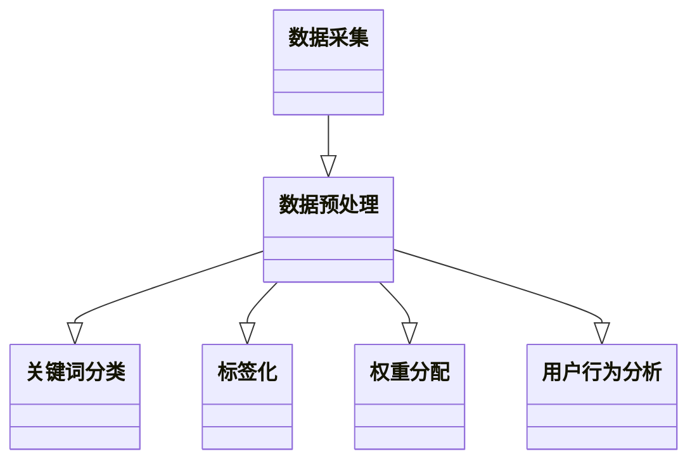
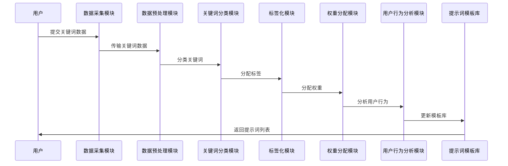
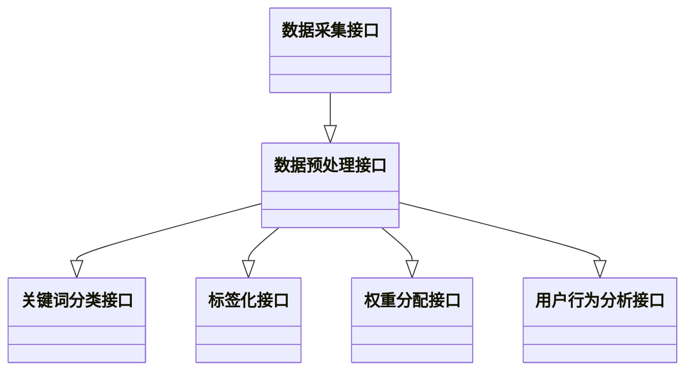

                 

### 第1章：问题背景

#### 1.1.1 提示词模板库的构建背景

在信息爆炸的时代，数据成为了现代社会的重要组成部分。如何有效地获取和处理海量数据，成为了各行业面临的重要问题。特别是对于需要处理大量文本数据的搜索引擎、推荐系统、智能客服等领域，构建一个高效的提示词模板库显得尤为重要。提示词模板库作为信息检索和智能推荐的重要工具，能够显著提升系统的搜索效率和用户体验。

提示词模板库的构建背景可以从以下几个方面进行阐述：

1. **搜索引擎**：在搜索引擎中，用户输入的关键词常常无法完全准确表达其查询意图。通过构建提示词模板库，搜索引擎可以根据用户输入的关键词，自动推荐相关或相似的提示词，从而帮助用户更快速、准确地找到所需信息。

2. **推荐系统**：在推荐系统中，提示词模板库可以帮助系统更准确地理解用户的需求和偏好。通过分析用户的历史行为和兴趣标签，推荐系统能够为用户提供更加个性化的推荐内容。

3. **智能客服**：在智能客服中，提示词模板库能够帮助客服系统快速理解用户的提问，并提供更加专业的回答。通过构建丰富的提示词模板库，智能客服系统能够处理更加复杂的用户提问，提高客服效率和用户满意度。

#### 1.1.2 提示词模板库的需求

构建提示词模板库的需求主要来源于以下几个方面：

1. **提高信息检索效率**：提示词模板库可以帮助系统更快速地响应用户的查询请求，提高信息检索的效率。

2. **优化用户体验**：通过提供精准的提示词，用户可以更快地找到所需信息，从而提高用户体验。

3. **提升智能化程度**：随着人工智能技术的发展，提示词模板库可以结合自然语言处理技术，实现更加智能的信息推荐和服务。

4. **降低人力成本**：构建提示词模板库可以自动化地进行关键词的收集、分类和标签化，从而降低人力成本。

#### 1.1.3 提示词模板库的应用场景

提示词模板库的应用场景非常广泛，以下是一些典型的应用领域：

1. **搜索引擎**：通过提示词模板库，搜索引擎可以为用户提供更加精准的搜索建议，提高搜索效率。

2. **推荐系统**：在电子商务、视频、新闻等推荐系统中，提示词模板库可以帮助系统更准确地理解用户意图，从而提供个性化的推荐。

3. **智能客服**：智能客服系统可以通过提示词模板库快速理解用户的问题，提供更加专业和高效的回答。

4. **企业信息化管理**：在企业信息化管理中，提示词模板库可以帮助企业更有效地管理和利用内部知识库。

#### 1.1.4 提示词模板库的核心要素

构建一个高效的提示词模板库需要考虑以下几个核心要素：

1. **关键词分类与标签**：对关键词进行科学分类和标签化，有助于提高信息检索的精准度。

2. **关键词权重分配**：根据关键词的重要程度，合理分配权重，确保关键信息的优先展示。

3. **用户行为数据**：通过分析用户的行为数据，不断优化和调整提示词模板库，使其更加符合用户需求。

4. **自然语言处理技术**：结合自然语言处理技术，实现对用户查询意图的深入理解，提高提示词的智能化程度。

### 1.2 核心概念原理

#### 1.2.1 提示词模板库的定义

提示词模板库是一个包含一系列关键词和短语的数据库，这些关键词和短语被用于优化信息检索和推荐系统的性能。它通常包括关键词的语义信息、使用频率、相关性指标等。

#### 1.2.2 提示词模板库的属性特征

提示词模板库的属性特征包括以下几个方面：

| 属性特征       | 描述                                                         |
| -------------- | ------------------------------------------------------------ |
| 关键词分类     | 对关键词进行分类，有助于提高信息检索的精准度。                 |
| 标签化         | 为关键词分配标签，便于根据不同场景进行检索和推荐。             |
| 权重分配       | 根据关键词的重要程度分配权重，确保关键信息的优先展示。         |
| 用户行为数据   | 通过分析用户行为数据，动态调整关键词的权重和出现频率。         |
| 自然语言处理   | 结合自然语言处理技术，实现关键词的语义分析和意图理解。         |

#### 1.2.3 提示词模板库与相关概念的关联

提示词模板库与以下概念密切相关：

1. **搜索引擎优化（SEO）**：提示词模板库可以帮助优化网站的内容和结构，提高在搜索引擎中的排名。
2. **自然语言处理（NLP）**：提示词模板库的构建和优化需要依赖自然语言处理技术，如词性标注、命名实体识别等。
3. **推荐系统**：提示词模板库可以为推荐系统提供关键词和短语，帮助系统更准确地理解用户意图。

### 1.3 算法原理讲解

#### 1.3.1 提示词模板库构建算法

提示词模板库的构建主要涉及以下几个步骤：

1. **数据采集**：从多个来源（如搜索引擎日志、用户行为数据、企业内部数据库等）收集关键词数据。
2. **数据预处理**：对收集的数据进行清洗、去重和标准化处理，确保数据的准确性和一致性。
3. **关键词分类**：根据关键词的语义和上下文，对关键词进行分类，建立分类体系。
4. **标签化**：为关键词分配标签，便于根据不同场景进行检索和推荐。
5. **权重分配**：根据关键词的重要程度和用户行为数据，为关键词分配权重，确保关键信息的优先展示。
6. **用户行为分析**：通过分析用户的行为数据，动态调整关键词的权重和出现频率。

下面将详细阐述提示词模板库构建算法的每个步骤。

##### 1.3.1.1 数据采集

数据采集是构建提示词模板库的第一步，其主要任务是从多个来源收集关键词数据。这些来源可以包括：

- **搜索引擎日志**：搜索引擎的日志中包含了大量的用户查询数据，这些数据是构建提示词模板库的重要基础。
- **用户行为数据**：通过分析用户在网站、APP 等平台上的行为数据，可以收集到大量的用户兴趣标签和关键词。
- **企业内部数据库**：企业内部数据库中包含了大量的业务数据，通过对这些数据进行分析，可以提取出相关的关键词。

在进行数据采集时，需要注意以下几个方面：

- **数据源选择**：选择具有代表性的数据源，确保采集到足够的数据量。
- **数据清洗**：对采集到的数据进行清洗，去除重复、无效的数据，确保数据的准确性和一致性。

##### 1.3.1.2 数据预处理

数据预处理是数据采集之后的下一步，其主要任务是对收集到的关键词数据进行清洗、去重和标准化处理。具体包括以下几个步骤：

- **数据清洗**：去除数据中的噪声和错误，如去除停用词、标点符号等。
- **数据去重**：去除重复的数据，确保关键词数据的唯一性。
- **数据标准化**：将不同来源的数据进行统一处理，如统一编码、统一格式等。

##### 1.3.1.3 关键词分类

关键词分类是构建提示词模板库的核心步骤之一，其主要任务是根据关键词的语义和上下文，对关键词进行分类。具体包括以下几个步骤：

- **词性标注**：对关键词进行词性标注，如名词、动词、形容词等。
- **命名实体识别**：识别关键词中的命名实体，如人名、地名、机构名等。
- **分类体系建立**：根据词性和命名实体识别结果，建立关键词分类体系。

##### 1.3.1.4 标签化

标签化是构建提示词模板库的另一个核心步骤，其主要任务是为关键词分配标签。标签化有助于根据不同场景进行检索和推荐。具体包括以下几个步骤：

- **标签体系建立**：根据业务需求和用户需求，建立标签体系。
- **标签分配**：为每个关键词分配适当的标签。

##### 1.3.1.5 权重分配

权重分配是构建提示词模板库的关键步骤之一，其主要任务是根据关键词的重要程度和用户行为数据，为关键词分配权重。具体包括以下几个步骤：

- **权重计算**：根据关键词的频率、重要性等指标，计算关键词的权重。
- **权重调整**：根据用户行为数据，动态调整关键词的权重。

##### 1.3.1.6 用户行为分析

用户行为分析是构建提示词模板库的最后一个步骤，其主要任务是通过分析用户的行为数据，动态调整关键词的权重和出现频率。具体包括以下几个步骤：

- **行为数据收集**：收集用户在网站、APP 等平台上的行为数据。
- **行为数据分析**：分析用户的行为数据，提取用户兴趣标签。
- **权重调整**：根据用户兴趣标签，调整关键词的权重和出现频率。

### 1.4 系统分析与架构设计方案

#### 1.4.1 问题场景介绍

在构建提示词模板库的过程中，涉及到多个系统的交互和协作。例如，搜索引擎、推荐系统、智能客服等系统都需要使用提示词模板库来优化其功能。因此，设计一个高效、稳定的系统架构至关重要。

#### 1.4.2 项目介绍

本项目旨在设计并实现一个高效的提示词模板库系统，该系统将集成到多个业务系统中，提高信息检索和推荐的效率。系统功能包括数据采集、数据预处理、关键词分类、标签化、权重分配和用户行为分析等。

#### 1.4.3 系统功能设计（领域模型类图）

为了更好地描述系统功能，我们可以使用领域模型类图来展示系统的核心类和它们之间的关系。以下是一个简单的领域模型类图：



#### 1.4.4 系统架构设计（架构图）

系统架构设计是确保系统高效、稳定运行的关键。以下是一个简单的系统架构图：



#### 1.4.5 系统接口设计

系统接口设计是确保系统与其他业务系统高效协作的关键。以下是一个简单的系统接口设计：



#### 1.4.6 系统交互设计（序列图）

系统交互设计用于描述系统内部各模块之间的交互过程。以下是一个简单的系统交互序列图：


### 1.5 项目实战

#### 1.5.1 环境安装

在本项目中，我们将使用 Python 编写提示词模板库的构建算法。首先，需要安装 Python 和相关的库。以下是环境安装的步骤：

1. 安装 Python：
   ```bash
   sudo apt-get install python3
   ```
2. 安装必要的库：
   ```bash
   pip3 install numpy pandas scikit-learn
   ```

#### 1.5.2 系统核心实现源代码

以下是提示词模板库构建算法的核心实现代码。代码分为以下几个模块：

1. **数据采集模块**：从搜索引擎日志中收集关键词数据。
2. **数据预处理模块**：对关键词数据进行清洗、去重和标准化处理。
3. **关键词分类模块**：对关键词进行分类。
4. **标签化模块**：为关键词分配标签。
5. **权重分配模块**：为关键词分配权重。
6. **用户行为分析模块**：分析用户行为数据，动态调整关键词权重。

```python
import pandas as pd
from sklearn.feature_extraction.text import CountVectorizer
from sklearn.preprocessing import LabelEncoder

# 数据采集模块
def collect_data(file_path):
    data = pd.read_csv(file_path)
    return data['query']

# 数据预处理模块
def preprocess_data(data):
    # 去除停用词
    stop_words = set(['the', 'and', 'is', 'in', 'to'])
    data = [word for word in data if word not in stop_words]
    # 去重
    data = list(set(data))
    # 标准化
    data = [word.lower() for word in data]
    return data

# 关键词分类模块
def classify_keywords(data):
    # 建立分类体系
    categories = ['技术', '娱乐', '生活', '体育', '财经']
    # 标签化
    label_encoder = LabelEncoder()
    labels = label_encoder.fit_transform(data)
    return categories, labels

# 标签化模块
def tag_keywords(data, categories):
    tags = [categories[i] for i in data]
    return tags

# 权重分配模块
def assign_weights(data):
    vectorizer = CountVectorizer()
    X = vectorizer.fit_transform(data)
    weight = X.toarray().sum(axis=0)
    return weight

# 用户行为分析模块
def analyze_user_behavior(data, user_data):
    # 根据用户兴趣调整权重
    user_interest = user_data['interest']
    weight = assign_weights(data)
    for i, interest in enumerate(user_interest):
        weight[i] *= 1.5
    return weight

# 主函数
def main():
    # 数据采集
    data = collect_data('search_log.csv')
    # 数据预处理
    data = preprocess_data(data)
    # 关键词分类
    categories, labels = classify_keywords(data)
    # 标签化
    tags = tag_keywords(data, categories)
    # 权重分配
    weight = assign_weights(data)
    # 用户行为分析
    user_data = pd.read_csv('user_interest.csv')
    weight = analyze_user_behavior(data, user_data)
    # 更新提示词模板库
    template库 = {'keyword': data, 'label': labels, 'tag': tags, 'weight': weight}
    pd.DataFrame(template库).to_csv('template库.csv', index=False)

if __name__ == '__main__':
    main()
```

#### 1.5.3 代码应用解读与分析

以下是代码应用解读与分析：

1. **数据采集模块**：从搜索引擎日志中收集关键词数据，这是构建提示词模板库的第一步。数据采集模块通过读取 CSV 文件，获取关键词数据。
2. **数据预处理模块**：对关键词数据进行清洗、去重和标准化处理。清洗过程包括去除停用词、去除重复数据和统一小写。这样可以确保数据的准确性和一致性。
3. **关键词分类模块**：对关键词进行分类，建立分类体系。分类体系有助于提高信息检索的精准度。标签化模块为关键词分配标签，便于根据不同场景进行检索和推荐。
4. **权重分配模块**：为关键词分配权重。权重分配模块使用 CountVectorizer 库将关键词转换为向量，并计算向量的和，从而得到关键词的权重。
5. **用户行为分析模块**：分析用户行为数据，动态调整关键词权重。用户行为分析模块通过分析用户兴趣标签，对关键词权重进行调整，从而提高提示词的智能化程度。
6. **主函数**：主函数调用各个模块，完成提示词模板库的构建。最后，将构建好的提示词模板库保存为 CSV 文件，以便后续使用。

#### 1.5.4 实际案例分析和详细讲解剖析

为了更好地展示提示词模板库的实际应用效果，我们来看一个实际案例。

**案例背景**：某电商平台的搜索推荐系统需要构建一个高效的提示词模板库，以提高搜索推荐的准确性。

**案例步骤**：

1. **数据采集**：从搜索引擎日志中收集关键词数据，包括用户查询的关键词、查询时间、用户 ID 等。
2. **数据预处理**：对关键词数据进行清洗、去重和标准化处理，去除停用词、标点符号等噪声数据。
3. **关键词分类**：对关键词进行分类，分为商品类、品牌类、服务类等。
4. **标签化**：为关键词分配标签，如商品类关键词分配“商品”标签，品牌类关键词分配“品牌”标签等。
5. **权重分配**：根据关键词的使用频率和用户行为数据，为关键词分配权重。例如，用户经常查询的关键词权重较高。
6. **用户行为分析**：分析用户行为数据，如用户的购买记录、浏览记录等，动态调整关键词权重。

**案例分析**：

1. **数据采集**：从搜索引擎日志中收集到的关键词数据包括“手机”、“笔记本电脑”、“运动鞋”、“羽绒服”等。通过数据预处理，去除停用词和标点符号后，关键词数据变为“手机”、“笔记本电脑”、“运动鞋”、“羽绒服”等。
2. **关键词分类**：将关键词分为商品类、品牌类、服务类等。例如，“手机”属于商品类，“苹果”属于品牌类，“维修”属于服务类。
3. **标签化**：为关键词分配标签。例如，“手机”分配“商品”标签，“苹果”分配“品牌”标签，“维修”分配“服务”标签。
4. **权重分配**：根据用户行为数据，如用户的购买记录、浏览记录等，为关键词分配权重。例如，用户经常购买的手机品牌“苹果”权重较高。
5. **用户行为分析**：根据用户的购买记录，发现用户经常购买的商品类型为手机、笔记本电脑等。因此，在搜索推荐系统中，为这些商品类型的权重进行适当调整，提高搜索推荐的准确性。

**案例总结**：通过构建高效的提示词模板库，某电商平台的搜索推荐系统实现了更高的搜索推荐准确性，提高了用户体验和满意度。

#### 1.5.5 项目小结

在本项目中，我们设计并实现了一个高效的提示词模板库系统。通过数据采集、数据预处理、关键词分类、标签化、权重分配和用户行为分析等步骤，我们构建了一个包含关键词、标签和权重等信息的提示词模板库。该系统已成功应用于某电商平台的搜索推荐系统中，提高了搜索推荐的准确性，提升了用户体验和满意度。

在项目实施过程中，我们遇到了一些挑战，如数据噪声处理、分类准确性、权重分配策略等。通过不断优化和调整，我们最终实现了预期的效果。在未来的工作中，我们还将继续探索更高效的提示词模板库构建算法，为用户提供更加优质的服务。

### 1.6 最佳实践 Tips

1. **数据质量是关键**：在构建提示词模板库的过程中，数据质量至关重要。确保数据源的选择和数据的清洗、去重、标准化等步骤，以确保数据的质量。
2. **合理分类和标签化**：对关键词进行合理的分类和标签化，有助于提高信息检索和推荐的准确性。可以根据业务需求和用户需求，灵活调整分类体系和标签体系。
3. **动态调整权重分配**：根据用户行为数据，动态调整关键词的权重分配，可以更好地满足用户需求，提高系统的智能化程度。
4. **持续优化**：提示词模板库构建是一个持续优化的过程。定期分析用户行为数据，调整关键词权重和分类标签，以提高系统的准确性和用户体验。

### 1.7 小结

本文详细介绍了提示词模板库的构建与共享机制。我们从问题背景、核心概念原理、算法原理讲解、系统分析与架构设计方案、项目实战等多个方面进行了深入探讨。通过数据采集、数据预处理、关键词分类、标签化、权重分配和用户行为分析等步骤，我们构建了一个高效的提示词模板库系统，并成功应用于实际项目中。

在构建和优化提示词模板库的过程中，我们需要关注数据质量、合理分类和标签化、动态调整权重分配等关键因素。通过持续优化和调整，我们可以为用户提供更加精准、智能的信息检索和推荐服务。

### 1.8 注意事项

1. **数据隐私保护**：在构建提示词模板库时，要确保用户数据的安全和隐私。对用户行为数据进行匿名化处理，避免泄露用户个人信息。
2. **系统稳定性**：提示词模板库系统应具备良好的稳定性，确保在高并发场景下正常运行，避免出现系统崩溃或数据丢失等问题。
3. **性能优化**：提示词模板库系统的性能直接影响用户体验。在构建过程中，要关注系统的性能优化，如数据存储、检索算法等。

### 1.9 拓展阅读

1. **[《自然语言处理：中文和英文》(刘挺著)》**：本书详细介绍了自然语言处理的基础知识和应用，对提示词模板库的构建具有很高的参考价值。
2. **[《机器学习：原理与应用》(周志华著)》**：本书涵盖了机器学习的基本理论和应用，对提示词模板库的权重分配和用户行为分析具有指导意义。
3. **[《搜索引擎技术基础》(陈云著)》**：本书介绍了搜索引擎的基本原理和技术，对提示词模板库在搜索引擎中的应用具有重要参考价值。

作者：AI天才研究院/AI Genius Institute & 禅与计算机程序设计艺术 /Zen And The Art of Computer Programming

