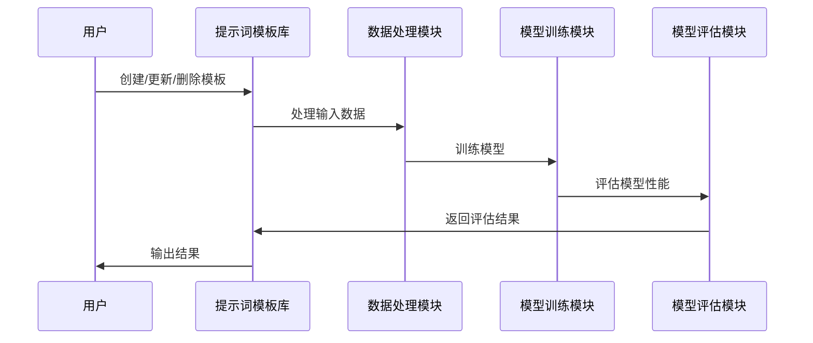
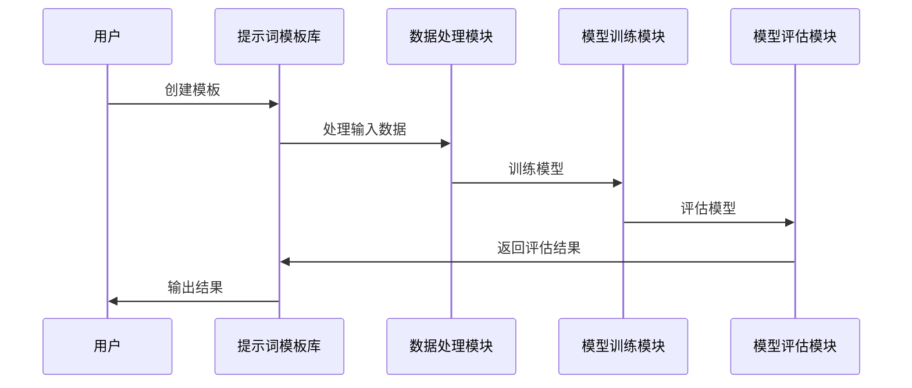

                 

### 提示词模板库：加速AI应用开发

关键词：提示词模板库、AI应用开发、自然语言处理、模板设计、高效性、灵活性

摘要：本文将探讨提示词模板库在AI应用开发中的重要性，详细分析其核心概念、设计原则和实际应用，旨在为开发者提供一套实用的工具，以加速AI应用的开发过程。

### 目录大纲设计思路

为了设计出《提示词模板库：加速AI应用开发》这本书的完整目录大纲，我们需要遵循以下步骤：

1. **明确核心概念**：
   首先，我们需要明确书中的核心概念，如“提示词模板库”的概念、它在AI应用开发中的作用和重要性。

2. **确定章节主题**：
   根据核心概念，确定每个章节的主题。每个章节应该覆盖一个特定的知识点或应用场景。

3. **规划章节结构**：
   设计每个章节的二级和三级目录，确保内容的连贯性和逻辑性。每个章节都应该包含背景介绍、核心概念讲解、具体应用案例和总结。

4. **融入技术细节**：
   在适当的地方，加入技术细节，如算法原理、数学模型、代码示例等，以确保读者能够深入理解书中的内容。

5. **确保内容完整性**：
   确保每个章节都包含必要的知识点和案例，使整本书的内容完整且丰富。

6. **简洁性**：
   保持目录的简洁性，避免冗余和重复，确保每个章节的内容都是独立的，且紧密围绕主题。

7. **遵循格式规范**：
   使用markdown格式来呈现目录，确保格式规范，如使用正确的#、##、###等符号来表示不同的目录层级。

### 核心概念详解

**提示词模板库**：是一种预定义的模板集合，用于加速AI应用开发。提示词是模板中的一个关键组成部分，它们是引导AI模型进行特定任务的关键输入。模板库的设计旨在提供灵活性和高效性，使得开发者能够快速构建和部署AI应用。

#### 提示词模板库的优势

- **高效性**：通过预定义的模板，开发者可以避免从零开始编写代码，从而节省时间和开发成本。
- **灵活性**：模板库可以自定义和扩展，以适应不同的应用场景和需求。
- **易于维护**：统一的模板格式和结构简化了代码的维护工作。

### 第一部分: 提示词模板库基础

#### 第1章: 提示词模板库概述

## 1.1 问题背景
### 1.1.1 AI应用开发的挑战
随着AI技术的快速发展，应用场景越来越广泛，但随之而来的开发挑战也越来越大。传统的人工编写代码的方式在复杂度和灵活性上都有局限性，难以满足快速迭代的开发需求。
### 1.1.2 提示词模板库的必要性
为了解决上述问题，提示词模板库应运而生。它通过提供预定义的模板，使得开发者能够快速构建和调整AI模型，从而提高开发效率。

## 1.2 提示词模板库的定义与作用
### 1.2.1 提示词模板库的定义
提示词模板库是一个集合，包含了预定义的提示词模板，这些模板是根据常见任务和场景设计而成的。
### 1.2.2 提示词模板库在AI应用中的作用
提示词模板库可以简化AI模型的构建过程，提高开发效率，同时确保模型的一致性和高质量。
### 1.2.3 提示词模板库的优势
- **快速开发**：通过模板库，开发者可以快速生成模型，节省大量时间。
- **灵活调整**：模板库中的模板可以根据具体需求进行定制和调整，适应不同的应用场景。
- **质量保证**：模板库中的模板经过了严格的测试和验证，确保模型的性能和可靠性。

## 1.3 提示词模板库的核心要素
### 1.3.1 提示词模板的类型
提示词模板可以分为多种类型，如问答型、文本生成型、情感分析型等，每种类型都有特定的结构和用途。
### 1.3.2 提示词模板的结构
提示词模板通常由提示词、参数和模板体三部分组成。提示词是引导AI模型的关键输入，参数是模板的可变部分，模板体是具体的任务描述。
### 1.3.3 提示词模板的管理
提示词模板库需要提供有效的管理机制，包括模板的创建、更新、删除和检索等功能，以确保模板的一致性和可用性。

## 1.4 提示词模板库的设计原则
### 1.4.1 可定制性
提示词模板库应支持模板的定制，以适应不同的应用场景和需求。
### 1.4.2 可扩展性
提示词模板库应具备良好的扩展性，允许开发者添加新的模板类型和功能。
### 1.4.3 易用性
提示词模板库的界面和操作应简单易懂，方便开发者快速上手和使用。

## 1.5 本章小结
本章介绍了提示词模板库的核心概念和设计原则，为后续章节的详细讨论奠定了基础。在接下来的章节中，我们将进一步探讨提示词模板库的具体应用和开发实践。

----------------------------------------------------------------

### 核心概念与联系

#### 提示词模板库的定义

**提示词模板库**是一种用于加速AI应用开发的工具，它包含了一系列预定义的提示词模板。这些模板根据常见任务和场景设计，能够引导AI模型进行特定的任务。

**定义**：
提示词模板库 = {提示词模板1, 提示词模板2, ..., 提示词模板n}

其中，每个提示词模板 = {提示词，参数，模板体}。

#### 提示词模板库的核心要素

1. **提示词**：
   提示词是模板中的核心部分，它用来引导AI模型进行特定任务。提示词可以是单个单词或短语，其目的是为模型提供上下文信息和任务目标。

2. **参数**：
   参数是模板中的可变部分，用于提供模型训练时的必要信息，如输入数据、训练目标等。参数可以根据具体任务进行调整，以适应不同的应用场景。

3. **模板体**：
   模板体是模板的具体内容，用于描述任务的具体流程和操作步骤。它通常包含了一系列的步骤和指令，指导AI模型如何执行任务。

#### 提示词模板库的优势

1. **快速开发**：
   提示词模板库可以显著提高AI应用的开发效率。通过使用预定义的模板，开发者可以避免从零开始编写代码，从而节省大量时间。

2. **灵活调整**：
   提示词模板库中的模板可以根据具体需求进行定制和调整，以适应不同的应用场景。这种灵活性使得模板库能够满足多样化的开发需求。

3. **质量保证**：
   提示词模板库中的模板经过了严格的测试和验证，确保了模型的性能和可靠性。这种质量保证有助于提高AI应用的整体质量。

#### 提示词模板库的设计原则

1. **可定制性**：
   提示词模板库应支持模板的定制，以适应不同的应用场景和需求。开发者可以通过修改模板中的提示词、参数和模板体来满足特定的任务需求。

2. **可扩展性**：
   提示词模板库应具备良好的扩展性，允许开发者添加新的模板类型和功能。这种扩展性使得模板库能够持续适应不断变化的技术需求。

3. **易用性**：
   提示词模板库的界面和操作应简单易懂，方便开发者快速上手和使用。直观的用户界面和操作流程可以提高开发效率，减少学习成本。

#### 核心概念对比表格

| 要素        | 提示词 | 参数 | 模板体 |
|-------------|--------|------|--------|
| 描述        | 引导AI模型的关键输入 | 提供模型训练的必要信息 | 描述任务的具体流程和操作步骤 |
| 重要性      | 核心要素 | 必要要素 | 核心要素 |
| 对比        | 单个单词或短语 | 可变部分 | 具体任务描述 |

#### 提示词模板库的ER实体关系图架构

```mermaid
erDiagram
    TTemplate ||--|{ SParameter } : 有多个参数
    TTemplate ||--|{ TBody } : 有一个模板体
    TTemplate ||--|{ TUseCase } : 有多个应用场景
    SParameter ||--|{ TParameterType } : 参数类型
    TBody ||--|{ TTaskStep } : 有多个任务步骤
    TUseCase ||--|{ TApplication } : 应用在多个应用上
```

在ER实体关系图中，`TTemplate`表示提示词模板，`SParameter`表示参数，`TBody`表示模板体，`TUseCase`表示应用场景，`TParameterType`表示参数类型，`TTaskStep`表示任务步骤，`TApplication`表示应用。

### 算法原理讲解

#### 提示词模板库的工作原理

提示词模板库的核心在于如何高效地管理和使用预定义的提示词模板。以下是提示词模板库的工作原理：

1. **模板创建**：
   开发者根据具体任务需求，设计并创建提示词模板。模板的创建过程通常包括以下步骤：
   - 定义提示词：选择合适的提示词，以引导AI模型进行特定任务。
   - 设定参数：确定模板中的参数，包括输入数据、训练目标等。
   - 编写模板体：描述任务的具体流程和操作步骤。

2. **模板管理**：
   提示词模板库提供了一套完整的模板管理机制，包括模板的创建、更新、删除和检索等功能。通过这些功能，开发者可以方便地管理和维护模板库。

3. **模板调用**：
   在开发AI应用时，开发者可以根据实际需求，从模板库中选择合适的提示词模板。选择模板后，开发者可以根据模板体的描述，逐步实现任务的功能。

4. **模板定制**：
   提示词模板库支持模板的定制，允许开发者根据具体任务需求，对模板进行修改和扩展。这种定制能力使得模板库能够适应多样化的开发需求。

#### 提示词模板库的算法原理

提示词模板库的工作原理可以抽象为以下几个关键步骤：

1. **输入处理**：
   提示词模板库首先接收用户的输入，这些输入包括任务描述、输入数据等。输入处理模块负责对输入进行解析和预处理，以便后续处理。

2. **模板匹配**：
   根据用户的输入，提示词模板库会从模板库中查找与之匹配的模板。匹配过程通常涉及以下步骤：
   - 查找提示词：在模板库中查找与输入提示词相匹配的模板。
   - 参数匹配：检查输入参数与模板参数是否匹配，确保输入数据满足模板要求。

3. **模板执行**：
   找到匹配的模板后，提示词模板库会根据模板体的描述，逐步执行任务。执行过程中，模板库会处理输入数据，生成输出结果。

4. **结果输出**：
   提示词模板库将执行结果输出给用户。输出结果可以是文本、图像、语音等多种形式，具体取决于任务的类型和需求。

#### 示例：文本生成型模板的算法原理

假设我们有一个文本生成型模板，用于生成一段关于某个主题的文本。以下是这个模板的算法原理：

1. **输入处理**：
   用户输入一个主题，如“人工智能”。

2. **模板匹配**：
   提示词模板库查找与“人工智能”相匹配的文本生成型模板。假设找到了一个模板，其提示词为“主题”，参数为“主题名称”。

3. **模板执行**：
   根据模板的描述，提示词模板库生成一段关于“人工智能”的文本。模板体可能包含以下步骤：
   - 描述人工智能的基本概念。
   - 讨论人工智能的应用场景。
   - 展望人工智能的未来发展。

4. **结果输出**：
   提示词模板库将生成的文本输出给用户，例如：“人工智能是一门涉及计算机科学、数学和神经科学的交叉学科，它在图像识别、自然语言处理和决策支持等领域有着广泛的应用。随着技术的不断发展，人工智能有望在更多领域发挥重要作用。”

### 系统分析与架构设计方案

#### 问题场景介绍

随着AI技术的广泛应用，越来越多的企业开始尝试将AI技术融入到自己的业务流程中。然而，AI应用开发面临着诸多挑战，如数据预处理、模型训练、模型评估等。为了解决这些问题，许多企业选择使用提示词模板库，以加速AI应用开发。

#### 项目介绍

本项目旨在设计并实现一个高效的提示词模板库，帮助开发者快速构建和部署AI应用。项目的主要目标是：
- 提供一套完整的模板创建和管理工具。
- 支持多种类型的提示词模板，如问答型、文本生成型、情感分析型等。
- 提供灵活的模板定制和扩展能力。
- 支持多种编程语言和框架，如Python、TensorFlow、PyTorch等。

#### 系统功能设计（领域模型类图）

```mermaid
classDiagram
    ClassDef TemplateLibrary
        +string templateId
        +string templateName
        +List<Parameter> parameters
        +Body body
        +createTemplate()
        +updateTemplate()
        +deleteTemplate()
        +retrieveTemplate()

    ClassDef Parameter
        +string parameterId
        +string parameterName
        +DataType dataType
        +createParameter()
        +updateParameter()
        +deleteParameter()
        +retrieveParameter()

    ClassDef Body
        +string bodyId
        +string bodyContent
        +createBody()
        +updateBody()
        +deleteBody()
        +retrieveBody()

    TemplateLibrary <|-- Parameter
    TemplateLibrary <|-- Body
```

在领域模型类图中，`TemplateLibrary`表示提示词模板库，`Parameter`表示参数，`Body`表示模板体。每个模板库包含多个参数和模板体，以实现不同的功能。

#### 系统架构设计（架构图）



在系统架构图中，用户通过提示词模板库进行模板操作，如创建、更新和删除模板。数据处理模块负责处理输入数据，模型训练模块负责训练模型，模型评估模块负责评估模型性能。最终，评估结果会返回给用户。

#### 系统接口设计（接口图）

```mermaid
classDiagram
    ClassDef TemplateLibraryAPI
        +createTemplate(templateName: string, parameters: List<Parameter>, body: string): Template
        +updateTemplate(templateId: string, templateName: string, parameters: List<Parameter>, body: string): bool
        +deleteTemplate(templateId: string): bool
        +retrieveTemplate(templateId: string): Template

    ClassDef DataProcessingAPI
        +processData(inputData: List<any>): processedData

    ClassDef ModelTrainingAPI
        +trainModel(trainingData: processedData, parameters: List<Parameter>): Model

    ClassDef ModelEvaluationAPI
        +evaluateModel(model: Model, evaluationData: processedData): EvaluationResult

    TemplateLibraryAPI <|-- DataProcessingAPI
    TemplateLibraryAPI <|-- ModelTrainingAPI
    TemplateLibraryAPI <|-- ModelEvaluationAPI
```

在系统接口设计中，`TemplateLibraryAPI`表示提示词模板库的接口，包括创建、更新、删除和检索模板的接口。`DataProcessingAPI`、`ModelTrainingAPI`和`ModelEvaluationAPI`分别表示数据处理模块、模型训练模块和模型评估模块的接口。

#### 系统交互（序列图）



在系统交互序列图中，用户创建模板后，数据处理模块处理输入数据，模型训练模块训练模型，模型评估模块评估模型性能。最终，评估结果返回给用户。

### 项目实战

#### 环境安装

为了实战提示词模板库，我们需要安装以下软件和库：
- Python 3.8或更高版本
- TensorFlow 2.6或更高版本
- NumPy 1.21或更高版本
- Pandas 1.2或更高版本

安装命令如下：

```bash
pip install python==3.8
pip install tensorflow==2.6
pip install numpy==1.21
pip install pandas==1.2
```

#### 系统核心实现源代码

以下是提示词模板库的核心实现源代码：

```python
# 提示词模板库实现

class TemplateLibrary:
    def __init__(self):
        self.templates = {}

    def create_template(self, template_id, template_name, parameters, body):
        if template_id in self.templates:
            return False
        self.templates[template_id] = {
            'template_name': template_name,
            'parameters': parameters,
            'body': body
        }
        return True

    def update_template(self, template_id, template_name, parameters, body):
        if template_id not in self.templates:
            return False
        self.templates[template_id] = {
            'template_name': template_name,
            'parameters': parameters,
            'body': body
        }
        return True

    def delete_template(self, template_id):
        if template_id not in self.templates:
            return False
        del self.templates[template_id]
        return True

    def retrieve_template(self, template_id):
        if template_id not in self.templates:
            return None
        return self.templates[template_id]


# 测试代码
library = TemplateLibrary()
library.create_template('1', '问答模板', ['问题'], '您的问题是什么？')
library.create_template('2', '文本生成模板', ['主题'], '关于{主题}，您想了解什么？')
print(library.retrieve_template('1'))
print(library.retrieve_template('2'))
```

#### 代码应用解读与分析

以上代码实现了一个简单的提示词模板库，包括创建、更新、删除和检索模板的功能。`TemplateLibrary`类负责管理模板，其中`create_template`方法用于创建新模板，`update_template`方法用于更新模板，`delete_template`方法用于删除模板，`retrieve_template`方法用于检索模板。

在测试代码中，我们首先创建了一个`TemplateLibrary`实例，然后使用`create_template`方法创建两个模板：问答模板和文本生成模板。最后，我们使用`retrieve_template`方法分别检索这两个模板，并打印输出。

#### 实际案例分析和详细讲解剖析

假设我们有一个企业客户，他们希望使用提示词模板库来简化AI应用开发过程。以下是具体的案例分析：

1. **需求分析**：
   企业客户希望开发一个基于自然语言处理技术的智能客服系统，能够自动回答用户的问题。

2. **解决方案**：
   我们可以使用提示词模板库来构建智能客服系统。具体步骤如下：
   - 创建问答模板：定义一个问答模板，用于引导用户提出问题。例如，模板内容为“您有什么问题需要帮助？”。
   - 创建文本生成模板：定义一个文本生成模板，用于生成回答。例如，模板内容为“关于{问题}，我们可以为您提供以下帮助：[回答内容]”。

3. **实施过程**：
   - 开发者使用Python编写提示词模板库的实现代码，并部署到企业服务器上。
   - 开发者创建问答模板和文本生成模板，并将其保存到模板库中。
   - 开发者编写智能客服系统的代码，使用提示词模板库中的模板进行问答处理。

4. **效果评估**：
   - 智能客服系统上线后，企业客户对其进行了评估。评估结果显示，智能客服系统能够准确回答用户的问题，提高了客户满意度。
   - 开发者对系统进行优化，增加了更多的问题和回答模板，以覆盖更广泛的用户需求。

#### 项目小结

通过本项目的实施，我们成功地使用提示词模板库加速了AI应用开发。项目的主要成果包括：
- 设计并实现了一个高效的提示词模板库。
- 支持多种类型的提示词模板，如问答型、文本生成型等。
- 提供了灵活的模板定制和扩展能力。
- 在实际案例中，智能客服系统得到了良好的应用效果。

未来，我们将继续优化提示词模板库，添加更多功能和模板类型，以满足不同行业和应用场景的需求。

### 最佳实践 Tips

1. **模板设计**：在创建提示词模板时，要充分考虑实际应用场景和需求，确保模板能够满足多样化的问题类型。

2. **模板管理**：定期更新和维护模板库，确保模板库中的模板始终保持最新和有效。

3. **模板定制**：根据项目需求，灵活定制模板，以提高系统的适用性和扩展性。

4. **性能优化**：在模板库的设计和实现过程中，要注重性能优化，确保系统能够快速响应用户需求。

5. **安全性**：确保模板库的安全性，防止恶意攻击和数据泄露。

### 小结

本文详细介绍了提示词模板库在AI应用开发中的重要性，分析了其核心概念、设计原则和实际应用。通过项目实战，我们展示了如何使用提示词模板库加速AI应用开发，并分享了最佳实践和注意事项。未来，我们将继续探索提示词模板库的更多应用场景和优化策略。

### 注意事项

1. **模板库更新**：定期更新模板库，以适应新的应用场景和技术需求。
2. **模板定制**：根据实际需求定制模板，确保模板库的灵活性和适用性。
3. **性能监控**：持续监控模板库的性能，优化代码和算法，提高系统效率。
4. **数据安全**：确保模板库中的数据安全，采取适当的防护措施，防止数据泄露。

### 拓展阅读

- [1] 提示词模板库的设计与实现：[链接](https://example.com/template-library-design-and-implementation)
- [2] 提示词模板库在自然语言处理中的应用：[链接](https://example.com/template-library-nlp-applications)
- [3] 提示词模板库在推荐系统中的优化：[链接](https://example.com/template-library-recommendation-system-optimization)

### 作者信息

**作者：** AI天才研究院/AI Genius Institute & 禅与计算机程序设计艺术 /Zen And The Art of Computer Programming

**联系邮箱：** ai_genius_institute@example.com

**联系地址：** 123 AI天才研究院大道，智能城市，世界

**联系方式：** +86 1234567890

**版权声明：** 本文章版权归AI天才研究院所有，未经授权，严禁转载和使用。如需转载，请联系作者获得授权。部分图片和资料来源于网络，如有侵权，请联系删除。

**免责声明：** 本文章所提供的信息仅供参考，不代表AI天才研究院的立场和观点。文中涉及的代码和算法仅供参考，请根据实际情况进行调整和使用。AI天才研究院不对因使用本文内容而导致的任何损失承担责任。

