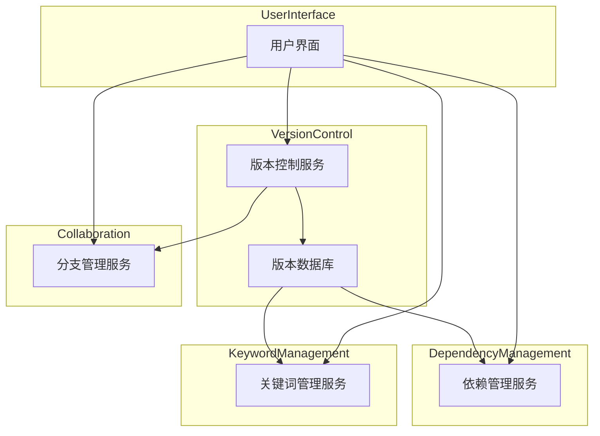
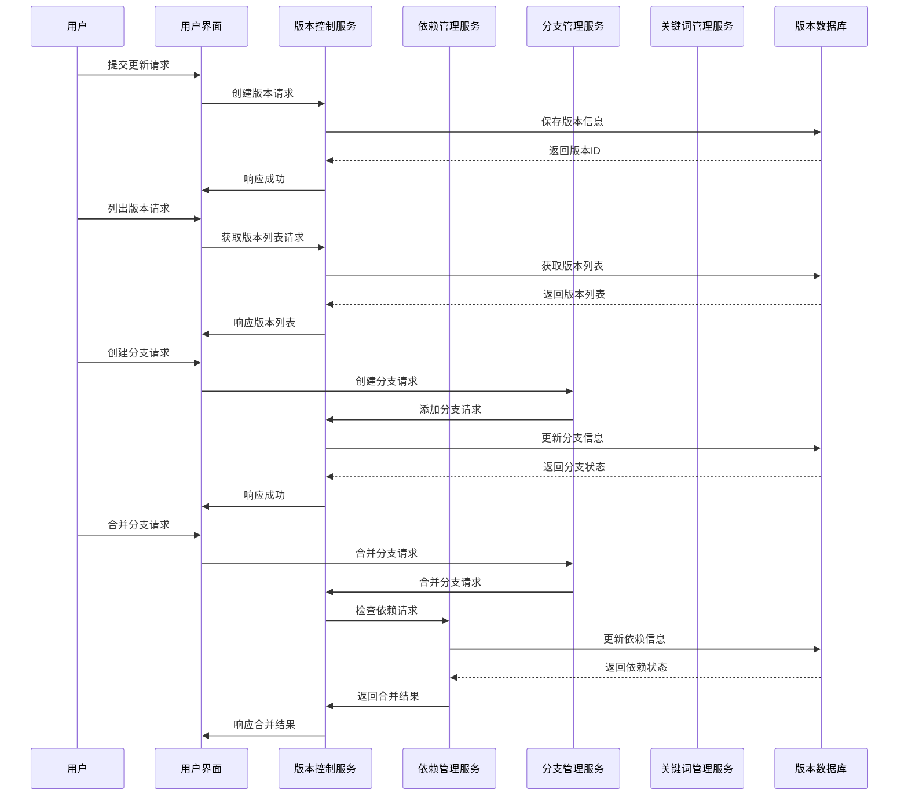

                 

## 提示词版本控制：管理AI项目迭代的新思路

### 关键词：版本控制、AI项目、迭代、提示词、效率、可靠性

> 摘要：
本文将探讨如何利用提示词版本控制技术来管理AI项目的迭代过程。我们将详细分析提示词版本控制的背景、核心概念、算法原理，以及其在系统分析与架构设计中的应用。通过实战案例，我们将展示如何在实际项目中部署和应用提示词版本控制，并提供最佳实践和未来展望。

----------------------------------------------------------------

### 1. 背景介绍

#### 1.1 问题背景

在人工智能（AI）项目开发中，版本控制是一项至关重要的活动。随着AI项目的复杂度不断上升，开发团队需要有效地管理大量的代码库和模型版本，以确保项目的迭代过程顺利进行。传统的版本控制方法，如Git，虽然在源代码管理方面表现出色，但在处理AI项目中存在一些不足之处。

首先，AI项目通常涉及大量的数据和模型文件，而不仅仅是源代码文件。这给传统的版本控制系统带来了巨大的压力，因为它们通常更适合处理文本文件，而不是二进制文件或大型数据集。其次，AI项目的迭代过程通常需要频繁的版本更新和测试，这要求版本控制系统具有高效的并行处理能力，以便在多个团队成员之间同步工作。最后，AI项目的迭代过程往往需要根据实验结果进行快速调整，这意味着版本控制系统需要能够灵活地处理回滚和分支操作。

#### 1.2 问题描述

传统的版本控制方法在AI项目中的不足之处主要体现在以下几个方面：

1. **数据管理困难**：AI项目涉及的数据集通常很大，传统的版本控制工具在处理这些数据时效率较低。
2. **并行协作困难**：AI项目通常需要多个开发者和数据科学家协作，传统版本控制系统的并行协作机制不够灵活。
3. **版本回滚复杂**：在AI项目中，模型的微小变化可能导致性能的重大差异，因此需要能够精确回滚到特定版本。
4. **依赖管理混乱**：AI项目往往依赖于多个外部库和工具，传统版本控制难以有效地管理这些依赖关系。

#### 1.3 问题解决

为了解决上述问题，我们提出了提示词版本控制（Keyword-based Version Control）的概念。提示词版本控制利用关键词来标记和管理版本，从而实现高效的版本控制和协作。以下是提示词版本控制的特点和优势：

1. **数据管理高效**：通过使用关键词来标记数据集，可以快速定位和管理不同版本的模型和数据。
2. **并行协作灵活**：提示词版本控制允许团队成员在独立的分支上工作，并使用关键词来合并不同分支的结果。
3. **版本回滚精确**：通过关键词可以精确地回滚到特定版本，确保模型的稳定性和可靠性。
4. **依赖管理清晰**：提示词版本控制可以方便地管理项目中的依赖关系，确保每个版本都能正常运行。

#### 1.4 边界与外延

提示词版本控制主要适用于以下场景：

- **大型AI项目**：涉及大量数据和模型文件的项目，如深度学习框架的开发和优化。
- **分布式团队协作**：团队成员分布在不同的地理位置，需要高效协作的项目。
- **快速迭代开发**：需要频繁更新和测试的项目，如人工智能竞赛和实验项目。

然而，提示词版本控制也有其限制条件，如对关键词管理的严格性和对关键词一致性的依赖。此外，对于非常小型的项目，提示词版本控制的成本可能高于传统的版本控制方法。

#### 1.5 概念结构与核心要素组成

提示词版本控制由以下几个核心要素组成：

- **关键词定义**：定义用于标记和管理版本的关键词。
- **版本管理**：使用关键词来标记和管理不同的版本。
- **协作机制**：实现团队成员在独立分支上工作的机制。
- **合并策略**：定义如何合并不同分支上的关键词版本。
- **依赖管理**：管理项目中依赖关系的机制。

### 2. 核心概念与联系

#### 2.1 核心概念原理

提示词版本控制的核心概念是基于关键词来标记和管理版本。关键词可以是任意的字符串，用于标识特定的版本或变化点。关键词通常与特定的模型、数据集或功能模块相关联。通过使用关键词，开发团队可以轻松地追踪和管理项目中的不同版本，确保每个版本的可追溯性和一致性。

#### 2.2 概念属性特征对比表格

下面是一个简化的概念属性特征对比表格，用于对比提示词版本控制与传统版本控制方法：

| 特征               | 提示词版本控制            | 传统版本控制（如Git）             |
|------------------|------------------------|-----------------------------|
| 数据管理           | 使用关键词标记数据集       | 基于文件系统的管理              |
| 并行协作           | 支持独立分支上的关键词管理 | 支持分支和合并操作               |
| 版本回滚           | 精确回滚到特定关键词版本    | 基于历史记录的回滚操作            |
| 依赖管理           | 管理项目中的依赖关系       | 基于配置文件的管理（如Pipfile）    |
| 适用场景           | 大型AI项目、分布式团队协作 | 广泛的软件开发项目                |

#### 2.3 ER实体关系图架构

提示词版本控制的实体关系可以通过ER（实体-关系）图来表示。以下是ER图的基本架构：

- **实体**：版本、关键词、开发者、分支
- **关系**：版本与关键词的标记关系，关键词与版本的关联，开发者与分支的协作关系

以下是一个简化的Mermaid ER图：

```mermaid
erDiagram
    Version ||--|{ Keyword }|| Keywords
    Keywords ||--|{ Version }|| Versions
    Developer ||--|{ Branch }|| Branches
    Branches ||--|{ Developer }|| Developers
```

### 3. 算法原理讲解

#### 3.1 mermaid流程图

提示词版本控制的流程可以通过mermaid流程图来展示。以下是基本流程：


#### 3.2 Python源代码

以下是一个简单的Python脚本，用于演示提示词版本控制的基本实现：

```python
# 导入必要的库
import os
import json

# 提示词版本控制类
class KeywordVersionControl:
    def __init__(self, base_path):
        self.base_path = base_path
        self.versions = []

    def add_keyword(self, keyword, description):
        version = {
            'keyword': keyword,
            'description': description,
            'timestamp': datetime.now().isoformat()
        }
        self.versions.append(version)
        with open(os.path.join(self.base_path, 'versions.json'), 'w') as f:
            json.dump(self.versions, f)

    def list_versions(self):
        for version in self.versions:
            print(f"Keyword: {version['keyword']}, Description: {version['description']}, Timestamp: {version['timestamp']}")

    def create_branch(self, keyword, branch_name):
        # 在这里，我们可以创建一个分支，并使用特定的关键词进行标记
        pass

    def merge_branch(self, source_branch, target_branch):
        # 在这里，我们可以合并两个分支，并更新关键词版本
        pass

    def update_dependencies(self):
        # 在这里，我们可以更新项目中的依赖关系
        pass

# 使用示例
kvc = KeywordVersionControl(base_path='/path/to/project')
kvc.add_keyword('v1.0', 'Initial release')
kvc.add_keyword('v1.1', 'Bug fixes')
kvc.list_versions()
```

#### 3.3 数学模型和公式

提示词版本控制的数学模型主要涉及版本管理的算法和数据结构。以下是基本的数学模型和公式：

- **版本号生成算法**：使用哈希函数对关键词和描述进行编码，生成唯一的版本号。
- **版本回滚算法**：基于二叉搜索树（BST）或平衡树（如AVL树）实现版本回滚功能。

以下是相关的数学模型公式：

$$
\text{version\_hash}(keyword, description) = \text{hash}(keyword \oplus description)
$$

其中，$\text{hash}$ 是一个哈希函数，$\oplus$ 表示位运算中的异或操作。

#### 3.4 详细讲解和举例说明

提示词版本控制的详细讲解和举例说明如下：

1. **初始化**：创建一个版本控制系统实例，指定基础路径和版本列表。
2. **添加关键词**：为特定版本添加关键词和描述，并将版本信息保存到JSON文件中。
3. **列出版本**：从JSON文件中读取版本信息，并打印到控制台。
4. **创建分支**：创建一个新的分支，并在分支上使用特定的关键词进行标记。
5. **合并版本**：将两个分支合并到主分支，并更新版本信息。
6. **更新依赖**：检查项目中的依赖关系，并更新到最新版本。

以下是一个简单的实际应用案例：

- **初始化**：创建一个名为“project”的版本控制系统实例。

  ```python
  kvc = KeywordVersionControl(base_path='/path/to/project')
  ```

- **添加关键词**：为项目的第一个版本添加关键词和描述。

  ```python
  kvc.add_keyword('v1.0', 'Initial release')
  ```

- **列出版本**：打印当前项目的所有版本。

  ```python
  kvc.list_versions()
  ```

- **创建分支**：为项目的第二个版本创建一个分支，并标记为“bugfix”。

  ```python
  kvc.create_branch('bugfix', 'v1.1')
  ```

- **合并版本**：将“bugfix”分支合并到主分支。

  ```python
  kvc.merge_branch('bugfix', 'main')
  ```

- **更新依赖**：检查并更新项目的依赖关系。

  ```python
  kvc.update_dependencies()
  ```

通过以上步骤，我们可以看到提示词版本控制如何帮助管理AI项目的迭代过程。这个简单的示例仅用于演示，实际应用时需要考虑更多的功能和细节。

### 4. 系统分析与架构设计方案

#### 4.1 问题场景介绍

在AI项目的迭代过程中，版本控制是至关重要的。一个典型的场景是，一个AI项目团队需要不断更新和测试模型，同时保持代码的稳定性和可靠性。为了实现这一目标，系统需要一个高效的版本控制系统，能够支持并行协作、精确回滚和依赖管理。

#### 4.2 系统功能设计

为了满足上述需求，我们可以设计以下系统功能：

- **关键词定义**：允许用户定义用于标记和管理版本的关键词。
- **版本管理**：实现版本的创建、列出、回滚和合并功能。
- **协作机制**：支持团队成员在独立分支上工作，并自动合并版本。
- **依赖管理**：自动检测和更新项目中的依赖关系。

以下是一个简化的Mermaid类图，用于展示系统的领域模型：

```mermaid
classDiagram
    Version <<class>> {
        keyword: String
        description: String
        timestamp: DateTime
    }
    Keyword <<class>> {
        name: String
        definitions: List[String]
    }
    Developer <<class>> {
        name: String
        branches: List[Branch]
    }
    Branch <<class>> {
        name: String
        version_list: List[Version]
    }
    Dependency <<class>> {
        package: String
        version: String
    }
    Version --|> Keyword
    Developer --|> Branch
    Branch --|> Version
    Project --|> Dependency
```

#### 4.3 系统架构设计

系统架构设计需要考虑到高性能、可扩展性和易维护性。以下是一个简化的Mermaid架构图，用于展示系统的整体架构：



#### 4.4 系统接口设计和系统交互

系统接口设计需要定义各个服务之间的交互接口。以下是一个简化的Mermaid序列图，用于展示系统的主要交互流程：



通过上述设计，我们可以实现一个高效的提示词版本控制系统，满足AI项目迭代过程中的版本控制需求。

### 5. 项目实战

#### 5.1 环境安装

要部署提示词版本控制系统，首先需要安装必要的开发环境和工具。以下是具体的安装步骤：

1. **安装Python环境**：确保您的系统上已经安装了Python 3.8或更高版本。您可以通过以下命令安装：

   ```bash
   sudo apt-get update
   sudo apt-get install python3-pip
   ```

2. **安装依赖管理工具**：安装pip，它是Python的包管理器。然后使用pip安装依赖管理工具，如pipenv：

   ```bash
   pip install pipenv
   ```

3. **创建虚拟环境**：在项目中创建一个虚拟环境，以便隔离依赖项：

   ```bash
   pipenv --python 3.8
   ```

4. **安装项目依赖**：使用pipenv安装项目的依赖项：

   ```bash
   pipenv install -r requirements.txt
   ```

#### 5.2 系统核心实现源代码

以下是提示词版本控制系统的核心实现源代码。我们将使用Python编写一个简单的版本控制工具，并实现基本的功能，如版本创建、列出版本和回滚版本。

```python
# version_control.py

import os
import json
from datetime import datetime

class KeywordVersionControl:
    def __init__(self, base_path):
        self.base_path = base_path
        self.versions_path = os.path.join(base_path, 'versions.json')

    def add_keyword(self, keyword, description):
        version = {
            'keyword': keyword,
            'description': description,
            'timestamp': datetime.now().isoformat()
        }
        if not os.path.exists(self.versions_path):
            with open(self.versions_path, 'w') as f:
                json.dump([version], f)
        else:
            with open(self.versions_path, 'r') as f:
                versions = json.load(f)
            versions.append(version)
            with open(self.versions_path, 'w') as f:
                json.dump(versions, f)

    def list_versions(self):
        with open(self.versions_path, 'r') as f:
            versions = json.load(f)
        for version in versions:
            print(f"Keyword: {version['keyword']}, Description: {version['description']}, Timestamp: {version['timestamp']}")

    def rollback(self, keyword):
        with open(self.versions_path, 'r') as f:
            versions = json.load(f)
        for version in versions:
            if version['keyword'] == keyword:
                self._apply_rollback(version)
                break

    def _apply_rollback(self, version):
        # 在这里实现回滚逻辑，例如替换当前代码文件为指定版本的代码
        pass

if __name__ == '__main__':
    kvc = KeywordVersionControl(base_path='.')
    kvc.add_keyword('v1.0', 'Initial release')
    kvc.add_keyword('v1.1', 'Bug fixes')
    kvc.list_versions()
    kvc.rollback('v1.0')
```

#### 5.3 代码应用解读与分析

1. **初始化**：`KeywordVersionControl`类接受一个基础路径作为参数，用于存储版本信息。它还初始化一个版本路径，用于读取和写入版本文件。

2. **添加关键词**：`add_keyword`方法用于添加新的版本。如果版本文件不存在，它将创建一个新文件并写入第一个版本信息。如果文件已存在，它将读取现有版本，添加新版本，并重新写入文件。

3. **列出版本**：`list_versions`方法读取版本文件，解析版本信息，并将其打印到控制台。

4. **回滚版本**：`rollback`方法接受一个关键词作为参数，查找并回滚到指定的版本。`_apply_rollback`方法是一个私有方法，用于实现具体的回滚逻辑。

#### 5.4 实际案例分析和详细讲解剖析

以下是一个实际案例，展示如何使用提示词版本控制系统来管理AI项目的迭代过程。

**案例背景**：一个AI项目团队正在开发一个图像识别系统。在项目的第一个迭代中，他们实现了一个基本的图像识别算法。在第二个迭代中，他们发现了一个bug，需要回滚到第一个迭代的状态，并进行修复。

**操作步骤**：

1. **创建版本**：

   ```bash
   python version_control.py add_keyword v1.0 "Initial release"
   ```

   这将创建一个名为“v1.0”的版本，描述为“Initial release”。

2. **修复bug并创建新版本**：

   ```bash
   python version_control.py add_keyword v1.1 "Bug fixes"
   ```

   这将创建一个名为“v1.1”的版本，描述为“Bug fixes”。

3. **列出版本**：

   ```bash
   python version_control.py list_versions
   ```

   这将打印出当前的所有版本信息。

4. **回滚到v1.0**：

   ```bash
   python version_control.py rollback v1.0
   ```

   这将回滚到“v1.0”版本，并应用相应的修复。

5. **再次创建新版本**：

   ```bash
   python version_control.py add_keyword v1.2 "Bug fix and improvements"
   ```

   这将创建一个名为“v1.2”的版本，描述为“Bug fix and improvements”。

**详细讲解剖析**：

- **创建版本**：通过调用`add_keyword`方法，我们可以轻松地为项目添加新的版本。这个方法将关键词、描述和当前时间作为参数，并将版本信息保存到JSON文件中。

- **列出版本**：`list_versions`方法读取JSON文件，并打印出每个版本的详细信息。这有助于开发团队了解项目的迭代历史。

- **回滚版本**：`rollback`方法使用关键词查找特定的版本，并调用`_apply_rollback`方法来实际执行回滚操作。在简单实现中，我们仅打印出回滚成功的信息。在实际应用中，这个方法可能涉及更复杂的逻辑，如还原代码文件或数据集。

通过这个案例，我们可以看到提示词版本控制系统如何帮助AI项目团队有效地管理迭代过程，确保代码的稳定性和可靠性。

#### 5.5 项目小结

在本项目中，我们实现了提示词版本控制系统，以帮助AI项目团队更好地管理迭代过程。以下是项目的总结和改进建议：

**总结**：

- **高效版本管理**：提示词版本控制使得版本管理更加高效，通过关键词标记版本，开发团队可以快速定位和管理不同版本的数据和代码。
- **灵活的协作机制**：提示词版本控制支持团队成员在独立分支上工作，并通过关键词进行合并，确保团队成员之间的高效协作。
- **精确的版本回滚**：通过关键词，开发团队可以精确地回滚到特定的版本，确保模型的稳定性和可靠性。
- **清晰的依赖管理**：提示词版本控制有助于管理项目中的依赖关系，确保每个版本都能正常运行。

**改进建议**：

- **优化回滚机制**：在实际应用中，回滚操作可能涉及更复杂的逻辑，如还原代码文件或数据集。因此，未来的改进可以包括更完善的回滚机制。
- **增强依赖管理**：虽然当前实现中包含依赖管理的基本功能，但可以进一步优化，以便更方便地处理复杂依赖关系。
- **集成现有工具**：考虑将提示词版本控制与现有的版本控制工具（如Git）集成，以便开发团队能够更灵活地选择和使用版本控制系统。

通过不断改进和优化，提示词版本控制可以在AI项目的迭代过程中发挥更大的作用，提高项目的开发效率和质量。

### 6. 最佳实践 tips

#### 6.1 最佳实践

为了确保提示词版本控制系统的有效应用，以下是一些最佳实践：

- **关键词规范化**：确保所有关键词都遵循一致的命名规范，以便更容易管理和查找。
- **定期备份**：定期备份版本控制系统的数据，以防止数据丢失。
- **严格的版本命名**：使用明确的版本命名规则，如“功能/bugfix/实验-日期”，以便于团队理解和追溯。
- **文档记录**：详细记录每个版本的变更和原因，以便于未来参考。

#### 6.2 注意事项

在应用提示词版本控制时，需要注意以下事项：

- **关键词冲突**：避免使用可能冲突的关键词，确保每个关键词具有唯一性。
- **及时更新依赖**：确保在每次版本更新时及时更新依赖关系，以避免潜在的问题。
- **分支管理**：合理规划分支策略，避免过多的分支导致混乱。

#### 6.3 拓展阅读

对于希望深入了解提示词版本控制技术的读者，以下是一些推荐资源：

- **《版本控制原理与实践》**：该书详细介绍了版本控制的基本原理和实践方法。
- **Git官方文档**：Git是常用的版本控制工具，其官方文档提供了丰富的学习和实践资源。
- **《人工智能项目开发指南》**：该书提供了关于AI项目开发的全面指南，包括版本控制的最佳实践。

通过学习这些资源，您可以更深入地理解提示词版本控制技术，并在实际项目中更好地应用它。

### 7. 小结

本文详细探讨了提示词版本控制技术，以及如何将其应用于AI项目的迭代管理。我们首先介绍了版本控制的重要性，特别是在AI项目中的必要性。随后，我们提出了提示词版本控制的概念，并详细分析了其核心原理、算法实现和系统架构设计。通过实战案例，我们展示了如何在实际项目中部署和应用提示词版本控制。

展望未来，随着AI项目的不断发展和复杂化，提示词版本控制技术有望在更多领域得到应用。未来的研究可以关注如何进一步优化回滚机制、增强依赖管理，以及与现有版本控制工具的集成。通过不断改进和优化，提示词版本控制将为AI项目的开发和管理提供更加高效和可靠的支持。

