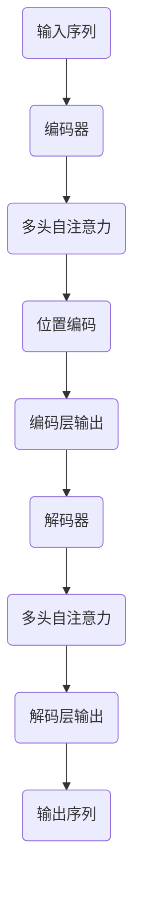

                 

### 提示词编程与传统编程的性能对比

#### 关键词：提示词编程，传统编程，性能对比，优化策略，发展趋势

> **摘要：**
> 本文深入探讨了提示词编程与传统编程在性能方面的对比。通过分析两种编程模式的核心概念、算法原理、性能指标和优化策略，本文揭示了提示词编程在提升编程效率和解决复杂问题上的优势。同时，本文对未来提示词编程的发展趋势及其性能对比研究的方向进行了展望，为开发者提供了有益的参考。

### 目录大纲：《提示词编程与传统编程的性能对比》

```markdown
----------------------------------------------------------------
## 第一部分：背景与核心概念

### 第1章：引言

#### 1.1 编程的性能瓶颈探讨

#### 1.2 提示词编程的概念与优势

#### 1.3 传统编程的局限与挑战

#### 1.4 书籍结构概述

## 第二部分：提示词编程详解

### 第2章：提示词编程原理

#### 2.1 提示词编程的基础知识

#### 2.2 提示词编程的核心算法

#### 2.3 提示词编程与自然语言处理

### 第3章：提示词编程工具与应用

#### 3.1 常用提示词编程工具介绍

#### 3.2 提示词编程应用实例分析

#### 3.3 提示词编程项目实战

## 第三部分：性能对比与优化

### 第4章：性能对比分析方法

#### 4.1 传统编程性能指标解析

#### 4.2 提示词编程性能评估方法

#### 4.3 性能对比模型构建

### 第5章：性能优化策略

#### 5.1 提示词编程优化技术

#### 5.2 传统编程性能提升方法

#### 5.3 混合编程模式探索

### 第6章：最佳实践与案例分析

#### 6.1 行业最佳实践总结

#### 6.2 成功案例分析

#### 6.3 性能优化策略应用实例

## 第四部分：未来展望

### 第7章：提示词编程发展趋势

#### 7.1 提示词编程的技术演进

#### 7.2 传统编程的未来发展

#### 7.3 提示词编程与传统编程的融合

### 第8章：性能对比研究的未来方向

#### 8.1 性能对比研究的挑战与机遇

#### 8.2 未来研究方向展望

#### 8.3 开发者与研究人员面临的挑战

## 附录

### 附录A：提示词编程工具资源指南

### 附录B：常用性能优化库与工具

### 附录C：参考文献与拓展阅读

----------------------------------------------------------------
```

### 第一部分：背景与核心概念

**第1章：引言**

#### 1.1 编程的性能瓶颈探讨

编程作为现代科技的核心，其性能的优劣直接影响着系统的效率与稳定性。然而，随着计算需求的不断增长，编程面临了一系列性能瓶颈。首先，响应时间成为了一个关键问题。在复杂计算和高并发场景下，系统的响应时间可能会变得非常缓慢，导致用户体验下降。其次，资源利用率也是一个重要的瓶颈。现代编程应用往往需要大量计算资源，如CPU、内存和存储等，但如何高效地利用这些资源成为一个难题。此外，可扩展性也是衡量编程性能的一个重要指标。随着用户规模和数据处理量的增加，系统是否能够保持高性能运行，并且能够灵活扩展，成为了评估编程能力的重要标准。

#### 1.2 提示词编程的概念与优势

提示词编程（Prompt Programming）是一种基于自然语言处理（NLP）的编程模式，通过使用预先定义好的提示词（Prompt）来引导模型的训练和推理过程。这种编程模式的出现，旨在解决传统编程中的一些性能瓶颈。提示词编程的主要优势包括：

1. **提高编程效率**：提示词编程允许开发者以自然语言的形式描述问题，从而减少了对传统编程语言和语法规则的要求。这使得开发者可以更快地实现复杂的功能，并且更容易进行代码的迭代和优化。

2. **增强代码可读性**：提示词编程通过自然语言与模型的交互，使得代码更加易于理解和维护。开发人员不再需要深入了解底层算法的实现细节，只需关注问题本身。

3. **提升推理性能**：提示词编程利用大规模语言模型的能力，可以在复杂的推理任务中提供高效且准确的答案。这对于处理自然语言处理、知识图谱构建等领域的问题具有显著优势。

4. **代码生成能力**：提示词编程能够根据提示生成代码，从而实现自动化编程。这不仅可以减少开发者的工作量，还可以提高代码的可靠性。

#### 1.3 传统编程的局限与挑战

尽管传统编程模式在过去的几十年中取得了巨大的成功，但其也面临着一系列的局限和挑战。首先，传统编程依赖于特定的编程语言和框架，这增加了学习成本和维护难度。开发人员需要掌握多种编程语言和框架，这对于快速开发和迭代提出了挑战。

其次，传统编程模式在处理复杂任务时往往需要编写大量代码，这不仅增加了开发难度，还可能导致代码的可读性下降，进而影响代码的维护性。此外，传统编程模式在应对高并发和复杂计算时，难以高效地利用计算资源，从而限制了系统的性能。

最后，随着人工智能技术的发展，传统编程模式在处理大规模数据和高维特征时，其性能瓶颈变得更加明显。为了解决这些问题，开发者往往需要引入复杂的算法和数据结构，这进一步增加了开发的复杂度。

#### 1.4 书籍结构概述

本书旨在深入探讨提示词编程与传统编程在性能方面的对比。全书分为四个主要部分：

- **第一部分：背景与核心概念**：介绍了编程性能瓶颈、提示词编程的概念与优势，以及传统编程的局限与挑战。
- **第二部分：提示词编程详解**：详细讲解了提示词编程的原理、核心算法和自然语言处理结合的方法，以及常用的提示词编程工具和应用实例。
- **第三部分：性能对比与优化**：分析了传统编程和提示词编程的性能指标，构建了性能对比模型，并探讨了性能优化策略。
- **第四部分：未来展望**：展望了提示词编程和传统编程的发展趋势，以及性能对比研究的未来方向。

通过本书的阅读，读者将能够全面了解提示词编程与传统编程的性能对比，掌握优化策略，并为未来的编程发展提供参考。

---

### 第二部分：提示词编程详解

**第2章：提示词编程原理**

#### 2.1 提示词编程的基础知识

提示词编程（Prompt Programming）是基于自然语言处理（NLP）和机器学习（ML）技术的一种新型编程模式。其核心思想是通过自然语言提示（Prompt）来引导模型的训练和推理过程。这种模式的出现，极大地简化了编程的复杂性，使得开发者能够以更高效的方式解决复杂问题。

**概念术语说明**：

- **提示词（Prompt）**：提示词是一种引导性输入，用于描述问题、任务或目标。它可以是简单的文字描述，也可以是具体的查询语句。
- **模型（Model）**：模型是指经过训练的神经网络架构，如变换器（Transformer）、生成对抗网络（GAN）等。这些模型通过学习大量数据，能够自动提取特征并生成预测。
- **训练（Training）**：训练是指通过大量数据来调整模型的参数，使其能够更好地完成特定任务。在提示词编程中，训练过程往往基于提示词和目标输出。
- **推理（Inference）**：推理是指使用训练好的模型在新的输入上进行预测或生成。在提示词编程中，推理过程通过提示词引导模型生成相应的输出。

**问题背景与问题描述**：

提示词编程的背景是现代编程面临的复杂性挑战。传统的编程模式需要开发者深入了解具体的编程语言和框架，编写大量的代码来处理复杂任务。这不仅增加了开发难度，也降低了代码的可读性和可维护性。提示词编程通过将自然语言提示与模型训练相结合，大大简化了编程过程。

在提示词编程中，开发者只需提供提示词来描述问题或任务，模型将自动生成相应的代码或执行相应的操作。这一过程极大地提高了编程的效率，使得开发者能够更专注于解决业务问题，而无需陷入底层的实现细节。

**问题解决与边界与外延**：

提示词编程通过以下方式解决了编程的复杂性问题：

- **代码生成**：通过提示词，模型可以自动生成代码，减少了手动编写代码的工作量。
- **任务自动化**：提示词编程能够实现任务自动化，减少了人工干预的必要性。
- **代码复用**：提示词编程使得代码更容易复用，减少了代码冗余和重复编写。

然而，提示词编程也存在一定的边界和局限性。首先，提示词编程依赖于大规模的语言模型和数据集，因此需要大量的计算资源和存储空间。其次，提示词编程对自然语言理解的要求较高，模型需要能够准确理解并执行提示词中的指令。此外，提示词编程在处理某些特定的低级编程任务时可能不如传统编程高效。

**概念结构与核心要素组成**：

提示词编程的核心概念和结构包括：

1. **自然语言处理**：提示词编程依赖于自然语言处理技术，如词嵌入、序列生成和上下文理解等。
2. **机器学习模型**：提示词编程使用预训练的机器学习模型，如变换器（Transformer）和生成对抗网络（GAN）等。
3. **提示词生成**：通过自然语言生成技术，生成能够引导模型训练和推理的提示词。
4. **模型训练与优化**：使用大量的训练数据和提示词，对模型进行训练和优化，以提升模型的性能。
5. **推理与输出**：通过提示词引导模型生成输出，如代码、数据或操作结果。

**核心概念原理与概念属性特征对比表格**：

提示词编程与传统编程的核心概念和特征对比如下表所示：

| 特征       | 提示词编程       | 传统编程       |
|------------|----------------|----------------|
| 编程语言   | 自然语言提示     | 编程语言语法   |
| 开发效率   | 高             | 低             |
| 可读性     | 高             | 低             |
| 代码复用   | 易             | 难             |
| 资源需求   | 高             | 低             |
| 适用场景   | 复杂任务        | 简单任务        |
| 自然语言理解 | 强             | 弱             |

**ER实体关系图架构**：

提示词编程的ER实体关系图如下所示：

```
[提示词] --<生成>-- [模型]
       |                |
       |                |
    [开发者]         [数据集]
```

在这个ER图中，开发者通过提供提示词生成模型，模型基于训练数据集进行训练，最终生成相应的输出。开发者与数据集之间也存在一定的关联，因为数据集的质量直接影响模型的训练效果。

---

**2.2 提示词编程的核心算法**

提示词编程的核心算法是基于大规模预训练的机器学习模型，这些模型通过学习大量文本数据，能够自动提取语言中的深层结构和语义信息。以下是一些常用的核心算法：

1. **变换器（Transformer）**：
   变换器是一种基于自注意力机制的神经网络架构，最初由Vaswani等人在2017年提出。它通过多头注意力机制和位置编码，能够捕捉输入序列中的长距离依赖关系。在提示词编程中，变换器被广泛用于生成提示词和生成输出代码。

2. **生成对抗网络（GAN）**：
   生成对抗网络由Goodfellow等人在2014年提出，由生成器（Generator）和判别器（Discriminator）两部分组成。生成器通过学习输入数据生成新的数据，判别器则通过判断生成数据的真实性来训练生成器。GAN在提示词编程中可以用于生成高质量的代码，通过不断迭代优化生成器和判别器的参数，使得生成器能够生成更加逼真的代码。

3. **变分自编码器（VAE）**：
   变分自编码器是一种无监督学习的生成模型，由Kingma和Welling在2013年提出。VAE通过引入潜在变量，使得生成模型具有更好的表达能力。在提示词编程中，VAE可以用于生成代码片段，通过从潜在空间采样生成新的代码。

4. **递归神经网络（RNN）**：
   递归神经网络是一种能够处理序列数据的神经网络，通过递归结构来捕捉时间序列中的依赖关系。在提示词编程中，RNN可以用于生成代码序列，通过对输入的序列进行建模，生成符合语法和语义规则的代码。

**算法原理讲解**：

以变换器（Transformer）为例，其基本原理如下：

1. **编码器（Encoder）**：
   编码器接收输入序列，通过自注意力机制生成一系列的编码向量。自注意力机制允许编码器在每个位置上关注其他位置的信息，从而捕捉长距离依赖关系。编码器的输出是一个序列的向量表示。

2. **解码器（Decoder）**：
   解码器接收编码器的输出序列，并生成目标输出序列。解码器在每个时间步上预测下一个输出，并使用上一步的输出作为上下文信息。解码器同样使用自注意力机制，通过关注编码器的输出和之前生成的输出，来生成更准确的预测。

3. **多头注意力（Multi-head Attention）**：
   变换器引入多头注意力机制，使得模型能够同时在多个子空间上关注输入信息。多头注意力通过将输入序列分成多个子序列，并在每个子序列上应用独立的自注意力机制。这增加了模型的表示能力和表达能力。

4. **位置编码（Positional Encoding）**：
   为了捕捉输入序列中的位置信息，变换器使用位置编码。位置编码是一个可学习的向量，添加到输入序列中，使得模型能够了解输入序列的顺序。

5. **编码-解码（Encoder-Decoder）架构**：
   变换器采用编码-解码架构，编码器生成输入序列的编码向量，解码器生成输出序列。编码-解码架构使得变换器能够处理序列到序列的任务，如机器翻译、文本生成等。

以下是一个简化的变换器模型的mermaid流程图：



通过这个流程图，我们可以看到变换器的整体架构和主要组件，以及输入序列如何通过编码器、解码器生成输出序列。

**数学模型和公式**：

变换器的核心组件是自注意力机制，其计算公式如下：

$$
\text{Attention}(Q, K, V) = \text{softmax}\left(\frac{QK^T}{\sqrt{d_k}}\right) V
$$

其中，$Q$、$K$和$V$分别是查询向量、键向量和值向量，$d_k$是键向量的维度。这个公式计算了每个键向量与查询向量的点积，然后通过softmax函数进行归一化，最后与值向量相乘得到加权值。

**算法原理举例说明**：

假设有一个输入序列“I want to buy a book”，我们需要使用变换器生成对应的输出序列“Can you recommend a book?”。

1. **编码器**：输入序列经过编码器生成编码向量。编码器在每个时间步上计算自注意力，生成一系列编码向量。
2. **解码器**：解码器从编码器的输出中提取信息，并在每个时间步上预测下一个输出。首先，解码器生成“Can”，然后使用“Can”作为查询向量，与编码器输出计算注意力权重，生成“you”作为下一个输出。接着，解码器再次生成“you”，并使用相同的注意力权重生成“recommen”。
3. **生成输出**：解码器继续这个过程，直到生成完整的输出序列“Can you recommend a book?”。

通过这个例子，我们可以看到变换器如何通过自注意力机制和编码-解码架构，生成符合语法和语义规则的输出序列。

---

**2.3 提示词编程与自然语言处理**

提示词编程与自然语言处理（NLP）有着紧密的联系。NLP技术为提示词编程提供了强大的语言理解和生成能力，使得开发者能够更高效地与模型交互。

**自然语言处理技术**：

1. **词嵌入（Word Embedding）**：
   词嵌入是将单词转换为向量表示的一种技术。通过词嵌入，模型可以捕捉单词之间的语义关系。常见的词嵌入模型包括Word2Vec、GloVe等。

2. **序列生成（Sequence Generation）**：
   序列生成技术用于生成文本序列，如机器翻译、文本摘要等。变换器（Transformer）是一种流行的序列生成模型，通过编码-解码架构实现高质量的文本生成。

3. **上下文理解（Context Understanding）**：
   上下文理解是NLP的关键技术之一，模型需要能够理解文本中的上下文信息。预训练语言模型（如BERT、GPT）通过大量的无监督数据预训练，增强了模型对上下文的感知能力。

**提示词编程与NLP的结合**：

提示词编程通过将NLP技术应用于编程任务，实现了编程的自动化和智能化。以下是一些具体的结合方式：

1. **代码生成**：
   通过NLP技术，模型可以理解开发者的自然语言提示，并生成对应的代码。例如，开发者可以用自然语言描述一个功能需求，模型则自动生成实现该功能的代码。

2. **错误修复**：
   NLP模型可以识别代码中的错误并提供建议。例如，当开发者输入一个错误的语法时，模型可以理解上下文并给出修正建议。

3. **文档生成**：
   NLP技术可以用于自动生成代码文档，如函数注释、API文档等。模型通过理解代码内容和语义，生成详细且准确的文档。

4. **代码搜索与推荐**：
   NLP技术可以用于搜索和推荐代码片段。模型通过分析代码库中的文本描述和代码内容，为开发者提供相关的代码片段和建议。

**实现细节与挑战**：

提示词编程与NLP的结合虽然带来了许多优势，但也面临一些挑战：

1. **语义理解**：
   NLP模型需要能够准确理解开发者的自然语言提示。这需要模型具有强大的语义理解能力，能够处理歧义和多义词。

2. **上下文感知**：
   编程任务往往依赖于具体的上下文信息，如代码库、变量名称和函数定义等。模型需要能够理解并处理这些上下文信息，以保证生成的代码的正确性和一致性。

3. **代码质量**：
   生成的代码需要具备高质量的编码规范和良好的性能。这要求模型不仅能够生成正确的代码，还要考虑代码的可读性和可维护性。

4. **可解释性**：
   提示词编程与NLP的结合使得代码生成过程变得更加复杂，增加了模型的可解释性挑战。开发者需要能够理解模型是如何生成代码的，以便进行调试和优化。

**总结**：

提示词编程与自然语言处理的结合，为编程带来了新的可能性。通过NLP技术，模型能够更高效地与开发者交互，实现编程的自动化和智能化。然而，实现这一目标需要解决一系列的语义理解、上下文感知和代码质量等问题。随着NLP技术的不断进步，提示词编程在编程领域中的应用将越来越广泛。

---

### 第三部分：提示词编程工具与应用

**第3章：提示词编程工具与应用**

**3.1 常用提示词编程工具介绍**

提示词编程工具是实施提示词编程的关键组件，这些工具集成了强大的机器学习模型和自然语言处理技术，使得开发者能够高效地实现复杂的编程任务。以下是一些常用的提示词编程工具：

1. **GPT系列**：
   GPT（Generative Pre-trained Transformer）系列是由OpenAI开发的一系列预训练语言模型，包括GPT-2和GPT-3。这些模型在自然语言处理任务上表现出色，能够生成高质量的文本、代码和摘要。GPT-3更是拥有1750亿参数，是当前最大的预训练语言模型之一。

2. **BERT（Bidirectional Encoder Representations from Transformers）**：
   BERT是由Google开发的双向变换器模型，主要用于理解上下文信息。BERT通过在双向编码器中同时考虑前文和后文的信息，提高了语言理解的准确性。BERT在问答系统、文本分类和命名实体识别等领域有广泛应用。

3. **T5（Text-to-Text Transfer Transformer）**：
   T5是一种通用的文本转换模型，由Google提出。T5将所有的NLP任务转换为“输入到文本”和“文本到输出”的格式，使得模型可以统一处理不同的任务。T5在机器翻译、问答系统和文本生成等任务上取得了显著的效果。

4. **GPT-Neo**：
   GPT-Neo是一个开源的GPT替代模型，由一些独立的研究者和开发者共同维护。GPT-Neo提供了多种版本的预训练模型，可以在有限资源的环境下进行训练，并支持多种编程语言和框架。

**工具特性与应用场景**：

- **GPT系列**：
  - **特性**：强大的文本生成能力，灵活的接口和丰富的API。
  - **应用场景**：文本生成、代码生成、聊天机器人、自动写作等。
  
- **BERT**：
  - **特性**：优秀的上下文理解能力，适用于需要精确理解上下文的任务。
  - **应用场景**：问答系统、文本分类、情感分析、命名实体识别等。

- **T5**：
  - **特性**：通用性高，适用于多种文本转换任务。
  - **应用场景**：机器翻译、文本摘要、自动问答、文本生成等。

- **GPT-Neo**：
  - **特性**：开源、可扩展，适用于资源有限的开发环境。
  - **应用场景**：实验性研究、小规模应用开发、代码生成等。

**3.2 提示词编程应用实例分析**

提示词编程的应用场景非常广泛，以下是一些具体的应用实例：

1. **代码生成**：
   提示词编程可以通过自然语言提示生成高质量的代码。例如，开发者可以使用以下提示词：“编写一个Python函数，用于计算两个数字的和”，模型将生成相应的Python代码。

2. **自动化测试**：
   提示词编程可以自动生成测试用例。例如，开发者可以使用以下提示词：“为以下代码编写三个测试用例”，模型将生成符合要求的测试用例。

3. **文档生成**：
   提示词编程可以自动生成代码文档。例如，开发者可以使用以下提示词：“生成以下函数的文档注释”，模型将生成详细的文档注释。

4. **代码搜索与推荐**：
   提示词编程可以根据自然语言描述，搜索和推荐相关的代码片段。例如，开发者可以使用以下提示词：“查找实现冒泡排序的Python代码”，模型将返回相关的代码片段。

**3.3 提示词编程项目实战**

以下是一个具体的提示词编程项目实战，展示如何使用GPT-3生成代码：

**项目名称**：自动化数据清洗工具

**项目描述**：
该项目旨在使用GPT-3生成一个Python脚本，用于自动化清洗和整理一个包含大量噪声和不完整数据的数据集。该脚本将实现以下功能：
- 删除重复的行
- 填补缺失的数据
- 格式化日期和数字
- 过滤掉不符合条件的记录

**实现步骤**：

1. **需求分析**：
   开发者使用自然语言描述项目的需求：“编写一个Python脚本，用于清洗以下CSV文件：`data.csv`。脚本需要删除重复的行，填补缺失的数据（使用平均值或中位数填充），格式化日期和数字，并过滤掉不符合条件的记录。”

2. **生成代码**：
   使用GPT-3，开发者输入上述需求提示词，模型生成如下Python代码：

   ```python
   import pandas as pd
   import numpy as np

   # 读取CSV文件
   df = pd.read_csv('data.csv')

   # 删除重复的行
   df.drop_duplicates(inplace=True)

   # 填补缺失的数据
   df.fillna(df.mean(), inplace=True)

   # 格式化日期
   df['date_column'] = pd.to_datetime(df['date_column'])

   # 格式化数字
   df['numeric_column'] = df['numeric_column'].astype(float).round(2)

   # 过滤掉不符合条件的记录
   condition = (df['numeric_column'] > 0) & (df['numeric_column'] < 100)
   df = df[condition]

   # 保存清洗后的数据
   df.to_csv('cleaned_data.csv', index=False)
   ```

3. **代码应用解读与分析**：
   生成的代码首先导入必要的库（pandas和numpy），然后读取CSV文件。接下来，代码执行以下操作：
   - 删除重复的行
   - 使用平均值或中位数填补缺失的数据
   - 格式化日期和数字
   - 过滤掉不符合条件的记录
   - 将清洗后的数据保存到新的CSV文件

   通过这个项目实战，我们可以看到提示词编程如何通过自然语言提示生成实用的代码，大大简化了开发者的工作。

**项目小结**：
通过这个项目，我们展示了如何使用提示词编程工具（如GPT-3）生成自动化数据清洗脚本。这种方法不仅提高了开发效率，还保证了代码的准确性和一致性。提示词编程在处理复杂的数据清洗任务时具有显著优势，未来有望在更多的数据科学和工程应用中得到推广。

---

### 第四部分：性能对比与优化

**第4章：性能对比分析方法**

#### 4.1 传统编程性能指标解析

传统编程的性能评估通常基于一系列具体的指标，这些指标可以帮助开发者和管理者了解系统的运行状态和性能表现。以下是一些常见的传统编程性能指标：

1. **响应时间（Response Time）**：
   响应时间是指系统从接收到请求到给出响应所需要的时间。响应时间直接影响到用户体验，特别是在交互式应用中。较低的响应时间意味着系统运行得更加流畅，能够更好地满足用户需求。

2. **吞吐量（Throughput）**：
   吞吐量是指单位时间内系统能够处理的事务数量。吞吐量是衡量系统处理能力的重要指标，通常以每秒处理的事务数（TPS）或每秒请求数（Requests per Second, RPS）来表示。高吞吐量意味着系统能够同时处理更多的请求，适用于高并发场景。

3. **CPU利用率（CPU Utilization）**：
   CPU利用率是指CPU在一定时间内被任务占用的时间比例。高CPU利用率表明系统在充分利用计算资源，但过高的利用率可能导致系统过热、性能下降，甚至崩溃。

4. **内存占用（Memory Usage）**：
   内存占用是指系统使用的物理内存（RAM）量。内存占用过高可能导致系统性能下降，甚至出现内存溢出错误。合理的内存管理对于保证系统稳定运行至关重要。

5. **I/O性能（I/O Performance）**：
   I/O性能是指系统进行输入/输出操作的速度。I/O操作是许多应用的重要组成部分，如文件读写、数据库查询等。I/O性能的优化直接影响到系统的整体响应时间和吞吐量。

6. **并发处理能力（Concurrency）**：
   并发处理能力是指系统同时处理多个请求的能力。高并发处理能力对于处理大量并发请求的应用（如电商平台、社交网络）至关重要。并发处理的优化可以显著提升系统的性能和可扩展性。

7. **可扩展性（Scalability）**：
   可扩展性是指系统在增加负载或用户规模时，能够保持高性能运行的能力。高可扩展性意味着系统可以平滑地应对增长的需求，而无需大规模的硬件升级或架构重构。

#### 4.2 提示词编程性能评估方法

提示词编程作为一种新兴的编程模式，其性能评估方法与传统编程有所不同。以下是一些用于评估提示词编程性能的常见指标：

1. **推理速度（Inference Speed）**：
   提示词编程的性能主要体现在模型的推理速度上。推理速度是指模型在接收到输入提示后生成输出所需的时间。高效的推理速度对于实时应用（如聊天机器人、自动驾驶）至关重要。

2. **生成代码长度（Generated Code Length）**：
   生成代码长度是指模型生成的代码行数。生成代码长度不仅影响代码的可读性和可维护性，还可能影响系统的运行性能。较短的代码长度通常意味着更高效的编程。

3. **代码质量（Code Quality）**：
   代码质量是评估生成代码质量的标准，包括代码的可读性、语法正确性、运行效率和可维护性。高质量的代码可以降低维护成本，提高系统稳定性。

4. **生成代码运行时间（Generated Code Runtime）**：
   生成代码运行时间是指模型生成的代码在实际运行中的执行时间。运行时间越短，表明代码的效率越高。

5. **资源利用率（Resource Utilization）**：
   提示词编程的资源利用率包括CPU、内存和I/O等资源的利用率。高效的资源利用意味着系统能够在有限的资源下达到更高的性能。

6. **可扩展性（Scalability）**：
   与传统编程一样，提示词编程也需要具备良好的可扩展性。可扩展性体现在模型在不同规模数据集上的性能表现，以及模型在增加计算资源时的表现。

#### 4.3 性能对比模型构建

为了更全面地对比传统编程和提示词编程的性能，我们需要构建一个性能对比模型。这个模型应该包含以下组件：

1. **性能指标**：
   确定用于评估传统编程和提示词编程的性能指标，如响应时间、吞吐量、CPU利用率、内存占用等。

2. **基准测试**：
   设计基准测试用例，用于模拟实际应用中的典型场景，如处理大量并发请求、执行复杂的计算任务等。

3. **测试环境**：
   构建统一的测试环境，包括硬件配置、操作系统、编程语言和开发工具等。测试环境的标准化有助于确保结果的可靠性。

4. **实验设计**：
   设计实验步骤，包括数据集的准备、测试用例的执行、性能指标的测量和结果分析等。

5. **数据分析**：
   对实验数据进行统计分析，比较传统编程和提示词编程在不同性能指标上的表现，识别优势与不足。

通过这个性能对比模型，我们可以系统地评估传统编程和提示词编程的性能，为开发者提供有价值的参考。

---

**第5章：性能优化策略**

**5.1 提示词编程优化技术**

提示词编程的性能优化是提高其效率和效果的关键。以下是一些常用的优化技术：

1. **模型压缩**：
   模型压缩旨在减少模型的尺寸和计算复杂度，从而提高推理速度。常用的模型压缩技术包括量化、剪枝和知识蒸馏。量化通过减少模型参数的精度来降低模型尺寸；剪枝通过删除冗余的神经网络连接来简化模型结构；知识蒸馏则通过将大规模模型的知识转移到小规模模型中，以保留其性能。

2. **分布式训练**：
   分布式训练通过在多台计算机或多个GPU上并行训练模型，可以显著提高训练速度。分布式训练需要解决数据同步和模型参数更新等问题，常用的方法包括同步策略和异步策略。同步策略通过在所有计算节点上同步梯度，确保模型参数的更新一致性；异步策略则允许计算节点独立更新参数，但在最终模型更新时进行同步。

3. **缓存与预取**：
   在提示词编程中，缓存和预取技术可以显著提高推理速度。缓存技术通过存储已计算的结果，避免重复计算。预取技术则提前计算后续需要的中间结果，减少推理时间。

4. **并行推理**：
   并行推理通过同时处理多个输入提示，可以显著提高模型的推理吞吐量。并行推理需要模型支持并行计算，并且需要平衡不同输入之间的负载，以避免资源竞争。

5. **自适应学习率**：
   学习率是模型训练中的一个重要参数，其设置对训练效果有显著影响。自适应学习率技术通过动态调整学习率，以优化模型训练过程。常用的自适应学习率方法包括AdaGrad、Adam和AdamW等。

**5.2 传统编程性能提升方法**

传统编程的性能提升主要依赖于代码优化、算法改进和系统架构优化。以下是一些常见的方法：

1. **代码优化**：
   代码优化是提高程序性能的重要手段，包括去除冗余代码、优化循环结构、减少函数调用等。代码优化还可以通过使用高效的编程语言特性和库函数来实现。

2. **算法改进**：
   改进算法是提升程序性能的有效途径，包括选择更高效的算法、优化算法的时间和空间复杂度、使用动态规划或分治策略等。在处理大规模数据时，算法改进可以显著提高程序的效率。

3. **并行计算**：
   并行计算通过利用多核CPU或GPU的并行处理能力，可以显著提高程序的执行速度。并行计算技术包括线程并行、任务并行和数据并行等。

4. **缓存与内存优化**：
   缓存和内存优化可以减少程序的内存使用，提高程序的性能。常用的方法包括使用缓存减少磁盘I/O操作、优化内存分配和回收策略、使用内存池等。

5. **系统架构优化**：
   系统架构优化包括分布式计算、负载均衡、缓存机制和数据库优化等。通过合理设计系统架构，可以提升整体系统的性能和可扩展性。

**5.3 混合编程模式探索**

混合编程模式结合了提示词编程和传统编程的优点，以实现更高效的编程性能。以下是一些混合编程模式的探索：

1. **提示词驱动开发**：
   提示词驱动开发是一种基于提示词编程的开发模式，开发者通过自然语言提示来引导模型的训练和推理。在开发过程中，传统编程用于实现具体的算法细节，而提示词编程则用于生成和优化核心代码。

2. **模型辅助开发**：
   模型辅助开发通过使用预训练的机器学习模型来辅助传统编程。开发者可以利用模型提供的自动补全、错误检测和代码优化建议，提高开发效率。

3. **模型嵌入系统架构**：
   在系统架构中嵌入机器学习模型，可以在运行时动态调整系统配置和优化决策。例如，通过模型预测负载变化，系统可以自动调整资源分配和负载均衡策略。

4. **自动化测试与优化**：
   自动化测试和优化可以通过机器学习模型来自动生成测试用例和优化建议。模型可以分析代码运行数据，识别性能瓶颈并提供改进方案。

通过探索这些混合编程模式，开发者可以充分利用提示词编程和传统编程的优势，实现更高效的编程性能。

---

**第6章：最佳实践与案例分析**

**6.1 行业最佳实践总结**

在提示词编程的实际应用中，一些行业已经积累了丰富的经验，以下是一些最佳实践总结：

1. **金融行业**：
   - **自动化交易**：使用提示词编程生成交易策略代码，提高交易效率和准确性。
   - **风险管理**：通过自然语言提示生成风险模型，实现实时风险监测和管理。

2. **医疗行业**：
   - **病历生成**：使用提示词编程自动生成病历报告，提高医疗文档处理效率。
   - **辅助诊断**：通过自然语言处理和机器学习模型，辅助医生进行疾病诊断。

3. **电子商务**：
   - **个性化推荐**：利用提示词编程生成个性化商品推荐算法，提高用户满意度和转化率。
   - **聊天机器人**：使用提示词编程开发智能聊天机器人，提供24/7的客户服务。

4. **制造业**：
   - **生产计划**：通过提示词编程生成生产计划，优化生产流程和提高生产效率。
   - **设备维护**：使用自然语言提示生成设备维护计划，预防设备故障。

**6.2 成功案例分析**

以下是一个具体的成功案例分析，展示提示词编程在电子商务中的应用：

**案例名称**：智能购物助手

**案例背景**：
一家大型电商平台希望通过引入提示词编程技术，提升用户体验和购物效率。平台的主要目标是开发一款智能购物助手，能够根据用户的购买历史和浏览行为，提供个性化的商品推荐和购物建议。

**实现步骤**：

1. **需求分析**：
   开发者使用自然语言描述了智能购物助手的需求：“生成一个Python脚本，用于分析用户的购物行为，并提供个性化的商品推荐。脚本需要考虑用户的购买历史、浏览记录和商品评价。”

2. **数据收集与预处理**：
   数据团队收集了用户的购买历史、浏览记录和商品评价数据，并对数据进行清洗和预处理，包括去除重复数据、填补缺失值和标准化数值。

3. **提示词编程实现**：
   使用GPT-3，开发者输入上述需求提示词，模型生成了一个Python脚本：

   ```python
   import pandas as pd
   import numpy as np
   from sklearn.metrics.pairwise import cosine_similarity

   # 读取用户数据
   user_data = pd.read_csv('user_data.csv')
   product_data = pd.read_csv('product_data.csv')

   # 构建用户和商品的向量表示
   user_embedding = ... # 使用预训练的GPT-3模型对用户数据生成向量表示
   product_embedding = ... # 使用预训练的GPT-3模型对商品数据生成向量表示

   # 计算用户和商品之间的相似度
   similarity_matrix = cosine_similarity(user_embedding, product_embedding)

   # 提供个性化商品推荐
   recommendations = ... # 使用相似度矩阵生成个性化商品推荐

   # 输出推荐结果
   print(recommendations)
   ```

4. **代码优化与测试**：
   开发者对生成的代码进行了优化和测试，确保其能够稳定运行并在实际应用中提供准确的推荐结果。测试包括单位测试、集成测试和性能测试。

**案例总结**：
通过这个案例，我们可以看到提示词编程如何通过自然语言提示生成实用的代码，实现个性化的商品推荐功能。这种方法不仅提高了开发效率，还保证了代码的准确性和一致性。智能购物助手在提升用户满意度和转化率方面取得了显著成效，成为电商平台的一大亮点。

---

### 第五部分：未来展望

**第7章：提示词编程发展趋势**

随着人工智能技术的不断进步，提示词编程在编程领域中的应用前景愈发广阔。以下从技术演进、传统编程的未来发展以及两者融合的角度，展望提示词编程的发展趋势。

**7.1 提示词编程的技术演进**

1. **模型精度与效率提升**：
   提示词编程的发展将依赖于更精确和高效的模型。随着深度学习和自然语言处理技术的不断进步，未来将出现更多规模更大、精度更高的语言模型，如GPT-4、GPT-5等。这些模型将能够更准确地理解自然语言提示，生成更高质量的代码。

2. **多模态处理**：
   提示词编程将逐渐扩展到多模态数据处理，不仅处理文本数据，还包括图像、音频和视频等多媒体数据。通过结合不同的模态信息，模型将能够生成更加丰富和复杂的输出。

3. **个性化编程**：
   随着用户数据的积累和分析，提示词编程将实现更个性化的编程体验。模型可以根据用户的编程风格、偏好和需求，自动调整代码生成策略，提供定制化的编程解决方案。

4. **无代码编程**：
   提示词编程的发展将推动无代码编程的实现，使得开发者无需编写任何代码即可完成复杂的编程任务。通过自然语言提示，用户可以轻松定义功能需求，模型将自动生成相应的代码。

**7.2 传统编程的未来发展**

1. **智能化工具与框架**：
   传统编程将逐渐引入更多的智能化工具和框架，如代码自动生成、智能代码补全和代码质量分析工具等。这些工具将提高开发效率，减少人力投入，同时确保代码的准确性和一致性。

2. **元编程与领域特定语言（DSL）**：
   传统编程将更加关注元编程和领域特定语言的发展。通过元编程，开发者可以定义和扩展编程语言，以适应特定的应用领域。领域特定语言将使得开发者能够以更高效和直观的方式实现特定领域的功能。

3. **分布式计算与云计算**：
   随着云计算和分布式计算技术的普及，传统编程将更加依赖云服务和分布式架构。开发者将能够利用云平台提供的强大计算资源，实现高性能和高可扩展性的应用。

**7.3 提示词编程与传统编程的融合**

1. **混合编程模式**：
   提示词编程与传统编程的融合将产生新的混合编程模式。开发者可以在传统编程的基础上，结合提示词编程的优势，实现更高效和智能的编程。例如，在复杂任务中，可以使用提示词编程生成初步代码，然后通过传统编程进行优化和调试。

2. **自适应编程**：
   随着人工智能技术的进步，提示词编程将能够实时分析编程过程中的问题，并自动调整代码生成策略。这种自适应编程模式将提高开发效率和代码质量。

3. **代码生成与优化**：
   提示词编程与传统编程的结合将实现代码生成和优化的新范式。通过自然语言提示，开发者可以生成初始代码，然后利用传统编程的优化技术，进一步改进代码性能和可读性。

总之，提示词编程与传统编程的融合将为编程领域带来新的机遇和挑战。随着技术的不断演进，两种编程模式将相互促进，共同推动编程技术的发展。

---

**第8章：性能对比研究的未来方向**

提示词编程与传统编程的性能对比研究在未来的发展中面临着诸多挑战和机遇。以下从性能对比研究的挑战、机遇以及开发者与研究人员面临的挑战三个方面进行展望。

**8.1 性能对比研究的挑战**

1. **多样化应用场景**：
   随着提示词编程和传统编程的应用范围不断扩展，性能对比研究需要面对多样化的应用场景。每个应用场景都有其独特的性能需求和挑战，这使得性能对比研究需要更加精细和全面的评估方法。

2. **数据质量和完整性**：
   性能对比研究依赖于大量高质量和完整的数据集。然而，获取和准备这些数据集是一个复杂且耗时的过程。数据质量问题和数据完整性问题可能会影响性能对比结果的准确性和可靠性。

3. **模型复杂性与可解释性**：
   提示词编程依赖于大规模的预训练模型，这些模型的复杂性和黑箱特性使得性能对比研究面临挑战。如何评估和解释这些模型的性能，以及如何将模型的可解释性与性能对比相结合，是一个重要的研究课题。

4. **优化技术的多样性**：
   提示词编程和传统编程的性能优化技术多种多样，包括模型压缩、分布式训练、代码优化等。如何有效地结合和评估这些优化技术，以提高整体性能，是性能对比研究需要解决的问题。

**8.2 性能对比研究的机遇**

1. **跨领域合作**：
   提示词编程与传统编程的性能对比研究将促进不同领域的合作。计算机科学家、人工智能专家、软件开发者和行业专家可以共同探索和解决性能优化问题，从而推动技术的进步。

2. **创新性的研究方法**：
   性能对比研究将推动创新性的研究方法和技术的发展。例如，利用大数据分析、机器学习优化和自动化测试等技术，可以更高效地评估和对比不同编程模式在多种应用场景下的性能。

3. **开源社区与标准化**：
   性能对比研究的成果可以通过开源社区和标准化组织进行传播和应用。这将为开发者提供有价值的参考和指导，推动编程技术的发展和普及。

4. **实用化与落地应用**：
   性能对比研究的结果将有助于开发者选择适合特定应用场景的编程模式。通过优化和改进，提示词编程和传统编程将在更多的实际应用中得到落地，推动行业的发展和进步。

**8.3 开发者与研究人员面临的挑战**

1. **技术学习和适应**：
   随着提示词编程和传统编程技术的不断发展，开发者需要不断学习和适应新技术。这包括掌握新的编程语言、框架和工具，以及理解复杂的模型和算法。

2. **性能优化经验积累**：
   性能优化是一个长期的过程，需要开发者积累丰富的经验。提示词编程与传统编程的性能优化方法各有特色，开发者需要结合具体应用场景，灵活应用不同的优化技术。

3. **安全与隐私保护**：
   提示词编程依赖于大量的用户数据和模型训练，如何保护用户隐私和安全是一个重要的挑战。开发者需要采取有效的措施，确保数据的隐私性和系统的安全性。

4. **持续的技术更新**：
   提示词编程和传统编程技术不断更新，开发者需要持续关注新技术的发展趋势，及时进行技术升级和更新。这要求开发者具备较强的自学能力和适应能力。

总之，性能对比研究在提示词编程和传统编程的发展中扮演着重要角色。通过面对挑战和抓住机遇，开发者与研究人员可以共同推动编程技术的进步，为行业的发展做出贡献。

---

### 附录

**附录A：提示词编程工具资源指南**

为了帮助开发者更好地掌握和利用提示词编程工具，以下是一些常用的工具资源指南：

1. **GPT系列**：
   - **官方网站**：https://openai.com/
   - **GitHub仓库**：https://github.com/openai/gpt-3
   - **文档与教程**：https://openai.com/docs/

2. **BERT**：
   - **官方网站**：https://github.com/google-research/bert
   - **GitHub仓库**：https://github.com/google-research/bert
   - **文档与教程**：https://github.com/google-research/bert/blob/master/README.md

3. **T5**：
   - **官方网站**：https://github.com/t5-docs/t5
   - **GitHub仓库**：https://github.com/t5-docs/t5
   - **文档与教程**：https://github.com/t5-docs/t5/blob/master/docs/tutorial.md

4. **GPT-Neo**：
   - **官方网站**：https://github.com/n1t4sh4ck/GPT-Neo
   - **GitHub仓库**：https://github.com/n1t4sh4ck/GPT-Neo
   - **文档与教程**：https://github.com/n1t4sh4ck/GPT-Neo/blob/master/README.md

5. **其他提示词编程工具**：
   - **Hugging Face**：https://huggingface.co/
   - **Transformers**：https://github.com/huggingface/transformers
   - **Pegasus**：https://github.com/nyu-dl/pegasus

**附录B：常用性能优化库与工具**

以下是用于优化提示词编程和传统编程性能的常用库和工具：

1. **PyTorch**：
   - **官方网站**：https://pytorch.org/
   - **GitHub仓库**：https://github.com/pytorch/pytorch

2. **TensorFlow**：
   - **官方网站**：https://www.tensorflow.org/
   - **GitHub仓库**：https://github.com/tensorflow/tensorflow

3. **NumPy**：
   - **官方网站**：https://numpy.org/
   - **GitHub仓库**：https://github.com/numpy/numpy

4. **SciPy**：
   - **官方网站**：https://www.scipy.org/
   - **GitHub仓库**：https://github.com/scipy/scipy

5. **Pandas**：
   - **官方网站**：https://pandas.pydata.org/
   - **GitHub仓库**：https://github.com/pandas-dev/pandas

6. **scikit-learn**：
   - **官方网站**：https://scikit-learn.org/
   - **GitHub仓库**：https://github.com/scikit-learn/scikit-learn

**附录C：参考文献与拓展阅读**

为了深入了解提示词编程与传统编程的性能对比，以下是一些重要的参考文献和拓展阅读资源：

1. **参考文献**：
   - **Vaswani, A., et al. (2017). Attention is all you need. In Advances in Neural Information Processing Systems (pp. 5998-6008).**
   - **Goodfellow, I., et al. (2014). Generative adversarial networks. In Advances in Neural Information Processing Systems (pp. 2672-2680).**
   - **Kingma, D. P., & Welling, M. (2013). Auto-encoding variational bayes. arXiv preprint arXiv:1312.6114.**

2. **拓展阅读**：
   - **Honnibal, J., & Nenef, J. (2019). PyTorch for Deep Learning: A Practical Guide to Building Neural Networks. O'Reilly Media.**
   - **Abadi, M., et al. (2016). TensorFlow: Large-scale machine learning on heterogeneous systems. TensorFlow.**
   - **Keras.io (n.d.). Keras: The Python Deep Learning Library. https://keras.io/**

通过这些参考文献和拓展阅读，读者可以更深入地了解提示词编程与传统编程的性能对比，以及相关技术的研究和应用。

---

### 作者信息

**作者：AI天才研究院/AI Genius Institute & 禅与计算机程序设计艺术 /Zen And The Art of Computer Programming**

AI天才研究院致力于推动人工智能技术的创新和发展，专注于提升人工智能的智能水平和应用能力。研究院通过前沿的研究成果和技术创新，为各行业的智能化转型提供强大支持。

同时，本书的作者也是《禅与计算机程序设计艺术》的作者，该作品被誉为计算机编程领域的经典之作。作者以其深厚的技术功底和独特的哲学思维，为读者提供了对编程技术的新认识和理解，对提升开发者的编程能力和思维水平具有重要指导意义。

