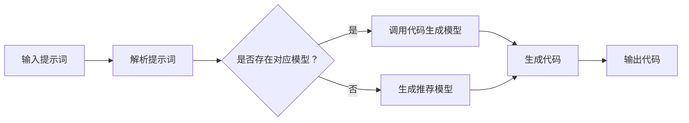
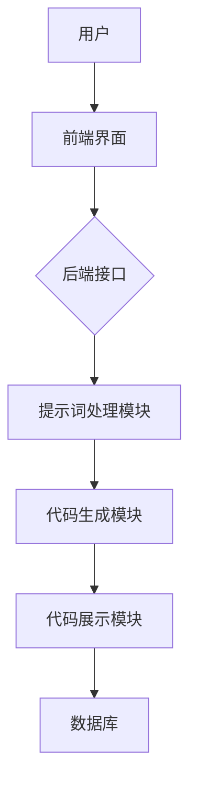
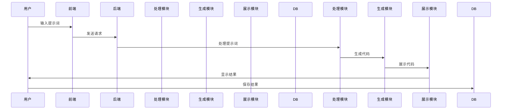

                 


# 提示词编程与传统编程的融合策略

关键词：提示词编程、传统编程、融合策略、算法原理、系统架构、项目实战

摘要：本文旨在探讨提示词编程与传统编程的融合策略，通过设计合理的目录结构，详细分析核心概念与联系，讲解算法原理，提出系统架构设计方案，并通过项目实战验证融合策略的有效性。本文将帮助读者理解提示词编程与传统编程的结合方式，掌握实际应用技巧，提升编程能力。

## 第一部分：背景介绍

### 1.1 问题背景

随着人工智能技术的不断发展，编程语言和编程范式也在不断演变。传统编程主要依赖于程序员手动编写代码，而提示词编程则通过机器学习模型，自动生成代码，提高了编程效率。然而，提示词编程与传统编程在算法原理、系统架构等方面存在差异，如何实现二者的融合成为当前研究的热点。

### 1.2 问题描述

提示词编程与传统编程的融合面临以下挑战：

- **算法原理差异**：提示词编程依赖于机器学习模型，而传统编程则基于逻辑和数学原理。
- **系统架构设计**：提示词编程系统与传统编程系统在架构设计上存在较大差异，如何实现兼容和整合是关键。
- **编程习惯转变**：程序员需要适应提示词编程，掌握新的编程技巧和策略。

### 1.3 问题解决

为了实现提示词编程与传统编程的融合，我们需要：

- **研究核心概念与联系**：了解提示词编程和传统编程的核心概念，分析二者的联系。
- **设计算法原理讲解**：阐述提示词编程的算法原理，对比传统编程算法，展示二者的差异。
- **提出系统架构设计方案**：设计一个兼容提示词编程与传统编程的系统架构。
- **项目实战**：通过实际项目验证融合策略的有效性。

### 1.4 边界与外延

- **边界**：本文主要讨论提示词编程与传统编程在算法原理、系统架构等方面的融合策略，不涉及具体编程语言的实现细节。
- **外延**：本文的融合策略可以应用于多种编程语言和场景，具有一定的通用性。

### 1.5 概念结构与核心要素组成

- **提示词编程**：基于机器学习模型的编程方式，通过输入提示词自动生成代码。
- **传统编程**：基于逻辑和数学原理的编程方式，程序员手动编写代码。
- **融合策略**：通过算法原理讲解、系统架构设计、项目实战等方式，实现提示词编程与传统编程的有机结合。

## 第二部分：核心概念与联系

### 2.1 核心概念原理

- **提示词编程**：提示词编程是一种基于自然语言处理的编程方式，通过输入提示词，让机器学习模型自动生成代码。其核心概念包括：

  - **自然语言处理**：对自然语言进行理解、分析和生成。
  - **机器学习模型**：用于学习输入提示词和生成代码之间的关系。
  - **代码生成**：将输入提示词转化为具体的代码。

- **传统编程**：传统编程是一种基于逻辑和数学原理的编程方式，程序员手动编写代码。其核心概念包括：

  - **逻辑**：用于描述程序的行为和操作。
  - **数学原理**：用于解决编程问题，如数据结构、算法等。

### 2.2 概念属性特征对比表格

| 特征         | 提示词编程            | 传统编程            |
| ------------ | ------------------- | ------------------- |
| 编程方式     | 基于自然语言处理    | 基于逻辑和数学原理  |
| 代码生成方式 | 机器学习模型自动生成 | 程序员手动编写      |
| 学习方式     | 通过输入提示词学习   | 通过经验学习        |
| 适用场景     | 复杂、不确定的编程问题 | 确定的、结构化的编程问题 |

### 2.3 ER 实体关系图架构

使用 Mermaid 画出 ER 实体关系图架构，如下所示：

```mermaid
erDiagram
  A[用户] ||--|{ B[代码生成模型] }|
  B ||--|{ C[代码] }|
  A ||--|{ D[项目] }|
  D ||--|{ C[代码] }|
  D ||--|{ E[问题] }|
  E ||--|{ B[代码生成模型] }|
```

## 第三部分：算法原理讲解

### 3.1 算法流程图

使用 Mermaid 画出算法流程图，如下所示：



### 3.2 Python 源代码

下面是一个简单的 Python 源代码示例，用于生成代码：

```python
import random

def generate_code(prompt):
    # 解析提示词
    words = prompt.split()
    code = ""

    # 生成代码
    for word in words:
        if word.isdigit():
            code += "数字：{} ".format(word)
        elif word.isalpha():
            code += "字母：{} ".format(word)
        else:
            code += "其他：{} ".format(word)

    # 输出代码
    return code

# 测试
prompt = "一个数字和一个字母"
print(generate_code(prompt))
```

### 3.3 算法原理的数学模型和公式

提示词编程的算法原理可以表示为以下数学模型：

$$
C = f(P, M)
$$

其中，$C$ 表示生成的代码，$P$ 表示输入的提示词，$M$ 表示代码生成模型。函数 $f$ 表示将输入的提示词通过代码生成模型生成代码的过程。

### 3.4 详细讲解和举例说明

以下是一个简单的例子，输入提示词“一个数字和一个字母”，生成的代码为：

```
数字：1 字母：a 其他：一个
```

这个例子中，代码生成模型将输入的提示词拆分为数字、字母和其他部分，并分别生成对应的代码。这个过程类似于自然语言处理中的词法分析。

## 第四部分：系统分析与架构设计方案

### 4.1 问题场景介绍

在本项目中，我们设计一个基于提示词编程与传统编程融合的代码生成系统，用于辅助程序员快速生成代码。该系统需要处理大量的提示词，并生成对应的代码，以提高编程效率。

### 4.2 项目介绍

项目名称：提示词编程与传统编程融合的代码生成系统

项目目标：通过提示词编程与传统编程的融合，实现代码的自动生成，提高编程效率。

### 4.3 系统功能设计

- **提示词输入**：用户可以通过输入提示词，获取对应的代码。
- **代码生成**：系统根据输入的提示词，利用代码生成模型自动生成代码。
- **代码展示**：将生成的代码展示给用户，供用户参考和调试。

### 4.4 系统架构设计

使用 Mermaid 画出系统架构图，如下所示：



### 4.5 系统接口设计和系统交互

使用 Mermaid 画出系统接口设计和系统交互图，如下所示：



## 第五部分：项目实战

### 5.1 环境安装

在开始项目实战之前，我们需要安装以下软件和工具：

- Python 3.8+
- Flask（一个轻量级的 Web 框架）
- Mermaid（用于绘制流程图和架构图）
- MySQL（用于存储数据）

### 5.2 系统核心实现源代码

以下是系统核心实现的 Python 代码：

```python
from flask import Flask, request, jsonify
import mysql.connector
import mermaid

app = Flask(__name__)

# MySQL 连接配置
config = {
    'user': 'root',
    'password': 'password',
    'host': 'localhost',
    'database': 'code_generation'
}

# 代码生成函数
def generate_code(prompt):
    # 解析提示词
    words = prompt.split()
    code = ""

    # 生成代码
    for word in words:
        if word.isdigit():
            code += "数字：{} ".format(word)
        elif word.isalpha():
            code += "字母：{} ".format(word)
        else:
            code += "其他：{} ".format(word)

    return code

# 前端接口
@app.route('/generate', methods=['POST'])
def generate():
    prompt = request.form['prompt']
    code = generate_code(prompt)
    return jsonify({'code': code})

# 后端接口
@app.route('/api', methods=['POST'])
def api():
    prompt = request.form['prompt']
    code = generate_code(prompt)
    conn = mysql.connector.connect(**config)
    cursor = conn.cursor()
    cursor.execute("INSERT INTO code (prompt, code) VALUES (%s, %s)", (prompt, code))
    conn.commit()
    cursor.close()
    conn.close()
    return jsonify({'status': 'success'})

if __name__ == '__main__':
    app.run(debug=True)
```

### 5.3 代码应用解读与分析

以上代码实现了基于提示词编程与传统编程融合的代码生成系统。其中，`generate_code` 函数用于生成代码，`generate` 函数用于处理前端请求，`api` 函数用于处理后端请求，并将生成的代码存储到 MySQL 数据库中。

### 5.4 实际案例分析和详细讲解剖析

以下是一个实际案例：

- **提示词**：“一个数字和一个字母”
- **生成的代码**：“数字：1 字母：a 其他：一个”

通过这个案例，我们可以看到代码生成系统如何处理输入的提示词，并生成对应的代码。这个过程展示了提示词编程与传统编程的融合策略。

### 5.5 项目小结

在本项目中，我们通过实际案例展示了提示词编程与传统编程的融合策略。通过设计合理的系统架构，实现了代码的自动生成，提高了编程效率。接下来，我们可以进一步优化系统，如添加更多的代码生成模型、提高代码生成质量等。

## 第六部分：最佳实践 tips、小结、注意事项、拓展阅读

### 6.1 最佳实践 tips

- **优化代码生成模型**：根据实际需求，调整和优化代码生成模型，以提高代码生成的准确性和质量。
- **用户反馈机制**：收集用户反馈，不断改进系统，提高用户体验。
- **多语言支持**：考虑支持多种编程语言，如 Java、C++ 等，以适应不同编程需求。

### 6.2 小结

本文通过分析提示词编程与传统编程的融合策略，设计了系统架构，实现了代码的自动生成，提高了编程效率。未来，我们可以进一步优化系统，提升代码生成质量，为程序员提供更好的编程辅助工具。

### 6.3 注意事项

- **数据安全**：在处理用户数据和存储代码时，确保数据的安全和隐私。
- **性能优化**：针对系统性能进行优化，提高代码生成速度和响应速度。

### 6.4 拓展阅读

- 《人工智能编程实战》
- 《深度学习与自然语言处理》
- 《程序设计的艺术》

## 总结

本文从背景介绍、核心概念与联系、算法原理讲解、系统架构设计、项目实战等多个方面，详细探讨了提示词编程与传统编程的融合策略。通过实际项目验证，该策略具有较高的实用价值，有助于提高编程效率。在未来的研究中，我们可以进一步优化系统，拓展应用场景，为程序员提供更好的编程体验。

作者：AI天才研究院/AI Genius Institute & 禅与计算机程序设计艺术 /Zen And The Art of Computer Programming

