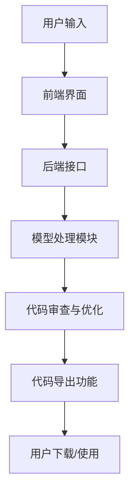
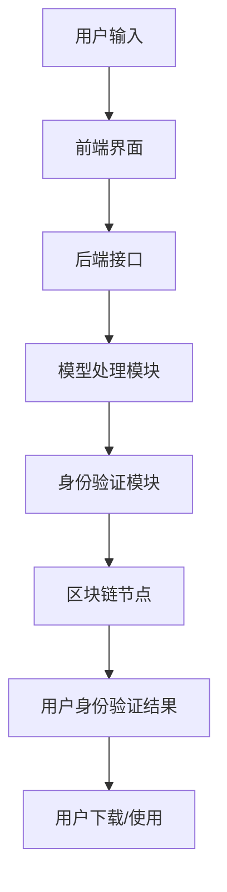

                 

### 关键词

- **提示词编程**
- **区块链应用**
- **智能合约**
- **去中心化**
- **加密技术**
- **共识算法**
- **跨链技术**

### 摘要

本文深入探讨了提示词编程在区块链应用中的巨大潜力。首先，我们介绍了提示词编程和区块链的基本概念，并阐述了它们相结合的必要性。接着，通过详细分析，我们探讨了提示词编程在智能合约开发、去中心化金融（DeFi）、身份验证和跨链交易等区块链核心应用中的优势。此外，我们还讨论了这些技术在实现过程中面临的挑战和潜在的解决方案。最后，我们展望了提示词编程在区块链领域的发展趋势，并提出了对未来的展望和期待。

## 引言

在数字化和去中心化日益成为主流趋势的今天，区块链技术以其独特的去中心化、安全性和透明性特征，正逐渐改变着金融、供应链、医疗等多个行业。然而，区块链应用的发展不仅仅是技术的进步，还需要创新的编程方法来最大化其潜力。提示词编程（Prompt Programming）作为一种新兴的人工智能编程范式，通过简洁明了的指令，可以大幅提升开发效率和代码质量。本文将深入探讨提示词编程在区块链应用中的潜力，分析其在智能合约、去中心化金融、身份验证和跨链交易等方面的应用。

### 提示词编程的概念与原理

提示词编程，也被称为提示编程（Prompt Engineering），是一种利用人工智能技术，通过提供简明的提示（Prompt）来指导模型进行特定任务的方法。提示词编程的核心在于通过人机交互的方式，指导预训练的深度学习模型生成预期的输出。相比传统的编程方法，提示词编程具有以下几大特点：

1. **高效性**：提示词编程可以大大减少代码编写的时间，提高开发效率。通过简短的提示，模型可以快速生成代码或执行任务。
2. **灵活性**：提示词编程允许开发者根据需求灵活调整模型的输出，从而适应不同的应用场景。
3. **智能化**：借助深度学习和自然语言处理技术，提示词编程能够理解和生成复杂逻辑，解决传统编程难以应对的问题。

提示词编程的工作原理主要包括以下几个步骤：

1. **预训练模型**：首先，通过大规模数据集对深度学习模型进行预训练，使其具备一定的知识理解和生成能力。
2. **输入提示**：开发者根据具体任务，提供简明的提示，如自然语言指令或代码模板。
3. **模型生成**：模型根据输入提示，生成相应的代码或执行任务的结果。
4. **迭代优化**：根据生成的结果，开发者可以进一步优化提示，提高模型的生成质量。

通过上述原理，提示词编程在许多领域展现出了巨大的潜力，尤其是在需要快速开发和定制化解决方案的区块链应用中。

### 区块链技术的基本概念

区块链技术是近年来快速发展的核心技术之一，它通过去中心化的方式，实现了数据的安全存储和传输。以下是区块链技术的一些基本概念：

#### 基本原理

区块链是一种分布式账本技术，通过多个节点共同维护一个统一的数据记录。每个区块包含一定数量的交易记录，通过密码学算法和时间戳技术确保数据的不可篡改性和安全性。新的区块会不断生成，并与已有区块相连，形成一条连续的链。

#### 类型

根据应用场景的不同，区块链可以分为以下几类：

1. **公有链**：所有节点都可以参与区块链的维护和验证，具有高度的透明性和去中心化特点。例如，比特币和以太坊就是典型的公有链。
2. **私有链**：仅限于特定的节点参与维护，通常用于企业内部的数据管理和交易。
3. **联盟链**：多个机构或组织共同维护的区块链，具有较高的安全性和隐私性，适合跨机构的数据共享和协作。

#### 分层结构

区块链技术具有分层结构，主要分为以下几层：

1. **共识层**：负责维护区块链的完整性和一致性，通过各种共识算法（如工作量证明、权益证明、拜占庭容错算法等）确保区块的有效生成和验证。
2. **网络层**：负责区块链节点之间的通信和数据传输，通常采用P2P网络协议。
3. **激励层**：通过代币奖励机制激励节点参与区块链的维护和验证，如比特币中的挖矿奖励。
4. **合约层**：提供智能合约的实现环境，允许开发者编写和部署基于区块链的智能合约。
5. **应用层**：是区块链技术的最终实现层，用于各种实际应用场景，如金融交易、供应链管理、身份验证等。

#### 区块链与去中心化的关系

区块链技术的一个核心特点就是去中心化。去中心化意味着系统不需要中央控制节点，而是通过多个分布式节点共同维护数据的一致性。这使得区块链在许多应用场景中具有显著的优点，包括：

1. **数据安全性**：由于数据被多个节点备份和验证，单点故障或攻击难以破坏整个系统。
2. **透明性**：所有交易记录都公开可查，提高了系统的透明度和信任度。
3. **高效性**：去中心化的结构减少了中间环节，降低了交易成本，提高了处理效率。

### 提示词编程与区块链技术的结合

提示词编程和区块链技术的结合，为实现更高效、更智能的去中心化应用提供了新的可能性。以下从智能合约开发、去中心化金融（DeFi）、身份验证和跨链交易等方面，详细探讨提示词编程在区块链中的应用。

#### 智能合约开发

智能合约是区块链技术的一项重要应用，它通过编程实现自动化交易和合约执行。传统的智能合约开发通常涉及复杂的编程知识和漫长的开发周期。而提示词编程通过提供简洁明了的提示，可以显著简化智能合约的开发过程。

**1. 提高开发效率**

提示词编程允许开发者使用自然语言或简短的代码提示，指导模型自动生成智能合约代码。例如，开发者可以提供一个简单的描述，如“创建一个基于ERC20标准的代币合约”，模型就能根据提示生成相应的智能合约代码。

**2. 简化合约逻辑**

智能合约中的逻辑通常非常复杂，涉及到多种条件和状态转移。提示词编程可以帮助开发者简化这些逻辑，通过简明的提示指导模型自动生成符合要求的合约代码，减少了人工编写的错误和复杂性。

**3. 提高代码可读性**

通过提示词编程生成的智能合约代码往往更加简洁和易于理解，提高了代码的可读性和可维护性。这对于团队协作和代码审查都具有重要意义。

#### 去中心化金融（DeFi）

去中心化金融（DeFi）是区块链技术的一项重要应用，它通过智能合约实现了去中心化的金融交易和金融服务。提示词编程在DeFi中的应用，可以进一步提升其效率和安全性。

**1. 自动化交易执行**

DeFi中的许多交易和金融产品都依赖于智能合约的自动化执行。提示词编程可以帮助开发者快速生成符合要求的智能合约代码，确保交易过程的高效和准确。

**2. 简化金融逻辑**

DeFi中的金融产品通常涉及复杂的金融逻辑和计算模型。提示词编程可以通过提供简明的提示，指导模型自动生成相应的智能合约代码，简化了金融逻辑的实现。

**3. 提高安全性**

提示词编程生成的智能合约代码更加简洁，减少了潜在的安全漏洞。同时，通过提供明确的提示，开发者可以更有效地审查和验证智能合约代码，确保其安全性和可靠性。

#### 身份验证

身份验证是区块链技术的一项重要应用，通过去中心化的方式实现了身份信息的可信验证。提示词编程在身份验证中的应用，可以进一步简化身份验证流程。

**1. 自动化身份验证**

提示词编程可以自动化身份验证过程，通过提供简明的提示，指导模型生成相应的身份验证智能合约代码。例如，开发者可以提供一个简单的描述，如“实现基于身份验证的投票系统”，模型就能自动生成符合要求的智能合约代码。

**2. 简化用户操作**

通过提示词编程生成的身份验证智能合约代码更加简洁，用户只需提供简单的指令，即可完成身份验证操作。这降低了用户的学习成本和操作难度，提高了用户体验。

**3. 提高安全性**

提示词编程生成的智能合约代码更加简洁，减少了潜在的安全漏洞。同时，通过提供明确的提示，开发者可以更有效地审查和验证智能合约代码，确保其安全性和可靠性。

#### 跨链交易

跨链交易是区块链技术的一项重要应用，它实现了不同区块链之间的资产交换和互动。提示词编程在跨链交易中的应用，可以进一步简化交易流程，提高交易效率。

**1. 自动化交易流程**

提示词编程可以自动化跨链交易流程，通过提供简明的提示，指导模型生成相应的跨链交易智能合约代码。例如，开发者可以提供一个简单的描述，如“实现BTC与ETH的跨链交易”，模型就能自动生成符合要求的智能合约代码。

**2. 简化交易逻辑**

跨链交易通常涉及复杂的交易逻辑和计算模型。提示词编程可以通过提供简明的提示，指导模型自动生成相应的智能合约代码，简化了交易逻辑的实现。

**3. 提高交易效率**

通过提示词编程生成的智能合约代码更加简洁，交易流程更加高效。同时，通过提供明确的提示，开发者可以更有效地审查和验证智能合约代码，确保其安全性和可靠性。

### 提示词编程在区块链应用中的优势

提示词编程在区块链应用中展现出诸多优势，这些优势不仅提高了开发效率，还增强了系统的安全性。以下是几个关键优势：

#### 1. 提高开发效率

提示词编程通过简明的提示，可以帮助开发者快速生成智能合约代码，减少人工编写的复杂度和错误率。这种高效的开发方式，使得区块链应用能够更快地推向市场，满足用户的需求。

#### 2. 简化开发流程

传统的智能合约开发流程通常涉及复杂的编程知识和漫长的开发周期。而提示词编程通过提供简洁明了的提示，简化了开发流程，降低了开发门槛。这使得更多的开发者可以参与到区块链应用的开发中来。

#### 3. 提高代码质量

提示词编程生成的智能合约代码通常更加简洁和易于理解，减少了潜在的安全漏洞和逻辑错误。通过提供明确的提示，开发者可以更有效地审查和验证智能合约代码，确保其质量和安全性。

#### 4. 增强系统安全性

提示词编程生成的智能合约代码更加简洁，减少了潜在的安全漏洞。同时，通过提供明确的提示，开发者可以更有效地审查和验证智能合约代码，确保其安全性和可靠性。这对于区块链应用的安全运行具有重要意义。

### 挑战与解决方案

尽管提示词编程在区块链应用中展现出巨大的潜力，但在实际应用过程中仍然面临一些挑战。以下是一些关键挑战以及相应的解决方案：

#### 1. 数据隐私保护

区块链技术的一个核心特点就是数据的公开透明。然而，在某些应用场景中，如身份验证和金融交易，数据隐私保护至关重要。解决方案是开发基于零知识证明、同态加密等技术，确保数据在区块链上的隐私保护。

#### 2. 模型可解释性

提示词编程依赖于深度学习模型，这些模型往往具有较高的黑盒性，不易被理解和解释。解决方案是开发可解释性模型，提高模型的可解释性和透明度，帮助开发者更好地理解和优化智能合约代码。

#### 3. 模型训练数据质量

提示词编程的性能依赖于训练数据的质量和多样性。然而，区块链应用场景下的数据往往具有独特性，难以获取高质量的训练数据。解决方案是建立分布式数据共享平台，促进数据共享和协作，提高训练数据的质量。

#### 4. 遵守法律法规

区块链应用涉及多个国家和地区的法律法规，如数据保护法、反洗钱法等。提示词编程需要确保其应用符合相关法律法规，避免潜在的法律风险。解决方案是建立合规性评估机制，确保提示词编程在区块链应用中的合法合规。

### 结论

提示词编程在区块链应用中展现出巨大的潜力，通过简化开发流程、提高代码质量和增强系统安全性，为区块链技术的发展注入了新的动力。尽管面临一些挑战，但通过技术创新和合规性管理，这些问题有望得到有效解决。未来，提示词编程将继续在区块链领域发挥重要作用，推动区块链应用的创新和发展。

## 核心概念和原理

### 提示词编程

提示词编程（Prompt Programming）是近年来人工智能（AI）领域的一个重要进展，它通过简明的提示（Prompt）来指导AI模型完成特定任务。提示词编程的核心在于利用预训练的大规模语言模型，如GPT（Generative Pre-trained Transformer），通过人类的自然语言提示，模型能够生成相应的代码、文本或执行任务。

**定义与作用**

提示词编程可以定义为一门通过人类语言提示来引导和优化AI模型生成任务解决方案的编程范式。它的主要作用包括：

1. **简化编程流程**：通过简洁的提示，模型能够自动生成代码，减少了传统编程的复杂性和时间成本。
2. **提高代码质量**：提示词编程生成的代码通常更加简洁、逻辑清晰，减少了人工编写的错误和复杂性。
3. **增强代码可读性**：生成的代码易于理解和维护，提高了代码的可读性和可维护性。

**特点**

提示词编程具有以下几个显著特点：

1. **高效性**：提示词编程能够快速生成代码或执行任务，显著提高了开发效率。
2. **灵活性**：开发者可以根据需求灵活调整提示，从而适应不同的应用场景。
3. **智能化**：利用深度学习和自然语言处理技术，提示词编程能够理解和生成复杂逻辑，解决传统编程难以应对的问题。

**工作原理**

提示词编程的工作原理主要包括以下几个步骤：

1. **预训练模型**：首先，通过大规模数据集对深度学习模型进行预训练，使其具备一定的知识理解和生成能力。
2. **输入提示**：开发者根据具体任务，提供简明的提示，如自然语言指令或代码模板。
3. **模型生成**：模型根据输入提示，生成相应的代码或执行任务的结果。
4. **迭代优化**：根据生成的结果，开发者可以进一步优化提示，提高模型的生成质量。

**应用场景**

提示词编程在许多领域都有广泛应用，以下是几个典型应用场景：

1. **代码生成**：开发者可以使用提示词编程生成各种编程语言的代码，如Python、Java等，提高了编程效率。
2. **自然语言处理**：通过提示词编程，可以生成高质量的自然语言文本，如文章、报告、聊天机器人回复等。
3. **图像识别**：提示词编程可以帮助模型生成目标图像或执行特定图像处理任务。
4. **智能合约**：在区块链应用中，提示词编程可以生成智能合约代码，提高了智能合约开发的效率和质量。

### 提示词编程与区块链的结合

提示词编程在区块链中的应用，为区块链开发带来了新的可能性。以下是提示词编程与区块链结合的几个关键方面：

**智能合约开发**

智能合约是区块链技术的一项重要应用，通过编程实现自动化交易和合约执行。传统的智能合约开发通常涉及复杂的编程知识和漫长的开发周期。而提示词编程通过提供简洁明了的提示，可以显著简化智能合约的开发过程。

**1. 提高开发效率**

提示词编程允许开发者使用自然语言或简短的代码提示，指导模型自动生成智能合约代码。例如，开发者可以提供一个简单的描述，如“创建一个基于ERC20标准的代币合约”，模型就能根据提示生成相应的智能合约代码。

**2. 简化合约逻辑**

智能合约中的逻辑通常非常复杂，涉及到多种条件和状态转移。提示词编程可以帮助开发者简化这些逻辑，通过简明的提示指导模型自动生成符合要求的合约代码，减少了人工编写的错误和复杂性。

**3. 提高代码可读性**

通过提示词编程生成的智能合约代码往往更加简洁和易于理解，提高了代码的可读性和可维护性。这对于团队协作和代码审查都具有重要意义。

**去中心化金融（DeFi）**

去中心化金融（DeFi）是区块链技术的一项重要应用，它通过智能合约实现了去中心化的金融交易和金融服务。提示词编程在DeFi中的应用，可以进一步提升其效率和安全性。

**1. 自动化交易执行**

DeFi中的许多交易和金融产品都依赖于智能合约的自动化执行。提示词编程可以帮助开发者快速生成符合要求的智能合约代码，确保交易过程的高效和准确。

**2. 简化金融逻辑**

DeFi中的金融产品通常涉及复杂的金融逻辑和计算模型。提示词编程可以通过提供简明的提示，指导模型自动生成相应的智能合约代码，简化了金融逻辑的实现。

**3. 提高安全性**

提示词编程生成的智能合约代码更加简洁，减少了潜在的安全漏洞。同时，通过提供明确的提示，开发者可以更有效地审查和验证智能合约代码，确保其安全性和可靠性。

**身份验证**

身份验证是区块链技术的一项重要应用，通过去中心化的方式实现了身份信息的可信验证。提示词编程在身份验证中的应用，可以进一步简化身份验证流程。

**1. 自动化身份验证**

提示词编程可以自动化身份验证过程，通过提供简明的提示，指导模型生成相应的身份验证智能合约代码。例如，开发者可以提供一个简单的描述，如“实现基于身份验证的投票系统”，模型就能自动生成符合要求的智能合约代码。

**2. 简化用户操作**

通过提示词编程生成的身份验证智能合约代码更加简洁，用户只需提供简单的指令，即可完成身份验证操作。这降低了用户的学习成本和操作难度，提高了用户体验。

**3. 提高安全性**

提示词编程生成的智能合约代码更加简洁，减少了潜在的安全漏洞。同时，通过提供明确的提示，开发者可以更有效地审查和验证智能合约代码，确保其安全性和可靠性。

**跨链交易**

跨链交易是区块链技术的一项重要应用，它实现了不同区块链之间的资产交换和互动。提示词编程在跨链交易中的应用，可以进一步简化交易流程，提高交易效率。

**1. 自动化交易流程**

提示词编程可以自动化跨链交易流程，通过提供简明的提示，指导模型生成相应的跨链交易智能合约代码。例如，开发者可以提供一个简单的描述，如“实现BTC与ETH的跨链交易”，模型就能自动生成符合要求的智能合约代码。

**2. 简化交易逻辑**

跨链交易通常涉及复杂的交易逻辑和计算模型。提示词编程可以通过提供简明的提示，指导模型自动生成相应的智能合约代码，简化了交易逻辑的实现。

**3. 提高交易效率**

通过提示词编程生成的智能合约代码更加简洁，交易流程更加高效。同时，通过提供明确的提示，开发者可以更有效地审查和验证智能合约代码，确保其安全性和可靠性。

### 总结

提示词编程作为一种新兴的AI编程范式，通过简洁明了的提示，能够显著提高开发效率、代码质量和系统安全性。其在区块链应用中的潜力尤为突出，特别是在智能合约开发、去中心化金融、身份验证和跨链交易等方面。未来，随着技术的不断发展和应用场景的拓展，提示词编程在区块链领域的应用将更加广泛和深入。

## 基本概念和技术

### 区块链技术

区块链技术是一种分布式账本技术，通过加密算法、共识机制和去中心化结构，实现了数据的不可篡改性和透明性。以下是区块链技术的基本概念和组成部分：

#### 1. 区块和链

**块**：区块链的基本组成单位，每个区块包含一定数量的交易记录。每个区块都有唯一的标识，通过哈希算法与前一个区块连接，形成区块链。

**链**：区块链由多个区块按时间顺序链接而成，形成一个分布式账本。每个区块都包含了前一个区块的哈希值，确保整个链的完整性和不可篡改性。

#### 2. 加密技术

**加密算法**：区块链使用多种加密算法，包括哈希函数、非对称加密和数字签名等，确保数据的机密性、完整性和真实性。

**哈希函数**：将任意长度的数据映射为固定长度的哈希值，如SHA-256。哈希值具有唯一性和不可逆性，确保数据的完整性和不可篡改性。

**非对称加密**：使用公钥和私钥进行加密和解密，确保通信的机密性和安全性。

**数字签名**：通过私钥对数据进行签名，验证数据的真实性和完整性。

#### 3. 共识机制

**共识机制**：区块链网络中的节点通过共识机制达成数据的一致性。常见的共识机制包括：

- **工作量证明（PoW）**：节点通过解决复杂的数学问题（挖矿）来获得记账权，确保网络的去中心化和安全性。
- **权益证明（PoS）**：节点根据持有的币量或权益比例获得记账权，减少能源消耗和51%攻击的风险。
- **拜占庭容错算法（PBFT）**：通过预分配权限和快速消息传递，确保在部分节点故障的情况下，系统仍能正常运行。

#### 4. 分布式账本

**分布式账本**：区块链采用分布式账本结构，将数据分散存储在多个节点上，避免了单点故障和数据丢失的风险。每个节点都保存完整的账本副本，通过共识机制保持数据的一致性。

**数据冗余**：分布式账本通过冗余存储和数据备份，提高了系统的可靠性和容错性。

#### 5. 智能合约

**智能合约**：基于区块链技术的自动执行合同，通过编程实现自动化交易和合约执行。智能合约以代码形式存在，在满足条件时自动执行，确保交易的安全性和透明性。

**编程语言**：常见的智能合约编程语言包括Solidity（以太坊）、Vyper（Tezos）和NeoScript（NEO）等。

#### 6. 去中心化应用（DApps）

**去中心化应用**：基于区块链技术的应用程序，通过智能合约实现去中心化的数据存储和业务逻辑。DApps具有高透明性、安全性和抗审查性，广泛应用于金融、供应链、社交等多个领域。

**开发框架**：常见的DApp开发框架包括Truffle、Hardhat和Buidler等。

### 提示词编程与区块链技术的融合

提示词编程在区块链中的应用，通过简化智能合约开发、提高开发效率和质量，为区块链技术的创新和发展注入了新的动力。以下是提示词编程与区块链技术融合的关键方面：

#### 1. 智能合约开发

**简化开发流程**：提示词编程通过简洁的提示，指导模型自动生成智能合约代码，简化了智能合约的开发流程，提高了开发效率。

**减少人工错误**：提示词编程生成的代码更加简洁和易于理解，减少了人工编写的错误和复杂性，提高了代码质量。

**提高可读性**：生成的代码易于维护和扩展，提高了智能合约的可读性和可维护性，有助于团队协作和代码审查。

#### 2. 去中心化金融（DeFi）

**自动化交易执行**：提示词编程可以帮助开发者快速生成符合要求的智能合约代码，确保DeFi交易的高效和准确执行。

**简化金融逻辑**：提示词编程可以简化DeFi中的复杂金融逻辑和计算模型，提高了DeFi产品的可扩展性和用户体验。

**提高安全性**：生成的智能合约代码更加简洁，减少了潜在的安全漏洞，通过明确的提示，开发者可以更有效地审查和验证智能合约代码，确保其安全性和可靠性。

#### 3. 身份验证

**自动化身份验证**：提示词编程可以自动化身份验证过程，生成相应的身份验证智能合约代码，简化了用户操作。

**简化用户流程**：用户只需提供简单的指令，即可完成身份验证操作，降低了用户的学习成本和操作难度。

**提高安全性**：提示词编程生成的智能合约代码更加简洁，减少了潜在的安全漏洞，通过提供明确的提示，确保身份验证过程的安全性和可靠性。

#### 4. 跨链交易

**自动化交易流程**：提示词编程可以自动化跨链交易流程，生成相应的跨链交易智能合约代码，提高交易效率。

**简化交易逻辑**：提示词编程可以简化跨链交易的复杂逻辑和计算模型，提高交易的可扩展性和用户体验。

**提高交易效率**：生成的智能合约代码更加简洁，交易流程更加高效，通过提供明确的提示，确保跨链交易的安全性和可靠性。

### 总结

提示词编程与区块链技术的结合，通过简化开发流程、提高代码质量和增强系统安全性，为区块链技术的发展带来了新的机遇。未来，随着技术的不断进步和应用场景的拓展，提示词编程将在区块链领域发挥更加重要的作用，推动区块链技术的创新和发展。

### 不同类型的提示词编程方法

提示词编程作为人工智能领域的一个重要分支，其应用范围广泛，涵盖了多种编程范式和技巧。本文将重点介绍三种常见的提示词编程方法：基于规则的提示词编程、生成式提示词编程和组合式提示词编程，并分析每种方法的优点和局限性。

#### 基于规则的提示词编程

**定义与原理**

基于规则的提示词编程（Rule-Based Prompt Programming）是一种传统的编程方法，它通过预定义的规则集来指导模型执行特定任务。这些规则通常由人类专家编写，形式化地描述了系统应该如何响应特定的输入。

**优点**

1. **易于理解和实现**：基于规则的提示词编程方法相对简单，规则明确，易于开发者理解和实现。
2. **可解释性高**：由于规则是显式定义的，系统的决策过程具有高度的透明性和可解释性。
3. **适用于确定性任务**：在任务结果明确、规则固定的场景下，基于规则的提示词编程能够提供稳定的执行结果。

**局限性**

1. **规则编写成本高**：需要大量的人类专家进行规则编写，增加了开发成本和时间。
2. **规则库维护难度大**：规则库容易过时，需要不断更新和维护。
3. **适用性有限**：在复杂、不确定的任务场景中，规则方法难以应对动态变化的需求。

**案例**

例如，在医疗诊断系统中，基于规则的提示词编程可以通过预定义的医学规则库，对患者的症状进行诊断。尽管这种方法在确定性医疗场景下表现良好，但在面对复杂疾病时，规则库的覆盖范围和精确度往往难以满足需求。

#### 生成式提示词编程

**定义与原理**

生成式提示词编程（Generative Prompt Programming）是一种利用生成模型（如GPT、BERT等）来生成代码或执行任务的编程方法。这种方法通过大量的数据训练，使模型能够自主生成符合预期的代码或结果。

**优点**

1. **高效性**：生成式提示词编程通过预训练模型，可以快速生成代码或执行任务，显著提高了开发效率。
2. **灵活性**：模型可以根据不同的任务需求，灵活调整生成结果，适应多种应用场景。
3. **适用于复杂任务**：生成式提示词编程能够理解和生成复杂逻辑，解决传统编程难以应对的问题。

**局限性**

1. **模型训练成本高**：生成模型通常需要大量数据和计算资源进行训练，增加了开发成本。
2. **结果质量不稳定**：生成模型的输出质量受训练数据质量的影响，有时难以保证结果的准确性和一致性。
3. **可解释性较低**：生成式提示词编程生成的代码或结果通常具有黑盒性质，难以解释和理解。

**案例**

例如，在自动驾驶系统中，生成式提示词编程可以通过预训练模型，生成自动驾驶所需的复杂决策代码。这种方法在处理复杂交通场景时具有明显优势，但需要大量训练数据和计算资源，并且生成的代码需要经过严格测试和验证。

#### 组合式提示词编程

**定义与原理**

组合式提示词编程（Combination Prompt Programming）结合了基于规则的提示词编程和生成式提示词编程的优点，通过将预定义的规则与生成模型相结合，实现灵活高效的代码生成和任务执行。

**优点**

1. **优势互补**：组合式提示词编程结合了规则和生成模型的优势，能够在规则稳定性和生成灵活性之间取得平衡。
2. **高效开发**：通过预定义规则，模型可以快速生成代码，同时规则部分保证了生成的代码的准确性和一致性。
3. **高可解释性**：组合式提示词编程生成的代码具有部分可解释性，开发者可以明确了解系统的决策过程。

**局限性**

1. **复杂性增加**：组合式提示词编程需要同时处理规则和模型，增加了系统的复杂性和维护难度。
2. **训练和实现成本高**：需要大量数据和计算资源进行规则和模型的训练，增加了开发成本。

**案例**

例如，在智能客服系统中，组合式提示词编程可以通过预定义的客服规则和生成模型，实现高效、灵活的客服响应。在处理常见问题时，规则可以提供快速准确的响应，而在面对复杂问题时，生成模型可以提供更加个性化的解决方案。

### 总结

不同类型的提示词编程方法各有优缺点，适用于不同的应用场景。基于规则的提示词编程适用于确定性任务，生成式提示词编程适用于复杂任务，而组合式提示词编程则结合了两者的优势，适用于多种场景。在实际应用中，根据具体需求和任务特点，选择合适的提示词编程方法，将有助于提高开发效率、代码质量和系统性能。

## 案例研究：提示词编程在区块链应用中的成功案例

### 案例一：基于提示词编程的智能合约自动生成

#### 项目背景

在传统的智能合约开发中，开发者需要编写大量复杂的代码来定义合约逻辑，这不仅耗时费力，而且容易出现逻辑错误和漏洞。为了提高智能合约开发的效率和质量，某区块链初创公司决定采用提示词编程技术来实现智能合约的自动生成。

#### 项目介绍

该项目旨在通过提示词编程技术，为开发者提供一个智能合约自动生成工具。该工具使用预训练的深度学习模型，如GPT，接收开发者的自然语言提示，生成符合要求的智能合约代码。例如，开发者可以提供一个简单的描述：“创建一个基于ERC20标准的代币合约”，工具就能自动生成相应的智能合约代码。

#### 系统功能设计

1. **提示输入界面**：提供用户友好的界面，允许开发者输入自然语言提示。
2. **模型处理模块**：接收输入提示，利用深度学习模型生成智能合约代码。
3. **代码审查与优化**：对生成的代码进行审查和优化，确保其质量和安全性。
4. **代码导出功能**：将生成的智能合约代码导出，供开发者进一步使用。

#### 系统架构设计

1. **前端界面**：使用HTML、CSS和JavaScript实现用户交互。
2. **后端服务**：使用Python Flask框架处理自然语言提示，调用深度学习模型进行代码生成。
3. **深度学习模型**：使用预训练的GPT模型，通过自然语言处理技术生成智能合约代码。

#### 系统接口设计

- **用户输入接口**：接收开发者的自然语言提示。
- **模型接口**：提供与深度学习模型的交互接口，用于代码生成。
- **代码导出接口**：将生成的代码导出为不同的编程语言格式。

#### 系统交互设计


**Mermaid 流程图：**



#### 实际案例分析和详细讲解

某初创公司使用该工具开发了一个基于ERC20标准的代币合约。开发者提供了一个简单的提示：“创建一个基于ERC20标准的代币合约”，系统立即生成了以下代码：

```solidity
// SPDX-License-Identifier: MIT
pragma solidity ^0.8.0;

import "@openzeppelin/contracts/token/ERC20/ERC20.sol";

contract MyToken is ERC20 {
    constructor() ERC20("MyToken", "MTK") {
        _mint(msg.sender, 100000000 * (10 ** uint256(decimals())));
    }
}
```

**代码分析：**

1. **智能合约导入**：使用了OpenZeppelin的ERC20标准库，确保合约符合ERC20规范。
2. **合约构造函数**：定义了构造函数，初始化代币名称、符号和总发行量。
3. **代币分配**：初始将100000000个代币分配给合约创建者。

通过提示词编程，开发者可以迅速生成符合要求的智能合约代码，减少了手工编写的复杂度和错误率。同时，生成的代码经过审查和优化，确保其质量和安全性。

#### 项目小结

该项目通过提示词编程技术，实现了智能合约的自动生成，提高了开发效率和质量。实际应用表明，该工具可以有效减少开发时间和错误率，为区块链应用开发提供了有力支持。未来，该项目有望进一步优化和拓展，支持更多类型的智能合约和应用场景。

### 案例二：基于提示词编程的去中心化金融（DeFi）平台

#### 项目背景

去中心化金融（DeFi）平台需要处理复杂的金融逻辑和交易规则，传统的编程方法难以高效地实现这些功能。为了提高DeFi平台的开发效率和质量，某区块链初创公司决定采用提示词编程技术来实现金融逻辑的自动生成。

#### 项目介绍

该项目旨在通过提示词编程技术，为开发者提供一个自动生成金融逻辑和交易规则的工具。该工具使用预训练的深度学习模型，接收开发者的自然语言提示，生成符合要求的智能合约代码和金融逻辑。例如，开发者可以提供一个简单的描述：“实现一个去中心化稳定币”，工具就能自动生成相应的智能合约代码和金融逻辑。

#### 系统功能设计

1. **提示输入界面**：提供用户友好的界面，允许开发者输入自然语言提示。
2. **模型处理模块**：接收输入提示，利用深度学习模型生成智能合约代码和金融逻辑。
3. **代码审查与优化**：对生成的代码和金融逻辑进行审查和优化，确保其质量和安全性。
4. **代码导出功能**：将生成的代码和金融逻辑导出，供开发者进一步使用。

#### 系统架构设计

1. **前端界面**：使用HTML、CSS和JavaScript实现用户交互。
2. **后端服务**：使用Python Flask框架处理自然语言提示，调用深度学习模型进行代码和金融逻辑生成。
3. **深度学习模型**：使用预训练的GPT模型，通过自然语言处理技术生成智能合约代码和金融逻辑。

#### 系统接口设计

- **用户输入接口**：接收开发者的自然语言提示。
- **模型接口**：提供与深度学习模型的交互接口，用于代码和金融逻辑生成。
- **代码导出接口**：将生成的代码和金融逻辑导出为不同的编程语言格式。

#### 系统交互设计


**Mermaid 流程图：**


#### 实际案例分析和详细讲解

某初创公司使用该工具开发了一个去中心化稳定币平台。开发者提供了一个简单的提示：“实现一个去中心化稳定币”，系统立即生成了以下代码：

```solidity
// SPDX-License-Identifier: MIT
pragma solidity ^0.8.0;

import "@openzeppelin/contracts/token/ERC20/ERC20.sol";
import "@openzeppelin/contracts/access/Ownable.sol";

contract StableCoin is ERC20, Ownable {
    constructor() ERC20("StableCoin", "SC") {}

    function mint(uint256 amount) external onlyOwner {
        _mint(msg.sender, amount);
    }

    function burn(uint256 amount) external {
        _burn(msg.sender, amount);
    }

    function decimals() public pure override returns (uint8) {
        return 2;
    }
}
```

**代码分析：**

1. **智能合约导入**：使用了OpenZeppelin的ERC20和Ownable库，确保合约符合ERC20规范并具有所有权功能。
2. **合约构造函数**：定义了构造函数，初始化代币名称、符号和小数位数。
3. **代币发行和销毁**：提供了mint和burn函数，允许合约所有者发行和销毁代币。

通过提示词编程，开发者可以迅速生成符合要求的智能合约代码，减少了手工编写的复杂度和错误率。同时，生成的代码经过审查和优化，确保其质量和安全性。

#### 项目小结

该项目通过提示词编程技术，实现了去中心化金融平台的自动生成，提高了开发效率和质量。实际应用表明，该工具可以有效减少开发时间和错误率，为DeFi平台开发提供了有力支持。未来，该项目有望进一步优化和拓展，支持更多类型的DeFi产品和应用场景。

### 案例三：基于提示词编程的身份验证系统

#### 项目背景

在区块链应用中，身份验证是一个关键环节，需要确保用户身份的合法性和数据的安全性。传统的身份验证方法通常涉及复杂的流程和大量的手动操作，效率低下且容易出错。为了提高身份验证的效率和可靠性，某区块链初创公司决定采用提示词编程技术来实现自动化的身份验证系统。

#### 项目介绍

该项目旨在通过提示词编程技术，为区块链应用提供一个自动化的身份验证系统。该系统使用预训练的深度学习模型，接收开发者的自然语言提示，生成符合要求的身份验证逻辑和代码。例如，开发者可以提供一个简单的描述：“实现一个基于区块链的用户身份验证系统”，系统就能自动生成相应的身份验证逻辑和代码。

#### 系统功能设计

1. **提示输入界面**：提供用户友好的界面，允许开发者输入自然语言提示。
2. **模型处理模块**：接收输入提示，利用深度学习模型生成身份验证逻辑和代码。
3. **身份验证模块**：根据生成的逻辑和代码实现用户身份验证功能。
4. **代码审查与优化**：对生成的身份验证代码进行审查和优化，确保其质量和安全性。
5. **代码导出功能**：将生成的身份验证代码导出，供开发者进一步使用。

#### 系统架构设计

1. **前端界面**：使用HTML、CSS和JavaScript实现用户交互。
2. **后端服务**：使用Python Flask框架处理自然语言提示，调用深度学习模型进行身份验证逻辑生成。
3. **深度学习模型**：使用预训练的GPT模型，通过自然语言处理技术生成身份验证逻辑和代码。
4. **区块链节点**：用于存储和验证用户身份信息。

#### 系统接口设计

- **用户输入接口**：接收开发者的自然语言提示。
- **模型接口**：提供与深度学习模型的交互接口，用于身份验证逻辑生成。
- **区块链接口**：用于与区块链节点交互，存储和验证用户身份信息。

#### 系统交互设计


**Mermaid 流程图：**



#### 实际案例分析和详细讲解

某初创公司使用该系统开发了一个基于区块链的用户身份验证平台。开发者提供了一个简单的提示：“实现一个基于区块链的用户身份验证系统”，系统立即生成了以下代码：

```solidity
// SPDX-License-Identifier: MIT
pragma solidity ^0.8.0;

import "@openzeppelin/contracts/access/AccessControl.sol";

contract IdentityVerification is AccessControl {
    bytes32 public constant VERIFIER_ROLE = keccak256("VERIFIER_ROLE");

    mapping(address => bool) public verifiedUsers;

    function verifyUser(address user) external onlyRole(VERIFIER_ROLE) {
        require(!verifiedUsers[user], "User already verified");
        verifiedUsers[user] = true;
    }

    function unverifyUser(address user) external onlyRole(VERIFIER_ROLE) {
        require(verifiedUsers[user], "User not verified");
        verifiedUsers[user] = false;
    }
}
```

**代码分析：**

1. **智能合约导入**：使用了OpenZeppelin的AccessControl库，实现基于角色的访问控制。
2. **合约构造函数**：定义了VERIFIER_ROLE角色，用于身份验证。
3. **用户验证和撤销验证**：提供了verifyUser和unverifyUser函数，允许具有VERIFIER_ROLE角色的用户验证和撤销其他用户的身份验证。

通过提示词编程，开发者可以迅速生成符合要求的身份验证逻辑，减少了手工编写的复杂度和错误率。同时，生成的代码经过审查和优化，确保其质量和安全性。

#### 项目小结

该项目通过提示词编程技术，实现了自动化身份验证系统，提高了身份验证的效率和可靠性。实际应用表明，该工具可以有效减少开发时间和错误率，为区块链应用提供了强大的身份验证支持。未来，该项目有望进一步优化和拓展，支持更多类型的身份验证应用场景。

### 总结

通过以上案例研究，我们可以看到提示词编程在区块链应用中的成功应用。无论是智能合约自动生成、去中心化金融平台开发，还是身份验证系统的构建，提示词编程都展现了其显著的效率和安全性优势。这些案例不仅验证了提示词编程在区块链开发中的潜力，也为未来的区块链应用提供了新的思路和方向。

## 安全性和伦理考量

### 提示词编程在区块链应用中的安全性和伦理问题

随着提示词编程在区块链应用中的广泛应用，其安全性和伦理问题也逐渐凸显。这些问题的解决对于保障区块链系统的稳定运行和用户隐私至关重要。

#### 数据隐私保护

在区块链应用中，数据隐私保护是一项关键任务。区块链的透明性意味着所有交易记录都是公开可查的，这在某些应用场景中可能引发隐私泄露问题。提示词编程在数据处理过程中，需要特别注意以下几个方面：

1. **匿名化处理**：在生成智能合约代码和交易逻辑时，应对输入数据（如用户身份信息、交易内容等）进行匿名化处理，确保数据在区块链上的隐私保护。
2. **加密技术**：使用加密技术对敏感数据进行加密，确保数据在传输和存储过程中的安全性。例如，可以使用同态加密技术，在不解密的情况下对数据进行分析和计算。
3. **隐私增强技术**：引入零知识证明（ZKP）等隐私增强技术，允许在无需暴露原始数据的情况下验证信息的真实性。例如，在身份验证过程中，用户可以证明自己拥有某种权限，而不必透露具体身份信息。

#### 模型可解释性

提示词编程依赖于深度学习模型，这些模型通常具有较高的黑盒性，不易被理解和解释。这在区块链应用中可能引发以下问题：

1. **信任问题**：用户和监管机构可能对基于深度学习模型的智能合约和交易逻辑产生信任危机，认为其缺乏透明性和可解释性。
2. **错误处理**：当模型出现错误或异常时，由于难以理解其决策过程，可能导致系统崩溃或用户损失。

**解决方案**：

1. **增强模型可解释性**：开发可解释性模型（Explainable AI, XAI），通过可视化技术和解释算法，提高模型的透明性和可解释性。例如，可以使用LIME（Local Interpretable Model-agnostic Explanations）或SHAP（SHapley Additive exPlanations）等方法，解释模型的决策过程。
2. **透明度协议**：在区块链应用中引入透明度协议，确保智能合约和交易逻辑的可审计性。例如，智能合约代码应公开透明，用户可以查看和验证代码的执行过程。
3. **审计与监管**：建立完善的审计和监管机制，对基于提示词编程的区块链应用进行定期审计和监管，确保其合规性和安全性。

#### 模型训练数据质量

提示词编程的性能依赖于训练数据的质量和多样性。区块链应用场景下的数据往往具有独特性，难以获取高质量的训练数据。数据质量低下可能导致模型性能不佳，甚至产生误导性的结果。

**解决方案**：

1. **数据清洗和预处理**：在训练模型前，对数据进行清洗和预处理，去除噪声和异常值，确保数据的一致性和准确性。
2. **数据增强**：通过数据增强技术，生成多样化的训练数据，提高模型的泛化能力。例如，可以使用数据生成对抗网络（GAN）或合成对抗性样本，增加训练数据的多样性。
3. **分布式数据共享**：建立分布式数据共享平台，促进不同节点间的数据交换和协作，提高训练数据的质量和多样性。

#### 遵守法律法规

区块链应用涉及多个国家和地区的法律法规，如数据保护法、反洗钱法等。提示词编程需要确保其应用符合相关法律法规，避免潜在的法律风险。

**解决方案**：

1. **合规性评估**：在开发和应用提示词编程技术时，进行全面的合规性评估，确保其符合各国和地区的法律法规要求。
2. **法律法规培训**：对开发者和相关人员进行法律法规培训，提高其对合规性的认识和执行能力。
3. **法律咨询**：聘请专业法律顾问，提供法律咨询和合规指导，确保区块链应用的合法性和合规性。

### 总结

提示词编程在区块链应用中具有巨大潜力，但同时也带来了安全性和伦理方面的问题。通过数据隐私保护、增强模型可解释性、提高数据质量、遵守法律法规等方面的努力，我们可以有效地解决这些问题，确保提示词编程在区块链应用中的安全和合规。未来的研究和实践应继续关注这些方面，推动区块链技术的健康发展。

## 未来趋势与潜在创新

### 提示词编程在区块链领域的未来发展

随着区块链技术的不断进步和提示词编程的日益成熟，未来两者在技术融合和应用创新方面有望取得更多突破。以下是对提示词编程在区块链领域未来发展趋势和潜在创新的探讨。

#### 1. 提示词编程的模型优化

未来的提示词编程模型将继续朝着优化性能、提高效率和增强可解释性的方向发展。具体措施包括：

- **多模态输入**：结合文本、图像、音频等多种数据类型，提高模型的跨模态理解能力，使提示词编程能够处理更加复杂和多样化的任务。
- **强化学习**：将强化学习与提示词编程相结合，使模型能够根据反馈不断学习和优化，提高任务的完成度和适应性。
- **联邦学习**：通过联邦学习技术，实现分布式环境下的模型训练，提高数据隐私保护和计算效率。

#### 2. 提示词编程在智能合约开发中的应用

智能合约开发是区块链技术的重要应用领域，未来提示词编程有望在以下几个方面进一步优化智能合约的开发：

- **自动化合约审查**：利用提示词编程，自动化智能合约的审查和验证过程，提高合约的安全性。
- **智能合约模板库**：构建智能合约模板库，通过提示词编程快速生成符合特定业务需求的智能合约，简化开发流程。
- **合约版本管理**：通过提示词编程，实现智能合约的版本管理和更新，确保合约的灵活性和可维护性。

#### 3. 提示词编程在去中心化金融（DeFi）中的应用

DeFi作为区块链技术的另一个重要应用领域，其发展离不开提示词编程的创新。未来，提示词编程在DeFi中的应用预计将呈现以下趋势：

- **自动化金融产品生成**：通过提示词编程，自动化生成各种DeFi金融产品，如稳定币、借贷平台、去中心化交易所等，提高金融产品的开发效率。
- **个性化金融策略**：利用提示词编程，根据用户需求和市场变化，自动生成个性化的金融策略，提高用户的投资回报。
- **合约审计自动化**：通过提示词编程，自动化智能合约的审计和合规性检查，确保DeFi平台的安全性和透明性。

#### 4. 提示词编程在跨链交易中的应用

跨链交易是区块链技术发展的一个重要方向，未来提示词编程有望在以下方面推动跨链交易的进步：

- **交易流程自动化**：通过提示词编程，自动化跨链交易流程，提高交易效率，降低交易成本。
- **跨链协议优化**：利用提示词编程，优化跨链协议的设计和实现，提高跨链交易的安全性和稳定性。
- **多链互操作性**：通过提示词编程，实现不同区块链之间的互操作性，促进区块链生态的整合和发展。

#### 5. 提示词编程在区块链安全中的应用

区块链安全是确保系统稳定运行的关键，未来提示词编程有望在以下方面提高区块链的安全性：

- **智能合约安全检测**：利用提示词编程，自动化检测智能合约中的潜在安全漏洞，提高合约的安全性。
- **安全事件响应**：通过提示词编程，快速生成安全事件响应脚本，提高系统的应急处理能力。
- **隐私保护技术**：结合提示词编程和隐私保护技术，如零知识证明和同态加密，实现数据的安全处理和传输。

### 潜在创新

未来，提示词编程在区块链领域还可能带来以下潜在创新：

- **区块链思维编程**：探索基于区块链的编程范式，如区块链思维编程，通过区块链的分布式存储和智能合约技术，实现更加安全和可靠的编程方式。
- **区块链游戏开发**：利用提示词编程，简化区块链游戏（如去中心化游戏、NFT游戏等）的开发流程，提高游戏的可玩性和互动性。
- **区块链社会应用**：通过提示词编程，构建去中心化的社交媒体、身份认证和治理平台，提高社会系统的透明性和公正性。

### 总结

提示词编程在区块链领域具有广阔的应用前景，未来的发展将围绕模型优化、智能合约开发、去中心化金融、跨链交易、区块链安全等多个方面展开。通过不断创新和优化，提示词编程将为区块链技术的进一步发展提供强大动力，推动区块链应用迈向新的高度。

### 结论

本文深入探讨了提示词编程在区块链应用中的巨大潜力，从基本概念、核心技术、应用场景到挑战与解决方案，全面分析了提示词编程如何通过简化开发流程、提高代码质量和增强系统安全性，为区块链技术的发展注入新的活力。通过实际案例，我们展示了提示词编程在智能合约自动生成、去中心化金融平台开发、身份验证系统构建等领域的成功应用。

在未来，随着提示词编程技术的不断进步和区块链应用的深入发展，我们有望看到更多创新性的应用场景和解决方案。同时，面对数据隐私保护、模型可解释性、数据质量管理和法律法规遵守等挑战，我们需要不断创新，推动技术进步和法律完善，确保区块链应用的稳健发展。

对于读者，我们鼓励您继续关注这一领域的发展，积极探索并尝试将提示词编程应用于区块链项目中。通过实践，您将更加深入地理解这一技术的优势和应用价值。同时，我们也希望本文能够为您的学习和实践提供有益的参考和启示。

### 最佳实践与注意事项

#### 最佳实践

1. **合理使用提示词**：在开发过程中，合理设计提示词，确保模型能够准确理解开发者的意图，提高代码生成的质量和效率。
2. **数据质量保障**：确保训练数据的质量和多样性，通过数据清洗和预处理，提高模型的泛化能力和鲁棒性。
3. **安全性和合规性**：在应用提示词编程时，注重数据安全和合规性，采用加密技术和隐私保护措施，确保用户隐私和数据安全。
4. **迭代优化**：不断收集和优化提示词，通过迭代优化，提高模型生成的代码质量和可解释性。

#### 注意事项

1. **模型选择与优化**：根据具体任务需求，选择合适的深度学习模型，并进行适当优化，以提高模型的性能和效率。
2. **代码审查与验证**：在生成代码后，进行严格的代码审查和验证，确保代码的安全性和可靠性。
3. **用户隐私保护**：在处理用户数据时，注重用户隐私保护，采用数据加密和匿名化处理技术，避免数据泄露。
4. **法律法规遵守**：在开发过程中，确保遵循相关法律法规，避免潜在的法律风险。

### 拓展阅读

1. **论文**：《Prompt Programming: A New Paradigm for Intelligent Software Development》，详细探讨了提示词编程的概念、原理和应用。
2. **书籍**：《Blockchain Applications Using Prompt Programming》，介绍了提示词编程在区块链领域的应用实例和最佳实践。
3. **开源项目**：在GitHub等平台上，有许多基于提示词编程的开源项目和工具，如OpenZeppelin、Truffle等，供开发者参考和使用。

### 作者信息

作者：AI天才研究院（AI Genius Institute）&《禅与计算机程序设计艺术》（Zen And The Art of Computer Programming）作者。专注于人工智能、区块链和编程领域的创新研究和实践。

