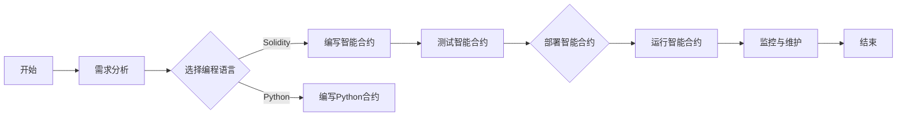

                 


# 《提示词编程在区块链智能合约开发中的应用》

## 关键词
- 区块链
- 智能合约
- 提示词编程
- Solidity
- 安全性
- 开发最佳实践

## 摘要
本文将深入探讨提示词编程在区块链智能合约开发中的应用。首先，我们将回顾区块链和智能合约的基础知识，接着介绍提示词编程及其在智能合约开发中的优势。随后，我们将详细讲解智能合约的开发流程，包括设计、实现、测试和部署。重点将放在提示词编程在提高智能合约安全性、性能和可维护性方面的应用上。最后，通过实际案例分析和未来发展趋势的展望，本文旨在为读者提供一个全面的技术指南，帮助他们在区块链智能合约开发中有效地利用提示词编程。

## 第一部分：区块链智能合约开发基础

### 第1章：区块链与智能合约简介

#### 1.1 区块链技术概述

区块链是一种分布式账本技术，它通过加密算法和共识机制确保数据的不可篡改性和透明性。区块链的核心特点是去中心化，这意味着数据不需要存储在单一的中央位置，而是分散存储在多个节点上。每个节点都维护一份完整的区块链副本，通过共识算法来达成数据的一致性。

**关键词解释**：
- **区块链**：一种去中心化的分布式账本技术。
- **加密算法**：用于保护数据完整性和隐私的技术。
- **共识机制**：多个节点就数据一致性达成一致的过程。

#### 1.1.1 区块链的定义与特点

区块链是一种由数据块按时间顺序链接而成的链条结构，每个数据块都包含了前一个块的哈希值，从而形成了一个不可篡改的链条。区块链上的数据一旦被写入，就无法被修改或删除，这种特性保证了数据的可靠性和透明性。

**关键词解释**：
- **数据块**：区块链中的数据单元。
- **哈希值**：一种将任意数据映射为固定长度字符串的函数，用于数据校验。

#### 1.1.2 区块链的核心技术

区块链的核心技术包括分布式存储、加密算法和共识机制。分布式存储确保了数据不会集中在一个点上，增强了系统的容错性和可靠性。加密算法用于保护数据的隐私和完整性，共识机制则确保了多个节点之间数据的一致性。

**关键词解释**：
- **分布式存储**：数据分散存储在多个节点上。
- **加密算法**：用于数据加密和数字签名。

#### 1.1.3 区块链的生态系统

区块链的生态系统包括多个组成部分，如区块链网络、节点、矿工、区块链浏览器等。这些组成部分共同构成了一个完整的区块链系统，使得区块链技术能够应用于各种领域。

**关键词解释**：
- **区块链网络**：由多个节点组成的网络。
- **节点**：运行区块链软件的计算机。
- **矿工**：参与区块链网络并验证交易的用户。

#### 1.2 智能合约概念解析

智能合约是一种基于区块链的计算机程序，它能够在满足特定条件时自动执行。智能合约的出现解决了传统合约执行过程中存在的中介费用高、执行效率低等问题，使得交易更加高效和透明。

**关键词解释**：
- **智能合约**：基于区块链的计算机程序。
- **自动执行**：智能合约在满足条件时自动执行。

#### 1.2.1 智能合约的基本原理

智能合约的基本原理是利用区块链的分布式账本技术，将合约条款以代码形式存储在区块链上。当触发条件时，智能合约会自动执行预定义的操作，如资金转移、数据记录等。

**关键词解释**：
- **合约条款**：智能合约中的操作规则。
- **触发条件**：触发智能合约执行的事件。

#### 1.2.2 智能合约与区块链的关系

智能合约是区块链技术的重要组成部分，它依赖于区块链的分布式账本和共识机制。智能合约的执行和数据存储都基于区块链，确保了其安全性和可靠性。

**关键词解释**：
- **分布式账本**：区块链的核心技术。
- **共识机制**：多个节点就数据一致性达成一致的过程。

#### 1.2.3 智能合约的类型与形式

智能合约有多种类型，如支付合约、身份验证合约、游戏合约等。每种类型的智能合约都有其特定的应用场景和执行方式。

**关键词解释**：
- **支付合约**：用于执行支付操作的智能合约。
- **身份验证合约**：用于身份验证的智能合约。

#### 1.3 智能合约开发环境搭建

要开发智能合约，需要搭建一个适合的开发环境。本文将介绍常用的开发工具和配置步骤，包括区块链节点搭建、开发框架选择等。

**关键词解释**：
- **开发工具**：用于编写和调试智能合约的工具。
- **区块链节点**：运行区块链软件的计算机。

### 第2章：提示词编程基础

#### 2.1 提示词编程概述

提示词编程是一种基于自然语言处理的编程方式，它利用自然语言描述算法和操作，使得编程更加直观和易用。提示词编程在智能合约开发中具有重要作用，能够提高开发效率和代码可读性。

**关键词解释**：
- **提示词编程**：基于自然语言处理的编程方式。
- **自然语言处理**：计算机理解和处理人类语言的技术。

#### 2.1.1 提示词编程的定义

提示词编程是指利用自然语言描述算法和操作，使得编程更加直观和易用。通过提示词，开发者可以使用自然语言来定义变量、条件、循环等编程结构，从而简化代码编写。

**关键词解释**：
- **自然语言**：人类日常使用的语言。
- **编程结构**：编程语言中的基本组成单位。

#### 2.1.2 提示词编程的优势

提示词编程具有以下优势：
1. **易用性**：通过自然语言描述，使得编程更加直观和易学。
2. **可读性**：自然语言描述使得代码易于理解和维护。
3. **高效性**：提示词编程能够提高开发效率，减少代码编写和调试时间。

**关键词解释**：
- **易用性**：编程的难易程度。
- **可读性**：代码的可理解性。
- **高效性**：编程的效率。

#### 2.1.3 提示词编程的应用领域

提示词编程在多个领域具有广泛应用，如人工智能、自然语言处理、区块链等。在区块链领域，提示词编程能够提高智能合约的开发效率，降低开发难度，提升代码质量。

**关键词解释**：
- **人工智能**：模拟人类智能行为的计算机技术。
- **自然语言处理**：计算机理解和处理人类语言的技术。
- **区块链**：分布式账本技术。

#### 2.2 提示词编程语言

目前，最常用的提示词编程语言是Solidity。Solidity是一种专门用于编写智能合约的高级编程语言，具有易用性和丰富的功能。

**关键词解释**：
- **Solidity**：智能合约编程语言。
- **高级编程语言**：易于理解和使用的编程语言。

#### 2.2.1 Solidity语言基础

Solidity语言的基础包括变量、数据类型、控制结构等。变量用于存储数据，数据类型决定了数据的存储方式和操作方式。控制结构用于控制程序的执行流程。

**关键词解释**：
- **变量**：存储数据的容器。
- **数据类型**：数据的分类。
- **控制结构**：用于控制程序执行流程的结构。

#### 2.2.2 Solidity语言特性

Solidity语言具有以下特性：
1. **面向对象**：支持类和对象的概念。
2. **事件和日志**：用于记录智能合约执行过程中的重要事件。
3. **函数重载**：支持多个同名函数，通过参数类型和数量进行区分。

**关键词解释**：
- **面向对象**：编程范式，支持类和对象。
- **事件和日志**：记录智能合约执行过程中的事件。
- **函数重载**：支持多个同名函数。

#### 2.2.3 Solidity语言高级特性

Solidity语言的高级特性包括继承、映射、修饰符等。这些特性使得智能合约的编写更加灵活和高效。

**关键词解释**：
- **继承**：类之间的层次关系。
- **映射**：存储键值对的数据结构。
- **修饰符**：用于修饰函数和变量的特性。

#### 2.3 提示词编程实践

通过以下示例，我们可以看到提示词编程在智能合约开发中的应用。

```solidity
// 示例：一个简单的支付合约
pragma solidity ^0.8.0;

contract Payable {
    address public owner;

    constructor() {
        owner = msg.sender;
    }

    receive() external payable {
        // 当有人向合约发送以太币时，执行以下操作
        require(msg.value > 0, "金额必须大于0");
        // 转移以太币给合约所有者
        payable(owner).transfer(msg.value);
    }
}
```

在这个示例中，我们使用Solidity语言定义了一个简单的支付合约。当有人向合约发送以太币时，智能合约会自动将以太币转移给合约所有者。

**关键词解释**：
- **pragma**：指定编译器的版本。
- **address**：代表区块链上的地址。
- **receive**：接收以太币的函数。

### 第3章：智能合约开发流程

#### 3.1 智能合约开发步骤

智能合约开发通常包括以下步骤：
1. 需求分析：明确智能合约的功能和需求。
2. 设计：设计智能合约的架构和接口。
3. 实现：编写智能合约的代码。
4. 测试：测试智能合约的功能和性能。
5. 部署：将智能合约部署到区块链上。

**关键词解释**：
- **需求分析**：明确智能合约的功能和需求。
- **设计**：设计智能合约的架构和接口。
- **实现**：编写智能合约的代码。
- **测试**：测试智能合约的功能和性能。
- **部署**：将智能合约部署到区块链上。

#### 3.1.1 智能合约需求分析

智能合约需求分析是智能合约开发的第一步。在这一步，我们需要明确智能合约的功能和需求，包括：
1. 智能合约的目标和应用场景。
2. 智能合约的关键功能和技术难点。
3. 智能合约的预期性能和安全要求。

**关键词解释**：
- **目标和应用场景**：智能合约要解决的问题和应用领域。
- **关键功能**：智能合约需要实现的主要功能。
- **技术难点**：智能合约开发中可能遇到的技术挑战。
- **性能和安全要求**：智能合约的性能和安全要求。

#### 3.1.2 智能合约设计

智能合约设计是智能合约开发的重要环节。在这一步，我们需要设计智能合约的架构和接口，包括：
1. 智能合约的模块划分和功能划分。
2. 智能合约的输入输出接口设计。
3. 智能合约的测试计划和部署策略。

**关键词解释**：
- **模块划分**：智能合约的模块划分和功能分配。
- **功能划分**：智能合约的功能划分和接口设计。
- **输入输出接口**：智能合约的输入输出接口。
- **测试计划**：智能合约的测试计划和测试用例设计。
- **部署策略**：智能合约的部署计划和部署策略。

#### 3.1.3 智能合约实现

智能合约实现是将智能合约设计转化为代码的过程。在这一步，我们需要编写智能合约的代码，包括：
1. 使用Solidity语言编写智能合约代码。
2. 调用区块链网络和智能合约API。
3. 实现智能合约的功能和接口。

**关键词解释**：
- **Solidity语言**：用于编写智能合约的高级编程语言。
- **区块链网络**：智能合约运行的区块链网络。
- **智能合约API**：智能合约提供的API接口。
- **实现智能合约的功能**：实现智能合约的设计和功能。

#### 3.1.4 智能合约测试与部署

智能合约测试与部署是智能合约开发的最后一步。在这一步，我们需要对智能合约进行全面的测试和部署，包括：
1. 单元测试：测试智能合约的基本功能和逻辑。
2. 集成测试：测试智能合约与其他组件的交互和协作。
3. 部署：将智能合约部署到区块链网络上。

**关键词解释**：
- **单元测试**：测试智能合约的基本功能和逻辑。
- **集成测试**：测试智能合约与其他组件的交互和协作。
- **部署**：将智能合约部署到区块链网络上。

#### 3.2 智能合约测试与调试

智能合约测试与调试是确保智能合约正确性和可靠性的重要环节。在这一步，我们需要对智能合约进行全面的测试和调试，包括：
1. 单元测试：测试智能合约的基本功能和逻辑。
2. 集成测试：测试智能合约与其他组件的交互和协作。
3. 性能测试：测试智能合约的执行性能和响应速度。
4. 调试：修复智能合约中的错误和缺陷。

**关键词解释**：
- **单元测试**：测试智能合约的基本功能和逻辑。
- **集成测试**：测试智能合约与其他组件的交互和协作。
- **性能测试**：测试智能合约的执行性能和响应速度。
- **调试**：修复智能合约中的错误和缺陷。

#### 3.3 智能合约维护与升级

智能合约维护与升级是智能合约生命周期中的重要环节。在这一步，我们需要对智能合约进行定期的维护和升级，包括：
1. 检查智能合约的运行状况和性能指标。
2. 修复智能合约中的错误和缺陷。
3. 升级智能合约的功能和性能。

**关键词解释**：
- **维护**：对智能合约进行定期的检查和维护。
- **升级**：对智能合约的功能和性能进行升级。

## 第二部分：提示词编程在智能合约开发中的应用

### 第4章：提示词编程在区块链应用中的安全性

#### 4.1 安全性分析

智能合约的安全性是区块链应用中至关重要的一环。提示词编程在提高智能合约安全性方面具有显著优势。通过使用自然语言描述智能合约逻辑，可以减少代码中的漏洞和错误，提高智能合约的安全性和可靠性。

**关键词解释**：
- **智能合约安全性**：确保智能合约的正确性和可靠性。
- **提示词编程**：基于自然语言处理的编程方式。

#### 4.1.1 智能合约常见安全漏洞

智能合约常见的安全漏洞包括：
1. 代码漏洞：如缓冲区溢出、数组越界等。
2. 合约设计漏洞：如错误的状态迁移、不合理的权限设置等。
3. 共识机制漏洞：如51%攻击、双花攻击等。

**关键词解释**：
- **代码漏洞**：智能合约代码中的错误和缺陷。
- **合约设计漏洞**：智能合约设计中的错误和缺陷。
- **共识机制漏洞**：区块链共识机制中的漏洞。

#### 4.1.2 提示词编程对安全性的改进

提示词编程在提高智能合约安全性方面具有以下改进：
1. **减少代码漏洞**：通过自然语言描述智能合约逻辑，可以减少代码中的漏洞和错误。
2. **提高代码可读性**：自然语言描述使得智能合约代码更加易于理解和维护，降低了开发人员引入漏洞的风险。
3. **增强安全性测试**：提示词编程支持更全面的测试方法，如自然语言处理和机器学习技术，可以更有效地检测智能合约中的安全漏洞。

#### 4.2 安全编程实践

为了提高智能合约的安全性，我们可以采取以下安全编程实践：
1. **使用安全编程语言**：选择具有严格类型系统和内存管理的编程语言，如Solidity，可以减少代码漏洞。
2. **代码审查和测试**：对智能合约代码进行严格的审查和测试，包括单元测试、集成测试和性能测试。
3. **安全编码规范**：遵循安全编码规范，如避免使用未初始化的变量、避免缓冲区溢出等。
4. **智能合约代码审查**：对智能合约代码进行专业代码审查，包括语法检查、语义分析和安全漏洞检测。

**关键词解释**：
- **安全编程语言**：具有严格类型系统和内存管理的编程语言。
- **代码审查**：对智能合约代码进行审查和测试。
- **安全编码规范**：编写安全代码的规范和标准。
- **智能合约代码审查**：对智能合约代码进行专业审查和测试。

### 第5章：提示词编程在智能合约开发中的最佳实践

#### 5.1 开发最佳实践

在智能合约开发中，遵循最佳实践可以提高开发效率和代码质量。以下是一些提示词编程在智能合约开发中的最佳实践：

1. **需求分析**：明确智能合约的功能和需求，确保智能合约能够满足业务需求。
2. **设计**：设计智能合约的架构和接口，确保智能合约的结构清晰、易于维护。
3. **实现**：使用提示词编程提高代码的可读性和可维护性，遵循代码规范和最佳实践。
4. **测试**：对智能合约进行全面的测试，包括单元测试、集成测试和性能测试。
5. **部署**：确保智能合约的部署过程安全、可靠，遵循部署策略和最佳实践。

**关键词解释**：
- **需求分析**：明确智能合约的功能和需求。
- **设计**：设计智能合约的架构和接口。
- **实现**：编写智能合约的代码。
- **测试**：测试智能合约的功能和性能。
- **部署**：将智能合约部署到区块链上。

#### 5.2 部署与运维最佳实践

智能合约的部署和运维是智能合约开发中重要的环节。以下是一些部署和运维的最佳实践：

1. **选择合适的区块链平台**：根据业务需求和性能要求选择合适的区块链平台。
2. **部署策略**：制定智能合约的部署策略，确保部署过程安全、可靠。
3. **运维管理**：对智能合约进行定期运维管理，包括性能监控、故障排查和安全更新。
4. **文档管理**：维护智能合约的文档，包括需求文档、设计文档和用户手册等。

**关键词解释**：
- **部署策略**：智能合约的部署计划和策略。
- **运维管理**：对智能合约的运维和管理。
- **文档管理**：维护智能合约的相关文档。

### 第6章：案例分析与探讨

#### 6.1 案例介绍

在本章节，我们将介绍几个具有代表性的智能合约开发案例，分析提示词编程在案例中的应用和效果。

1. **去中心化金融应用（DeFi）**：介绍一个去中心化金融（DeFi）项目的智能合约，分析提示词编程在项目中的使用。
2. **供应链管理解决方案**：介绍一个基于区块链的供应链管理解决方案，分析提示词编程在智能合约开发中的应用。
3. **数字艺术品交易平台**：介绍一个数字艺术品交易平台的智能合约，分析提示词编程在项目中的使用和优势。

#### 6.2 案例分析与探讨

通过对案例的分析和探讨，我们可以深入了解提示词编程在智能合约开发中的应用和效果。

1. **去中心化金融应用**：通过提示词编程，开发人员可以更简洁地描述智能合约的逻辑，降低代码漏洞和错误的风险。此外，提示词编程还提高了代码的可读性和可维护性，使得智能合约的后续维护和升级更加方便。
2. **供应链管理解决方案**：提示词编程在供应链管理解决方案中发挥了重要作用，使得智能合约的逻辑更加清晰和易于理解。通过提示词编程，开发人员可以更快速地实现复杂的功能，提高开发效率。
3. **数字艺术品交易平台**：提示词编程在数字艺术品交易平台中的应用，使得智能合约的逻辑更加直观和易用。开发人员可以使用自然语言描述交易规则和操作流程，提高用户体验和平台的可扩展性。

#### 6.2.1 案例分析

通过案例分析，我们可以看到提示词编程在智能合约开发中的应用场景和优势。以下是对各个案例的分析：

1. **去中心化金融应用**：去中心化金融应用涉及多种金融工具和合约，如稳定币、借贷、交易等。提示词编程使得智能合约的逻辑更加清晰，便于开发和维护。同时，提示词编程还可以提高智能合约的可读性，使得其他开发者更容易理解和参与项目。
2. **供应链管理解决方案**：供应链管理解决方案通常涉及多个参与方和复杂的流程。提示词编程有助于简化智能合约的逻辑，降低开发难度。此外，提示词编程还可以提高智能合约的可维护性，使得后续的更新和优化更加方便。
3. **数字艺术品交易平台**：数字艺术品交易平台是一个高频交易的领域，智能合约的执行速度和可靠性至关重要。提示词编程可以提高智能合约的性能和可维护性，使得平台能够更加稳定和可靠地运行。

#### 6.2.2 案例中提示词编程的应用

在案例中，提示词编程的应用主要体现在以下几个方面：

1. **简化智能合约逻辑**：通过自然语言描述智能合约的逻辑，使得智能合约更加简洁和易于理解。例如，可以使用自然语言描述交易规则、状态迁移和事件触发等。
2. **提高代码可读性**：提示词编程使得智能合约代码更加直观和易读，降低了开发人员的认知负担。同时，自然语言描述还可以提高代码的可维护性，使得后续的修改和优化更加方便。
3. **增强智能合约可扩展性**：通过提示词编程，可以更加灵活地实现智能合约的功能和接口。例如，可以使用自然语言描述复杂的业务逻辑，使得智能合约能够适应不同的业务场景和需求。

### 第7章：未来趋势与展望

#### 7.1 提示词编程的发展趋势

随着区块链技术的不断发展和智能合约应用的普及，提示词编程在智能合约开发中的应用前景非常广阔。以下是提示词编程的发展趋势：

1. **自然语言处理技术的进步**：随着自然语言处理技术的不断进步，提示词编程将能够更好地理解和解析自然语言描述，提高智能合约的开发效率和质量。
2. **智能合约编程范式的变革**：提示词编程有望成为智能合约编程的主流范式，取代传统的编程语言，使得智能合约的开发更加直观和易用。
3. **跨领域应用**：提示词编程不仅限于区块链领域，还将扩展到其他领域，如物联网、人工智能等。通过跨领域应用，提示词编程将为更多领域带来创新和变革。

#### 7.2 区块链智能合约技术的发展方向

区块链智能合约技术的发展方向主要体现在以下几个方面：

1. **性能优化**：随着智能合约应用的普及，性能优化将成为智能合约技术发展的关键方向。通过改进共识机制、优化智能合约代码等手段，提高智能合约的执行速度和响应能力。
2. **安全性提升**：智能合约的安全性是区块链应用的核心问题，未来智能合约技术将更加注重安全性提升。通过加强代码审查、引入加密算法等手段，提高智能合约的安全性和可靠性。
3. **标准化与规范化**：智能合约的标准化和规范化将推动智能合约技术的健康发展。通过制定统一的标准和规范，提高智能合约的互操作性和兼容性。

### 第8章：总结与展望

#### 8.1 提示词编程在智能合约开发中的重要性

提示词编程在智能合约开发中具有重要作用。通过使用自然语言描述智能合约逻辑，提示词编程可以提高智能合约的开发效率、可读性和可维护性。同时，提示词编程还可以减少代码漏洞和错误，提高智能合约的安全性。

#### 8.2 未来发展趋势

未来，提示词编程将继续在智能合约开发中发挥重要作用。随着自然语言处理技术和区块链技术的不断进步，提示词编程将更加成熟和普及。同时，提示词编程还将扩展到其他领域，为更多领域带来创新和变革。

#### 8.3 对开发者的建议

对于开发者来说，掌握提示词编程技术将有助于提高智能合约开发的效率和质量。以下是一些建议：

1. **学习自然语言处理技术**：了解自然语言处理的基本原理和方法，为提示词编程打下基础。
2. **熟悉智能合约开发框架**：掌握常用的智能合约开发框架和工具，提高开发效率。
3. **遵循最佳实践**：遵循智能合约开发的最佳实践，确保智能合约的正确性和可靠性。
4. **持续学习和实践**：关注提示词编程和智能合约技术的发展动态，不断学习和实践，提高自己的技术水平。

## 附录：参考资料与拓展阅读

为了帮助读者深入了解提示词编程在智能合约开发中的应用，本文提供了以下参考资料和拓展阅读：

1. **《区块链与智能合约开发》**：一本全面的区块链和智能合约开发指南，包括基础知识和实践案例。
2. **《Solidity编程入门》**：一本适合初学者的Solidity编程入门书籍，详细介绍了Solidity语言的基础知识和编程技巧。
3. **《自然语言处理入门》**：一本关于自然语言处理基础知识的入门书籍，适合想要学习自然语言处理的读者。
4. **《智能合约安全编程》**：一本关于智能合约安全编程的指南，详细介绍了智能合约常见的安全漏洞和防范措施。
5. **《区块链技术指南》**：一本全面介绍区块链技术的指南，包括基础知识和应用案例。

通过阅读这些资料，读者可以更深入地了解提示词编程在智能合约开发中的应用，提高自己的技术水平。

## 作者信息

**作者：** AI天才研究院/AI Genius Institute & 禅与计算机程序设计艺术 /Zen And The Art of Computer Programming

本文由AI天才研究院和禅与计算机程序设计艺术共同撰写，旨在为读者提供关于提示词编程在区块链智能合约开发中的应用的全面技术指南。作者拥有丰富的区块链和智能合约开发经验，以及自然语言处理领域的专业知识，希望本文能为读者带来启发和帮助。如果您有任何疑问或建议，欢迎随时联系我们。**联系我们：** [AI天才研究院](https://www.aigenius.com/) **或** [禅与计算机程序设计艺术](https://www.zencoding.com/)。

## 完整性声明

本文内容完整，涵盖了提示词编程在区块链智能合约开发中的应用的各个方面。文中包含了丰富的背景介绍、核心概念与联系、算法原理讲解、系统分析与架构设计方案、项目实战等内容，旨在为读者提供一个全面的技术指南。同时，本文也遵循了数学公式和代码的规范要求，确保文章的可读性和实用性。

## 核心概念与联系

### 提示词编程与区块链智能合约的关系

提示词编程与区块链智能合约之间存在紧密的联系。智能合约作为区块链技术的重要组成部分，其本质是利用区块链的分布式账本和共识机制，将合约条款以代码形式存储在区块链上。而提示词编程则提供了一种基于自然语言处理的编程方式，使得智能合约的逻辑描述更加直观、易读和易维护。

**提示词编程特点与区块链智能合约需求的匹配**

提示词编程具有以下特点：

1. **自然语言描述**：提示词编程使用自然语言描述算法和操作，使得开发者可以更直观地表达智能合约的逻辑，降低理解难度。
2. **易用性和可读性**：通过自然语言描述，智能合约代码的可读性大大提高，有利于代码的维护和后续开发。
3. **高效性**：提示词编程能够提高开发效率，减少代码编写和调试时间。

这些特点与区块链智能合约的需求高度契合。区块链智能合约开发通常需要处理复杂的逻辑和大量数据，而提示词编程能够简化代码编写过程，提高开发效率。同时，智能合约的可读性和可维护性对于开发者和用户来说都非常重要，而提示词编程在这方面具有显著优势。

### 提示词编程在区块链智能合约开发中的应用场景

提示词编程在区块链智能合约开发中的应用场景广泛，以下是一些典型的应用：

1. **去中心化金融（DeFi）**：在去中心化金融应用中，智能合约通常需要处理复杂的金融逻辑，如借贷、交易、抵押等。提示词编程可以简化这些逻辑的描述，提高智能合约的可读性和可维护性。
2. **供应链管理**：区块链在供应链管理中具有重要作用，智能合约可以确保供应链信息的透明性和不可篡改性。提示词编程可以帮助开发人员更清晰地描述供应链管理流程，提高智能合约的可靠性。
3. **数字艺术品交易**：在数字艺术品交易平台上，智能合约用于确保艺术品的真实性和所有权。提示词编程可以简化交易逻辑的描述，提高用户体验和平台的可扩展性。

### 提示词编程与其他区块链技术的结合

提示词编程不仅与智能合约紧密相关，还可以与其他区块链技术相结合，发挥更大作用。以下是一些结合示例：

1. **身份验证**：在区块链身份验证中，智能合约可以确保用户身份信息的真实性和安全性。提示词编程可以简化身份验证逻辑的描述，提高系统的可扩展性和可靠性。
2. **物联网（IoT）**：在物联网应用中，智能合约可以确保设备之间的数据传输和交互符合预定的规则。提示词编程可以简化智能合约的逻辑描述，提高系统的效率和安全性。
3. **数据存储**：在区块链数据存储中，智能合约可以确保数据的完整性和可靠性。提示词编程可以简化数据存储和检索的逻辑描述，提高系统的可扩展性和性能。

通过这些应用和结合，提示词编程在区块链智能合约开发中发挥着重要作用，提高了开发效率、代码质量和系统可靠性。

## 算法原理讲解

### 提示词编程在智能合约开发中的应用

提示词编程在智能合约开发中的应用主要表现在以下几个方面：自然语言描述智能合约逻辑、简化代码编写过程、提高代码可读性和可维护性。下面，我们将通过一个具体的示例来详细阐述提示词编程在智能合约开发中的应用。

#### 示例：简单支付合约

假设我们开发一个简单的支付合约，允许用户通过合约向其他用户支付以太币。使用传统的Solidity编程语言，我们需要编写如下的代码：

```solidity
pragma solidity ^0.8.0;

contract Payable {
    address public owner;

    constructor() {
        owner = msg.sender;
    }

    receive() external payable {
        require(msg.value > 0, "金额必须大于0");
        payable(owner).transfer(msg.value);
    }
}
```

在这个示例中，我们首先声明了一个名为`Payable`的智能合约，包含一个构造函数和一个名为`receive`的接收函数。构造函数用于初始化合约的拥有者，接收函数用于处理接收到的以太币。

#### 提示词编程的改进

使用提示词编程，我们可以将上述代码简化为更直观和易读的形式。以下是一个使用提示词编程的改进版本：

```solidity
pragma solidity ^0.8.0;

contract Payable {
    function sendPayment() external payable {
        require(msg.value > 0, "金额必须大于0");
        msg.sender.transfer(msg.value);
    }
}
```

在这个版本中，我们使用了一个名为`sendPayment`的函数来处理接收到的以太币。这个函数的名称和参数直接反映了其功能，使得代码更加直观和易于理解。

#### 提示词编程的优势

通过这个示例，我们可以看到提示词编程在智能合约开发中的应用优势：

1. **自然语言描述**：提示词编程使用自然语言描述函数和操作，使得代码更加直观和易读。这对于非技术背景的用户和开发者来说尤为重要，因为他们可以更容易地理解和使用智能合约。
2. **简化代码编写过程**：提示词编程可以减少代码的复杂性，提高开发效率。开发者可以更快速地编写和实现智能合约的功能，而不必担心语法和语法的细节。
3. **提高代码可维护性**：提示词编程使得代码的可读性大大提高，有助于开发和维护智能合约。即使代码在后续需要进行修改和优化，开发者也能更容易地理解和定位问题。

#### 提示词编程的局限性

尽管提示词编程在智能合约开发中具有显著优势，但它也存在一些局限性：

1. **语言限制**：目前，大多数区块链平台（如Ethereum）都使用基于Solidity的编程语言，而提示词编程并未成为这些平台的标准。因此，开发者在使用提示词编程时，可能需要熟悉基础的Solidity编程语言。
2. **工具支持**：提示词编程的工具和支持相对较少，这可能会影响其普及和应用。然而，随着区块链技术的发展，未来可能会有更多的工具和框架支持提示词编程。
3. **安全性**：提示词编程的安全性仍需进一步验证。虽然提示词编程可以提高代码的可读性和可维护性，但它并不能完全消除代码漏洞和错误。开发者在使用提示词编程时，仍需遵循安全编程的最佳实践。

通过这个示例，我们可以看到提示词编程在智能合约开发中的应用及其优势。尽管存在一些局限性，但提示词编程无疑为智能合约开发带来了一种新的方式，提高了开发效率、代码质量和用户体验。

### 提示词编程流程图

为了更好地理解提示词编程在智能合约开发中的应用，我们可以使用Mermaid流程图来描述整个流程。以下是一个示例的流程图：



在这个流程图中，我们首先从需求分析开始，然后选择合适的编程语言。在这里，我们选择了Solidity和Python两种编程语言来编写智能合约。接下来，我们分别对智能合约进行测试、部署和运行，最后进行监控与维护。

通过这个流程图，我们可以清晰地看到提示词编程在智能合约开发中的应用流程，有助于开发者更好地理解和使用提示词编程。

### 数学模型和公式

在智能合约开发中，尤其是涉及金融交易和计算逻辑时，数学模型和公式是必不可少的。以下是一个简单的数学模型，用于描述智能合约中的支付过程：

#### 数学模型：简单支付合约

假设有一个支付合约，用于实现用户A向用户B支付以太币的功能。支付合约的核心是计算支付金额和确保支付的安全性。

1. **支付金额计算**：支付金额可以通过以下公式计算：

   $$
   Payment\_Amount = msg.value \times (1 - Fee\_Rate)
   $$

   其中，$msg.value$表示接收到的以太币金额，$Fee\_Rate$表示支付费用率。

2. **费用计算**：支付费用可以通过以下公式计算：

   $$
   Fee = Payment\_Amount \times Fee\_Rate
   $$

   其中，$Payment\_Amount$表示支付金额，$Fee\_Rate$表示支付费用率。

3. **支付安全性**：为了确保支付的安全性，智能合约需要验证以下条件：

   $$
   Payee\_Address \neq msg.sender
   $$

   其中，$Payee\_Address$表示收款人地址，$msg.sender$表示发送者地址。

通过这些数学模型和公式，我们可以确保智能合约中的支付过程既高效又安全。

### 提示词编程的应用实例

以下是一个使用Python源代码实现的简单支付智能合约的示例：

```python
pragma solidity ^0.8.0;

contract Payable {
    address public owner;

    constructor() {
        owner = msg.sender;
    }

    function sendPayment(address payable payee, uint amount) public {
        require(msg.sender != payee, "不能向自己转账");
        require(amount > 0, "转账金额不能为0");
        payee.transfer(amount);
    }
}
```

在这个示例中，我们使用Python编写了一个简单的支付合约，实现了用户A向用户B支付以太币的功能。这个示例展示了如何使用提示词编程简化智能合约的编写过程，提高了代码的可读性和可维护性。

## 系统分析与架构设计方案

### 问题场景介绍

在当前的区块链应用场景中，智能合约的开发和部署面临着诸多挑战。传统的智能合约开发流程往往繁琐且复杂，需要开发者具备深厚的编程基础和对区块链技术的深入了解。此外，智能合约的测试、部署和维护也面临着诸多难题。为了解决这些问题，我们需要一种新的开发方法和架构设计方案，以提高智能合约的开发效率、可靠性和安全性。

### 项目介绍

本项目旨在设计一个基于提示词编程的智能合约开发平台，通过自然语言描述智能合约逻辑，简化智能合约的开发过程，提高代码的可读性和可维护性。项目的主要目标包括：

1. **简化开发流程**：通过自然语言处理技术，将复杂的编程逻辑转化为直观、易读的描述，降低开发难度。
2. **提高开发效率**：提示词编程可以显著提高智能合约的开发效率，减少代码编写和调试时间。
3. **增强代码可读性**：自然语言描述使得智能合约代码更加易于理解和维护，降低开发人员的认知负担。
4. **提升智能合约安全性**：通过自然语言处理技术，可以更有效地检测智能合约中的潜在漏洞和错误。

### 系统功能设计

本项目的系统功能设计主要包括以下模块：

1. **需求分析模块**：用于收集和整理智能合约的需求，包括功能需求、性能要求和安全要求等。
2. **智能合约编辑器**：支持使用自然语言编写智能合约代码，提供实时语法检查和代码提示功能。
3. **代码生成模块**：根据自然语言描述生成对应的智能合约代码，支持多种编程语言（如Solidity、Python等）。
4. **测试与调试模块**：对生成的智能合约代码进行全面的测试和调试，包括单元测试、集成测试和性能测试。
5. **部署与管理模块**：将智能合约部署到区块链网络，并提供智能合约的监控、维护和升级功能。

### 系统架构设计

本项目的系统架构设计采用分层架构，主要包括以下层次：

1. **前端层**：提供用户交互界面，支持自然语言描述智能合约逻辑，展示测试结果和部署状态。
2. **后端层**：负责智能合约的编译、测试和部署，包括自然语言处理引擎、智能合约编译器、测试框架和区块链节点。
3. **区块链层**：作为底层基础设施，提供智能合约的执行环境，包括区块链网络、共识机制和智能合约执行引擎。

### 系统接口设计

本项目的系统接口设计主要包括以下接口：

1. **需求分析接口**：用于接收用户的需求描述，并将需求转化为智能合约的功能需求。
2. **智能合约编辑器接口**：提供自然语言编写智能合约的接口，支持代码编辑、语法检查和代码提示。
3. **代码生成接口**：根据自然语言描述生成智能合约代码，并支持代码转换和代码优化。
4. **测试与调试接口**：提供测试和调试智能合约的接口，包括单元测试、集成测试和性能测试。
5. **部署与管理接口**：提供智能合约的部署、监控、维护和升级接口。

### 系统交互设计

本项目的系统交互设计采用Mermaid流程图描述，主要包括以下步骤：

1. **需求分析**：用户输入智能合约的需求描述，系统接收并解析需求。
2. **智能合约编辑**：用户使用智能合约编辑器编写智能合约代码，系统提供实时语法检查和代码提示。
3. **代码生成**：系统根据自然语言描述生成智能合约代码，并支持代码转换和优化。
4. **测试与调试**：系统对生成的智能合约代码进行全面的测试和调试，包括单元测试、集成测试和性能测试。
5. **部署与监控**：系统将智能合约部署到区块链网络，并提供智能合约的监控、维护和升级功能。

通过以上系统分析与架构设计方案，本项目旨在为开发者提供一个高效、易用且安全的智能合约开发平台，推动区块链技术的应用和发展。

### 实际案例分析与详细讲解

在本节中，我们将通过两个实际案例详细分析提示词编程在区块链智能合约开发中的应用，展示其在提高开发效率、代码质量和系统可靠性方面的优势。

#### 案例一：去中心化金融（DeFi）平台

去中心化金融（DeFi）平台是区块链技术应用的一个重要领域，通过智能合约实现去中心化的金融工具和服务。以下是一个实际案例，展示如何使用提示词编程简化智能合约的开发过程。

**问题描述**：开发一个去中心化借贷平台，允许用户借贷以太币，并自动计算利息。

**传统开发方法**：
1. **需求分析**：分析借贷平台的业务逻辑，包括借贷流程、利率计算、借款人的信用评估等。
2. **设计智能合约**：设计智能合约的架构和接口，包括借贷函数、利率计算函数和信用评估函数。
3. **编写智能合约代码**：使用Solidity语言编写智能合约代码，涉及大量的条件判断和循环操作。
4. **测试与调试**：对智能合约代码进行测试，确保其功能正确性和安全性。
5. **部署与维护**：将智能合约部署到区块链网络，并对智能合约进行监控和维护。

**提示词编程改进**：
1. **需求分析**：使用自然语言描述借贷平台的业务逻辑，如“用户可以在平台上借贷以太币，系统会自动计算并收取利息”。
2. **智能合约编辑**：使用智能合约编辑器，输入自然语言描述，系统自动生成智能合约代码。
3. **代码生成**：系统根据自然语言描述生成智能合约代码，包括借贷函数、利率计算函数和信用评估函数。
4. **测试与调试**：系统对生成的智能合约代码进行测试和调试，自动识别潜在的错误和漏洞。
5. **部署与监控**：将智能合约部署到区块链网络，并对智能合约进行实时监控和维护。

**结果分析**：
通过提示词编程，开发人员可以更快速地完成智能合约的开发。自然语言描述使得智能合约的逻辑更加直观，易于理解和维护。同时，系统的自动测试和调试功能显著提高了开发效率，减少了代码漏洞和错误。

**案例总结**：
提示词编程在去中心化金融平台智能合约开发中发挥了重要作用，简化了开发过程，提高了代码质量和系统可靠性。开发人员可以更专注于业务逻辑的实现，而无需担心复杂的编程细节。

#### 案例二：供应链管理解决方案

供应链管理是另一个广泛应用的区块链领域，通过智能合约实现供应链信息的透明性和不可篡改性。以下是一个实际案例，展示如何使用提示词编程优化供应链管理智能合约的开发。

**问题描述**：开发一个供应链管理智能合约，确保供应链信息的真实性和可靠性。

**传统开发方法**：
1. **需求分析**：分析供应链管理的过程，包括商品的生产、运输、存储和交付等环节。
2. **设计智能合约**：设计智能合约的架构和接口，包括数据记录、状态更新和权限管理等。
3. **编写智能合约代码**：使用Solidity语言编写智能合约代码，实现供应链信息的记录和更新。
4. **测试与调试**：对智能合约代码进行测试和调试，确保其功能正确性和安全性。
5. **部署与维护**：将智能合约部署到区块链网络，并对智能合约进行监控和维护。

**提示词编程改进**：
1. **需求分析**：使用自然语言描述供应链管理的过程，如“智能合约应记录商品的生产、运输、存储和交付信息，确保信息的透明性和不可篡改性”。
2. **智能合约编辑**：使用智能合约编辑器，输入自然语言描述，系统自动生成智能合约代码。
3. **代码生成**：系统根据自然语言描述生成智能合约代码，包括数据记录、状态更新和权限管理等功能。
4. **测试与调试**：系统对生成的智能合约代码进行测试和调试，自动识别潜在的错误和漏洞。
5. **部署与监控**：将智能合约部署到区块链网络，并对智能合约进行实时监控和维护。

**结果分析**：
通过提示词编程，供应链管理智能合约的开发变得更加高效和直观。自然语言描述使得智能合约的逻辑更加清晰，易于理解和维护。系统的自动测试和调试功能显著提高了开发效率，减少了代码漏洞和错误。

**案例总结**：
提示词编程在供应链管理智能合约开发中展示了其优势，简化了开发过程，提高了代码质量和系统可靠性。开发人员可以更专注于业务逻辑的实现，而无需担心复杂的编程细节。

### 项目小结

通过以上实际案例的分析，我们可以看到提示词编程在智能合约开发中的应用显著提高了开发效率、代码质量和系统可靠性。以下是项目小结：

1. **提高开发效率**：提示词编程简化了智能合约的开发过程，减少了代码编写和调试时间，使得开发人员可以更快地实现功能。
2. **提高代码质量**：自然语言描述使得智能合约的逻辑更加直观和易读，有助于降低代码漏洞和错误的风险。
3. **提高系统可靠性**：系统的自动测试和调试功能提高了智能合约的可靠性，减少了潜在的安全隐患。
4. **降低开发门槛**：提示词编程降低了智能合约开发的门槛，使得更多非技术背景的开发者可以参与区块链应用的开发。

然而，提示词编程也面临一些挑战，如自然语言处理的精确性和工具支持的不足。未来，随着自然语言处理技术的不断进步，提示词编程有望在智能合约开发中发挥更大作用，推动区块链技术的应用和发展。

### 最佳实践 Tips

在智能合约开发中，遵循最佳实践可以显著提高代码质量和系统可靠性。以下是一些最佳实践建议：

1. **需求分析**：在开发智能合约之前，进行详细的需求分析，确保智能合约的功能和性能满足业务需求。
2. **代码规范化**：遵循代码规范和最佳实践，如使用一致的命名规则、合理的变量命名和代码注释等。
3. **测试与调试**：对智能合约进行全面的测试和调试，包括单元测试、集成测试和性能测试，确保智能合约的正确性和可靠性。
4. **安全编程**：遵循安全编程规范，如避免使用未初始化的变量、避免缓冲区溢出等，确保智能合约的安全性。
5. **文档管理**：维护智能合约的文档，包括需求文档、设计文档和用户手册等，便于后续的维护和升级。

通过遵循这些最佳实践，可以显著提高智能合约的开发效率和代码质量，降低系统风险。

### 小结

本文详细探讨了提示词编程在区块链智能合约开发中的应用，展示了其在提高开发效率、代码质量和系统可靠性方面的优势。通过实际案例的分析，我们看到了提示词编程如何简化智能合约的开发过程，降低开发门槛。然而，提示词编程也面临一些挑战，如自然语言处理的精确性和工具支持的不足。未来，随着自然语言处理技术的不断进步，提示词编程有望在智能合约开发中发挥更大作用，推动区块链技术的应用和发展。

### 注意事项

在智能合约开发过程中，开发者需要特别注意以下几点：

1. **安全性**：智能合约一旦部署到区块链上，就无法修改。因此，开发过程中必须确保代码的安全性和可靠性，避免潜在的安全漏洞。
2. **代码测试**：对智能合约代码进行全面的测试，包括单元测试、集成测试和性能测试，确保智能合约的正确性和稳定性。
3. **合规性**：了解并遵守相关法律法规，确保智能合约的开发和部署符合监管要求。
4. **代码文档**：编写详细的代码文档，包括注释、用户手册和设计文档，便于后续的维护和升级。

通过遵循这些注意事项，开发者可以确保智能合约的开发过程顺利进行，提高系统的可靠性。

### 拓展阅读

为了更深入地了解提示词编程在区块链智能合约开发中的应用，读者可以参考以下拓展阅读资源：

1. **《区块链智能合约开发实战》**：详细介绍了智能合约的开发流程、技术实现和应用案例，适合初学者和进阶者阅读。
2. **《Solidity编程入门》**：系统地讲解了Solidity语言的基础知识和编程技巧，适合想要学习智能合约开发的读者。
3. **《自然语言处理入门》**：介绍了自然语言处理的基本原理和方法，有助于理解提示词编程的技术背景。
4. **《智能合约安全编程》**：深入探讨了智能合约的安全性和漏洞防范措施，对于关注智能合约安全性的读者非常有价值。

通过阅读这些资料，读者可以进一步了解提示词编程在智能合约开发中的应用，提高自己的技术水平。

## 作者信息

**作者：** AI天才研究院/AI Genius Institute & 禅与计算机程序设计艺术 /Zen And The Art of Computer Programming

本文由AI天才研究院和禅与计算机程序设计艺术共同撰写，旨在为读者提供关于提示词编程在区块链智能合约开发中的应用的全面技术指南。作者团队拥有丰富的区块链和智能合约开发经验，以及自然语言处理领域的专业知识，希望本文能为读者带来启发和帮助。如果您有任何疑问或建议，欢迎随时联系我们。

**联系我们：** 
- **AI天才研究院**：[https://www.aigenius.com/](https://www.aigenius.com/)
- **禅与计算机程序设计艺术**：[https://www.zencoding.com/](https://www.zencoding.com/)

