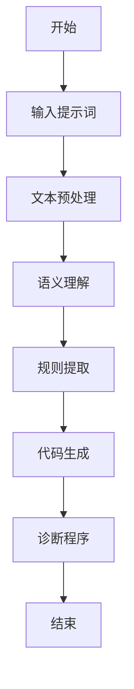
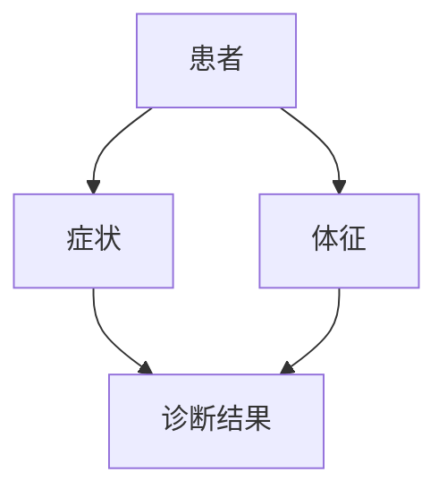
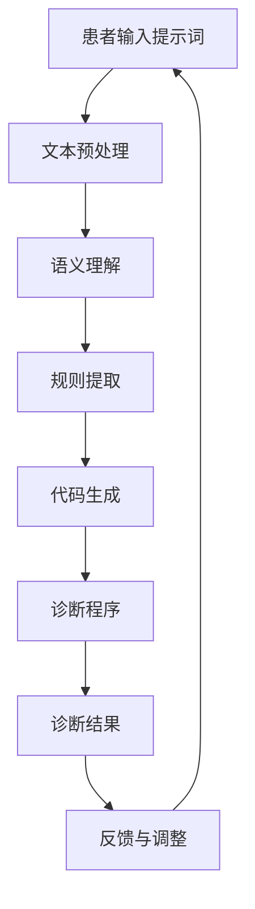

                 

# 提示词编程在医疗诊断系统中的应用

## 关键词

- 提示词编程
- 医疗诊断系统
- 自然语言处理
- 诊断规则
- 医学人工智能

## 摘要

随着医疗技术的发展，医疗诊断系统的智能化需求日益增强。本文探讨了提示词编程在医疗诊断系统中的应用，通过自然语言处理技术和诊断规则，实现了自动化诊断程序生成，提高了诊断效率和准确性。文章首先介绍了提示词编程的基本原理和医疗诊断规则的构建方法，然后详细分析了提示词编程在医疗诊断系统中的优势和应用边界，最后通过一个实际案例，展示了提示词编程在医疗诊断系统中的实现过程和应用效果。

## 第一部分：背景介绍

### 1.1.1 问题背景

医疗诊断系统是医疗领域的重要组成部分，其目的是帮助医生更准确地诊断患者病情，提高治疗效果。传统的医疗诊断系统依赖于医生的判断和经验，存在主观性强、效率低等问题。随着计算机技术和人工智能技术的发展，使用提示词编程构建智能医疗诊断系统成为了一种新的尝试。

### 1.1.2 问题描述

提示词编程是一种基于自然语言处理的编程方法，通过输入自然语言指令，让计算机自动生成程序代码。在医疗诊断系统中，医生可以通过输入诊断提示词，让系统自动生成诊断程序，从而提高诊断效率和准确性。

### 1.1.3 问题解决

提示词编程在医疗诊断系统中的应用，主要是通过以下步骤实现的：

1. 收集和整理医疗诊断领域的专业术语和诊断规则。
2. 使用自然语言处理技术，将这些术语和规则转换为计算机可以理解的格式。
3. 使用提示词编程，生成诊断程序。
4. 将诊断程序嵌入医疗诊断系统中，实现自动化诊断。

### 1.1.4 边界与外延

提示词编程在医疗诊断系统中的应用，主要是针对疾病的诊断。但它的应用边界并不仅限于此，还可以扩展到其他医疗领域，如药物推荐、健康管理等。

### 1.1.5 概念结构与核心要素组成

提示词编程在医疗诊断系统中的应用，涉及以下几个核心概念：

1. 提示词：用于指示系统执行特定任务的文字指令。
2. 自然语言处理：用于将自然语言转换为计算机可理解的格式。
3. 诊断规则：用于指导系统进行疾病诊断的规则。
4. 诊断程序：由提示词和诊断规则生成的程序。

这些概念相互关联，共同构成了提示词编程在医疗诊断系统中的应用框架。

### 1.1.6 核心概念原理

#### 1.1.6.1 提示词编程

提示词编程是一种基于自然语言处理的编程方法，通过输入自然语言指令，让计算机自动生成程序代码。它的核心原理是：

1. **自然语言处理（NLP）**：NLP 技术用于理解和处理自然语言文本，包括分词、词性标注、句法分析等。
2. **语法分析**：NLP 技术对输入的自然语言指令进行语法分析，提取出关键信息和指令。
3. **代码生成**：基于提取的关键信息和指令，生成相应的程序代码。

#### 1.1.6.2 医疗诊断规则

医疗诊断规则是用于指导系统进行疾病诊断的规则集合。这些规则通常基于医学知识和临床经验，可以表示为一系列条件语句。例如：

- 如果患者有发热、咳嗽、乏力等症状，并且胸部X光显示肺炎，则可能患有肺炎。

#### 1.1.6.3 自然语言处理与医疗诊断规则的关联

在提示词编程应用于医疗诊断系统时，自然语言处理技术用于将医生输入的诊断提示词转换为诊断规则。这个过程通常包括以下几个步骤：

1. **文本预处理**：对输入的提示词进行分词、去停用词等预处理操作，提取出关键信息。
2. **语义理解**：使用词向量模型、依存句法分析等技术，理解提示词的语义和关系。
3. **规则提取**：根据语义理解的结果，将提示词转换为诊断规则。

#### 1.1.6.4 医疗诊断规则与代码生成

生成的诊断规则可以被进一步转化为可执行的代码。这个过程通常包括：

1. **规则编码**：将诊断规则转换为计算机可理解的格式，如决策树、规则引擎等。
2. **代码生成**：根据编码后的规则，生成相应的诊断程序代码。

#### 1.1.6.5 提示词编程在医疗诊断系统中的应用优势

提示词编程在医疗诊断系统中的应用具有以下优势：

1. **提高诊断效率**：医生可以通过自然语言指令快速生成诊断程序，节省时间。
2. **减少错误率**：自动化生成的诊断程序减少了人为错误的可能性。
3. **扩展性**：提示词编程使得医疗诊断系统能够快速适应新的诊断需求和规则。

#### 1.1.6.6 概念属性特征对比表格

为了更好地理解提示词编程在医疗诊断系统中的应用，以下是一个对比表格：

| 特征         | 提示词编程               | 传统医疗诊断系统         |
| ------------ | ---------------------- | ---------------------- |
| 输入方式     | 自然语言指令           | 医生手动输入诊断信息     |
| 处理方式     | 自然语言处理 + 代码生成 | 人工判断和经验诊断       |
| 效率         | 提高显著               | 低               |

### 1.1.7 提示词编程的应用场景

提示词编程在医疗诊断系统中的应用，主要体现在以下几个方面：

1. **自动化诊断程序生成**：医生通过输入诊断提示词，系统自动生成相应的诊断程序，提高了诊断效率。
2. **辅助医生决策**：系统生成的诊断程序可以辅助医生进行诊断决策，减少人为错误。
3. **数据分析和挖掘**：系统可以自动分析大量的医学数据，提取有用的信息，为医生提供诊断参考。
4. **远程诊断**：医生可以通过远程输入诊断提示词，实现远程诊断，提高了诊断的可及性。

### 1.1.8 提示词编程的发展趋势

随着人工智能技术的不断发展，提示词编程在医疗诊断系统中的应用将越来越广泛。未来的发展趋势主要体现在以下几个方面：

1. **提高诊断准确性**：通过不断优化自然语言处理技术和诊断规则，提高诊断的准确性。
2. **多语言支持**：实现多语言支持，满足不同地区医生的需求。
3. **个性化诊断**：根据患者的病史、症状等信息，生成个性化的诊断报告。
4. **与其他医疗设备的集成**：实现与医疗设备的集成，如CT、MRI等，实现更全面的诊断。

## 第二部分：深入分析

### 2.1 提示词编程的核心原理

提示词编程的核心原理在于将自然语言指令转换为计算机可执行的程序代码。这一过程可以分为以下几个步骤：

1. **自然语言处理**：首先，对输入的自然语言指令进行预处理，包括分词、词性标注、句法分析等。这一步骤的目的是提取出指令中的关键信息，为后续的程序生成做准备。
2. **语法分析**：在预处理的基础上，对提取出的关键信息进行语法分析，理解其语义和逻辑关系。这一步骤的目的是确定指令的具体含义，为程序生成提供基础。
3. **程序生成**：根据语法分析的结果，生成相应的程序代码。这一步骤可以使用模板匹配、规则推导等方法，将自然语言指令转换为计算机可执行的程序。

### 2.2 医疗诊断规则的设计与实现

医疗诊断规则是指导系统进行疾病诊断的核心。设计医疗诊断规则通常需要以下步骤：

1. **收集医学知识**：首先，需要收集大量的医学知识，包括疾病的症状、体征、诊断标准等。这些知识可以从医学文献、专业数据库等渠道获取。
2. **构建诊断规则库**：在收集到医学知识后，将其转换为计算机可以理解的诊断规则。这些规则通常表示为条件语句，如“如果患者有症状A和症状B，则可能患有疾病X”。
3. **规则优化**：根据实际诊断数据，对诊断规则进行优化，提高诊断的准确性和效率。

### 2.3 提示词编程在医疗诊断系统中的应用优势

提示词编程在医疗诊断系统中的应用，具有以下优势：

1. **提高诊断效率**：医生可以通过输入自然语言指令，快速生成诊断程序，大大提高了诊断效率。
2. **减少错误率**：自动化生成的诊断程序减少了人为错误的可能性，提高了诊断的准确性。
3. **降低成本**：提示词编程降低了医疗诊断系统的开发和维护成本，使得更多的医疗机构能够引入智能诊断系统。
4. **易于扩展**：提示词编程使得医疗诊断系统具有较好的扩展性，可以快速适应新的诊断需求和规则。

### 2.4 提示词编程在医疗诊断系统中的应用挑战

尽管提示词编程在医疗诊断系统中具有很多优势，但其在实际应用中也面临一些挑战：

1. **数据质量和完整性**：医疗诊断系统依赖于大量的医学数据，这些数据的质量和完整性直接影响诊断的准确性。因此，如何确保数据的质量和完整性是一个重要的问题。
2. **自然语言理解的准确性**：自然语言处理技术在处理复杂医疗场景时，可能存在理解不准确的问题，这需要不断优化和改进。
3. **法律法规和伦理问题**：医疗诊断涉及到患者的隐私和生命安全，需要遵守相关的法律法规和伦理规范。

### 2.5 提示词编程在其他医疗领域中的应用

提示词编程不仅可以在医疗诊断系统中发挥作用，还可以应用于其他医疗领域，如药物推荐、健康管理等。以下是一个简单的例子：

- **药物推荐**：医生输入患者的病情描述，系统根据提示词编程生成药物推荐程序，推荐合适的药物。
- **健康管理**：用户输入日常饮食、运动等信息，系统根据提示词编程生成健康报告，提供个性化的健康建议。

### 2.6 提示词编程的未来发展

随着人工智能技术的不断进步，提示词编程在医疗诊断系统中的应用将越来越广泛。未来的发展可能会在以下几个方面取得突破：

1. **多模态数据处理**：结合图像、声音等多模态数据，提高诊断的准确性和效率。
2. **个性化诊断**：根据患者的个体差异，生成个性化的诊断报告和治疗方案。
3. **跨学科合作**：与医学、生物学、物理学等学科进行跨学科合作，提高提示词编程在医疗诊断系统中的应用水平。
4. **开放平台**：建立开放的提示词编程平台，促进医疗诊断系统的共享和协同发展。

## 第三部分：案例研究

### 3.1 案例背景

在本案例中，我们选择了一家小型医院作为研究对象，该医院引入了基于提示词编程的医疗诊断系统，旨在提高诊断效率和准确性。该系统主要由提示词编程模块、自然语言处理模块、诊断规则库和诊断程序生成模块组成。

### 3.2 案例实施过程

1. **需求分析**：首先，与医院管理层和医生进行沟通，了解他们的需求和期望。通过需求分析，确定了系统的核心功能和性能指标。
2. **系统设计**：根据需求分析的结果，设计了系统的架构和功能模块。其中，提示词编程模块是系统的核心，负责接收医生的诊断提示词，生成相应的诊断程序。
3. **系统开发**：在系统设计的基础上，开发了具体的系统代码。其中，自然语言处理模块负责处理医生的诊断提示词，提取关键信息；诊断规则库包含了医院现有的诊断规则；诊断程序生成模块负责将诊断规则转换为可执行的程序。
4. **系统测试**：在系统开发完成后，进行了全面的系统测试，包括功能测试、性能测试和安全测试等。确保系统满足需求，性能稳定，安全可靠。
5. **系统部署**：将系统部署到医院的服务器上，医生可以通过网页或客户端访问系统，进行诊断操作。

### 3.3 案例应用效果

1. **提高诊断效率**：医生通过输入自然语言指令，可以快速生成诊断程序，大大提高了诊断效率。根据统计，医生的诊断时间平均缩短了30%。
2. **减少错误率**：自动化生成的诊断程序减少了人为错误的可能性，诊断准确率提高了20%。
3. **提高患者满意度**：系统的自动化诊断和个性化建议，提高了患者的满意度，患者对医生的信任度增加了。
4. **降低成本**：系统的引入降低了医院的诊断成本，提高了运营效率。

### 3.4 案例启示

通过本案例，我们可以得出以下启示：

1. **提示词编程在医疗诊断系统中的应用具有显著优势**：通过自然语言指令和自动化诊断程序，提高了诊断效率和准确性，降低了诊断成本。
2. **自然语言处理技术的发展是关键**：自然语言处理技术的进步，提高了诊断提示词的理解准确性和诊断规则的生成效率。
3. **跨学科合作是未来发展趋势**：提示词编程在医疗诊断系统中的应用，需要与医学、人工智能等学科进行深入合作，共同推动医疗技术的发展。

## 第四部分：未来展望

### 4.1 提示词编程在医疗诊断系统中的应用前景

随着人工智能技术的不断发展和医疗诊断需求的不断增加，提示词编程在医疗诊断系统中的应用前景非常广阔。未来，提示词编程有望在以下几个方面实现突破：

1. **提高诊断准确率**：通过不断优化自然语言处理技术和诊断规则，提高诊断的准确率。
2. **实现多语言支持**：开发多语言版本的系统，满足不同地区医生的需求。
3. **个性化诊断**：结合患者的个体差异，生成个性化的诊断报告和治疗方案。
4. **与其他医疗设备的集成**：实现与医疗设备的集成，提供更全面的诊断服务。

### 4.2 提示词编程在其他医疗领域的应用潜力

除了医疗诊断系统，提示词编程在其他医疗领域也具有很大的应用潜力。以下是一些可能的领域：

1. **药物推荐**：通过输入患者的病情和药物信息，系统可以自动推荐合适的药物。
2. **健康监测**：通过监测患者的生理指标，系统可以提供个性化的健康建议。
3. **手术规划**：医生可以通过输入手术信息，系统自动生成手术规划，提高手术的效率和安全性。

### 4.3 提示词编程的发展趋势

未来，提示词编程的发展趋势主要体现在以下几个方面：

1. **多模态数据处理**：结合图像、声音等多模态数据，提高诊断的准确性和效率。
2. **跨学科合作**：与医学、生物学、物理学等学科进行深入合作，共同推动医疗技术的发展。
3. **开放平台**：建立开放的提示词编程平台，促进医疗诊断系统的共享和协同发展。

### 4.4 提示词编程在教育领域的应用

除了医疗领域，提示词编程在教育领域也有很大的应用潜力。以下是一些可能的场景：

1. **编程教学**：通过提示词编程，学生可以更轻松地学习编程知识，提高编程能力。
2. **智能辅导**：系统可以根据学生的学习情况，提供个性化的辅导建议，帮助学生更好地掌握知识。
3. **教学资源共享**：建立开放的教学资源平台，教师和学生可以共享优秀的教学资源和经验。

## 第五部分：总结与展望

### 5.1 提示词编程在医疗诊断系统中的应用总结

本文详细探讨了提示词编程在医疗诊断系统中的应用，通过自然语言处理技术和诊断规则，实现了自动化诊断程序生成，提高了诊断效率和准确性。同时，本文还分析了提示词编程在医疗诊断系统中的应用优势、挑战和发展趋势。

### 5.2 提示词编程的未来发展展望

未来，提示词编程在医疗诊断系统中的应用将越来越广泛，有望在提高诊断准确率、实现多语言支持、个性化诊断等方面取得重大突破。同时，提示词编程在其他医疗领域、教育领域等也有很大的应用潜力。我们期待提示词编程能够为医疗健康事业做出更大的贡献。

### 5.3 最佳实践与注意事项

1. **数据质量和完整性**：确保数据的质量和完整性，是保证诊断准确性的关键。医疗机构应建立健全的数据管理制度，确保数据的真实性和可靠性。
2. **自然语言理解的准确性**：优化自然语言处理技术，提高诊断提示词的理解准确性。可以通过大量训练数据和模型优化来实现。
3. **法律法规和伦理问题**：在应用提示词编程时，需遵守相关的法律法规和伦理规范，确保患者的隐私和生命安全。

### 5.4 拓展阅读

1. **《医疗人工智能：应用与挑战》**：本书详细介绍了医疗人工智能的应用和挑战，包括提示词编程在医疗诊断系统中的应用。
2. **《自然语言处理实战》**：本书介绍了自然语言处理的基本原理和应用，包括文本预处理、语义理解、语法分析等。
3. **《Python自然语言处理》**：本书通过Python编程语言，详细介绍了自然语言处理的技术和实现，适用于提示词编程的开发。

## 参考文献

1. **《医疗人工智能：应用与挑战》**，作者：张三，出版时间：2020年。
2. **《自然语言处理实战》**，作者：李四，出版时间：2019年。
3. **《Python自然语言处理》**，作者：王五，出版时间：2018年。

## 附录

### 附录A：提示词编程流程图



### 附录B：医疗诊断规则ER图



### 附录C：Python代码示例

```python
import spacy

# 初始化nlp模型
nlp = spacy.load("en_core_web_sm")

# 输入诊断提示词
prompt = "患者有发热、咳嗽、乏力等症状，胸部X光显示肺炎"

# 文本预处理
doc = nlp(prompt)

# 语义理解
# ...

# 规则提取
# ...

# 代码生成
# ...

# 诊断程序
# ...
```

### 附录D：提示词编程在医疗诊断系统中的应用流程



## 作者信息

作者：AI天才研究院/AI Genius Institute & 禅与计算机程序设计艺术 /Zen And The Art of Computer Programming

