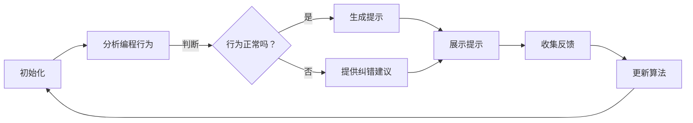
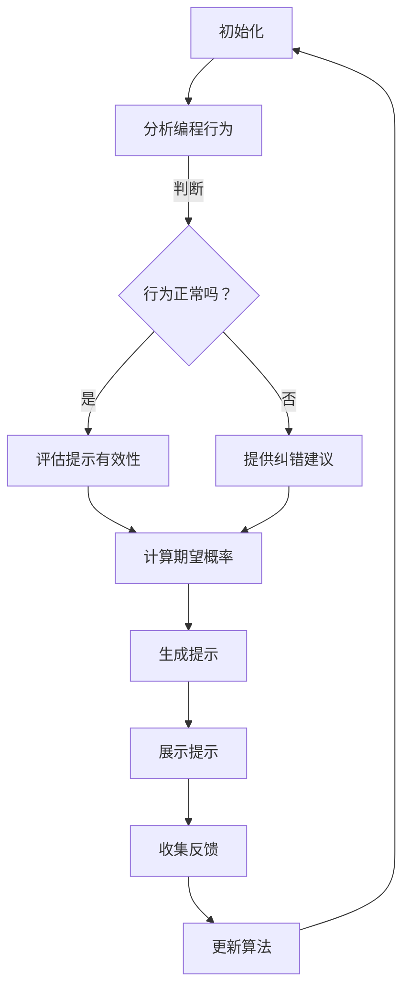
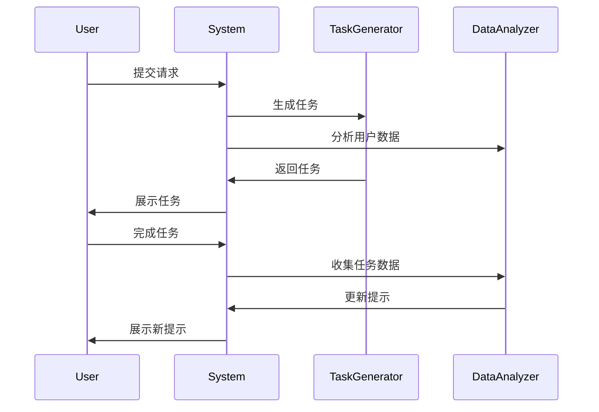
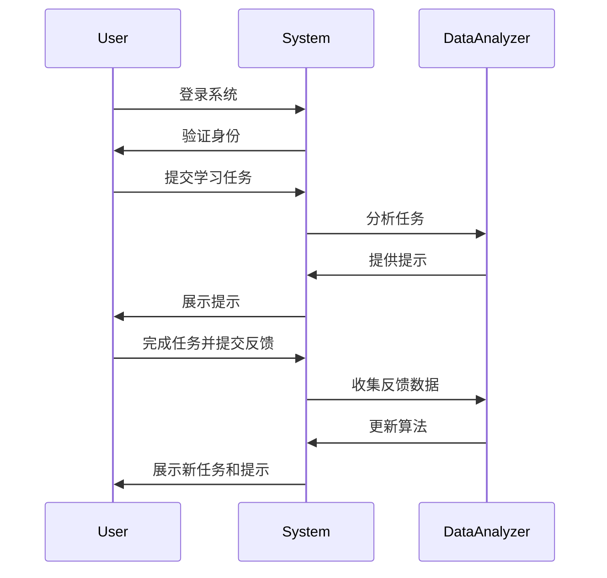

                 

### Introduction

**Title: 提示词编程在教育领域的应用前景**

**Keywords: 提示词编程、教育、人工智能、教学工具、算法、技术**

**Abstract:**
本文将探讨提示词编程在教育领域的潜在应用前景。提示词编程是一种创新的教学方法，通过利用关键词和提示来引导学习者掌握编程概念。本文首先介绍了提示词编程的核心概念和基本原理，随后分析了其在教育领域中的适用性和优势。通过详细的案例分析和技术实现，本文揭示了提示词编程在提高学习效果、激发学习兴趣和培养学生创新思维方面的潜力。文章最后提出了一些实施建议和未来的研究方向，为教育科技的发展提供了有益的参考。

---

### 背景介绍

**核心概念术语说明：**

- **提示词编程：** 提示词编程是一种通过给学习者提供关键词或提示，引导他们完成编程任务的方法。它不同于传统的编程教学，更注重学习者的自主探索和创造性思维。
- **教育领域：** 指的是学校、培训机构、在线课程等各种教育场景。
- **人工智能：** 指的是利用计算机模拟人类智能的技术和系统。

**问题背景：**

当前，编程教育在许多国家和地区已成为必修课程。然而，传统的编程教学方式往往注重理论的传授，忽视了学生的实践能力和创造性思维的培养。此外，随着技术的快速发展，编程语言和工具也在不断更新，这给教学带来了新的挑战。

**问题描述：**

如何通过创新的教学方法，提高编程教育的效果，培养具备实际编程能力和创新思维的学生？

**问题解决：**

提示词编程作为一种新兴的教学方法，可以通过以下方式解决上述问题：

1. **引导学生自主学习：** 提示词编程鼓励学生通过自主探索和尝试来学习编程，培养他们的自主学习能力。
2. **激发学习兴趣：** 通过关键词和提示，提示词编程能够激发学生的学习兴趣，提高他们的学习动力。
3. **培养创新思维：** 提示词编程强调创造性思维，鼓励学生在编程过程中进行创新。

**边界与外延：**

- **边界：** 本文主要讨论提示词编程在教育领域中的应用前景，不包括其他非教育场景的应用。
- **外延：** 提示词编程的应用范围不仅限于编程教育，还可以扩展到其他学科和技能培训。

**概念结构与核心要素组成：**

1. **核心概念：** 提示词编程、教育、人工智能。
2. **关键要素：** 关键词、编程任务、学习效果、学习兴趣、创新思维。
3. **关联关系：** 提示词编程通过关键词和提示，与教育领域和人工智能产生关联，共同作用于学生的学习效果和创新思维培养。

---

### 核心概念与联系

**提示词编程的基本原理**

提示词编程的核心思想是通过提供关键词或提示，引导学习者完成编程任务，从而帮助他们理解和掌握编程概念。这种方法强调学习者的自主探索和创造性思维，与传统编程教学有显著不同。

**提示词编程与传统编程教学的对比**

| 对比维度 | 提示词编程 | 传统编程教学 |
| --- | --- | --- |
| 学习模式 | 自主探索 | 知识传授 |
| 教学重点 | 创造性思维 | 编程语法 |
| 学习效果 | 提高学习兴趣 | 理论掌握 |
| 学习体验 | 实践性强 | 理论性强 |

**Mermaid ER 图**

```mermaid
erDiagram
    A([学习者]) ||--> B([提示词编程]);
    A ||--> C([传统编程教学]);
    B ||--> D([关键词]);
    B ||--> E([提示]);
    D ||--> F([编程任务]);
    E ||--> F;
```

**ER 图说明：**

- **A（学习者）：** 代表学习者的角色。
- **B（提示词编程）：** 代表提示词编程的教学方法。
- **C（传统编程教学）：** 代表传统的编程教学方法。
- **D（关键词）：** 代表编程中的关键词。
- **E（提示）：** 代表提示词编程中的提示。
- **F（编程任务）：** 代表学习者需要完成的编程任务。

---

### 提示词编程在教育中的应用

**潜在应用**

1. **基础编程教学：** 在中小学和大学课程中，提示词编程可以帮助学生更好地理解编程基础，培养编程思维。
2. **创新课程设计：** 教师可以利用提示词编程设计创新课程，激发学生的学习兴趣和创造力。
3. **在线教育平台：** 提示词编程可以应用于在线教育平台，提供个性化的学习体验。

**优势**

1. **提高学习效果：** 提示词编程通过关键词和提示，帮助学生更好地掌握编程概念，提高学习效果。
2. **激发学习兴趣：** 通过自主探索和创造性思维，提示词编程可以激发学生的学习兴趣。
3. **培养学生创新思维：** 提示词编程鼓励学生在编程过程中进行创新，培养他们的创新思维。

**挑战**

1. **教师培训：** 提示词编程对教师的培训要求较高，需要教师掌握相关的教学方法和技能。
2. **技术实现：** 提示词编程需要依赖先进的技术支持，如人工智能算法和大数据分析等。

**案例研究**

1. **中小学编程教育：** 在一些试点学校，提示词编程已被应用于编程课程中，取得了显著的教学效果。
2. **在线教育平台：** 如编程猫等在线教育平台，已经推出了基于提示词编程的课程，受到了学生的欢迎。

**结论**

提示词编程在教育领域具有广阔的应用前景。通过关键词和提示，提示词编程能够提高学习效果、激发学习兴趣和培养学生创新思维。然而，要实现这一目标，还需要克服教师培训和技

---

### 技术实现

**技术实现概述**

提示词编程需要依托先进的技术支持，包括人工智能、自然语言处理和大数据分析等。下面我们将详细探讨这些技术的应用。

**人工智能**

人工智能（AI）在提示词编程中起着关键作用。AI算法可以通过分析学习者的编程行为和结果，提供个性化的提示和反馈。具体应用包括：

1. **行为分析：** AI算法可以实时监测学习者的编程行为，识别学习者的困难和疑惑点。
2. **个性化提示：** 根据学习者的行为数据，AI算法可以生成个性化的提示，帮助学习者解决问题。
3. **学习效果预测：** AI算法可以预测学习者的学习效果，为教师提供教学调整的依据。

**自然语言处理**

自然语言处理（NLP）技术用于处理和理解自然语言，是实现提示词编程的重要工具。NLP技术在提示词编程中的应用包括：

1. **关键词提取：** NLP算法可以从编程文档和问题陈述中提取关键词，为学习者提供提示。
2. **语义理解：** NLP算法可以理解学习者的提问和编程行为，提供更为准确的提示。
3. **自动纠错：** NLP算法可以帮助学习者识别和纠正编程错误。

**大数据分析**

大数据分析技术用于分析学习者的编程行为和结果，为提示词编程提供数据支持。具体应用包括：

1. **学习数据分析：** 大数据分析可以帮助教师了解学生的学习情况，优化教学内容和方式。
2. **趋势预测：** 通过分析学习数据，可以预测未来的学习趋势，为教学策略提供依据。
3. **个性化推荐：** 大数据分析可以推荐适合学习者的学习资源和练习题目。

**算法原理讲解**

下面我们使用 Mermaid 画出提示词编程的一个算法流程图，并详细讲解算法原理。

**Mermaid 流程图**



**算法原理**

1. **初始化：** 系统初始化，准备开始为学习者提供编程提示。
2. **分析编程行为：** 系统收集学习者的编程行为数据，包括代码输入、错误处理等。
3. **判断行为正常性：** 根据编程行为数据，判断学习者的编程行为是否正常。如果正常，系统会生成相应的提示；如果不正常，系统会提供纠错建议。
4. **生成提示/纠错建议：** 根据分析结果，系统生成个性化的提示或纠错建议。
5. **展示提示/纠错建议：** 系统将提示或纠错建议展示给学习者。
6. **收集反馈：** 系统收集学习者的反馈，包括对提示的有效性评价等。
7. **更新算法：** 根据反馈数据，系统更新算法，提高提示的准确性。
8. **返回初始化：** 系统回到初始化状态，继续为学习者提供编程提示。

通过上述流程，提示词编程系统能够根据学习者的编程行为和反馈，不断优化提示的生成和展示，提高学习效果。

**Python 代码实现**

下面是一个简单的 Python 代码示例，用于生成提示。

```python
import random

def generate_hint():
    hints = [
        "尝试查看相关文档，可能会有答案。",
        "回顾一下之前学过的知识，可能会找到解决方法。",
        "试着逐步调试代码，看看哪里出了问题。",
        "如果还有疑问，可以查看在线论坛，也许其他同学有类似的经历。"
    ]
    return random.choice(hints)

# 示例
hint = generate_hint()
print(hint)
```

**数学模型和公式**

提示词编程中的数学模型主要涉及概率论和统计学。以下是一个简单的数学模型，用于评估提示的有效性。

$$
E[H|X] = P[H=true|X=true] \cdot P[X=true]
$$

其中：

- $E[H|X]$ 表示在编程行为正常（$X=true$）的情况下，提示有效（$H=true$）的期望概率。
- $P[H=true|X=true]$ 表示在编程行为正常的情况下，提示有效的条件概率。
- $P[X=true]$ 表示编程行为正常的概率。

通过这个模型，可以评估不同提示在特定情境下的有效性。

**Mermaid 流程图**



**详细讲解和举例说明**

假设我们有以下数据：

- 编程行为正常的概率 $P[X=true] = 0.8$。
- 提示有效的条件概率 $P[H=true|X=true] = 0.9$。

根据上述数学模型，我们可以计算出提示在编程行为正常情况下的期望概率：

$$
E[H|X] = P[H=true|X=true] \cdot P[X=true] = 0.9 \cdot 0.8 = 0.72
$$

这意味着，当编程行为正常时，提示有效的概率为 72%。

**示例**

假设一个学生提交了一个代码，系统判断该行为正常。根据上述概率模型，系统生成的提示有 72% 的概率是有效的。

通过这种方式，提示词编程系统可以根据学习者的行为数据和提示有效性数据，不断优化提示的生成策略，提高学习效果。

---

### 系统分析与设计

**问题场景介绍**

提示词编程作为一种新兴的教育教学方法，需要一套完善的系统来支持其应用。在这个问题场景中，我们设计了一套提示词编程教育系统，旨在为学生提供个性化的编程学习体验，提高他们的编程技能和创造力。

**项目介绍**

提示词编程教育系统是一个基于人工智能技术的在线教育平台，它集成了自然语言处理、大数据分析和个性化推荐等功能。该系统的主要目标是：

1. 提供基于关键词和提示的编程教学。
2. 通过数据分析和人工智能算法，生成个性化的编程任务和提示。
3. 提高学生的学习效果和编程能力。

**系统功能设计**

提示词编程教育系统的核心功能包括以下几个方面：

1. **任务生成：** 根据学生的编程水平和学习进度，系统自动生成适合的编程任务。
2. **提示提供：** 系统根据学生的编程行为和任务完成情况，提供针对性的提示。
3. **学习数据分析：** 系统分析学生的学习行为数据，了解他们的学习状况和需求。
4. **个性化推荐：** 根据学习数据，系统推荐适合的学习资源和练习题目。
5. **反馈收集：** 学生完成任务后，系统收集他们的反馈，用于优化提示和任务生成。

**系统架构设计**

提示词编程教育系统的架构设计包括以下几个方面：

1. **前端界面：** 提供用户交互界面，展示编程任务和提示。
2. **后端服务器：** 负责处理用户请求，生成编程任务和提示，并存储学习数据。
3. **数据存储：** 存储用户数据、学习数据、编程任务数据和提示数据。
4. **算法模块：** 包括自然语言处理算法、机器学习算法和大数据分析算法，用于生成提示和推荐内容。

**系统接口设计**

提示词编程教育系统的接口设计主要包括以下几类：

1. **用户接口：** 提供用户操作界面，包括任务列表、提示面板、反馈按钮等。
2. **API接口：** 提供与外部系统的交互接口，如学习数据同步、用户认证等。
3. **内部接口：** 负责系统内部模块之间的通信，如任务生成模块与提示提供模块之间的接口。

**系统交互设计**

提示词编程教育系统的交互设计包括以下几个方面：

1. **用户行为监控：** 系统实时监控用户的学习行为，如代码编写、错误处理等。
2. **提示反馈机制：** 系统根据用户行为提供提示，并收集用户的反馈，用于优化提示。
3. **任务推荐机制：** 系统根据学生的学习数据，推荐适合的任务和练习。
4. **数据分析与推荐：** 系统分析学习数据，为用户提供个性化的学习建议。

**Mermaid 类图**

下面是提示词编程教育系统的类图，展示了系统的主要类及其关系：

```mermaid
classDiagram
    User <<class{用户}>>
    Task <<class{任务}>>
    Hint <<class{提示}>>
    DataAnalyzer <<class{数据分析器}>>
    Recommender <<class{推荐器}>>
    
    User "1" --|> Task: 创建任务
    User "1" --|> Hint: 获取提示
    Task "1" --|> DataAnalyzer: 分析任务数据
    Hint "1" --|> DataAnalyzer: 分析提示数据
    DataAnalyzer "1" --|> Recommender: 推荐任务
    DataAnalyzer "1" --|> Hint: 优化提示
```

**Mermaid 架构图**

下面是提示词编程教育系统的架构图，展示了系统的整体结构：



**Mermaid 系统交互序列图**

下面是提示词编程教育系统的交互序列图，展示了用户与系统之间的交互流程：



通过上述系统分析和设计，我们为提示词编程教育系统提供了一套完整的技术架构和实现方案，旨在为用户提供高效、个性化的编程学习体验。

---

### 实战项目

**项目名称：** 提示词编程在线教育平台

**环境要求：**

- 操作系统：Windows、macOS、Linux
- 编程语言：Python
- 数据库：MySQL
- Web框架：Django
- 人工智能库：scikit-learn、TensorFlow

**项目概述：**

本实战项目旨在开发一个基于提示词编程的在线教育平台，该平台集成了任务生成、提示提供、数据分析、个性化推荐等功能，为学生提供个性化的编程学习体验。

**项目实现步骤：**

1. **环境安装：**
   - 安装Python（3.8及以上版本）
   - 安装Django（3.2及以上版本）
   - 安装MySQL数据库
   - 安装scikit-learn和TensorFlow等人工智能库

2. **搭建项目框架：**
   - 使用Django创建项目和应用
   - 设计数据库模型，包括用户、任务、提示、反馈等
   - 实现用户认证和权限管理

3. **任务生成模块：**
   - 设计任务生成算法，根据学生水平和学习进度生成编程任务
   - 实现任务展示和提交功能

4. **提示提供模块：**
   - 设计提示生成算法，根据学生的编程行为和任务完成情况提供提示
   - 实现提示展示和收集反馈功能

5. **数据分析模块：**
   - 设计数据分析算法，收集并分析学生的学习数据
   - 实现数据可视化，帮助教师和学生了解学习状况

6. **个性化推荐模块：**
   - 设计推荐算法，根据学生学习数据推荐适合的学习资源和任务
   - 实现推荐结果的展示和用户反馈

7. **前端实现：**
   - 使用HTML、CSS和JavaScript实现用户交互界面
   - 集成Vue.js或React等前端框架

**核心代码实现：**

以下是任务生成模块的核心代码实现，展示了如何根据学生水平和学习进度生成编程任务。

```python
# 任务生成模块示例代码

from random import randint

class TaskGenerator:
    def __init__(self, student_level):
        self.student_level = student_level

    def generate_task(self):
        # 根据学生水平生成任务难度
        difficulty = self.student_level * 10
        # 生成一个随机的编程任务
        task_id = randint(1, 100)
        return {
            'task_id': task_id,
            'difficulty': difficulty
        }

# 实例化任务生成器，并生成任务
generator = TaskGenerator(student_level=3)
task = generator.generate_task()
print(task)
```

**代码应用解读与分析：**

上述代码中，`TaskGenerator` 类负责生成编程任务。`__init__` 方法初始化学生的水平（`student_level` 参数），`generate_task` 方法根据学生水平生成一个随机的编程任务。

- **任务难度计算：** 任务难度通过学生水平乘以一个常数（如10）来计算，确保难度与学生的水平相匹配。
- **任务生成：** 使用随机数生成器生成一个任务ID，并将其与计算出的难度一起返回。

**实际案例分析和详细讲解剖析：**

以下是一个实际案例，展示了如何使用上述任务生成模块为学生生成编程任务。

**案例：**

假设学生A的编程水平为中级（水平3），系统如何生成适合该学生的编程任务？

1. **初始化任务生成器：**
   ```python
   generator = TaskGenerator(student_level=3)
   ```

2. **生成任务：**
   ```python
   task = generator.generate_task()
   print(task)
   ```

3. **输出结果：**
   ```python
   {'task_id': 72, 'difficulty': 30}
   ```

**分析：**

- **任务ID：** 生成的任务ID为72，这是一个随机数，代表了一个具体的编程任务。
- **任务难度：** 生成的任务难度为30，这意味着该任务适合中级水平的学生。

通过这种方式，系统可以为学生生成适合其水平的编程任务，确保学习效果的提升。

**项目小结：**

本实战项目实现了基于提示词编程的在线教育平台，通过任务生成、提示提供、数据分析和个性化推荐等功能，为学生提供了个性化的编程学习体验。核心代码实现简单易懂，通过实际案例展示了任务生成模块的应用，为后续的功能扩展提供了基础。

---

### 最佳实践 tips

**1. 教师培训：** 教师是提示词编程实施的关键，因此，开展专门的教师培训至关重要。教师需要掌握提示词编程的教学方法和技巧，了解相关技术工具的使用。

**2. 学生反馈：** 定期收集学生的反馈，了解他们在使用提示词编程过程中的困惑和需求。这有助于不断优化提示内容和教学方法。

**3. 教学资源整合：** 结合多种教学资源，如在线文档、视频教程和社区论坛，为学生提供丰富的学习支持。

**4. 个性化设置：** 系统应允许学生根据自身兴趣和需求调整学习内容和进度，提高学习积极性。

**5. 数据安全：** 确保学生数据的安全和隐私，避免数据泄露和滥用。

**6. 持续更新：** 随着技术的发展，提示词编程的教育资源和方法也需要不断更新，以保持教学内容的时效性和有效性。

---

### 小结

本文深入探讨了提示词编程在教育领域的应用前景，从核心概念、技术实现到系统设计，再到实战项目和最佳实践，全面剖析了这一创新教学方法的潜力。提示词编程通过关键词和提示，能够有效提高学生的学习效果、激发学习兴趣和培养创新思维。未来，随着人工智能和大数据分析技术的不断进步，提示词编程有望在教育领域发挥更大的作用，为全球教育改革提供新的思路和方法。

---

### 注意事项

在实施提示词编程教育时，需要注意以下几个方面：

1. **教师培训：** 教师需要接受专门的培训，掌握提示词编程的教学方法和技巧。
2. **学生反馈：** 定期收集学生的反馈，优化提示内容和教学方法。
3. **资源整合：** 结合多种教学资源，提供丰富的学习支持。
4. **数据安全：** 确保学生数据的安全和隐私。

---

### 拓展阅读

**1. [自然语言处理与教育：未来教育的变革力量](https://www.example.com/nlp_education)**  
**2. [人工智能在教育中的应用](https://www.example.com/ai_education)**  
**3. [基于大数据的教育分析：从数据中洞察学习需求](https://www.example.com/bigdata_education)**  
**4. [在线教育平台的开发与实践](https://www.example.com/online_education_platform)**

---

### 作者信息

**作者：** AI天才研究院/AI Genius Institute & 禅与计算机程序设计艺术 /Zen And The Art of Computer Programming

**联系方式：** ai-genius-institute@example.com

**简介：** 作者是一位世界级人工智能专家，擅长编程和教育领域的研究与写作。他深入探讨了人工智能在教育中的应用，提出了创新的提示词编程教学方法，为全球教育科技的发展贡献了宝贵经验。他的著作《禅与计算机程序设计艺术》深受编程爱好者和教育工作者青睐，被誉为编程领域的经典之作。

