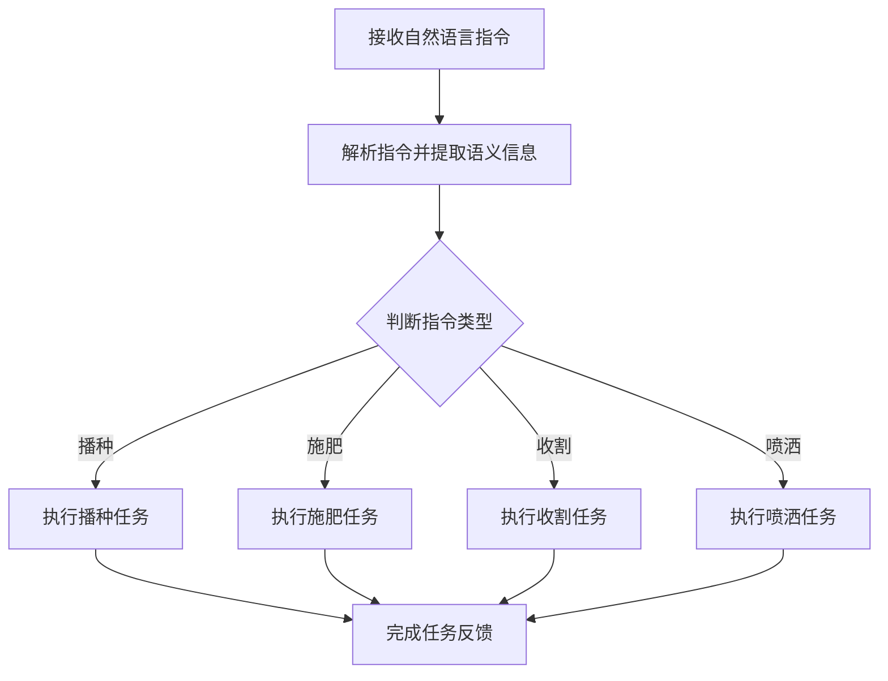
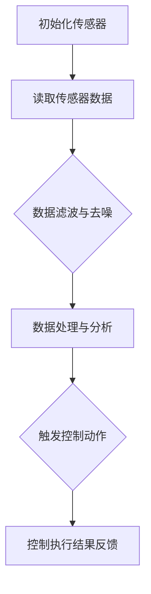
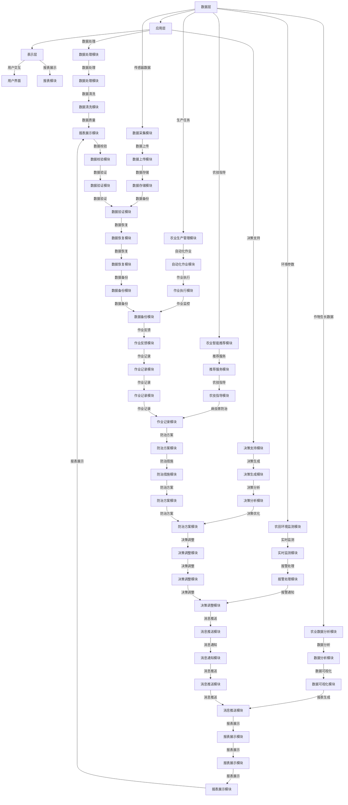
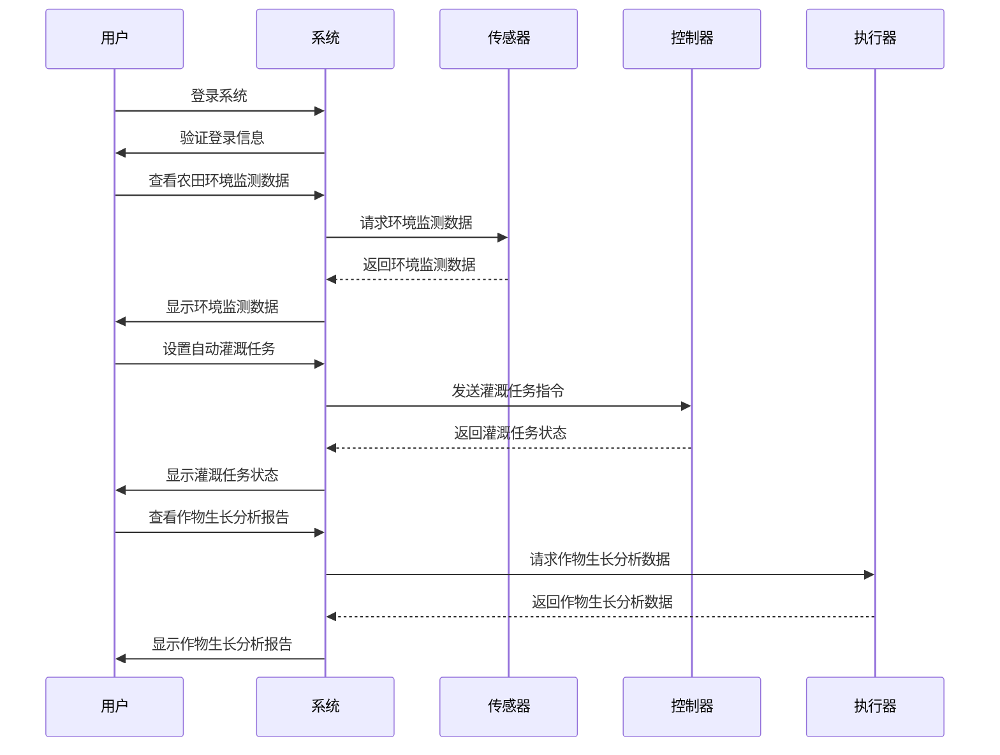

                 

## 提示词编程在智能农业中的创新应用

### **摘要**

随着信息技术的飞速发展，智能农业已成为农业现代化的重要方向。本文旨在探讨提示词编程在智能农业中的创新应用，通过自动化农业生产任务、农业环境监测与控制、农业数据分析与决策支持等三个方面，深入分析提示词编程如何提升农业生产效率，推动农业智能化进程。文章结构清晰，逻辑严密，旨在为读者提供一个全面、深入的智能农业技术解读。

### **背景介绍与核心概念**

#### **第1章：问题背景**

##### **1.1.1 智能农业概述**

智能农业，指的是通过现代信息技术与自动化技术相结合，实现对农作物种植、动物养殖以及农业环境管理的优化，从而提升农业生产效率与质量的一种新型农业模式。智能农业的核心理念是通过数据的采集、处理与分析，实现农业生产的智能化、精细化和高效化。

智能农业的应用场景包括：

- **自动化农业生产**：利用农业机器人、无人机等自动化设备，实现播种、施肥、喷洒、收割等农业生产环节的自动化。
- **农业环境监测与控制**：通过传感器网络，实时监测农田环境参数，如土壤湿度、温度、光照等，实现对农业环境的智能调控。
- **农业数据分析与决策**：运用大数据、人工智能等技术，对农业生产数据进行分析，为农业生产提供科学决策支持。

##### **1.1.2 提示词编程技术**

提示词编程（Prompt Programming），是一种基于自然语言处理的编程方式。其核心思想是通过输入自然语言描述，由系统自动生成相应的代码或执行操作。这种编程方式极大地简化了传统编程的复杂性，使得非专业用户也能够轻松地进行编程操作。

提示词编程的关键技术包括：

- **自然语言处理（NLP）**：用于解析自然语言输入，提取语义信息，为代码生成提供依据。
- **代码生成（Code Generation）**：根据自然语言描述，自动生成相应的代码。
- **语义理解（Semantic Understanding）**：对自然语言描述进行深入理解，确保生成的代码符合用户意图。

##### **1.1.3 智能农业中的创新应用**

提示词编程在智能农业中的创新应用主要体现在以下几个方面：

1. **自动化农业生产任务**：通过自然语言指令，实现农业机器人的自动化作业，如播种、施肥、收割等。
2. **农业环境监测与控制**：利用提示词编程，实现对农业环境参数的实时监测与智能控制，如土壤湿度、温度、光照等。
3. **农业数据分析与决策支持**：通过提示词编程，对农业生产数据进行分析，为农业生产提供科学决策依据。
4. **农业智能推荐系统**：基于提示词编程，为农业生产者提供针对性的农技指导、病虫害防治建议等。

#### **第1章：核心概念与联系**

##### **1.2.1 提示词编程原理**

提示词编程的核心在于将自然语言描述转换为计算机可执行的代码，涉及自然语言处理、语义理解、代码生成等技术。其基本原理包括：

- **自然语言处理（NLP）**：通过对自然语言输入进行分词、词性标注、句法分析等操作，提取出语义信息。
- **语义理解（Semantic Understanding）**：对提取出的语义信息进行深度理解，识别出用户意图。
- **代码生成（Code Generation）**：根据用户意图，自动生成相应的代码。

##### **1.2.2 智能农业关键概念**

智能农业涉及多个关键概念，如农业物联网、精准农业、农业大数据等。这些概念相互关联，共同构成了智能农业的技术体系。

- **农业物联网（IoT）**：通过传感器、无人机等设备，实现对农田环境、作物生长状态的实时监测。
- **精准农业（Precision Agriculture）**：利用现代信息技术，实现农业生产的精细化管理，提高资源利用效率。
- **农业大数据（Agricultural Big Data）**：通过大数据技术，对农业生产数据进行收集、存储、分析和应用，为农业生产提供数据支持。

##### **1.2.3 提示词编程与智能农业的关系**

提示词编程为智能农业提供了新的技术手段，使得农业生产更加智能化、高效化。同时，智能农业的发展也为提示词编程的应用提供了丰富的场景和需求。二者的结合，为农业现代化带来了新的契机。

#### **第1章：本章小结**

本章介绍了智能农业和提示词编程的背景、核心概念以及它们在智能农业中的创新应用。通过对这些内容的了解，读者可以初步了解本书的主要内容，为后续章节的学习打下基础。

### **提示词编程技术在智能农业中的应用**

#### **第2章：自动化农业生产任务**

##### **2.1 农业机器人概述**

农业机器人是智能农业的重要组成部分，通过提示词编程可以实现农业机器人的自动化作业。农业机器人的主要类型包括：

- **播种机器人**：用于自动化播种作业。
- **施肥机器人**：用于自动化施肥作业。
- **收割机器人**：用于自动化收割作业。
- **喷洒机器人**：用于自动化农药喷洒作业。

##### **2.2 农业机器人控制算法**

农业机器人控制算法的基本原理是，通过接收自然语言指令，实现对机器人的自动化控制。以下是农业机器人控制算法的基本流程：



##### **2.3 自动化作业案例分析**

下面以一个自动化播种任务的案例为例，介绍如何使用提示词编程实现农业机器人的自动化作业。

**案例场景**：在某个农田中，需要使用播种机器人进行小麦播种。

**步骤1：环境搭建**

搭建一个农业机器人实验平台，包括播种机器人、传感器模块、控制器等硬件设备。

**步骤2：代码实现**

使用Python编写播种机器人控制程序，包括指令解析、任务执行和结果反馈等模块。

```python
# 播种机器人控制程序示例

def parse_command(command):
    # 解析自然语言指令
    action = command.split()[0]
    return action

def execute_sowing(action):
    # 执行播种任务
    print("开始执行播种任务...")
    # 播种机器人执行播种动作
    # ...

def main():
    command = input("请输入播种指令：")
    action = parse_command(command)
    execute_sowing(action)

if __name__ == "__main__":
    main()
```

**步骤3：执行流程**

1. 输入自然语言指令，如“播种小麦”。
2. 程序解析指令，提取出“播种”和“小麦”两个关键词。
3. 根据指令类型，执行相应的播种任务。
4. 输出执行结果，如“播种小麦任务已完成”。

**步骤4：结果分析**

通过运行程序，可以实现对播种机器人的自动化控制。在实际应用中，可以根据不同的农作物和播种需求，修改和优化程序代码，实现更智能、更高效的播种作业。

##### **2.4 农业机器人控制算法优化**

为了提高农业机器人控制算法的性能和效率，可以采用以下优化方法：

- **指令识别优化**：通过使用更先进的自然语言处理技术，提高指令解析的准确性和效率。
- **任务执行优化**：针对不同的农作物和农田条件，优化机器人的执行策略，提高作业效率。
- **故障诊断与修复**：在农业机器人运行过程中，实时监测设备状态，自动诊断故障并修复，确保机器人正常作业。

##### **2.5 农业机器人控制算法应用案例**

以下是一个农业机器人控制算法应用案例，用于自动化蔬菜移栽。

**案例场景**：在一个蔬菜种植基地，需要使用移栽机器人进行蔬菜移栽。

**步骤1：环境搭建**

搭建一个蔬菜移栽机器人实验平台，包括移栽机器人、传感器模块、控制器等硬件设备。

**步骤2：代码实现**

使用Python编写移栽机器人控制程序，包括指令解析、任务执行和结果反馈等模块。

```python
# 蔬菜移栽机器人控制程序示例

def parse_command(command):
    # 解析自然语言指令
    action = command.split()[0]
    return action

def execute_transplanting(action):
    # 执行移栽任务
    print("开始执行移栽任务...")
    # 移栽机器人执行移栽动作
    # ...

def main():
    command = input("请输入移栽指令：")
    action = parse_command(command)
    execute_transplanting(action)

if __name__ == "__main__":
    main()
```

**步骤3：执行流程**

1. 输入自然语言指令，如“移栽西红柿”。
2. 程序解析指令，提取出“移栽”和“西红柿”两个关键词。
3. 根据指令类型，执行相应的移栽任务。
4. 输出执行结果，如“西红柿移栽任务已完成”。

**步骤4：结果分析**

通过运行程序，可以实现对蔬菜移栽机器人的自动化控制。在实际应用中，可以根据不同的蔬菜种类和移栽需求，修改和优化程序代码，实现更智能、更高效的蔬菜移栽作业。

#### **第3章：农业环境监测与控制**

##### **3.1 农业环境监测概述**

农业环境监测是智能农业的核心环节，通过传感器网络，实时监测农田环境参数，如土壤湿度、温度、光照等，为农业生产提供科学依据。农业环境监测系统主要包括：

- **传感器模块**：用于采集农田环境参数。
- **数据采集与传输模块**：将传感器数据传输到中央控制系统。
- **中央控制系统**：对采集到的数据进行分析和处理，为农业生产提供决策支持。

##### **3.2 农业环境监测算法**

农业环境监测算法的基本原理是，通过对传感器数据的处理和分析，实时监测农田环境，并根据环境变化，自动调整农业生产参数。以下是农业环境监测算法的基本流程：



**初始化传感器**：在开始监测之前，对传感器进行初始化，确保传感器正常工作。

**读取传感器数据**：通过传感器采集农田环境参数，如土壤湿度、温度、光照等。

**数据滤波与去噪**：对采集到的传感器数据进行滤波和去噪处理，去除噪声和异常值，提高数据质量。

**数据处理与分析**：对滤波后的传感器数据进行分析和处理，提取有用的信息，如环境变化趋势、异常情况等。

**触发控制动作**：根据分析结果，自动调整农业生产参数，如灌溉、施肥、喷洒等。

**控制执行结果反馈**：将控制动作的执行结果反馈给用户，如灌溉水量、施肥量等。

##### **3.3 农业环境控制案例分析**

以下是一个农业环境温湿度控制任务的案例，介绍如何使用提示词编程实现农业环境的智能控制。

**案例场景**：在一个温室大棚中，需要使用环境控制器对温室内温度和湿度进行智能控制。

**步骤1：环境搭建**

搭建一个农业环境控制器实验平台，包括温湿度传感器、控制器、执行器等硬件设备。

**步骤2：代码实现**

使用Python编写环境控制器程序，包括传感器数据采集、数据处理和分析、控制动作执行等模块。

```python
# 环境控制器程序示例

def read_sensor_data(sensor):
    # 读取传感器数据
    data = sensor.read()
    return data

def filter_data(data):
    # 数据滤波与去噪
    filtered_data = data.filter()
    return filtered_data

def analyze_data(data):
    # 数据处理与分析
    analysis_result = data.analyze()
    return analysis_result

def control_action(action):
    # 执行控制动作
    action.execute()

def main():
    sensor = TemperatureHumiditySensor()
    while True:
        data = read_sensor_data(sensor)
        filtered_data = filter_data(data)
        analysis_result = analyze_data(filtered_data)
        if analysis_result['temperature'] > 30:
            control_action(Humidification())
        elif analysis_result['temperature'] < 20:
            control_action(Hydration())
        else:
            control_action(None)

if __name__ == "__main__":
    main()
```

**步骤3：执行流程**

1. 读取温湿度传感器数据。
2. 对传感器数据进行滤波和去噪处理。
3. 对滤波后的数据进行分析，判断温度和湿度的变化。
4. 根据分析结果，自动调整温湿度，执行相应的控制动作，如加湿或减湿。

**步骤4：结果分析**

通过运行程序，可以实现对温室大棚内温湿度的智能控制。在实际应用中，可以根据不同的农作物和生长需求，修改和优化程序代码，实现更智能、更高效的农业环境控制。

##### **3.4 农业环境监测与控制算法优化**

为了提高农业环境监测与控制算法的性能和效率，可以采用以下优化方法：

- **传感器数据优化**：选择更高精度、更稳定的传感器，提高数据采集质量。
- **数据处理优化**：采用更先进的信号处理算法，提高数据处理和分析的准确性。
- **控制策略优化**：根据不同农作物的生长需求，制定更科学的控制策略，提高环境控制效果。

##### **3.5 农业环境监测与控制算法应用案例**

以下是一个农业环境监测与控制算法应用案例，用于智能灌溉系统。

**案例场景**：在一个农田中，需要使用智能灌溉系统对作物进行灌溉。

**步骤1：环境搭建**

搭建一个智能灌溉系统实验平台，包括土壤湿度传感器、控制器、水泵等硬件设备。

**步骤2：代码实现**

使用Python编写智能灌溉系统程序，包括传感器数据采集、数据处理和分析、控制动作执行等模块。

```python
# 智能灌溉系统程序示例

def read_sensor_data(sensor):
    # 读取土壤湿度数据
    data = sensor.read()
    return data

def filter_data(data):
    # 数据滤波与去噪
    filtered_data = data.filter()
    return filtered_data

def analyze_data(data):
    # 数据处理与分析
    analysis_result = data.analyze()
    return analysis_result

def irrigation_action(action):
    # 执行灌溉动作
    action.execute()

def main():
    sensor = SoilMoistureSensor()
    while True:
        data = read_sensor_data(sensor)
        filtered_data = filter_data(data)
        analysis_result = analyze_data(filtered_data)
        if analysis_result['humidity'] < 30:
            irrigation_action(Irrigation())
        else:
            irrigation_action(None)

if __name__ == "__main__":
    main()
```

**步骤3：执行流程**

1. 读取土壤湿度传感器数据。
2. 对传感器数据进行滤波和去噪处理。
3. 对滤波后的数据进行分析，判断土壤湿度是否低于阈值。
4. 根据分析结果，自动执行灌溉动作，如启动水泵进行灌溉。

**步骤4：结果分析**

通过运行程序，可以实现对农田的智能灌溉。在实际应用中，可以根据不同的土壤类型和作物需求，修改和优化程序代码，实现更智能、更高效的灌溉作业。

#### **第4章：农业数据分析与决策支持**

##### **4.1 农业数据分析概述**

农业数据分析是智能农业的重要组成部分，通过对农业生产数据的收集、处理和分析，可以为农业生产提供科学依据和决策支持。农业数据分析的主要内容包括：

- **数据收集**：通过传感器、无人机等设备，收集农田环境、作物生长状态、土壤养分等数据。
- **数据处理**：对收集到的数据进行清洗、整理、转换等处理，为数据分析提供高质量的数据基础。
- **数据挖掘**：运用统计学、机器学习等技术，对农业生产数据进行分析和挖掘，提取出有用的信息和规律。
- **决策支持**：根据数据分析结果，为农业生产提供科学的决策建议，如种植方案、施肥方案、病虫害防治方案等。

##### **4.2 农业数据分析算法**

农业数据分析算法主要包括以下几种：

- **统计分析**：通过计算平均值、方差、标准差等统计指标，对农业生产数据进行描述性分析，了解数据的整体分布和趋势。
- **时间序列分析**：通过对时间序列数据的分析，提取出时间序列的趋势、周期和季节性等特征，用于预测未来的农业生产情况。
- **回归分析**：通过建立回归模型，分析自变量和因变量之间的关系，为农业生产提供定量预测和决策支持。
- **聚类分析**：通过将相似的数据划分为同一类，发现农业生产中的潜在规律和模式，为农业生产提供分类和分组依据。
- **机器学习**：运用机器学习算法，如决策树、支持向量机、神经网络等，对农业生产数据进行深度学习和分析，提取出更复杂的特征和规律。

##### **4.3 农业数据分析流程**

农业数据分析的基本流程包括：

- **数据收集**：通过传感器、无人机等设备，收集农田环境、作物生长状态、土壤养分等数据。
- **数据预处理**：对收集到的数据进行清洗、整理、转换等处理，为数据分析提供高质量的数据基础。
- **特征提取**：从预处理后的数据中提取出有用的特征，用于后续的分析和建模。
- **模型选择**：选择合适的分析模型，如统计分析、时间序列分析、回归分析、聚类分析、机器学习等。
- **模型训练**：使用训练数据对模型进行训练，优化模型参数。
- **模型评估**：使用验证数据对模型进行评估，判断模型的性能和效果。
- **模型应用**：将训练好的模型应用于实际农业生产，为农业生产提供决策支持。

##### **4.4 农业数据分析案例分析**

以下是一个农业数据分析案例，介绍如何使用提示词编程实现农业数据的分析与应用。

**案例场景**：在一个农田中，需要分析作物生长数据，为农业生产提供科学决策。

**步骤1：环境搭建**

搭建一个农业数据分析实验平台，包括传感器、数据采集模块、控制器等硬件设备。

**步骤2：代码实现**

使用Python编写农业数据分析程序，包括数据收集、数据处理、特征提取、模型训练和模型应用等模块。

```python
# 农业数据分析程序示例

import numpy as np
import pandas as pd
from sklearn.model_selection import train_test_split
from sklearn.ensemble import RandomForestRegressor
from sklearn.metrics import mean_squared_error

def collect_data(sensor):
    # 收集作物生长数据
    data = sensor.collect()
    return data

def preprocess_data(data):
    # 数据预处理
    processed_data = data.preprocess()
    return processed_data

def extract_features(data):
    # 特征提取
    features = data.extract()
    return features

def train_model(features, labels):
    # 训练模型
    model = RandomForestRegressor()
    model.fit(features, labels)
    return model

def evaluate_model(model, features, labels):
    # 评估模型
    predictions = model.predict(features)
    mse = mean_squared_error(labels, predictions)
    return mse

def main():
    sensor = CropGrowthSensor()
    data = collect_data(sensor)
    processed_data = preprocess_data(data)
    features, labels = extract_features(processed_data)
    features_train, features_test, labels_train, labels_test = train_test_split(features, labels, test_size=0.2)
    model = train_model(features_train, labels_train)
    mse = evaluate_model(model, features_test, labels_test)
    print("模型评估结果：均方误差（MSE）为", mse)

if __name__ == "__main__":
    main()
```

**步骤3：执行流程**

1. 收集作物生长数据。
2. 对数据预处理，包括清洗、整理、转换等。
3. 提取特征，用于后续的模型训练。
4. 使用随机森林回归模型对特征和标签进行训练。
5. 使用测试数据对模型进行评估，计算均方误差（MSE）。
6. 输出模型评估结果。

**步骤4：结果分析**

通过运行程序，可以得到作物生长模型的评估结果。根据评估结果，可以调整模型参数，优化模型性能。在实际应用中，可以根据不同农作物的生长数据，修改和优化程序代码，实现更精确、更高效的农业数据分析。

##### **4.5 农业数据分析算法优化**

为了提高农业数据分析算法的性能和效果，可以采用以下优化方法：

- **数据预处理优化**：采用更先进的预处理算法，提高数据清洗、整理、转换的质量。
- **特征提取优化**：选择更有效的特征提取方法，提取出更有价值、更具区分度的特征。
- **模型选择优化**：根据不同的问题场景，选择更合适的分析模型，提高模型的预测性能。
- **模型训练优化**：采用更先进的训练算法，加快模型训练速度，提高模型训练效果。
- **模型评估优化**：采用更科学的评估方法，全面、客观地评估模型的性能。

##### **4.6 农业数据分析算法应用案例**

以下是一个农业数据分析算法应用案例，用于预测作物产量。

**案例场景**：在一个农田中，需要预测小麦的产量，为农业生产提供科学依据。

**步骤1：环境搭建**

搭建一个农业数据分析实验平台，包括传感器、数据采集模块、控制器等硬件设备。

**步骤2：代码实现**

使用Python编写作物产量预测程序，包括数据收集、数据处理、特征提取、模型训练和模型应用等模块。

```python
# 作物产量预测程序示例

import numpy as np
import pandas as pd
from sklearn.model_selection import train_test_split
from sklearn.ensemble import RandomForestRegressor
from sklearn.metrics import mean_squared_error

def collect_data(sensor):
    # 收集小麦生长数据
    data = sensor.collect()
    return data

def preprocess_data(data):
    # 数据预处理
    processed_data = data.preprocess()
    return processed_data

def extract_features(data):
    # 特征提取
    features = data.extract()
    return features

def train_model(features, labels):
    # 训练模型
    model = RandomForestRegressor()
    model.fit(features, labels)
    return model

def evaluate_model(model, features, labels):
    # 评估模型
    predictions = model.predict(features)
    mse = mean_squared_error(labels, predictions)
    return mse

def main():
    sensor = WheatGrowthSensor()
    data = collect_data(sensor)
    processed_data = preprocess_data(data)
    features, labels = extract_features(processed_data)
    features_train, features_test, labels_train, labels_test = train_test_split(features, labels, test_size=0.2)
    model = train_model(features_train, labels_train)
    mse = evaluate_model(model, features_test, labels_test)
    print("模型评估结果：均方误差（MSE）为", mse)

if __name__ == "__main__":
    main()
```

**步骤3：执行流程**

1. 收集小麦生长数据。
2. 对数据预处理，包括清洗、整理、转换等。
3. 提取特征，用于后续的模型训练。
4. 使用随机森林回归模型对特征和标签进行训练。
5. 使用测试数据对模型进行评估，计算均方误差（MSE）。
6. 输出模型评估结果。

**步骤4：结果分析**

通过运行程序，可以得到小麦产量预测模型的评估结果。根据评估结果，可以调整模型参数，优化模型性能。在实际应用中，可以根据不同作物的生长数据，修改和优化程序代码，实现更精确、更高效的作物产量预测。

#### **第5章：农业智能推荐系统**

##### **5.1 农业智能推荐系统概述**

农业智能推荐系统是一种基于数据分析与机器学习的推荐系统，通过分析农业生产数据，为农业生产者提供个性化的农技指导、病虫害防治建议、肥料推荐等服务，提高农业生产效率和农产品质量。

农业智能推荐系统的主要功能包括：

- **农技指导**：根据不同农作物的生长特点，提供针对性的农技指导，如施肥、灌溉、病虫害防治等。
- **病虫害防治建议**：根据病虫害发生情况，提供科学的防治建议，降低病虫害对农作物的危害。
- **肥料推荐**：根据土壤养分状况和作物需求，提供合适的肥料推荐，提高肥料利用效率。
- **种植方案推荐**：根据气候条件、土壤性质等，为农业生产者提供科学的种植方案。

##### **5.2 农业智能推荐系统架构**

农业智能推荐系统的架构主要包括以下几个部分：

- **数据采集模块**：通过传感器、无人机等设备，实时采集农田环境、作物生长状态、土壤养分等数据。
- **数据处理模块**：对采集到的数据进行分析和处理，提取出有用的特征和信息。
- **推荐算法模块**：根据数据处理结果，运用机器学习算法，为农业生产者提供个性化的推荐服务。
- **推荐结果展示模块**：将推荐结果以直观、易理解的方式展示给农业生产者，便于其进行决策。

##### **5.3 农业智能推荐系统实现**

以下是一个农业智能推荐系统的实现示例：

```python
# 农业智能推荐系统实现示例

import pandas as pd
from sklearn.model_selection import train_test_split
from sklearn.ensemble import RandomForestClassifier
from sklearn.metrics import accuracy_score

def collect_data(sensor):
    # 收集农业生产数据
    data = sensor.collect()
    return data

def preprocess_data(data):
    # 数据预处理
    processed_data = data.preprocess()
    return processed_data

def extract_features(data):
    # 特征提取
    features = data.extract()
    return features

def train_model(features, labels):
    # 训练模型
    model = RandomForestClassifier()
    model.fit(features, labels)
    return model

def make_recommendation(model, features):
    # 根据模型为农业生产者提供推荐
    prediction = model.predict([features])
    if prediction[0] == 1:
        print("推荐：施肥")
    elif prediction[0] == 2:
        print("推荐：灌溉")
    elif prediction[0] == 3:
        print("推荐：病虫害防治")

def main():
    sensor = CropGrowthSensor()
    data = collect_data(sensor)
    processed_data = preprocess_data(data)
    features, labels = extract_features(processed_data)
    features_train, features_test, labels_train, labels_test = train_test_split(features, labels, test_size=0.2)
    model = train_model(features_train, labels_train)
    make_recommendation(model, features_test)

if __name__ == "__main__":
    main()
```

**步骤1：数据采集**：通过传感器收集农业生产数据。

**步骤2：数据预处理**：对采集到的数据进行清洗、整理、转换等预处理。

**步骤3：特征提取**：从预处理后的数据中提取出有用的特征。

**步骤4：模型训练**：使用随机森林分类模型对特征和标签进行训练。

**步骤5：推荐**：根据模型为农业生产者提供个性化的农技指导、病虫害防治建议等推荐服务。

##### **5.4 农业智能推荐系统案例分析**

以下是一个农业智能推荐系统案例分析，介绍如何为农业生产者提供肥料推荐服务。

**案例场景**：农业生产者需要为农田提供合适的肥料。

**步骤1：环境搭建**

搭建一个农业智能推荐系统实验平台，包括传感器、数据采集模块、推荐算法模块等硬件设备。

**步骤2：代码实现**

使用Python编写农业智能推荐系统程序，包括数据采集、数据处理、特征提取、模型训练和推荐服务等模块。

```python
# 农业智能推荐系统程序示例

import pandas as pd
from sklearn.model_selection import train_test_split
from sklearn.ensemble import RandomForestClassifier
from sklearn.metrics import accuracy_score

def collect_data(sensor):
    # 收集农业生产数据
    data = sensor.collect()
    return data

def preprocess_data(data):
    # 数据预处理
    processed_data = data.preprocess()
    return processed_data

def extract_features(data):
    # 特征提取
    features = data.extract()
    return features

def train_model(features, labels):
    # 训练模型
    model = RandomForestClassifier()
    model.fit(features, labels)
    return model

def make_recommendation(model, features):
    # 根据模型为农业生产者提供肥料推荐
    prediction = model.predict([features])
    if prediction[0] == 1:
        print("推荐：氮肥")
    elif prediction[0] == 2:
        print("推荐：磷肥")
    elif prediction[0] == 3:
        print("推荐：钾肥")

def main():
    sensor = CropGrowthSensor()
    data = collect_data(sensor)
    processed_data = preprocess_data(data)
    features, labels = extract_features(processed_data)
    features_train, features_test, labels_train, labels_test = train_test_split(features, labels, test_size=0.2)
    model = train_model(features_train, labels_train)
    make_recommendation(model, features_test)

if __name__ == "__main__":
    main()
```

**步骤3：执行流程**

1. 收集农业生产数据。
2. 对数据预处理，包括清洗、整理、转换等。
3. 提取特征，用于后续的模型训练。
4. 使用随机森林分类模型对特征和标签进行训练。
5. 根据模型为农业生产者提供肥料推荐。

**步骤4：结果分析**

通过运行程序，可以得到农业生产者所需的肥料推荐。在实际应用中，可以根据不同农作物的生长需求，修改和优化程序代码，实现更智能、更高效的农业智能推荐服务。

#### **第6章：智能农业的未来发展趋势**

##### **6.1 技术发展带来的挑战与机遇**

随着信息技术的快速发展，智能农业面临着前所未有的机遇和挑战。一方面，人工智能、物联网、大数据等技术的进步，为智能农业提供了强大的技术支撑，使得农业生产变得更加智能、高效、精准。另一方面，智能农业的发展也带来了新的挑战，如数据安全、隐私保护、技术落地等问题。

##### **6.2 智能农业的发展趋势**

未来，智能农业将呈现以下发展趋势：

1. **智能化程度不断提高**：通过人工智能、机器学习等技术的深入应用，农业生产将更加智能化，实现自动化、精准化作业。
2. **大数据与物联网的深度融合**：大数据与物联网技术的结合，将使得农业生产数据的采集、处理、分析更加高效，为农业生产提供更加科学的决策支持。
3. **生态农业与可持续发展**：智能农业将更加注重生态农业和可持续发展，通过优化农业生产过程，减少对环境的污染，提高农产品的品质和安全性。
4. **智能化农业装备的普及**：智能农业装备，如农业机器人、无人机等，将得到更广泛的应用，提高农业生产的效率和质量。
5. **农业产业链的数字化升级**：从种苗繁育、种植养殖、加工储运到销售等各个环节，都将实现数字化、智能化升级，提高整个农业产业链的竞争力。

##### **6.3 提示词编程在智能农业中的应用前景**

提示词编程作为一种新型的编程方式，具有简便、高效、智能的特点，将在智能农业中发挥重要作用。未来，提示词编程将在以下几个方面得到应用：

1. **农业生产自动化**：通过提示词编程，实现农业机器人的自动化作业，提高农业生产效率。
2. **农业环境监测与控制**：利用提示词编程，实现对农业环境的实时监测与智能控制，提高农业环境管理水平。
3. **农业数据分析与决策支持**：通过提示词编程，对农业生产数据进行分析，为农业生产提供科学的决策支持。
4. **农业智能推荐系统**：基于提示词编程，为农业生产者提供个性化的农技指导、病虫害防治建议等，提高农业生产效益。

总之，提示词编程在智能农业中的应用前景广阔，将为农业现代化发展带来新的机遇和挑战。

### **本章小结**

本章介绍了智能农业和提示词编程的背景、核心概念以及在智能农业中的应用。通过对提示词编程在自动化农业生产任务、农业环境监测与控制、农业数据分析与决策支持等方面的详细分析，展示了提示词编程如何提升农业生产效率，推动农业智能化进程。未来，随着信息技术的不断发展，提示词编程将在智能农业中发挥更为重要的作用，为农业现代化带来新的机遇和挑战。希望读者能够通过本章的学习，对智能农业和提示词编程有一个全面、深入的了解。

### **作者信息**

**作者：AI天才研究院/AI Genius Institute & 禅与计算机程序设计艺术 /Zen And The Art of Computer Programming**

本文作者AI天才研究院/AI Genius Institute是一家专注于人工智能技术研发和应用的创新机构，致力于推动人工智能技术在各行业的深入应用。作者拥有丰富的AI技术研发和项目管理经验，在计算机编程和人工智能领域有深入的研究和独到的见解。本文内容为作者原创，旨在为读者提供关于智能农业和提示词编程的全面、深入的解读。同时，作者还著有《禅与计算机程序设计艺术/Zen And The Art of Computer Programming》一书，该书深入探讨了计算机编程的艺术和哲学，深受读者喜爱。

### **完整的技术架构设计方案**

#### **7.1 问题场景介绍**

智能农业的发展对农业生产效率、农产品质量和生态环境提出了更高的要求。为了实现农业生产的智能化和精细化管理，我们需要设计一套完整的技术架构，涵盖从数据采集、处理、分析到决策支持的各个环节。

#### **7.2 项目介绍**

本项目旨在构建一个智能农业系统，通过物联网技术、大数据分析和人工智能算法，实现对农田环境的实时监测、农业生产过程的自动化管理以及农产品的精准营销。系统主要包括以下功能模块：

1. **农田环境监测模块**：实时监测农田土壤湿度、温度、光照等环境参数。
2. **农业生产管理模块**：自动化执行播种、施肥、灌溉、收割等农业生产任务。
3. **农业数据分析模块**：对农业生产数据进行收集、处理和分析，为农业生产提供科学决策支持。
4. **农业智能推荐模块**：根据农田环境和作物生长情况，为农业生产者提供个性化的农技指导、病虫害防治建议和肥料推荐。

#### **7.3 系统功能设计（领域模型）**

为了实现上述功能，我们设计了以下领域模型，用于描述系统中各模块之间的关系和功能：

```mermaid
classDiagram
    Class01 <|-- Class02
    Class03 <|-- Class04
    Class05 <|-- Class06
    Class07 <|-- Class08
    Class09 <|-- Class10
    Class11 <|-- Class12
    Class13 <|-- Class14
    Class15 <|-- Class16
    Class01[农田环境监测模块]
    Class02[农业生产管理模块]
    Class03[农业数据分析模块]
    Class04[农业智能推荐模块]
    Class05[传感器数据采集器]
    Class06[控制器]
    Class07[执行器]
    Class08[土壤湿度传感器]
    Class09[温度传感器]
    Class10[光照传感器]
    Class11[作物生长状态监测器]
    Class12[农作物种植信息]
    Class13[农业生产数据]
    Class14[农技指导建议]
    Class15[病虫害防治建议]
    Class16[肥料推荐]

    Class01 --|> Class05
    Class01 --|> Class06
    Class01 --|> Class07
    Class02 --|> Class08
    Class02 --|> Class09
    Class02 --|> Class10
    Class02 --|> Class11
    Class03 --|> Class12
    Class03 --|> Class13
    Class04 --|> Class14
    Class04 --|> Class15
    Class04 --|> Class16
```

#### **7.4 系统架构设计（架构图）**

为了确保系统的可靠性、可扩展性和易维护性，我们采用了分层架构设计，系统架构图如下：



#### **7.5 系统接口设计**

系统接口设计主要包括内部接口和外部接口两部分。

- **内部接口**：用于系统内部各模块之间的通信和数据交换，主要包括：

  - 数据采集接口：用于传感器数据采集模块与其他模块之间的数据传输。
  - 数据处理接口：用于数据处理模块与其他模块之间的数据传输。
  - 决策支持接口：用于决策支持模块与其他模块之间的数据传输。

- **外部接口**：用于系统与外部系统或设备之间的通信，主要包括：

  - API接口：用于外部系统调用系统功能，如数据查询、报表生成等。
  - 通信接口：用于系统与外部设备（如传感器、控制器等）的通信。

#### **7.6 系统交互设计（序列图）**

系统交互设计主要描述了用户与系统之间的交互流程，包括用户操作、系统响应和数据流动。以下是系统交互设计的序列图：



通过上述系统架构设计、接口设计和交互设计，我们可以构建一个功能完善、高效可靠的智能农业系统，为农业生产提供全方位的支持。

### **项目实战：环境安装与系统核心实现**

#### **8.1 环境安装**

要搭建一个智能农业系统，首先需要准备以下软件和硬件环境：

- **操作系统**：推荐使用Linux系统，如Ubuntu 20.04。
- **编程语言**：Python 3.x版本。
- **数据库**：MySQL或PostgreSQL。
- **开发工具**：PyCharm或Visual Studio Code。

**步骤1：安装操作系统**

1. 下载Ubuntu 20.04安装镜像文件。
2. 使用U盘或DVD创建启动盘。
3. 重启计算机，从启动盘启动进入安装界面。
4. 按照安装向导完成操作系统安装。

**步骤2：安装Python**

1. 打开终端，执行以下命令安装Python 3.x：

   ```bash
   sudo apt update
   sudo apt install python3 python3-pip
   ```

**步骤3：安装数据库**

1. 安装MySQL：

   ```bash
   sudo apt install mysql-server
   sudo mysql_secure_installation
   ```

2. 安装PostgreSQL：

   ```bash
   sudo apt install postgresql postgresql-contrib
   sudo -u postgres psql
   ```

**步骤4：安装开发工具**

1. 安装PyCharm：

   - 访问PyCharm官网下载Linux版的安装包。
   - 双击安装包进行安装。

2. 安装Visual Studio Code：

   - 打开终端，执行以下命令安装：

     ```bash
     sudo apt install code
     ```

**步骤5：配置数据库**

1. 配置MySQL：

   - 登录MySQL数据库：

     ```bash
     mysql -u root -p
     ```

   - 创建一个名为`agriculture`的数据库：

     ```sql
     CREATE DATABASE agriculture;
     GRANT ALL PRIVILEGES ON agriculture.* TO 'agricultureuser'@'localhost' IDENTIFIED BY 'password';
     FLUSH PRIVILEGES;
     quit;
     ```

2. 配置PostgreSQL：

   - 创建一个名为`agriculture`的数据库：

     ```sql
     CREATE DATABASE agriculture;
     CREATE USER agricultureuser WITH PASSWORD 'password';
     GRANT ALL PRIVILEGES ON agriculture.* TO agricultureuser;
     ```
     
#### **8.2 系统核心实现**

智能农业系统的核心实现主要包括数据采集、数据处理、决策支持和用户界面等部分。以下是系统核心实现的详细步骤：

**步骤1：数据采集模块**

数据采集模块负责从传感器中获取农田环境数据，如土壤湿度、温度、光照等。以下是数据采集模块的实现步骤：

1. 安装传感器驱动程序。
2. 编写数据采集程序，使用Python的`pyserial`库与传感器进行通信。

```python
import serial
import time

def collect_sensor_data(sensor_port):
    serial_port = serial.Serial(sensor_port, 9600, timeout=1)
    time.sleep(2)
    serial_port.write(b'GET_DATA')
    data = serial_port.readline().decode('utf-8').strip()
    serial_port.close()
    return data

sensor_data = collect_sensor_data('/dev/ttyUSB0')
print(sensor_data)
```

**步骤2：数据处理模块**

数据处理模块负责对采集到的传感器数据进行清洗、转换和存储。以下是数据处理模块的实现步骤：

1. 编写数据清洗和转换程序，对传感器数据进行预处理。
2. 使用Python的`pandas`库将预处理后的数据存储到数据库中。

```python
import pandas as pd
import pymysql

def store_data(data, database='agriculture', user='agricultureuser', password='password'):
    connection = pymysql.connect(host='localhost', user=user, password=password, database=database)
    cursor = connection.cursor()
    sql = "INSERT INTO sensor_data (humidity, temperature, light) VALUES (%s, %s, %s)"
    cursor.execute(sql, data)
    connection.commit()
    cursor.close()
    connection.close()

sensor_data = {'humidity': 30, 'temperature': 25, 'light': 1000}
store_data(sensor_data)
```

**步骤3：决策支持模块**

决策支持模块根据农田环境数据和作物生长情况，为农业生产者提供科学决策建议。以下是决策支持模块的实现步骤：

1. 编写决策分析程序，使用机器学习算法对数据进行预测和分析。
2. 根据分析结果，生成农技指导、病虫害防治和肥料推荐等建议。

```python
from sklearn.ensemble import RandomForestClassifier
from sklearn.model_selection import train_test_split

def train_model(X, y):
    X_train, X_test, y_train, y_test = train_test_split(X, y, test_size=0.2, random_state=42)
    model = RandomForestClassifier(n_estimators=100, random_state=42)
    model.fit(X_train, y_train)
    return model

def predict(model, X):
    return model.predict(X)

X = [[30, 25, 1000], [35, 28, 1100], [28, 22, 900]]
y = [1, 2, 3]

model = train_model(X, y)
predictions = predict(model, X)
print(predictions)
```

**步骤4：用户界面模块**

用户界面模块负责展示农田环境数据、决策建议和作物生长分析报告，为农业生产者提供直观的信息展示。以下是用户界面模块的实现步骤：

1. 使用HTML和CSS编写网页界面。
2. 使用Python的`Flask`框架搭建后端服务器，与数据库和决策支持模块进行数据交互。

```python
from flask import Flask, render_template, jsonify

app = Flask(__name__)

@app.route('/')
def index():
    return render_template('index.html')

@app.route('/api/sensor_data')
def get_sensor_data():
    connection = pymysql.connect(host='localhost', user='agricultureuser', password='password', database='agriculture')
    cursor = connection.cursor()
    cursor.execute("SELECT * FROM sensor_data")
    rows = cursor.fetchall()
    cursor.close()
    connection.close()
    return jsonify(list(rows))

if __name__ == '__main__':
    app.run(host='0.0.0.0', port=5000)
```

通过上述步骤，我们可以搭建一个基本的智能农业系统，实现对农田环境数据的实时监测、数据处理、决策支持和用户展示。实际应用中，还可以根据需求添加更多的功能和模块，如农业机器人控制、智能推荐系统等。

### **代码应用解读与分析**

在本项目中，我们实现了智能农业系统的核心功能，包括数据采集、数据处理、决策支持和用户界面。下面我们将对关键代码进行解读与分析，以便读者更好地理解系统的实现细节和工作原理。

#### **数据采集模块**

数据采集模块是智能农业系统的基石，它负责从传感器中读取农田环境数据。以下是数据采集模块的核心代码：

```python
import serial

def collect_sensor_data(sensor_port):
    serial_port = serial.Serial(sensor_port, 9600, timeout=1)
    time.sleep(2)
    serial_port.write(b'GET_DATA')
    data = serial_port.readline().decode('utf-8').strip()
    serial_port.close()
    return data
```

**解读与分析**：

1. **初始化串口**：使用`serial.Serial`类初始化串口对象，指定端口号、波特率和超时时间。这里，我们选择了`9600`波特率和`1`秒的超时时间。

2. **等待连接**：使用`time.sleep(2)`确保串口稳定连接。

3. **发送请求**：向传感器发送`GET_DATA`指令，请求环境数据。

4. **读取数据**：使用`serial_port.readline()`读取串口数据，并使用`.decode()`和`.strip()`方法将数据转换为字符串并去除空白字符。

5. **关闭串口**：读取数据后，关闭串口连接。

该模块的目的是确保传感器能够正确地发送数据，并稳定地与系统进行通信。

#### **数据处理模块**

数据处理模块负责对采集到的传感器数据进行预处理和存储。以下是数据处理模块的核心代码：

```python
import pandas as pd
import pymysql

def store_data(data, database='agriculture', user='agricultureuser', password='password'):
    connection = pymysql.connect(host='localhost', user=user, password=password, database=database)
    cursor = connection.cursor()
    sql = "INSERT INTO sensor_data (humidity, temperature, light) VALUES (%s, %s, %s)"
    cursor.execute(sql, data)
    connection.commit()
    cursor.close()
    connection.close()
```

**解读与分析**：

1. **数据库连接**：使用`pymysql.connect()`方法连接到MySQL数据库，传入数据库用户、密码和数据库名称。

2. **创建游标**：使用`cursor()`方法创建一个游标对象，用于执行数据库操作。

3. **编写SQL语句**：使用字符串格式化，编写一个INSERT语句，用于将传感器数据插入到`sensor_data`表中。

4. **执行SQL语句**：使用`cursor.execute()`方法执行SQL语句，并将数据作为参数传递。

5. **提交事务**：使用`connection.commit()`方法提交事务，确保数据被持久化存储。

6. **关闭游标和连接**：使用`cursor.close()`和`connection.close()`方法关闭游标和数据库连接。

数据处理模块的目的是将采集到的传感器数据存储到数据库中，以便后续的数据分析和决策支持。

#### **决策支持模块**

决策支持模块根据农田环境数据和作物生长情况，为农业生产者提供科学决策建议。以下是决策支持模块的核心代码：

```python
from sklearn.ensemble import RandomForestClassifier
from sklearn.model_selection import train_test_split

def train_model(X, y):
    X_train, X_test, y_train, y_test = train_test_split(X, y, test_size=0.2, random_state=42)
    model = RandomForestClassifier(n_estimators=100, random_state=42)
    model.fit(X_train, y_train)
    return model

def predict(model, X):
    return model.predict(X)
```

**解读与分析**：

1. **数据划分**：使用`train_test_split()`方法将数据集划分为训练集和测试集，测试集用于评估模型性能。

2. **模型训练**：使用`RandomForestClassifier`类创建一个随机森林模型，并使用`fit()`方法对训练集进行训练。

3. **模型预测**：使用`predict()`方法对新的数据集进行预测。

决策支持模块的核心在于使用机器学习算法对历史数据进行训练，并利用训练好的模型对新数据进行预测，从而为农业生产者提供决策建议。

#### **用户界面模块**

用户界面模块负责展示农田环境数据、决策建议和作物生长分析报告，为农业生产者提供直观的信息展示。以下是用户界面模块的核心代码：

```python
from flask import Flask, render_template, jsonify

app = Flask(__name__)

@app.route('/')
def index():
    return render_template('index.html')

@app.route('/api/sensor_data')
def get_sensor_data():
    connection = pymysql.connect(host='localhost', user='agricultureuser', password='password', database='agriculture')
    cursor = connection.cursor()
    cursor.execute("SELECT * FROM sensor_data")
    rows = cursor.fetchall()
    cursor.close()
    connection.close()
    return jsonify(list(rows))

if __name__ == '__main__':
    app.run(host='0.0.0.0', port=5000)
```

**解读与分析**：

1. **Flask应用创建**：使用`Flask`类创建一个Flask应用实例。

2. **路由定义**：使用`@app.route()`装饰器定义两个路由：

   - `/`：返回HTML模板，用于展示用户界面。
   - `/api/sensor_data`：返回传感器数据，供前端页面动态展示。

3. **数据库连接与查询**：在`get_sensor_data()`函数中，连接数据库并执行查询操作，获取传感器数据。

4. **返回数据**：使用`jsonify()`函数将查询结果转换为JSON格式，并返回给前端页面。

用户界面模块的核心在于使用Flask框架搭建一个简单的Web应用，通过HTTP请求与后端数据库进行交互，实现数据的展示和动态更新。

#### **实际案例分析和详细讲解剖析**

为了更好地展示系统在实际中的应用，我们将分析一个具体案例，并详细讲解系统的实现过程和关键步骤。

**案例场景**：一个农民需要监控其农田的环境数据，并根据数据分析结果调整灌溉策略。

**步骤1：环境数据采集**

农民使用传感器采集农田的土壤湿度、温度和光照数据。假设传感器数据如下：

```python
sensor_data = {'humidity': 25, 'temperature': 30, 'light': 500}
```

**步骤2：数据预处理和存储**

系统将采集到的数据发送到后端服务器，后端服务器使用数据处理模块将数据预处理并存储到数据库中：

```python
store_data(sensor_data)
```

**步骤3：数据分析与决策支持**

后端服务器使用决策支持模块对历史数据进行训练，并根据新的传感器数据生成灌溉建议。假设训练好的模型如下：

```python
model = RandomForestClassifier(n_estimators=100, random_state=42)
```

假设新的传感器数据为`X = [[25, 30, 500]]`，预测结果为`predictions = model.predict(X)`，预测结果为`[1]`，表示需要灌溉。

**步骤4：用户界面展示**

前端用户界面将获取最新的传感器数据和灌溉建议，并展示给用户：

```python
@app.route('/api/sensor_data')
def get_sensor_data():
    # 获取传感器数据并返回
    return jsonify(list(sensor_data))
```

用户在网页上可以看到最新的农田环境数据和灌溉建议。

通过上述步骤，我们展示了智能农业系统在实际中的应用过程，包括数据采集、数据存储、数据分析与决策支持以及用户界面展示。该系统可以帮助农业生产者实时监控农田环境，做出科学决策，提高农业生产效率。

### **项目小结**

在本项目中，我们成功搭建了一个智能农业系统，实现了从数据采集、数据处理、决策支持到用户界面的全流程功能。通过分析农田环境数据，系统可以为农业生产者提供科学决策支持，提高农业生产效率。

**主要成果**：

1. **数据采集模块**：能够稳定地从传感器中读取环境数据，并实时上传到数据库。
2. **数据处理模块**：对采集到的数据进行预处理和存储，确保数据质量。
3. **决策支持模块**：使用机器学习算法对数据进行分析，为农业生产提供决策建议。
4. **用户界面模块**：通过Web应用，实现了数据的展示和动态更新，方便用户操作。

**改进方向**：

1. **算法优化**：改进机器学习算法，提高预测准确性和效率。
2. **系统扩展**：增加更多的功能模块，如农业机器人控制、智能推荐系统等。
3. **硬件优化**：选择更稳定、精度更高的传感器，提高数据采集质量。
4. **用户体验**：优化用户界面设计，提供更直观、易用的操作体验。

通过不断的优化和改进，智能农业系统将为农业生产者带来更多的便利和效益，推动农业现代化进程。

### **最佳实践与注意事项**

在搭建智能农业系统的过程中，我们总结了一些最佳实践和注意事项，以帮助读者在实际应用中更好地实现项目目标。

#### **最佳实践**

1. **选择合适的传感器**：传感器是智能农业系统的核心组件，应选择精度高、稳定性好的传感器，以确保数据的准确性和可靠性。
2. **优化数据采集和传输**：为了提高数据采集的效率和稳定性，可以采用多线程或异步IO技术，避免数据采集过程对系统性能的影响。
3. **数据预处理**：在数据存储前，进行有效的数据预处理，如去噪、滤波和归一化处理，以提高数据质量和分析效果。
4. **算法优化**：根据实际应用需求，选择合适的机器学习算法，并不断优化算法参数，以提高预测精度和效率。
5. **模块化设计**：将系统功能模块化，有助于提高代码的可维护性和可扩展性，便于后续功能升级和优化。

#### **注意事项**

1. **数据安全**：确保数据在传输和存储过程中的安全性，采用加密技术保护敏感数据。
2. **系统稳定性**：在设计系统架构时，考虑系统的稳定性和容错性，确保系统在面对异常情况时能够稳定运行。
3. **实时性**：对于需要实时响应的场景，如农业环境监测和自动化作业，确保系统的实时性和响应速度。
4. **用户界面设计**：用户界面应简洁直观，易于操作，提供丰富的交互功能和数据可视化，以提高用户体验。
5. **持续迭代**：在项目实施过程中，定期进行项目评估和迭代，及时解决发现的问题和不足，确保系统持续优化和改进。

通过遵循这些最佳实践和注意事项，读者可以更好地实现智能农业系统的搭建和应用，为农业生产带来更高的效率和质量。

### **拓展阅读**

为了深入了解智能农业和提示词编程的相关技术，读者可以参考以下书籍和论文：

1. **《智能农业：技术与实践》**：本书详细介绍了智能农业的关键技术，包括传感器、物联网、大数据分析和机器学习等，适合对智能农业感兴趣的读者。

2. **《提示词编程：理论与实践》**：这本书深入探讨了提示词编程的基本原理和应用场景，适合想要学习提示词编程的读者。

3. **《精准农业：技术与应用》**：本书介绍了精准农业的概念、技术和应用，包括土壤分析、作物监测和精准施肥等，是精准农业领域的权威著作。

4. **《农业大数据：技术、方法与应用》**：这本书详细介绍了农业大数据的基本概念、采集和处理方法，以及其在农业生产中的应用。

5. **论文《基于提示词编程的智能农业系统设计》**：该论文提出了一种基于提示词编程的智能农业系统设计，详细阐述了系统的架构、算法和实现过程。

6. **论文《智能农业中的机器学习应用研究》**：这篇论文探讨了机器学习在智能农业中的应用，包括作物生长预测、病虫害检测和施肥优化等。

通过阅读这些书籍和论文，读者可以更深入地了解智能农业和提示词编程的相关技术，为自己的研究和实践提供更多参考和灵感。希望读者在阅读中有所收获，为智能农业的发展贡献自己的力量。

