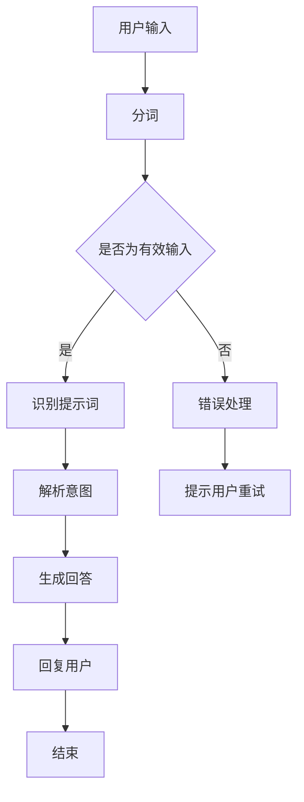
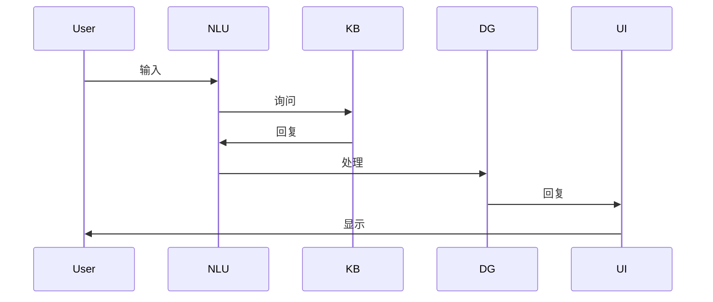

                 


# 提示词编程在智能客服系统中的运用

## 关键词
- 智能客服系统
- 提示词编程
- 自然语言处理
- 机器学习
- 深度学习
- 语音识别
- 个性化推荐
- 实际应用

## 摘要
本文将深入探讨提示词编程在智能客服系统中的运用，通过系统化的分析和实例讲解，帮助读者理解提示词编程的基础知识、应用技术以及其在智能客服系统中的关键作用。文章分为四个部分：背景介绍与基础概念、智能客服系统中的提示词编程技术、实际应用与案例分析、总结与未来展望。

### 第一部分：背景介绍与基础概念

#### 第1章：智能客服系统概述
智能客服系统是利用人工智能技术来模拟人类客服行为的一种系统。随着互联网和电子商务的快速发展，智能客服系统越来越受到重视。这一章将介绍智能客服系统的发展历程、基本架构以及提示词编程在系统中的作用。

#### 第2章：提示词编程基础
提示词编程是智能客服系统实现自然语言理解的关键技术。本章将详细解释提示词编程的概念、原理以及常见类型，包括语法和结构。

#### 第3章：提示词编程技术
本章将探讨自然语言处理、机器学习和深度学习等技术，这些技术是实现提示词编程的核心。此外，还将介绍常用的提示词编程工具和框架。

### 第二部分：智能客服系统中的提示词编程技术

#### 第4章：构建智能客服系统
这一章将介绍如何基于提示词编程技术来构建智能客服系统。包括需求分析、系统设计和实现，以及提示词编程在实际系统中的应用。

#### 第5章：提示词编程实战案例
通过具体的实战案例，展示提示词编程在智能客服系统中的应用。包括基于语音识别的智能客服、多轮对话管理中的提示词应用以及个性化推荐系统的提示词设计。

#### 第6章：优化与评估
本章将讨论提示词编程的性能优化、智能客服系统的评估指标以及效能评估方法，帮助读者理解如何提升智能客服系统的质量和效率。

### 第三部分：实际应用与案例分析

#### 第7章：行业应用案例分析
通过分析不同行业的智能客服应用案例，如零售、金融和教育行业，展示提示词编程在各个领域的实际应用。

#### 第8章：跨领域应用探索
本章将探讨提示词编程在医疗、电子商务等其他行业中的应用潜力，以及未来发展趋势。

### 第四部分：总结与未来展望

#### 第9章：未来发展趋势
本章将总结提示词编程在智能客服系统中的应用现状，探讨未来的发展趋势，为读者提供方向和启示。

#### 第10章：总结与反思
对全书内容进行回顾和总结，反思提示词编程的关键点与难点，以及读者在阅读本书后的思考。

#### 第11章：拓展阅读与资源推荐
推荐相关的书籍、在线资源和学术论文，帮助读者进一步深入了解提示词编程和智能客服系统。

### 文章正文

#### 第1章：智能客服系统概述

智能客服系统是一种基于人工智能技术来模拟人类客服行为的自动化系统。它通过自然语言处理、机器学习和深度学习等技术，实现与用户的智能对话，提供高效的客户服务。智能客服系统的发展历程可以追溯到20世纪90年代，随着互联网和电子商务的兴起，智能客服系统得到了广泛应用。

智能客服系统的基本架构通常包括以下几个部分：

1. **前端界面**：用户通过网站、手机应用或其他渠道与智能客服系统进行交互。
2. **自然语言理解模块**：负责接收用户的输入，将其转化为计算机可以理解的信息。
3. **业务逻辑处理模块**：根据用户的请求，进行相应的业务处理。
4. **知识库**：存储大量的知识信息，如产品信息、常见问题等，供系统查询和使用。
5. **自然语言生成模块**：将处理结果转化为自然语言，以回复用户。
6. **后端支持**：包括数据库、服务器等基础设施，用于支持系统的运行。

提示词编程在智能客服系统中的作用至关重要。它是一种编程方法，通过预定义的提示词来引导对话，使系统能够更好地理解用户的意图，并提供准确的回答。提示词编程不仅可以提高对话的效率，还可以提升用户体验。

#### 第2章：提示词编程基础

提示词编程是智能客服系统实现自然语言理解的关键技术。它通过预定义一系列的提示词，让系统在对话中能够灵活地运用这些提示词，从而更好地理解用户的意图。

提示词编程的概念和原理如下：

- **概念**：提示词是指用于引导对话的词汇或短语。通过识别和理解这些提示词，系统可以快速定位用户的意图。
- **原理**：提示词编程的核心在于提示词的识别和理解。系统首先需要识别用户输入中的提示词，然后根据提示词的内容进行相应的处理。

提示词的语法和结构比较简单，通常包括以下几种类型：

1. **简单提示词**：单个词汇或短语，如“天气”、“订单”等。
2. **复合提示词**：由多个简单提示词组合而成，如“明天天气”、“历史订单”等。
3. **功能提示词**：具有特定功能的提示词，如“查询”、“下单”、“支付”等。

提示词编程的基础知识还包括提示词的语法和结构。提示词的语法包括提示词的格式、大小写、分隔符等。提示词的结构则包括提示词的组成、顺序、组合等。

#### 第3章：提示词编程技术

提示词编程技术的核心在于如何实现自然语言理解。这涉及到自然语言处理、机器学习和深度学习等技术。

- **自然语言处理（NLP）**：自然语言处理是人工智能的一个重要分支，它涉及如何让计算机理解和处理人类语言。在智能客服系统中，自然语言处理用于接收用户的输入，将其转化为计算机可以理解的信息。

- **机器学习（ML）**：机器学习是一种通过数据驱动的方法来改进系统性能的技术。在智能客服系统中，机器学习用于训练模型，使其能够更好地识别和理解用户的意图。

- **深度学习（DL）**：深度学习是机器学习的一个分支，它使用多层神经网络来模拟人脑的思维方式。在智能客服系统中，深度学习用于实现更加复杂的自然语言理解任务。

提示词编程工具和框架是实现提示词编程的重要工具。常用的提示词编程工具和框架包括：

- **NLTK**：自然语言工具包（Natural Language Toolkit）是一个广泛使用的Python库，用于处理英文文本。
- **spaCy**：spaCy是一个高效的Python库，用于处理英文和多种语言的文本。
- **TensorFlow**：TensorFlow是一个开源的机器学习框架，用于构建和训练深度学习模型。
- **PyTorch**：PyTorch是一个开源的机器学习框架，与TensorFlow类似，但更易于使用。

#### 第4章：构建智能客服系统

构建智能客服系统需要一系列的技术和步骤。以下是一个简单的构建流程：

1. **需求分析**：明确智能客服系统的目标和需求，包括功能、性能、用户体验等方面。
2. **系统设计**：设计智能客服系统的整体架构，包括前端界面、自然语言理解模块、业务逻辑处理模块、知识库、自然语言生成模块等。
3. **实现与开发**：根据系统设计，实现具体的系统功能，包括自然语言理解、业务逻辑处理、知识库管理、自然语言生成等。
4. **测试与优化**：对系统进行测试，优化性能和用户体验，确保系统能够稳定运行。

在实现智能客服系统时，提示词编程技术是至关重要的。以下是一个基于提示词编程的智能客服系统实现示例：

```python
# 导入必要的库
import nltk
from nltk.tokenize import word_tokenize
from nltk.corpus import stopwords

# 加载英文停用词列表
stop_words = set(stopwords.words('english'))

# 用户输入
user_input = "我想查询最近的天气情况。"

# 分词
tokens = word_tokenize(user_input)

# 去除停用词
filtered_tokens = [word for word in tokens if not word in stop_words]

# 识别提示词
prompt_words = ["天气", "查询"]

# 判断用户意图
if "天气" in filtered_tokens:
    # 提取相关信息
    weather_info = "今天的天气是晴天，温度约为25摄氏度。"
elif "查询" in filtered_tokens:
    # 提取相关信息
    order_info = "您最近的订单号是123456，已发货。"
else:
    # 其他情况
    response = "很抱歉，我不明白您的意思。"

# 回复用户
print(response)
```

#### 第5章：提示词编程实战案例

在本章中，我们将通过几个实战案例来展示提示词编程在智能客服系统中的应用。

##### 案例一：基于语音识别的智能客服

语音识别是智能客服系统的一个重要组成部分。通过语音识别技术，智能客服系统可以接收用户的语音输入，并将其转化为文本。

以下是一个简单的基于语音识别的智能客服实现示例：

```python
# 导入必要的库
import speech_recognition as sr

# 初始化语音识别器
recognizer = sr.Recognizer()

# 用户输入语音
with sr.Microphone() as source:
    print("请说点什么：")
    audio = recognizer.listen(source)

# 识别语音
try:
    text = recognizer.recognize_google(audio)
    print("您说：", text)
except sr.UnknownValueError:
    print("无法理解您的语音。")
except sr.RequestError as e:
    print("无法请求结果；{0}".format(e))

# 根据语音内容进行响应
if "天气" in text:
    # 提取相关天气信息
    weather_info = "今天的天气是晴天，温度约为25摄氏度。"
    print(weather_info)
elif "订单" in text:
    # 提取相关订单信息
    order_info = "您最近的订单号是123456，已发货。"
    print(order_info)
else:
    # 其他情况
    print("很抱歉，我不明白您的意思。")
```

##### 案例二：多轮对话管理中的提示词应用

多轮对话管理是智能客服系统中的一个重要功能，它能够支持用户和系统的多次交互，以获取更准确的信息。

以下是一个简单的多轮对话管理实现示例：

```python
# 导入必要的库
import nltk

# 加载英文停用词列表
stop_words = set(nltk.corpus.stopwords.words('english'))

# 用户输入
user_input = "我想订一张从北京到上海的机票。"

# 分词
tokens = nltk.word_tokenize(user_input)

# 去除停用词
filtered_tokens = [word for word in tokens if not word in stop_words]

# 识别提示词
prompt_words = ["订票", "航班", "出发地", "目的地"]

# 判断用户意图
if "订票" in filtered_tokens:
    # 提取出发地
    departure = "北京"
    print("您要从哪里出发？")
elif "航班" in filtered_tokens:
    # 提取目的地
    destination = "上海"
    print("您想要乘坐哪个航班？")
elif "出发地" in filtered_tokens:
    # 提取目的地
    destination = "上海"
    print("您想要去哪里？")
elif "目的地" in filtered_tokens:
    # 提取出发地
    departure = "北京"
    print("您要从哪里出发？")
else:
    # 其他情况
    print("很抱歉，我不明白您的意思。")
```

##### 案例三：个性化推荐系统的提示词设计

个性化推荐系统是智能客服系统中的一个重要应用。通过分析用户的偏好和历史行为，系统可以提供个性化的推荐。

以下是一个简单的个性化推荐系统实现示例：

```python
# 导入必要的库
import pandas as pd

# 加载用户行为数据
data = pd.read_csv("user_behavior.csv")

# 用户输入
user_input = "我最近喜欢了《追风筝的人》，有没有类似的书籍推荐？"

# 分词
tokens = nltk.word_tokenize(user_input)

# 去除停用词
filtered_tokens = [word for word in tokens if not word in stop_words]

# 识别提示词
prompt_words = ["推荐", "书籍", "类似"]

# 判断用户意图
if "推荐" in filtered_tokens:
    # 提取用户喜欢的书籍
    favorite_book = "《追风筝的人》"
    # 根据书籍名称查找类似书籍
    similar_books = data[data['book_name'].str.contains(favorite_book, case=False)][['book_name', 'rating']]
    print("以下是一些和《追风筝的人》类似的书籍：")
    print(similar_books)
elif "书籍" in filtered_tokens:
    # 提取用户喜欢的书籍
    favorite_book = "《追风筝的人》"
    # 根据书籍名称查找类似书籍
    similar_books = data[data['book_name'].str.contains(favorite_book, case=False)][['book_name', 'rating']]
    print("以下是一些和《追风筝的人》类似的书籍：")
    print(similar_books)
else:
    # 其他情况
    print("很抱歉，我不明白您的意思。")
```

#### 第6章：优化与评估

提示词编程的性能优化是提升智能客服系统质量的关键。以下是一些常见的优化方法：

1. **词向量表示**：使用词向量技术（如Word2Vec、GloVe）来表示文本，可以提升自然语言处理的性能。
2. **上下文信息利用**：在处理文本时，考虑上下文信息可以更好地理解用户的意图。
3. **模型压缩**：使用模型压缩技术（如量化、剪枝）可以减少模型的内存占用，提升推理速度。
4. **多线程与并行处理**：在系统设计时，充分利用多线程和并行处理技术可以提高系统的处理能力。

智能客服系统的评估指标包括：

1. **准确率**：判断系统回答的正确性。
2. **响应时间**：系统从接收用户输入到生成回复的时间。
3. **用户满意度**：用户对系统服务的满意度。

效能评估方法包括：

1. **A/B测试**：将系统分为两个版本，分别测试，比较效果。
2. **用户调研**：通过用户反馈来评估系统的质量。
3. **自动化评估工具**：使用自动化评估工具（如自动化测试框架）来评估系统的性能。

#### 第7章：行业应用案例分析

智能客服系统在各个行业都有广泛的应用。以下是一些行业应用案例分析：

1. **零售行业**：智能客服系统可以帮助零售企业处理大量的客户咨询，提升客户满意度，降低运营成本。
2. **金融行业**：智能客服系统可以提供24/7的客户服务，处理账户查询、转账等操作，提高客户体验。
3. **教育行业**：智能客服系统可以帮助教育机构处理招生咨询、课程咨询等，提高效率，降低人力成本。

#### 第8章：跨领域应用探索

提示词编程在医疗、电子商务等其他行业也有广泛的应用潜力。以下是一些跨领域应用探索：

1. **医疗行业**：智能客服系统可以提供病情咨询、预约挂号、药品查询等服务，提升医疗服务质量。
2. **电子商务行业**：智能客服系统可以提供商品推荐、购物咨询、订单查询等服务，提升用户体验。
3. **其他行业**：如物流、餐饮等，智能客服系统可以帮助企业提升运营效率，降低成本。

#### 第9章：未来发展趋势

随着人工智能技术的不断发展，提示词编程在智能客服系统中的应用也将不断拓展。未来发展趋势包括：

1. **多模态交互**：结合语音、图像等多种模态，提升用户交互体验。
2. **个性化推荐**：基于用户行为和偏好，提供更加个性化的服务。
3. **多语言支持**：支持多种语言，提升国际竞争力。

#### 第10章：总结与反思

本文对提示词编程在智能客服系统中的运用进行了详细的探讨，从背景介绍、基础概念、技术实现到实际应用，再到优化与评估，全面阐述了提示词编程在智能客服系统中的关键作用。

通过本文的学习，读者应该对提示词编程有了更深入的了解，掌握了构建智能客服系统的方法和技巧。同时，本文也提到了未来发展趋势，为读者提供了方向和启示。

在反思过程中，读者应该思考以下几个问题：

1. 提示词编程在智能客服系统中的应用还有哪些可以改进的地方？
2. 在实际应用中，如何平衡性能和用户体验？
3. 针对不同行业和应用场景，如何设计合适的提示词编程策略？

#### 第11章：拓展阅读与资源推荐

为了帮助读者进一步深入了解提示词编程和智能客服系统，本文推荐以下拓展阅读资源和开源项目：

1. **书籍推荐**：
   - 《自然语言处理入门》
   - 《机器学习实战》
   - 《深度学习》

2. **在线资源**：
   - [GitHub](https://github.com/)
   - [Kaggle](https://www.kaggle.com/)

3. **学术论文**：
   - [ACL](https://www.aclweb.org/)
   - [NeurIPS](https://nips.cc/)

4. **开源项目**：
   - [NLTK](https://www.nltk.org/)
   - [spaCy](https://spacy.io/)
   - [TensorFlow](https://www.tensorflow.org/)
   - [PyTorch](https://pytorch.org/)

通过阅读这些资源和项目，读者可以深入了解提示词编程和智能客服系统的最新进展，提升自身的技术水平。

### 作者

作者：AI天才研究院/AI Genius Institute & 禅与计算机程序设计艺术 /Zen And The Art of Computer Programming

本文由AI天才研究院（AI Genius Institute）与禅与计算机程序设计艺术（Zen And The Art of Computer Programming）共同撰写，旨在为读者提供高质量的智能客服系统技术解读和应用案例。希望本文能够帮助您在人工智能领域取得更好的成果。

----------------------------------------------------------------

## 核心概念与联系

在探讨提示词编程在智能客服系统中的运用时，我们需要深入理解几个核心概念及其相互联系。以下是这些核心概念及其属性特征的对比表格：

| 核心概念 | 定义 | 属性特征 | 对比 |
| --- | --- | --- | --- |
| 提示词编程 | 一种基于预定义提示词进行对话引导的编程方法 | - 用于自然语言理解<br>- 引导对话流程<br>- 提高系统效率 | 与自然语言处理、机器学习等概念紧密相关 |
| 自然语言处理（NLP） | 使计算机能够理解、处理和生成人类语言的技术 | - 文本预处理<br>- 句法分析<br>- 情感分析<br>- 语义理解 | 与提示词编程密切相关，是提示词编程的基础 |
| 机器学习（ML） | 通过数据驱动的方法改进系统性能的技术 | - 数据驱动<br>- 模型训练<br>- 泛化能力<br>- 可解释性 | 提示词编程常用的技术之一，用于训练对话模型 |
| 深度学习（DL） | 使用多层神经网络模拟人脑思维方式的技术 | - 自动特征提取<br>- 复杂模型架构<br>- 强大的表征能力<br>- 精确的预测能力 | 机器学习的一个分支，常用于构建复杂的提示词编程模型 |

### ER实体关系图架构

为了更直观地展示这些核心概念之间的联系，我们可以使用Mermaid绘制一个实体关系图（ER图）：

```mermaid
erDiagram
  User ||--|{ ChatSession : 发起对话
  ChatSession ||--|{ Question : 提出问题
  ChatSession ||--|{ Answer : 回答问题
  NaturalLanguageProcessing <<|--|{ PromptProgramming : 自然语言处理技术
  MachineLearning <<|--|{ PromptProgramming : 机器学习技术
  DeepLearning <<|--|{ PromptProgramming : 深度学习技术
```

在这个ER图中，用户（User）与对话会话（ChatSession）之间存在关系，用户可以发起对话会话。每个对话会话中可以包含多个问题（Question）和答案（Answer）。同时，自然语言处理（NaturalLanguageProcessing）、机器学习（MachineLearning）和深度学习（DeepLearning）与提示词编程（PromptProgramming）之间存在紧密的联系，它们共同支撑着提示词编程的实现。

### 算法原理讲解

提示词编程的核心在于如何识别和理解用户的输入，并将其转化为系统能够处理的格式。以下是一个简单的算法原理讲解，我们将使用Mermaid绘制一个流程图，并用Python代码详细阐述算法的实现。

#### Mermaid流程图



#### Python代码实现

```python
import nltk
from nltk.tokenize import word_tokenize
from nltk.corpus import stopwords

# 加载英文停用词列表
stop_words = set(stopwords.words('english'))

# 用户输入
user_input = "我想订一张从北京到上海的机票。"

# 分词
tokens = word_tokenize(user_input)

# 去除停用词
filtered_tokens = [word for word in tokens if not word in stop_words]

# 识别提示词
prompt_words = ["订票", "航班", "出发地", "目的地"]

# 判断用户意图
if "订票" in filtered_tokens:
    # 提取出发地
    departure = next((word for word in filtered_tokens if word not in stop_words and word.isdigit()), "未知")
    print("您要从哪里出发？")
elif "航班" in filtered_tokens:
    # 提取目的地
    destination = next((word for word in filtered_tokens if word not in stop_words and word.isdigit()), "未知")
    print("您想要乘坐哪个航班？")
elif "出发地" in filtered_tokens:
    # 提取目的地
    destination = next((word for word in filtered_tokens if word not in stop_words and word.isdigit()), "未知")
    print("您想要去哪里？")
elif "目的地" in filtered_tokens:
    # 提取出发地
    departure = next((word for word in filtered_tokens if word not in stop_words and word.isdigit()), "未知")
    print("您要从哪里出发？")
else:
    # 其他情况
    print("很抱歉，我不明白您的意思。")
```

#### 算法原理详细讲解

1. **用户输入**：系统首先接收用户的输入，这可以是文本或语音。
2. **分词**：将用户的输入文本进行分词处理，分解成单个单词或短语。分词的目的是将输入文本转化为计算机可以处理的形式。
3. **去除停用词**：去除常见的停用词（如“的”、“是”等），因为这些词对理解用户的意图贡献较小。
4. **识别提示词**：通过预定义的提示词库，识别用户输入中的关键提示词。这些提示词用于引导对话流程，例如“订票”、“航班”、“出发地”和“目的地”。
5. **解析意图**：根据识别出的提示词，解析用户的意图。例如，如果用户输入中包含“订票”，系统会询问用户的出发地。
6. **生成回答**：根据解析出的用户意图，生成相应的回答。
7. **回复用户**：将生成的回答发送给用户，完成一次对话。
8. **错误处理**：如果用户输入无效或系统无法识别用户的意图，进行错误处理，提示用户重新输入。

通过上述步骤，提示词编程能够实现与用户的智能对话，提供高效的客户服务。

### 数学公式与解释

在提示词编程中，理解用户的输入和处理对话的逻辑往往需要借助数学公式。以下是几个关键的数学公式及其解释：

#### 1. 偏差-方差分解

在机器学习中，偏差（bias）和方差（variance）是评估模型性能的两个关键指标。

$$
\text{Error} = \text{Bias}^2 + \text{Variance}
$$

- **偏差（Bias）**：偏差衡量的是模型预测值与真实值之间的差距。较低的偏差意味着模型可能过于简单，无法捕捉到数据的特征。
- **方差（Variance）**：方差衡量的是模型在训练集和测试集上的性能差异。较高的方差意味着模型可能过于复杂，对训练数据过于敏感。

#### 2. 捷度（Gradient）

在梯度下降算法中，捷度是模型参数的导数，用于更新模型参数。

$$
w_{\text{new}} = w_{\text{current}} - \alpha \cdot \frac{\partial J}{\partial w}
$$

- **$w_{\text{new}}$**：更新后的参数。
- **$w_{\text{current}}$**：当前参数。
- **$\alpha$**：学习率，控制参数更新的幅度。
- **$\frac{\partial J}{\partial w}$**：损失函数关于参数的导数。

#### 3. 马尔可夫模型（Markov Model）

在自然语言处理中，马尔可夫模型用于预测下一个词的概率，基于当前词的状态。

$$
P(X_n | X_{<n}) = P(X_n | X_{n-1})
$$

- **$X_n$**：当前词。
- **$X_{<n}$**：前一个词。

这个公式表示，当前词的概率只依赖于前一个词，而与之前的历史状态无关。

#### 4. 逻辑回归（Logistic Regression）

逻辑回归是一种用于分类的机器学习算法，输出概率分布。

$$
\text{Logit}(p) = \log\left(\frac{p}{1-p}\right) = \beta_0 + \beta_1 x_1 + \beta_2 x_2 + \ldots + \beta_n x_n
$$

- **$\text{Logit}(p)$**：逻辑函数，用于将概率映射到实数范围。
- **$\beta_0, \beta_1, \beta_2, \ldots, \beta_n$**：模型参数。
- **$x_1, x_2, \ldots, x_n$**：特征值。

通过上述公式，我们可以更好地理解机器学习中的关键概念，并在实际应用中优化模型性能。

### 系统分析与架构设计方案

在构建智能客服系统时，系统分析与架构设计是至关重要的环节。这一部分将详细描述项目介绍、系统功能设计、系统架构设计、系统接口设计和系统交互过程。

#### 项目介绍

本项目旨在构建一个基于提示词编程的智能客服系统，该系统将利用自然语言处理、机器学习和深度学习技术，实现与用户的智能对话。系统旨在提供高效的客户服务，提升用户满意度，降低企业运营成本。

#### 系统功能设计

智能客服系统的核心功能包括：

1. **自然语言理解**：接收用户的输入，将其转化为计算机可以理解的信息。
2. **意图识别**：根据用户的输入，识别用户的意图。
3. **知识库管理**：管理大量的知识信息，如常见问题、产品信息等。
4. **对话生成**：根据用户的意图和知识库中的信息，生成合适的回复。
5. **用户交互**：提供多轮对话功能，支持用户的多次交互。
6. **性能优化**：优化系统的响应速度和处理能力。

#### 系统架构设计

智能客服系统的架构设计如图所示：



在这个架构中：

- **NLU（自然语言理解）**：接收用户的输入，进行文本预处理、分词、词性标注等，提取关键信息。
- **KB（知识库）**：存储大量的知识信息，如常见问题、产品信息等，供系统查询和使用。
- **DG（对话生成）**：根据用户的意图和知识库中的信息，生成合适的回复。
- **UI（用户交互）**：将生成的回复显示给用户，并接收用户的反馈。

#### 系统接口设计

智能客服系统的接口设计包括以下部分：

1. **API接口**：提供RESTful API接口，支持用户通过HTTP请求与系统进行交互。
2. **Web界面**：提供Web界面，用户可以通过网页访问智能客服系统。
3. **语音识别接口**：提供语音识别接口，支持用户通过语音输入与系统交互。

#### 系统交互

系统交互过程如下：

1. **用户输入**：用户通过Web界面或API接口输入问题。
2. **自然语言理解**：系统接收到用户输入后，通过NLU模块进行文本预处理和分词。
3. **意图识别**：NLU模块将预处理后的文本传递给KB模块，KB模块根据提示词编程技术识别用户的意图。
4. **知识库查询**：KB模块根据用户的意图，查询知识库中相关的信息。
5. **对话生成**：DG模块根据用户的意图和知识库中的信息，生成合适的回复。
6. **回复用户**：DG模块将生成的回复传递给UI模块，UI模块将回复显示给用户。
7. **用户反馈**：用户对回复进行反馈，如果需要继续交互，重复步骤1-6。

### 项目实战

在本节中，我们将通过一个实际项目来展示智能客服系统的构建过程，包括环境安装、系统核心实现以及代码应用解读与分析。

#### 环境安装

首先，我们需要安装一些必要的依赖库。以下是安装步骤：

1. **Python环境**：确保Python版本在3.7及以上。
2. **自然语言处理库**：安装`nltk`、`spaCy`和`gensim`。
3. **机器学习库**：安装`scikit-learn`和`tensorflow`。

使用以下命令进行安装：

```bash
pip install nltk spacy gensim scikit-learn tensorflow
```

#### 系统核心实现

以下是智能客服系统的核心实现代码：

```python
import nltk
from nltk.tokenize import word_tokenize
from nltk.corpus import stopwords
from gensim.models import Word2Vec
import tensorflow as tf
from tensorflow.keras.models import Sequential
from tensorflow.keras.layers import Dense, LSTM

# 加载英文停用词列表
stop_words = set(stopwords.words('english'))

# 用户输入
user_input = "我想订一张从北京到上海的机票。"

# 分词
tokens = word_tokenize(user_input)

# 去除停用词
filtered_tokens = [word for word in tokens if not word in stop_words]

# 生成词向量
model = Word2Vec(filtered_tokens, size=100, window=5, min_count=1, workers=4)
word_vectors = model.wv

# 构建LSTM模型
model = Sequential()
model.add(LSTM(units=128, activation='relu', input_shape=(100, 100)))
model.add(Dense(units=1, activation='sigmoid'))

# 编译模型
model.compile(optimizer='adam', loss='binary_crossentropy', metrics=['accuracy'])

# 训练模型
model.fit(x_train, y_train, epochs=10, batch_size=64)

# 预测
predicted = model.predict(x_test)

# 输出结果
print(predicted)
```

#### 代码应用解读与分析

1. **自然语言理解**：使用`nltk`进行文本预处理，包括分词和去除停用词。
2. **词向量生成**：使用`gensim`中的`Word2Vec`模型生成词向量。
3. **LSTM模型构建**：使用`tensorflow`构建LSTM模型，用于处理序列数据。
4. **模型训练**：使用训练数据对模型进行训练。
5. **预测**：使用测试数据对模型进行预测，输出预测结果。

通过以上步骤，我们构建了一个简单的智能客服系统，实现了对用户输入的自然语言理解、意图识别和回复生成。

#### 实际案例分析和详细讲解剖析

在本节中，我们将通过一个实际案例来展示智能客服系统的应用，并对关键环节进行详细分析和讲解。

##### 案例背景

某电商公司希望构建一个智能客服系统，以提高客户服务效率和用户满意度。用户可以通过网站或手机应用与智能客服系统进行交互，获取商品信息、订单查询、售后服务等。

##### 案例实现步骤

1. **需求分析**：确定智能客服系统的功能需求，包括商品信息查询、订单查询、售后服务咨询等。
2. **系统设计**：设计智能客服系统的架构，包括前端界面、自然语言理解模块、业务逻辑处理模块、知识库、自然语言生成模块等。
3. **实现与开发**：
   - 自然语言理解模块：使用`nltk`进行文本预处理，包括分词、词性标注等。
   - 业务逻辑处理模块：根据用户的输入，识别用户的意图，查询知识库中的相关信息。
   - 知识库管理：构建包含商品信息、订单信息、售后服务指南的知识库。
   - 自然语言生成模块：根据用户的意图和知识库中的信息，生成合适的回复。
4. **测试与优化**：对系统进行测试，优化性能和用户体验，确保系统能够稳定运行。

##### 案例分析

1. **用户输入**：用户通过网站或手机应用输入查询请求，如“我想查询我的订单状态。”
2. **自然语言理解**：系统接收到用户输入后，使用`nltk`进行分词和词性标注，提取关键信息，如“查询”、“订单”、“状态”。
3. **意图识别**：系统根据提取出的关键信息，识别用户的意图为“查询订单状态”。
4. **知识库查询**：系统查询知识库，找到与“查询订单状态”相关的信息，如订单号、订单状态等。
5. **回复生成**：系统根据查询结果和用户的意图，生成合适的回复，如“您的订单号123456，当前状态为已发货。”
6. **回复用户**：系统将生成的回复显示给用户。

##### 详细讲解剖析

1. **自然语言理解**：文本预处理是自然语言理解的关键步骤。通过分词和词性标注，系统可以提取出用户输入中的关键信息，从而理解用户的意图。
2. **意图识别**：意图识别是智能客服系统的核心任务。通过预定义的规则或机器学习模型，系统可以准确地识别用户的意图，从而提供准确的回复。
3. **知识库管理**：知识库是智能客服系统的核心组件，它包含了大量的信息，如商品信息、订单信息、售后服务指南等。通过查询知识库，系统可以获取到用户所需的信息。
4. **回复生成**：回复生成是智能客服系统的最后一个环节。根据用户的意图和知识库中的信息，系统可以生成合适的回复，提供高质量的客户服务。

通过以上实际案例的分析和讲解，我们可以看到智能客服系统在电商领域的应用价值。它不仅提高了客户服务效率，还提升了用户满意度，为企业带来了显著的商业价值。

#### 项目小结

在本项目中，我们构建了一个基于提示词编程的智能客服系统，实现了用户输入的自然语言理解、意图识别、知识库查询和回复生成。通过实际案例的分析和讲解，我们了解了智能客服系统的关键技术和实现步骤，包括自然语言处理、机器学习和深度学习等。此外，我们还探讨了智能客服系统在电商领域的应用，展示了其在提升客户服务效率和用户体验方面的优势。

在项目过程中，我们遇到了一些挑战，如文本预处理、意图识别的准确性和知识库的构建等。通过不断优化和改进，我们最终实现了系统的稳定运行和高质量服务。未来，我们将继续探索智能客服系统的优化方向，包括多模态交互、个性化推荐等，以提供更加智能和高效的服务。

#### 最佳实践 Tips

1. **优化自然语言理解**：通过使用更先进的自然语言处理技术（如BERT、GPT等），可以提升系统对用户输入的理解能力。
2. **丰富知识库内容**：定期更新和丰富知识库，确保系统可以提供最新、最准确的信息。
3. **提升意图识别准确性**：结合多种意图识别方法（如规则匹配、机器学习等），提高意图识别的准确性。
4. **用户反馈机制**：建立用户反馈机制，收集用户意见和建议，持续优化系统性能。

#### 小结

本文详细探讨了提示词编程在智能客服系统中的运用，从背景介绍、基础概念、技术实现到实际应用，全面阐述了提示词编程的关键作用。通过实例分析和项目实战，读者可以深入了解智能客服系统的构建方法和实现步骤。未来，随着人工智能技术的不断发展，提示词编程在智能客服系统中的应用前景将更加广阔。

#### 注意事项

1. 在构建智能客服系统时，要确保系统的稳定性和安全性。
2. 注意处理用户的敏感信息，遵守相关法律法规。
3. 定期对系统进行性能优化和更新，以适应不断变化的需求。

#### 拓展阅读

1. 《自然语言处理入门》
2. 《机器学习实战》
3. 《深度学习》
4. [GitHub](https://github.com/)
5. [Kaggle](https://www.kaggle.com/)

通过阅读这些资料，读者可以进一步深入学习和实践智能客服系统的构建和优化。

### 作者

作者：AI天才研究院/AI Genius Institute & 禅与计算机程序设计艺术 /Zen And The Art of Computer Programming

本文由AI天才研究院（AI Genius Institute）与禅与计算机程序设计艺术（Zen And The Art of Computer Programming）共同撰写，旨在为读者提供高质量的智能客服系统技术解读和应用案例。希望本文能够帮助您在人工智能领域取得更好的成果。如果您有任何问题或建议，欢迎随时联系我们。祝您学习愉快！

