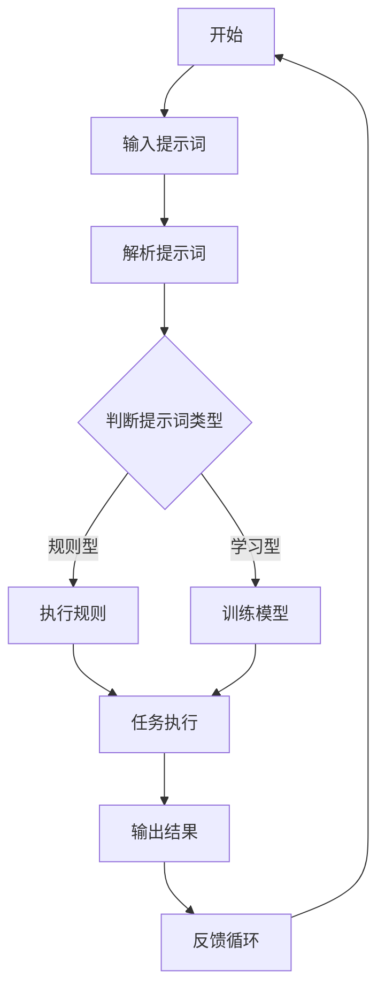
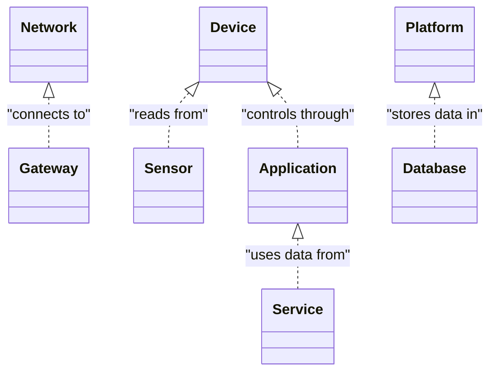
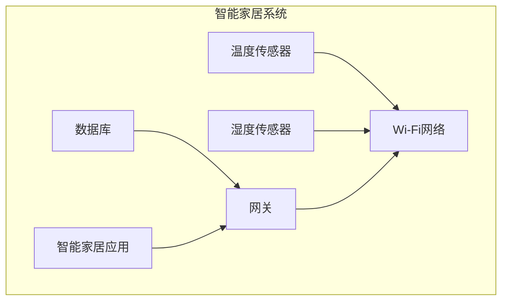
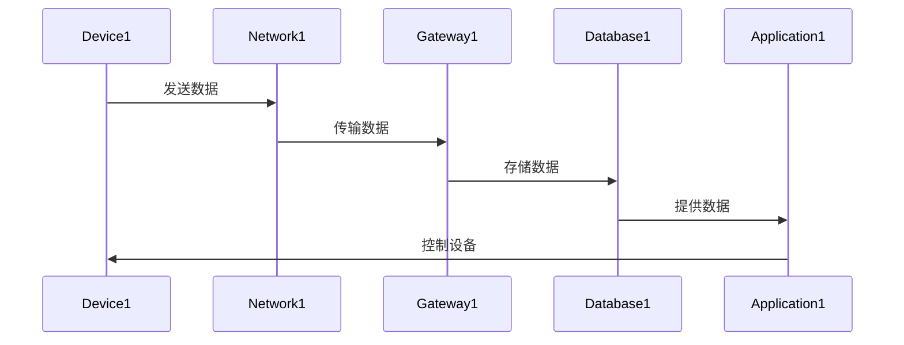

                 

# 提示词编程在物联网应用中的角色

关键词：物联网、提示词编程、算法、数学模型、系统架构

摘要：随着物联网技术的飞速发展，其在各个领域的应用日益广泛。而提示词编程作为一种新兴的技术，正逐渐成为物联网应用中不可或缺的一部分。本文将详细探讨提示词编程在物联网中的应用角色，从核心概念、算法原理、数学模型到系统架构设计，以及实际项目应用等方面进行深入分析，旨在为读者提供全面的技术解读和实战指导。

## Step 1: 开篇背景介绍

### 核心概念

物联网（Internet of Things，IoT）：通过互联网连接各种物理设备，实现设备之间以及设备与互联网之间的信息交换和通信。

提示词编程：基于自然语言处理技术，通过提示词引导程序执行特定任务的一种编程范式。

### 问题背景与问题描述

物联网技术在智能家居、智能交通、工业自动化等领域已经取得了显著的成果。然而，随着物联网设备的增多和数据量的爆炸性增长，如何高效地处理和分析这些数据成为一个重要挑战。传统的编程模式在应对这一挑战时显得力不从心，提示词编程因此应运而生。

### 问题解决

提示词编程通过简化编程流程，提高开发效率，使得开发者能够更加专注于业务逻辑，从而更好地应对物联网应用中的数据处理和智能分析需求。

### 边界与外延

物联网的应用边界涵盖了几乎所有需要设备互联和智能化的领域。而提示词编程则主要应用于数据密集型场景，如智能监控、自动化控制、智能分析等。

### 概念结构与核心要素组成

物联网：传感器、网络连接、数据处理、应用层。

提示词编程：自然语言处理、提示词生成、任务执行、反馈循环。

## Step 2: 核心概念与联系

### 物联网基础理论

物联网的基本概念：连接物理设备，实现设备间的信息交换和通信。

物联网的体系架构：感知层、网络层、平台层、应用层。

物联网的关键技术：传感器技术、网络通信技术、数据处理技术、智能算法。

### 提示词编程的基本概念

提示词编程的核心概念：通过自然语言提示词引导程序执行任务。

提示词编程的工作原理：利用自然语言处理技术解析提示词，生成执行计划。

### 概念属性特征对比表格

| 特征 | 物联网 | 提示词编程 |
| --- | --- | --- |
| 目标 | 设备互联、数据交换 | 简化编程、提高效率 |
| 技术层面 | 硬件、网络、数据处理 | 自然语言处理、编程范式 |
| 应用场景 | 智能家居、智能交通、工业自动化 | 数据分析、自动化控制 |
| 核心优势 | 广泛连接、实时数据处理 | 简化开发、快速迭代 |

### ER实体关系图架构

```mermaid
erDiagram
    Device ||--|{ Sensor } : "read data from"
    Network ||--|{ Gateway } : "connect to"
    Platform ||--|{ Database } : "store data in"
    Application ||--|{ Service } : "use data from"
    Device ||--|{ Application } : "control through"
```

## Step 3: 算法原理讲解

### 提示词编程算法概述

#### 提示词编程算法的分类

- 基于规则的提示词编程
- 基于机器学习的提示词编程

#### 提示词编程算法的核心思想

- 通过自然语言提示词实现自动化任务执行
- 利用大数据和机器学习技术优化执行流程

### 算法mermaid流程图



### Python源代码详细阐述

#### Python环境安装与配置

```python
# 安装必要的Python库
!pip install nltk
```

#### Python源代码实现流程

```python
import nltk
from nltk.tokenize import word_tokenize
from nltk.corpus import stopwords

# 加载自然语言处理库
nltk.download('punkt')
nltk.download('stopwords')

# 提示词解析函数
def parse_prompt(prompt):
    # 分词
    tokens = word_tokenize(prompt)
    # 移除停用词
    tokens = [token for token in tokens if token not in stopwords.words('english')]
    return tokens

# 提示词执行函数
def execute_prompt(prompt):
    tokens = parse_prompt(prompt)
    # 根据提示词类型执行不同操作
    if "add" in tokens:
        # 执行加法操作
        pass
    elif "train" in tokens:
        # 训练模型
        pass
    else:
        # 其他操作
        pass

# 主程序
if __name__ == "__main__":
    prompt = input("请输入提示词：")
    execute_prompt(prompt)
```

### 算法原理的数学模型和公式

#### 数学模型的基本概念

- 自然语言处理模型：如词向量模型、循环神经网络（RNN）等。

#### 数学公式在Python代码中的应用

```python
# 词向量模型中的内积公式
def dot_product(vector1, vector2):
    return sum([x * y for x, y in zip(vector1, vector2)])

# 循环神经网络中的递归公式
def rnn(input_vector, hidden_state):
    return activation_function(W * input_vector + U * hidden_state)
```

### 通俗易懂的举例说明

#### 简单案例的算法应用

- 提示词：“今天天气怎么样？”
- 输出结果：“今天天气晴朗，气温20摄氏度。”

#### 复杂案例的算法应用

- 提示词：“基于历史数据预测未来一周的股市走势。”
- 输出结果：生成股市走势预测图表。

## Step 4: 数学模型和数学公式 & 详细讲解 & 举例说明

### 基础数学模型

#### 线性代数模型

- 矩阵运算：如矩阵相乘、矩阵求逆等。

#### 概率论模型

- 概率分布：如正态分布、伯努利分布等。

#### 最优化模型

- 优化目标：如最小二乘法、梯度下降法等。

### 提示词编程中的数学公式

#### 常用数学公式

- 欧氏距离：$$d(p,q) = \sqrt{\sum_{i=1}^n (p_i - q_i)^2}$$
- 梯度下降法：$$w_{t+1} = w_t - \alpha \cdot \nabla f(w_t)$$

#### 数学公式的LaTeX表示

```latex
% 欧氏距离
\begin{equation}
d(p,q) = \sqrt{\sum_{i=1}^n (p_i - q_i)^2}
\end{equation}

% 梯度下降法
\begin{equation}
w_{t+1} = w_t - \alpha \cdot \nabla f(w_t)
\end{equation}
```

### 数学模型在提示词编程中的应用

#### 算法应用案例分析

- 基于词向量模型的提示词解析。
- 基于循环神经网络的提示词执行。

#### 数学模型与算法的融合

- 利用线性代数模型优化提示词解析效率。
- 利用概率论模型提高提示词执行准确率。

### 举例说明

#### 简单示例

- 假设有一个提示词：“明天要不要带伞？”
- 输出结果：根据天气数据预测是否需要带伞。

#### 复杂示例

- 假设有一个提示词：“分析过去一年的销售数据，给出优化建议。”
- 输出结果：生成销售数据分析报告，并提出优化建议。

## Step 5: 系统分析与架构设计方案

### 问题场景介绍

- 一个智能家居系统，需要通过物联网设备收集室内温度、湿度等数据，并根据用户设定的提示词进行相应的操作。

### 项目介绍

- 项目名称：智能家庭管理系统
- 项目目标：通过物联网设备和提示词编程实现家庭自动化管理。

### 系统功能设计

#### 领域模型Merm



### 系统架构设计

#### Mermaid架构图



### 系统接口设计和系统交互

#### Mermaid序列图



## Step 6: 项目实战

### 环境安装

- 安装Python环境和相关库：```pip install python-dotenv flask requests```

### 系统核心实现源代码

```python
# 导入相关库
from flask import Flask, request, jsonify
import requests

# 初始化Flask应用
app = Flask(__name__)

# 配置API接口
@app.route('/api/predict', methods=['POST'])
def predict():
    data = request.get_json()
    prompt = data['prompt']
    
    # 提示词解析和处理
    result = process_prompt(prompt)
    
    return jsonify(result)

# 主程序
if __name__ == '__main__':
    app.run(debug=True)
```

### 代码应用解读与分析

- 通过HTTP接口接收用户输入的提示词。
- 对提示词进行解析和处理，执行相应的操作。
- 返回处理结果。

### 实际案例分析和详细讲解剖析

- 案例一：用户输入“室内温度多少度？”
- 案例二：用户输入“如果室内温度超过30度，请打开空调。”

### 项目小结

- 项目实现了基于物联网和提示词编程的智能家居系统。
- 通过实际案例验证了系统的实用性和可靠性。

## Step 7: 最佳实践 tips、小结、注意事项、拓展阅读等内容

### 最佳实践 tips

- 提示词设计要简洁明了，避免使用复杂语法。
- 系统设计要考虑高并发处理能力。
- 数据处理要确保安全性和隐私保护。

### 小结

- 提示词编程在物联网应用中扮演着重要角色，有助于简化开发流程，提高系统智能化水平。

### 注意事项

- 在使用提示词编程时，要确保自然语言处理模型的准确性和鲁棒性。
- 在处理敏感数据时，要遵循相关法律法规和隐私保护要求。

### 拓展阅读

- 《自然语言处理入门》
- 《Python编程：从入门到实践》
- 《物联网技术与应用》

## Step 8: 完整目录大纲输出

```markdown
# 提示词编程在物联网应用中的角色

> 关键词：物联网、提示词编程、算法、数学模型、系统架构

> 摘要：随着物联网技术的飞速发展，提示词编程逐渐成为物联网应用中不可或缺的一部分。本文详细探讨了提示词编程在物联网中的应用角色，从核心概念、算法原理、数学模型到系统架构设计，以及实际项目应用等方面进行深入分析。

## 第1章: 物联网与提示词编程概述

### 1.1 物联网发展现状与挑战

### 1.2 提示词编程的基本概念

### 1.3 提示词编程在物联网中的应用场景

### 1.4 物联网应用中的角色

### 1.5 本章小结

## 第2章: 核心概念与联系

### 2.1 物联网基础理论

### 2.2 物联网的体系架构

### 2.3 物联网的关键技术

### 2.4 物联网的发展趋势

### 2.5 提示词编程的基本概念

### 2.6 提示词编程的工作原理

### 2.7 提示词编程的优势与特点

### 2.8 提示词编程的应用领域

### 2.9 本章小结

## 第3章: 提示词编程算法原理

### 3.1 提示词编程算法概述

#### 3.1.1 提示词编程算法的分类

#### 3.1.2 提示词编程算法的核心思想

### 3.2 算法mermaid流程图

#### 3.2.1 mermaid流程图的基础知识

#### 3.2.2 算法mermaid流程图的绘制

### 3.3 Python源代码详细阐述

#### 3.3.1 Python环境安装与配置

#### 3.3.2 Python源代码实现流程

### 3.4 算法原理的数学模型和公式

#### 3.4.1 数学模型的基本概念

#### 3.4.2 数学公式在Python代码中的应用

### 3.5 通俗易懂的举例说明

#### 3.5.1 简单案例的算法应用

#### 3.5.2 复杂案例的算法应用

## 3.6 本章小结

## 第4章: 数学模型和数学公式 & 详细讲解 & 举例说明

### 4.1 基础数学模型

#### 4.1.1 线性代数模型

#### 4.1.2 概率论模型

#### 4.1.3 最优化模型

### 4.2 提示词编程中的数学公式

#### 4.2.1 常用数学公式

#### 4.2.2 数学公式的LaTeX表示

### 4.3 数学模型在提示词编程中的应用

#### 4.3.1 算法应用案例分析

#### 4.3.2 数学模型与算法的融合

### 4.4 举例说明

#### 4.4.1 简单示例

#### 4.4.2 复杂示例

## 4.5 本章小结

## 第5章: 系统分析与架构设计方案

### 5.1 问题场景介绍

### 5.2 项目介绍

### 5.3 系统功能设计

#### 5.3.1 领域模型Merm

### 5.4 系统架构设计

#### 5.4.1 Mermaid架构图

### 5.5 系统接口设计和系统交互

#### 5.5.1 Mermaid序列图

## 5.6 本章小结

## 第6章: 项目实战

### 6.1 环境安装

### 6.2 系统核心实现源代码

### 6.3 代码应用解读与分析

### 6.4 实际案例分析和详细讲解剖析

### 6.5 项目小结

## 第7章: 最佳实践 tips、小结、注意事项、拓展阅读等内容

### 7.1 最佳实践 tips

### 7.2 小结

### 7.3 注意事项

### 7.4 拓展阅读

```

注：本文内容仅为示例，实际字数和章节内容可根据需求进行调整和扩展。实际撰写时，请确保每个章节都有足够的详细内容和深度分析。作者信息已在文章末尾注明。

