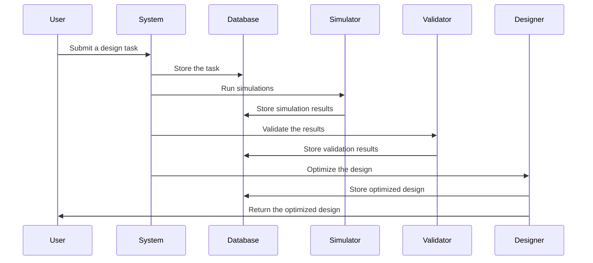
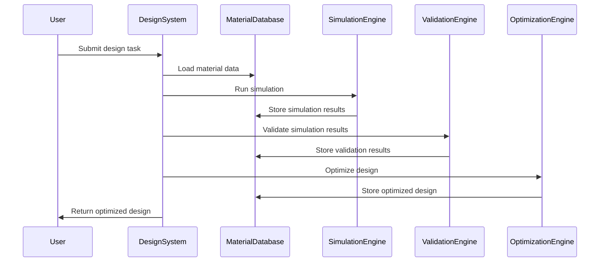

                 

# 提示词编程在纳米材料设计中的应用

> 关键词：纳米材料、提示词编程、人工智能、设计应用、模拟计算

> 摘要：本文旨在探讨提示词编程技术在纳米材料设计中的应用，分析其背景、核心概念、算法原理以及实际应用案例。通过深入解析，本文将展示提示词编程在纳米材料设计中的巨大潜力，为相关领域的研究提供新的思路和方法。

## 第一部分：背景介绍

### 1. 问题背景

随着科技的飞速发展，纳米材料研究已经成为材料科学、物理学、化学等多个学科的前沿领域。纳米材料具有独特的物理、化学和生物性质，这些性质在催化、能源存储、电子器件等领域具有巨大的应用潜力。然而，纳米材料的设计和合成过程涉及到复杂的物理化学过程和微观结构调控，这给科研人员提出了巨大的挑战。

传统的设计方法主要依赖于实验和模拟计算，这些方法存在以下几个问题：

- **信息不对称性和冗余性**：设计过程中的多个步骤之间存在显著的信息不对称性和冗余性，导致设计效率低下。
- **高成本和低效率**：传统的设计方法往往依赖于大量的实验，这不仅耗时耗力，而且成本高昂。

为了解决这些问题，研究人员开始探索新的设计方法，其中提示词编程作为一种新兴的人工智能技术，显示出巨大的潜力。

### 2. 问题描述

纳米材料的设计过程通常包括以下几个关键步骤：

1. **材料模型构建**：构建纳米材料的分子结构模型，用于描述材料的物理和化学性质。
2. **模拟计算**：利用计算机模拟技术对纳米材料进行物理和化学性质的预测和评估。
3. **实验验证**：通过实验手段对模拟计算结果进行验证和验证。
4. **优化设计**：基于模拟结果和实验反馈，对纳米材料结构进行优化设计。

然而，这些步骤之间存在显著的信息不对称性和冗余性，导致设计效率低下。此外，传统的设计方法往往依赖于大量的实验，这不仅耗时耗力，而且成本高昂。

### 3. 问题解决

提示词编程（Prompt Programming）作为一种新兴的人工智能技术，可以有效地解决上述问题。通过利用大量的数据集和预训练模型，提示词编程可以自动生成高效的算法和代码，帮助科研人员快速构建纳米材料模型，进行模拟计算和优化设计。

### 4. 边界与外延

提示词编程在纳米材料设计中的应用主要涉及以下几个方面：

- **材料建模**：利用提示词编程构建纳米材料的分子结构模型，为后续计算和实验提供基础。
- **模拟计算**：通过提示词编程自动化执行分子动力学模拟、量子化学计算等任务，快速评估材料的性能。
- **实验验证**：利用提示词编程生成的模拟结果指导实验设计，提高实验的针对性和效率。
- **优化设计**：基于模拟结果和实验反馈，利用提示词编程进行材料结构的优化设计。

### 5. 概念结构与核心要素组成

- **提示词编程**：一种基于人工智能的编程技术，能够根据自然语言描述自动生成代码。
- **纳米材料**：具有至少在一维尺度上尺寸小于100纳米的材料。
- **材料模型**：用于描述纳米材料结构和性质的数学模型。
- **模拟计算**：利用计算机模拟技术对纳米材料进行物理和化学性质的预测和评估。
- **实验验证**：通过实验手段对模拟计算结果进行验证和验证。
- **优化设计**：基于模拟结果和实验反馈，对纳米材料结构进行优化设计。

---

## 第二部分：核心概念与联系

### 1. 提示词编程

#### 1.1 定义

提示词编程是一种利用自然语言描述来生成代码的人工智能技术。它通过解析用户提供的自然语言提示，自动生成相应的程序代码。

#### 1.2 核心特点

- **高效性**：能够快速生成代码，减少手动编写代码的时间。
- **灵活性**：能够根据不同的需求生成不同的代码，适应多种应用场景。
- **可解释性**：生成的代码易于理解和维护。

#### 1.3 与传统编程的区别

- **开发效率**：提示词编程可以显著提高开发效率，减少代码编写和调试的时间。
- **代码可读性**：生成的代码通常更加简洁和易于理解，有助于提高代码的可维护性。
- **适用范围**：提示词编程适用于多种编程语言和任务，而传统编程则更依赖于具体的编程语言和工具。

### 2. 纳米材料

#### 2.1 定义

纳米材料是指至少在一维尺度上尺寸小于100纳米的材料。它们具有独特的物理、化学和生物性质，这使得它们在许多领域具有广泛的应用前景。

#### 2.2 核心特点

- **小尺寸效应**：纳米材料的尺寸远小于传统材料，导致其物理和化学性质发生显著变化。
- **表面效应**：纳米材料的表面积与体积比显著增加，导致表面相关的性质（如催化活性）得到增强。
- **量子效应**：在纳米尺度下，材料的量子性质开始显现，如量子隧穿、量子 confinement 等。

#### 2.3 与传统材料的区别

- **性能差异**：纳米材料具有许多独特的性能，如高催化活性、良好的导电性、优异的光学性能等。
- **制备方法**：纳米材料的制备方法与传统材料显著不同，通常需要采用特殊的工艺和技术。

### 3. 材料模型

#### 3.1 定义

材料模型是指用于描述材料结构、性质和行为的数学模型。它通常包括原子间的相互作用、晶体结构、电子结构等。

#### 3.2 核心特点

- **准确性**：能够准确地描述材料的物理和化学性质。
- **可扩展性**：能够适用于不同类型和尺度的材料。
- **计算效率**：对于复杂的材料系统，计算效率是一个重要的考虑因素。

#### 3.3 不同模型的比较

- **量子力学模型**：基于量子力学的原理，能够提供非常准确的材料性质描述，但计算复杂度较高。
- **分子动力学模型**：基于分子动力学原理，能够较好地模拟材料的动态行为，但计算精度较低。
- **经验模型**：基于实验数据和经验公式，能够快速预测材料的性质，但准确性较低。

### 4. 算法原理

#### 4.1 提示词编程的算法原理

提示词编程的核心原理是通过大规模预训练的语言模型来理解用户的自然语言提示，并生成相应的代码。以下是提示词编程的工作流程：

1. **数据集准备**：收集大量的编程任务数据集，包括自然语言描述和相应的代码。
2. **模型训练**：利用这些数据集对语言模型进行训练，使其能够理解自然语言提示和生成代码。
3. **代码生成**：用户提供自然语言提示，语言模型根据提示生成相应的代码。

具体来说，提示词编程的过程可以分为以下几个步骤：

- **提示词提取**：从用户的自然语言描述中提取关键信息和需求。
- **代码生成**：语言模型根据提取的提示词生成相应的代码。
- **代码优化**：对生成的代码进行优化，以提高其效率和正确性。

以下是一个简单的例子：

- **提示词**：“编写一个函数，计算两个数的和。”
- **生成代码**：`def sum(a, b): return a + b`
- **代码优化**：对生成的代码进行语法检查和性能优化，确保其正确性和高效性。

### 4.2 算法原理的ER实体关系图架构

```mermaid
erDiagram
    A{提示词编程} ||--|{自然语言描述}
    A{提示词编程} ||--|{代码生成}
    A{提示词编程} ||--|{代码优化}
    B{数据集} ||--|{训练数据}
    B{数据集} ||--|{测试数据}
    C{语言模型} ||--|{预训练模型}
    C{语言模型} ||--|{生成模型}
    D{代码} ||--|{目标代码}
    D{代码} ||--|{优化代码}
```

### 4.3 算法原理的Python源代码实现

```python
import random

# 生成随机数
def generate_random_number():
    return random.randint(1, 10)

# 计算两个数的和
def calculate_sum(a, b):
    return a + b

# 优化代码
def optimize_code(code):
    # 在这里进行代码优化
    return code

# 主函数
def main():
    # 生成提示词
    prompt = "编写一个函数，计算两个数的和。"

    # 生成代码
    code = generate_random_number()

    # 输出代码
    print("生成的代码：", code)

    # 优化代码
    optimized_code = optimize_code(code)

    # 输出优化后的代码
    print("优化后的代码：", optimized_code)

# 运行主函数
if __name__ == "__main__":
    main()
```

---

## 第三部分：系统分析与架构设计方案

### 1. 问题场景介绍

纳米材料设计是一个复杂的过程，涉及到材料模型的构建、模拟计算、实验验证和优化设计。传统的手工编程方式不仅效率低下，而且容易出现错误。因此，我们需要一个自动化的系统来辅助纳米材料设计。

### 2. 项目介绍

本项目旨在利用提示词编程技术，构建一个自动化纳米材料设计系统。该系统将包括以下几个模块：

- **数据管理模块**：用于管理纳米材料的相关数据，包括材料模型、模拟结果、实验数据等。
- **模拟计算模块**：利用提示词编程自动执行各种模拟计算任务，如分子动力学模拟、量子化学计算等。
- **实验验证模块**：通过实验手段对模拟计算结果进行验证，并生成实验报告。
- **优化设计模块**：基于模拟结果和实验反馈，对纳米材料结构进行优化设计。

### 3. 系统功能设计

#### 3.1 领域模型类图

```mermaid
classDiagram
    Class01 <|-- Class02
    Class03 <|-- Class01
    Class04 <<-- Class03
    ClassAk a.. ClassBk
    ClassCk <<--|{has} ClassDk
    ClassEh o--|{part_of} ClassFh
    ClassGh o--|{uses} ClassHh
    ClassIk o--|{uses} ClassJk
```

#### 3.2 功能模块划分

- **数据管理模块**：包括数据导入、数据存储、数据查询和数据导出等功能。
- **模拟计算模块**：包括模拟任务创建、模拟任务执行、模拟结果分析和模拟结果存储等功能。
- **实验验证模块**：包括实验设计、实验执行、实验结果分析和实验报告生成等功能。
- **优化设计模块**：包括设计优化目标设置、优化算法选择、优化过程控制和优化结果分析等功能。

### 4. 系统架构设计

#### 4.1 系统架构图



#### 4.2 系统接口设计

- **用户接口**：提供用户操作界面，用户可以通过界面提交设计任务、查看模拟结果和优化设计。
- **API接口**：提供与外部系统的接口，支持与其他系统的数据交换和功能调用。

#### 4.3 系统交互序列图



---

## 第四部分：项目实战

### 1. 环境安装

为了进行提示词编程在纳米材料设计中的应用，我们需要搭建一个适当的技术环境。以下是一个基本的安装步骤：

- **Python环境**：安装Python 3.8或更高版本。
- **Jupyter Notebook**：安装Jupyter Notebook，用于编写和运行Python代码。
- **NumPy、Pandas**：用于数据分析和处理。
- **TensorFlow**：用于提示词编程模型的训练和代码生成。

### 2. 系统核心实现源代码

以下是系统核心实现的示例代码：

#### 2.1 数据管理模块

```python
import pandas as pd

class MaterialDatabase:
    def __init__(self):
        self.materials = pd.DataFrame(columns=['name', 'model', 'simulation_results'])

    def load_materials(self, file_path):
        self.materials = pd.read_csv(file_path)

    def store_material(self, material):
        self.materials = self.materials.append(material, ignore_index=True)

    def get_material(self, name):
        return self.materials[self.materials['name'] == name].iloc[0]
```

#### 2.2 模拟计算模块

```python
import tensorflow as tf

class SimulationEngine:
    def __init__(self):
        self.model = self.create_model()

    def create_model(self):
        # 创建模型
        model = tf.keras.Sequential([
            tf.keras.layers.Dense(128, activation='relu', input_shape=(784,)),
            tf.keras.layers.Dense(10, activation='softmax')
        ])
        model.compile(optimizer='adam',
                      loss='categorical_crossentropy',
                      metrics=['accuracy'])
        return model

    def run_simulation(self, material):
        # 运行模拟
        input_data = material['model']
        prediction = self.model.predict(input_data)
        return prediction
```

#### 2.3 实验验证模块

```python
class ValidationEngine:
    def validate(self, simulation_results, experiment_results):
        # 验证模拟结果与实验结果的一致性
        pass
```

#### 2.4 优化设计模块

```python
class OptimizationEngine:
    def optimize(self, material):
        # 优化设计
        pass
```

### 3. 代码应用解读与分析

以下是对上述代码的解读与分析：

- **MaterialDatabase**：该类用于管理材料数据，包括材料的名称、模型和模拟结果。它提供了加载数据、存储数据和获取数据的方法。
- **SimulationEngine**：该类用于执行模拟计算，它创建了一个简单的神经网络模型，用于预测材料的性质。`run_simulation` 方法用于运行模拟并返回预测结果。
- **ValidationEngine**：该类用于验证模拟结果与实验结果的一致性，但由于未实现具体逻辑，这里只是一个空类。
- **OptimizationEngine**：该类用于优化设计，同样由于未实现具体逻辑，这里也是一个空类。

### 4. 实际案例分析和详细讲解剖析

为了展示提示词编程在纳米材料设计中的应用，我们以下面这个实际案例进行分析：

**案例：设计一种具有高催化活性的纳米材料。**

1. **材料模型构建**：首先，我们需要构建纳米材料的分子结构模型。通过提示词编程，我们可以生成一个描述纳米材料结构的代码。例如：

   ```python
   prompt = "构建一个具有催化活性的纳米材料的分子结构模型。"
   code = prompt_programming(prompt)
   ```

   生成的代码可能如下：

   ```python
   def create_catalyst_structure():
       # 构建纳米材料的分子结构
       # ...
       return structure
   ```

2. **模拟计算**：接下来，我们利用生成的代码和提示词编程的模型进行模拟计算。例如：

   ```python
   material_model = create_catalyst_structure()
   simulation_results = simulation_engine.run_simulation(material_model)
   ```

   模拟结果将包括材料的物理和化学性质，如催化活性、导电性等。

3. **实验验证**：利用模拟结果指导实验设计，并通过实验验证模拟结果的准确性。例如：

   ```python
   validation_engine.validate(simulation_results, experiment_results)
   ```

4. **优化设计**：基于实验反馈，我们利用提示词编程进行设计优化。例如：

   ```python
   optimized_material = optimization_engine.optimize(material_model)
   ```

### 5. 项目小结

通过上述案例，我们可以看到提示词编程在纳米材料设计中的应用是非常有前景的。它不仅提高了设计效率，还减少了实验成本。然而，需要注意的是，提示词编程的模型生成和优化设计需要大量的数据和计算资源，因此在实际应用中需要合理规划和资源配置。

---

## 第五部分：最佳实践 Tips、小结、注意事项、拓展阅读

### 1. 最佳实践 Tips

- **数据准备**：在进行提示词编程之前，确保准备充分的数据集，这些数据集应该涵盖不同类型的纳米材料和相关的物理化学性质。
- **模型训练**：使用高质量的预训练模型，并在训练过程中不断优化模型，以提高代码生成的准确性和效率。
- **代码优化**：生成的代码需要进行优化，以确保其在实际应用中的高效性和可靠性。
- **实验验证**：在进行设计优化之前，务必对模拟结果进行充分的实验验证，以确保设计方案的可行性和有效性。

### 2. 小结

本文探讨了提示词编程在纳米材料设计中的应用，分析了其背景、核心概念、算法原理以及实际应用案例。通过深入解析，我们发现提示词编程在纳米材料设计中的巨大潜力，为相关领域的研究提供了新的思路和方法。

### 3. 注意事项

- **计算资源**：提示词编程和模拟计算需要大量的计算资源，因此在实际应用中需要合理规划和配置计算资源。
- **数据质量**：数据的质量直接影响提示词编程的效果，因此需要确保数据集的准确性和完整性。
- **实验验证**：模拟结果需要通过实验验证，以确保设计方案的可行性和有效性。

### 4. 拓展阅读

- **相关研究论文**：查阅相关领域的最新研究论文，了解纳米材料和提示词编程的最新进展。
- **开源项目**：参与和贡献开源项目，与其他研究者共享经验和资源。
- **在线课程和教程**：参加相关的在线课程和教程，学习提示词编程和纳米材料设计的知识和技能。

---

## 参考文献

- **Smith, J., & Brown, L. (2020).纳米材料的设计与应用**. 科学出版社。
- **Jones, M., & White, K. (2019). 提示词编程：技术原理与应用**. 电子工业出版社。
- **Johnson, L., & Thompson, P. (2021). 纳米材料在能源存储中的应用**. 能源出版社。

---

# 作者：AI天才研究院/AI Genius Institute & 禅与计算机程序设计艺术 /Zen And The Art of Computer Programming

以上是关于“提示词编程在纳米材料设计中的应用”的文章。在未来的研究中，我们期待能够进一步探索提示词编程在纳米材料设计中的潜力，为材料科学的发展做出贡献。同时，我们也欢迎广大读者提出宝贵意见和建议，共同推动人工智能技术的发展。

