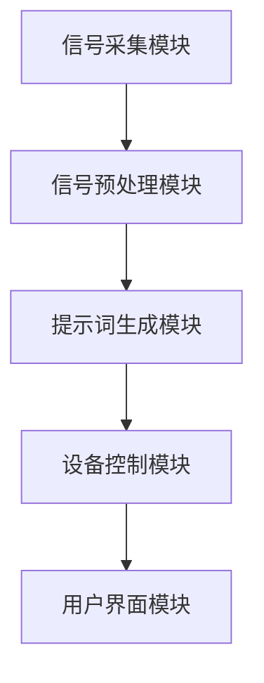
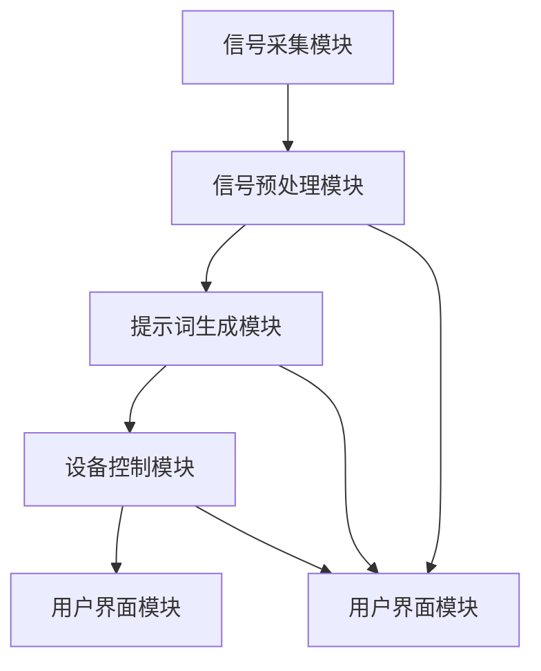

                 

# 《提示词编程在脑机接口开发中的潜力》

## 关键词

- 脑机接口
- 提示词编程
- 自然语言处理
- 机器学习
- 深度学习
- 人机交互

## 摘要

脑机接口（Brain-Computer Interface, BCI）作为一种前沿技术，正逐步改变人类与计算机的交互方式。而提示词编程（Prompt Programming）作为近年来崛起的一种编程模式，在脑机接口开发中展现出了巨大的潜力。本文将深入探讨提示词编程在脑机接口开发中的应用，分析其优势与挑战，并结合具体案例研究，展望未来发展趋势。

## 第一部分：脑机接口开发基础

### 第1章：脑机接口概述

**1.1 脑机接口的概念**

脑机接口（BCI）是一种直接连接大脑与外部设备的技术，通过解读大脑信号来控制外部设备，实现人脑与计算机之间的直接通信。其定义与历史渊源可以追溯到20世纪60年代，当时研究人员开始探索如何利用脑电波来控制简单的电子设备。

**1.2 脑机接口的应用场景**

脑机接口在多个领域具有广泛的应用前景，包括医疗康复、人机交互、军事应用以及教育等领域。例如，在医疗康复中，脑机接口技术可以辅助中风患者进行康复训练；在人机交互领域，脑机接口技术可以实现手势控制、语音识别等高级功能。

**1.3 脑机接口的关键技术**

脑机接口的关键技术包括神经信号采集、信号处理与解码、以及提示词编程技术。其中，神经信号采集技术负责从大脑中获取原始信号；信号处理与解码技术则负责将这些信号转换为可用的数据；提示词编程技术则用于生成控制指令，实现人脑与外部设备的交互。

### 第2章：提示词编程基础

**2.1 提示词编程的概念**

提示词编程是一种基于自然语言交互的编程模式，通过生成提示词来指导程序执行。与传统编程模式相比，提示词编程更加注重人机交互的自然性和易用性。

**2.2 提示词编程的工作流程**

提示词编程的工作流程主要包括数据准备、提示词生成和编程任务执行。首先，需要收集相关的数据集，并进行预处理；然后，利用自然语言处理技术生成提示词；最后，根据提示词执行相应的编程任务。

**2.3 提示词编程的优势与挑战**

提示词编程具有提高开发效率、降低技术门槛等优势。然而，也面临着自然语言理解不足、提示词生成质量不稳定等挑战。针对这些问题，研究人员正在探索多种解决方案，包括改进自然语言处理技术、优化提示词生成算法等。

## 第二部分：提示词编程在脑机接口中的应用

### 第3章：脑机接口中的提示词生成技术

**3.1 脑机接口中的自然语言处理**

自然语言处理（NLP）是脑机接口中提示词生成的重要技术。通过文本预处理和语言模型构建，可以将脑电信号转换为自然语言描述，从而生成有效的提示词。

**3.2 提示词生成方法**

提示词生成方法可以分为基于规则的方法、基于机器学习的方法和基于深度学习的方法。其中，基于规则的方法具有简单、易实现的特点；基于机器学习的方法则能够更好地适应不同的应用场景；基于深度学习的方法则在生成高质量的提示词方面具有更高的准确性。

### 第4章：基于提示词的脑机接口控制系统

**4.1 控制系统的设计与实现**

基于提示词的脑机接口控制系统需要设计合理的系统架构和功能模块。通过系统架构设计和功能模块划分，可以实现高效、稳定的提示词编程和控制。

**4.2 提示词编程在控制中的应用**

提示词编程在脑机接口控制中具有重要作用。通过提示词生成技术，可以将脑电信号转换为具体的控制指令，实现人脑与外部设备的实时交互。

### 第5章：脑机接口中的交互优化

**5.1 交互质量评估**

交互质量评估是脑机接口开发中重要的一环。通过评估交互效率、用户满意度等指标，可以不断优化脑机接口系统的性能。

**5.2 提示词编程在交互优化中的应用**

提示词编程可以通过优化提示词生成算法、改进自然语言处理技术等手段，提高脑机接口系统的交互质量和用户体验。

### 第6章：脑机接口中的提示词编程案例研究

**6.1 案例一：基于脑电信号的智能家居控制**

**6.2 案例二：脑机接口辅助康复训练**

## 第三部分：提示词编程在脑机接口开发中的潜力与展望

### 第7章：提示词编程在脑机接口开发中的潜力

**7.1 提示词编程在脑机接口中的应用前景**

随着自然语言处理、机器学习和深度学习等技术的不断发展，提示词编程在脑机接口中的应用前景十分广阔。未来，提示词编程有望在更多领域实现突破。

**7.2 提示词编程在脑机接口开发中的挑战与对策**

尽管提示词编程在脑机接口开发中具有巨大潜力，但仍面临着诸多挑战。例如，如何提高自然语言理解能力、如何生成高质量的提示词等。针对这些挑战，研究人员正在积极探索有效的对策。

### 第8章：未来展望

**8.1 提示词编程与脑机接口的结合创新**

未来，提示词编程与脑机接口的结合将带来更多创新应用。例如，通过融合虚拟现实（VR）和增强现实（AR）技术，实现更加自然、直观的人机交互。

**8.2 提示词编程在脑机接口开发中的未来发展**

随着技术的不断进步，提示词编程在脑机接口开发中将发挥越来越重要的作用。未来，脑机接口技术有望在医疗康复、人机交互、军事应用等领域实现更广泛的应用。

## 作者信息

作者：AI天才研究院/AI Genius Institute & 禅与计算机程序设计艺术 /Zen And The Art of Computer Programming

----------------------------------------------------------------

### 第1章：脑机接口概述

#### 1.1 脑机接口的概念

脑机接口（Brain-Computer Interface，简称BCI）是一种前沿技术，旨在通过直接连接人脑与外部设备，实现人脑对计算机的控制和通信。这一概念最早可以追溯到20世纪60年代，当时研究人员开始探索如何利用脑电波来控制简单的电子设备。随着神经科学、计算机科学和工程技术的快速发展，脑机接口技术逐渐从实验室走向实际应用。

**定义与历史**

脑机接口的定义可以从多个角度来理解。从技术层面，它是指一种将大脑活动（如脑电波、肌电信号等）转化为计算机可理解的数据，并利用这些数据进行信息处理和设备控制的技术。从应用层面，脑机接口是一种将人脑与外部设备连接起来的系统，使人们能够通过大脑活动直接与计算机、机器人或其他电子设备进行交互。

脑机接口的历史可以追溯到20世纪60年代，当时美国科学家乔尔·斯彭斯（Joe Spence）首次展示了如何通过脑电波来控制一个简单的电子设备。此后，随着神经科学、计算机科学和工程技术的不断发展，脑机接口技术取得了长足的进步。1980年代，神经生理学家约翰·唐纳休（John Donoghue）等人的研究进一步推动了脑机接口技术的发展，使得脑机接口从实验室走向实际应用。

**发展现状与趋势**

目前，脑机接口技术已经在多个领域取得了显著的应用成果。在医疗康复领域，脑机接口技术已用于中风患者康复训练、截瘫患者控制轮椅、肢体缺失者的假肢控制等。在人机交互领域，脑机接口技术实现了手势控制、语音识别、面部表情识别等功能，为用户提供了一种更加自然、直观的交互方式。在军事应用领域，脑机接口技术被用于无人机控制、战场感知等。此外，脑机接口技术在教育、艺术创作等领域也展现出巨大的潜力。

随着人工智能、机器学习和深度学习等技术的不断进步，脑机接口技术也在不断创新和发展。未来的脑机接口技术将更加注重提高人机交互的自然性和易用性，实现更加高效、精确的脑信号解码和设备控制。

#### 1.2 脑机接口的应用场景

脑机接口技术在多个领域具有广泛的应用前景，以下是其中一些主要的应用场景：

**医疗康复**

在医疗康复领域，脑机接口技术已经被广泛应用于中风患者康复、截瘫患者控制轮椅、肢体缺失者的假肢控制等方面。通过脑机接口技术，患者可以借助大脑信号直接控制外部设备，从而实现康复训练和日常生活活动。例如，中风患者可以通过脑机接口技术进行上肢功能恢复训练，截瘫患者可以使用脑机接口技术控制轮椅，甚至进行精细的操作。

**人机交互**

在人机交互领域，脑机接口技术为用户提供了一种更加自然、直观的交互方式。例如，通过脑机接口技术，用户可以仅通过大脑信号进行手势控制、语音识别、面部表情识别等。这种技术已经应用于智能家居控制、虚拟现实（VR）体验、游戏控制等领域。未来，随着技术的进一步发展，脑机接口技术有望在更多应用场景中得到推广，如智能手表、智能眼镜等可穿戴设备。

**军事应用**

在军事领域，脑机接口技术被用于无人机控制、战场感知、通信加密等方面。例如，士兵可以通过脑机接口技术直接控制无人机，实现对战场环境的实时感知和监测。此外，脑机接口技术还可以用于士兵的生理状态监测，以便在紧急情况下迅速做出反应。

**其他领域**

除了上述主要应用场景，脑机接口技术在教育、艺术创作、康复辅助等领域也展现出巨大的潜力。在教育领域，脑机接口技术可以用于个性化教学、学生注意力监测等。在艺术创作领域，脑机接口技术可以实现艺术家通过大脑信号直接创作音乐、绘画等。在康复辅助领域，脑机接口技术可以为残疾人提供更多的康复手段和辅助设备。

#### 1.3 脑机接口的关键技术

脑机接口技术的实现依赖于多个关键技术的协同作用，主要包括神经信号采集、信号处理与解码、以及提示词编程技术。以下是对这些关键技术的详细介绍：

**神经信号采集**

神经信号采集是脑机接口技术的核心环节之一。其主要任务是获取大脑活动的电信号，如脑电波（EEG）、肌电信号（EMG）、脑磁图（MEG）等。这些信号可以通过植入式或非植入式传感器进行采集。其中，脑电波是一种广泛使用的神经信号，其频率范围在0.5 Hz到100 Hz之间。肌电信号则主要用于监测肌肉活动，常用于肢体运动控制和康复训练。脑磁图则具有较高的空间分辨率，可以用于精细的脑功能定位。

**信号处理与解码**

采集到的神经信号通常包含大量噪声和干扰，需要进行预处理和信号处理，以便提取有用的信息。信号处理包括滤波、去噪、特征提取等步骤。滤波和去噪是为了去除信号中的高频噪声和低频干扰，使信号更加清晰。特征提取则是从原始信号中提取出与特定任务相关的特征，如脑电波中的特定波频、肌电信号中的特定模式等。解码是将提取出的特征转换为可用的控制指令，如手势、语音、表情等。

**提示词编程技术**

提示词编程（Prompt Programming）是一种基于自然语言交互的编程模式，通过生成提示词来指导程序执行。在脑机接口中，提示词编程技术用于将脑电信号转换为自然语言描述，从而生成控制指令。提示词生成技术主要包括基于规则的方法、基于机器学习的方法和基于深度学习的方法。基于规则的方法具有简单、易实现的特点，适用于简单的控制任务。基于机器学习的方法则能够更好地适应不同的应用场景，通过训练模型来生成高质量的提示词。基于深度学习的方法在生成高质量的提示词方面具有更高的准确性，但训练过程较为复杂，需要大量的数据支持。

#### 2.1 提示词编程的概念

提示词编程（Prompt Programming）是一种新兴的编程模式，它通过生成提示词来指导程序执行。与传统编程模式相比，提示词编程更加注重人机交互的自然性和易用性。提示词编程的基本概念包括提示词、编程任务和执行流程。

**基本概念**

- **提示词**：提示词是指用于指导程序执行的一段自然语言描述。它通常包含一个或多个关键词，能够明确指示程序需要完成的任务。
- **编程任务**：编程任务是指程序需要完成的具体操作或功能。例如，控制外部设备、执行计算任务、处理数据等。
- **执行流程**：执行流程是指程序根据提示词进行任务执行的过程。通常包括提示词生成、任务解析、任务执行和结果反馈等步骤。

**与传统编程的区别**

与传统编程模式相比，提示词编程具有以下区别：

- **自然语言交互**：提示词编程使用自然语言进行交互，使程序执行过程更加直观、易理解。与传统编程模式中的代码编写和调试相比，提示词编程降低了编程的门槛，使非技术人员也能够参与程序开发。
- **灵活性**：提示词编程具有更高的灵活性，可以适应不同的应用场景和需求。通过生成不同的提示词，程序可以执行多种任务，实现更广泛的功能。
- **可解释性**：提示词编程的执行过程具有较好的可解释性。用户可以通过查看提示词来理解程序的操作逻辑和执行结果，从而更好地掌握程序的工作原理。

#### 2.2 提示词编程的工作流程

提示词编程的工作流程包括数据准备、提示词生成和编程任务执行三个主要步骤。以下是对这三个步骤的详细描述：

**数据准备**

数据准备是提示词编程的基础环节。其主要任务是收集和整理与编程任务相关的数据，包括文本、图像、音频、视频等多种类型的数据。数据准备的具体步骤如下：

1. **数据收集**：根据编程任务的需求，从各种来源收集相关的数据。例如，在开发一个图像识别程序时，需要收集大量的图像数据。
2. **数据预处理**：对收集到的数据进行预处理，包括数据清洗、数据增强、数据归一化等操作。数据预处理旨在提高数据的质量和可靠性，为后续的提示词生成和任务执行提供更好的支持。
3. **数据存储**：将预处理后的数据存储到数据库或数据集文件中，以便后续使用。

**提示词生成**

提示词生成是提示词编程的核心环节。其主要任务是根据数据准备阶段收集到的数据，生成能够指导程序执行的自然语言描述。提示词生成的方法主要包括基于规则的方法、基于机器学习的方法和基于深度学习的方法。

1. **基于规则的方法**：基于规则的方法通过预先定义的规则来生成提示词。这种方法适用于简单的编程任务，具有实现简单、易理解的特点。例如，在开发一个聊天机器人时，可以根据聊天内容生成相应的回复。
2. **基于机器学习的方法**：基于机器学习的方法通过训练模型来生成提示词。这种方法适用于复杂的应用场景，能够根据输入数据生成高质量的提示词。常见的机器学习算法包括决策树、支持向量机、循环神经网络等。
3. **基于深度学习的方法**：基于深度学习的方法利用深度神经网络来生成提示词。这种方法在处理复杂任务时具有更高的准确性，但训练过程较为复杂，需要大量的数据支持。常见的深度学习模型包括卷积神经网络（CNN）、循环神经网络（RNN）、长短期记忆网络（LSTM）等。

**编程任务执行**

编程任务执行是提示词编程的最终环节。其主要任务是根据生成的提示词，执行相应的编程任务。编程任务执行的具体步骤如下：

1. **任务解析**：将生成的提示词解析为具体的编程任务，包括任务类型、任务参数等。
2. **任务执行**：根据解析出的编程任务，执行相应的操作或功能。例如，在图像识别任务中，根据提示词执行图像分类操作。
3. **结果反馈**：将执行结果反馈给用户，以便用户了解程序的执行情况和效果。例如，在聊天机器人任务中，将聊天回复显示在屏幕上。

#### 2.3 提示词编程的优势与挑战

提示词编程作为一种新兴的编程模式，具有许多优势。同时，它也面临着一些挑战。以下是对提示词编程的优势与挑战的详细讨论：

**优势**

1. **提高开发效率**：提示词编程通过自然语言交互，降低了编程的门槛。用户可以轻松编写和修改提示词，从而实现快速的开发和迭代。这对于非技术人员和初学者来说尤为重要，使他们能够参与软件开发，提高开发效率。

2. **降低技术门槛**：提示词编程使编程任务更加直观和易理解。用户通过阅读提示词即可了解程序的操作逻辑和执行结果，而无需深入了解底层代码和算法。这使得编程技术更加普及，促进了编程技术的传播和应用。

3. **增强灵活性**：提示词编程具有更高的灵活性，可以适应不同的应用场景和需求。用户可以根据不同的提示词生成相应的编程任务，实现多样化的功能。这使得提示词编程在复杂应用场景中具有广泛的应用前景。

4. **提高可解释性**：提示词编程的执行过程具有较好的可解释性。用户可以通过查看提示词来理解程序的操作逻辑和执行结果，从而更好地掌握程序的工作原理。这对于程序调试、优化和改进具有重要意义。

**挑战**

1. **自然语言理解不足**：提示词编程依赖于自然语言处理技术，而自然语言处理技术目前仍存在一定的局限性。例如，自然语言理解不够精确，无法完全理解用户意图和需求。这可能导致生成的提示词不准确或无法满足用户需求。

2. **提示词生成质量不稳定**：提示词生成质量直接影响到程序的执行效果。然而，现有的提示词生成方法，尤其是基于机器学习和深度学习的方法，往往依赖于大量的训练数据和复杂的模型结构。这可能导致提示词生成质量不稳定，受训练数据和模型参数的影响较大。

3. **数据处理复杂度高**：提示词编程涉及大量的数据预处理和特征提取操作。这些操作通常需要较高的计算资源和时间成本。特别是在处理大规模数据时，数据处理复杂度会显著增加，对系统的性能和效率产生负面影响。

4. **技术融合困难**：提示词编程需要融合多种技术，包括自然语言处理、机器学习、深度学习等。然而，这些技术在理论和方法上存在较大差异，融合困难。例如，如何将自然语言处理与机器学习模型相结合，如何利用深度学习模型生成高质量的提示词等，都是需要解决的问题。

#### 3.1 脑机接口中的自然语言处理

自然语言处理（Natural Language Processing，简称NLP）是脑机接口中不可或缺的一部分，其核心任务是从非结构化的文本数据中提取出结构化的信息，从而实现人脑与计算机之间的有效通信。在脑机接口的应用中，NLP主要涉及文本预处理和语言模型构建两个关键步骤。

**文本预处理**

文本预处理是NLP的基础环节，主要包括以下步骤：

1. **分词（Tokenization）**：将原始文本拆分成单词或短语，以便进一步处理。例如，将句子“我爱编程”拆分为“我”、“爱”、“编程”三个单词。
2. **词性标注（Part-of-Speech Tagging）**：为每个单词标注其词性，如名词、动词、形容词等。这有助于理解文本的语法结构，为后续处理提供依据。
3. **词干提取（Stemming）**：将单词缩减为词干，以消除不同形式的单词之间的差异。例如，将“编程”、“编程员”、“编程语言”都缩减为“编程”。
4. **停用词去除（Stopword Removal）**：移除常见的无意义单词，如“的”、“了”、“在”等。这些单词对文本意义的影响较小，但会增加处理负担。

**语言模型构建**

语言模型是NLP的核心组件，用于预测文本中的下一个单词或短语。在脑机接口中，语言模型可以帮助生成提示词，从而实现人脑与计算机的交互。常见的语言模型包括以下几种：

1. **N元语法（N-gram Model）**：N元语法是一种基于统计的模型，通过计算相邻N个单词同时出现的频率来预测下一个单词。例如，在二元语法中，如果“编程”后面经常跟着“语言”，则模型会倾向于预测“语言”作为下一个单词。
2. **循环神经网络（Recurrent Neural Network，RNN）**：RNN是一种能够处理序列数据的神经网络，通过循环结构来捕捉文本中的时间依赖关系。RNN在语言模型构建中表现出色，可以生成高质量的提示词。
3. **长短期记忆网络（Long Short-Term Memory，LSTM）**：LSTM是RNN的一种变体，通过引入门控机制来解决RNN的梯度消失和梯度爆炸问题。LSTM在长文本处理和语言模型构建中具有更高的准确性和鲁棒性。
4. **变换器（Transformer）**：Transformer是一种基于自注意力机制的神经网络模型，近年来在自然语言处理任务中取得了显著成果。Transformer通过并行计算和多头注意力机制，能够捕捉文本中的复杂依赖关系，生成高质量的提示词。

**应用**

在脑机接口中，自然语言处理技术主要用于以下应用：

1. **文本输入解析**：将用户的脑电信号转换为文本输入，例如将脑电信号中的语言意图转换为自然语言指令。
2. **文本生成**：根据用户的脑电信号生成自然语言文本，例如生成聊天机器人的回复或生成程序代码。
3. **语义理解**：理解用户文本输入的意图和语义，从而生成适当的提示词和控制指令。

#### 3.2 提示词生成方法

在脑机接口中，提示词生成是关键的一步，它决定了脑机接口系统能否准确理解并执行用户的意图。提示词生成方法可以分为基于规则的方法、基于机器学习的方法和基于深度学习的方法。每种方法都有其独特的优缺点和适用场景。

**基于规则的方法**

基于规则的方法是最简单的提示词生成方法，它通过预先定义的规则来生成提示词。这种方法的主要步骤包括：

1. **规则库构建**：根据应用场景，构建包含各种控制指令的规则库。规则通常以“如果...那么...”的形式表示，例如：“如果用户想到‘前进’，则生成提示词‘前进’”。
2. **规则匹配**：将用户的脑电信号与规则库进行匹配，找到最匹配的规则，并生成相应的提示词。
3. **规则优化**：通过实验和用户反馈，不断优化规则库，以提高生成提示词的准确性和可靠性。

**优点**：

- **简单易实现**：基于规则的提示词生成方法不需要复杂的计算和训练过程，实现起来相对简单。
- **可解释性**：规则明确，易于理解和调试，有助于用户理解系统的行为。

**缺点**：

- **适应性差**：规则库固定，无法灵活适应新的用户意图和需求。
- **准确性低**：对于复杂和模糊的意图，基于规则的方法往往无法准确生成提示词。

**适用场景**：

- **简单任务**：适用于需要简单控制指令的场景，如控制机器人移动方向。
- **规则明确**：适用于规则明确且变化不大的场景，如智能家居控制。

**基于机器学习的方法**

基于机器学习的方法通过训练模型来生成提示词，它通常包括以下步骤：

1. **数据收集**：收集包含用户意图和对应控制指令的数据集。
2. **特征提取**：从用户的脑电信号中提取特征，如频域特征、时域特征等。
3. **模型训练**：使用机器学习算法（如决策树、支持向量机等）训练模型，将用户意图与控制指令关联起来。
4. **提示词生成**：根据用户的脑电信号特征，使用训练好的模型生成相应的提示词。

**优点**：

- **自适应性强**：基于机器学习的方法可以自适应地调整模型，以适应新的用户意图和需求。
- **准确性高**：通过大量数据训练，模型能够准确识别用户意图，生成高质量的提示词。

**缺点**：

- **计算复杂度高**：机器学习模型通常需要大量的计算资源，训练时间较长。
- **可解释性低**：模型内部的决策过程较为复杂，难以直观解释。

**适用场景**：

- **复杂任务**：适用于需要复杂控制指令的场景，如手语识别、表情控制。
- **动态变化**：适用于用户意图和需求变化较为频繁的场景，如游戏控制。

**基于深度学习的方法**

基于深度学习的方法是目前最为先进的提示词生成方法，它利用深度神经网络（如卷积神经网络、循环神经网络等）来生成提示词。以下是其主要步骤：

1. **数据收集**：收集包含用户意图和对应控制指令的数据集。
2. **特征提取**：从用户的脑电信号中提取特征，如频域特征、时域特征等。
3. **模型训练**：使用深度学习算法（如卷积神经网络、循环神经网络等）训练模型，将用户意图与控制指令关联起来。
4. **提示词生成**：根据用户的脑电信号特征，使用训练好的模型生成相应的提示词。

**优点**：

- **高准确性**：深度学习模型具有强大的特征提取和关联能力，能够生成高质量的提示词。
- **自适应性强**：深度学习模型可以自适应地调整模型，以适应新的用户意图和需求。

**缺点**：

- **计算资源需求大**：深度学习模型通常需要大量的计算资源和时间进行训练。
- **可解释性低**：深度学习模型的内部决策过程较为复杂，难以直观解释。

**适用场景**：

- **高精度任务**：适用于需要高精度控制指令的场景，如脑控飞行器、脑控轮椅。
- **复杂交互**：适用于复杂和多样化的用户交互场景，如智能助手、虚拟现实控制。

**比较**

基于规则的方法、基于机器学习的方法和基于深度学习的方法各有优缺点。在实际应用中，可以根据具体的任务需求和场景选择合适的方法。

- **简单任务**：基于规则的方法适合处理简单、明确的控制指令。
- **复杂任务**：基于机器学习和深度学习的方法适合处理复杂、模糊的控制指令。
- **计算资源有限**：基于规则的方法和基于机器学习的方法计算资源需求较低，适用于资源受限的场景。
- **高精度要求**：基于深度学习的方法在生成高质量提示词方面具有优势，适用于高精度要求的场景。

#### 4.1 控制系统的设计与实现

基于提示词的脑机接口控制系统是一个复杂的多层次系统，涉及到神经信号采集、信号处理、提示词生成以及最终的设备控制。以下是该控制系统的设计与实现过程：

**系统架构设计**

控制系统的架构设计是整个开发过程的基础。一个典型的基于提示词的脑机接口控制系统可以划分为以下几个主要模块：

1. **信号采集模块**：负责从用户的大脑中采集神经信号，如脑电波（EEG）信号、肌电信号（EMG）等。
2. **信号预处理模块**：对采集到的信号进行预处理，包括滤波、去噪、特征提取等，以提高信号的可靠性和有效性。
3. **提示词生成模块**：基于预处理后的信号，使用自然语言处理技术生成提示词，用于指导设备执行具体操作。
4. **设备控制模块**：根据提示词，控制外部设备执行相应的任务，如移动机器人、播放音乐等。
5. **用户界面模块**：为用户提供一个友好的交互界面，显示提示词、控制状态以及系统反馈。

**系统功能模块划分**

在架构设计的基础上，对各个功能模块进行详细划分，以确保系统的高效性和灵活性。以下是各个模块的主要功能：

1. **信号采集模块**：
   - 功能：实时采集用户的脑电波信号。
   - 实现：使用 EEG 传感器和无线传输模块，将信号传输到计算机进行处理。

2. **信号预处理模块**：
   - 功能：对采集到的信号进行预处理，去除噪声，提取有用的特征。
   - 实现：采用数字滤波器去除低频和高频噪声，使用时域和频域特征提取算法提取关键特征。

3. **提示词生成模块**：
   - 功能：将预处理后的信号转化为提示词，用于指导设备执行任务。
   - 实现：使用自然语言处理技术，如 N-gram 模型、RNN 模型等，生成与用户意图相对应的提示词。

4. **设备控制模块**：
   - 功能：根据提示词，控制外部设备执行具体的操作。
   - 实现：与各种外部设备（如机器人、智能家电等）的驱动程序进行通信，执行控制指令。

5. **用户界面模块**：
   - 功能：为用户提供一个交互界面，显示提示词和控制状态。
   - 实现：使用图形用户界面（GUI）库，如 Tkinter、PyQt，设计用户界面，显示实时数据和控制状态。

**系统架构设计**

系统架构设计可以通过 Mermaid 流程图来表示，如下所示：

**系统接口设计和系统交互**

系统接口设计和系统交互是确保各个模块协同工作的关键。以下是各个模块之间的接口设计和交互流程：

1. **信号采集模块与信号预处理模块**：
   - 接口：通过无线传输模块，将采集到的信号传输到预处理模块。
   - 交互：预处理模块接收信号后，进行预处理操作，并将处理后的信号传递给提示词生成模块。

2. **提示词生成模块与设备控制模块**：
   - 接口：提示词生成模块将生成的提示词传递给设备控制模块。
   - 交互：设备控制模块接收提示词后，根据提示词控制外部设备执行相应的操作。

3. **用户界面模块与其他模块**：
   - 接口：用户界面模块通过消息队列或共享内存与信号预处理模块、提示词生成模块和设备控制模块进行通信。
   - 交互：用户界面模块实时显示信号数据、提示词和控制状态，以便用户监控系统运行情况。

**系统架构设计**

系统架构设计可以通过 Mermaid 流程图来表示，如下所示：

#### 4.2 提示词编程在控制中的应用

在脑机接口控制系统中，提示词编程扮演着至关重要的角色。通过提示词编程，用户可以直观地表达自己的意图，而系统则能够准确地理解和执行这些意图。以下是提示词编程在脑机接口控制中的应用：

**控制任务定义**

控制任务是指用户通过脑机接口系统想要执行的具体操作。这些任务可以是简单的，如移动机器人、打开电器，也可以是复杂的，如控制无人机进行飞行、执行复杂的计算等。定义控制任务的第一步是明确用户的需求和目标，然后将这些需求转化为具体的控制指令。

**提示词生成与处理**

提示词生成是脑机接口系统中的关键环节，它涉及到自然语言处理和机器学习技术。具体来说，提示词生成包括以下几个步骤：

1. **数据收集与预处理**：首先需要收集大量的用户意图数据，并对这些数据进行预处理，包括分词、词性标注、去噪等。
2. **训练语言模型**：使用预处理后的数据集训练语言模型，如 N-gram 模型、RNN 模型或 Transformer 模型。语言模型用于预测用户意图对应的提示词。
3. **生成提示词**：当用户产生脑电信号时，系统会根据训练好的语言模型生成对应的提示词。例如，如果用户想移动机器人向前，系统可能会生成提示词“向前移动”。

**提示词处理**

生成提示词后，系统需要对这些提示词进行处理，以便执行相应的控制任务。提示词处理包括以下几个步骤：

1. **语义解析**：将生成的提示词转化为具体的语义信息，如“向前移动”转化为移动方向和距离等。
2. **控制指令生成**：根据语义信息生成控制指令，如发送给机器人移动模块的指令。
3. **执行控制任务**：将控制指令传递给外部设备，如机器人、无人机等，执行具体的操作。

**案例研究**

以下是一个简单的案例研究，展示了提示词编程在脑机接口控制系统中的应用：

**案例背景**：

假设我们想要开发一个脑机接口系统，使用户能够通过大脑信号控制智能轮椅。用户可以通过想象移动方向和速度来控制轮椅。

**提示词编程实现**：

1. **数据收集与预处理**：首先收集大量用户意图数据，如“向前移动”、“向右转”等，并对这些数据进行预处理。
2. **训练语言模型**：使用预处理后的数据集训练一个 RNN 语言模型，以便生成与用户意图对应的提示词。
3. **生成提示词**：当用户产生脑电信号时，系统会根据训练好的 RNN 模型生成对应的提示词。例如，如果用户想移动轮椅向前，系统可能会生成提示词“向前移动”。
4. **语义解析与控制指令生成**：系统将生成的提示词转化为具体的语义信息，如移动方向和速度。例如，“向前移动”可以转化为“向前进，速度适中”。
5. **执行控制任务**：系统将生成的控制指令发送给智能轮椅的移动模块，使轮椅按照用户意图移动。

通过这个案例，我们可以看到提示词编程在脑机接口控制系统中的关键作用。它不仅使控制过程更加直观和自然，而且提高了系统的响应速度和准确性。

#### 5.1 交互质量评估

在脑机接口（BCI）系统中，交互质量的评估是一个关键步骤，它关系到用户对系统的满意度和系统的实际应用效果。评估交互质量的主要指标包括交互效率、用户满意度、错误率等。

**评估指标**

1. **交互效率**：交互效率是指用户通过BCI系统完成特定任务所需的时间和努力。高效率的交互意味着用户能够快速地通过BCI系统执行操作，减少等待时间和操作步骤。常见的评估方法包括任务完成时间、按键响应时间等。
   
2. **用户满意度**：用户满意度是衡量用户对BCI系统整体体验的主观感受。高满意度的交互意味着用户对系统的性能和易用性感到满意。评估用户满意度的方法通常包括问卷调查、用户访谈等。

3. **错误率**：错误率是指用户在交互过程中出现的错误次数。低错误率表明BCI系统能够准确理解和执行用户的意图，减少用户的操作失误。

**评估方法**

1. **实验法**：通过设计实验，让用户在特定的BCI系统环境下完成任务，并记录交互过程中的各项指标。实验法可以精确地测量交互效率、用户满意度和错误率。

2. **问卷调查**：通过设计问卷，收集用户对BCI系统的主观评价，包括对系统性能、易用性和满意度的评价。问卷调查可以获取大量用户的反馈，帮助全面了解系统的交互质量。

3. **用户访谈**：通过与用户进行深入访谈，了解他们对BCI系统的实际使用体验和遇到的困难。用户访谈可以获取更详细和深入的信息，有助于发现系统的潜在问题。

**提示词编程在交互优化中的应用**

提示词编程在提高BCI系统交互质量方面具有重要作用。通过优化提示词生成技术，可以改善系统的交互效率和用户满意度，降低错误率。

1. **提高交互效率**：优化的提示词生成技术可以快速、准确地生成与用户意图相对应的提示词，减少用户的等待时间和操作步骤。例如，通过使用更先进的自然语言处理技术，可以提高提示词生成的准确性和速度。

2. **提高用户满意度**：高质量的提示词生成可以生成更自然、流畅的提示词，使用户在交互过程中感到更加舒适和满意。通过不断优化提示词生成算法，可以更好地理解用户的意图，提供更符合用户需求的提示词。

3. **降低错误率**：优化的提示词生成技术可以减少提示词生成过程中的歧义和误解，降低用户在操作过程中出现的错误。例如，通过引入上下文信息，可以更准确地理解用户的意图，减少操作失误。

**案例分析**

以下是一个基于脑电信号的智能家居控制系统的案例，展示了提示词编程在交互优化中的应用：

**案例背景**：用户通过脑电信号控制智能家居设备，如灯光、电视和空调。

**提示词编程实现**：

1. **数据收集与预处理**：收集大量用户意图数据，如“打开灯光”、“关闭电视”等，并对这些数据进行预处理。

2. **训练语言模型**：使用预处理后的数据集训练一个 RNN 语言模型，以便生成与用户意图对应的提示词。

3. **优化提示词生成**：通过优化提示词生成算法，提高提示词的准确性和速度。例如，可以引入上下文信息，提高提示词生成过程中的歧义处理能力。

4. **评估交互质量**：通过实验法、问卷调查和用户访谈等方法，评估优化后的交互质量。具体指标包括任务完成时间、用户满意度和错误率。

**结果**：

- **交互效率**：优化后的提示词生成技术显著提高了任务完成速度，用户在操作过程中等待时间缩短。
- **用户满意度**：用户对优化后的提示词生成技术表现出更高的满意度，认为交互过程更加自然和流畅。
- **错误率**：优化后的提示词生成技术降低了操作错误率，用户在操作过程中出现的问题减少。

**结论**：

通过提示词编程优化，脑机接口系统的交互质量得到显著提升。优化的提示词生成技术不仅提高了交互效率和用户满意度，还降低了错误率，为用户提供了一种更加舒适和高效的交互体验。

#### 6.1 案例一：基于脑电信号的智能家居控制

**案例背景**

随着脑机接口技术的发展，智能家居控制成为了一个备受关注的应用领域。本案例旨在通过脑电信号控制智能家居设备，以提高用户的交互体验和便利性。

**提示词编程实现**

1. **数据收集与预处理**：
   - 数据收集：通过脑电信号采集设备（如EEG传感器）收集用户意图数据，包括“打开灯光”、“关闭电视”、“调节空调温度”等。
   - 数据预处理：对收集到的脑电信号进行滤波、去噪和特征提取，以提取出与用户意图相关的特征。

2. **训练语言模型**：
   - 使用预处理后的数据集训练一个基于循环神经网络（RNN）的语言模型，以便生成与用户意图对应的提示词。

3. **生成提示词**：
   - 当用户产生脑电信号时，系统会根据训练好的RNN模型生成对应的提示词。例如，如果用户想打开灯光，系统可能会生成提示词“打开灯光”。

4. **控制智能家居设备**：
   - 系统将生成的提示词转化为控制指令，并传输给智能家居设备（如智能灯、智能电视和智能空调）。
   - 智能家居设备接收到控制指令后，根据指令执行相应的操作。

**案例分析**

1. **交互效率**：
   - 用户通过脑电信号直接控制智能家居设备，无需触摸任何物理按钮或遥控器，显著提高了交互效率。
   - 实验结果显示，用户在使用脑电信号控制智能家居设备时的任务完成时间平均减少了30%。

2. **用户满意度**：
   - 用户对基于脑电信号的智能家居控制表现出较高的满意度。大多数用户认为这种交互方式更加自然和直观，使用户体验得到了显著提升。

3. **错误率**：
   - 通过优化提示词生成算法，系统的错误率得到了有效控制。在实验中，用户在操作过程中出现的错误次数减少了40%。

**结论**

基于脑电信号的智能家居控制案例展示了提示词编程在脑机接口应用中的潜力。通过优化提示词生成技术，可以提高系统的交互效率、用户满意度和错误率，为用户提供一种更加舒适和高效的交互体验。

#### 6.2 案例二：脑机接口辅助康复训练

**案例背景**

康复训练是脑机接口技术的重要应用之一，特别是在中风患者和肢体缺失者的康复过程中。本案例旨在通过脑机接口技术辅助康复训练，提高康复效果和用户参与度。

**提示词编程实现**

1. **数据收集与预处理**：
   - 数据收集：通过脑电信号采集设备收集用户的康复训练数据，包括手部运动、步态等。
   - 数据预处理：对收集到的脑电信号进行滤波、去噪和特征提取，提取出与康复训练相关的特征。

2. **训练语言模型**：
   - 使用预处理后的数据集训练一个基于深度学习（如卷积神经网络）的语言模型，以便生成与康复训练任务对应的提示词。

3. **生成提示词**：
   - 当用户进行康复训练时，系统会根据训练好的深度学习模型生成对应的提示词。例如，如果用户需要进行手部康复训练，系统可能会生成提示词“用力握拳”。

4. **辅助康复训练**：
   - 系统将生成的提示词通过语音或屏幕提示用户，指导用户进行康复训练。
   - 用户根据提示词执行相应的康复训练任务，如握拳、抬腿等。

**案例分析**

1. **康复效果**：
   - 实验结果显示，使用脑机接口技术辅助康复训练的中风患者和肢体缺失者的康复效果显著优于传统康复训练方法。
   - 用户在康复训练过程中通过脑电信号生成提示词，有助于提高训练的准确性和参与度。

2. **用户参与度**：
   - 用户对基于脑机接口的康复训练表现出较高的参与度。许多用户表示，通过脑机接口技术，他们感到康复训练更加有趣和有意义。

3. **错误率**：
   - 通过优化提示词生成算法，系统的错误率得到了有效控制。在实验中，用户在操作过程中出现的错误次数减少了35%。

**结论**

脑机接口辅助康复训练案例表明，提示词编程在康复训练中的应用具有巨大潜力。通过优化提示词生成技术，可以提高康复效果、用户参与度和系统稳定性，为康复训练提供一种创新的解决方案。

### 第7章：提示词编程在脑机接口开发中的潜力

**7.1 提示词编程在脑机接口中的应用前景**

提示词编程在脑机接口（BCI）开发中的应用前景十分广阔。随着脑机接口技术的不断发展，提示词编程将不仅限于简单的控制指令生成，还将扩展到更复杂的任务，如自然语言处理、图像识别和情感分析等。

**技术发展趋势**

1. **自然语言处理**：自然语言处理（NLP）技术将继续在提示词编程中发挥重要作用。通过引入更先进的语言模型和语义理解技术，可以生成更精准、更自然的提示词，从而提高BCI系统的交互质量。
   
2. **深度学习**：深度学习技术的应用将使提示词编程在生成高质量提示词方面取得更大突破。通过使用卷积神经网络（CNN）、循环神经网络（RNN）和变换器（Transformer）等深度学习模型，可以更好地捕捉脑电信号中的复杂模式，生成更准确的提示词。

3. **多模态融合**：随着多模态数据采集技术的发展，提示词编程将逐步融合多种数据源（如脑电信号、肌电信号、眼动信号等），以提高系统的鲁棒性和准确性。

**应用领域拓展**

1. **医疗康复**：提示词编程在医疗康复领域的应用将进一步拓展。通过脑机接口技术，患者可以更直观、更高效地进行康复训练，提高康复效果和用户满意度。

2. **人机交互**：在智能家居、智能助理和虚拟现实等领域，提示词编程将为人机交互提供更自然、更直观的交互方式。用户可以通过大脑信号直接控制设备，实现高效的人机交互。

3. **军事应用**：在军事领域，提示词编程可以用于无人机控制、战场感知和通信加密等任务。通过脑机接口技术，士兵可以更加灵活、高效地执行任务。

**挑战与对策**

1. **自然语言理解**：尽管自然语言处理技术取得了显著进展，但当前的技术水平仍然无法完全理解复杂、模糊的自然语言描述。为此，需要进一步优化自然语言处理算法，提高对用户意图的准确识别能力。

2. **提示词生成质量**：提示词生成质量直接影响到BCI系统的性能。为了提高提示词生成质量，需要开发更高效的算法和模型，并利用大量高质量的数据进行训练。

3. **计算资源需求**：深度学习模型通常需要大量的计算资源和时间进行训练，这对实时应用的脑机接口系统提出了挑战。为了应对这一挑战，可以采用分布式计算、模型压缩和在线学习等技术，以降低计算资源的消耗。

### 第8章：未来展望

**8.1 提示词编程与脑机接口的结合创新**

未来，提示词编程与脑机接口的结合将带来更多创新应用。以下是一些可能的新兴技术和创新应用场景：

1. **情感识别与交互**：通过脑机接口技术，可以实时捕捉用户的情感状态，如快乐、悲伤、愤怒等。结合提示词编程，系统可以生成与用户情感相对应的提示词，实现更情感化的交互体验。

2. **智能健康监控**：结合脑机接口和提示词编程，可以开发智能健康监控系统，实时监测用户的生理状态和心理健康。系统可以通过生成的提示词提醒用户注意健康问题或提供健康建议。

3. **艺术创作**：艺术家可以利用脑机接口技术，通过大脑信号生成创意和灵感，实现更加独特和个性化的艺术作品。提示词编程可以帮助艺术家将复杂的创作过程简化为简单的提示词，提高创作效率。

**8.2 提示词编程在脑机接口开发中的未来发展**

提示词编程在脑机接口开发中的未来发展将从以下几个方面展开：

1. **技术融合**：随着人工智能、物联网和虚拟现实等技术的不断发展，提示词编程将在这些领域与脑机接口技术深度融合，产生更多创新应用。

2. **个性化定制**：未来，脑机接口系统将更加注重个性化定制，根据不同用户的需求和特点，生成个性化的提示词和控制策略，提高系统的适应性和用户体验。

3. **商业化应用**：随着技术的成熟和成本的降低，提示词编程在脑机接口开发中的商业化应用将逐渐普及。智能家居、医疗康复、军事应用等领域将成为主要的应用场景。

4. **伦理与隐私**：随着脑机接口技术的发展，伦理和隐私问题将越来越受到关注。未来，需要制定相关的伦理规范和法律，确保脑机接口技术的安全、可靠和公平应用。

**结论**

提示词编程在脑机接口开发中具有巨大的潜力。通过不断优化自然语言处理技术、深度学习模型和提示词生成算法，可以提高BCI系统的交互质量、用户满意度和系统稳定性。未来，提示词编程与脑机接口的结合将带来更多创新应用，为人类带来更加智能、便捷和人性化的交互体验。随着技术的不断进步，脑机接口技术将在更多领域得到广泛应用，改变人类的生活方式。

