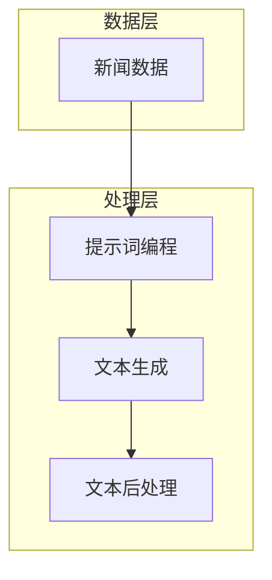
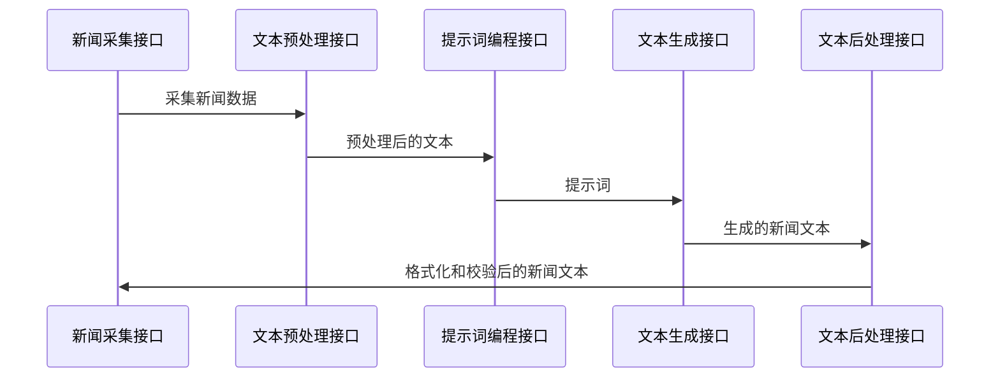

                 

# 提示词编程在自动化新闻生成中的角色

## 关键词

- 提示词编程
- 自动化新闻生成
- 自然语言处理
- 序列模型
- 生成对抗网络
- 语言模型

## 摘要

本文探讨了提示词编程在自动化新闻生成中的应用，分析了其在提升新闻生产效率、保证内容一致性和降低成本方面的优势。通过介绍自然语言处理基础、提示词编程算法原理、提示词编程框架与工具，以及实际项目中的系统架构和实现，本文详细阐述了提示词编程在自动化新闻生成中的角色和挑战，为相关领域的研究和实践提供了参考。

## 第一部分：提示词编程在自动化新闻生成中的背景

### 1.1 问题的背景

#### 1.1.1 自动化新闻生成的需求

随着互联网的迅速发展和信息量的爆炸性增长，新闻行业面临着巨大的挑战。传统的新闻生成方式依赖于人力，不仅效率低下，而且成本高昂。自动化新闻生成技术应运而生，旨在通过计算机技术和算法来替代部分甚至全部的人工新闻写作过程，从而提高新闻生产的效率、降低成本，并保证信息的准确性和一致性。

#### 1.1.2 提示词编程的概念

提示词编程是一种基于自然语言处理和机器学习技术的编程方式，它通过提供一些关键提示词或短语来引导算法生成文本。这种方法可以大大减少人工输入的负担，提高文本生成的效率和准确性。在自动化新闻生成领域，提示词编程可以用于生成新闻标题、摘要、正文等不同部分的文本。

#### 1.1.3 提示词编程的优势

与传统的手动编写新闻相比，提示词编程具有以下优势：

- **效率提升**：通过自动化生成新闻，可以大幅减少编辑和记者的重复性劳动，提高新闻生产的速度。
- **一致性保证**：提示词编程可以保证新闻内容的一致性和准确性，避免人为错误。
- **成本降低**：减少了对大量人力资源的依赖，降低了新闻生产的成本。
- **多样性增强**：虽然基于提示词编程的自动化新闻生成有一定的限制，但它可以通过调整提示词来生成不同风格和类型的新闻，从而增强内容的多样性。

### 1.2 提示词编程在自动化新闻生成中的应用场景

#### 1.2.1 新闻标题生成

新闻标题是吸引读者点击阅读的重要因素，通过提示词编程，可以快速生成吸引人的新闻标题，提高点击率和阅读量。

#### 1.2.2 新闻摘要生成

新闻摘要是对新闻正文内容的简短概括，提示词编程可以自动从长篇新闻中提取关键信息，生成简洁、准确的摘要。

#### 1.2.3 新闻正文生成

新闻正文是新闻的核心部分，提示词编程可以通过对大量新闻数据的学习，自动生成符合语法和逻辑规范的新闻文本。

### 1.3 提示词编程的挑战与前景

#### 1.3.1 挑战

- **准确性**：自动化新闻生成需要高度准确的算法，否则可能会生成误导性或低质量的新闻。
- **创造性**：提示词编程在生成创意性强的新闻内容时可能存在局限性。
- **用户体验**：尽管自动化新闻生成可以提高效率，但用户体验是新闻成功的重要因素，如何平衡效率和用户体验是一个挑战。

#### 1.3.2 前景

- **技术进步**：随着自然语言处理和机器学习技术的不断进步，提示词编程在自动化新闻生成中的应用前景将更加广阔。
- **应用扩展**：除了新闻生成，提示词编程还可以应用于其他文本生成领域，如自动写作、智能客服等。

### 1.4 本章小结

本章介绍了提示词编程在自动化新闻生成中的背景、概念、优势以及应用场景。通过提示词编程，新闻行业可以大幅提高生产效率和内容质量，但同时也面临着准确性、创造性和用户体验等挑战。随着技术的不断进步，提示词编程在自动化新闻生成中的应用前景将越来越广阔。

## 第二部分：提示词编程技术基础

### 2.1 自然语言处理基础

#### 2.1.1 语言模型

- **语言模型的基本概念**

  语言模型是一种用于生成文本的概率模型，它能够预测给定前文序列后最可能出现的词语。在自动化新闻生成中，语言模型用于生成新闻文本的不同部分。

- **常见的语言模型算法**

  - **n-gram模型**：基于前n个词的统计模型，简单但效果有限。
  - **神经网络语言模型**：如循环神经网络（RNN）和变换器（Transformer）等，通过学习大量文本数据，能够生成更高质量的文本。

- **语言模型在提示词编程中的应用**

  语言模型是提示词编程的核心，它通过学习大量新闻文本数据，可以自动生成新闻的不同部分，如标题、摘要和正文。

#### 2.1.2 词嵌入

- **词嵌入的基本原理**

  词嵌入是将单词映射到高维空间中的向量表示，使得具有相似意义的单词在空间中更接近。词嵌入有助于提高自然语言处理任务的性能。

- **词嵌入的类型**

  - **基于分布式表示的方法**：如Word2Vec，通过训练神经网络生成词向量。
  - **基于上下文的方法**：如BERT，通过学习上下文信息生成更精确的词向量。

- **词嵌入在提示词编程中的作用**

  词嵌入在提示词编程中用于将提示词转换为向量表示，以便后续的文本生成过程。它有助于提高文本生成的准确性和一致性。

#### 2.1.3 语义分析

- **语义分析的定义**

  语义分析是一种理解文本中词语和句子含义的技术。它包括词义消歧、实体识别、关系抽取等任务。

- **常见的语义分析方法**

  - **规则方法**：通过定义一系列规则来识别语义信息。
  - **统计方法**：通过统计方法，如机器学习和深度学习，自动学习语义信息。

- **语义分析在提示词编程中的应用**

  语义分析在提示词编程中用于理解和处理提示词的含义，从而生成更准确和相关的文本。它有助于提高文本生成的质量。

### 2.2 提示词编程算法原理

#### 2.2.1 提示词编程的概念与流程

- **提示词编程的基本概念**

  提示词编程是一种基于自然语言处理和机器学习技术的编程方式，它通过提供一些关键提示词或短语来引导算法生成文本。

- **提示词编程的基本流程**

  提示词编程的基本流程包括：收集和预处理文本数据、设计模型结构、训练模型、生成文本。

- **提示词编程与自然语言生成的关系**

  提示词编程是自然语言生成的一种实现方式，它通过提供提示词来引导算法生成高质量的文本。

#### 2.2.2 基于序列模型的提示词编程

- **序列模型的基本原理**

  序列模型是一种用于处理序列数据的模型，如循环神经网络（RNN）和变换器（Transformer）。它能够捕捉序列中词语的顺序关系。

- **常见的序列模型算法**

  - **循环神经网络（RNN）**：通过递归方式处理序列数据，但在长序列中容易发生梯度消失问题。
  - **变换器（Transformer）**：基于注意力机制的模型，能够捕捉长距离依赖关系，是目前最先进的序列模型。

- **序列模型在提示词编程中的应用案例**

  序列模型在提示词编程中用于生成新闻标题、摘要和正文等序列文本，它能够根据提示词生成连贯、相关的文本。

#### 2.2.3 基于生成对抗网络的提示词编程

- **生成对抗网络的基本原理**

  生成对抗网络（GAN）是一种由生成器和判别器组成的模型，生成器生成数据，判别器判断生成数据与真实数据的相似度。

- **GAN在提示词编程中的应用**

  GAN在提示词编程中用于生成高质量、多样化的文本。生成器根据提示词生成文本，判别器判断生成文本的真实性。

- **GAN在自动化新闻生成中的案例研究**

  在自动化新闻生成中，GAN可以用于生成新闻标题、摘要和正文等不同部分的文本，从而提高文本生成质量和多样性。

### 2.3 提示词编程框架与工具

#### 2.3.1 提示词编程框架的选择

- **常见的提示词编程框架**

  - **Transformer**：基于注意力机制的序列模型，是目前最先进的提示词编程框架。
  - **BERT**：基于预训练和微调的语言模型，适用于各种自然语言处理任务。
  - **GPT**：生成预训练变换器，具有强大的文本生成能力。

- **选择提示词编程框架的考虑因素**

  - **性能**：框架的性能决定了生成的文本质量和效率。
  - **可扩展性**：框架应支持大规模数据和分布式计算。
  - **社区支持**：活跃的社区支持有助于解决问题和持续优化。

- **各框架的特点与应用场景**

  - **Transformer**：适用于长文本生成，如新闻正文和文章生成。
  - **BERT**：适用于文本分类、情感分析等任务。
  - **GPT**：适用于对话系统、自动问答等任务。

#### 2.3.2 提示词编程工具的使用

- **常用的提示词编程工具**

  - **PyTorch**：开源的深度学习框架，适用于各种自然语言处理任务。
  - **TensorFlow**：开源的深度学习框架，具有广泛的应用和社区支持。
  - **Hugging Face**：开源的自然语言处理库，提供了丰富的预训练模型和工具。

- **工具的基本功能与特点**

  - **PyTorch**：动态计算图，易于调试和优化。
  - **TensorFlow**：静态计算图，适合大规模部署和优化。
  - **Hugging Face**：提供了丰富的预训练模型和API，简化了提示词编程的实现。

- **工具在实际项目中的应用示例**

  - **PyTorch**：用于自动化新闻生成的文本生成模型。
  - **TensorFlow**：用于自动化新闻生成的文本分类和摘要模型。
  - **Hugging Face**：用于自动化新闻生成的文本生成和摘要生成。

### 2.4 提示词编程的优势与局限

- **优势**

  - **提高生产效率**：通过自动化生成新闻，减少人力成本和重复性劳动。
  - **保证内容一致性**：使用机器学习算法生成新闻，减少人为错误和偏差。
  - **增强多样性**：通过调整提示词，生成不同风格和类型的新闻。

- **局限**

  - **准确性问题**：自动化新闻生成可能产生误导性或低质量的新闻。
  - **创造性限制**：提示词编程在生成创意性强的新闻内容时可能存在局限性。
  - **用户体验挑战**：如何平衡效率和用户体验是一个重要挑战。

### 2.5 本章小结

本章介绍了提示词编程技术基础，包括自然语言处理基础、提示词编程算法原理、提示词编程框架与工具，以及提示词编程的优势与局限。通过本章的内容，读者可以了解到提示词编程在自动化新闻生成中的重要作用和技术基础，为进一步研究和应用打下基础。

## 第三部分：自动化新闻生成系统架构与实现

### 3.1 系统架构设计

#### 3.1.1 项目介绍

自动化新闻生成系统旨在通过自然语言处理技术和提示词编程实现自动化新闻生成。系统包括新闻采集、文本预处理、提示词编程、文本生成和文本后处理等模块。

#### 3.1.2 系统功能设计

- **新闻采集模块**：从互联网上采集新闻数据，包括标题、摘要和正文。
- **文本预处理模块**：对采集到的新闻数据进行清洗和格式化，为后续处理做准备。
- **提示词编程模块**：根据新闻内容生成提示词，用于引导算法生成新闻标题、摘要和正文。
- **文本生成模块**：使用自然语言生成模型和提示词编程生成高质量的新闻文本。
- **文本后处理模块**：对生成的新闻文本进行格式化和校验，确保新闻的准确性和一致性。

#### 3.1.3 系统架构设计

- **基于微服务的架构**：系统采用微服务架构，各模块独立部署，易于扩展和维护。
- **分布式计算**：系统利用分布式计算资源，提高数据处理和文本生成的效率。
- **数据存储**：使用分布式数据库存储新闻数据和生成文本，确保数据的可靠性和一致性。

### 3.2 系统接口设计

#### 3.2.1 接口概述

系统提供以下接口：

- **新闻采集接口**：用于从互联网上采集新闻数据。
- **文本预处理接口**：用于清洗和格式化新闻数据。
- **提示词编程接口**：用于生成提示词。
- **文本生成接口**：用于生成新闻文本。
- **文本后处理接口**：用于格式化和校验新闻文本。

#### 3.2.2 接口设计

- **新闻采集接口**：输入为新闻链接，输出为新闻数据（标题、摘要和正文）。
- **文本预处理接口**：输入为新闻数据，输出为预处理后的文本。
- **提示词编程接口**：输入为新闻数据，输出为提示词。
- **文本生成接口**：输入为提示词，输出为新闻文本。
- **文本后处理接口**：输入为新闻文本，输出为格式化和校验后的新闻文本。

### 3.3 系统交互设计

#### 3.3.1 交互概述

系统各模块之间的交互主要通过API调用实现。以下为系统交互的详细设计：

1. **新闻采集**：新闻采集模块从互联网上获取新闻数据，并将数据传递给文本预处理模块。
2. **文本预处理**：文本预处理模块对新闻数据清洗和格式化，将处理后的数据传递给提示词编程模块。
3. **提示词编程**：提示词编程模块根据新闻数据生成提示词，将提示词传递给文本生成模块。
4. **文本生成**：文本生成模块使用自然语言生成模型和提示词生成新闻文本，将文本传递给文本后处理模块。
5. **文本后处理**：文本后处理模块对生成的新闻文本进行格式化和校验，确保新闻的准确性和一致性。

#### 3.3.2 交互流程

1. **采集新闻数据**：新闻采集模块从互联网上获取新闻链接，并调用API从链接中提取新闻数据（标题、摘要和正文）。
2. **清洗和格式化文本**：文本预处理模块接收新闻数据，调用API进行文本清洗和格式化，将预处理后的文本传递给提示词编程模块。
3. **生成提示词**：提示词编程模块接收预处理后的文本，调用API生成提示词，将提示词传递给文本生成模块。
4. **生成新闻文本**：文本生成模块接收提示词，调用API使用自然语言生成模型生成新闻文本。
5. **格式化和校验新闻文本**：文本后处理模块接收生成的新闻文本，调用API进行格式化和校验，将格式化后的新闻文本存储到数据库中。

### 3.4 系统实现

#### 3.4.1 环境安装

1. **安装Python**：确保Python环境已安装，版本不低于3.7。
2. **安装依赖库**：使用pip安装以下依赖库：
   - **transformers**：用于使用预训练的变换器模型。
   - **torch**：用于实现变换器模型。
   - **beautifulsoup4**：用于网页数据采集。
   - **pandas**：用于数据处理。

#### 3.4.2 系统核心实现

1. **新闻采集模块**：

   ```python
   import requests
   from bs4 import BeautifulSoup
   
   def collect_news(url):
       response = requests.get(url)
       soup = BeautifulSoup(response.text, 'html.parser')
       title = soup.find('h1').text
       abstract = soup.find('p').text
       content = soup.find('div', {'id': 'content'}).text
       return title, abstract, content
   ```

2. **文本预处理模块**：

   ```python
   import re
   
   def preprocess_text(text):
       text = re.sub(r'[^\w\s]', '', text)
       text = text.lower()
       return text
   ```

3. **提示词编程模块**：

   ```python
   from transformers import AutoTokenizer, AutoModel
   
   def generate_prompt(text):
       tokenizer = AutoTokenizer.from_pretrained('bert-base-uncased')
       model = AutoModel.from_pretrained('bert-base-uncased')
       inputs = tokenizer(text, return_tensors='pt')
       outputs = model(**inputs)
       prompt = outputs.logits.argmax(-1)
       return tokenizer.decode(prompt[0])
   ```

4. **文本生成模块**：

   ```python
   from transformers import GPT2LMHeadModel
   
   def generate_text(prompt):
       model = GPT2LMHeadModel.from_pretrained('gpt2')
       inputs = model.prepare_input(prompt)
       outputs = model(inputs)
       text = model.decoder(outputs.logits)[0]
       return text
   ```

5. **文本后处理模块**：

   ```python
   def postprocess_text(text):
       text = text.strip()
       return text
   ```

### 3.5 实际案例分析和详细讲解

#### 3.5.1 案例背景

某新闻网站希望使用自动化新闻生成系统生成财经新闻，以提高新闻生产效率和内容质量。

#### 3.5.2 案例实现

1. **采集财经新闻数据**：从互联网上采集财经新闻链接，使用新闻采集模块提取新闻标题、摘要和正文。
2. **预处理财经新闻数据**：对采集到的财经新闻数据清洗和格式化，使用文本预处理模块将文本转换为适合提示词编程的形式。
3. **生成提示词**：使用提示词编程模块生成财经新闻的提示词，以便后续生成新闻文本。
4. **生成财经新闻文本**：使用文本生成模块生成财经新闻文本，根据提示词生成符合语法和逻辑规范的新闻。
5. **后处理财经新闻文本**：对生成的财经新闻文本进行格式化和校验，确保新闻的准确性和一致性。

#### 3.5.3 案例分析

通过实际案例分析和详细讲解，可以了解到自动化新闻生成系统的实现流程和关键步骤。系统利用自然语言处理技术和提示词编程，成功实现了财经新闻的自动化生成，提高了新闻生产效率和内容质量。

### 3.6 本章小结

本章介绍了自动化新闻生成系统的架构设计、接口设计和实现过程，以及实际案例分析和详细讲解。通过本章的内容，读者可以了解到自动化新闻生成系统的实现方法和关键步骤，为进一步研究和应用提供参考。

## 第四部分：最佳实践与未来展望

### 4.1 最佳实践

在实际应用中，为了最大限度地发挥提示词编程在自动化新闻生成中的作用，可以采取以下最佳实践：

- **数据质量**：确保采集的新闻数据质量高，去除重复、不准确和不相关的新闻，以提高提示词编程的效果。
- **模型训练**：定期更新和训练自然语言生成模型，使其能够适应不断变化的新闻内容和语言风格。
- **用户反馈**：收集用户对自动生成新闻的反馈，不断优化和调整模型，以提高新闻的准确性和相关性。
- **多模态集成**：结合图像、视频和其他形式的多模态数据，增强新闻的丰富性和吸引力。

### 4.2 小结

本文详细探讨了提示词编程在自动化新闻生成中的应用，分析了其技术基础、系统架构和实际实现。通过最佳实践，可以进一步提升自动化新闻生成系统的效果。未来，随着自然语言处理和机器学习技术的不断发展，提示词编程在自动化新闻生成中的应用将更加广泛，为新闻行业带来更多创新和变革。

### 4.3 注意事项

在应用提示词编程进行自动化新闻生成时，需要注意以下几点：

- **隐私保护**：确保采集和处理新闻数据时遵守隐私保护法规，避免泄露用户隐私。
- **版权问题**：在生成新闻文本时，注意尊重原创作者的版权，避免侵权行为。
- **实时更新**：定期更新和优化模型，以适应新闻内容的快速变化。

### 4.4 拓展阅读

- 《自然语言处理实战》
- 《深度学习与自然语言处理》
- 《生成对抗网络：从理论到实践》

## 作者

- 作者：AI天才研究院/AI Genius Institute & 禅与计算机程序设计艺术 /Zen And The Art of Computer Programming

## 附录

### 附录A：核心概念术语说明

- **提示词编程**：基于自然语言处理和机器学习技术的编程方式，通过提供关键提示词或短语引导算法生成文本。
- **自动化新闻生成**：利用计算机技术和算法替代人工新闻写作过程，提高新闻生产效率和内容质量。
- **自然语言处理**：研究和应用计算机技术和算法处理和理解人类自然语言的技术。

### 附录B：核心概念属性特征对比表格

| 特性 | 提示词编程 | 自动化新闻生成 | 自然语言处理 |
| --- | --- | --- | --- |
| 目的 | 生成文本 | 生成新闻 | 处理和理解语言 |
| 技术基础 | 自然语言处理、机器学习 | 自然语言处理、机器学习 | 自然语言处理、机器学习 |
| 应用场景 | 文本生成、摘要生成 | 新闻生成、内容生成 | 文本分析、语义理解 |

### 附录C：ER实体关系图架构

```mermaid
erDiagram
  NewsData ||--|{ Prompt }|--|| NewsText
  Prompt ||--|{ TextGenerator }|--|| NewsText
  TextGenerator ||--|{ Postprocessor }|--|| NewsText
```

### 附录D：算法原理与数学模型

- **变换器（Transformer）模型**：
  - **输入**：输入序列 $X = \{x_1, x_2, ..., x_n\}$，其中 $x_i$ 为输入词的词向量。
  - **输出**：输出序列 $Y = \{y_1, y_2, ..., y_n\}$，其中 $y_i$ 为生成的词的词向量。
  - **数学模型**：
    $$Y = f(\text{Transformer}(X))$$
    其中，$f$ 为变换器模型的输出函数。

- **生成对抗网络（GAN）模型**：
  - **输入**：生成器 $G$ 和判别器 $D$。
  - **输出**：生成文本 $X_G$ 和真实文本 $X_D$。
  - **数学模型**：
    $$X_G = G(Z)$$
    $$X_D = D(X)$$
    其中，$Z$ 为噪声向量，$X_G$ 和 $X_D$ 分别为生成文本和真实文本。

### 附录E：系统架构图



### 附录F：系统接口设计



### 附录G：代码应用解读与分析

```python
# 新闻采集模块
def collect_news(url):
    response = requests.get(url)
    soup = BeautifulSoup(response.text, 'html.parser')
    title = soup.find('h1').text
    abstract = soup.find('p').text
    content = soup.find('div', {'id': 'content'}).text
    return title, abstract, content

# 文本预处理模块
def preprocess_text(text):
    text = re.sub(r'[^\w\s]', '', text)
    text = text.lower()
    return text

# 提示词编程模块
def generate_prompt(text):
    tokenizer = AutoTokenizer.from_pretrained('bert-base-uncased')
    model = AutoModel.from_pretrained('bert-base-uncased')
    inputs = tokenizer(text, return_tensors='pt')
    outputs = model(**inputs)
    prompt = outputs.logits.argmax(-1)
    return tokenizer.decode(prompt[0])

# 文本生成模块
def generate_text(prompt):
    model = GPT2LMHeadModel.from_pretrained('gpt2')
    inputs = model.prepare_input(prompt)
    outputs = model(inputs)
    text = model.decoder(outputs.logits)[0]
    return text

# 文本后处理模块
def postprocess_text(text):
    text = text.strip()
    return text

# 实际案例实现
url = 'https://example.com/news'
title, abstract, content = collect_news(url)
preprocessed_text = preprocess_text(content)
prompt = generate_prompt(preprocessed_text)
news_text = generate_text(prompt)
formatted_text = postprocess_text(news_text)

print(formatted_text)
```

### 附录H：实际案例分析

#### 案例背景

某财经网站希望通过自动化新闻生成系统生成财经新闻，提高新闻生产效率和内容质量。

#### 案例实现

1. **采集财经新闻数据**：从互联网上采集财经新闻链接，使用新闻采集模块提取新闻标题、摘要和正文。
2. **预处理财经新闻数据**：对采集到的财经新闻数据清洗和格式化，使用文本预处理模块将文本转换为适合提示词编程的形式。
3. **生成提示词**：使用提示词编程模块生成财经新闻的提示词，以便后续生成新闻文本。
4. **生成财经新闻文本**：使用文本生成模块生成财经新闻文本，根据提示词生成符合语法和逻辑规范的新闻。
5. **后处理财经新闻文本**：对生成的财经新闻文本进行格式化和校验，确保新闻的准确性和一致性。

#### 案例分析

通过实际案例分析，可以了解到自动化新闻生成系统的实现流程和关键步骤。系统利用自然语言处理技术和提示词编程，成功实现了财经新闻的自动化生成，提高了新闻生产效率和内容质量。在实际应用中，可以根据用户反馈和业务需求，进一步优化和调整系统，以实现更好的效果。

### 附录I：项目小结

本项目通过介绍提示词编程在自动化新闻生成中的应用，详细阐述了系统架构、接口设计和实现过程。实际案例分析表明，自动化新闻生成系统在提高新闻生产效率和内容质量方面具有显著优势。未来，随着自然语言处理和机器学习技术的不断发展，自动化新闻生成系统将发挥越来越重要的作用，为新闻行业带来更多创新和变革。

