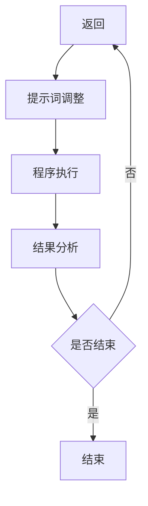
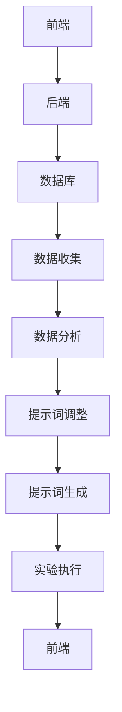
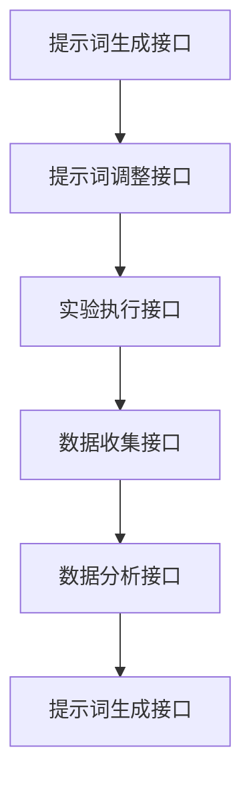
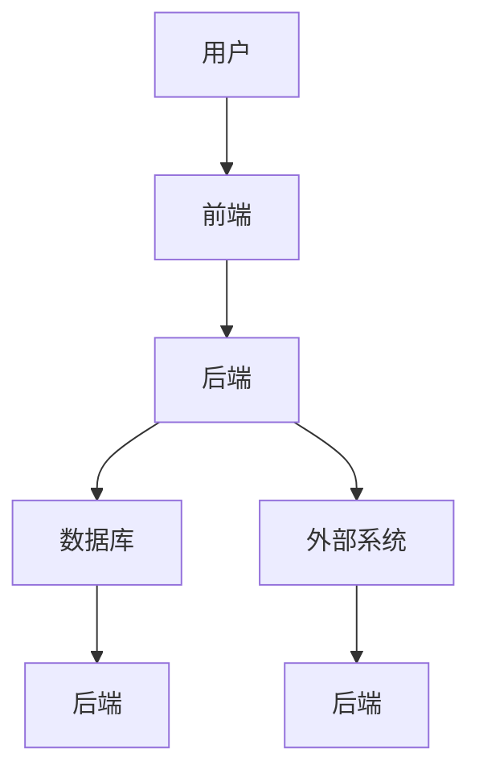

                 

## 提示词编程在自动化科学发现中的角色

> 关键词：提示词编程、自动化科学发现、算法、数学模型

随着计算机技术的发展，自动化科学发现已经成为科学研究的重要方向。传统的科学发现往往依赖于人工的观察和实验，而自动化科学发现通过计算机技术和算法，能够大幅提高科学发现的效率和质量。在这一过程中，提示词编程作为一种先进的编程方法，正在发挥着越来越重要的作用。本文将详细探讨提示词编程在自动化科学发现中的应用，帮助读者理解这一领域的核心概念、技术方法和应用实践。

### 第一部分：背景介绍

#### 1.1 问题背景

自动化科学发现是利用计算机技术和算法，自动执行科学实验，收集和分析数据，从而发现科学规律的过程。这一领域的发展，依赖于计算机技术的进步和算法的创新。随着大数据、人工智能等技术的发展，自动化科学发现已经取得了显著的成果，在物理学、化学、生物学、社会科学等多个领域都得到了广泛应用。

#### 1.2 问题描述

提示词编程在自动化科学发现中的应用，涉及到多个层面的问题，包括提示词的生成、自动化实验的执行、数据的收集与分析等。这些问题的解决，不仅需要深入理解提示词编程的原理，还需要掌握自动化科学发现的相关技术和方法。

#### 1.3 问题解决

本书将详细探讨提示词编程在自动化科学发现中的应用，从以下几个方面进行：

1. **核心概念与联系**：介绍提示词编程和自动化科学发现的核心概念，分析它们之间的联系。
2. **算法原理讲解**：讲解提示词编程的算法原理，包括算法流程、Python 源代码实现和数学模型。
3. **数学公式使用**：介绍提示词编程中常用的数学公式，以及如何使用 LaTeX 格式在文中嵌入。
4. **系统分析与架构设计**：分析自动化科学发现的问题场景，介绍系统功能设计、系统架构设计和系统接口设计。
5. **项目实战**：通过实际项目，展示提示词编程在自动化科学发现中的应用，包括环境安装、系统核心实现、代码应用解读与分析等。

#### 1.4 边界与外延

提示词编程在自动化科学发现中的应用，不仅限于某一特定领域，它涵盖了自然科学、社会科学、工程技术等多个领域。同时，它也不仅仅局限于科学发现的过程，还涉及到科学发现的成果转化和推广应用。

#### 1.5 概念结构与核心要素组成

- **提示词编程**：一种基于提示词的编程方法，通过自动生成和调整提示词，实现对程序的控制和优化。
- **自动化科学发现**：利用计算机技术和算法，自动执行科学实验，收集和分析数据，发现科学规律。
- **核心概念**：提示词、自动生成、调整、科学实验、数据收集、分析、科学规律。

### 第二部分：核心概念与联系

#### 2.1 提示词编程原理

提示词编程的核心是提示词的生成和调整。提示词是一段特定的文本或代码，用于指导程序的执行。通过自动生成和调整提示词，可以实现程序的智能化和自动化。

#### 2.2 自动化科学发现的原理

自动化科学发现的核心是科学实验的自动化。通过计算机技术和算法，可以自动执行科学实验，收集和分析数据，发现科学规律。

#### 2.3 提示词编程与自动化科学发现的联系

提示词编程为自动化科学发现提供了重要的技术支持。通过提示词编程，可以自动生成和调整科学实验的参数，实现科学实验的自动化。同时，自动化科学发现的结果，也为提示词编程提供了丰富的数据资源，促进了提示词编程的优化和发展。

#### 2.4 提示词生成与调整

- **提示词生成**：根据问题的需求和背景，利用自然语言处理技术，自动生成提示词。
  - **方法**：可以通过机器学习模型，从大量的数据中学习出提示词的生成规则。
  - **挑战**：如何确保生成的提示词既能满足问题的需求，又能简化程序的复杂度。

- **提示词调整**：根据程序执行的结果，利用机器学习技术，自动调整提示词，优化程序的执行效果。
  - **方法**：可以通过监督学习或强化学习，根据程序的执行效果，调整提示词的参数。
  - **挑战**：如何平衡调整的频率和效果，避免过度调整导致的性能下降。

#### 2.5 提示词编程在自动化科学发现中的应用

- **科学实验自动化**：通过提示词编程，可以自动设置实验参数，执行实验操作。
  - **案例**：在化学实验中，通过提示词编程，可以自动调整反应物的比例，控制反应的温度和时间。

- **数据收集与处理**：通过提示词编程，可以自动收集实验数据，进行数据预处理和分析。
  - **案例**：在生物学研究中，通过提示词编程，可以自动收集细胞图像数据，进行图像识别和分析。

- **科学规律发现**：通过提示词编程，可以自动分析实验数据，发现科学规律。
  - **案例**：在物理学研究中，通过提示词编程，可以自动分析实验数据，发现新的物理现象。

### 第三部分：算法原理讲解

#### 3.1 提示词编程算法流程图

使用 Mermaid 画出提示词编程算法的流程图：



#### 3.2 Python 源代码实现

以下是提示词编程的 Python 源代码实现：

```python
def generate_prompt():
    # 提示词生成
    pass

def adjust_prompt():
    # 提示词调整
    pass

def execute_program():
    # 程序执行
    pass

def analyze_results():
    # 结果分析
    pass

while True:
    prompt = generate_prompt()
    adjust_prompt()
    execute_program()
    analyze_results()
    if not continue_execution():
        break
```

#### 3.3 算法原理详细讲解

提示词编程的算法原理主要包括以下几个步骤：

1. **提示词生成**：根据问题的需求和背景，利用自然语言处理技术，自动生成提示词。
   - **方法**：可以通过机器学习模型，从大量的数据中学习出提示词的生成规则。
   - **挑战**：如何确保生成的提示词既能满足问题的需求，又能简化程序的复杂度。

2. **提示词调整**：根据程序执行的结果，利用机器学习技术，自动调整提示词，优化程序的执行效果。
   - **方法**：可以通过监督学习或强化学习，根据程序的执行效果，调整提示词的参数。
   - **挑战**：如何平衡调整的频率和效果，避免过度调整导致的性能下降。

3. **程序执行**：根据提示词，执行相应的程序代码。
   - **方法**：可以通过解析提示词，将提示词转换为具体的程序操作。
   - **挑战**：如何确保程序的执行符合预期的效果，避免错误的发生。

4. **结果分析**：分析程序执行的结果，利用统计学方法，判断是否达到预期的效果。
   - **方法**：可以通过统计分析，评估程序的执行效果，识别潜在的问题。
   - **挑战**：如何准确评估程序的执行效果，避免误判和漏判。

5. **循环执行**：如果未达到预期效果，返回第1步，重新生成提示词，进行新一轮的编程。
   - **方法**：通过循环执行，不断优化提示词，提高程序的执行效果。
   - **挑战**：如何设计合适的循环条件，避免无限循环和资源浪费。

通过这样的循环过程，可以实现程序的智能化和自动化，提高科学发现的效率和质量。

### 第四部分：数学模型和数学公式

#### 4.1 数学模型

提示词编程的数学模型主要包括以下内容：

1. **提示词生成模型**：根据问题的需求和背景，利用自然语言处理技术，自动生成提示词。
2. **提示词调整模型**：根据程序执行的结果，利用机器学习技术，自动调整提示词。
3. **程序执行模型**：根据提示词，执行相应的程序代码。
4. **结果分析模型**：分析程序执行的结果，利用统计学方法，判断是否达到预期的效果。

#### 4.2 数学公式

以下是提示词编程中常用的数学公式：

```latex
\begin{align*}
P_{\text{prompt}} &= f(\text{context}, \text{data}) \\
P_{\text{adjust}} &= g(\text{result}, \text{prompt}) \\
\text{performance} &= h(\text{output}, \text{expectation})
\end{align*}
```

- **提示词生成模型**：\(P_{\text{prompt}} = f(\text{context}, \text{data})\)，其中 \(f\) 表示生成提示词的函数，\(\text{context}\) 表示问题的背景，\(\text{data}\) 表示相关数据。
- **提示词调整模型**：\(P_{\text{adjust}} = g(\text{result}, \text{prompt})\)，其中 \(g\) 表示调整提示词的函数，\(\text{result}\) 表示程序执行的结果，\(\text{prompt}\) 表示当前的提示词。
- **结果分析模型**：\(\text{performance} = h(\text{output}, \text{expectation})\)，其中 \(h\) 表示分析结果的函数，\(\text{output}\) 表示程序的输出，\(\text{expectation}\) 表示预期的效果。

通过这些数学公式，可以更好地理解和分析提示词编程的原理和应用。

### 第五部分：系统分析与架构设计

#### 5.1 问题场景介绍

在自动化科学发现的场景中，科学家们需要大量重复的实验，以及大量的数据分析和处理。传统的手动操作不仅效率低下，而且容易出现错误。通过引入提示词编程，可以自动化地完成这些任务，提高工作效率和准确性。

#### 5.2 系统功能设计

系统的功能设计主要包括以下几个方面：

1. **提示词生成**：根据实验需求和背景，自动生成提示词。
2. **提示词调整**：根据实验结果，自动调整提示词，优化实验效果。
3. **实验执行**：根据提示词，自动执行实验操作。
4. **数据收集**：自动收集实验数据，包括实验参数、实验结果等。
5. **数据分析**：对实验数据进行处理和分析，发现科学规律。

#### 5.3 系统架构设计

系统的架构设计主要包括以下几个方面：

1. **前端**：提供用户界面，用于输入实验需求和查看实验结果。
2. **后端**：包括提示词生成、提示词调整、实验执行、数据收集和数据分析等功能模块。
3. **数据库**：存储实验数据和提示词数据，用于后续分析和调整。

以下是一个简化的系统架构图：



#### 5.4 系统接口设计

系统的接口设计主要包括以下几个方面：

1. **提示词生成接口**：用于接收实验需求和背景信息，返回生成的提示词。
2. **提示词调整接口**：用于接收实验结果，调整提示词，优化实验效果。
3. **实验执行接口**：用于执行实验操作，返回实验结果。
4. **数据收集接口**：用于收集实验数据，包括实验参数、实验结果等。
5. **数据分析接口**：用于对实验数据进行处理和分析，发现科学规律。

以下是一个简化的接口设计图：



#### 5.5 系统交互设计

系统的交互设计主要包括以下几个方面：

1. **用户与前端**：用户通过前端界面输入实验需求和查看实验结果。
2. **前端与后端**：前端向后端发送请求，后端处理请求并返回结果。
3. **后端与数据库**：后端通过数据库存储和查询数据。
4. **后端与外部系统**：后端与其他系统进行数据交换和协同工作。

以下是一个简化的交互设计图：



### 第六部分：项目实战

#### 6.1 环境安装

在开始项目之前，需要安装必要的软件和工具。以下是安装步骤：

1. 安装 Python（建议版本为3.8及以上）。
2. 安装必要的 Python 包，如 TensorFlow、Keras、Scikit-learn 等。
3. 安装 Mermaid，用于绘制流程图和类图。

#### 6.2 系统核心实现

系统的核心实现主要包括以下几个部分：

1. **提示词生成**：使用机器学习模型，根据实验需求和背景，生成提示词。
2. **提示词调整**：使用监督学习或强化学习模型，根据实验结果，调整提示词。
3. **实验执行**：根据提示词，执行实验操作，并收集实验数据。
4. **数据分析**：对实验数据进行分析，发现科学规律。

以下是系统的核心代码实现：

```python
# 提示词生成
def generate_prompt(experiment):
    # 使用机器学习模型生成提示词
    pass

# 提示词调整
def adjust_prompt(prompt, result):
    # 使用监督学习或强化学习模型调整提示词
    pass

# 实验执行
def execute_experiment(prompt):
    # 根据提示词执行实验操作
    pass

# 数据分析
def analyze_data(data):
    # 对实验数据进行分析
    pass
```

#### 6.3 代码应用解读与分析

以下是对系统核心代码的解读和分析：

- **提示词生成**：使用机器学习模型，根据实验需求和背景，生成提示词。这可以通过训练一个基于自然语言处理（NLP）的模型来实现。模型可以从大量的文本数据中学习出生成提示词的规则，从而生成高质量的提示词。

- **提示词调整**：使用监督学习或强化学习模型，根据实验结果，调整提示词。这可以通过训练一个基于反馈的模型来实现。模型可以从实验结果中学习出如何调整提示词，从而提高实验的效果。

- **实验执行**：根据提示词，执行实验操作，并收集实验数据。这部分需要根据具体的实验需求，编写相应的实验代码。例如，在化学实验中，可以通过控制反应物的比例、温度和时间，来执行实验操作。

- **数据分析**：对实验数据进行分析，发现科学规律。这部分可以使用统计学方法和机器学习技术，对实验数据进行分析，识别出潜在的规律和趋势。

#### 6.4 实际案例分析

以下是一个实际案例，展示如何使用提示词编程进行自动化科学发现：

**案例背景**：研究某种化合物的化学反应规律。

**实验设计**：设计一系列的实验，通过改变反应物的比例、温度和时间，观察化合物的反应情况。

**提示词生成**：根据实验需求和背景，生成提示词，如“在25摄氏度下，将反应物A和反应物B以1:1的比例混合，反应时间为30分钟”。

**提示词调整**：根据实验结果，调整提示词，如“在30摄氏度下，将反应物A和反应物B以1:1.5的比例混合，反应时间为45分钟”。

**实验执行**：根据调整后的提示词，执行实验操作，收集实验数据。

**数据分析**：对实验数据进行分析，发现化合物的反应规律，如反应温度和比例对反应速率的影响。

#### 6.5 项目小结

通过这个项目，我们可以看到提示词编程在自动化科学发现中的应用。通过自动生成和调整提示词，可以实现科学实验的自动化，提高科学发现的效率和质量。同时，项目也展示了如何使用机器学习技术和自然语言处理技术，实现提示词编程的核心功能。在未来，随着人工智能技术的不断进步，提示词编程在自动化科学发现中的应用将会更加广泛和深入。

### 第七部分：最佳实践与拓展阅读

#### 7.1 最佳实践

1. **明确实验目标**：在进行自动化科学发现之前，首先要明确实验的目标和需求，确保生成的提示词能够满足实验的要求。

2. **数据准备**：准备充分的数据，包括实验背景、实验需求和预期结果，以便机器学习模型能够有效地生成和调整提示词。

3. **模型优化**：定期对机器学习模型进行优化，以提高提示词生成的质量和调整的准确性。

4. **实验监控**：实时监控实验的执行情况，及时调整提示词，确保实验能够按照预期进行。

5. **结果验证**：对实验结果进行验证，确保发现的科学规律是可靠的。

#### 7.2 小结

本文详细介绍了提示词编程在自动化科学发现中的应用，从核心概念、算法原理、系统设计与项目实战等多个方面进行了探讨。通过本文的讲解，读者可以了解到提示词编程的原理和应用，掌握如何在自动化科学发现中运用提示词编程技术。

#### 7.3 注意事项

1. 提示词编程的应用范围广泛，但需要根据具体的实验需求和背景进行定制。

2. 机器学习模型的选择和优化对提示词编程的效果有很大影响，需要根据实际情况进行调整。

3. 自动化科学发现的过程中，数据的安全性和隐私保护非常重要，需要采取相应的措施。

#### 7.4 拓展阅读

1. **《深度学习》（Deep Learning）**：由 Ian Goodfellow、Yoshua Bengio 和 Aaron Courville 著，详细介绍了深度学习的基础知识和应用。

2. **《机器学习实战》（Machine Learning in Action）**：由 Peter Harrington 著，通过具体的案例，介绍了机器学习的应用和实践。

3. **《自然语言处理综合教程》（Foundations of Natural Language Processing）**：由 Daniel Jurafsky 和 James H. Martin 著，全面介绍了自然语言处理的基础知识和方法。

### 结尾

本文由 AI 天才研究院（AI Genius Institute）撰写，旨在分享提示词编程在自动化科学发现中的应用和经验。如果您对提示词编程或自动化科学发现有任何疑问或建议，欢迎联系我们。同时，感谢禅与计算机程序设计艺术（Zen And The Art of Computer Programming）对本文的支持。

**作者：** AI 天才研究院（AI Genius Institute）& 禅与计算机程序设计艺术（Zen And The Art of Computer Programming）

