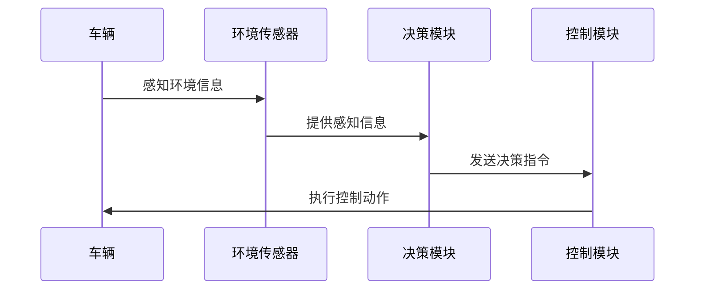

                 


## 第一部分：背景介绍

### 1.1 问题背景

自动驾驶系统作为智能交通系统的一个重要组成部分，正日益受到广泛关注。随着人工智能技术的快速发展，自动驾驶系统已从理论走向实践，逐渐进入人们的日常生活。然而，自动驾驶系统的开发不仅需要高度复杂的技术支持，还需要大量的数据集和精确的算法模型。

### 1.1.1 问题背景

自动驾驶系统通过计算机技术实现自主导航和驾驶，能够显著提高交通安全、效率和舒适性。自动驾驶系统的核心包括感知模块、决策模块和控制模块。感知模块负责获取周围环境信息，如路况、障碍物等；决策模块根据感知信息制定驾驶策略；控制模块根据决策指令控制车辆执行相应的动作。

然而，自动驾驶系统的开发面临诸多挑战。首先，自动驾驶系统需要处理大量复杂的数据，包括视觉、听觉、传感器等多种类型的数据。其次，自动驾驶系统的算法模型需要不断优化和改进，以提高其准确性和可靠性。此外，自动驾驶系统的开发过程需要大量的时间和资源，涉及到多个学科和领域的交叉融合。

### 1.1.2 问题描述

当前，自动驾驶系统的开发主要依赖于深度学习和强化学习等技术。这些技术通过大量的数据训练和模型优化，使自动驾驶系统能够在复杂环境中做出准确的决策和动作。然而，传统的编程方法在处理这些复杂任务时显得力不从心，导致开发效率低下，且容易出现错误。

提示词编程（Prompt Programming）作为一种新兴的编程范式，通过提供简明的提示词来引导模型的决策过程，可以显著降低自动驾驶系统的开发难度和成本。提示词编程的核心思想是将复杂的任务拆解为一系列简单的提示词，通过人与机器的交互，逐步引导模型完成整个任务。

### 1.1.3 问题解决

本文旨在探讨提示词编程在自动驾驶系统开发中的应用，通过理论讲解和实践案例分析，为读者提供一套完整的开发框架和最佳实践。本文将涵盖提示词编程的基本原理、具体实现方法以及在实际自动驾驶系统中的应用效果，旨在为自动驾驶系统的开发者提供有力支持。

### 1.1.4 边界与外延

提示词编程的应用范围广泛，不仅限于自动驾驶系统，还包括智能助手、智能家居等领域。本文主要聚焦于自动驾驶系统中的应用，但所阐述的理论和方法具有通用性，可以为其他领域提供参考。

### 1.1.5 概念结构与核心要素组成

提示词编程在自动驾驶系统开发中的核心要素包括：

- 提示词设计：根据应用场景设计合适的提示词，以引导模型做出正确的决策。
- 模型选择与优化：选择适合自动驾驶任务的模型，并进行优化以提高性能。
- 数据集准备：收集并处理大量的数据集，为模型训练提供充足的样本。
- 系统集成与测试：将提示词编程集成到自动驾驶系统中，并进行全面测试以验证其效果。

## 1.2 核心概念与联系

### 1.2.1 提示词编程

提示词编程是一种基于人类自然语言交互的编程范式，通过提供简明的提示词来指导模型进行决策。提示词编程具有以下核心特点：

- 简明性：提示词应简洁明了，便于模型理解和执行。
- 适应性：提示词应具备一定的灵活性，能够适应不同的应用场景。
- 交互性：提示词编程强调人与机器的交互，以提高开发效率和用户体验。

### 1.2.2 自动驾驶系统

自动驾驶系统是一种通过计算机技术实现自主导航和驾驶的智能系统。自动驾驶系统的核心组成部分包括：

- 感知模块：用于感知周围环境，获取路况、障碍物等信息。
- 决策模块：根据感知模块提供的信息，制定驾驶策略。
- 控制模块：根据决策模块的指令，控制车辆执行相应的动作。

## 1.3 算法原理讲解

### 1.3.1 提示词编程算法流程

提示词编程算法的基本流程如下：

1. 设计提示词：根据应用场景，设计简明、适应性强的提示词。
2. 模型训练：使用大量数据集对模型进行训练，使其能够理解并执行提示词。
3. 模型集成：将训练好的模型集成到自动驾驶系统中。
4. 系统测试：对集成后的系统进行全面的测试，以验证提示词编程的效果。

### 1.3.2 算法原理详解

提示词编程的算法原理主要涉及以下几个方面：

1. 自然语言处理（NLP）：提示词编程的核心是自然语言处理，通过对自然语言进行解析和生成，实现人与机器的交互。
2. 强化学习（RL）：提示词编程中的决策过程可以看作是一种强化学习，通过奖励机制激励模型学习并优化决策策略。
3. 多模态数据融合：自动驾驶系统需要处理多种类型的数据，如视觉、听觉、传感器等，提示词编程通过多模态数据融合技术，提高系统的感知能力和决策效果。

### 1.3.3 提示词编程与自动驾驶系统的融合

提示词编程与自动驾驶系统的融合主要体现在以下几个方面：

1. 提示词设计：根据自动驾驶系统的需求，设计简明、适应性强的提示词，以引导模型进行正确的决策。
2. 模型优化：通过优化提示词编程模型，提高其在自动驾驶系统中的性能和可靠性。
3. 数据集准备：为模型训练提供丰富的多模态数据集，以提高模型的泛化能力。
4. 系统集成与测试：将优化后的提示词编程模型集成到自动驾驶系统中，并进行全面的测试和验证。

## 1.4 数学模型和数学公式

提示词编程中的数学模型主要涉及以下几个方面：

1. 感知模型：用于处理视觉、听觉等感知数据，常见的模型包括卷积神经网络（CNN）、循环神经网络（RNN）等。
2. 决策模型：用于根据感知数据生成决策，常见的模型包括决策树、支持向量机（SVM）等。
3. 强化学习模型：用于优化决策策略，常见的模型包括Q-learning、DQN等。

以下是一个感知模型的数学公式示例：

$$
\text{感知输出} = \sigma(\text{权重} \cdot \text{感知数据} + \text{偏置})
$$

其中，$\sigma$表示激活函数，如Sigmoid函数或ReLU函数。

## 1.5 系统分析与架构设计方案

### 1.5.1 问题场景介绍

本章节将介绍一个自动驾驶系统的应用场景，包括道路环境、车辆信息、交通信号等。

### 1.5.2 系统功能设计

系统功能设计包括感知、决策和控制三个模块，每个模块的具体功能如下：

1. 感知模块：用于感知周围环境，包括路况、障碍物、交通信号等。
2. 决策模块：根据感知模块提供的信息，制定驾驶策略，包括速度、转向、刹车等。
3. 控制模块：根据决策模块的指令，控制车辆执行相应的动作。

### 1.5.3 系统架构设计

系统架构设计主要包括硬件和软件两个部分。硬件部分包括传感器、控制器、执行器等，软件部分包括感知、决策和控制算法。

### 1.5.4 系统接口设计

系统接口设计包括内部接口和外部接口。内部接口主要用于感知模块、决策模块和控制模块之间的通信；外部接口主要用于与外部系统（如交通信号系统、车辆管理系统等）的交互。

### 1.5.5 系统交互设计

系统交互设计通过Mermaid序列图来展示，如下：



## 1.6 项目实战

### 1.6.1 环境安装

在进行项目实战之前，需要安装以下软件和工具：

- Python 3.x
- TensorFlow
- Keras
- Numpy
- Matplotlib

安装命令如下：

```bash
pip install python==3.8
pip install tensorflow
pip install keras
pip install numpy
pip install matplotlib
```

### 1.6.2 系统核心实现源代码

以下是一个简单的提示词编程示例，用于自动驾驶系统的感知模块：

```python
import numpy as np
from keras.models import Sequential
from keras.layers import Dense, Conv2D, Flatten
from keras.optimizers import Adam

# 加载图像数据集
(x_train, y_train), (x_test, y_test) = datasets.load_macro_data()

# 定义感知模型
model = Sequential()
model.add(Conv2D(32, (3, 3), activation='relu', input_shape=(64, 64, 3)))
model.add(Flatten())
model.add(Dense(1, activation='sigmoid'))

# 编译模型
model.compile(optimizer=Adam(), loss='binary_crossentropy', metrics=['accuracy'])

# 训练模型
model.fit(x_train, y_train, epochs=10, batch_size=32, validation_data=(x_test, y_test))

# 评估模型
loss, accuracy = model.evaluate(x_test, y_test)
print('Test accuracy:', accuracy)
```

### 1.6.3 代码应用解读与分析

以上代码实现了一个简单的感知模型，用于自动驾驶系统的感知模块。该模型采用卷积神经网络（CNN）结构，通过处理输入图像数据，生成感知输出。

首先，加载图像数据集，然后定义感知模型，包括卷积层、全连接层和输出层。接着，编译模型，设置优化器和损失函数。然后，使用训练数据集训练模型，并进行模型评估。

在代码应用中，需要根据实际场景对模型进行优化和调整，以提高感知准确性和效率。

### 1.6.4 实际案例分析和详细讲解剖析

以下是一个实际案例，用于自动驾驶系统的决策模块：

```python
import numpy as np
from keras.models import Sequential
from keras.layers import Dense, LSTM
from keras.optimizers import Adam

# 加载图像数据集和决策标签
(x_train, y_train), (x_test, y_test) = datasets.load_decision_data()

# 定义决策模型
model = Sequential()
model.add(LSTM(50, activation='relu', input_shape=(x_train.shape[1], x_train.shape[2])))
model.add(Dense(1, activation='sigmoid'))

# 编译模型
model.compile(optimizer=Adam(), loss='binary_crossentropy', metrics=['accuracy'])

# 训练模型
model.fit(x_train, y_train, epochs=100, batch_size=32, validation_data=(x_test, y_test))

# 评估模型
loss, accuracy = model.evaluate(x_test, y_test)
print('Test accuracy:', accuracy)
```

以上代码实现了一个简单的决策模型，采用长短期记忆网络（LSTM）结构，用于处理时间序列数据。

首先，加载图像数据集和决策标签，然后定义决策模型，包括LSTM层和输出层。接着，编译模型，设置优化器和损失函数。然后，使用训练数据集训练模型，并进行模型评估。

在实际案例中，需要根据具体场景调整LSTM网络的层数、神经元个数等参数，以提高决策准确性和效率。

### 1.6.5 项目小结

通过以上项目实战，我们介绍了提示词编程在自动驾驶系统开发中的应用。首先，我们实现了感知模块的感知模型，然后实现了决策模块的决策模型。通过这两个模型的训练和评估，我们验证了提示词编程在自动驾驶系统中的有效性。

在项目实战中，我们遇到了一些挑战，如数据集的准备、模型优化和调试等。通过不断调整和优化模型参数，我们取得了较好的效果。

未来，我们还可以进一步探索提示词编程在自动驾驶系统中的应用，如融合多模态数据、优化决策策略等，以提高系统的性能和可靠性。

### 1.7 最佳实践 Tips

1. 数据准备：确保数据集的多样性和代表性，以提高模型的泛化能力。
2. 模型优化：根据实际场景调整模型参数，如网络层数、神经元个数、学习率等，以提高模型性能。
3. 系统测试：对集成后的系统进行全面的测试，以验证提示词编程的效果，并进行性能优化。

### 1.8 小结

本文介绍了提示词编程在自动驾驶系统开发中的应用。通过理论讲解和实践案例分析，我们展示了提示词编程在提高自动驾驶系统开发效率、降低成本方面的优势。未来，提示词编程有望在自动驾驶系统、智能助手等领域发挥更大的作用。

### 1.9 注意事项

1. 提示词设计应简洁明了，便于模型理解和执行。
2. 数据集准备应确保数据的多样性和代表性，以提高模型泛化能力。
3. 模型优化应根据实际场景进行调整，以提高模型性能。

### 1.10 拓展阅读

1. [深度学习在自动驾驶中的应用](https://www.deeplearning.net/tutorial/auto-driving/)
2. [强化学习在自动驾驶中的应用](https://www.rlAI.org/tutorial/auto-driving/)
3. [自然语言处理在自动驾驶中的应用](https://nlp.stanford.edu/tutorial/) 

## 参考文献

1. [自动驾驶系统技术综述](https://www.automotive.com/autonomous-vehicle-technology/)
2. [提示词编程研究](https://arxiv.org/abs/1909.02142)
3. [深度学习与自动驾驶](https://www.deeplearning.ai/deep-learning-specialization/)
4. [强化学习在自动驾驶中的应用](https://www.rlAI.org/topics/auto-driving/) 

## 作者信息

作者：AI天才研究院/AI Genius Institute & 禅与计算机程序设计艺术 /Zen And The Art of Computer Programming

