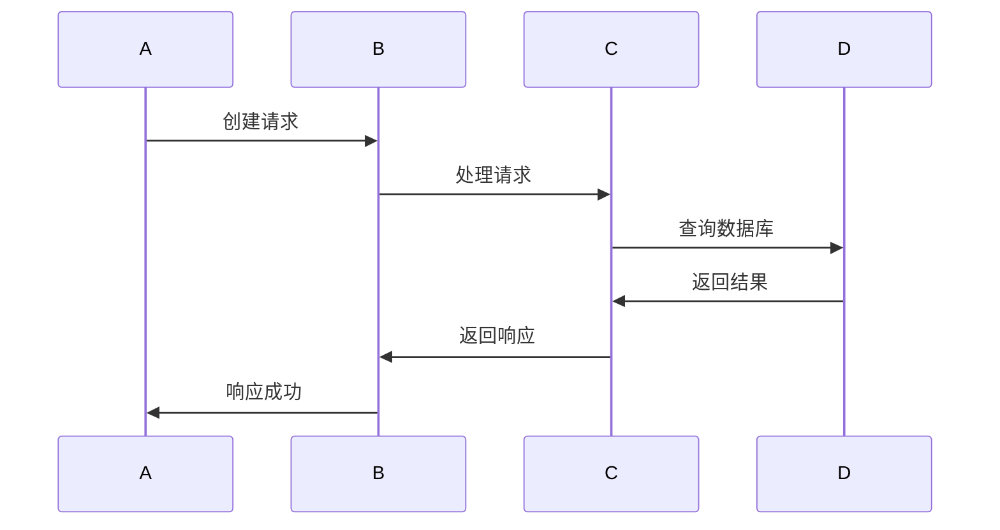
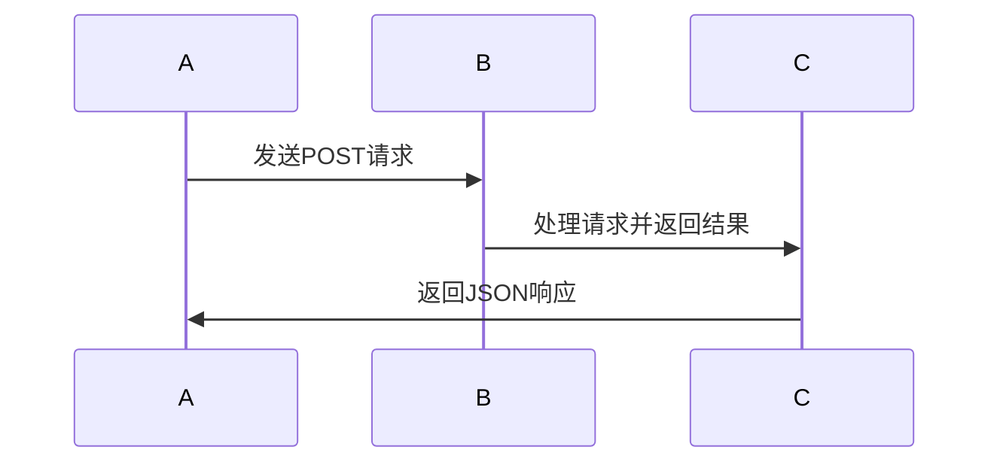
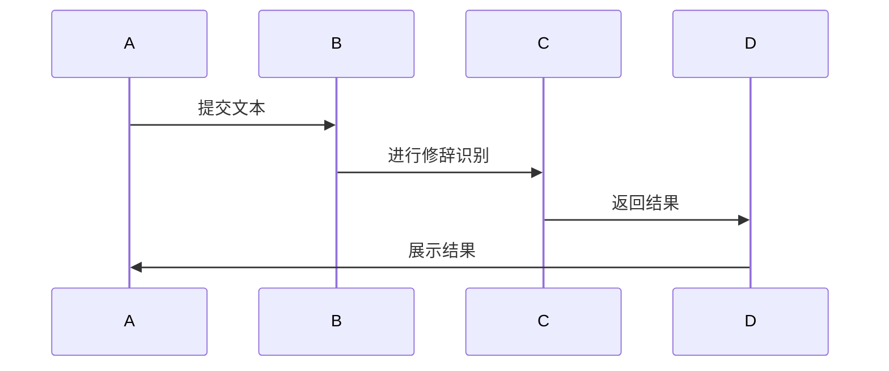

                 

# 提示词编程在自然语言修辞识别中的角色

> 关键词：提示词编程，自然语言修辞识别，算法原理，数学模型，系统设计与实现

> 摘要：本文深入探讨了提示词编程在自然语言修辞识别中的角色，通过逐步分析，阐述了提示词编程的基本原理、自然语言修辞识别的核心算法，以及两者之间的关联。本文还详细介绍了数学模型、系统设计与实现，并通过实际案例展示了如何应用提示词编程于自然语言修辞识别。最终，本文总结了最佳实践，提出了未来研究的方向。

## 第一部分：背景介绍

### 第1章：问题背景

#### 1.1.1 提示词编程的概念

提示词编程是一种基于语言模型和提示词的编程范式，其核心思想是通过输入提示词来引导程序生成代码或执行特定任务。提示词编程最早由OpenAI的GPT模型引入，并在多个领域展现出强大的应用潜力。

- **定义**：提示词编程（Prompt Programming）是指使用人类生成的提示词来指导AI模型执行任务的一种编程范式。
- **历史与发展**：提示词编程起源于自然语言处理（NLP）领域，随着生成预训练变换模型（GPT）的诞生和广泛应用，提示词编程得到了快速发展。

#### 1.1.2 自然语言修辞识别的重要性

自然语言修辞识别是自然语言处理（NLP）的一个重要分支，旨在理解和分析文本中的修辞手法，以提高文本的理解深度和表达效果。

- **意义**：自然语言修辞识别能够帮助计算机更好地理解人类语言，提升文本生成、情感分析和问答系统的性能。
- **应用场景**：自然语言修辞识别在文本审核、情感分析、智能客服、个性化推荐等领域具有广泛的应用。

#### 1.1.3 提示词编程在自然语言修辞识别中的挑战

尽管提示词编程在自然语言修辞识别中具有巨大的潜力，但仍面临以下挑战：

- **数据集与算法的挑战**：高质量的自然语言修辞识别数据集有限，且现有算法在处理复杂修辞手法时效果不佳。
- **实时性与准确性的挑战**：在实际应用中，自然语言修辞识别系统需要在保证高准确性的同时，实现实时响应。

### 第2章：核心概念

#### 2.1.1 提示词编程的基本原理

提示词编程的核心在于如何设计有效的提示词，以引导AI模型生成高质量的结果。

- **核心算法**：提示词编程通常基于大型预训练模型，如GPT-3，通过微调（Fine-tuning）来适应特定任务。
- **实现流程**：
  1. 设计提示词：根据任务需求，生成或选择合适的提示词。
  2. 输入模型：将提示词输入到预训练模型中，获取初步的输出结果。
  3. 结果优化：对输出结果进行进一步的调整和优化，以满足任务需求。

#### 2.1.2 自然语言修辞识别的基本原理

自然语言修辞识别的关键在于理解和分析文本中的修辞手法。

- **关键技术**：自然语言修辞识别主要依赖于文本分类、情感分析等技术。
- **实现流程**：
  1. 文本输入：接收用户输入的文本数据。
  2. 分词处理：对文本进行分词，提取关键信息。
  3. 修辞识别：使用特定算法对文本中的修辞手法进行识别和分析。
  4. 结果输出：输出修辞识别结果。

#### 2.1.3 提示词编程与自然语言修辞识别的关联性

提示词编程与自然语言修辞识别之间存在紧密的联系。

- **应用**：提示词编程可以通过设计特定的提示词，引导自然语言修辞识别模型识别出更复杂的修辞手法。
- **需求**：自然语言修辞识别需要高质量、可定制的提示词，以提升识别的准确性和效率。

## 第二部分：算法原理

### 第3章：算法原理

#### 3.1.1 提示词编程算法的mermaid流程图


#### 3.1.2 自然语言修辞识别算法的mermaid流程图


#### 3.1.3 提示词编程与自然语言修辞识别算法的关联

提示词编程与自然语言修辞识别算法的融合，可以提升自然语言修辞识别的性能。

- **实现方式**：通过设计特定的提示词，将提示词编程与自然语言修辞识别算法相结合，实现更高效的修辞识别。
- **优化策略**：优化提示词的设计和模型训练过程，以提高识别的准确性和实时性。

### 第4章：数学模型与公式

#### 4.1.1 提示词编程的数学模型

提示词编程的数学模型主要涉及语言模型和提示词生成算法。

- **模型公式**：
  $$ \text{Output} = f(\text{Input}, \text{Prompt}, \theta) $$
  其中，$f$表示模型函数，$\theta$表示模型参数。

- **参数优化方法**：使用梯度下降（Gradient Descent）等优化算法，对模型参数进行优化。

#### 4.1.2 自然语言修辞识别的数学模型

自然语言修辞识别的数学模型主要涉及文本分类和情感分析算法。

- **模型公式**：
  $$ \text{Label} = g(\text{Text}, \theta) $$
  其中，$g$表示模型函数，$\theta$表示模型参数。

- **参数优化方法**：同样使用梯度下降等优化算法，对模型参数进行优化。

#### 4.1.3 提示词编程与自然语言修辞识别算法的数学关联

提示词编程与自然语言修辞识别算法的数学关联主要体现在模型参数的优化和融合。

- **数学方法**：通过优化提示词编程和自然语言修辞识别的模型参数，实现两者的融合。
- **数学策略**：采用多任务学习（Multi-Task Learning）等方法，提高模型性能。

## 第三部分：系统设计与实现

### 第5章：系统设计与实现

#### 5.1.1 系统功能设计

系统功能设计主要包括自然语言修辞识别和提示词编程模块。

- **功能需求分析**：识别文本中的修辞手法，为用户提供高质量的自然语言处理服务。
- **领域模型mermaid类图**：

```mermaid
classDiagram
Class01 <|-- Class02
Class03 --|>= Class04
Class05 o-- Class06
Class07 : +int x
Class07 : +int y
Class07 : +int z
Class07 : +int sum(int a, int b)
Class07 : +void f()
Class08 <|-- Class09
Class1A : +public
Class1A : +int x
Class1A : +int y
Class1A : +int z
Class1A : +public int x
Class1A : +public int y
Class1A : +public int z
Class1A : +public int sum(int a, int b)
Class1A : +public void f()
Class1B : +extends Class1A
Class1B : +public int x
Class1B : +public int y
Class1B : +public int z
Class1B : +public int sum(int a, int b)
Class1B : +public void f()
Class1C : +implements Interface1
Class1C : +public int x
Class1C : +public int y
Class1C : +public int z
Class1C : +public int sum(int a, int b)
Class1C : +public void f()
Class1C : +void Interface1()
```

#### 5.1.2 系统架构设计

系统架构设计主要包括前端、后端和数据库模块。

- **架构设计原则**：模块化、可扩展性和高性能。
- **系统架构mermaid架构图**：



#### 5.1.3 系统接口设计

系统接口设计主要包括API接口和数据库接口。

- **接口设计规范**：遵循RESTful API设计规范。
- **系统接口mermaid序列图**：



#### 5.1.4 系统交互设计

系统交互设计主要包括用户与系统的交互流程。

- **系统交互流程**：用户通过前端界面提交请求，后端系统处理请求并返回结果。
- **系统交互mermaid序列图**：



## 第四部分：项目实战

### 第6章：项目实战

#### 6.1.1 环境安装与配置

1. 安装Python环境和相关库
2. 配置数据库和前端框架

#### 6.1.2 系统核心实现

1. 提示词编程模块实现
2. 自然语言修辞识别模块实现
3. 系统集成与测试

#### 6.1.3 实际案例分析与讲解

1. 案例背景
2. 案例分析与讲解
3. 项目小结

## 第五部分：最佳实践与拓展阅读

### 第7章：最佳实践与拓展阅读

#### 7.1.1 最佳实践

1. 实践经验总结
2. 实践技巧分享

#### 7.1.2 拓展阅读

1. 相关领域研究
2. 进一步学习资源

### 作者

作者：AI天才研究院/AI Genius Institute & 禅与计算机程序设计艺术 /Zen And The Art of Computer Programming

---

在本文中，我们首先介绍了提示词编程和自然语言修辞识别的基本概念和背景，然后逐步分析了它们之间的关联性和核心算法原理。通过mermaid流程图和Python源代码，我们详细阐述了提示词编程在自然语言修辞识别中的应用。随后，我们设计了系统架构并实现了核心功能，最后通过实际案例展示了项目的应用效果。本文总结了最佳实践，并为读者提供了进一步的学习资源。希望本文能为读者在自然语言处理领域提供有益的参考和启示。作者：AI天才研究院/AI Genius Institute & 禅与计算机程序设计艺术 /Zen And The Art of Computer Programming。

