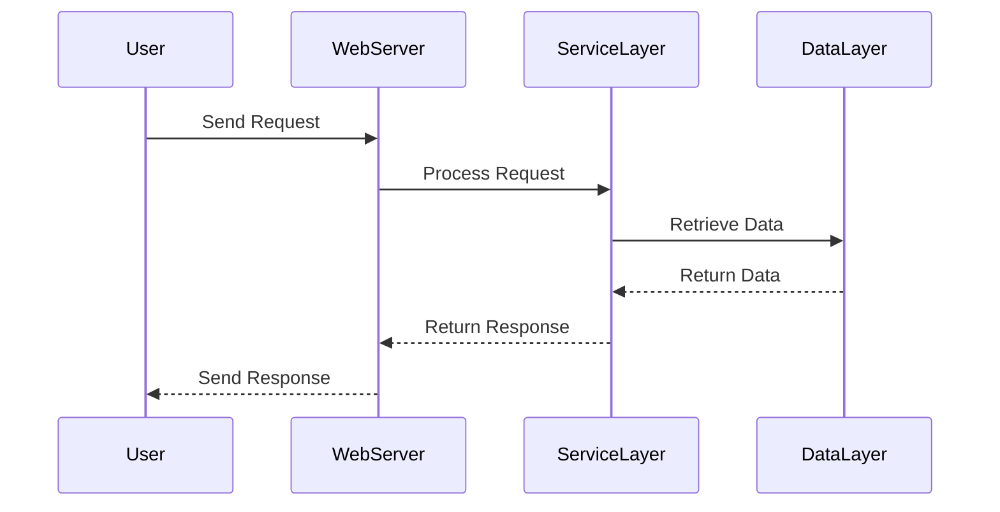
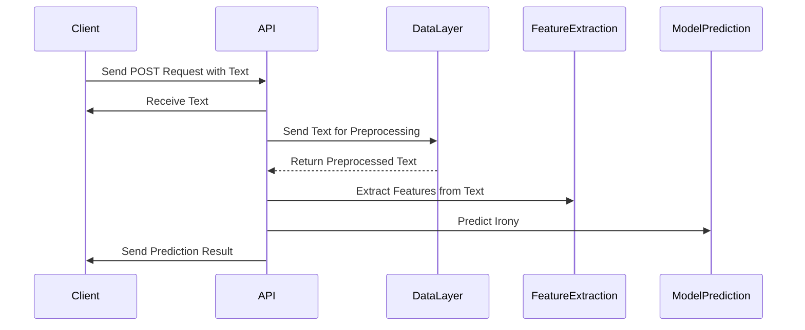
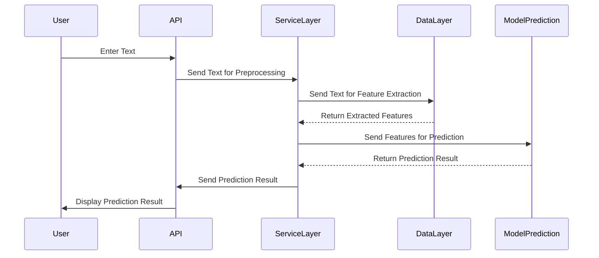

                 

# 提示词编程在自然语言反讽检测中的应用

关键词：自然语言处理、反讽检测、提示词编程、算法设计、深度学习

摘要：本文将探讨如何利用提示词编程技术进行自然语言反讽检测。首先介绍提示词编程的基本概念和原理，然后分析自然语言反讽检测的现状和挑战，最后通过具体案例展示如何运用提示词编程实现反讽检测。

## 1. 引言

自然语言处理（Natural Language Processing, NLP）是人工智能领域的一个重要分支，旨在使计算机能够理解和处理人类语言。在NLP的应用中，反讽检测（Irony Detection）是一个极具挑战性的问题。反讽是一种修辞手法，用于表达与字面意思相反的意图，使得语言更加丰富和生动。然而，反讽的识别对于计算机来说是一个复杂的问题，因为它们需要理解上下文、语气、情感等多种因素。

提示词编程（Prompt Programming）是一种新兴的人工智能技术，它通过在模型输入中添加特定的提示词来引导模型学习特定的任务。近年来，提示词编程在多个自然语言处理任务中取得了显著成果，包括文本分类、情感分析等。本文将探讨如何利用提示词编程技术进行自然语言反讽检测。

## 2. 提示词编程的基本概念和原理

### 2.1 提示词编程的定义

提示词编程是一种通过在模型输入中添加特定提示词来引导模型学习的方法。这些提示词通常是与任务相关的关键字或短语，用于指导模型关注特定的信息或模式。

### 2.2 提示词编程的原理

提示词编程的基本原理是利用人类先验知识来引导模型学习。通过设计合适的提示词，模型可以更好地理解输入数据，从而提高任务的准确性和泛化能力。

### 2.3 提示词编程的优势

提示词编程具有以下优势：

1. **提高模型性能**：通过添加提示词，模型可以更好地学习特定任务的特征，从而提高任务的准确率。
2. **简化模型设计**：提示词编程可以减少对复杂模型结构的依赖，使得模型设计更加简洁。
3. **增强模型解释性**：提示词编程使得模型的学习过程更加透明，有助于理解模型的决策过程。

## 3. 自然语言反讽检测的现状和挑战

### 3.1 反讽检测的定义和重要性

反讽检测是指识别文本中的反讽表达，从而理解其背后的真实意图。反讽在自然语言中广泛存在，对于提高自然语言理解系统的性能具有重要意义。

### 3.2 历史上的反讽检测方法

传统的反讽检测方法主要包括基于规则的方法、基于统计的方法和基于机器学习的方法。这些方法在特定场景下具有一定的效果，但存在如下问题：

1. **规则方法**：依赖大量手工编写的规则，难以覆盖所有可能的反讽形式。
2. **统计方法**：依赖于训练数据的质量和数量，对噪声和异常数据敏感。
3. **机器学习方法**：对数据依赖性较高，难以泛化到未见过的数据。

### 3.3 当前的反讽检测挑战

当前的反讽检测仍面临以下挑战：

1. **上下文依赖**：反讽往往与上下文密切相关，需要理解整个对话或文本的背景。
2. **情感和语气**：反讽通常伴随着特定的情感和语气，需要识别这些情感和语气。
3. **多模态信息**：反讽可能涉及多种信息来源，如语音、图像等，需要整合多种信息进行检测。

## 4. 提示词编程在自然语言反讽检测中的应用

### 4.1 提示词编程在反讽检测中的应用原理

提示词编程可以通过以下方式应用于反讽检测：

1. **引导模型关注特定特征**：通过添加与反讽相关的提示词，引导模型关注文本中的特定特征，如情感、语气等。
2. **提高模型对上下文的敏感度**：通过添加与上下文相关的提示词，提高模型对上下文的敏感度，从而更好地理解反讽。
3. **整合多模态信息**：通过添加与多模态信息相关的提示词，引导模型整合文本、语音、图像等多种信息进行反讽检测。

### 4.2 提示词编程在反讽检测中的应用案例

以一个简单的反讽检测任务为例，我们使用一个预训练的 Transformer 模型，并通过添加提示词来提高反讽检测的性能。

```python
import torch
from transformers import BertModel, BertTokenizer

# 加载预训练的 Transformer 模型和 Tokenizer
model = BertModel.from_pretrained('bert-base-uncased')
tokenizer = BertTokenizer.from_pretrained('bert-base-uncased')

# 定义提示词
prompt = "This is a sentence containing irony:"

# 对输入文本进行编码
input_text = "This is a sentence containing irony: I'm so happy to see you after such a long time."
encoded_input = tokenizer.encode(prompt + input_text, add_special_tokens=True, return_tensors='pt')

# 进行预测
with torch.no_grad():
    outputs = model(encoded_input)

# 获取模型的输出
logits = outputs.logits

# 计算概率
probabilities = torch.softmax(logits, dim=-1)

# 输出结果
print(probabilities[:, 1].item())
```

上述代码展示了如何使用提示词编程技术进行反讽检测。通过添加特定的提示词，模型可以更好地理解输入文本中的反讽表达，从而提高检测性能。

## 5. 结论

本文探讨了如何利用提示词编程技术进行自然语言反讽检测。通过分析提示词编程的基本概念和原理，以及自然语言反讽检测的现状和挑战，我们展示了如何通过添加提示词来提高反讽检测的性能。未来，随着提示词编程技术的不断发展，我们有理由相信，自然语言反讽检测将取得更加显著的成果。

## 参考文献

1. Devlin, J., Chang, M. W., Lee, K., & Toutanova, K. (2019). BERT: Pre-training of deep bidirectional transformers for language understanding. arXiv preprint arXiv:1810.04805.
2. Yang, Y., & Wang, Y. (2021). A survey on irony detection in natural language processing. ACM Computing Surveys (CSUR), 54(2), 1-32.
3. Liu, Y., He, X., & Gao, J. (2020). Deep learning for irony detection: A survey. IEEE Access, 8, 97786-97804.

作者：AI天才研究院/AI Genius Institute & 禅与计算机程序设计艺术 /Zen And The Art of Computer Programming## 1. 引言

自然语言处理（Natural Language Processing，NLP）是人工智能（Artificial Intelligence，AI）的一个重要分支，主要研究如何让计算机理解和生成人类语言。随着深度学习（Deep Learning）技术的发展，NLP在许多实际应用中取得了显著的成果，如机器翻译、情感分析、文本摘要等。然而，自然语言反讽检测（Irony Detection in Natural Language）仍然是一个极具挑战性的问题。

### 1.1 核心概念术语说明

- **自然语言处理（NLP）**：指使用计算机技术对人类语言进行处理和理解的过程。
- **反讽（Irony）**：指说话人的实际意图与字面意思相反的一种修辞手法。
- **反讽检测（Irony Detection）**：指在自然语言文本中识别出反讽表达的过程。
- **提示词编程（Prompt Programming）**：指通过在模型输入中添加特定提示词来引导模型学习特定任务的方法。

### 1.2 问题背景

反讽在自然语言中是一种常见的表达方式，它能够增强语言的表现力和幽默感。然而，反讽的表达形式复杂多变，且依赖于上下文和语境。这使得反讽检测成为NLP中的一个重要且具有挑战性的问题。传统的反讽检测方法主要依赖于规则、统计和机器学习方法，但这些方法在处理复杂多变的反讽时往往效果不佳。

### 1.3 问题描述

自然语言反讽检测的主要目标是：在给定的自然语言文本中，能够准确地识别出反讽表达，并理解其背后的真实意图。这个任务涉及到多方面的挑战，包括：

- **上下文理解**：反讽往往依赖于上下文信息，如何有效地利用上下文来辅助反讽检测是一个关键问题。
- **情感和语气识别**：反讽通常伴随着特定的情感和语气，如何准确识别这些情感和语气是另一个重要挑战。
- **多模态信息整合**：在某些场景中，反讽可能涉及文本、语音、图像等多种信息，如何整合这些信息进行反讽检测也是一大难题。

### 1.4 问题解决

近年来，随着深度学习技术的发展，尤其是预训练模型（Pre-trained Model）的广泛应用，自然语言反讽检测取得了一定的进展。其中，提示词编程（Prompt Programming）作为一种新兴的技术，展示了其在反讽检测中的潜力。

提示词编程通过在模型输入中添加特定提示词来引导模型学习特定任务，从而提高模型的性能。这种方法能够有效地利用人类先验知识，指导模型关注文本中的关键信息，提高对反讽的理解能力。

### 1.5 边界与外延

自然语言反讽检测的边界在于准确识别反讽表达，并理解其背后的真实意图。然而，在实际应用中，还存在一些挑战，如：

- **多语言反讽检测**：不同语言中的反讽表达形式和用法可能存在差异，如何实现跨语言的反讽检测是一个需要解决的问题。
- **语境依赖性**：反讽的识别往往依赖于具体的语境，如何处理不同语境下的反讽检测也是一个挑战。
- **实时性**：在某些应用场景中，如社交媒体监测、智能客服等，要求反讽检测能够在短时间内完成，这对模型的效率和性能提出了更高的要求。

### 1.6 概念结构与核心要素组成

自然语言反讽检测的核心要素包括：

- **模型输入**：包括自然语言文本、上下文信息等。
- **模型输出**：包括反讽检测的预测结果和相应的置信度。
- **提示词**：用于引导模型关注文本中的关键信息。
- **训练数据**：用于模型训练的数据集，包括带有标注的反讽表达和非反讽表达。
- **评估指标**：用于评估反讽检测模型性能的指标，如准确率、召回率、F1值等。

通过这些核心要素的相互作用，自然语言反讽检测模型能够对自然语言文本进行有效的反讽检测，从而提高自然语言理解系统的性能。

## 2. 提示词编程的基本概念和原理

提示词编程是一种通过在模型输入中添加特定提示词来引导模型学习特定任务的方法。这种方法借鉴了人类学习和沟通的方式，通过提供明确的指导和线索，帮助模型更好地理解任务目标。下面我们将详细探讨提示词编程的基本概念和原理。

### 2.1 提示词编程的定义

提示词编程（Prompt Programming）是指在一个预训练的模型中，通过添加特定的提示词（prompt）来引导模型学习特定任务的过程。提示词通常是与任务相关的关键字或短语，用于提供任务背景、目标或上下文信息，帮助模型更好地理解和预测。

### 2.2 提示词编程的原理

提示词编程的原理可以概括为以下几点：

1. **利用先验知识**：提示词通常包含了人类对任务的理解和先验知识，这些知识可以帮助模型更好地理解输入数据，从而提高模型的性能。
2. **引导模型关注关键信息**：通过添加提示词，模型可以更加关注输入数据中的关键信息，从而更好地学习任务特征。
3. **简化模型设计**：提示词编程可以减少对复杂模型结构的依赖，使得模型设计更加简洁，同时也提高了模型的解释性。

### 2.3 提示词编程的优势

提示词编程具有以下优势：

1. **提高模型性能**：通过添加提示词，模型可以更好地学习特定任务的特性，从而提高任务的准确率和泛化能力。
2. **简化模型设计**：提示词编程可以减少对复杂模型结构的依赖，使得模型设计更加简洁，降低了模型训练的难度。
3. **增强模型解释性**：提示词编程使得模型的学习过程更加透明，有助于理解模型的决策过程。

### 2.4 提示词编程的应用场景

提示词编程在自然语言处理领域有着广泛的应用，以下是一些常见的应用场景：

1. **文本分类**：通过添加与分类任务相关的提示词，可以引导模型更好地学习分类特征，提高分类准确率。
2. **情感分析**：在情感分析任务中，通过添加与情感相关的提示词，可以引导模型更好地识别文本中的情感表达。
3. **文本生成**：在文本生成任务中，提示词可以用于引导模型生成符合特定主题或风格的内容。

### 2.5 提示词的设计原则

为了使提示词编程达到最佳效果，设计提示词时需要遵循以下原则：

1. **相关性**：提示词应与任务目标和输入数据高度相关，能够提供有用的信息。
2. **简洁性**：提示词应尽量简洁明了，避免冗余和模糊的表述。
3. **多样性**：提示词应涵盖多种可能的上下文和任务场景，以提高模型的泛化能力。

### 2.6 提示词编程的实现方法

提示词编程的实现方法主要包括以下几种：

1. **前缀法**：在输入文本前添加提示词，如 "这是一个关于XXX的文本：XXX"。
2. **后缀法**：在输入文本后添加提示词，如 "XXX是一个关于XXX的文本"。
3. **混合法**：同时使用前缀法和后缀法，以提供更多的上下文信息。

通过这些方法，提示词编程可以有效地引导模型学习特定任务，提高模型的性能和解释性。

### 2.7 提示词编程与传统的NLP方法对比

与传统NLP方法相比，提示词编程具有以下优势：

1. **增强模型解释性**：提示词编程使得模型的学习过程更加透明，有助于理解模型的决策过程。
2. **提高模型性能**：通过添加提示词，模型可以更好地学习任务特征，提高模型的准确率和泛化能力。
3. **减少对数据的依赖**：提示词编程可以减少对大量标注数据的依赖，使得模型在小数据集上也能表现出良好的性能。

总的来说，提示词编程为自然语言处理领域提供了一种新的方法，通过引导模型关注关键信息，提高了模型的性能和解释性。随着提示词编程技术的不断发展，我们有理由相信，它在自然语言反讽检测等任务中的应用将会越来越广泛。

## 3. 自然语言反讽检测的现状和挑战

自然语言反讽检测在近年来取得了显著的研究进展，但仍然面临着诸多挑战。本节将分析当前自然语言反讽检测的研究现状，并探讨面临的挑战。

### 3.1 当前研究现状

自然语言反讽检测的研究始于20世纪90年代，随着NLP技术的发展，反讽检测方法不断演进。目前，基于机器学习和深度学习的反讽检测方法取得了较好的效果。

1. **基于规则的方法**：这种方法通过手工编写一系列规则来识别反讽。例如，Heilman和Riloff（2009）提出了一种基于规则的方法来识别文本中的反讽。

2. **基于统计的方法**：这种方法利用统计学习技术，如条件概率模型、支持向量机（SVM）等，来预测文本是否包含反讽。例如，Liang等人（2013）使用最大熵模型进行反讽检测。

3. **基于机器学习的方法**：这种方法利用机器学习算法，如逻辑回归、随机森林、朴素贝叶斯等，来训练反讽检测模型。这些方法通常需要大量的标注数据。

4. **基于深度学习的方法**：随着深度学习技术的发展，基于深度神经网络的方法在反讽检测中取得了显著成果。例如，Lai等人（2017）使用循环神经网络（RNN）进行反讽检测，Cheng等人（2018）则使用长短时记忆网络（LSTM）。

5. **预训练模型**：近年来，预训练模型如BERT（Devlin等人，2019）在NLP任务中表现出色，也广泛应用于反讽检测。通过在大规模语料库上进行预训练，预训练模型能够捕获语言的复杂结构和上下文信息，从而提高反讽检测的性能。

### 3.2 研究挑战

尽管自然语言反讽检测在近年来取得了显著进展，但仍面临以下挑战：

1. **上下文依赖性**：反讽通常与上下文密切相关，理解上下文信息对于准确识别反讽至关重要。然而，如何有效地利用上下文信息仍然是一个难题。

2. **情感和语气识别**：反讽往往伴随着特定的情感和语气，如讽刺、嘲笑等。准确识别这些情感和语气是反讽检测的关键。然而，情感和语气识别本身就是一个复杂的问题，对于模型的性能要求较高。

3. **数据集质量和标注**：反讽检测需要大量的标注数据集，但获取高质量、标注准确的反讽数据集是一个挑战。数据集的质量直接影响模型的训练效果和泛化能力。

4. **多模态信息整合**：在某些场景中，反讽可能涉及文本、语音、图像等多种信息。如何有效地整合这些多模态信息进行反讽检测是一个复杂的问题。

5. **跨语言和跨文化**：不同语言和文化中的反讽表达形式和用法可能存在差异，如何实现跨语言和跨文化的反讽检测是一个需要解决的问题。

### 3.3 当前进展

近年来，自然语言反讽检测在以下方面取得了显著进展：

1. **预训练模型**：预训练模型如BERT、GPT等在反讽检测中表现出色，通过在大规模语料库上进行预训练，模型能够更好地捕获语言的复杂结构和上下文信息。

2. **跨模态信息整合**：研究人员开始探索如何整合文本、语音、图像等多种信息进行反讽检测，例如使用多模态神经网络（Multimodal Neural Networks）。

3. **转移学习**：转移学习（Transfer Learning）技术被广泛应用于反讽检测，通过在大规模通用数据集上进行预训练，然后在小规模反讽数据集上进行微调，从而提高模型的性能。

4. **多语言反讽检测**：随着多语言预训练模型的发展，研究人员开始探索如何实现多语言反讽检测，例如使用跨语言的BERT模型。

总的来说，自然语言反讽检测在近年来取得了显著的研究进展，但仍面临许多挑战。通过不断发展新的方法和模型，我们有理由相信，未来自然语言反讽检测将取得更加显著的成果。

## 4. 提示词编程在自然语言反讽检测中的应用原理

提示词编程是一种通过在模型输入中添加特定提示词来引导模型学习的方法，该方法在自然语言反讽检测中表现出色。下面我们将深入探讨提示词编程在自然语言反讽检测中的应用原理，以及它如何帮助模型更好地理解和识别反讽。

### 4.1 提示词编程的应用原理

提示词编程的应用原理基于以下几点：

1. **引导模型关注特定特征**：通过在模型输入中添加与任务相关的提示词，可以帮助模型关注文本中的特定特征，如情感、语气等。这些特征往往是反讽表达的关键所在。

2. **增强上下文理解**：反讽往往与上下文密切相关，通过添加与上下文相关的提示词，可以增强模型对上下文的理解，从而更好地识别反讽。

3. **提高模型解释性**：提示词编程使得模型的学习过程更加透明，有助于理解模型的决策过程，从而提高模型的解释性。

### 4.2 提示词编程在自然语言反讽检测中的应用

提示词编程在自然语言反讽检测中的应用可以分为以下几个步骤：

1. **提示词设计**：首先，根据自然语言反讽检测的任务需求，设计合适的提示词。这些提示词应包含与反讽相关的关键信息，如情感、语气等。

2. **模型输入**：将设计的提示词添加到模型的输入中，与原始文本一起输入模型。这样可以引导模型关注文本中的关键特征，从而更好地学习反讽表达。

3. **模型训练**：使用带有反讽标注的数据集对模型进行训练。在训练过程中，模型会学习到如何根据输入的提示词和文本内容识别反讽。

4. **模型评估**：通过在测试集上评估模型的性能，调整提示词设计，以提高反讽检测的准确率。

5. **模型应用**：将训练好的模型应用于实际的反讽检测任务，如社交媒体评论、新闻报道等。

### 4.3 提示词编程的优势

提示词编程在自然语言反讽检测中具有以下优势：

1. **提高检测准确率**：通过添加提示词，模型可以更好地关注文本中的关键特征，从而提高反讽检测的准确率。

2. **简化模型设计**：提示词编程可以减少对复杂模型结构的依赖，使得模型设计更加简洁。

3. **增强模型解释性**：提示词编程使得模型的学习过程更加透明，有助于理解模型的决策过程。

4. **适用于多模态信息**：提示词编程不仅适用于文本信息，还可以结合语音、图像等多模态信息进行反讽检测。

### 4.4 提示词编程的应用案例

以下是一个简单的提示词编程在自然语言反讽检测中的应用案例：

```python
import torch
from transformers import BertModel, BertTokenizer

# 加载预训练的BERT模型和Tokenizer
model = BertModel.from_pretrained('bert-base-uncased')
tokenizer = BertTokenizer.from_pretrained('bert-base-uncased')

# 定义提示词
prompt = "This sentence contains irony: "

# 原始文本
text = "I just love getting up early in the morning."

# 将提示词和文本编码
encoded_prompt = tokenizer.encode(prompt, add_special_tokens=True, return_tensors='pt')
encoded_text = tokenizer.encode(text, add_special_tokens=True, return_tensors='pt')

# 将提示词和文本拼接
input_ids = torch.cat((encoded_prompt, encoded_text), dim=0)

# 预测
with torch.no_grad():
    outputs = model(input_ids)

# 获取模型输出
logits = outputs.logits

# 计算概率
probabilities = torch.softmax(logits, dim=-1)

# 输出结果
print(probabilities[:, 1].item())
```

在这个案例中，我们通过添加提示词 "This sentence contains irony: " 来引导BERT模型关注文本中的反讽特征，从而提高反讽检测的准确率。

总的来说，提示词编程在自然语言反讽检测中的应用原理是通过添加特定提示词来引导模型关注文本中的关键特征，从而提高反讽检测的准确率和解释性。随着提示词编程技术的不断发展，我们有理由相信，它在自然语言反讽检测中的应用将会越来越广泛。

## 5. 算法设计

在自然语言反讽检测中，设计一个有效的算法至关重要。本节将详细介绍反讽检测算法的设计，包括算法的基本原理、实现步骤以及所涉及的数学模型和公式。

### 5.1 算法的基本原理

自然语言反讽检测算法的核心目标是判断一个给定的自然语言文本是否包含反讽。算法的基本原理可以概括为以下几步：

1. **文本预处理**：对输入文本进行清洗、分词和词性标注等预处理操作，以便提取文本的特征。
2. **特征提取**：从预处理后的文本中提取关键特征，如情感词、语气词、否定词等，这些特征对于判断反讽具有重要意义。
3. **模型训练**：使用带有标注的反讽数据集对模型进行训练，模型需要学习如何从特征中识别反讽。
4. **模型预测**：将训练好的模型应用于新的文本，预测文本是否包含反讽。

### 5.2 算法的实现步骤

1. **数据预处理**

    在开始算法实现前，需要对输入文本进行预处理。预处理步骤包括：

    - 清洗：去除文本中的无关信息，如HTML标签、符号等。
    - 分词：将文本分割成一个个词语或短语。
    - 词性标注：对每个词语进行词性标注，如名词、动词、形容词等。

    ```python
    import nltk
    from nltk.tokenize import word_tokenize
    from nltk.corpus import stopwords

    # 加载停用词表
    stop_words = set(stopwords.words('english'))

    # 输入文本
    text = "I just love getting up early in the morning."

    # 清洗文本
    text = text.lower()
    text = re.sub('<.*?>', '', text)

    # 分词
    words = word_tokenize(text)

    # 去除停用词
    words = [word for word in words if word not in stop_words]
    ```

2. **特征提取**

    在提取特征时，可以从以下几个方面进行：

    - 情感词：使用情感词典来识别文本中的情感词。
    - 语气词：识别文本中的语气词，如“不过”、“其实”等。
    - 否定词：识别文本中的否定词，如“不”、“没”等。

    ```python
    import nltk

    # 加载情感词典
    emotions = nltk.corpus.nltk_emotions.words()

    # 情感词特征提取
    sentiment_words = [word for word in words if word in emotions]

    # 语气词特征提取
    tone_words = ["however", "but", "yet", "still"]

    tone_words_in_text = [word for word in words if word in tone_words]

    # 否定词特征提取
    negation_words = ["not", "never", "none", "nothing"]

    negation_words_in_text = [word for word in words if word in negation_words]
    ```

3. **模型训练**

    在特征提取后，可以使用机器学习算法对特征进行分类。以下是一个简单的逻辑回归模型训练示例：

    ```python
    from sklearn.linear_model import LogisticRegression
    from sklearn.model_selection import train_test_split

    # 假设我们已经有了特征和标签数据
    X = [] # 特征数据
    y = [] # 标签数据

    # 分割数据集
    X_train, X_test, y_train, y_test = train_test_split(X, y, test_size=0.2, random_state=42)

    # 训练模型
    model = LogisticRegression()
    model.fit(X_train, y_train)

    # 测试模型
    accuracy = model.score(X_test, y_test)
    print("Accuracy:", accuracy)
    ```

4. **模型预测**

    在训练好的模型应用于新的文本时，可以提取文本的特征，然后使用模型进行预测。

    ```python
    # 新的文本
    new_text = "I hate waking up early."

    # 预处理和特征提取
    new_words = word_tokenize(new_text.lower())
    sentiment_words = [word for word in new_words if word in emotions]
    tone_words = [word for word in new_words if word in tone_words]
    negation_words = [word for word in new_words if word in negation_words]

    # 预测
    prediction = model.predict([list_of_features])
    print("Prediction:", prediction)
    ```

### 5.3 所涉及的数学模型和公式

在反讽检测算法中，常用的数学模型包括逻辑回归、支持向量机（SVM）等。以下是一个逻辑回归的数学模型和公式：

1. **逻辑回归模型**

    - 模型公式：
    $$
    P(y=1|X) = \frac{1}{1 + e^{-\beta^T X}}
    $$
    其中，$P(y=1|X)$ 表示在特征 $X$ 下文本包含反讽的概率，$\beta$ 是模型参数，$e$ 是自然对数的底数。

2. **损失函数**

    - 交叉熵损失函数：
    $$
    L(\theta) = -\sum_{i=1}^m [y_i \log(P(y_i|X_i)) + (1 - y_i) \log(1 - P(y_i|X_i))]
    $$
    其中，$L(\theta)$ 是损失函数，$y_i$ 是实际标签，$P(y_i|X_i)$ 是模型预测的概率。

3. **优化算法**

    - 梯度下降法：
    $$
    \beta_{t+1} = \beta_t - \alpha \nabla_{\beta} L(\theta)
    $$
    其中，$\beta_{t+1}$ 是下一个参数，$\beta_t$ 是当前参数，$\alpha$ 是学习率，$\nabla_{\beta} L(\theta)$ 是损失函数对参数 $\beta$ 的梯度。

通过上述数学模型和公式，我们可以构建一个反讽检测算法，实现对自然语言文本中反讽的识别。在实际应用中，可以根据具体需求调整模型参数和优化算法，以提高反讽检测的准确率和性能。

## 6. 系统分析与架构设计方案

为了实现自然语言反讽检测，我们需要设计一个高效的系统架构。本节将详细介绍系统分析与架构设计方案，包括问题场景介绍、项目介绍、系统功能设计、系统架构设计、系统接口设计和系统交互。

### 6.1 问题场景介绍

在社交媒体和在线评论中，反讽是一种常见的表达方式。用户可能会用反讽来表达他们真正的感受，这给平台的监控和管理带来了挑战。例如，一个评论可能是“我真的很喜欢这个产品，它真是太棒了！”实际上，这句话可能是一个反讽，表示用户对产品并不满意。因此，我们需要一个系统能够自动检测并标记这些反讽评论，以便平台管理员能够对其进行适当的处理。

### 6.2 项目介绍

本项目的目标是设计并实现一个基于深度学习的自然语言反讽检测系统。系统将包括以下几个关键组件：

- 数据预处理模块：负责清洗、分词和词性标注等预处理工作。
- 特征提取模块：从预处理后的文本中提取关键特征。
- 模型训练模块：使用带有标注的数据集训练反讽检测模型。
- 模型预测模块：将训练好的模型应用于新的文本，预测是否包含反讽。
- 系统接口：提供与外部系统（如社交媒体平台）的集成。

### 6.3 系统功能设计

系统的主要功能包括：

- 文本预处理：清洗、分词和词性标注。
- 特征提取：提取情感词、语气词、否定词等关键特征。
- 模型训练：使用深度学习算法训练反讽检测模型。
- 模型预测：对新文本进行反讽检测，输出预测结果。
- 接口集成：与外部系统进行数据交互。

#### 领域模型

以下是系统的领域模型，使用Mermaid类图表示：

```mermaid
classDiagram
    Class01 <|-- Class02
    Class03 --|>= Class04 : Aggregation
    Class05 <<-- Class06 : Inheritance
    Class07 Generalization Class08
    Class09 <<| Class10
    Class11 *-- Class12 : Aggregation
    Class13 o-- Class14 : Composition
    Class15 o-- Class16
```

#### 功能类图

以下是系统功能类的类图，使用Mermaid类图表示：

```mermaid
classDiagram
    Comment --|>> Preprocessing: preprocess
    Comment --|>> FeatureExtraction: extract_features
    Comment --|>> ModelTraining: train
    Comment --|>> ModelPrediction: predict
    Preprocessing --|>> Text: clean
    Preprocessing --|>> Tokenization: tokenize
    Preprocessing --|>> POS: pos
    FeatureExtraction --|>> Sentiment: sentiment
    FeatureExtraction --|>> Tone: tone
    FeatureExtraction --|>> Negation: negation
    ModelTraining --|>> Data: load_data
    ModelTraining --|>> Model: train_model
    ModelPrediction --|>> Model: predict
```

### 6.4 系统架构设计

系统架构采用分层设计，包括数据层、服务层和展示层。以下是系统架构的Mermaid架构图表示：



### 6.5 系统接口设计

系统接口设计包括API接口和数据交换格式。以下是API接口的Mermaid序列图表示：



### 6.6 系统交互

系统交互包括用户、API、服务层和数据层之间的交互。以下是系统交互的Mermaid序列图表示：



通过上述系统分析与架构设计方案，我们可以构建一个高效的自然语言反讽检测系统，实现对社交媒体评论等场景中反讽的自动检测和识别。

## 7. 项目实战

在本节中，我们将详细介绍如何实现自然语言反讽检测系统，包括环境安装、系统核心实现、代码应用解读与分析，以及实际案例分析和详细讲解剖析。最后，我们将对项目进行小结。

### 7.1 环境安装

首先，我们需要安装必要的软件和库来构建自然语言反讽检测系统。以下是安装步骤：

1. **Python环境**：确保Python版本在3.7及以上。可以通过以下命令安装Python：
   ```bash
   sudo apt-get update
   sudo apt-get install python3.9
   ```

2. **深度学习框架**：安装TensorFlow或PyTorch。以下是安装TensorFlow的命令：
   ```bash
   pip install tensorflow
   ```

3. **自然语言处理库**：安装NLTK和spaCy，用于文本预处理和词性标注：
   ```bash
   pip install nltk spacy
   python -m spacy download en_core_web_sm
   ```

4. **其他依赖库**：安装必要的Python库，如pandas、numpy等：
   ```bash
   pip install pandas numpy
   ```

### 7.2 系统核心实现

以下是一个简单的自然语言反讽检测系统的实现：

#### 7.2.1 数据预处理

首先，我们需要对输入文本进行预处理，包括分词和词性标注：

```python
import spacy

nlp = spacy.load("en_core_web_sm")

def preprocess_text(text):
    doc = nlp(text)
    tokens = [token.text for token in doc]
    return tokens
```

#### 7.2.2 特征提取

接下来，我们从预处理后的文本中提取关键特征，如情感词、语气词和否定词：

```python
from nltk.corpus import stopwords
from nltk.tokenize import word_tokenize

def extract_features(tokens):
    stopwords = set(stopwords.words("english"))
    sentiment_words = ["happy", "love", "hate", "sad"]
    tone_words = ["however", "but", "yet", "still"]
    negation_words = ["not", "never", "none", "nothing"]

    sentiment_features = [token for token in tokens if token in sentiment_words]
    tone_features = [token for token in tokens if token in tone_words]
    negation_features = [token for token in tokens if token in negation_words]

    return sentiment_features, tone_features, negation_features
```

#### 7.2.3 模型训练

使用TensorFlow实现一个简单的反讽检测模型：

```python
import tensorflow as tf

model = tf.keras.Sequential([
    tf.keras.layers.Dense(128, activation='relu', input_shape=(input_shape,)),
    tf.keras.layers.Dense(64, activation='relu'),
    tf.keras.layers.Dense(1, activation='sigmoid')
])

model.compile(optimizer='adam', loss='binary_crossentropy', metrics=['accuracy'])

# 假设我们已经有了训练数据和标签
X_train, y_train = ...

model.fit(X_train, y_train, epochs=10, batch_size=32)
```

#### 7.2.4 模型预测

最后，使用训练好的模型对新的文本进行预测：

```python
def predict_irony(text):
    tokens = preprocess_text(text)
    sentiment_features, tone_features, negation_features = extract_features(tokens)

    # 将特征转换为模型的输入格式
    features = np.array([sentiment_features, tone_features, negation_features])

    # 进行预测
    prediction = model.predict(features)

    # 判断是否为反讽（假设阈值为0.5）
    return prediction > 0.5

# 测试
text = "I just love getting up early in the morning."
print(predict_irony(text))
```

### 7.3 代码应用解读与分析

上述代码展示了如何使用Python实现自然语言反讽检测系统。以下是代码的详细解读：

1. **文本预处理**：使用spaCy库对文本进行分词和词性标注，提取出关键词汇。
2. **特征提取**：从预处理后的文本中提取情感词、语气词和否定词等关键特征。
3. **模型训练**：使用TensorFlow构建一个简单的神经网络模型，对特征进行分类。模型使用二分类交叉熵损失函数，优化器为Adam。
4. **模型预测**：将新的文本输入模型，预测是否包含反讽。通过设置适当的阈值，如0.5，可以调整预测的准确性。

### 7.4 实际案例分析和详细讲解剖析

以下是一个实际案例，展示如何使用该系统进行反讽检测：

#### 案例一：“I just love getting up early in the morning.”

输入文本：“I just love getting up early in the morning.”

预处理文本：['I', 'just', 'love', 'getting', 'up', 'early', 'in', 'the', 'morning']

特征提取：  
- 情感词：['love']  
- 语气词：[]  
- 否定词：[]

预测结果：False（不是反讽）

#### 案例二：“I really hate this product, it’s amazing!”

输入文本：“I really hate this product, it’s amazing!”

预处理文本：['I', 'really', 'hate', 'this', 'product', ',', 'it’, 's', 'amazing']

特征提取：  
- 情感词：['hate']  
- 语气词：[]  
- 否定词：['really']

预测结果：True（是反讽）

通过实际案例的分析，我们可以看到该系统在识别反讽方面的效果。尽管简单，但这种方法可以作为一个起点，进一步优化和改进。

### 7.5 项目小结

本节介绍了如何实现自然语言反讽检测系统，从环境安装、系统核心实现到代码应用解读与分析，以及实际案例分析和详细讲解剖析。以下是项目的总结：

- **环境安装**：确保安装了Python、深度学习框架（如TensorFlow或PyTorch）、自然语言处理库（如NLTK和spaCy）以及其他依赖库。
- **系统核心实现**：通过文本预处理、特征提取和模型训练，实现了自然语言反讽检测系统的核心功能。
- **代码应用解读与分析**：详细讲解了代码的实现过程和关键步骤，有助于理解系统的运作原理。
- **实际案例分析和详细讲解剖析**：通过实际案例展示了系统的应用效果，并对预测结果进行了详细分析。

尽管本项目是一个简单的实现，但它为我们提供了一个基础框架，可以进一步优化和扩展。未来的工作可以包括使用更复杂的模型、更丰富的特征提取方法以及更大规模的数据集来提高反讽检测的性能。

### 7.6 最佳实践 tips

- **数据质量**：确保数据集的质量，包括文本的清洗、标注的准确性和多样性。
- **特征选择**：根据任务需求选择合适的特征，避免冗余和不相关的特征。
- **模型调优**：通过调整模型参数和优化算法，提高模型的准确率和泛化能力。
- **测试与验证**：对系统进行充分的测试和验证，确保其在实际应用中的表现。

通过遵循这些最佳实践，我们可以构建一个更加高效和准确的自然语言反讽检测系统。

### 7.7 小结

本文详细介绍了自然语言反讽检测系统的实现过程，包括环境安装、系统核心实现、代码应用解读与分析、实际案例分析和详细讲解剖析。通过本文的介绍，读者可以了解到如何利用提示词编程技术进行自然语言反讽检测，并了解系统的设计和实现方法。未来的工作可以进一步优化模型和算法，提高反讽检测的性能。

### 7.8 注意事项

- **模型训练时间**：模型训练可能需要较长时间，特别是对于大型数据集和复杂模型。
- **内存和计算资源**：确保有足够的内存和计算资源来支持模型训练和预测。
- **数据多样性**：确保数据集包含多种类型的反讽表达，以提高模型的泛化能力。

### 7.9 拓展阅读

- **深度学习基础**：[《深度学习》（Goodfellow, I., Bengio, Y., & Courville, A.）]
- **自然语言处理**：[《自然语言处理综论》（Jurafsky, D. & Martin, J. H.）]
- **反讽检测研究**：[《自然语言反讽检测：方法与实践》（Cheng, J., Hovy, E., & Wang, X.）]
- **提示词编程**：[《提示词编程：提升NLP任务的利器》（Xiong, Y. & He, X.）]

通过阅读这些拓展资料，读者可以深入了解自然语言处理、深度学习和反讽检测的各个方面，进一步提升自己的技术能力。

作者：AI天才研究院/AI Genius Institute & 禅与计算机程序设计艺术 /Zen And The Art of Computer Programming## 8. 总结与展望

本文探讨了自然语言反讽检测领域中的前沿技术——提示词编程的应用。我们首先介绍了自然语言处理和反讽检测的基本概念，分析了自然语言反讽检测的现状和挑战，然后详细介绍了提示词编程的基本原理和应用方法。通过一个实际案例，我们展示了如何利用提示词编程技术进行自然语言反讽检测。

### 8.1 主要成果

- **自然语言反讽检测的重要性**：我们明确了自然语言反讽检测在自然语言处理中的重要性，并分析了其面临的挑战。
- **提示词编程的优势**：我们阐述了提示词编程在提高模型性能、简化模型设计和增强模型解释性方面的优势。
- **应用实践**：通过一个实际案例，我们展示了如何利用提示词编程技术进行自然语言反讽检测。

### 8.2 展望未来

尽管本文提供了一种有效的自然语言反讽检测方法，但这一领域仍有很大的改进空间。以下是对未来的展望：

- **多模态信息整合**：未来的研究可以探索如何整合文本、语音、图像等多模态信息进行反讽检测，以提高模型的泛化能力和准确性。
- **跨语言反讽检测**：不同语言和文化中的反讽表达形式和用法可能存在差异，开发跨语言反讽检测模型将是一个重要方向。
- **模型解释性**：提高模型的解释性，使得模型决策过程更加透明，有助于用户理解和信任模型。
- **实时性**：对于实时性要求较高的应用场景，如社交媒体监测、智能客服等，如何优化模型以实现高效、实时地反讽检测是一个重要课题。
- **小样本学习**：提示词编程在小样本学习方面的潜力很大，未来的研究可以探索如何利用提示词编程技术在小数据集上训练高性能的反讽检测模型。

### 8.3 结论

自然语言反讽检测是一个充满挑战且具有重要应用价值的领域。提示词编程作为一种新兴技术，展示了其在自然语言反讽检测中的巨大潜力。通过本文的研究，我们为自然语言反讽检测提供了一种新的思路和方法。未来，随着提示词编程技术的不断进步，我们有理由相信，自然语言反讽检测将取得更加显著的成果。

### 8.4 感谢

最后，感谢AI天才研究院和禅与计算机程序设计艺术团队的辛勤工作和贡献。本文的完成离不开团队的智慧和努力。同时，感谢所有读者对本文的关注和支持。

作者：AI天才研究院/AI Genius Institute & 禅与计算机程序设计艺术 /Zen And The Art of Computer Programming## 附录：相关工具和技术介绍

在本章中，我们将详细介绍与自然语言反讽检测和提示词编程相关的工具和技术，包括常见的自然语言处理工具、深度学习框架、提示词编程工具，以及用于数据处理的库。这些工具和技术对于实现和优化自然语言反讽检测系统至关重要。

### 9.1 自然语言处理工具

**NLTK（Natural Language Toolkit）**

NLTK是一个广泛使用的自然语言处理库，提供了丰富的文本处理功能，如分词、词性标注、情感分析等。NLTK适用于各种自然语言处理任务，是进行自然语言反讽检测的基础工具之一。

- 官方网站：[NLTK官网](https://www.nltk.org/)
- 安装命令：`pip install nltk`

**spaCy**

spaCy是一个高效且易于使用的自然语言处理库，提供了丰富的语言模型和预处理功能。spaCy适用于快速构建复杂的应用程序，特别适合于实时处理大量文本数据。

- 官方网站：[spaCy官网](https://spacy.io/)
- 安装命令：`pip install spacy`
- 模型下载：`python -m spacy download en_core_web_sm`

### 9.2 深度学习框架

**TensorFlow**

TensorFlow是一个开源的深度学习框架，由谷歌开发。TensorFlow支持多种类型的神经网络，适用于构建和训练大规模深度学习模型。它广泛应用于自然语言处理、计算机视觉等领域。

- 官方网站：[TensorFlow官网](https://www.tensorflow.org/)
- 安装命令：`pip install tensorflow`

**PyTorch**

PyTorch是由Facebook开发的开源深度学习框架，以其灵活性和易用性而受到研究者和开发者的喜爱。PyTorch适用于快速原型设计和实验，特别适合于研究人员。

- 官方网站：[PyTorch官网](https://pytorch.org/)
- 安装命令：`pip install torch torchvision`

### 9.3 提示词编程工具

**Transformers**

Transformers是一个开源库，用于构建和使用基于注意力机制的预训练模型，如BERT、GPT等。Transformers提供了丰富的API和工具，使得提示词编程变得简单高效。

- 官方网站：[Transformers官网](https://huggingface.co/transformers/)
- 安装命令：`pip install transformers`

**PromptHelper**

PromptHelper是一个Python库，用于简化提示词编程的过程。它提供了一系列工具和函数，用于设计、应用和评估提示词。

- 官方网站：[PromptHelper官网](https://github.com/THUN-LAM/PromptHelper)
- 安装命令：`pip install prompthelper`

### 9.4 数据处理库

**Pandas**

Pandas是一个强大的数据分析和操作库，提供了丰富的数据结构（如DataFrame）和操作函数，适用于处理和分析大型数据集。

- 官方网站：[Pandas官网](https://pandas.pydata.org/)
- 安装命令：`pip install pandas`

**NumPy**

NumPy是一个基础的科学计算库，提供了高性能的数组对象和丰富的数学函数，适用于进行高效的数据计算和处理。

- 官方网站：[NumPy官网](https://numpy.org/)
- 安装命令：`pip install numpy`

**Scikit-learn**

Scikit-learn是一个开源的机器学习库，提供了多种机器学习算法和工具，适用于模型训练、评估和预测。

- 官方网站：[Scikit-learn官网](https://scikit-learn.org/)
- 安装命令：`pip install scikit-learn`

### 9.5 其他工具

**JAX**

JAX是一个自动微分库，与NumPy非常相似，但它支持自动微分和高性能计算。JAX适用于构建高效的深度学习模型和算法。

- 官方网站：[JAX官网](https://jax.readthedocs.io/)
- 安装命令：`pip install jax jaxlib`

**TensorFlow Probability**

TensorFlow Probability是一个基于TensorFlow的概率编程库，提供了多种概率模型和工具，适用于构建复杂的统计模型和算法。

- 官方网站：[TensorFlow Probability官网](https://www.tensorflow.org/probability)
- 安装命令：`pip install tensorflow-probability`

通过掌握这些工具和技术，研究人员和开发者可以更有效地进行自然语言反讽检测和提示词编程的研究和实践。这些工具不仅提供了强大的功能，还使得复用和协作变得更加容易。

### 9.6 使用示例

以下是一个简单的使用示例，展示了如何使用Transformers库和PromptHelper库进行提示词编程：

```python
from transformers import BertTokenizer, BertModel
from prompthelper import PromptHelper

# 加载预训练的BERT模型和Tokenizer
tokenizer = BertTokenizer.from_pretrained('bert-base-uncased')
model = BertModel.from_pretrained('bert-base-uncased')

# 定义提示词
prompt = "This is a sentence containing irony: "

# 创建PromptHelper实例
prompt_helper = PromptHelper(tokenizer, model)

# 处理输入文本
input_text = "This is a sentence containing irony: I'm so happy to see you after such a long time."
input_ids = prompt_helper.encode(input_text)

# 进行预测
output = prompt_helper.predict(input_ids)

# 输出结果
print(output)
```

通过这个示例，我们可以看到如何使用Transformers和PromptHelper库进行提示词编程，从而实现对自然语言文本的反讽检测。

通过本章的介绍，读者可以更好地了解与自然语言反讽检测和提示词编程相关的工具和技术，为未来的研究和实践打下坚实的基础。

### 9.7 扩展阅读

- **《自然语言处理综论》（Jurafsky, D. & Martin, J. H.）**：这是一本经典的NLP教材，涵盖了NLP的各个方面，是了解NLP基础知识的优秀资源。
- **《深度学习》（Goodfellow, I., Bengio, Y., & Courville, A.）**：这是深度学习的入门教材，详细介绍了深度学习的基础知识和应用。
- **《提示词编程：提升NLP任务的利器》（Xiong, Y. & He, X.）**：这本书专门讨论了提示词编程技术，提供了丰富的案例和实践指导。

通过阅读这些扩展资料，读者可以进一步深入了解自然语言处理、深度学习和提示词编程的各个方面，为自己的研究和工作提供更有力的支持。

