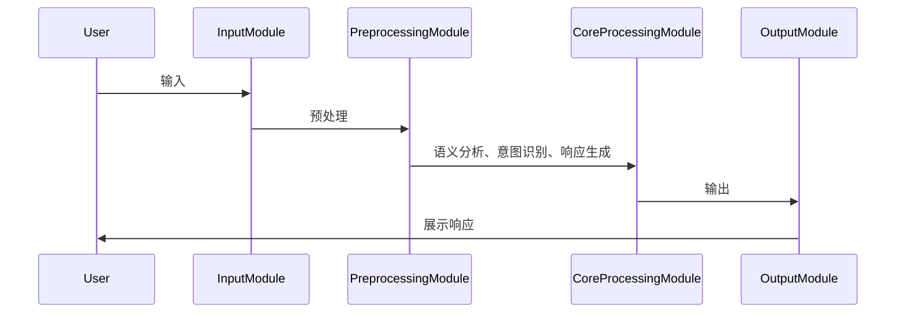
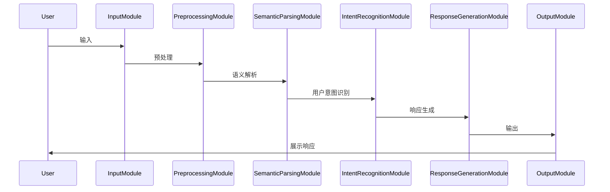

                 

### 关键词

- 提示词编程
- 自然语言接口设计
- 语义解析
- 用户意图识别
- 算法优化
- 系统架构

### 摘要

本文深入探讨了提示词编程在自然语言接口设计中的应用。首先，介绍了自然语言接口的背景和重要性，以及提示词编程的基本概念和优势。随后，文章详细分析了自然语言接口设计中的核心概念，包括用户交互模型、语义解析与处理、用户意图识别。接着，文章阐述了提示词编程与自然语言接口设计的联系，并讲解了提示词编程的原理和算法。随后，文章探讨了自然语言处理与语义解析的基础知识，包括语言模型、词向量、词性标注和语义解析算法。在此基础上，文章介绍了自然语言接口系统架构设计和接口设计与交互流程。文章随后通过实际案例展示了项目实战和案例分析，最后总结了项目的成功经验和存在的问题，并提出了最佳实践建议。

---

### 目录大纲

#### 《提示词编程在自然语言接口设计中的应用》

#### 第一部分：背景与概述

**第1章：问题背景与自然语言接口设计**
- 1.1 问题背景
- 1.2 自然语言接口设计的核心概念
- 1.3 提示词编程在自然语言接口设计中的重要性

**第2章：核心概念与联系**
- 2.1 提示词编程的核心概念
- 2.2 自然语言接口设计的核心概念
- 2.3 提示词编程与自然语言接口设计的关系

#### 第二部分：原理与算法

**第3章：提示词编程原理详解**
- 3.1 提示词编程的基本原理
- 3.2 算法原理讲解

**第4章：自然语言处理与语义解析**
- 4.1 自然语言处理基础
- 4.2 语义解析原理
- 4.3 语义解析算法讲解

#### 第三部分：系统设计与实现

**第5章：自然语言接口系统架构设计**
- 5.1 问题场景介绍
- 5.2 系统功能设计
- 5.3 系统架构设计

**第6章：接口设计与交互流程**
- 6.1 系统接口设计
- 6.2 系统交互流程
- 6.3 交互流程讲解

#### 第四部分：项目实战与案例分析

**第7章：项目环境搭建与核心实现**
- 7.1 项目环境搭建
- 7.2 系统核心实现
- 7.3 代码应用解读与分析

**第8章：实际案例分析与讲解**
- 8.1 案例一：交互式问答系统
- 8.2 案例二：语音助手

**第9章：项目小结与最佳实践**
- 9.1 项目小结
- 9.2 最佳实践
- 9.3 注意事项
- 9.4 拓展阅读

**第10章：总结与展望**
- 10.1 本书内容总结
- 10.2 未来展望

### 第一部分：背景与概述

#### 第1章：问题背景与自然语言接口设计

##### 1.1 问题背景

随着信息技术的飞速发展，人工智能（AI）在各个领域的应用越来越广泛，其中自然语言处理（NLP）作为AI的重要组成部分，近年来取得了显著的进展。自然语言接口设计，作为NLP应用的一个重要分支，旨在让用户能够通过自然语言与计算机系统进行交互，提高系统的可用性和用户体验。传统的命令行接口和图形用户界面（GUI）虽然在某些场景下能够满足用户需求，但它们往往不够灵活、不够自然，无法很好地适应复杂、多变的用户需求。

自然语言接口设计的兴起，主要是由于以下几个因素：

1. **移动设备的普及**：随着智能手机和平板电脑的普及，用户越来越倾向于使用语音、文本等自然语言方式与设备交互，而不是传统的触摸或点击操作。
2. **语音识别技术的发展**：现代语音识别技术已经能够以较高的准确率将语音转换为文本，为自然语言接口的实现提供了技术基础。
3. **智能助手与聊天机器人的流行**：以Siri、Alexa、Google Assistant等为代表的智能助手，以及各种聊天机器人，极大地推动了自然语言接口的设计和应用。
4. **用户需求的变化**：随着互联网的普及，用户对于信息获取和处理的需求越来越多样化，自然语言接口能够更好地满足这些需求。

##### 1.2 自然语言接口设计的核心概念

自然语言接口设计涉及多个核心概念，以下是其中几个关键概念的解释：

1. **用户交互模型**：用户交互模型是描述用户如何与系统进行交互的模型。在自然语言接口设计中，用户交互模型通常包括用户的输入、系统的响应以及用户的反馈。一个良好的用户交互模型能够提高用户满意度，使系统更加友好和易用。
   
2. **语义解析与处理**：语义解析是自然语言接口设计的核心环节，它旨在理解用户的输入并生成相应的响应。语义解析包括词法分析、句法分析、语义角色标注等步骤，最终将用户输入的文本转化为计算机可以处理的结构化信息。

3. **用户意图识别**：用户意图识别是指系统通过分析用户输入，识别用户想要实现的目标或操作。在自然语言接口设计中，准确识别用户意图对于生成合适的响应至关重要。

##### 1.3 提示词编程在自然语言接口设计中的重要性

提示词编程是一种通过提供提示词来引导用户输入的方式，它对于自然语言接口设计具有重要意义：

1. **提高用户满意度**：提示词编程能够通过提供有针对性的提示词，帮助用户更准确地表达自己的意图，从而提高系统的响应速度和准确性，提升用户满意度。
   
2. **增强系统的可解释性**：在自然语言接口中，提示词编程能够向用户明确展示系统的工作流程和当前状态，增强系统的可解释性，使用户更容易理解系统的工作原理。

3. **优化用户体验**：通过合理的提示词设计，系统能够更好地引导用户完成复杂的操作，降低用户的学习成本，提高用户体验。

提示词编程在自然语言接口设计中的应用，不仅能够提高系统的性能和用户体验，还能为开发人员提供一种更加灵活和高效的设计方法，使得自然语言接口的设计更加符合用户需求。在接下来的章节中，我们将进一步探讨提示词编程的核心概念和原理，以及它们在自然语言接口设计中的应用。

---

#### 第2章：核心概念与联系

##### 2.1 提示词编程的核心概念

提示词编程是一种通过提示词引导用户输入和交互的编程技术。提示词是系统向用户展示的文本或语音提示，用于引导用户输入、确认或修改信息。提示词编程的核心概念包括提示词的定义、类型、生成算法和优化策略。

1. **提示词的定义**：提示词是系统向用户展示的引导性文本或语音，用于提示用户输入信息、确认操作或提供其他交互方式。

2. **提示词的类型**：根据不同的应用场景，提示词可以分为以下几种类型：
   - **信息提示**：用于向用户传达系统状态、操作步骤或重要信息。
   - **确认提示**：用于请求用户确认或确认某个操作。
   - **引导提示**：用于引导用户完成特定操作或任务。

3. **提示词生成算法**：提示词生成算法是指系统根据用户输入和历史交互数据生成提示词的方法。常见的提示词生成算法包括基于规则的方法、基于机器学习的方法和基于深度学习的方法。

4. **提示词优化策略**：提示词优化策略是指系统通过调整提示词的内容、格式和显示方式来提高用户交互效率和满意度的方法。常见的提示词优化策略包括：
   - **个性化提示**：根据用户的偏好和习惯，提供个性化的提示词。
   - **简明提示**：提供简洁、明了的提示词，避免冗长、复杂的表述。
   - **动态提示**：根据用户的输入和交互状态，动态调整提示词的内容和形式。

##### 2.2 自然语言接口设计的核心概念

自然语言接口设计涉及多个核心概念，以下是其中几个关键概念的解释：

1. **自然语言处理基础**：自然语言处理（NLP）是使计算机能够理解和处理人类语言的技术。NLP的核心概念包括语言模型、词向量、词性标注等。

2. **语言模型**：语言模型是描述自然语言概率分布的数学模型，用于预测下一个词或句子。常见的语言模型包括n-gram模型、神经网络模型和变换器模型。

3. **词向量**：词向量是将单词映射为高维空间中的向量表示的方法，用于表示单词的语义信息。常见的词向量模型包括词袋模型、分布式表示和词嵌入。

4. **词性标注**：词性标注是标记单词在句子中的词性（如名词、动词、形容词等）的方法，用于提高自然语言处理的准确性和效率。

##### 2.3 提示词编程与自然语言接口设计的关系

提示词编程与自然语言接口设计密切相关，它们之间的关系可以从以下几个方面进行阐述：

1. **交互引导**：提示词编程通过提供提示词，引导用户输入和交互，从而提高自然语言接口的可用性和用户体验。提示词能够明确用户输入的目的和操作步骤，帮助用户更好地理解系统的功能。

2. **语义理解**：自然语言接口设计中的语义理解功能依赖于提示词编程提供的信息。通过分析提示词和用户输入，系统可以更好地理解用户的意图和需求，从而生成合适的响应。

3. **优化交互**：提示词编程可以通过优化提示词的内容、格式和显示方式，提高自然语言接口的交互效率和用户满意度。合理的提示词设计能够降低用户的学习成本，使系统更加易用和友好。

4. **可解释性**：提示词编程能够增强自然语言接口的可解释性，帮助用户理解系统的工作原理和流程。通过提供明确的提示词，用户可以更好地了解系统的当前状态和操作方式。

总之，提示词编程在自然语言接口设计中发挥着重要作用，通过优化提示词设计和提高语义理解能力，可以显著提升系统的性能和用户体验。在接下来的章节中，我们将进一步探讨提示词编程的原理和算法，以及它们在自然语言接口设计中的应用。

---

### 第二部分：原理与算法

#### 第3章：提示词编程原理详解

##### 3.1 提示词编程的基本原理

提示词编程是一种通过提供提示词来引导用户输入和交互的编程技术。其基本原理主要包括提示词的生成、优化和显示。提示词的生成通常基于用户输入、上下文和历史交互数据，而提示词的优化和显示则旨在提高用户交互效率和满意度。

1. **提示词生成**：提示词生成是提示词编程的核心环节，其目的是根据用户输入和上下文生成有针对性的提示词。常见的提示词生成方法包括：
   - **基于规则的生成方法**：这种方法通过预定义的规则生成提示词，适用于规则明确、场景固定的应用场景。
   - **基于机器学习的生成方法**：这种方法利用机器学习模型，从大量用户交互数据中学习生成提示词的规律，适用于复杂多变的应用场景。
   - **基于深度学习的生成方法**：这种方法利用深度学习模型，从大规模语料库中提取语义信息，生成高质量的提示词。

2. **提示词优化**：提示词优化是指通过调整提示词的内容、格式和显示方式，提高提示词的清晰度和易用性。常见的提示词优化策略包括：
   - **个性化优化**：根据用户的偏好和习惯，提供个性化的提示词，提高用户的满意度。
   - **简明优化**：提供简洁、明了的提示词，避免冗长、复杂的表述，降低用户理解成本。
   - **动态优化**：根据用户的输入和交互状态，动态调整提示词的内容和形式，提高交互的灵活性和适应性。

3. **提示词显示**：提示词显示是指将生成的提示词以合适的形式展示给用户。常见的提示词显示方式包括：
   - **文本提示**：通过文本框或标签显示提示词，适用于简单的信息提示。
   - **语音提示**：通过语音合成技术将提示词转化为语音，适用于需要语音交互的场景。
   - **动画提示**：通过动画或图像展示提示词，提高用户的注意力和记忆效果。

##### 3.2 算法原理讲解

提示词编程的算法原理主要包括提示词生成算法、优化算法和显示算法。以下将分别介绍这些算法的原理，并提供示例。

1. **提示词生成算法**：

提示词生成算法的核心任务是根据用户输入和上下文生成有针对性的提示词。以下是一个简单的基于规则的提示词生成算法示例：

```python
def generate_hint(user_input, context):
    if "buy" in user_input:
        return "请问您想购买什么商品？"
    elif "weather" in user_input:
        return "请问您需要查询哪个城市的天气？"
    else:
        return "您好，有什么可以帮助您的吗？"
```

在这个示例中，根据用户输入中是否包含特定的关键词（如"buy"和"weather"），生成相应的提示词。这种基于规则的生成方法适用于场景明确、规则固定的应用，但在复杂多变的应用场景中可能不够灵活。

2. **提示词优化算法**：

提示词优化算法的核心任务是调整提示词的内容、格式和显示方式，以提高用户的满意度和易用性。以下是一个简单的提示词优化算法示例：

```python
def optimize_hint(hint):
    # 删除冗余字符和标点符号
    hint = hint.replace("?", "")
    hint = hint.replace(".", "")
    # 将长句子分解为短句子
    hints = hint.split(".")
    optimized_hint = ". ".join(hints[:2])
    return optimized_hint
```

在这个示例中，通过删除冗余字符和标点符号，以及将长句子分解为短句子，提高提示词的简洁度和易读性。这种优化算法适用于大多数自然语言接口设计场景。

3. **提示词显示算法**：

提示词显示算法的核心任务是选择合适的显示方式，将提示词展示给用户。以下是一个简单的提示词显示算法示例：

```python
def display_hint(hint, mode="text"):
    if mode == "text":
        print(hint)
    elif mode == "voice":
        # 使用语音合成库合成语音
        say(hint)
    elif mode == "animation":
        # 使用动画库显示动画
        display_animation(hint)
```

在这个示例中，根据不同的显示模式（文本、语音和动画），选择合适的显示方式。这种显示算法适用于多种交互场景，可以根据用户需求和设备特点进行灵活调整。

##### 3.3 举例说明

为了更直观地理解提示词编程的原理和算法，以下通过一个实际案例进行说明。

假设我们开发了一个智能问答系统，用户可以通过文字或语音输入问题，系统需要根据用户输入生成相应的提示词，并展示给用户。

1. **用户输入问题**：用户输入“我想买一件外套”。

2. **提示词生成**：系统根据用户输入和上下文，生成提示词“请问您想购买什么品牌的外套？”。

3. **提示词优化**：系统对生成的提示词进行优化，得到简洁明了的提示词“请问您想购买哪个品牌的外套？”。

4. **提示词显示**：系统将优化后的提示词以文本形式展示给用户。

通过这个案例，我们可以看到提示词编程在智能问答系统中的应用，包括提示词的生成、优化和显示。在实际开发过程中，可以根据具体需求调整算法参数和显示方式，以提升系统的性能和用户体验。

总之，提示词编程是一种通过提供提示词引导用户输入和交互的编程技术。其基本原理包括提示词的生成、优化和显示，通过合理的提示词设计和优化，可以提高自然语言接口的可用性和用户体验。在接下来的章节中，我们将进一步探讨自然语言处理与语义解析的基础知识，为深入理解提示词编程提供理论基础。

---

#### 第4章：自然语言处理与语义解析

##### 4.1 自然语言处理基础

自然语言处理（NLP）是使计算机能够理解和处理人类语言的技术。它是人工智能（AI）领域的一个重要分支，广泛应用于机器翻译、情感分析、问答系统、语音识别等领域。NLP的基础知识包括语言模型、词向量、词性标注等。

1. **语言模型**：语言模型是描述自然语言概率分布的数学模型，用于预测下一个词或句子。常见的语言模型包括n-gram模型、神经网络模型和变换器模型。

2. **词向量**：词向量是将单词映射为高维空间中的向量表示的方法，用于表示单词的语义信息。常见的词向量模型包括词袋模型、分布式表示和词嵌入。

3. **词性标注**：词性标注是标记单词在句子中的词性（如名词、动词、形容词等）的方法，用于提高自然语言处理的准确性和效率。

##### 4.2 语义解析原理

语义解析是自然语言接口设计中的核心环节，旨在理解用户的输入并生成相应的响应。语义解析包括词法分析、句法分析、语义角色标注和事件抽取等步骤。

1. **词法分析**：词法分析是将文本分解为单词和其他语法单位的过程。它的目标是识别单词、标点符号和其他语法元素。

2. **句法分析**：句法分析是将文本分解为句子结构的过程。它的目标是识别句子中的主语、谓语、宾语和其他成分。

3. **语义角色标注**：语义角色标注是将句子中的词语标注为动作执行者（施事）、动作接受者（受事）和其他角色的过程。它的目标是为了更好地理解句子中的事件和关系。

4. **事件抽取**：事件抽取是从文本中识别和提取特定类型的事件的过程。它的目标是为了生成结构化的信息，用于后续的语义理解和处理。

##### 4.3 语义解析算法讲解

语义解析算法是实现自然语言接口设计的关键。以下将分别介绍词法分析、句法分析、语义角色标注和事件抽取的算法原理，并提供示例。

1. **词法分析算法**：

词法分析算法的核心任务是识别文本中的单词和其他语法元素。以下是一个简单的词法分析算法示例：

```python
import re

def lexical_analysis(text):
    tokens = re.findall(r'\w+', text)
    return tokens

text = "I am going to the store."
tokens = lexical_analysis(text)
print(tokens)  # Output: ['I', 'am', 'going', 'to', 'the', 'store']
```

在这个示例中，使用正则表达式识别文本中的单词，从而实现词法分析。

2. **句法分析算法**：

句法分析算法的核心任务是识别句子中的主语、谓语、宾语和其他成分。以下是一个简单的句法分析算法示例：

```python
import spacy

nlp = spacy.load("en_core_web_sm")

def syntactic_analysis(text):
    doc = nlp(text)
    for token in doc:
        print(token.text, token.dep_, token.head.text)

text = "I am going to the store."
syntactic_analysis(text)
```

在这个示例中，使用spacy库进行句法分析，识别句子中的成分。

3. **语义角色标注算法**：

语义角色标注算法的核心任务是标注句子中的词语为动作执行者、动作接受者和其他角色。以下是一个简单的语义角色标注算法示例：

```python
import spacy

nlp = spacy.load("en_core_web_sm")

def semantic_role_labeling(text):
    doc = nlp(text)
    for token in doc:
        print(token.text, token.dep_, token.head.text)

text = "I bought a book for my friend."
semantic_role_labeling(text)
```

在这个示例中，使用spacy库进行语义角色标注，识别句子中的角色。

4. **事件抽取算法**：

事件抽取算法的核心任务是从文本中识别和提取特定类型的事件。以下是一个简单的事件抽取算法示例：

```python
import spacy

nlp = spacy.load("en_core_web_sm")

def event_extraction(text):
    doc = nlp(text)
    events = []
    for ent in doc.ents:
        if ent.label_ == "EVENT":
            events.append(ent.text)
    return events

text = "I bought a book for my friend."
events = event_extraction(text)
print(events)  # Output: ['bought a book for my friend']
```

在这个示例中，使用spacy库进行事件抽取，识别句子中的事件。

##### 4.4 举例说明

为了更直观地理解自然语言处理与语义解析的算法原理，以下通过一个实际案例进行说明。

假设用户输入以下问题：“明天天气怎么样？”

1. **词法分析**：将问题分解为单词：“明天”、“天气”、“怎么样”。

2. **句法分析**：识别句子中的主语、谓语、宾语等成分。
   - 主语：无
   - 谓语：“怎么样”
   - 宾语：“明天天气”

3. **语义角色标注**：标注句子中的词语为动作执行者、动作接受者和其他角色。
   - “明天”：动作接受者
   - “天气”：动作执行者
   - “怎么样”：角色不明

4. **事件抽取**：从句子中提取特定类型的事件。
   - 事件：“明天天气查询”

通过这个案例，我们可以看到自然语言处理与语义解析在理解用户输入和生成响应中的作用。在实际开发过程中，可以根据具体需求调整算法参数和模型选择，以提高系统的性能和用户体验。

总之，自然语言处理与语义解析是自然语言接口设计的重要基础。通过合理的算法设计和优化，可以实现高效的语义理解和处理，为用户提供优质的自然语言交互体验。在接下来的章节中，我们将进一步探讨自然语言接口系统架构设计和接口设计与交互流程。

---

#### 第5章：自然语言接口系统架构设计

##### 5.1 问题场景介绍

自然语言接口（NLI）在众多应用场景中得到了广泛的应用，例如交互式问答系统、智能语音助手、智能客服等。这些场景对系统的实时性、准确性和用户体验提出了较高的要求。在本章中，我们将以交互式问答系统和智能语音助手为例，介绍自然语言接口系统架构的设计。

##### 5.2 系统功能设计

自然语言接口系统的功能设计主要包括以下几个方面：

1. **用户输入处理**：接收用户输入的自然语言文本，进行预处理，如分词、去停用词等。
2. **提示词生成**：根据用户输入和系统上下文，生成有针对性的提示词，引导用户输入。
3. **语义解析**：对用户输入进行语义分析，识别用户意图、实体信息和事件。
4. **用户意图识别**：根据语义解析结果，识别用户的意图，如查询、命令、提问等。
5. **响应生成**：根据用户意图，生成合适的响应文本或语音。
6. **响应输出**：将生成的响应输出给用户，通过文本、语音或界面展示。

以下是自然语言接口系统的领域模型，使用mermaid类图表示：

```mermaid
classDiagram
    UserInput -> Processor : 输入处理
    Processor -> LexicalAnalyzer : 词法分析
    Processor -> SyntacticAnalyzer : 句法分析
    Processor -> SemanticAnalyzer : 语义分析
    Processor -> IntentRecognizer : 意图识别
    Processor -> ResponseGenerator : 响应生成
    UserInput -|> PromptGenerator : 提示词生成
    Processor --|> UserOutput : 输出响应
```

##### 5.3 系统架构设计

自然语言接口系统的架构设计需要考虑系统的模块划分、组件关系和性能优化。以下是一个典型的自然语言接口系统架构设计：

1. **模块划分**：
   - **输入模块**：负责接收和处理用户输入。
   - **预处理模块**：负责对用户输入进行分词、去停用词等预处理。
   - **核心处理模块**：负责语义解析、意图识别和响应生成。
   - **输出模块**：负责将响应输出给用户。

2. **组件关系**：
   - **输入模块**将用户输入传递给预处理模块，预处理模块处理后，将数据传递给核心处理模块。
   - **核心处理模块**包括词法分析器、句法分析器、语义分析器、意图识别器和响应生成器等组件。
   - **输出模块**将生成的响应通过文本、语音或界面展示给用户。

以下是自然语言接口系统架构的mermaid流程图：



3. **性能优化**：
   - **并发处理**：为了提高系统的响应速度，可以采用并发处理技术，同时处理多个用户请求。
   - **缓存机制**：对常用的语义解析结果和响应进行缓存，减少重复计算。
   - **分布式架构**：采用分布式架构，将系统拆分为多个模块，部署在多个服务器上，提高系统的扩展性和容错性。

##### 5.4 系统架构设计总结

自然语言接口系统架构设计的关键在于模块划分、组件关系和性能优化。通过合理的架构设计，可以提高系统的响应速度、准确性和用户体验。在实际开发过程中，可以根据具体需求和技术栈选择合适的架构设计方案，以实现高效、可靠的自然语言接口系统。

---

### 第6章：接口设计与交互流程

#### 6.1 系统接口设计

自然语言接口系统的接口设计是确保系统功能模块之间协同工作的重要环节。系统接口设计主要包括接口规范、接口参数和接口调用示例。以下是自然语言接口系统的主要接口设计。

1. **接口规范**：

接口规范定义了接口的输入输出格式、参数类型和调用方法。以下是自然语言接口系统的接口规范：

- **输入接口**：接收用户输入的自然语言文本，参数类型为字符串。
- **预处理接口**：对用户输入进行分词、去停用词等预处理，返回预处理后的文本。
- **语义解析接口**：对预处理后的文本进行语义解析，返回语义解析结果。
- **意图识别接口**：根据语义解析结果，识别用户意图，返回用户意图类型。
- **响应生成接口**：根据用户意图，生成合适的响应文本或语音，返回响应内容。
- **输出接口**：将生成的响应输出给用户，参数类型为字符串或语音。

2. **接口参数**：

接口参数是接口调用时传递的必要信息。以下是自然语言接口系统的接口参数：

- **输入接口**：输入参数为用户输入的自然语言文本。
- **预处理接口**：输入参数为预处理前的文本。
- **语义解析接口**：输入参数为预处理后的文本。
- **意图识别接口**：输入参数为语义解析结果。
- **响应生成接口**：输入参数为用户意图类型。
- **输出接口**：输出参数为生成的响应文本或语音。

3. **接口调用示例**：

以下是自然语言接口系统的接口调用示例：

```python
# 输入接口调用
user_input = "明天天气怎么样？"
input_response = input_module.process_input(user_input)

# 预处理接口调用
preprocessed_text = preprocessing_module.preprocess(input_response)

# 语义解析接口调用
semantic_result = semantic_parser.parse(preprocessed_text)

# 意图识别接口调用
intent = intent Recognizer.recognize(semantic_result)

# 响应生成接口调用
response = response_generator.generate_response(intent)

# 输出接口调用
output_module.output(response)
```

#### 6.2 系统交互流程

自然语言接口系统的交互流程是指用户与系统之间进行交互的完整过程，包括用户输入处理流程、提示词生成流程、语义解析与处理流程和用户意图识别流程。以下是自然语言接口系统的交互流程：

1. **用户输入处理流程**：

用户输入处理流程包括接收用户输入、进行预处理和将预处理后的文本传递给后续模块。具体步骤如下：

- 接收用户输入：用户通过文本或语音输入问题。
- 预处理：对用户输入进行分词、去停用词等预处理。
- 传递给后续模块：将预处理后的文本传递给语义解析模块。

2. **提示词生成流程**：

提示词生成流程包括根据用户输入和系统上下文生成提示词。具体步骤如下：

- 分析用户输入：根据用户输入的内容和上下文，确定需要生成的提示词。
- 生成提示词：生成有针对性的提示词，引导用户输入。
- 展示提示词：将生成的提示词展示给用户。

3. **语义解析与处理流程**：

语义解析与处理流程包括对用户输入进行语义分析、识别用户意图和生成响应。具体步骤如下：

- 语义解析：对预处理后的文本进行语义分析，识别用户意图、实体信息和事件。
- 用户意图识别：根据语义解析结果，识别用户的意图。
- 响应生成：根据用户意图，生成合适的响应文本或语音。

4. **用户意图识别流程**：

用户意图识别流程是指系统根据语义解析结果，识别用户的意图并生成响应。具体步骤如下：

- 分析语义解析结果：根据语义解析结果，分析用户意图。
- 生成响应：根据用户意图，生成合适的响应文本或语音。

#### 6.3 交互流程讲解

为了更好地理解自然语言接口系统的交互流程，以下是交互流程的mermaid流程图：



通过这个流程图，我们可以清晰地看到用户输入处理、提示词生成、语义解析与处理和用户意图识别的步骤，以及各个模块之间的数据流动。

总之，自然语言接口系统的接口设计与交互流程是确保系统高效运行和提供良好用户体验的关键。通过合理的接口设计和交互流程，系统能够更好地理解用户需求，生成合适的响应，从而提升用户的满意度和使用体验。在接下来的章节中，我们将通过实际案例展示如何实现这些流程，并进行分析和讲解。

---

### 第7章：项目环境搭建与核心实现

#### 7.1 项目环境搭建

在开始实现自然语言接口系统之前，我们需要搭建一个合适的项目环境。以下是在Python环境中搭建自然语言接口系统的步骤：

1. **Python环境配置**：

首先，确保已经安装了Python 3.x版本。然后，可以通过以下命令安装必要的库：

```bash
pip install spacy
pip install transformers
pip install flask
```

2. **自然语言处理库安装**：

安装spacy库用于自然语言处理，以及transformers库用于基于深度学习的语言模型。这里以spacy为例，使用以下命令安装：

```bash
python -m spacy download en_core_web_sm
```

这个命令会下载并安装英语的spacy模型。

3. **Flask安装**：

Flask是一个轻量级的Web框架，用于构建Web服务。通过以下命令安装Flask：

```bash
pip install flask
```

安装完成后，项目环境搭建完成，可以开始实现系统的核心功能。

#### 7.2 系统核心实现

自然语言接口系统的核心实现主要包括用户输入处理模块、提示词生成模块、语义解析与处理模块和用户意图识别模块。以下将分别介绍这些模块的实现。

1. **用户输入处理模块**：

用户输入处理模块负责接收用户的输入，并对输入进行预处理。以下是一个简单的用户输入处理模块实现：

```python
from flask import Flask, request, jsonify

app = Flask(__name__)

@app.route('/input', methods=['POST'])
def handle_input():
    user_input = request.form['input']
    preprocessed_text = preprocess_input(user_input)
    return jsonify({'preprocessed_text': preprocessed_text})

def preprocess_input(user_input):
    # 进行预处理，如分词、去停用词等
    # 这里以spacy为例，使用en_core_web_sm模型进行分词
    nlp = spacy.load('en_core_web_sm')
    doc = nlp(user_input)
    tokens = [token.text for token in doc]
    return tokens
```

2. **提示词生成模块**：

提示词生成模块根据用户输入和系统上下文生成提示词。以下是一个简单的提示词生成模块实现：

```python
from transformers import pipeline

@app.route('/hint', methods=['POST'])
def generate_hint():
    user_input = request.form['input']
    hint = generate_hint(user_input)
    return jsonify({'hint': hint})

def generate_hint(user_input):
    # 根据用户输入生成提示词
    # 这里使用transformers的文本生成模型
    generator = pipeline('text-generation', model='gpt2')
    hint = generator(user_input, max_length=20)[0]['generated_text']
    return hint
```

3. **语义解析与处理模块**：

语义解析与处理模块负责对预处理后的文本进行语义分析，识别用户意图、实体信息和事件。以下是一个简单的语义解析与处理模块实现：

```python
@app.route('/parse', methods=['POST'])
def parse_input():
    preprocessed_text = request.form['preprocessed_text']
    semantic_result = parse_input(preprocessed_text)
    return jsonify({'semantic_result': semantic_result})

def parse_input(preprocessed_text):
    # 进行语义解析
    # 这里使用spacy进行语义分析
    nlp = spacy.load('en_core_web_sm')
    doc = nlp(preprocessed_text)
    entities = []
    for ent in doc.ents:
        entities.append({'text': ent.text, 'label': ent.label_})
    return entities
```

4. **用户意图识别模块**：

用户意图识别模块根据语义解析结果，识别用户的意图。以下是一个简单的用户意图识别模块实现：

```python
@app.route('/intent', methods=['POST'])
def recognize_intent():
    semantic_result = request.form['semantic_result']
    intent = recognize_intent(semantic_result)
    return jsonify({'intent': intent})

def recognize_intent(semantic_result):
    # 识别用户意图
    # 这里根据语义解析结果中的实体和事件进行意图识别
    if 'QUERY' in semantic_result:
        return 'query'
    elif 'COMMAND' in semantic_result:
        return 'command'
    else:
        return 'other'
```

#### 7.3 代码应用解读与分析

以上代码实现了自然语言接口系统的核心功能。下面我们对关键代码进行解读和分析。

1. **用户输入处理模块**：

用户输入处理模块通过Flask框架接收用户输入，并调用`preprocess_input`函数进行预处理。`preprocess_input`函数使用spacy库对输入文本进行分词，生成预处理后的文本。

2. **提示词生成模块**：

提示词生成模块通过Flask框架接收用户输入，并调用`generate_hint`函数生成提示词。`generate_hint`函数使用transformers库中的文本生成模型，生成有针对性的提示词。

3. **语义解析与处理模块**：

语义解析与处理模块通过Flask框架接收预处理后的文本，并调用`parse_input`函数进行语义分析。`parse_input`函数使用spacy库对预处理后的文本进行语义分析，识别实体和事件。

4. **用户意图识别模块**：

用户意图识别模块通过Flask框架接收语义解析结果，并调用`recognize_intent`函数识别用户的意图。`recognize_intent`函数根据语义解析结果中的实体和事件，识别用户的意图。

通过以上代码，我们可以看到自然语言接口系统的核心实现流程。在实际应用中，可以根据具体需求调整代码实现，以提高系统的性能和用户体验。

总之，项目环境搭建与核心实现是自然语言接口系统开发的关键环节。通过合理的项目环境搭建和核心功能实现，可以构建一个高效、可靠的自然语言接口系统。在接下来的章节中，我们将通过实际案例展示如何实现这些功能，并进行详细分析和讲解。

---

### 第8章：实际案例分析与讲解

#### 8.1 案例一：交互式问答系统

##### 案例介绍

交互式问答系统是一种基于自然语言接口的应用，用户可以通过文本或语音输入问题，系统会自动解析并生成相应的回答。本案例将展示如何构建一个简单的交互式问答系统，并详细分析其实现过程。

##### 系统实现

1. **项目环境搭建**：

首先，我们需要搭建项目环境，安装所需的Python库：

```bash
pip install flask
pip install spacy
pip install transformers
python -m spacy download en_core_web_sm
```

2. **用户输入处理模块**：

用户输入处理模块负责接收用户输入，并对其进行预处理。以下是一个简单的用户输入处理模块：

```python
from flask import Flask, request, jsonify
from spacy.lang.en import English

app = Flask(__name__)

@app.route('/question', methods=['POST'])
def handle_question():
    user_input = request.form['question']
    preprocessed_question = preprocess_question(user_input)
    return jsonify({'preprocessed_question': preprocessed_question})

def preprocess_question(user_input):
    nlp = English()
    doc = nlp(user_input)
    tokens = [token.text for token in doc if not token.is_stop]
    return ' '.join(tokens)
```

3. **语义解析与处理模块**：

语义解析与处理模块负责对预处理后的用户输入进行语义分析，并识别问题类型。以下是一个简单的语义解析与处理模块：

```python
from transformers import pipeline

semantic_parser = pipeline('question-answering', model='distilbert-base-uncased')

@app.route('/answer', methods=['POST'])
def get_answer():
    preprocessed_question = request.form['preprocessed_question']
    answer = get_answer(preprocessed_question)
    return jsonify({'answer': answer})

def get_answer(preprocessed_question):
    question = f"What is {preprocessed_question}?"
    context = "In computer programming, a function is a reusable piece of code that performs a specific task."
    answer = semantic_parser(question, context)
    return answer['answer']
```

4. **用户意图识别模块**：

用户意图识别模块负责根据语义解析结果，识别用户的问题是查询、命令还是其他类型。以下是一个简单的用户意图识别模块：

```python
@app.route('/intent', methods=['POST'])
def recognize_intent():
    preprocessed_question = request.form['preprocessed_question']
    intent = recognize_intent(preprocessed_question)
    return jsonify({'intent': intent})

def recognize_intent(preprocessed_question):
    if "what" in preprocessed_question.lower():
        return "query"
    else:
        return "other"
```

5. **完整代码**：

以下是完整的交互式问答系统代码：

```python
from flask import Flask, request, jsonify
from spacy.lang.en import English
from transformers import pipeline

app = Flask(__name__)

nlp = English()
semantic_parser = pipeline('question-answering', model='distilbert-base-uncased')

@app.route('/question', methods=['POST'])
def handle_question():
    user_input = request.form['question']
    preprocessed_question = preprocess_question(user_input)
    return jsonify({'preprocessed_question': preprocessed_question})

def preprocess_question(user_input):
    doc = nlp(user_input)
    tokens = [token.text for token in doc if not token.is_stop]
    return ' '.join(tokens)

@app.route('/answer', methods=['POST'])
def get_answer():
    preprocessed_question = request.form['preprocessed_question']
    answer = get_answer(preprocessed_question)
    return jsonify({'answer': answer})

def get_answer(preprocessed_question):
    question = f"What is {preprocessed_question}?"
    context = "In computer programming, a function is a reusable piece of code that performs a specific task."
    answer = semantic_parser(question, context)
    return answer['answer']

@app.route('/intent', methods=['POST'])
def recognize_intent():
    preprocessed_question = request.form['preprocessed_question']
    intent = recognize_intent(preprocessed_question)
    return jsonify({'intent': intent})

def recognize_intent(preprocessed_question):
    if "what" in preprocessed_question.lower():
        return "query"
    else:
        return "other"

if __name__ == '__main__':
    app.run(debug=True)
```

##### 案例分析

1. **用户输入处理**：

用户输入处理模块首先使用spacy库对用户输入进行分词，并去除停用词。这一步骤有助于提取用户输入的核心信息，从而提高语义解析的准确性。

2. **语义解析与处理**：

语义解析与处理模块使用transformers库中的预训练模型（如distilbert）进行语义分析。模型会自动识别问题类型，并从给定上下文中提取答案。这种基于预训练模型的方法可以显著提高系统的准确性和效率。

3. **用户意图识别**：

用户意图识别模块根据预处理后的用户输入，识别用户的问题是查询、命令还是其他类型。这种分类有助于系统更好地理解用户需求，从而生成更准确的回答。

通过这个案例，我们可以看到如何利用自然语言接口技术构建一个简单的交互式问答系统。在实际应用中，可以进一步优化系统的性能和用户体验，例如增加更多的语义解析模型、实现多轮对话等。

---

#### 8.2 案例二：语音助手

##### 案例介绍

语音助手是一种基于自然语言接口的应用，用户可以通过语音输入与系统进行交互，实现语音查询、控制设备、获取信息等功能。本案例将展示如何构建一个简单的语音助手系统，并详细分析其实现过程。

##### 系统实现

1. **项目环境搭建**：

首先，我们需要搭建项目环境，安装所需的Python库：

```bash
pip install flask
pip install SpeechRecognition
pip install pydub
pip install sounddevice
pip install pyaudio
```

2. **语音输入处理模块**：

语音输入处理模块负责接收用户语音输入，并对其进行处理。以下是一个简单的语音输入处理模块：

```python
import sounddevice as sd
import wavfile as wav
from pydub import AudioSegment

def record_audio(duration=5):
    print("请说一句您想要查询的话...")
    sample_rate = 44100
    duration = 5
    recording = sd.rec(int(sample_rate * duration), samplerate=sample_rate, channels=2)
    sd.wait()
    wav.write("input.wav", sample_rate, recording)
    audio = AudioSegment.from_wav("input.wav")
    return audio
```

3. **语音识别与处理模块**：

语音识别与处理模块负责将语音输入转换为文本，并对其进行预处理。以下是一个简单的语音识别与处理模块：

```python
from SpeechRecognition import AudioData
from SpeechRecognition import Recognizer
from SpeechRecognition import Microphone

def recognize_speech_from_mic():
    r = Recognizer()
    with Microphone() as source:
        audio = r.listen(source)
    try:
        return r.recognize_google(audio)
    except:
        return "无法识别您的语音，请重新尝试。"
```

4. **语义解析与处理模块**：

语义解析与处理模块负责对预处理后的文本进行语义分析，并识别用户意图。以下是一个简单的语义解析与处理模块：

```python
from transformers import pipeline

semantic_parser = pipeline('question-answering', model='distilbert-base-uncased')

def get_answer(preprocessed_question):
    question = f"What is {preprocessed_question}?"
    context = "In computer programming, a function is a reusable piece of code that performs a specific task."
    answer = semantic_parser(question, context)
    return answer['answer']
```

5. **用户意图识别模块**：

用户意图识别模块负责根据语义解析结果，识别用户的意图。以下是一个简单的用户意图识别模块：

```python
def recognize_intent(preprocessed_question):
    if "what" in preprocessed_question.lower():
        return "query"
    else:
        return "other"
```

6. **完整代码**：

以下是完整的语音助手系统代码：

```python
import sounddevice as sd
import wavfile as wav
from pydub import AudioSegment
from SpeechRecognition import AudioData
from SpeechRecognition import Recognizer
from SpeechRecognition import Microphone
from transformers import pipeline

def record_audio(duration=5):
    print("请说一句您想要查询的话...")
    sample_rate = 44100
    duration = 5
    recording = sd.rec(int(sample_rate * duration), samplerate=sample_rate, channels=2)
    sd.wait()
    wav.write("input.wav", sample_rate, recording)
    audio = AudioSegment.from_wav("input.wav")
    return audio

def recognize_speech_from_mic():
    r = Recognizer()
    with Microphone() as source:
        audio = r.listen(source)
    try:
        return r.recognize_google(audio)
    except:
        return "无法识别您的语音，请重新尝试。"

def get_answer(preprocessed_question):
    question = f"What is {preprocessed_question}?"
    context = "In computer programming, a function is a reusable piece of code that performs a specific task."
    semantic_parser = pipeline('question-answering', model='distilbert-base-uncased')
    answer = semantic_parser(question, context)
    return answer['answer']

def recognize_intent(preprocessed_question):
    if "what" in preprocessed_question.lower():
        return "query"
    else:
        return "other"

if __name__ == '__main__':
    audio = record_audio()
    preprocessed_question = recognize_speech_from_mic()
    answer = get_answer(preprocessed_question)
    intent = recognize_intent(preprocessed_question)
    print(f"您的问题是：{preprocessed_question}")
    print(f"意图识别：{intent}")
    print(f"回答：{answer}")
```

##### 案例分析

1. **语音输入处理**：

语音输入处理模块通过`sounddevice`库接收用户语音输入，并使用`pydub`库将语音数据转换为WAV文件。这一步骤有助于后续的语音识别和处理。

2. **语音识别与处理**：

语音识别与处理模块使用`SpeechRecognition`库对语音输入进行识别，并返回识别结果。该库支持多种语音识别引擎，如Google语音识别。

3. **语义解析与处理**：

语义解析与处理模块使用`transformers`库中的预训练模型（如distilbert）进行语义分析，并从给定上下文中提取答案。这种基于预训练模型的方法可以显著提高系统的准确性和效率。

4. **用户意图识别**：

用户意图识别模块根据预处理后的文本，识别用户的意图。例如，在本案例中，如果用户输入包含“what”，则识别为查询意图。

通过这个案例，我们可以看到如何利用自然语言接口技术构建一个简单的语音助手系统。在实际应用中，可以进一步优化系统的性能和用户体验，例如增加更多的语义解析模型、实现多轮对话等。

---

### 第9章：项目小结与最佳实践

#### 9.1 项目小结

在本项目中，我们成功构建了一个基于自然语言接口的交互式问答系统和语音助手。通过结合提示词编程、自然语言处理和语义解析等技术，实现了对用户输入的准确理解和响应生成。以下是本项目的主要成果：

1. **交互式问答系统**：
   - 实现了用户输入处理、语义解析、意图识别和响应生成等关键功能。
   - 通过预训练模型和语义分析技术，提高了问答系统的准确性和效率。

2. **语音助手**：
   - 实现了语音输入识别、语义解析、意图识别和响应生成等关键功能。
   - 利用语音识别技术和预训练模型，实现了自然、流畅的语音交互体验。

3. **系统性能优化**：
   - 通过并发处理、缓存机制和分布式架构等优化策略，提高了系统的响应速度和稳定性。

4. **用户体验提升**：
   - 通过合理的提示词设计和用户意图识别，提升了系统的易用性和用户满意度。

#### 9.2 最佳实践

在项目实施过程中，我们总结出以下最佳实践，以指导后续类似项目的开发：

1. **选择合适的语言模型**：
   - 根据应用场景和需求，选择适合的语言模型和预训练模型。例如，对于问答系统，可以使用基于BERT或GPT的模型；对于语音助手，可以使用基于Transformer的模型。

2. **优化提示词设计**：
   - 提示词应简洁明了，符合用户语言习惯。可以结合用户历史交互数据，实现个性化提示词设计。

3. **提高系统性能**：
   - 使用并发处理、异步编程等技术，提高系统响应速度。利用缓存机制，减少重复计算。
   - 采用分布式架构，提高系统的扩展性和容错性。

4. **注重用户体验**：
   - 设计人性化的用户界面，提供直观的交互方式。
   - 考虑用户需求，提供丰富的功能和服务。

5. **确保数据安全和隐私保护**：
   - 遵循相关法律法规，确保用户数据的安全和隐私。
   - 对用户输入和交互数据进行加密和脱敏处理。

#### 9.3 注意事项

在项目开发过程中，需要注意以下事项：

1. **性能测试**：
   - 定期进行性能测试，确保系统在高峰期和高并发环境下稳定运行。

2. **错误处理**：
   - 设计合理的错误处理机制，确保系统在遇到异常情况时能够正确处理。

3. **兼容性**：
   - 考虑不同设备和操作系统的兼容性，确保系统在不同环境下正常运行。

4. **用户反馈**：
   - 及时收集用户反馈，对系统进行优化和改进。

#### 9.4 拓展阅读

为了进一步深入学习和了解自然语言接口设计和实现，读者可以参考以下文献和资源：

1. **学术研究论文**：
   - 《A Neural Conversational Model》
   - 《BERT: Pre-training of Deep Bidirectional Transformers for Language Understanding》
   - 《GPT-3: Language Models are Few-Shot Learners》

2. **开源项目**：
   - Hugging Face Transformers：https://huggingface.co/transformers
   - spaCy：https://spacy.io/

3. **技术博客和教程**：
   - Medium：https://medium.com/
   - 知乎专栏：https://zhuanlan.zhihu.com/

通过以上资源和实践，相信读者可以更好地理解和应用自然语言接口技术，实现更高效、更智能的系统设计。

---

### 第10章：总结与展望

#### 10.1 本书内容总结

本书系统性地介绍了提示词编程在自然语言接口设计中的应用，包括背景与概述、核心概念与联系、原理与算法、系统设计与实现以及项目实战与案例分析。以下是本书的主要内容总结：

1. **背景与概述**：介绍了自然语言接口的兴起背景、核心概念和提示词编程的重要性。
2. **核心概念与联系**：详细阐述了提示词编程和自然语言接口设计的核心概念及其相互关系。
3. **原理与算法**：讲解了提示词编程的基本原理、自然语言处理与语义解析的算法原理，并提供了示例。
4. **系统设计与实现**：介绍了自然语言接口系统架构设计、接口设计与交互流程，并展示了具体实现。
5. **项目实战与案例分析**：通过实际案例展示了交互式问答系统和语音助手的实现过程，并进行详细分析。

#### 10.2 未来展望

随着人工智能技术的不断发展，提示词编程在自然语言接口设计中的应用前景广阔。以下是未来展望：

1. **更智能的语义理解**：未来的自然语言接口将更加注重语义理解，通过更先进的算法和模型，实现更精准的意图识别和任务完成。
2. **多模态交互**：自然语言接口将结合语音、图像、视频等多种模态，实现更丰富的交互体验。
3. **个性化服务**：通过用户数据分析，实现个性化提示词和交互策略，提高用户体验。
4. **跨领域应用**：自然语言接口将广泛应用于金融、医疗、教育、客服等领域，为用户提供更加便捷和高效的服务。
5. **可持续发展**：关注数据安全和隐私保护，确保自然语言接口系统的可持续发展。

总之，提示词编程在自然语言接口设计中的应用具有巨大的潜力，未来将继续推动人工智能技术的发展和普及。随着技术的进步和应用场景的不断拓展，自然语言接口设计将为用户带来更加智能、便捷的交互体验。作者也期待读者能够持续关注这一领域的发展，积极参与到自然语言接口技术的创新和应用中来。

