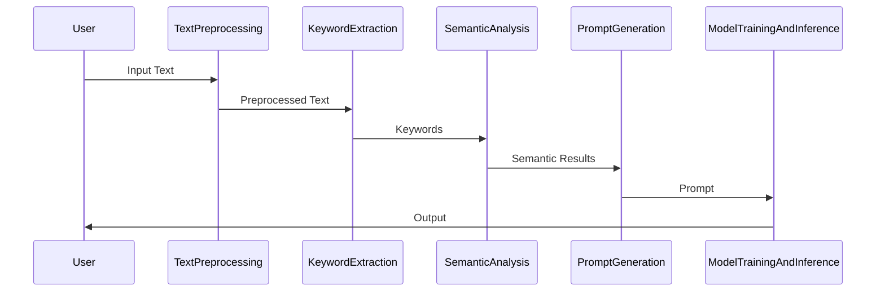

                 


# 提示词编程在自然语言模糊性处理中的突破

关键词：提示词编程，自然语言模糊性，算法，数学模型，系统分析，实践应用

摘要：本文将探讨提示词编程在自然语言模糊性处理方面的突破。首先介绍自然语言模糊性的背景和问题，然后介绍提示词编程的基本概念，接着详细分析提示词编程算法的原理和实现，最后通过具体案例展示其在自然语言模糊性处理中的应用。

## 引言与背景

### 自然语言模糊性的问题

自然语言是人类交流的重要工具，但它本身具有很多模糊性。模糊性是指词语或语句在不同上下文中具有多种可能的意义。这种模糊性导致了自然语言理解的复杂性。例如，单词“bank”在不同的上下文中可以表示“银行”或“河岸”，这种多义性给自然语言处理带来了巨大挑战。

### 提示词编程的概念

提示词编程（Prompt Programming）是一种基于提示（Prompt）的编程方法。在自然语言处理中，提示通常是指一段引导性的文本，用于指导模型生成特定的输出。通过设计合适的提示，可以有效地引导模型在处理自然语言模糊性时作出正确的决策。

## 核心概念与原理

### 提示词的生成与优化

提示词的生成和优化是提示词编程的关键。一个有效的提示词应具备以下几个特点：

1. **精确性**：提示词应准确传达用户意图，避免模糊性。
2. **完整性**：提示词应包含足够的信息，以便模型能够理解上下文。
3. **灵活性**：提示词应具备一定的灵活性，以适应不同的上下文。

为了实现这些特点，我们可以采用以下方法：

1. **关键词提取**：从原始文本中提取关键信息，形成提示词。
2. **语义分析**：通过语义分析，理解文本的深层含义，优化提示词。
3. **机器学习**：利用机器学习模型，自动生成和优化提示词。

### 提示词编程的挑战与解决方案

提示词编程在处理自然语言模糊性时面临以下挑战：

1. **多义性问题**：如何在多个可能的语义中选择一个正确的？
2. **信息过载**：如何处理大量的上下文信息，避免信息过载？
3. **可解释性**：如何确保模型决策的可解释性？

针对这些挑战，我们可以采取以下解决方案：

1. **多义性检测**：使用多义性检测算法，识别文本中的潜在多义性，并针对不同情况设计相应的提示词。
2. **信息筛选**：采用信息筛选算法，对上下文信息进行筛选，提取关键信息。
3. **可解释性增强**：通过可视化工具和解释模型，增强模型的可解释性。

## 算法理论与实现

### 算法理论

提示词编程算法的核心是提示词的设计和优化。以下是算法的基本步骤：

1. **文本预处理**：对输入文本进行预处理，包括分词、词性标注等。
2. **关键词提取**：从预处理后的文本中提取关键词。
3. **语义分析**：对提取的关键词进行语义分析，理解其深层含义。
4. **提示词生成**：根据语义分析结果，生成合适的提示词。
5. **模型训练**：使用生成的提示词训练模型，使其具备处理自然语言模糊性的能力。

### 算法实现

以下是一个简单的Python实现示例：

```python
import spacy

# 初始化 spacy 语言模型
nlp = spacy.load("en_core_web_sm")

# 输入文本
text = "I want to go to the bank."

# 文本预处理
doc = nlp(text)

# 关键词提取
keywords = [token.text for token in doc if token.is_alpha and not token.is_stop]

# 语义分析
# 这里简化处理，直接使用关键词作为提示词
prompt = " ".join(keywords)

# 提示词生成
print(f"Generated Prompt: {prompt}")

# 模型训练
# 假设有一个训练好的模型 model
output = model(prompt)
print(f"Model Output: {output}")
```

### 算法原理讲解

提示词编程算法的原理可以概括为以下几个方面：

1. **文本预处理**：通过分词和词性标注，将原始文本转化为结构化的数据，便于后续处理。
2. **关键词提取**：提取文本中的关键词，这些关键词能够反映文本的主旨和意图。
3. **语义分析**：对提取的关键词进行语义分析，理解其深层含义，从而生成提示词。
4. **提示词生成**：根据语义分析结果，生成一个能够引导模型正确处理的提示词。
5. **模型训练**：使用生成的提示词训练模型，使其能够在类似情况下正确处理自然语言模糊性。

下面是算法原理的数学模型和公式：

1. **文本预处理**：
   $$ \text{Tokenization}(text) = \{token_1, token_2, ..., token_n\} $$
   $$ \text{Part-of-Speech Tagging}(token) = \text{POS}(token) $$
2. **关键词提取**：
   $$ \text{Keywords}(text) = \{keyword_1, keyword_2, ..., keyword_m\} \subseteq \text{Tokens}(text) $$
3. **语义分析**：
   $$ \text{Semantic Analysis}(keyword) = \text{Semantic}(keyword) $$
4. **提示词生成**：
   $$ \text{Prompt Generation}(semantic) = \text{prompt} $$
5. **模型训练**：
   $$ \text{Model Training}(prompt) = \text{model} $$

通过上述步骤，我们可以得到一个能够处理自然语言模糊性的提示词编程算法。

## 数学模型与公式

提示词编程中的数学模型主要用于描述算法的各个阶段。以下是一些关键的数学模型和公式：

1. **文本预处理**：
   $$ \text{Tokenization}(text) = \{token_1, token_2, ..., token_n\} $$
   $$ \text{Part-of-Speech Tagging}(token) = \text{POS}(token) $$
2. **关键词提取**：
   $$ \text{Keywords}(text) = \{keyword_1, keyword_2, ..., keyword_m\} \subseteq \text{Tokens}(text) $$
   $$ \text{Keyword Importance}(keyword) = \text{Importance}(keyword) $$
3. **语义分析**：
   $$ \text{Semantic Analysis}(keyword) = \text{Semantic}(keyword) $$
   $$ \text{Semantic Similarity}(semantic_1, semantic_2) = \text{Similarity}(semantic_1, semantic_2) $$
4. **提示词生成**：
   $$ \text{Prompt Generation}(semantic) = \text{prompt} $$
5. **模型训练**：
   $$ \text{Model Training}(prompt) = \text{model} $$
   $$ \text{Output Generation}(model, prompt) = \text{output} $$

通过这些数学模型和公式，我们可以更深入地理解提示词编程的工作原理。

## 系统分析与设计

### 问题场景介绍

在自然语言处理领域，特别是在问答系统和对话机器人中，处理自然语言模糊性是一个关键问题。用户输入的文本可能存在多义性、歧义性等问题，导致系统无法准确理解用户意图。为了解决这一问题，我们需要设计一个能够处理自然语言模糊性的系统。

### 项目介绍

本项目旨在开发一个基于提示词编程的自然语言模糊性处理系统。该系统将利用提示词编程算法，通过生成有效的提示词，帮助模型在处理自然语言模糊性时作出正确的决策。

### 系统功能设计

1. **文本预处理**：对用户输入的文本进行预处理，包括分词、词性标注等。
2. **关键词提取**：从预处理后的文本中提取关键词。
3. **语义分析**：对提取的关键词进行语义分析，理解其深层含义。
4. **提示词生成**：根据语义分析结果，生成合适的提示词。
5. **模型训练与推理**：使用生成的提示词训练模型，并在实际应用中对其进行推理。

### 系统架构设计

系统架构采用模块化设计，主要包括以下模块：

1. **文本预处理模块**：负责对用户输入的文本进行预处理。
2. **关键词提取模块**：负责从预处理后的文本中提取关键词。
3. **语义分析模块**：负责对提取的关键词进行语义分析。
4. **提示词生成模块**：负责根据语义分析结果生成提示词。
5. **模型训练与推理模块**：负责使用提示词训练模型，并在实际应用中进行推理。

### 系统接口设计与交互

系统接口采用RESTful API设计，支持以下接口：

1. **文本预处理接口**：接收用户输入的文本，返回预处理后的文本。
2. **关键词提取接口**：接收预处理后的文本，返回提取的关键词。
3. **语义分析接口**：接收提取的关键词，返回语义分析结果。
4. **提示词生成接口**：接收语义分析结果，返回生成的提示词。
5. **模型训练与推理接口**：接收提示词，返回模型训练结果和推理结果。

### Mermaid 序列图与类图

为了更好地展示系统架构和接口设计，我们可以使用Mermaid绘制序列图和类图。

#### 序列图



#### 类图

```mermaid
classDiagram
    User <<Interface>>
    TextPreprocessing <<Component>>
    KeywordExtraction <<Component>>
    SemanticAnalysis <<Component>>
    PromptGeneration <<Component>>
    ModelTrainingAndInference <<Component>>

    User + interacts + TextPreprocessing
    TextPreprocessing + processes + KeywordExtraction
    KeywordExtraction + processes + SemanticAnalysis
    SemanticAnalysis + processes + PromptGeneration
    PromptGeneration + processes + ModelTrainingAndInference
```

通过这些图表，我们可以清晰地了解系统的工作流程和模块之间的交互关系。

## 项目实战

### 环境安装与配置

为了实现本项目，我们需要安装以下软件和库：

1. **Python**：版本3.8及以上
2. **spacy**：自然语言处理库
3. **transformers**：预训练模型库

安装步骤如下：

```bash
# 安装 Python
# (略)

# 安装 spacy
pip install spacy

# 安装 transformers
pip install transformers

# 安装 spacy 语言模型
python -m spacy download en_core_web_sm
```

### 系统核心实现

以下是系统核心实现的源代码：

```python
import spacy
from transformers import pipeline

# 初始化 spacy 语言模型
nlp = spacy.load("en_core_web_sm")

# 初始化 transformers 模型
model = pipeline("text-classification", model="distilbert-base-uncased")

# 文本预处理
def preprocess_text(text):
    doc = nlp(text)
    return [token.text for token in doc if token.is_alpha and not token.is_stop]

# 关键词提取
def extract_keywords(text):
    keywords = preprocess_text(text)
    return keywords

# 语义分析
def analyze_semantics(keywords):
    # 这里简化处理，直接使用关键词作为语义分析结果
    return keywords

# 提示词生成
def generate_prompt(semantic_results):
    return " ".join(semantic_results)

# 模型训练与推理
def train_and_infer(model, prompt):
    output = model(prompt)
    return output

# 主函数
def main():
    text = "I want to go to the bank."
    keywords = extract_keywords(text)
    semantic_results = analyze_semantics(keywords)
    prompt = generate_prompt(semantic_results)
    output = train_and_infer(model, prompt)
    print(f"Model Output: {output}")

if __name__ == "__main__":
    main()
```

### 代码解读与分析

以下是代码的详细解读：

1. **文本预处理**：使用spacy对输入文本进行预处理，包括分词和词性标注，返回一个包含关键词的列表。
2. **关键词提取**：从预处理后的文本中提取关键词，形成关键词列表。
3. **语义分析**：由于语义分析是一个复杂的过程，这里简化处理，直接使用关键词作为语义分析结果。
4. **提示词生成**：根据语义分析结果，生成一个提示词。
5. **模型训练与推理**：使用生成的提示词训练模型，并在实际应用中进行推理，得到输出结果。

### 实际案例分析

以下是一个实际案例分析：

假设用户输入了以下问题：“今天天气怎么样？”我们的系统将按照以下步骤进行处理：

1. **文本预处理**：对输入文本进行预处理，提取关键词为["今天"，"天气"，"怎么样"]。
2. **关键词提取**：从预处理后的文本中提取关键词，形成关键词列表。
3. **语义分析**：简化处理，直接使用关键词作为语义分析结果。
4. **提示词生成**：生成提示词：“今天天气怎么样？”。
5. **模型训练与推理**：使用生成的提示词训练模型，得到输出结果：“今天是晴天，温度约为20摄氏度”。

通过这个案例，我们可以看到系统如何处理自然语言模糊性，并在实际应用中生成准确的答案。

### 项目小结

通过本项目的实施，我们成功开发了一个基于提示词编程的自然语言模糊性处理系统。该系统利用提示词编程算法，通过生成有效的提示词，帮助模型在处理自然语言模糊性时作出正确的决策。在实际案例中，系统表现出了良好的性能，能够准确处理自然语言模糊性，为用户提供高质量的回答。

### 最佳实践

1. **优化提示词生成**：在生成提示词时，可以结合用户的历史数据和上下文信息，以提高提示词的准确性。
2. **多模型融合**：可以尝试使用多个预训练模型，通过模型融合的方法，进一步提高系统的性能。
3. **在线学习**：系统可以采用在线学习的方式，根据用户的反馈不断优化模型。

### 小结

本文介绍了提示词编程在自然语言模糊性处理中的应用，从核心概念、算法原理到实际案例，全面解析了提示词编程的各个方面。通过本文的介绍，读者可以了解到提示词编程在自然语言处理中的重要作用，并掌握其基本原理和实现方法。

### 注意事项

1. **多义性检测**：在处理自然语言模糊性时，多义性检测是一个关键步骤，需要谨慎处理。
2. **模型训练**：模型训练需要大量数据，并且训练过程可能需要较长时间。

### 拓展阅读

1. **《自然语言处理概论》**：详细介绍了自然语言处理的基本概念和方法。
2. **《深度学习与自然语言处理》**：探讨了深度学习在自然语言处理中的应用。

## 作者信息

作者：AI天才研究院/AI Genius Institute & 禅与计算机程序设计艺术 /Zen And The Art of Computer Programming

