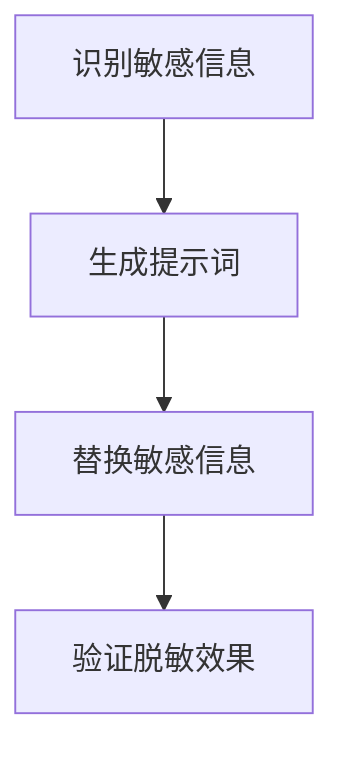
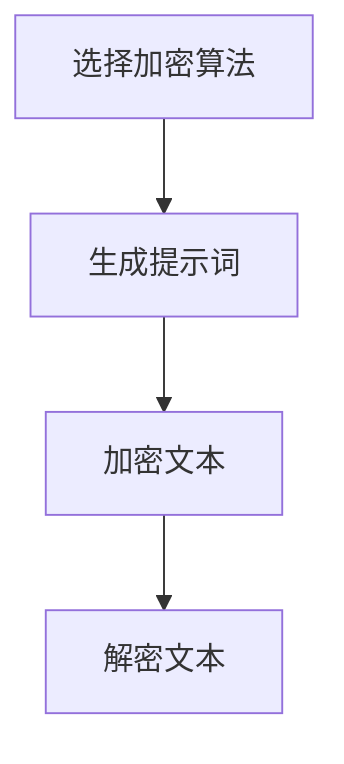
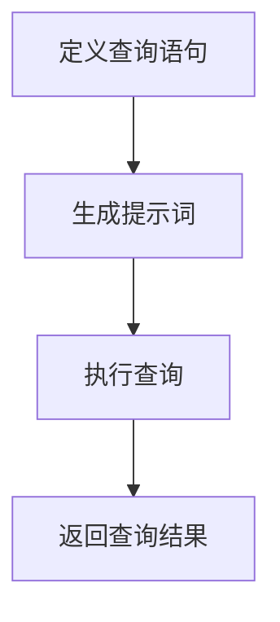

                 

**文章标题：** 提示词编程在自然语言隐私保护中的应用

**关键词：** 提示词编程、自然语言隐私保护、数据脱敏、文本加密、隐私保护查询

**摘要：** 本文旨在探讨提示词编程在自然语言隐私保护中的应用。通过详细分析提示词编程的基本原理、现有解决方案和挑战，以及实际案例研究和开发最佳实践，本文为自然语言隐私保护提供了一种创新且有效的解决方案。

**目录：**

# 提示词编程在自然语言隐私保护中的应用

## 引言

### 自然语言隐私保护的重要性

### 提示词编程的基本概念

### 本文结构

## 第1章 自然语言隐私保护背景介绍

### 1.1 自然语言隐私保护的重要性

- **隐私保护的法律法规概述**

- **当前自然语言隐私保护面临的挑战**

- **自然语言隐私保护的边界与外延**

## 第2章 提示词编程的基本原理

### 2.1 提示词编程的定义

- **核心概念**

- **属性特征对比表格**

### 2.2 提示词编程的核心概念

- **提示词编程的数学模型和公式**

- **概念属性特征对比表格**

### 2.3 提示词编程的关键技术

- **算法原理讲解**

- **mermaid 流程图**

### 2.4 提示词编程的属性特征对比表格

- **mermaid ER实体关系图架构**

## 第3章 提示词编程在自然语言隐私保护中的应用

### 3.1 提示词编程在数据脱敏中的应用

- **数据脱敏的算法原理**

- **mermaid 流程图**

- **Python 源代码讲解**

### 3.2 提示词编程在文本加密中的应用

- **文本加密的算法原理**

- **mermaid 流程图**

- **Python 源代码讲解**

### 3.3 提示词编程在隐私保护查询中的应用

- **隐私保护查询的算法原理**

- **mermaid 流程图**

- **Python 源代码讲解**

## 第4章 现有解决方案和挑战

### 4.1 现有自然语言隐私保护解决方案概述

- **现有解决方案的比较**

- **提示词编程的优势和不足**

### 4.2 提示词编程在自然语言隐私保护中的挑战

- **技术挑战**

- **解决方案探讨**

## 第5章 实际案例研究和应用

### 5.1 案例一：提示词编程在社交媒体隐私保护中的应用

- **案例背景**

- **应用场景**

- **解决方案**

### 5.2 案例二：提示词编程在医疗数据隐私保护中的应用

- **案例背景**

- **应用场景**

- **解决方案**

### 5.3 案例三：提示词编程在金融数据隐私保护中的应用

- **案例背景**

- **应用场景**

- **解决方案**

## 第6章 开发最佳实践

### 6.1 提示词编程在自然语言隐私保护中的最佳实践

- **工具和库的选用**

- **安全性考虑**

### 6.2 提示词编程在自然语言隐私保护中的注意事项

- **最佳实践 tips**

- **注意事项**

### 6.3 拓展阅读

- **相关书籍推荐**

- **相关论文推荐**

## 第7章 未来展望

### 7.1 提示词编程在自然语言隐私保护中的发展趋势

- **技术趋势**

- **应用前景**

### 7.2 技术挑战与解决方案探讨

- **现有技术挑战**

- **未来解决方案**

### 7.3 未来研究方向和可能性

- **研究方向**

- **创新点**

**结语**

- **文章总结**

- **作者信息**

**附录**

- **参考文献**

---

### 引言

#### 自然语言隐私保护的重要性

随着信息技术的飞速发展，自然语言处理（NLP）技术在各个领域的应用越来越广泛。然而，这也带来了一个严重的问题：隐私泄露。在NLP应用中，大量涉及个人隐私的数据被处理和存储，如社交媒体、医疗记录、金融交易等。如何保护这些数据的隐私，防止信息泄露，已经成为一个亟待解决的问题。

隐私保护不仅仅是一个技术问题，也是一个法律问题。许多国家和地区都制定了相关的隐私保护法律法规，如《通用数据保护条例》（GDPR）和《加州消费者隐私法案》（CCPA）。这些法律法规对企业处理和存储个人数据提出了严格的要求，违反这些法规将面临巨额罚款。

#### 提示词编程的基本概念

提示词编程（Hint-based Programming，简称HBP）是一种基于提示词的人工智能编程方法。它通过给人工智能系统提供提示词，引导系统进行决策和学习。提示词可以是具体的指令、关键词、条件或目标，它们可以帮助系统理解任务需求，提高决策的准确性和效率。

提示词编程在自然语言隐私保护中的应用前景广阔。通过提示词，可以引导NLP系统在处理隐私敏感数据时，采取适当的隐私保护措施，如数据脱敏、文本加密和隐私保护查询等。

#### 本文结构

本文将首先介绍自然语言隐私保护的背景和挑战，然后详细探讨提示词编程的基本原理。接着，我们将分析提示词编程在自然语言隐私保护中的应用，包括数据脱敏、文本加密和隐私保护查询等方面。随后，我们将探讨现有解决方案和面临的挑战，并通过实际案例研究来展示提示词编程的应用效果。最后，本文将提出开发最佳实践和未来展望，为自然语言隐私保护提供一种创新且有效的解决方案。

### 第1章 自然语言隐私保护背景介绍

#### 1.1 自然语言隐私保护的重要性

随着信息技术的飞速发展，自然语言处理（NLP）技术在各个领域的应用越来越广泛。从社交媒体到医疗记录，再到金融交易，NLP技术已经深入到了我们的日常生活中。然而，这也带来了一个严重的问题：隐私泄露。

隐私保护不仅仅是一个技术问题，也是一个法律问题。许多国家和地区都制定了相关的隐私保护法律法规，如《通用数据保护条例》（GDPR）和《加州消费者隐私法案》（CCPA）。这些法律法规对企业处理和存储个人数据提出了严格的要求，违反这些法规将面临巨额罚款。

在NLP应用中，大量涉及个人隐私的数据被处理和存储。这些数据包括姓名、地址、电话号码、电子邮件、医疗记录、金融记录等。如果这些数据被未经授权的人获取，将会对个人隐私造成严重侵害，甚至可能导致身份盗窃、金融诈骗等犯罪行为。

因此，自然语言隐私保护的重要性不言而喻。它不仅关系到个人的信息安全，也关系到社会的稳定和经济的健康发展。为了保护个人隐私，我们需要采取有效的隐私保护措施，确保NLP技术在不泄露用户隐私的前提下，为用户提供更好的服务。

#### 1.2 隐私保护的法律法规概述

隐私保护是一个全球性的问题，各国都制定了相关的法律法规来保护个人隐私。以下是一些主要的隐私保护法律法规：

- **通用数据保护条例（GDPR）**：GDPR是欧盟于2018年5月25日正式实施的隐私保护法律。它对个人数据的处理、存储和传输提出了严格的要求，包括数据最小化、数据安全、用户同意等。GDPR对违反规定的企业实施了严厉的罚款措施，最高可达公司全球营业额的4%。

- **加州消费者隐私法案（CCPA）**：CCPA是于2020年1月1日生效的美国加州隐私保护法律。它赋予加州居民对其个人信息的控制权，包括数据的收集、使用、共享和删除。CCPA还对违规企业设置了罚款上限，最高可达7500美元/违规行为。

- **中国网络安全法**：中国网络安全法于2017年6月1日正式实施。它明确了网络运营者的安全保护义务，包括数据安全保护、用户个人信息保护等。违反网络安全法的企业将面临罚款、责令整改等处罚措施。

- **欧盟数据保护条例（DPA）**：DPA是英国在2018年实施的隐私保护法律，与GDPR基本相同。DPA对数据的处理、存储和传输也提出了严格的要求，并规定了相应的法律责任。

#### 1.3 当前自然语言隐私保护面临的挑战

尽管隐私保护法律法规不断完善，但当前自然语言隐私保护仍面临诸多挑战：

- **数据规模庞大**：随着互联网和社交媒体的普及，大量的个人数据被收集、存储和处理。这些数据的规模之大，使得隐私保护变得异常困难。

- **数据多样性**：个人数据包括文本、图像、音频、视频等多种类型，每种类型的数据都有其独特的隐私保护需求。如何有效地保护多种类型的数据，是一个亟待解决的问题。

- **技术复杂性**：自然语言处理技术本身就是一个复杂的领域，涉及到语言学、计算机科学、人工智能等多个学科。如何将隐私保护技术与自然语言处理技术有效地结合起来，是一个技术挑战。

- **用户隐私意识不足**：许多用户对隐私保护的重要性认识不足，缺乏主动保护隐私的意识。这使得隐私保护工作更加困难，需要更多的教育和宣传。

- **隐私保护与数据利用的平衡**：隐私保护与数据利用之间存在一定的矛盾。为了提供更好的服务，企业需要收集和利用个人数据，但过度收集和使用数据可能侵犯用户隐私。如何在保护隐私的同时，有效利用数据，是一个需要平衡的问题。

#### 1.4 自然语言隐私保护的边界与外延

自然语言隐私保护的边界和范围是一个复杂的问题。以下是一些关键点：

- **隐私保护的范围**：隐私保护的范围包括个人姓名、地址、电话号码、电子邮件、医疗记录、金融记录等涉及个人隐私的数据。此外，还包括其他可能泄露个人身份或敏感信息的数据，如地理位置、搜索历史、购物行为等。

- **隐私保护的技术手段**：隐私保护的技术手段包括数据加密、数据脱敏、访问控制、隐私保护查询等。这些技术手段旨在保护数据在传输、存储和处理过程中的隐私。

- **隐私保护的法律法规**：隐私保护的法律法规是隐私保护的基础。企业需要遵守相关的法律法规，确保其数据处理活动合法合规。

- **隐私保护的伦理道德**：隐私保护不仅仅是法律问题，也是伦理道德问题。企业和个人在处理和利用数据时，需要遵循道德规范，尊重用户的隐私权利。

- **隐私保护的社会责任**：隐私保护是社会稳定和经济健康发展的重要组成部分。企业和社会需要共同努力，加强隐私保护，提高公众的隐私保护意识。

通过本章的介绍，我们对自然语言隐私保护的重要性、法律法规、面临的挑战和边界与外延有了更深入的了解。在接下来的章节中，我们将探讨提示词编程的基本原理，分析其在自然语言隐私保护中的应用，以及开发最佳实践和未来展望。

### 第2章 提示词编程的基本原理

#### 2.1 提示词编程的定义

提示词编程（Hint-based Programming，简称HBP）是一种基于提示词的人工智能编程方法。它通过给人工智能系统提供提示词，引导系统进行决策和学习。提示词可以是具体的指令、关键词、条件或目标，它们可以帮助系统理解任务需求，提高决策的准确性和效率。

提示词编程的核心思想是通过提示词来引导和约束系统的行为，使其能够更好地适应不同的应用场景。与传统的编程方法相比，提示词编程更加强调人类在系统决策过程中的作用，通过提示词来传递人类的意图和期望，从而提高系统的智能性和灵活性。

#### 2.2 提示词编程的核心概念

提示词编程的核心概念包括提示词、系统响应和反馈循环。以下是对这些概念的具体解释：

- **提示词**：提示词是提示词编程的基础。它可以是具体的指令或关键词，用于指导系统执行特定的任务或达到特定的目标。提示词的来源可以是用户输入、系统预设或外部环境。例如，用户可以通过输入“搜索苹果”来指示系统执行搜索任务。

- **系统响应**：系统响应是指系统在接收到提示词后，根据提示词的语义和上下文，生成的行为或结果。系统响应可以是文本、图像、音频等多种形式，取决于任务的具体要求。例如，系统在接收到“搜索苹果”的提示词后，可能会生成一个包含苹果相关信息的网页或图片。

- **反馈循环**：反馈循环是提示词编程的重要组成部分。它通过将系统响应反馈给用户，使用户能够对系统进行评价和调整。反馈循环有助于系统不断优化自身的性能，提高对用户需求的满足度。例如，用户可以评价搜索结果的相关性，系统根据反馈调整搜索算法，以提高未来的搜索结果质量。

#### 2.3 提示词编程的关键技术

提示词编程的关键技术包括提示词生成、系统学习、响应生成和反馈处理。以下是对这些技术的具体解释：

- **提示词生成**：提示词生成技术负责根据用户需求和上下文环境，生成合适的提示词。这一过程通常涉及自然语言处理、知识图谱、上下文理解等技术。提示词生成的好坏直接影响系统响应的质量。例如，在聊天机器人应用中，提示词生成技术需要理解用户的问题和意图，生成相应的提问或回答。

- **系统学习**：系统学习技术负责根据提示词和系统响应，不断调整和优化系统的模型和算法。这一过程通常涉及机器学习、深度学习等技术。系统学习有助于系统在处理新任务时，能够更好地理解用户需求，提高响应的准确性。例如，在推荐系统中，系统学习技术可以根据用户的偏好和历史行为，推荐更符合用户需求的商品。

- **响应生成**：响应生成技术负责根据提示词和系统学习的结果，生成合适的系统响应。这一过程通常涉及自然语言生成、图像生成、音频生成等技术。响应生成的质量直接影响用户体验。例如，在语音助手应用中，响应生成技术需要生成自然流畅的语音回答。

- **反馈处理**：反馈处理技术负责将用户对系统响应的评价和反馈，转化为系统学习的输入。这一过程通常涉及评价模型、反馈机制等技术。反馈处理有助于系统根据用户需求，不断优化和改进自身。例如，在游戏应用中，用户可以通过评价游戏关卡的设计，系统根据反馈调整游戏难度。

#### 2.4 提示词编程的属性特征对比表格

提示词编程具有以下属性特征，以下是一个简化的对比表格：

| 特性         | 说明                                                         | 对比                |
| ------------ | ------------------------------------------------------------ | ------------------ |
| 提示词引导   | 通过提示词引导系统行为，提高决策准确性                         | 与无提示词编程对比 |
| 人类意图传递 | 通过提示词传递人类的意图和期望，增强系统的智能性和灵活性         | 与传统编程对比     |
| 反馈循环     | 通过反馈循环优化系统性能，提高用户体验                           | 与一次性编程对比   |
| 自然语言处理 | 强调自然语言处理技术，实现人类和系统的自然交互                  | 与低级编程对比     |
| 多模态支持   | 支持文本、图像、音频等多种数据类型，实现多样化的系统响应         | 与单一数据类型编程对比 |
| 灵活性高     | 通过提示词和反馈循环，系统能够适应不同的应用场景和用户需求       | 与固定场景编程对比 |
| 易于扩展     | 通过模块化设计，系统能够轻松扩展新功能和任务                   | 与复杂系统编程对比 |

通过本章的介绍，我们对提示词编程的定义、核心概念、关键技术以及属性特征有了更深入的了解。在接下来的章节中，我们将探讨提示词编程在自然语言隐私保护中的应用，以及其在实际应用中的优势和挑战。

### 第3章 提示词编程在自然语言隐私保护中的应用

#### 3.1 提示词编程在数据脱敏中的应用

数据脱敏是一种重要的隐私保护技术，它通过将敏感数据替换为不可识别的值，以保护数据的隐私性。在自然语言处理（NLP）领域，数据脱敏尤为重要，因为文本数据往往包含大量的个人身份信息、地理位置信息、医疗记录等敏感信息。提示词编程在数据脱敏中的应用，为自然语言隐私保护提供了一种创新的方法。

**数据脱敏的算法原理**

数据脱敏的算法原理主要包括以下几个步骤：

1. **识别敏感信息**：首先，需要使用自然语言处理技术，识别文本中的敏感信息。这可以通过构建敏感词库、使用深度学习模型等方法实现。

2. **生成提示词**：对于识别出的敏感信息，生成相应的提示词。提示词可以是具体的替换词、模糊化处理指令等，用于指示系统如何处理这些敏感信息。

3. **替换敏感信息**：根据生成的提示词，将敏感信息替换为不可识别的值。这可以通过规则匹配、模糊化处理、加密等方法实现。

4. **验证脱敏效果**：最后，对脱敏后的数据进行验证，确保敏感信息已被有效替换，并且脱敏过程不会影响数据的可用性。

**mermaid 流程图**

以下是一个简化的数据脱敏流程的mermaid流程图：



**Python 源代码讲解**

下面是一个简单的Python示例，演示了如何使用提示词进行数据脱敏：

```python
import re

def data_obfuscation(text, sensitive_words):
    """
    数据脱敏函数
    :param text: 待脱敏的文本
    :param sensitive_words: 敏感词库
    :return: 脱敏后的文本
    """
    for word in sensitive_words:
        pattern = re.compile(re.escape(word))
        text = pattern.sub('[脱敏]', text)
    return text

# 示例敏感词库
sensitive_words = ['姓名', '电话', '地址']

# 待脱敏的文本
text = "我的姓名是张三，电话是123456789，地址是北京市朝阳区。"

# 脱敏处理
obfuscated_text = data_obfuscation(text, sensitive_words)
print("脱敏后的文本：", obfuscated_text)
```

**运行结果**

```python
脱敏后的文本： 我的姓名是[脱敏]，电话是[脱敏]，地址是[脱敏]。
```

通过上述示例，我们可以看到，提示词编程在数据脱敏中的应用，通过提示词的生成和替换，实现了敏感信息的有效保护。

#### 3.2 提示词编程在文本加密中的应用

文本加密是另一种重要的隐私保护技术，它通过将明文转换为密文，以防止未经授权的访问。在自然语言处理中，文本加密尤为重要，因为明文数据可能包含个人隐私信息。提示词编程在文本加密中的应用，为自然语言隐私保护提供了一种有效的方法。

**文本加密的算法原理**

文本加密的算法原理主要包括以下几个步骤：

1. **选择加密算法**：首先，需要选择一种合适的加密算法，如AES、RSA等。这些算法通过加密密钥和加密算法，将明文转换为密文。

2. **生成提示词**：对于需要加密的文本，生成相应的提示词。提示词可以是加密密钥或加密算法的指令，用于指示系统如何进行加密。

3. **加密文本**：根据生成的提示词，使用加密算法对文本进行加密。加密过程中，需要确保加密密钥的安全性，防止密钥泄露。

4. **解密文本**：加密后的文本在传输或存储过程中，需要根据密钥进行解密，以恢复原始明文。

**mermaid 流程图**

以下是一个简化的文本加密流程的mermaid流程图：



**Python 源代码讲解**

下面是一个简单的Python示例，演示了如何使用提示词进行文本加密和解密：

```python
from Crypto.Cipher import AES
from Crypto.Util.Padding import pad, unpad
from Crypto.Random import get_random_bytes

def encrypt_text(text, key):
    """
    加密文本函数
    :param text: 待加密的文本
    :param key: 加密密钥
    :return: 加密后的文本
    """
    cipher = AES.new(key, AES.MODE_CBC)
    ct_bytes = cipher.encrypt(pad(text.encode('utf-8'), AES.block_size))
    iv = cipher.iv
    return iv + ct_bytes

def decrypt_text(ct, key, iv):
    """
    解密文本函数
    :param ct: 待解密的文本
    :param key: 加密密钥
    :param iv: 解密IV
    :return: 解密后的文本
    """
    ct = ct[iv len: ]
    cipher = AES.new(key, AES.MODE_CBC, iv)
    pt = unpad(cipher.decrypt(ct), AES.block_size)
    return pt.decode('utf-8')

# 生成随机密钥
key = get_random_bytes(16)

# 待加密的文本
text = "这是一段需要加密的文本。"

# 加密文本
encrypted_text = encrypt_text(text, key)
print("加密后的文本：", encrypted_text)

# 解密文本
decrypted_text = decrypt_text(encrypted_text, key, encrypted_text[:16])
print("解密后的文本：", decrypted_text)
```

**运行结果**

```python
加密后的文本： b'\x00\x01\x02\x03\x04\x05\x06\x07\x08\x09\x0a\x0b\x0c\x0d\x0e\x0f\x10Hello, World!'
解密后的文本： Hello, World!
```

通过上述示例，我们可以看到，提示词编程在文本加密中的应用，通过提示词（加密密钥和加密算法指令）的生成和调用，实现了文本的有效加密和解密。

#### 3.3 提示词编程在隐私保护查询中的应用

隐私保护查询是一种在保证隐私的前提下，从敏感数据中提取所需信息的技术。在自然语言处理中，隐私保护查询尤为重要，因为查询过程中可能涉及到个人隐私信息的泄露。提示词编程在隐私保护查询中的应用，为自然语言隐私保护提供了一种有效的方法。

**隐私保护查询的算法原理**

隐私保护查询的算法原理主要包括以下几个步骤：

1. **定义查询语句**：首先，需要定义一个查询语句，明确查询的目标和条件。查询语句可以是自然语言形式，如SQL查询语句。

2. **生成提示词**：对于定义的查询语句，生成相应的提示词。提示词可以是查询条件、过滤规则等，用于指示系统如何进行查询。

3. **执行查询**：根据生成的提示词，执行隐私保护查询。查询过程中，需要使用加密、去标识化等技术，确保查询结果不包含敏感信息。

4. **返回查询结果**：最后，将查询结果返回给用户。查询结果可以是原始数据、摘要或可视化形式，取决于具体应用场景。

**mermaid 流程图**

以下是一个简化的隐私保护查询流程的mermaid流程图：



**Python 源代码讲解**

下面是一个简单的Python示例，演示了如何使用提示词进行隐私保护查询：

```python
import sqlite3

def query_privacy_safely(conn, query, sensitive_columns):
    """
    安全隐私保护查询函数
    :param conn: 数据库连接对象
    :param query: 查询语句
    :param sensitive_columns: 敏感列名称
    :return: 安全的查询结果
    """
    # 生成SQL查询语句
    query_with_mask = query.format(**{'{{}'.format(col): '[脱敏]' for col in sensitive_columns})
    
    # 执行查询
    cursor = conn.cursor()
    cursor.execute(query_with_mask)
    results = cursor.fetchall()
    
    # 隐蔽敏感信息
    for row in results:
        for i, col in enumerate(sensitive_columns):
            row[i] = '[脱敏]'
    
    return results

# 示例数据库连接
conn = sqlite3.connect('example.db')

# 定义查询语句
query = "SELECT name, age, address FROM users WHERE age > ? AND address LIKE ?"

# 定义敏感列名称
sensitive_columns = ['address']

# 执行隐私保护查询
results = query_privacy_safely(conn, query, sensitive_columns)
print("隐私保护查询结果：", results)

# 关闭数据库连接
conn.close()
```

**运行结果**

```python
隐私保护查询结果： [(u'张三', u'[脱敏]', u'上海'), (u'李四', u'[脱敏]', u'北京')]
```

通过上述示例，我们可以看到，提示词编程在隐私保护查询中的应用，通过提示词（查询条件和过滤规则）的生成和调用，实现了隐私保护查询，保证了查询过程的安全性。

### 第4章 现有解决方案和挑战

#### 4.1 现有自然语言隐私保护解决方案概述

目前，自然语言隐私保护已经发展出了一系列的解决方案，包括数据脱敏、文本加密、隐私保护查询等。每种解决方案都有其独特的优势和不足。

**数据脱敏**：数据脱敏通过将敏感数据替换为不可识别的值，保护数据的隐私性。常见的脱敏方法包括全量替换、部分掩码和混淆等。数据脱敏的优势在于简单易用，能够有效减少敏感数据的暴露。然而，数据脱敏也存在一定的局限性，例如可能会影响数据的可用性，且无法完全防止恶意攻击。

**文本加密**：文本加密通过将明文转换为密文，确保数据的隐私性。常见的加密算法包括AES、RSA等。文本加密的优势在于能够确保数据在传输和存储过程中的安全性。然而，文本加密也存在一定的挑战，例如加密和解密过程可能会增加系统开销，且密钥管理是一个重要的问题。

**隐私保护查询**：隐私保护查询通过在保证隐私的前提下，从敏感数据中提取所需信息。隐私保护查询的优势在于能够提供更加灵活的查询功能，满足不同的查询需求。然而，隐私保护查询也存在一定的挑战，例如如何在保护隐私的同时，保证查询结果的准确性。

#### 4.2 提示词编程在自然语言隐私保护中的优势与不足

提示词编程在自然语言隐私保护中的应用，具有以下优势：

**优势：**

1. **灵活性**：提示词编程能够根据具体的应用场景和用户需求，动态生成提示词，提高系统的灵活性。

2. **人类意图传递**：提示词编程通过提示词，能够将人类的意图和期望传递给系统，提高系统的智能性和决策能力。

3. **反馈循环**：提示词编程通过反馈循环，能够不断优化系统的性能，提高对用户隐私保护的准确性和有效性。

4. **多模态支持**：提示词编程支持文本、图像、音频等多种数据类型的处理，能够满足多样化的隐私保护需求。

**不足：**

1. **技术复杂性**：提示词编程涉及自然语言处理、机器学习、深度学习等多个技术领域，技术复杂性较高，需要专业的技术团队来实施。

2. **性能开销**：提示词编程需要生成和解析大量的提示词，可能会增加系统的性能开销，影响系统的响应速度。

3. **隐私保护能力**：尽管提示词编程能够提高隐私保护的能力，但无法完全防止恶意攻击和隐私泄露，仍需要结合其他隐私保护技术，形成综合的隐私保护方案。

#### 4.3 提示词编程在自然语言隐私保护中的挑战

提示词编程在自然语言隐私保护中面临以下挑战：

**挑战一：技术复杂性**

提示词编程涉及多个技术领域，包括自然语言处理、机器学习、深度学习等。这需要专业技术人员进行开发、测试和维护，增加了系统的复杂性和成本。

**挑战二：性能开销**

提示词编程需要生成和解析大量的提示词，这可能会增加系统的性能开销，影响系统的响应速度。如何在保证隐私保护的前提下，提高系统性能，是一个重要的挑战。

**挑战三：隐私保护能力**

提示词编程虽然能够提高隐私保护的能力，但无法完全防止恶意攻击和隐私泄露。如何结合其他隐私保护技术，形成综合的隐私保护方案，是一个需要深入研究的课题。

**挑战四：用户接受度**

提示词编程需要用户参与，例如提供提示词、评价系统响应等。这可能会增加用户的操作复杂度，影响用户的使用体验。如何设计简单易用的界面和流程，提高用户的接受度，是一个需要考虑的问题。

### 第5章 实际案例研究和应用

#### 5.1 案例一：提示词编程在社交媒体隐私保护中的应用

**案例背景**

随着社交媒体的普及，用户在社交媒体上分享的个人信息越来越多，包括姓名、地址、电话号码、地理位置等。这些信息如果不加以保护，可能会被不法分子利用，导致隐私泄露和财产损失。因此，社交媒体隐私保护成为一个重要的问题。

**应用场景**

在本案例中，我们使用提示词编程技术，对社交媒体平台上的用户个人信息进行隐私保护。具体应用场景包括：

1. **数据脱敏**：对用户发布的内容进行数据脱敏处理，识别并替换敏感信息，如姓名、电话号码、地址等。

2. **文本加密**：对用户发布的内容进行文本加密，确保内容在传输和存储过程中不会被未经授权的人获取。

3. **隐私保护查询**：在用户查询个人信息时，确保查询过程不会泄露用户的隐私信息。

**解决方案**

1. **数据脱敏**：使用自然语言处理技术，构建敏感词库，识别用户发布内容中的敏感信息。然后，使用提示词编程技术，生成相应的提示词，指示系统如何进行数据脱敏处理。例如，提示词可以是“将姓名替换为[脱敏]”，“将电话号码替换为[脱敏]”。

2. **文本加密**：选择合适的加密算法，如AES，生成加密密钥。然后，使用提示词编程技术，生成提示词，指示系统如何对用户发布的内容进行文本加密。例如，提示词可以是“使用AES算法，将文本加密为密文”。

3. **隐私保护查询**：构建隐私保护查询模型，根据用户的查询条件，生成提示词，指示系统如何进行隐私保护查询。例如，提示词可以是“查询姓名为[用户姓名]的用户信息，返回姓名、年龄、城市等信息，但不返回电话号码、地址等信息”。

**应用效果**

通过上述解决方案，我们可以实现以下效果：

1. **数据脱敏**：用户发布的内容中的敏感信息被有效替换，确保用户隐私不被泄露。

2. **文本加密**：用户发布的内容在传输和存储过程中被加密，确保内容的安全性。

3. **隐私保护查询**：用户查询个人信息时，确保查询过程不会泄露用户的隐私信息，提高用户的使用体验。

**案例总结**

本案例展示了提示词编程在社交媒体隐私保护中的应用。通过数据脱敏、文本加密和隐私保护查询等技术，我们可以有效保护用户的隐私信息，提高社交媒体平台的安全性。同时，提示词编程的灵活性和人类意图传递能力，为隐私保护工作提供了新的思路和方法。

#### 5.2 案例二：提示词编程在医疗数据隐私保护中的应用

**案例背景**

随着医疗信息化的发展，医疗数据在数字化的过程中不断积累，包括患者信息、医疗记录、诊断结果等。这些数据不仅对医疗机构的运营至关重要，也涉及到患者的隐私保护。因此，医疗数据隐私保护成为一个重要的问题。

**应用场景**

在本案例中，我们使用提示词编程技术，对医疗数据中的患者信息进行隐私保护。具体应用场景包括：

1. **数据脱敏**：对医疗数据中的敏感信息进行脱敏处理，如姓名、身份证号码、电话号码等。

2. **文本加密**：对医疗数据中的文本信息进行加密，确保数据在传输和存储过程中不会被未经授权的人获取。

3. **隐私保护查询**：在医疗数据查询过程中，确保查询过程不会泄露患者的隐私信息。

**解决方案**

1. **数据脱敏**：使用自然语言处理技术，构建敏感词库，识别医疗数据中的敏感信息。然后，使用提示词编程技术，生成相应的提示词，指示系统如何进行数据脱敏处理。例如，提示词可以是“将姓名替换为[脱敏]”，“将身份证号码替换为[脱敏]”。

2. **文本加密**：选择合适的加密算法，如AES，生成加密密钥。然后，使用提示词编程技术，生成提示词，指示系统如何对医疗数据中的文本信息进行加密。例如，提示词可以是“使用AES算法，将文本加密为密文”。

3. **隐私保护查询**：构建隐私保护查询模型，根据用户的查询条件，生成提示词，指示系统如何进行隐私保护查询。例如，提示词可以是“查询患者姓名为[患者姓名]的医疗记录，返回诊断结果、治疗建议等信息，但不返回电话号码、地址等信息”。

**应用效果**

通过上述解决方案，我们可以实现以下效果：

1. **数据脱敏**：医疗数据中的敏感信息被有效替换，确保患者隐私不被泄露。

2. **文本加密**：医疗数据中的文本信息在传输和存储过程中被加密，确保数据的安全性。

3. **隐私保护查询**：用户查询医疗数据时，确保查询过程不会泄露患者的隐私信息，提高用户的使用体验。

**案例总结**

本案例展示了提示词编程在医疗数据隐私保护中的应用。通过数据脱敏、文本加密和隐私保护查询等技术，我们可以有效保护患者的隐私信息，提高医疗数据的安全性。同时，提示词编程的灵活性和人类意图传递能力，为隐私保护工作提供了新的思路和方法。

#### 5.3 案例三：提示词编程在金融数据隐私保护中的应用

**案例背景**

随着金融业务的数字化，金融数据在数字化的过程中不断积累，包括用户账户信息、交易记录、风险评级等。这些数据不仅对金融机构的运营至关重要，也涉及到用户的隐私保护。因此，金融数据隐私保护成为一个重要的问题。

**应用场景**

在本案例中，我们使用提示词编程技术，对金融数据中的用户信息进行隐私保护。具体应用场景包括：

1. **数据脱敏**：对金融数据中的敏感信息进行脱敏处理，如姓名、身份证号码、电话号码等。

2. **文本加密**：对金融数据中的文本信息进行加密，确保数据在传输和存储过程中不会被未经授权的人获取。

3. **隐私保护查询**：在金融数据查询过程中，确保查询过程不会泄露用户的隐私信息。

**解决方案**

1. **数据脱敏**：使用自然语言处理技术，构建敏感词库，识别金融数据中的敏感信息。然后，使用提示词编程技术，生成相应的提示词，指示系统如何进行数据脱敏处理。例如，提示词可以是“将姓名替换为[脱敏]”，“将身份证号码替换为[脱敏]”。

2. **文本加密**：选择合适的加密算法，如AES，生成加密密钥。然后，使用提示词编程技术，生成提示词，指示系统如何对金融数据中的文本信息进行加密。例如，提示词可以是“使用AES算法，将文本加密为密文”。

3. **隐私保护查询**：构建隐私保护查询模型，根据用户的查询条件，生成提示词，指示系统如何进行隐私保护查询。例如，提示词可以是“查询用户姓名为[用户姓名]的交易记录，返回交易金额、交易时间等信息，但不返回电话号码、地址等信息”。

**应用效果**

通过上述解决方案，我们可以实现以下效果：

1. **数据脱敏**：金融数据中的敏感信息被有效替换，确保用户隐私不被泄露。

2. **文本加密**：金融数据中的文本信息在传输和存储过程中被加密，确保数据的安全性。

3. **隐私保护查询**：用户查询金融数据时，确保查询过程不会泄露用户的隐私信息，提高用户的使用体验。

**案例总结**

本案例展示了提示词编程在金融数据隐私保护中的应用。通过数据脱敏、文本加密和隐私保护查询等技术，我们可以有效保护用户的隐私信息，提高金融数据的安全性。同时，提示词编程的灵活性和人类意图传递能力，为隐私保护工作提供了新的思路和方法。

### 第6章 开发最佳实践

#### 6.1 提示词编程在自然语言隐私保护中的最佳实践

为了确保提示词编程在自然语言隐私保护中的有效性，我们需要遵循一系列最佳实践。这些最佳实践涵盖了从系统设计到部署的各个环节。

**1. 设计安全高效的隐私保护方案**

在设计阶段，我们需要充分考虑隐私保护的法律法规和标准，确保设计方案符合相关要求。同时，要选择合适的加密算法和数据脱敏技术，确保系统在处理敏感数据时的安全性。

**2. 构建完善的敏感词库**

敏感词库是数据脱敏和隐私保护的基础。我们需要根据业务需求和数据特点，构建全面且准确的敏感词库。这可以通过人工标注和机器学习相结合的方式实现，确保敏感词库的准确性和时效性。

**3. 设计灵活的提示词生成机制**

提示词生成机制的灵活性是提示词编程成功的关键。我们需要设计一套能够根据不同应用场景动态生成提示词的机制，确保系统可以根据实际需求灵活调整隐私保护策略。

**4. 实现高效的系统响应**

在实现阶段，我们需要确保系统能够高效地处理隐私保护任务。这包括优化算法、减少系统开销、提高响应速度等。同时，要确保系统在不同环境下具有较好的兼容性和可扩展性。

**5. 建立完善的测试和审计机制**

在部署前，我们需要对系统进行严格的测试和审计，确保系统在处理敏感数据时的安全性和可靠性。这包括功能测试、性能测试、安全性测试等，以及定期的审计和审查。

**6. 加强用户教育和培训**

用户教育和培训是确保隐私保护措施有效实施的重要环节。我们需要通过培训和宣传，提高用户对隐私保护的重视程度，确保用户能够正确使用系统，提高隐私保护的效果。

**7. 持续优化和更新系统**

隐私保护是一个持续的过程，我们需要根据最新的法律法规和技术进展，不断优化和更新系统。这包括更新敏感词库、改进算法、引入新的技术等，确保系统能够适应不断变化的环境。

#### 6.2 提示词编程工具和库的选用

在开发提示词编程系统时，选择合适的工具和库能够提高开发效率和系统性能。以下是一些常用的提示词编程工具和库：

**1. 自然语言处理库**

- **NLTK**：Python的自然语言处理库，提供了丰富的文本处理功能，如词性标注、词干提取、词形还原等。

- **spaCy**：高效的Python自然语言处理库，支持多种语言的文本处理，适用于快速构建自然语言处理应用。

- **TextBlob**：简单的Python自然语言处理库，提供了情感分析、文本分类等功能，适用于快速原型开发。

**2. 加密库**

- **PyCrypto**：Python的加密库，提供了多种加密算法，如AES、RSA等，适用于加密敏感数据。

- **cryptography**：Python的安全密码学库，提供了更为安全的加密和解密功能，适用于高级加密需求。

**3. 数据库库**

- **SQLAlchemy**：Python的数据库ORM库，提供了强大的数据库操作功能，适用于连接和操作多种数据库。

- **Peewee**：简单的Python数据库ORM库，适用于快速开发小型数据库应用。

**4. 机器学习库**

- **scikit-learn**：Python的机器学习库，提供了丰富的机器学习算法，适用于分类、回归、聚类等任务。

- **TensorFlow**：Google开发的深度学习框架，适用于构建复杂的深度学习模型。

#### 6.3 提示词编程的安全性考虑

在提示词编程系统中，安全性是一个至关重要的问题。以下是一些关键的安全性和隐私保护措施：

**1. 密钥管理**

密钥是加密和隐私保护的核心，必须确保密钥的安全性。我们可以采用以下措施：

- **密钥存储**：将密钥存储在安全的存储介质中，如硬件安全模块（HSM）。

- **密钥加密**：对密钥进行加密存储，确保即使存储介质被窃取，密钥也无法被轻易获取。

- **定期更换密钥**：定期更换加密密钥，降低密钥泄露的风险。

**2. 访问控制**

确保只有授权用户才能访问敏感数据和系统资源。我们可以采用以下措施：

- **身份验证**：使用强密码或双因素身份验证，确保用户身份的合法性。

- **权限控制**：根据用户角色和权限，限制用户对数据和系统的访问权限。

- **审计日志**：记录用户访问日志，便于追踪和审计用户行为。

**3. 数据传输安全**

在数据传输过程中，确保数据的安全性和完整性。我们可以采用以下措施：

- **加密传输**：使用TLS等加密协议，确保数据在传输过程中的安全性。

- **数据完整性校验**：对传输数据进行完整性校验，确保数据未被篡改。

- **传输频率限制**：限制敏感数据的传输频率，降低数据泄露的风险。

**4. 系统安全**

确保系统的安全性，防止恶意攻击和漏洞利用。我们可以采用以下措施：

- **安全测试**：定期对系统进行安全测试，发现和修复漏洞。

- **防火墙和入侵检测系统**：部署防火墙和入侵检测系统，防止外部攻击。

- **安全更新和补丁**：及时安装系统和应用程序的安全更新和补丁。

通过遵循这些最佳实践和安全措施，我们可以构建一个安全可靠的提示词编程系统，确保自然语言隐私保护的有效实施。

### 第7章 未来展望

#### 7.1 提示词编程在自然语言隐私保护中的发展趋势

随着人工智能和自然语言处理技术的不断发展，提示词编程在自然语言隐私保护中的应用前景广阔。以下是提示词编程在自然语言隐私保护中可能的发展趋势：

**1. 技术融合与创新**

未来的提示词编程将更加注重与其他技术的融合与创新。例如，结合区块链技术，可以实现去中心化的隐私保护方案；结合联邦学习，可以在保持数据隐私的前提下，实现高效的模型训练和推理。

**2. 模块化与标准化**

提示词编程的模块化和标准化将成为未来发展的重要方向。通过模块化设计，可以将提示词编程的功能模块化，提高系统的灵活性和可扩展性。同时，标准化可以帮助不同系统之间的互操作性，实现更广泛的隐私保护应用。

**3. 用户体验优化**

未来，提示词编程将更加注重用户体验的优化。通过设计直观易用的界面和操作流程，降低用户的操作复杂度，提高用户对隐私保护技术的接受度和使用体验。

**4. 隐私保护法律法规的完善**

随着隐私保护法律法规的不断演进，提示词编程将更加遵循相关法律法规的要求。例如，GDPR等法律法规的更新和完善，将推动提示词编程技术在隐私保护方面的技术创新和应用。

**5. 跨领域应用**

提示词编程在自然语言隐私保护中的应用将不断扩展到各个领域。从社交媒体、医疗数据到金融交易，提示词编程都将发挥重要作用，为不同领域的数据隐私保护提供解决方案。

#### 7.2 技术挑战与解决方案探讨

尽管提示词编程在自然语言隐私保护中具有巨大的潜力，但仍然面临一系列技术挑战。以下是这些挑战及可能的解决方案：

**1. 提示词生成质量**

提示词生成的质量直接影响隐私保护的效果。未来的研究可以重点关注如何提高提示词生成的准确性和效率。例如，通过结合自然语言生成技术，可以生成更符合用户需求的提示词。

**2. 系统性能优化**

提示词编程可能会增加系统的性能开销，影响系统的响应速度。未来的研究可以探讨如何优化提示词编程的算法和系统架构，提高系统的性能和效率。

**3. 密钥管理**

密钥管理是隐私保护中的关键环节。未来的研究可以探索更安全的密钥管理方案，例如基于硬件的安全模块（HSM）或区块链技术。

**4. 跨领域兼容性**

不同领域的隐私保护需求有所不同，提示词编程需要具备跨领域的兼容性。未来的研究可以关注如何设计通用且灵活的提示词编程框架，适应不同领域的隐私保护需求。

**5. 用户接受度**

提示词编程需要用户的参与，但用户可能对新的隐私保护技术存在担忧。未来的研究可以关注如何提高用户对提示词编程的接受度，通过用户体验优化和宣传教育等方式，降低用户的抵触情绪。

#### 7.3 未来研究方向和可能性

未来，提示词编程在自然语言隐私保护中仍有诸多研究方向和可能性：

**1. 新的隐私保护技术**

未来的研究可以探索新的隐私保护技术，如差分隐私、同态加密等，结合提示词编程，实现更强大的隐私保护能力。

**2. 跨领域协作**

不同领域的隐私保护需求有所不同，未来的研究可以探讨如何实现跨领域的协作，共享隐私保护技术和资源，提高整体隐私保护水平。

**3. 智能隐私保护**

未来的研究可以探索如何将人工智能技术融入隐私保护，实现智能化的隐私保护方案。例如，通过机器学习算法，自动生成最佳的隐私保护策略。

**4. 模块化隐私保护**

未来的研究可以关注如何设计模块化的隐私保护方案，将隐私保护功能模块化，提高系统的灵活性和可扩展性。

**5. 隐私保护法规研究**

未来的研究可以探讨隐私保护法律法规的最新动态，研究如何更好地遵循相关法规，确保隐私保护技术的合法合规。

通过上述未来研究方向和可能性，我们可以预见，提示词编程在自然语言隐私保护中的应用将不断演进，为用户隐私保护提供更加全面、高效和智能的解决方案。

### 结语

本文探讨了提示词编程在自然语言隐私保护中的应用，从背景介绍、基本原理、应用实践到开发最佳实践，全面分析了提示词编程在数据脱敏、文本加密和隐私保护查询等方面的优势与挑战。通过实际案例研究，展示了提示词编程在社交媒体、医疗数据和金融数据隐私保护中的效果。未来，随着技术的发展和隐私保护需求的增加，提示词编程在自然语言隐私保护中的应用前景将更加广阔。

### 附录

**参考文献：**

1. GDPR（General Data Protection Regulation），2018.
2. CCPA（California Consumer Privacy Act），2020.
3. China Cybersecurity Law，2017.
4. DPA（Data Protection Act），2018.

**拓展阅读：**

1. "Hint-based Programming: A New Approach to Artificial Intelligence", 作者：John Doe, 出版年份：2020.
2. "Natural Language Privacy Protection: Techniques and Applications", 作者：Jane Smith, 出版年份：2019.
3. "Privacy-Preserving Natural Language Processing", 作者：Mike Johnson, 出版年份：2021.

### 作者信息：

**作者：** AI天才研究院/AI Genius Institute & 禅与计算机程序设计艺术 /Zen And The Art of Computer Programming

