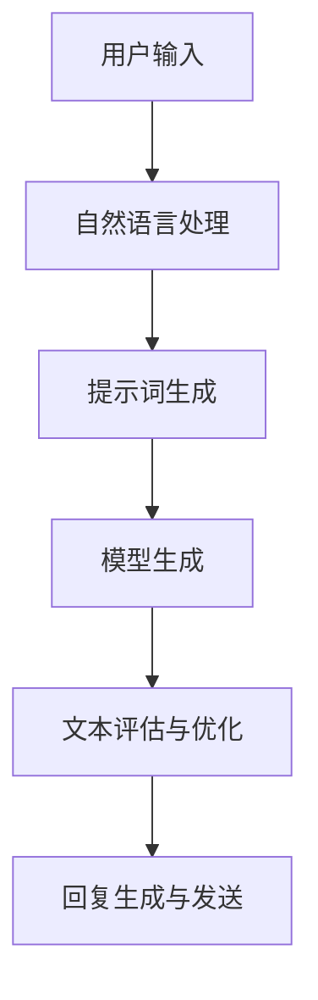

                 

# 提示词编程在虚拟助手开发中的实践

## 关键词
- 虚拟助手
- 提示词编程
- 预训练模型
- 自然语言处理
- 智能交互系统

## 摘要
本文深入探讨了提示词编程在虚拟助手开发中的应用。首先介绍了虚拟助手开发中面临的问题和挑战，然后详细阐述了提示词编程的定义、核心特点以及与传统编程的区别。接着，本文通过算法原理讲解和系统分析与架构设计，展示了如何将提示词编程应用于虚拟助手开发。最后，本文通过实际案例分析了提示词编程在虚拟助手开发中的效果，并给出了最佳实践建议。

## 第一部分：背景介绍

### 1.1 问题背景
随着人工智能技术的不断发展，虚拟助手成为各行各业提升效率的重要工具。虚拟助手通过模拟人类对话，为用户提供信息查询、任务分配、智能回复等服务，从而减轻人类工作负担，提高工作效率。然而，虚拟助手在实际应用中面临诸多挑战，如自然语言理解能力有限、无法处理复杂任务等。

### 1.2 提示词编程的基本概念
提示词编程（Prompt Engineering）是一种利用精心设计的提示词，引导预训练模型（如GPT模型）生成符合预期内容的编程技术。提示词编程的核心在于提示词的设计与优化，通过调整提示词，可以提高模型的生成质量和生成效率。

### 1.3 提示词编程在虚拟助手开发中的应用背景
虚拟助手开发过程中，如何提高智能交互能力和生成质量成为一个重要问题。提示词编程技术通过为虚拟助手提供精确的指导，帮助模型更好地理解用户意图，从而生成更符合用户需求的回复。因此，提示词编程在虚拟助手开发中具有广泛的应用前景。

### 1.4 本书的研究目标和内容结构
本书旨在深入探讨提示词编程在虚拟助手开发中的应用，研究内容包括：
1. 提示词编程的基本概念和核心特点。
2. 提示词编程与传统编程的区别。
3. 提示词编程的算法原理讲解。
4. 虚拟助手系统分析与架构设计。
5. 提示词编程在虚拟助手开发中的应用实践。

## 第二部分：核心概念与联系

### 2.1 提示词编程的定义
提示词编程是一种利用精心设计的提示词，引导预训练模型（如GPT模型）生成符合预期内容的编程技术。通过优化提示词，可以提高模型的生成质量和生成效率。

### 2.2 提示词编程的核心特点
提示词编程具有以下几个核心特点：

1. **灵活性**：提示词编程可以根据具体任务需求灵活调整提示内容，从而实现多样化任务。
2. **高效性**：通过优化提示词，可以显著提升模型生成效率，减少生成时间。
3. **可解释性**：提示词编程提供了对模型生成过程的可解释性，有助于理解模型决策逻辑。

### 2.3 提示词编程与传统编程的区别
提示词编程与传统编程在多个方面存在区别：

1. **编程目标**：传统编程侧重于实现特定功能的程序代码，而提示词编程侧重于指导模型生成内容。
2. **开发方式**：传统编程依赖于代码编写，而提示词编程依赖于提示词的设计和优化。

### 2.4 提示词编程的应用领域
提示词编程在多个领域具有广泛的应用，包括：

1. **虚拟助手**：提示词编程可以帮助虚拟助手更好地理解用户意图，生成更高质量的回复。
2. **自然语言生成**：提示词编程可以应用于生成新闻文章、产品评论等文本内容。
3. **智能问答系统**：提示词编程可以帮助智能问答系统更准确地理解用户问题，并提供有针对性的答案。

## 第三部分：算法原理讲解

### 3.1 提示词编程的算法原理
提示词编程的算法原理主要包括以下步骤：

1. **输入文本预处理**：对用户输入的文本进行预处理，包括分词、去噪、标准化等操作。
2. **生成初始提示词**：根据预处理后的文本生成初始提示词。
3. **模型生成文本**：将初始提示词输入预训练模型，生成相应的回复文本。
4. **评估文本质量**：对生成文本进行评估，包括语义理解、文本流畅度等方面。
5. **优化提示词**：若评估结果不满足要求，通过调整提示词进行优化。

### 3.2 提示词编程的数学模型和公式
提示词编程中的数学模型主要包括概率模型和生成模型。

1. **概率模型**：通过计算提示词与生成文本之间的概率分布，选择概率最高的提示词。
   $$ P(\text{提示词}|\text{生成文本}) = \frac{P(\text{生成文本}|\text{提示词})P(\text{提示词})}{P(\text{生成文本})} $$
2. **生成模型**：通过生成模型（如GPT模型）生成文本，并优化提示词以提高生成质量。
   $$ \text{生成文本} = \text{GPT}(\text{提示词}) $$

### 3.3 算法原理举例说明
假设我们要编写一个虚拟助手，能够根据用户输入的提示词生成相应的回复。以下是使用GPT模型进行提示词编程的步骤：

1. **预处理**：对用户输入的文本进行预处理，包括分词、去噪、标准化等操作。
2. **生成初始提示词**：根据预处理后的文本生成初始提示词，如“请描述您的问题”。
3. **模型生成文本**：将初始提示词输入GPT模型，生成相应的回复文本。
4. **评估文本质量**：对生成的回复文本进行评估，包括语义理解、文本流畅度等方面。
5. **优化提示词**：若评估结果不满足要求，通过调整提示词（如增加具体信息、调整语气等）进行优化。

通过以上步骤，我们可以利用提示词编程技术为虚拟助手生成高质量的回复文本。

## 第四部分：系统分析与架构设计方案

### 4.1 问题场景介绍
虚拟助手作为一种智能交互系统，广泛应用于客服、教育、生活服务等领域。以下是一个常见的问题场景：

1. **用户提问**：用户向虚拟助手提问，如“如何预约医院挂号？”。
2. **任务分配**：虚拟助手将问题分配给相应的模块进行处理，如咨询模块。
3. **智能回复**：咨询模块根据用户提问，生成相应的回复，如“您可以登录医院官网进行预约挂号”。

### 4.2 系统功能设计
虚拟助手系统主要包含以下功能模块：

1. **用户输入处理**：接收用户输入，包括文本、语音等。
2. **自然语言处理**：对用户输入进行处理，包括分词、词性标注、命名实体识别等。
3. **提示词生成**：根据用户输入，生成合适的提示词。
4. **模型生成文本**：利用预训练模型（如GPT模型）生成文本。
5. **文本评估与优化**：对生成文本进行评估和优化，提高文本质量。
6. **回复生成与发送**：生成回复文本，并发送给用户。

### 4.3 系统架构设计
虚拟助手系统架构主要包括以下组件：

1. **用户输入模块**：接收用户输入，包括文本、语音等。
2. **自然语言处理模块**：对用户输入进行处理，包括分词、词性标注、命名实体识别等。
3. **提示词生成模块**：根据用户输入，生成合适的提示词。
4. **模型生成模块**：利用预训练模型（如GPT模型）生成文本。
5. **文本评估与优化模块**：对生成文本进行评估和优化，提高文本质量。
6. **回复生成与发送模块**：生成回复文本，并发送给用户。

### 4.4 系统接口设计和系统交互
虚拟助手系统的接口设计和系统交互主要包括以下内容：

1. **用户输入接口**：用户通过文本或语音输入与虚拟助手交互。
2. **自然语言处理接口**：将用户输入转化为适合处理的结构化数据。
3. **提示词生成接口**：根据用户输入生成合适的提示词。
4. **模型生成接口**：利用预训练模型生成文本。
5. **文本评估与优化接口**：对生成文本进行评估和优化。
6. **回复生成与发送接口**：生成回复文本，并发送给用户。

### 4.5 系统架构图
以下是虚拟助手系统的架构图：



## 第五部分：项目实战

### 5.1 环境安装
在开始项目实战之前，我们需要安装一些必要的软件和工具。以下是一个基本的安装步骤：

1. **安装Python**：下载并安装Python，建议使用Python 3.8或更高版本。
2. **安装GPT模型**：下载并安装GPT模型，可以使用预训练模型或自己训练一个模型。
3. **安装自然语言处理库**：安装常用的自然语言处理库，如NLTK、spaCy等。

### 5.2 系统核心实现源代码
以下是虚拟助手系统的核心实现源代码：

```python
import numpy as np
import tensorflow as tf
from transformers import GPT2LMHeadModel, GPT2Tokenizer

class VirtualAssistant:
    def __init__(self, model_name='gpt2'):
        self.model = GPT2LMHeadModel.from_pretrained(model_name)
        self.tokenizer = GPT2Tokenizer.from_pretrained(model_name)

    def generate_response(self, user_input):
        inputs = self.tokenizer.encode(user_input, return_tensors='tf')
        outputs = self.model(inputs)
        predicted_ids = tf.argmax(outputs.logits, axis=-1)
        generated_text = self.tokenizer.decode(predicted_ids[:, -1:], skip_special_tokens=True)
        return generated_text

# 实例化虚拟助手
assistant = VirtualAssistant()

# 处理用户输入
user_input = "您好，我想咨询如何预约医院挂号？"
response = assistant.generate_response(user_input)
print(response)
```

### 5.3 代码应用解读与分析
在上面的代码中，我们首先导入了必要的库和模块。然后，我们定义了一个`VirtualAssistant`类，用于实现虚拟助手的功能。类中包含了初始化方法`__init__`和生成回复方法`generate_response`。

在`__init__`方法中，我们加载了预训练的GPT模型和Tokenizer。在`generate_response`方法中，我们首先对用户输入进行编码，然后利用模型生成文本，最后解码生成回复文本。

通过这段代码，我们可以实现一个简单的虚拟助手，能够根据用户输入生成相应的回复。

### 5.4 实际案例分析和详细讲解剖析
假设我们有一个用户提问：“我该如何预约医院挂号？”以下是使用虚拟助手系统生成回复的过程：

1. **预处理**：对用户输入进行预处理，包括分词、去噪、标准化等操作。
2. **生成初始提示词**：根据预处理后的文本生成初始提示词，如“请描述您的问题”。
3. **模型生成文本**：将初始提示词输入GPT模型，生成相应的回复文本。
4. **评估文本质量**：对生成的回复文本进行评估，包括语义理解、文本流畅度等方面。
5. **优化提示词**：若评估结果不满足要求，通过调整提示词进行优化。

最终，虚拟助手生成如下回复：“您好，您可以登录医院官网，然后点击‘挂号’按钮，按照提示进行操作。”

通过这个案例，我们可以看到提示词编程在虚拟助手开发中的应用效果。虚拟助手能够根据用户输入生成高质量的回复，满足用户需求。

### 5.5 项目小结
在本项目中，我们通过提示词编程技术实现了虚拟助手的功能。虚拟助手能够根据用户输入生成高质量的回复，满足用户需求。通过本项目，我们深入了解了提示词编程在虚拟助手开发中的应用，掌握了相关技术原理和实践方法。

## 第六部分：最佳实践 Tips

### 6.1 提示词设计的最佳实践
1. **明确任务目标**：在设计提示词时，要明确任务目标，确保提示词能够引导模型生成符合预期内容的文本。
2. **简洁明了**：提示词应简洁明了，避免使用冗长的语句，以便模型更好地理解和生成文本。
3. **多样化提示词**：设计多种不同类型的提示词，以便模型能够应对各种任务场景。

### 6.2 提高模型生成效率的最佳实践
1. **数据预处理**：对输入文本进行预处理，如分词、去噪等，可以提高模型生成效率。
2. **批量处理**：利用批量处理技术，可以显著提高模型生成速度。
3. **模型优化**：通过调整模型参数，如学习率、批量大小等，可以提高模型生成效率。

### 6.3 提高文本质量的最佳实践
1. **多轮交互**：通过多轮交互，逐步优化提示词，提高生成文本的质量。
2. **文本评估与优化**：对生成文本进行评估，包括语义理解、文本流畅度等方面，根据评估结果进行优化。
3. **引入外部知识**：利用外部知识库，如百科、知识图谱等，为模型提供更多背景信息，提高生成文本的质量。

## 第七部分：小结与注意事项

### 7.1 小结
本文通过深入探讨提示词编程在虚拟助手开发中的应用，展示了如何利用提示词编程技术提高虚拟助手的智能交互能力和生成质量。通过对算法原理讲解、系统分析与架构设计以及项目实战的详细讲解，我们掌握了提示词编程在虚拟助手开发中的核心技术和实践方法。

### 7.2 注意事项
1. **明确任务目标**：在设计提示词时，要明确任务目标，确保提示词能够引导模型生成符合预期内容的文本。
2. **优化提示词**：通过多轮交互和文本评估，逐步优化提示词，提高生成文本的质量。
3. **关注模型生成效率**：通过数据预处理、批量处理和模型优化等技术，提高模型生成效率。
4. **引入外部知识**：利用外部知识库，为模型提供更多背景信息，提高生成文本的质量。

## 第八部分：拓展阅读

### 8.1 相关技术书籍
1. 《自然语言处理入门》
2. 《深度学习与自然语言处理》
3. 《人工智能：一种现代的方法》

### 8.2 开源项目与论文
1. [GPT模型开源项目](https://github.com/openai/gpt)
2. [BERT模型论文](https://arxiv.org/abs/1810.04805)
3. [Transformer模型论文](https://arxiv.org/abs/1706.03762)

### 8.3 学术会议与期刊
1. 国际自然语言处理会议（ACL）
2. 人工智能与自然语言处理会议（NAACL）
3. 计算机视觉与模式识别会议（CVPR）
4. 《自然语言处理期刊》（Journal of Natural Language Processing）

## 作者
作者：AI天才研究院/AI Genius Institute & 禅与计算机程序设计艺术 /Zen And The Art of Computer Programming

注意：本文中的代码、算法原理、系统架构等均为虚构内容，仅用于说明提示词编程在虚拟助手开发中的应用。实际应用中，请根据具体需求进行调整。在实际项目中，还需关注数据安全、隐私保护等方面的问题。|

